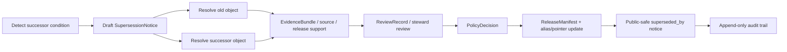

<!-- [KFM_META_BLOCK_V2]
doc_id: kfm://contract/correction/supersession-notice
title: contracts/correction/supersession_notice.md — SupersessionNotice Contract
type: contract
version: v0.2
status: draft
owners: OWNER_TBD — Correction steward · Release steward · Governance steward · Contract steward · Schema steward · Policy steward · Docs steward
created: 2026-06-20
updated: 2026-06-20
policy_label: public; contracts; correction; supersession-notice; semantic-contract; first-class-corrections; lineage; rollback-aware
related:
  - ./README.md
  - ./correction_notice.md
  - ../release/README.md
  - ../../schemas/contracts/v1/correction/supersession_notice.schema.json
  - ../../fixtures/correction/supersession_notice/
  - ../../tools/validators/correction/validate_supersession_notice.py
  - ../../policy/correction/
  - ../../policy/release/
  - ../../docs/doctrine/corrections-first-class.md
  - ../../docs/architecture/publication/CORRECTION.md
  - ../../docs/architecture/contract-schema-policy-split.md
  - ../../release/
  - ../../data/proofs/
tags: [kfm, contracts, correction, supersession-notice, supersession, correction, rollback, release, lineage, public-notice, evidence, governance]
notes:
  - "Expanded from a greenfield scaffold into the object-level SupersessionNotice semantic contract."
  - "Machine-checkable shape is in schemas/contracts/v1/correction/supersession_notice.schema.json, but that schema is explicitly a greenfield placeholder with only id required and additional properties allowed."
  - "The schema-declared validator path was not found in this session; validator behavior remains UNKNOWN / NEEDS VERIFICATION."
  - "SupersessionNotice is a lineage/public-notice artifact that names replacement of a prior published object; it is not the new release itself, not proof closure, not a ReleaseManifest, not a RollbackCard, and not policy approval by itself."
[/KFM_META_BLOCK_V2] -->

<a id="top"></a>

# SupersessionNotice Contract

> Semantic contract for `SupersessionNotice`, the named artifact that records that one published KFM claim, artifact, layer, release, report, answer, or other governed public object has been replaced by a newer governed object while the prior record remains inspectable in audit.

<p>
  
  
  
  
  
  
</p>

`contracts/correction/supersession_notice.md`

## Quick jumps

[Status](#status) · [Meaning](#meaning) · [Repo fit](#repo-fit) · [Schema pairing](#schema-pairing) · [Accepted uses](#accepted-uses) · [Exclusions](#exclusions) · [Fields](#fields) · [Recommended semantic fields](#recommended-semantic-fields) · [Invariants](#invariants) · [Supersession scenarios](#supersession-scenarios) · [Lifecycle](#lifecycle) · [Validation](#validation) · [No-loss preservation](#no-loss-preservation) · [Evidence basis](#evidence-basis) · [Rollback](#rollback) · [Definition of done](#definition-of-done)

---

## Status

> [!IMPORTANT]
> **Status:** `draft` / semantic contract  
> **Owner:** `OWNER_TBD`  
> **Contract path:** `contracts/correction/supersession_notice.md`  
> **Schema path:** `schemas/contracts/v1/correction/supersession_notice.schema.json`  
> **Truth posture:** `CONFIRMED` contract path, current update, correction doctrine, and placeholder schema presence. Validator path was not found. Field completeness, fixtures, policy behavior, release integration, public route/UI behavior, and tests remain `NEEDS VERIFICATION`.

---

## Meaning

`SupersessionNotice` is the semantic record that a prior published KFM object has been replaced by a successor while preserving append-only history.

It answers six questions:

1. **What prior object was superseded?** — the old release, claim, artifact, layer, answer, or record.
2. **What replaces it?** — the successor object, release, or public pointer.
3. **Why was it superseded?** — source update, correction, validation repair, sensitivity change, policy change, rights change, versioned improvement, or other governed reason.
4. **When did supersession become effective?** — the effective/public transition time.
5. **What evidence and review support the change?** — EvidenceBundle, ReviewRecord, PolicyDecision, ReleaseManifest, or related trust objects.
6. **How should public surfaces behave?** — mark old object superseded, link forward, preserve audit, and direct ordinary users to the successor where policy allows.

`SupersessionNotice` is a correction-family lineage artifact. It is not a silent overwrite and not a deletion.

---

## Repo fit

```text
contracts/
├── correction/
│   ├── README.md
│   ├── correction_notice.md
│   └── supersession_notice.md
└── release/
    ├── README.md
    ├── correction_notice.md
    ├── rollback_card.md
    └── withdrawal_notice.md

schemas/
└── contracts/
    └── v1/
        └── correction/
            └── supersession_notice.schema.json
```

Adjacent responsibility roots:

| Root | Relationship to this contract |
|---|---|
| `./README.md` | Correction-family directory boundary and doctrine summary. |
| `./correction_notice.md` | Related correction artifact for general correction reasons; supersession may be one correction outcome. |
| `../release/README.md` | Release-family boundary; release manifests and rollback cards remain separate. |
| `../../schemas/contracts/v1/correction/supersession_notice.schema.json` | Current placeholder schema for this semantic contract. |
| `../../fixtures/correction/supersession_notice/` | Schema-declared fixture root; existence/coverage remain `NEEDS VERIFICATION`. |
| `../../tools/validators/correction/validate_supersession_notice.py` | Schema-declared validator path; not found in this session. |
| `../../policy/correction/`, `../../policy/release/` | Policy decision homes for correction/release behavior. |
| `../../docs/doctrine/corrections-first-class.md` | Governing correction doctrine. |
| `../../docs/architecture/publication/CORRECTION.md` | Publication correction flow and supersession posture. |
| `../../release/` | Release state, manifests, aliases, rollback targets, supersession lineage. |
| `../../data/proofs/` | EvidenceBundle/proof support for supersession reasons. |

---

## Schema pairing

The paired schema is:

```text
schemas/contracts/v1/correction/supersession_notice.schema.json
```

The schema defines machine shape. This Markdown contract defines meaning.

The current schema metadata identifies:

| Schema metadata | Value | Verification posture |
|---|---|---|
| `$id` | `https://schemas.kfm.local/contracts/v1/correction/supersession_notice.schema.json` | `CONFIRMED` from schema. |
| `contract_doc` | `contracts/correction/supersession_notice.md` | `CONFIRMED` from schema metadata. |
| `fixtures_root` | `fixtures/correction/supersession_notice/` | `NEEDS VERIFICATION` existence/coverage. |
| `validator` | `tools/validators/correction/validate_supersession_notice.py` | `UNKNOWN / NOT FOUND` in this session. |
| `policy` | `policy/correction/` | `NEEDS VERIFICATION` existence/behavior. |
| `status` | `PROPOSED` | `CONFIRMED` from schema metadata. |

> [!CAUTION]
> The current schema is explicitly a greenfield placeholder. It only requires `id`, allows additional properties, and does not yet encode old/new release linkage, effective time, evidence linkage, or public notice requirements.

---

## Accepted uses

| Use | Allowed? | Rule |
|---|---:|---|
| Recording that a published object was replaced by a successor | Yes | Must preserve old object auditability and link forward to successor. |
| Expressing supersession caused by correction, source update, policy change, or versioned release | Yes | Must preserve reason and supporting evidence/review. |
| Linking old release and new release in public-safe notices | Conditional | Public wording must not leak restricted content. |
| Driving public stale/superseded badges | Conditional | UI/API behavior must come from governed release/publication surfaces. |
| Deleting or silently overwriting the prior object | No | Supersession is append-only and visible where appropriate. |
| Serving as the new release itself | No | ReleaseManifest remains the release authority. |
| Serving as rollback execution | No | RollbackCard/runbook/pipeline and release authority execute rollback. |

---

## Exclusions

| Does not belong in `SupersessionNotice` | Correct owner / surface |
|---|---|
| New release manifest body | ReleaseManifest / release contracts. |
| Old or new artifact payload | Artifact/release/data roots. |
| Full EvidenceBundle content | Evidence/proof root. |
| Full ReviewRecord body | Review/governance contract family. |
| Policy decision logic | `policy/correction/`, `policy/release/`, or appropriate policy root. |
| Alias repointing execution | Release root and publication pipeline. |
| Rollback execution mechanics | Rollback runbooks/pipelines and release authority. |
| Redacted sensitive details | Do not expose in public notice; link restricted evidence internally as policy allows. |
| Public UI badge implementation | Governed UI/app roots. |

---

## Fields

The current placeholder schema only defines these machine fields:

| Field | Required by current schema | Semantic meaning | Verification posture |
|---|---:|---|---|
| `id` | Yes | Canonical identifier for the supersession notice. | `CONFIRMED` schema field; format not constrained by current schema. |
| `version` | No | Contract/object version for the notice. | `CONFIRMED` schema field; semantics need stronger schema support. |
| `spec_hash` | No | Deterministic content/spec hash reference. | `CONFIRMED` schema field; current schema says string only and does not enforce `spec_hash` common pattern. |

---

## Recommended semantic fields

The doctrine and publication architecture require more semantic structure than the current placeholder schema enforces.

These fields are `PROPOSED` for future schema/fixture/validator work unless already adopted elsewhere:

| Field | Semantic role | Why it matters |
|---|---|---|
| `notice_id` or canonical `id` | Stable supersession notice identifier. | Makes the notice inspectable and linkable. |
| `supersedes` / `old_release` / `old_artifact` / `old_claim` | Prior object being replaced. | Prevents ambiguous lineage. |
| `superseded_by` / `new_release` / `new_artifact` / `new_claim` | Successor object. | Gives public and internal consumers a forward pointer. |
| `reason` / `defect_class` | Why supersession occurred. | Separates source update, error correction, rights change, policy change, and version improvement. |
| `effective_time` | When successor becomes effective. | Supports temporal query and public display. |
| `source_refs` / `evidence_refs` | Evidence supporting supersession. | Preserves cite-or-abstain and EvidenceBundle resolution. |
| `review_state` | Draft, steward review, approved, rejected, withdrawn, superseded. | Prevents unreviewed supersession publication. |
| `public_summary` | Human-readable public-safe summary. | Supports visible correction without leaking restricted details. |
| `rollback_target` | Release or route target if successor fails. | Supports reversible publication. |
| `policy_decision_ref` | Linked policy decision. | Separates notice semantics from policy authority. |
| `release_manifest_ref` | Linked release/supersession state. | Separates notice semantics from release authority. |
| `generated_receipt_ref` | AI-authorship receipt where applicable. | Keeps generated prose evidence-subordinate. |

---

## Invariants

A `SupersessionNotice` must preserve these invariants:

- supersession is append-only;
- the prior object remains inspectable unless access is restricted by policy;
- ordinary consumers should be pointed to the successor where policy allows;
- old and new objects must be distinguishable and linked;
- supersession must not silently rewrite or delete prior public history;
- the reason for supersession must be evidence-supported or the affected claim must ABSTAIN/DENY as appropriate;
- rights and sensitivity changes fail closed when evidence/policy is insufficient;
- public summaries must be safe for the intended audience;
- restricted details must not be exposed in public supersession notices;
- supersession notices do not replace EvidenceBundle, ReviewRecord, PolicyDecision, ReleaseManifest, RollbackCard, CorrectionNotice, or RedactionReceipt objects.

---

## Supersession scenarios

| Scenario | Required notice posture | Required external support |
|---|---|---|
| Source update | Link prior source-derived release to new source-derived release. | SourceDescriptor/DatasetVersion, comparison receipt, EvidenceBundle. |
| Error correction | Link defective claim/artifact to corrected successor. | CorrectionNotice, ReviewRecord, ReleaseManifest. |
| Validation repair | Link prior invalid/weakly validated artifact to validated successor. | ValidationReport, ReviewRecord, ReleaseManifest. |
| Rights change | Link prior public artifact to restricted/withdrawn/superseding posture. | PolicyDecision, legal/reviewer signoff where applicable. |
| Sensitivity change | Link prior representation to redacted/generalized successor. | Sensitivity policy, RedactionReceipt, ReviewRecord, ReleaseManifest. |
| Versioned improvement | Link older version to newer version without implying defect. | ReleaseManifest, changelog, evidence/provenance. |
| AI-answer correction | Link prior answer/envelope to corrected or abstained successor. | AIReceipt, RuntimeResponseEnvelope, EvidenceBundle, CitationValidationReport. |

---

## Lifecycle



Lifecycle notes:

- A notice may begin from source update, correction review, release promotion, policy review, validation repair, or derivative invalidation.
- Schema validation proves only shape.
- The old and new objects must resolve before a supersession can be trusted.
- Review/policy/release gates decide whether the supersession changes public behavior.
- Prior releases are not deleted or silently overwritten.

---

## Validation

Before relying on this contract, verify:

- schema expanded beyond the current greenfield placeholder or intentionally accepted as placeholder;
- validator path exists and behavior is implemented;
- fixtures cover source update, error correction, validation repair, rights change, sensitivity change, version improvement, and AI-answer correction cases;
- old and new object references resolve;
- prior release remains inspectable or restricted under documented policy;
- successor release/artifact/claim has evidence support;
- ReviewRecord and PolicyDecision links are present where consequential;
- ReleaseManifest and rollback target are linked where public release changes;
- public notice is safe and does not leak restricted details;
- tests fail on silent overwrite/deletion of prior published history.

---

## No-loss preservation

| Existing element | Disposition | Reason |
|---|---|---|
| Prior title/family/status scaffold | `KEEP + EXPAND` | Preserved correction family and proposed scaffold posture. |
| Schema path | `KEEP + GROUND` | Current placeholder schema exists and is cited. |
| Meaning section | `KEEP + REPLACE WITH CONCRETE SEMANTICS` | The scaffold asked what meaning should be; this edit supplies doctrine-grounded meaning. |
| Fields section | `KEEP + CLARIFY` | Current schema fields are documented, and recommended semantic fields are labeled `PROPOSED`. |
| Invariants | `KEEP + STRENGTHEN` | General invariant placeholders are replaced with supersession-specific trust invariants. |
| Lifecycle | `KEEP + CLARIFY` | Lifecycle now separates draft, old/new resolution, evidence, review, policy, release, public notice, and audit. |
| Open questions | `KEEP + MOVE INTO VALIDATION / DEFINITION OF DONE` | Verification gaps are now actionable. |

---

## Evidence basis

| Source | Status | Supports | Limits |
|---|---|---|---|
| Prior `contracts/correction/supersession_notice.md` scaffold | `CONFIRMED` | Target file existed as proposed greenfield scaffold with family and schema path. | It contained placeholders, not complete semantics. |
| `schemas/contracts/v1/correction/supersession_notice.schema.json` | `CONFIRMED placeholder` | Current schema exists; x-kfm metadata points to this contract, fixtures, validator, and policy; `id` is the only required field. | Schema explicitly says greenfield placeholder and does not enforce full supersession semantics. |
| `tools/validators/correction/validate_supersession_notice.py` | `UNKNOWN / NOT FOUND` | Schema-declared validator path was checked. | File was not found in this session; behavior is not implemented evidence. |
| `contracts/correction/README.md` | `CONFIRMED` | Correction directory README defines correction-family boundaries and notes placeholder schema / verification limits. | Does not complete object-level schema or validator behavior. |
| `contracts/correction/correction_notice.md` | `CONFIRMED` | CorrectionNotice semantics define general correction posture and link supersession as a correction scenario. | Does not replace this supersession-specific contract. |
| `docs/doctrine/corrections-first-class.md` | `CONFIRMED doctrine` | Supersession is a first-class correction pattern; history remains append-only and public-visible where appropriate. | Some implementation paths/fields remain proposed or verification-bound. |
| `docs/architecture/publication/CORRECTION.md` | `CONFIRMED doctrine / PROPOSED implementation` | Publication correction architecture defines supersession lineage, prior/new release relationship, trust membrane, and cite-or-abstain. | Route names, schema homes, and implementation maturity remain proposed unless separately verified. |

---

## Rollback

Rollback is required if this contract is used to claim schema completeness, validator coverage, policy enforcement, release execution, alias movement, public-route behavior, or implementation maturity not verified in this session.

Rollback target: prior scaffold content SHA `ec33f599707e34a2076c241f453923f082a84139`.

---

## Definition of done

- [ ] Owners are confirmed and `OWNER_TBD` is replaced.
- [ ] Schema is expanded beyond greenfield placeholder or placeholder status is intentionally accepted.
- [ ] Validator path exists and behavior is implemented.
- [ ] Fixtures cover supersession scenarios and invalid cases.
- [ ] Old and new object references are required and validated.
- [ ] EvidenceRef/EvidenceBundle linkage is required where consequential.
- [ ] ReviewRecord and PolicyDecision linkage is defined and tested.
- [ ] ReleaseManifest / rollback target / alias movement linkage is testable.
- [ ] Public-safe supersession notice behavior is verified.
- [ ] Tests fail on silent overwrite or deletion of prior published history.

---

## Status summary

`SupersessionNotice` is the semantic trust object that records an append-only replacement relationship between an old published object and a successor. It is not the new release, not proof closure, not policy approval, not release approval, not rollback execution, not alias movement, and not permission to silently overwrite or delete prior published history.

<p align="right"><a href="#top">Back to top</a></p>
