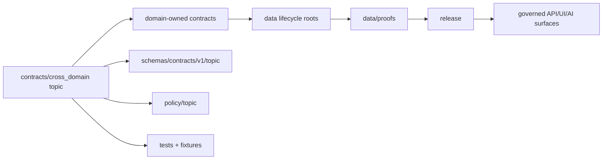

<!-- [KFM_META_BLOCK_V2]
doc_id: kfm://doc/contracts-cross-domain-readme
title: contracts/cross_domain/ — Cross-Domain Semantic Contracts
type: readme
version: v0.1
status: draft
owners: OWNER_TBD — Contract steward · Architecture steward · Domain stewards · Schema steward · Policy steward · Validation steward · Docs steward
created: 2026-06-20
updated: 2026-06-20
policy_label: public; contracts; cross-domain; semantic-contracts; placement; shared-topic; non-domain-root
tags: [kfm, contracts, cross-domain, semantic-contracts, domain-placement-law, lowest-common-responsibility-root, anti-parallel-authority, shared-topic, governance]
related:
  - ../README.md
  - ../../docs/architecture/cross-domain/multi-domain-placement.md
  - ../../docs/architecture/domain-placement-law.md
  - ../../docs/architecture/contract-schema-policy-split.md
  - ../../docs/architecture/ecology-cross-domain.md
  - ../../schemas/contracts/v1/
  - ../../policy/
  - ../../fixtures/
  - ../../tests/
  - ../../tools/validators/
  - ../../data/proofs/
  - ../../release/
notes:
  - "Initial README for the current contracts/cross_domain directory."
  - "Path posture is NEEDS VERIFICATION: cross-domain placement doctrine uses contracts/<topic>/... for cross-domain semantic contracts, but topic naming conventions and underscore vs hyphen form require review."
  - "This folder may coordinate cross-domain semantic contracts, but it must not become a new domain root or duplicate domain-owned contract authority."
  - "No paired schemas/contracts/v1/cross_domain schema home or validator was verified in this task."
[/KFM_META_BLOCK_V2] -->

<a id="top"></a>

# Cross-Domain Semantic Contracts

> Directory contract for semantic contracts whose responsibility legitimately spans two or more KFM domains. This folder coordinates cross-domain meaning; it does not absorb domain ownership, create a new domain, or override domain-owned contracts.

<p>
  
  
  
  
  
  
</p>

`contracts/cross_domain/`

## Quick jumps

[Status](#status) · [Scope](#scope) · [Path posture](#path-posture) · [Repo fit](#repo-fit) · [Accepted inputs](#accepted-inputs) · [Exclusions](#exclusions) · [Current directory snapshot](#current-directory-snapshot) · [Contract inventory](#contract-inventory) · [Cross-domain placement rules](#cross-domain-placement-rules) · [Semantic contract rules](#semantic-contract-rules) · [Lifecycle and trust boundary](#lifecycle-and-trust-boundary) · [Validation](#validation) · [Evidence basis](#evidence-basis) · [Rollback](#rollback) · [Definition of done](#definition-of-done)

---

## Status

> [!IMPORTANT]
> **Status:** `draft` / directory README  
> **Owner:** `OWNER_TBD`  
> **Path:** `contracts/cross_domain/`  
> **Path posture:** `CONFIRMED` current requested path; canonical naming and topic segmentation `NEEDS VERIFICATION`  
> **Truth posture:** `CONFIRMED` current file update and cross-domain placement doctrine. Paired schemas, validators, fixtures, policies, contract inventory, CI behavior, and downstream usage remain `NEEDS VERIFICATION`.

---

## Scope

`contracts/cross_domain/` is a semantic-contract coordination folder for cross-domain KFM concepts.

A cross-domain contract belongs here only when:

- it is truly a **contract**;
- it spans two or more KFM domains;
- no single domain is the correct owner;
- placing it under one domain would create a parallel authority or forced crosswalk;
- the contract preserves ownership of atomic facts in their bounded contexts.

This folder does **not** define schema shape, policy rules, executable validators, fixtures, data, release state, proof closure, public API behavior, public UI behavior, or domain ownership.

---

## Path posture

The requested path is:

```text
contracts/cross_domain/
```

Cross-domain placement doctrine says cross-domain semantic contracts use the `contracts/<topic>/...` responsibility root pattern. That means `contracts/cross_domain/` can be treated as a cross-domain topic segment, but its final naming convention needs review because the cross-domain placement doc emphasizes stable `<topic>` names and examples usually use descriptive topic names.

| Path | Status | Meaning |
|---|---|---|
| `contracts/cross_domain/` | `CONFIRMED` current requested folder path | Current cross-domain contract coordination folder. |
| `contracts/<topic>/...` | `CONFIRMED doctrine pattern` / per-topic names `NEEDS VERIFICATION` | Preferred pattern for cross-domain semantic contracts. |
| `contracts/domains/<picked-one>/...` | `DENIED` for true cross-domain contracts | Would create domain-as-owner drift. |
| `schemas/contracts/v1/<topic>/...` | `PROPOSED` / `NEEDS VERIFICATION` | Machine-shape home for cross-domain schemas, if present. |
| `policy/<topic>/...` | `PROPOSED` / `NEEDS VERIFICATION` | Policy home for cross-domain rules, if present. |

---

## Repo fit

```text
contracts/
├── README.md
└── cross_domain/
    └── README.md
```

Adjacent responsibility roots:

| Root | Relationship to this folder |
|---|---|
| `../README.md` | Root contract guidance: contracts define meaning; schemas define shape. |
| `../../docs/architecture/cross-domain/multi-domain-placement.md` | Cross-domain placement standard for contracts, schemas, policy, validators, fixtures, and tests. |
| `../../docs/architecture/domain-placement-law.md` | Domain Placement Law: domains are lanes inside responsibility roots; cross-domain files use lowest common responsibility root. |
| `../../docs/architecture/contract-schema-policy-split.md` | Meaning/shape/admissibility/enforceability split. |
| `../../schemas/contracts/v1/` | Machine schema root; cross-domain schemas should use topic segment after accepted placement. |
| `../../policy/` | Cross-domain admissibility rules after accepted placement. |
| `../../tools/validators/` | Cross-domain validators after accepted placement. |
| `../../fixtures/`, `../../tests/` | Fixtures and enforceability. |
| `../../data/proofs/` | EvidenceBundle and proof support for cross-domain claims. |
| `../../release/` | Release state for any public cross-domain product. |

---

## Accepted inputs

| Belongs in this directory | Required posture |
|---|---|
| Cross-domain semantic contract README files | Must define composite meaning without absorbing owning-domain facts. |
| Cross-domain relation contracts | Must state every participating domain and the owner of each atomic fact. |
| Cross-domain derived product contracts | Must identify source domains, EvidenceBundle dependencies, policy gates, and release posture. |
| Compatibility notes | Must document placement conflicts and ADR triggers. |
| Evidence ledgers | Must cite placement doctrine, owning-domain docs, and current file evidence. |
| Validation checklists | Must point to schema/test/policy roots without claiming they exist unless verified. |
| Rollback notes | Must name prior content SHA or migration rollback target. |

---

## Exclusions

| Does not belong here | Correct home |
|---|---|
| Single-domain contract | `contracts/domains/<domain>/...` or accepted domain contract home. |
| JSON Schema | `schemas/contracts/v1/<topic>/...` or accepted schema home. |
| Policy rules | `policy/<topic>/...` or accepted policy home. |
| Validator code | `tools/validators/<topic>/...` or accepted validator package. |
| Fixtures and tests | `fixtures/<topic>/...`, `tests/<topic>/...`, or accepted test roots. |
| Source data, RAW, WORK, QUARANTINE, PROCESSED, CATALOG, TRIPLET, PUBLISHED records | `data/...` lifecycle roots. |
| EvidenceBundle/proof content | `data/proofs/` or accepted proof root. |
| Release manifests and current aliases | `release/`. |
| Public API or UI behavior | Governed app/UI roots after validation and release. |
| New repo root such as `cross_domain/` at root | Denied by responsibility-root discipline. |
| Duplicate domain doctrine | Domain docs should link to the cross-domain contract, not copy it. |

---

## Current directory snapshot

> [!NOTE]
> This snapshot is based on current-session file inspection, not a complete repository inventory.

| File | Status | What it proves | What it does not prove |
|---|---|---|---|
| `contracts/cross_domain/README.md` | `CONFIRMED` | This directory README exists and states cross-domain contract boundaries. | Does not prove cross-domain contract inventory, schemas, validators, policy, or CI behavior. |
| Other `contracts/cross_domain/*` files | `UNKNOWN` | Not verified by this README. | Requires separate inventory. |

---

## Contract inventory

No concrete cross-domain contract files beyond this README were verified in this task.

| Contract family | Current evidence | Status | Notes |
|---|---|---|---|
| Cross-domain relation contract | `UNKNOWN` | `NEEDS VERIFICATION` | Must name relation topic and participating domains. |
| Cross-domain derived product contract | `UNKNOWN` | `NEEDS VERIFICATION` | Must identify source domains, evidence, policy, and release gates. |
| Cross-domain sensitivity inheritance contract | `UNKNOWN` | `NEEDS VERIFICATION` | Must preserve most restrictive policy posture. |
| Cross-domain join/projection contract | `UNKNOWN` | `NEEDS VERIFICATION` | Must not create derived truth without source/evidence support. |
| Cross-domain public-safe summary contract | `UNKNOWN` | `NEEDS VERIFICATION` | Must include redaction/generalization/aggregation and release posture. |

---

## Cross-domain placement rules

Cross-domain contracts must preserve the Domain Placement Law:

- choose the lowest responsibility root by file responsibility;
- for semantic contracts, use `contracts/<topic>/...` rather than `contracts/domains/<picked-one>/...`;
- do not make a domain the owner of a multi-domain file merely because it is convenient;
- do not create new root folders;
- use stable topic segments;
- cross-link from each affected domain dossier rather than duplicating content;
- treat topic renames as ADR-class when links or public meaning would break.

---

## Semantic contract rules

Each cross-domain semantic contract must state:

- the cross-domain topic name;
- participating domains;
- owning domain for each atomic fact;
- why no single domain owns the contract;
- accepted inputs and exclusions;
- source-role boundaries;
- identity and temporal semantics;
- sensitivity inheritance and most-restrictive policy posture;
- EvidenceRef/EvidenceBundle requirements;
- policy gates and review posture;
- release and rollback expectations;
- downstream API/UI/AI boundaries;
- migration and rollback path if ownership later changes.

---

## Lifecycle and trust boundary



Contracts describe meaning. They do not validate schemas, decide policy, create evidence, move lifecycle data, release artifacts, expose sensitive data, or serve public clients.

---

## Validation

Before relying on this directory, verify:

- naming convention for `cross_domain` versus a more specific `<topic>` segment;
- inventory of all files under `contracts/cross_domain/`;
- every cross-domain contract lists participating domains and owning domains for atomic facts;
- no contract duplicates domain-owned semantics;
- matching schemas exist in accepted cross-domain schema homes or gaps are marked `NEEDS VERIFICATION`;
- policy roots exist for cross-domain allow/deny/restrict/abstain behavior where needed;
- validators, fixtures, and tests enforce cross-domain joins, source-role boundaries, evidence references, and sensitivity inheritance;
- release and rollback records exist for public cross-domain products;
- public API/UI/AI surfaces use governed, released, policy-safe outputs and do not read RAW/WORK/QUARANTINE or internal stores directly.

---

## Evidence basis

| Source | Status | Supports | Limits |
|---|---|---|---|
| `contracts/cross_domain/README.md` before this edit | `CONFIRMED` | Target file existed but was blank. | No directory contract content before this edit. |
| `contracts/README.md` | `CONFIRMED` | Contracts define semantic meaning; schemas define shape; executable validation, JSON Schema, policy code, and source data do not belong in contracts. | Root README does not inventory cross-domain contracts. |
| `docs/architecture/cross-domain/multi-domain-placement.md` | `CONFIRMED doctrine / PROPOSED paths` | Cross-domain semantic contracts belong under `contracts/<topic>/...`, not under one picked domain; responsibility roots remain canonical. | Some path naming issues and OPEN-DR items remain unresolved. |
| `docs/architecture/domain-placement-law.md` | `CONFIRMED derived doctrine` | Domain is a lane inside responsibility roots, not a root folder; cross-domain joins remain possible through shaped lanes and lowest common roots. | Concrete paths in that doc are often marked PROPOSED until repo verification. |
| `docs/architecture/ecology-cross-domain.md` | `CONFIRMED example doctrine` | Cross-domain ecology/biodiversity composition preserves atomic ownership in fauna, flora, habitat, etc. | Ecology is one example, not the full cross-domain inventory. |

---

## Rollback

Rollback is required if this README is used to claim that `cross_domain` is a domain, to create a new repo root, to duplicate domain-owned authority, to claim schemas/policy/validators exist without verification, or to bypass source/evidence/policy/release gates.

Rollback target: prior blank file content SHA `8b137891791fe96927ad78e64b0aad7bded08bdc`.

---

## Definition of done

- [ ] Owners are confirmed and `OWNER_TBD` is replaced.
- [ ] Naming convention for `cross_domain` is resolved or renamed by ADR/migration note.
- [ ] Full `contracts/cross_domain/` inventory is generated.
- [ ] Each contract identifies participating domains and owning domains for atomic facts.
- [ ] Matching schemas, policy bundles, validators, fixtures, and tests are linked or gaps are marked.
- [ ] Sensitivity inheritance and most-restrictive policy behavior are testable.
- [ ] Release and rollback posture is defined for every public cross-domain product.
- [ ] Affected domain docs cross-link here without duplicating doctrine.
- [ ] No schema, policy, data, proof, release, API, UI, AI, or publication authority is asserted from this folder.

---

## Status summary

`contracts/cross_domain/` is a semantic contract coordination folder for true cross-domain topics. It is not a domain, not a schema home, not a policy home, not a validator package, not a fixture store, not a data lifecycle root, not a proof root, not a release authority, not a public API/UI surface, and not a way to bypass domain ownership.

<p align="right"><a href="#top">Back to top</a></p>
