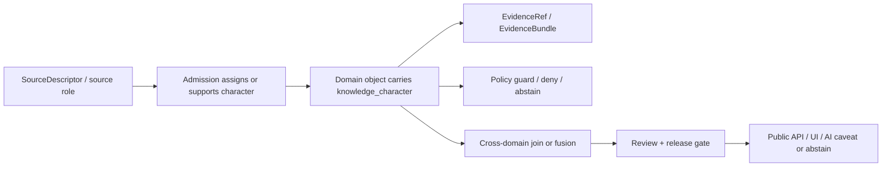

<!-- [KFM_META_BLOCK_V2]
doc_id: kfm://contract/cross-domain/knowledge-character
title: contracts/cross_domain/knowledge_character.md — KnowledgeCharacter Cross-Domain Contract
type: contract
version: v0.2
status: draft
owners: OWNER_TBD — Architecture steward · Atmosphere steward · Source steward · Contract steward · Schema steward · Policy steward · Validation steward · Docs steward
created: 2026-06-20
updated: 2026-06-20
policy_label: public; contracts; cross-domain; knowledge-character; semantic-contract; source-role-anti-collapse; evidence-aware
related:
  - ./README.md
  - ../common/identity_token.md
  - ../common/spec_hash.md
  - ../../docs/domains/atmosphere/VERIFICATION_BACKLOG.md
  - ../../docs/domains/atmosphere/KNOWLEDGE_CHARACTERS.md
  - ../../docs/domains/atmosphere/KNOWLEDGE_CHARACTER_REGISTRY.md
  - ../../docs/architecture/cross-domain/multi-domain-placement.md
  - ../../docs/architecture/domain-placement-law.md
  - ../../docs/architecture/contract-schema-policy-split.md
  - ../../schemas/contracts/v1/
  - ../../policy/
  - ../../tools/validators/
  - ../../fixtures/
  - ../../tests/
  - ../../data/registry/sources/
  - ../../data/proofs/
  - ../../release/
tags: [kfm, contracts, cross-domain, knowledge-character, source-role, anti-collapse, atmosphere, evidence, policy, release, governance]
notes:
  - "Expanded from a scaffold sourced from docs/domains/atmosphere/VERIFICATION_BACKLOG.md."
  - "Knowledge-character vocabulary is currently best evidenced in Atmosphere docs; this cross-domain contract records the broader semantic pattern without claiming a verified cross-domain schema."
  - "No paired schemas/contracts/v1/cross_domain/knowledge_character.schema.json or validator was verified in this task."
  - "Canonical enum values and machine-registry home remain OPEN / NEEDS VERIFICATION in the Atmosphere registry docs."
[/KFM_META_BLOCK_V2] -->

<a id="top"></a>

# KnowledgeCharacter Cross-Domain Contract

> Semantic contract for `knowledge_character`, a cross-domain source-role anti-collapse marker that records what epistemic kind a governed KFM object is, so measurements, models, regulatory records, summaries, masks, advisories, and derived fusions are not silently treated as interchangeable truth.

<p>
  
  
  
  
  
  
</p>

`contracts/cross_domain/knowledge_character.md`

## Quick jumps

[Status](#status) · [Meaning](#meaning) · [Repo fit](#repo-fit) · [Schema and registry posture](#schema-and-registry-posture) · [Accepted uses](#accepted-uses) · [Exclusions](#exclusions) · [Recommended fields](#recommended-fields) · [Invariants](#invariants) · [Atmosphere vocabulary basis](#atmosphere-vocabulary-basis) · [Cross-domain semantics](#cross-domain-semantics) · [Lifecycle](#lifecycle) · [Validation](#validation) · [No-loss preservation](#no-loss-preservation) · [Evidence basis](#evidence-basis) · [Rollback](#rollback) · [Definition of done](#definition-of-done)

---

## Status

> [!IMPORTANT]
> **Status:** `draft` / semantic contract  
> **Owner:** `OWNER_TBD`  
> **Contract path:** `contracts/cross_domain/knowledge_character.md`  
> **Schema path:** `UNKNOWN / NEEDS VERIFICATION`  
> **Truth posture:** `CONFIRMED` current contract path, current update, scaffold source, Atmosphere knowledge-character vocabulary evidence, and cross-domain placement doctrine. Cross-domain schema, validator, fixture coverage, policy behavior, canonical enum values, machine-registry home, and downstream usage remain `NEEDS VERIFICATION`.

---

## Meaning

`knowledge_character` is a semantic marker for the epistemic character of a KFM object.

It answers this question:

> What kind of knowledge is this object: observed, reported, regulatory, modeled, derived, advisory, contextual, network metadata, or something else that must not collapse into another kind?

The immediate evidence for this contract comes from the Atmosphere lane, where knowledge character is used to prevent acute authority collapse between observed sensor readings, public AQI reports, regulatory archives, low-cost sensors, atmospheric model fields, remote-sensing masks, climate/anomaly context, derived fusion, meteorological context, alert/advisory context, and network/site context.

This cross-domain contract records the broader semantic discipline: when a KFM object crosses domain boundaries, the consumer must know what epistemic class the object belongs to before using it as evidence, publishing it, joining it, rendering it, or passing it to an AI surface.

---

## Repo fit

```text
contracts/
└── cross_domain/
    ├── README.md
    └── knowledge_character.md

schemas/
└── contracts/
    └── v1/
        └── <topic-or-domain>/knowledge_character.schema.json  # NEEDS VERIFICATION
```

Adjacent responsibility roots:

| Root | Relationship to this contract |
|---|---|
| `./README.md` | Cross-domain contract directory boundary and anti-parallel-authority rules. |
| `../../docs/domains/atmosphere/KNOWLEDGE_CHARACTERS.md` | Canonical Atmosphere prose explainer for the current vocabulary evidence. |
| `../../docs/domains/atmosphere/KNOWLEDGE_CHARACTER_REGISTRY.md` | Atmosphere registry index and open enum/machine-registry posture. |
| `../../docs/domains/atmosphere/VERIFICATION_BACKLOG.md` | Source scaffold and verification backlog for knowledge-character enforcement. |
| `../../schemas/contracts/v1/` | Machine-shape root. No paired cross-domain schema was verified here. |
| `../../policy/` | Deny/abstain/restrict behavior for anti-collapse and release gates. |
| `../../tools/validators/`, `../../fixtures/`, `../../tests/` | Enforceability homes. |
| `../../data/registry/sources/` | SourceDescriptor records that may declare or support knowledge character. |
| `../../data/proofs/` | EvidenceBundle/proof support. |
| `../../release/` | Release state and public posture. |

---

## Schema and registry posture

No paired cross-domain schema was verified in this task.

The Atmosphere registry docs state that:

- the terms are confirmed as ubiquitous language for Atmosphere;
- exact machine enum values are open;
- the machine-readable registry home is open / ADR-class;
- the human-readable registry index is not the machine artifact;
- validators and policy enforcement are proposed / need verification.

| Artifact | Status | Notes |
|---|---|---|
| `contracts/cross_domain/knowledge_character.md` | `CONFIRMED` current contract path | This file. |
| `schemas/contracts/v1/cross_domain/knowledge_character.schema.json` | `UNKNOWN / NOT FOUND IN SEARCH` | No paired schema verified. |
| `contracts/domains/atmosphere/knowledge_character.md` | `NEEDS VERIFICATION` | Mentioned as desired evidence in the Atmosphere backlog, not verified here. |
| `schemas/contracts/v1/domains/atmosphere/knowledge_character.schema.json` | `NEEDS VERIFICATION` | Mentioned as desired evidence in the Atmosphere backlog. |
| Machine registry home | `OPEN / ADR-class` | Atmosphere registry says placement needs ADR. |
| Canonical enum values | `OPEN` | Atmosphere registry flags enum values as open. |

---

## Accepted uses

| Use | Allowed? | Rule |
|---|---:|---|
| Preventing source-role or epistemic collapse | Yes | Consumers must preserve and check knowledge character before treating data as evidence. |
| Labeling a cross-domain join input | Yes | Carry per-input knowledge character; do not collapse derived fusion into observation. |
| Public UI/API/AI disclosure of evidence type | Conditional | Display only governed, public-safe labels and caveats. |
| Driving DENY/ABSTAIN for invalid transformations | Yes | Policy/validator must deny or abstain when a record masquerades as another knowledge type. |
| Replacing SourceDescriptor source role | No | SourceDescriptor source role remains fixed at admission and separate from object-level knowledge character. |
| Proving evidence validity | No | EvidenceBundle/proofs are required. |
| Freezing machine enum values | No | Enum values remain open until ADR/schema/registry closure. |

---

## Exclusions

| Does not belong in `knowledge_character` | Correct owner / surface |
|---|---|
| Full source descriptor | `data/registry/sources/` and source contracts. |
| Machine enum registry artifact | Accepted registry/control-plane/data home after ADR. |
| JSON Schema | `schemas/contracts/v1/<topic-or-domain>/...`. |
| Policy deny logic | `policy/<topic-or-domain>/...`. |
| Validator implementation | `tools/validators/<topic-or-domain>/...`. |
| Fixtures and tests | `fixtures/`, `tests/`. |
| Evidence/proof body | `data/proofs/`. |
| Release/public posture | `release/` and release contracts. |
| Public UI/API implementation | Governed app/API/UI roots. |
| Domain-specific vocabulary ownership | Owning domain docs/contracts remain authoritative for their own terms. |

---

## Recommended fields

These fields are `PROPOSED` for future schema/registry work unless already accepted elsewhere:

| Field | Semantic role | Why it matters |
|---|---|---|
| `knowledge_character` | Closed or registry-backed label for epistemic kind. | Prevents observed/modeled/regulatory/advisory/derived collapse. |
| `source_role_ref` | Link to SourceDescriptor/source role basis. | Preserves admission-time source-role boundary. |
| `evidence_ref` | Link to evidence supporting the label. | Enables cite-or-abstain. |
| `time_basis` | Time kind used to characterize the object. | Prevents observed/published/effective/release-time collapse. |
| `release_caveat` | Public-safe caveat required for some characters. | Supports UI/API/AI exposure without overclaiming. |
| `fusion_basis` | Per-input characters for derived fusion. | Prevents fusion output from masquerading as observation. |
| `policy_decision_ref` | Linked deny/allow/restrict/abstain decision. | Keeps policy authority separate from the label. |
| `review_state` | Steward review status for contentious labels. | Supports governance and correction. |

---

## Invariants

A `knowledge_character` contract must preserve these invariants:

- the label is epistemic, not decorative;
- the label must not be edited in place when it participates in identity or release posture;
- re-characterizing a record is a new governed identity or correction path, not a mutation;
- one knowledge character must not masquerade as another;
- missing or unknown knowledge character fails closed where material;
- model fields are not observations;
- public AQI reports are not concentrations;
- AOD/remote-sensing masks are not PM2.5 ground truth;
- low-cost sensor outputs need public caveats before release;
- alert/advisory context is not life-safety authority;
- derived fusion must retain per-input lineage;
- public and AI surfaces must cite, caveat, abstain, deny, or redirect rather than overclaim.

---

## Atmosphere vocabulary basis

Atmosphere currently provides the strongest evidence for this contract.

| Knowledge character | Role in Atmosphere docs | Cross-domain caution |
|---|---|---|
| `OBSERVED_SENSOR` | Direct instrument reading. | Must not be confused with model, advisory, or aggregate context. |
| `PUBLIC_AQI_REPORT` | Agency AQI report. | AQI is not concentration. |
| `REGULATORY_ARCHIVE` | Archived regulatory dataset/determination. | Preserve vintage and regulatory context. |
| `LOW_COST_SENSOR` | Community/consumer-grade reading. | Public caveats/confidence/limitations required. |
| `ATMOSPHERIC_MODEL_FIELD` | NWP/CTM/reanalysis/model output. | Never an observation. |
| `REMOTE_SENSING_MASK` | Satellite raster/mask/AOD/smoke/fire product. | AOD is not PM2.5; masks are not ground truth. |
| `CLIMATE_ANOMALY_CONTEXT` | Departure-from-baseline context. | Not a per-place event by itself. |
| `DERIVED_FUSION` | Multi-source blended product. | Must carry per-input knowledge characters. |
| `METEOROLOGICAL_CONTEXT` | Supporting meteorology. | Context does not become the variable it supports. |
| `ALERT_AND_ADVISORY_CONTEXT` | Advisory context. | Not the official alerting authority. |
| `NETWORK_AND_SITE_CONTEXT` | Network/site metadata. | Metadata is not observation value. |

---

## Cross-domain semantics

Knowledge character becomes cross-domain when one domain consumes another domain's object or derivative.

Examples:

| Cross-domain use | Required behavior |
|---|---|
| Atmosphere smoke mask used by Hazards | Preserve `REMOTE_SENSING_MASK`; do not treat as confirmed fire or life-safety alert. |
| Atmosphere model field used by Agriculture | Preserve `ATMOSPHERIC_MODEL_FIELD`; do not treat forecast/model cell as observed field condition. |
| Climate anomaly used by Habitat/Fauna | Preserve `CLIMATE_ANOMALY_CONTEXT`; carry baseline/reference period and avoid per-occurrence overclaim. |
| Derived fusion used by public Focus Mode | Preserve `DERIVED_FUSION` and all per-input characters; include caveats or abstain. |
| Alert/advisory reference used by public UI | Preserve official-source boundary; redirect to authority and avoid life-safety instructions. |

---

## Lifecycle



Lifecycle notes:

- Knowledge character is set at or derived from admission/evidence context.
- It must travel with the object through joins and derived products.
- Re-characterization requires correction/supersession, not silent mutation.
- Public exposure requires caveats, policy checks, and release state where applicable.

---

## Validation

Before relying on this contract, verify:

- canonical placement of cross-domain vs domain-specific knowledge-character contract;
- paired schema or machine registry exists and is accepted;
- canonical enum values are resolved by ADR or accepted registry;
- every SourceDescriptor or object requiring a character has exactly one where material;
- validators deny AQI-as-concentration, AOD-as-PM2.5, model-as-observed, advisory-as-alert-authority, and low-cost-sensor-without-caveat cases;
- derived fusion carries per-input `knowledge_character` values;
- public UI/API/AI surfaces expose caveats and freshness labels where needed;
- release gates fail closed for missing/unknown/conflicting character;
- corrections/supersessions exist for re-characterization.

---

## No-loss preservation

| Existing scaffold element | Disposition | Reason |
|---|---|---|
| Scaffold source path | `KEEP + GROUND` | The file was created from Atmosphere verification backlog references. |
| Proposed status | `KEEP + EXPAND` | Implementation and schema maturity remain unverified. |
| Source documents list | `KEEP + EXPAND` | Added registry, explainer, placement, and contract-schema-policy split docs. |
| Machine-shape warning | `KEEP + STRENGTHEN` | Added explicit schema/registry/validator unknowns. |
| Replace-before-canonical note | `KEEP + IMPLEMENT` | Replaced scaffold with reviewed semantic content while retaining verification warnings. |

---

## Evidence basis

| Source | Status | Supports | Limits |
|---|---|---|---|
| Prior `contracts/cross_domain/knowledge_character.md` scaffold | `CONFIRMED` | Target file existed and identified Atmosphere verification backlog as source. | Scaffold did not define authoritative semantics. |
| `contracts/cross_domain/README.md` | `CONFIRMED` | Cross-domain contracts coordinate meaning without absorbing domain ownership or creating new authority. | Does not prove individual contract inventory. |
| `docs/domains/atmosphere/VERIFICATION_BACKLOG.md` | `CONFIRMED` | Atmosphere carries acute anti-collapse requirements and lists knowledge-character verification items. | Backlog rows are not implementation proof. |
| `docs/domains/atmosphere/KNOWLEDGE_CHARACTERS.md` | `CONFIRMED doctrine / PROPOSED implementation` | Defines knowledge character, anti-collapse rule, and Atmosphere vocabulary. | Machine enum and registry remain open. |
| `docs/domains/atmosphere/KNOWLEDGE_CHARACTER_REGISTRY.md` | `CONFIRMED index / OPEN registry posture` | Controlled vocabulary index and explicit warning that enum/machine registry are open. | Human-readable index is not the machine artifact. |
| `docs/architecture/cross-domain/multi-domain-placement.md` | `CONFIRMED doctrine / PROPOSED paths` | Cross-domain semantic contracts belong under `contracts/<topic>/...` and must avoid picked-domain ownership. | Topic naming remains review-bound. |

---

## Rollback

Rollback is required if this contract is used to claim a verified schema, canonical enum, implemented validator, machine registry, policy enforcement, public release, or domain-independent authority that has not been verified.

Rollback target: prior scaffold content SHA `2669244a79eb46070324196e00346bb2ee41a0eb`.

---

## Definition of done

- [ ] Owners are confirmed and `OWNER_TBD` is replaced.
- [ ] Canonical placement is resolved: cross-domain contract, domain contract, or both with compatibility rules.
- [ ] Machine registry home is resolved by ADR or accepted placement note.
- [ ] Canonical enum values are accepted and versioned.
- [ ] Paired schema exists and references this contract or approved canonical contract.
- [ ] Validators and fixtures enforce anti-collapse and negative cases.
- [ ] Policy denies/abstains on missing, conflicting, or misused knowledge character.
- [ ] SourceDescriptor and object-family contracts link the character to evidence/source role/time/release state.
- [ ] Public UI/API/AI surfaces show caveats/freshness and do not overclaim.
- [ ] Re-characterization routes through CorrectionNotice/SupersessionNotice rather than in-place mutation.

---

## Status summary

`knowledge_character` is a semantic anti-collapse marker for epistemic kind. It is not source role itself, not EvidenceBundle, not a schema registry, not policy approval, not proof of truth, not public release permission, and not a display-only tag.

<p align="right"><a href="#top">Back to top</a></p>
