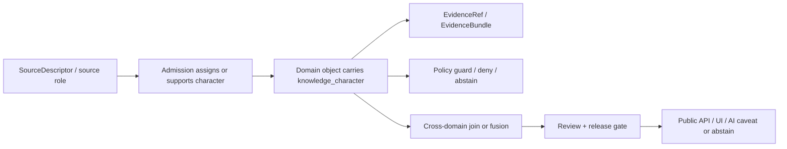

<!-- [KFM_META_BLOCK_V2]
doc_id: kfm://contract/cross-domain/knowledge-character
title: contracts/cross_domain/knowledge_character.md — KnowledgeCharacter Cross-Domain Contract
type: contract
version: v0.3
status: draft
owners: OWNER_TBD — Architecture steward · Atmosphere steward · Source steward · Contract steward · Schema steward · Policy steward · Validation steward · Docs steward
created: 2026-06-20
updated: 2026-09-08
policy_label: public; contracts; cross-domain; knowledge-character; semantic-contract; source-role-anti-collapse; evidence-aware; fixture-scoped-validation
owning_root: contracts/
responsibility: Define cross-domain epistemic-character meaning and anti-collapse invariants while preserving domain-owned vocabulary, source-role, evidence, policy, review, lifecycle, and release authority.
truth_posture: cite-or-abstain
related:
  - ./README.md
  - ../common/identity_token.md
  - ../common/spec_hash.md
  - ../../docs/domains/atmosphere/VERIFICATION_BACKLOG.md
  - ../../docs/domains/atmosphere/KNOWLEDGE_CHARACTERS.md
  - ../../docs/domains/atmosphere/KNOWLEDGE_CHARACTER_REGISTRY.md
  - ../../docs/architecture/cross-domain/multi-domain-placement.md
  - ../../docs/architecture/domain-placement-law.md
  - ../../docs/architecture/contract-schema-policy-split.md
  - ../domains/atmosphere/knowledge_character.md
  - ../evidence/claim_envelope.md
  - ../../schemas/contracts/v1/domains/atmosphere/knowledge_character.schema.json
  - ../../data/registry/sources/atmosphere/knowledge_character.json
  - ../../fixtures/domains/atmosphere/knowledge_character/README.md
  - ../../tools/validators/domains/atmosphere/validate_knowledge_character.py
  - ../../tests/domains/atmosphere/test_knowledge_character_registry.py
  - ../../.github/workflows/domain-atmosphere.yml
  - ../../schemas/contracts/v1/
  - ../../policy/
  - ../../tools/validators/
  - ../../fixtures/
  - ../../tests/
  - ../../data/registry/sources/
  - ../../data/proofs/
  - ../../release/
tags: [kfm, contracts, cross-domain, knowledge-character, source-role, anti-collapse, atmosphere, evidence, policy, release, governance]
notes:
  - "Expanded from a scaffold sourced from docs/domains/atmosphere/VERIFICATION_BACKLOG.md."
  - "Knowledge-character vocabulary is currently best evidenced in Atmosphere docs; this cross-domain contract records the broader semantic pattern without claiming a verified cross-domain schema."
  - "No schemas/contracts/v1/cross_domain/knowledge_character.schema.json exists at this revision."
  - "The Atmosphere lane has a draft semantic contract, permissive proposed schema, placeholder registry record, and a bounded six-character synthetic validator/fixture/test profile; none creates generic cross-domain enforcement."
  - "Canonical enum values and machine-registry home remain OPEN / NEEDS VERIFICATION in the Atmosphere registry docs."
[/KFM_META_BLOCK_V2] -->

<a id="top"></a>

# KnowledgeCharacter Cross-Domain Contract

> Semantic contract for `knowledge_character`, a cross-domain source-role anti-collapse marker that records what epistemic kind a governed KFM object is, so measurements, models, regulatory records, summaries, masks, advisories, and derived fusions are not silently treated as interchangeable truth.

<p>
  
  
  
  
  
  
  
</p>

`contracts/cross_domain/knowledge_character.md`

## Quick jumps

[Status](#status) · [Meaning](#meaning) · [Repo fit](#repo-fit) · [Schema and registry posture](#schema-and-registry-posture) · [Implemented Atmosphere fixture boundary](#implemented-atmosphere-fixture-boundary) · [Accepted uses](#accepted-uses) · [Exclusions](#exclusions) · [Recommended fields](#recommended-fields) · [Invariants](#invariants) · [Atmosphere vocabulary basis](#atmosphere-vocabulary-basis) · [Cross-domain semantics](#cross-domain-semantics) · [Lifecycle](#lifecycle) · [Validation](#validation) · [No-loss preservation](#no-loss-preservation) · [Evidence basis](#evidence-basis) · [Rollback](#rollback) · [Definition of done](#definition-of-done)

---

## Status

> [!IMPORTANT]
> **Status:** `draft` / semantic contract  
> **Owner:** `OWNER_TBD`  
> **Contract path:** `contracts/cross_domain/knowledge_character.md`
> **Cross-domain schema path:** `ABSENT` at `schemas/contracts/v1/cross_domain/knowledge_character.schema.json`
> **Atmosphere implementation:** `CONFIRMED / BOUNDED SYNTHETIC FIXTURE PROFILE`
> **Truth posture:** `CONFIRMED` current contract path, Atmosphere draft contract and proposed schema, placeholder registry record, six-character fixture profile, validator, tests, path-wired workflow, vocabulary evidence, and cross-domain placement doctrine. Canonical cross-domain schema, accepted machine enum/registry, dedicated policy enforcement, live-record coverage, evidence resolution, downstream public behavior, and release authority remain `OPEN` or `NEEDS VERIFICATION`.

---

## Meaning

`knowledge_character` is a semantic marker for the epistemic character of a KFM object.

It answers this question:

> What kind of knowledge is this object: observed, reported, regulatory, modeled, derived, advisory, contextual, network metadata, or something else that must not collapse into another kind?

The immediate evidence for this contract comes from the Atmosphere lane, where knowledge character is used to prevent acute authority collapse between observed sensor readings, public AQI reports, regulatory archives, low-cost sensors, atmospheric model fields, remote-sensing masks, climate/anomaly context, derived fusion, meteorological context, alert/advisory context, and network/site context.

This cross-domain contract records the broader semantic discipline: when a KFM object crosses domain boundaries, the consumer must know what epistemic class the object belongs to before using it as evidence, publishing it, joining it, rendering it, or passing it to an AI surface.

---

## Repo fit

```text
contracts/
└── cross_domain/
    ├── README.md
    └── knowledge_character.md

schemas/contracts/v1/
├── cross_domain/knowledge_character.schema.json  # ABSENT
└── domains/atmosphere/knowledge_character.schema.json  # PROPOSED, permissive

fixtures/domains/atmosphere/knowledge_character/  # bounded synthetic profile
tools/validators/domains/atmosphere/validate_knowledge_character.py
tests/domains/atmosphere/test_knowledge_character_registry.py
```

Adjacent responsibility roots:

| Root | Relationship to this contract |
|---|---|
| `./README.md` | Cross-domain contract directory boundary and anti-parallel-authority rules. |
| `../../docs/domains/atmosphere/KNOWLEDGE_CHARACTERS.md` | Canonical Atmosphere prose explainer for the current vocabulary evidence. |
| `../../docs/domains/atmosphere/KNOWLEDGE_CHARACTER_REGISTRY.md` | Atmosphere registry index and open enum/machine-registry posture. |
| `../../docs/domains/atmosphere/VERIFICATION_BACKLOG.md` | Source scaffold and verification backlog for knowledge-character enforcement. |
| `../domains/atmosphere/knowledge_character.md` | Draft Atmosphere semantic specialization; it does not own cross-domain meaning. |
| `../evidence/claim_envelope.md` | Cross-cutting claim carrier that requires `knowledge_character` while keeping evidence, policy, review, and release state separate. |
| `../../schemas/contracts/v1/domains/atmosphere/knowledge_character.schema.json` | Existing proposed Atmosphere schema; it is permissive and does not close the vocabulary. |
| `../../data/registry/sources/atmosphere/knowledge_character.json` | Existing placeholder registry record; it is not the accepted machine registry. |
| `../../policy/` | Deny/abstain/restrict behavior for anti-collapse and release gates. |
| `../../tools/validators/domains/atmosphere/validate_knowledge_character.py` | Executable validator for the frozen synthetic Atmosphere profile only. |
| `../../fixtures/domains/atmosphere/knowledge_character/` and `../../tests/domains/atmosphere/test_knowledge_character_registry.py` | Six positive fixtures, five negative fixtures with exact sidecars, and deterministic focused tests. |
| `../../.github/workflows/domain-atmosphere.yml` | Executes the focused profile with no-network posture; broader Atmosphere semantics remain held. |
| `../../data/registry/sources/` | SourceDescriptor records that may declare or support knowledge character. |
| `../../data/proofs/` | EvidenceBundle/proof support. |
| `../../release/` | Release state and public posture. |

---

## Schema and registry posture

No paired cross-domain schema exists at `schemas/contracts/v1/cross_domain/knowledge_character.schema.json` in the inspected revision. The Atmosphere specialization does have a draft contract, a proposed permissive schema, a placeholder registry record, and a bounded executable fixture profile.

The Atmosphere registry docs state that:

- the terms are confirmed as ubiquitous language for Atmosphere;
- exact machine enum values are open;
- the machine-readable registry home is open / ADR-class;
- the human-readable registry index is not the machine artifact;
- the bounded Atmosphere fixture validator and tests are implemented;
- canonical registry validation, cross-domain validation, dedicated policy enforcement, and live-record enforcement remain open or need verification.

| Artifact | Status | Notes |
|---|---|---|
| `contracts/cross_domain/knowledge_character.md` | `CONFIRMED` current contract path | This file. |
| `schemas/contracts/v1/cross_domain/knowledge_character.schema.json` | `ABSENT` | No generic cross-domain machine shape is mounted. |
| `contracts/domains/atmosphere/knowledge_character.md` | `CONFIRMED / DRAFT` | Atmosphere semantic specialization exists. |
| `schemas/contracts/v1/domains/atmosphere/knowledge_character.schema.json` | `CONFIRMED / PROPOSED / PERMISSIVE` | File exists but does not close the vocabulary or anti-collapse rules. |
| `data/registry/sources/atmosphere/knowledge_character.json` | `CONFIRMED PLACEHOLDER` | Records a planned path only; it is not a complete registry. |
| Atmosphere validator, fixtures, and focused tests | `CONFIRMED / BOUNDED FIXTURE PROFILE` | Executable for six frozen synthetic character bindings and exact negative cases. |
| `policy/domains/atmosphere/knowledge_character.rego` | `ABSENT` | No dedicated Rego policy file was found at this path. |
| Machine registry home | `OPEN / ADR-class` | Atmosphere registry says placement needs ADR. |
| Canonical enum values | `OPEN` | Atmosphere registry flags enum values as open. |

---

## Implemented Atmosphere fixture boundary

The repository implements `kfm-atmosphere-knowledge-character-fixture-v1` as a frozen, synthetic, no-network validation profile. It is evidence for a narrow Atmosphere anti-collapse slice, not the generic cross-domain registry promised by this contract.

| Surface | Confirmed behavior | Boundary |
|---|---|---|
| Validator | Accepts six exact character/object/source-role/claim/limitation bindings. | Does not define the canonical enum or accept arbitrary production records. |
| Positive fixtures | One JSON case each for `OBSERVED_SENSOR`, `PUBLIC_AQI_REPORT`, `ATMOSPHERIC_MODEL_FIELD`, `REMOTE_SENSING_MASK`, `ALERT_AND_ADVISORY_CONTEXT`, and `NETWORK_AND_SITE_CONTEXT`. | `REGULATORY_ARCHIVE`, `LOW_COST_SENSOR`, `CLIMATE_ANOMALY_CONTEXT`, `DERIVED_FUSION`, and `METEOROLOGICAL_CONTEXT` are outside this profile. |
| Negative fixtures | Five JSON cases with sorted expected-error sidecars for model-as-observation, AQI-as-concentration, AOD-as-ground-PM2.5, advisory-as-life-safety, and precise-site exposure. | Negative fixtures prove only the encoded cases. |
| Focused tests | Fourteen tests cover explicit inventory, missing/unknown/multiple character states, closed shapes, deterministic findings, parser and size bounds, reference and limitation bounds, non-echoing CLI output, and network non-use. | Test success is validation evidence, not policy, review, source, proof, release, or publication authority. |
| Spatial posture | Requires synthetic generalized county support and denies exact-site/coordinate aliases. | Does not process or generalize real geometry. |
| Governance posture | Requires fixture-only rights/review/rollback state, public-safe fixture sensitivity, `not_released`, and `promotion_eligible: false`. | Does not evaluate a live policy bundle or create lifecycle state. |
| Workflow | `domain-atmosphere.yml` runs the focused test plus positive and expected-negative validator invocations under `KFM_NO_NETWORK=1`. | The workflow explicitly holds broader Atmosphere semantics, evidence closure, proof, and release. |

The profile's six strings are local fixture bindings. They may exercise terms from the draft Atmosphere vocabulary, but they do not settle the remaining terms, casing, umbrella-field treatment, machine-registry home, domain compatibility, or cross-domain extension rules.

---

## Accepted uses

| Use | Allowed? | Rule |
|---|---:|---|
| Preventing source-role or epistemic collapse | Yes | Consumers must preserve and check knowledge character before treating data as evidence. |
| Labeling a cross-domain join input | Yes | Carry per-input knowledge character; do not collapse derived fusion into observation. |
| Public UI/API/AI disclosure of evidence type | Conditional | Display only governed, public-safe labels and caveats. |
| Driving DENY/ABSTAIN for invalid transformations | Conditional | The semantic rule is valid; only the bounded Atmosphere fixture profile is currently executable here. Live and cross-domain enforcement must be separately verified. |
| Replacing SourceDescriptor source role | No | SourceDescriptor source role remains fixed at admission and separate from object-level knowledge character. |
| Proving evidence validity | No | EvidenceBundle/proofs are required. |
| Freezing machine enum values | No | Enum values remain open until ADR/schema/registry closure. |

---

## Exclusions

| Does not belong in `knowledge_character` | Correct owner / surface |
|---|---|
| Full source descriptor | `data/registry/sources/` and source contracts. |
| Machine enum registry artifact | Accepted registry/control-plane/data home after ADR. |
| JSON Schema | `schemas/contracts/v1/<topic-or-domain>/...`. |
| Policy deny logic | `policy/<topic-or-domain>/...`. |
| Validator implementation | `tools/validators/<topic-or-domain>/...`. |
| Fixtures and tests | `fixtures/`, `tests/`. |
| Evidence/proof body | `data/proofs/`. |
| Release/public posture | `release/` and release contracts. |
| Public UI/API implementation | Governed app/API/UI roots. |
| Domain-specific vocabulary ownership | Owning domain docs/contracts remain authoritative for their own terms. |

---

## Recommended fields

These fields are `PROPOSED` for future cross-domain schema/registry work unless already accepted elsewhere. The Atmosphere fixture profile uses its own frozen JSON binding and must not be generalized by inference:

| Field | Semantic role | Why it matters |
|---|---|---|
| `knowledge_character` | Closed or registry-backed label for epistemic kind. | Prevents observed/modeled/regulatory/advisory/derived collapse. |
| `source_role_ref` | Link to SourceDescriptor/source role basis. | Preserves admission-time source-role boundary. |
| `evidence_ref` | Link to evidence supporting the label. | Enables cite-or-abstain. |
| `time_basis` | Time kind used to characterize the object. | Prevents observed/published/effective/release-time collapse. |
| `release_caveat` | Public-safe caveat required for some characters. | Supports UI/API/AI exposure without overclaiming. |
| `fusion_basis` | Per-input characters for derived fusion. | Prevents fusion output from masquerading as observation. |
| `policy_decision_ref` | Linked deny/allow/restrict/abstain decision. | Keeps policy authority separate from the label. |
| `review_state` | Steward review status for contentious labels. | Supports governance and correction. |

---

## Invariants

A `knowledge_character` contract must preserve these invariants:

- the label is epistemic, not decorative;
- the label must not be edited in place when it participates in identity or release posture;
- re-characterizing a record is a new governed identity or correction path, not a mutation;
- one knowledge character must not masquerade as another;
- missing or unknown knowledge character fails closed where material;
- model fields are not observations;
- public AQI reports are not concentrations;
- AOD/remote-sensing masks are not PM2.5 ground truth;
- low-cost sensor outputs need public caveats before release;
- alert/advisory context is not life-safety authority;
- derived fusion must retain per-input lineage;
- public and AI surfaces must cite, caveat, abstain, deny, or redirect rather than overclaim.

---

## Atmosphere vocabulary basis

Atmosphere currently provides the strongest evidence for this contract.

| Knowledge character | Role in Atmosphere docs | Cross-domain caution |
|---|---|---|
| `OBSERVED_SENSOR` | Direct instrument reading. | Must not be confused with model, advisory, or aggregate context. |
| `PUBLIC_AQI_REPORT` | Agency AQI report. | AQI is not concentration. |
| `REGULATORY_ARCHIVE` | Archived regulatory dataset/determination. | Preserve vintage and regulatory context. |
| `LOW_COST_SENSOR` | Community/consumer-grade reading. | Public caveats/confidence/limitations required. |
| `ATMOSPHERIC_MODEL_FIELD` | NWP/CTM/reanalysis/model output. | Never an observation. |
| `REMOTE_SENSING_MASK` | Satellite raster/mask/AOD/smoke/fire product. | AOD is not PM2.5; masks are not ground truth. |
| `CLIMATE_ANOMALY_CONTEXT` | Departure-from-baseline context. | Not a per-place event by itself. |
| `DERIVED_FUSION` | Multi-source blended product. | Must carry per-input knowledge characters. |
| `METEOROLOGICAL_CONTEXT` | Supporting meteorology. | Context does not become the variable it supports. |
| `ALERT_AND_ADVISORY_CONTEXT` | Advisory context. | Not the official alerting authority. |
| `NETWORK_AND_SITE_CONTEXT` | Network/site metadata. | Metadata is not observation value. |

---

## Cross-domain semantics

Knowledge character becomes cross-domain when one domain consumes another domain's object or derivative.

Examples:

| Cross-domain use | Required behavior |
|---|---|
| Atmosphere smoke mask used by Hazards | Preserve `REMOTE_SENSING_MASK`; do not treat as confirmed fire or life-safety alert. |
| Atmosphere model field used by Agriculture | Preserve `ATMOSPHERIC_MODEL_FIELD`; do not treat forecast/model cell as observed field condition. |
| Climate anomaly used by Habitat/Fauna | Preserve `CLIMATE_ANOMALY_CONTEXT`; carry baseline/reference period and avoid per-occurrence overclaim. |
| Derived fusion used by public Focus Mode | Preserve `DERIVED_FUSION` and all per-input characters; include caveats or abstain. |
| Alert/advisory reference used by public UI | Preserve official-source boundary; redirect to authority and avoid life-safety instructions. |

---

## Lifecycle


```mermaid
flowchart LR
  SOURCE[SourceDescriptor / source role] --> ADMIT[Admission assigns or supports character]
  ADMIT --> OBJECT[Domain object carries knowledge_character]
  OBJECT --> EVID[EvidenceRef / EvidenceBundle]
  OBJECT --> POLICY[Policy guard / deny / abstain]
  OBJECT --> JOIN[Cross-domain join or fusion]
  JOIN --> RELEASE[Review + release gate]
  RELEASE --> PUBLIC[Public API / UI / AI caveat or abstain]
```

Lifecycle notes:

- Knowledge character is set at or derived from admission/evidence context.
- It must travel with the object through joins and derived products.
- Re-characterization requires correction/supersession, not silent mutation.
- Public exposure requires caveats, policy checks, and release state where applicable.

---

## Validation

The currently implemented Atmosphere profile is exercised with:

```bash
PYTHONDONTWRITEBYTECODE=1 KFM_NO_NETWORK=1 \
  python tests/domains/atmosphere/test_knowledge_character_registry.py --verbose

PYTHONDONTWRITEBYTECODE=1 KFM_NO_NETWORK=1 \
  python tools/validators/domains/atmosphere/validate_knowledge_character.py \
  fixtures/domains/atmosphere/knowledge_character/valid/*.json
```

Known-invalid fixtures must return the validator's finite `FAIL` status and exit code `1`; a valid fixture set returns `PASS` and exit code `0`. These are fixture-validation results, not policy outcomes or publication decisions.

Before relying on broader cross-domain behavior, verify:

- canonical placement of cross-domain vs domain-specific knowledge-character contract;
- a paired cross-domain schema or accepted machine registry exists;
- canonical enum values are resolved by ADR or accepted registry;
- every live SourceDescriptor or governed object requiring a character has exactly one where material;
- validators extend beyond the six-character synthetic Atmosphere profile without weakening its exact negative cases;
- low-cost-sensor, archive, climate-context, fusion, and meteorological-context cases are covered by their owning profiles or the accepted registry;
- derived fusion carries per-input `knowledge_character` values;
- public UI/API/AI surfaces expose caveats and freshness labels where needed;
- release gates fail closed for missing/unknown/conflicting character;
- corrections/supersessions exist for re-characterization.

---

## No-loss preservation

| Existing scaffold element | Disposition | Reason |
|---|---|---|
| Scaffold source path | `KEEP + GROUND` | The file was created from Atmosphere verification backlog references. |
| Proposed status | `KEEP + BOUND` | The generic contract, enum, registry, and policy remain draft/open while the Atmosphere fixture profile is now explicitly confirmed. |
| Source documents list | `KEEP + EXPAND` | Added registry, explainer, placement, and contract-schema-policy split docs. |
| Machine-shape warning | `KEEP + CORRECT` | Distinguishes the absent cross-domain schema, permissive Atmosphere schema, placeholder registry, and executable fixture validator. |
| Replace-before-canonical note | `KEEP + IMPLEMENT` | Replaced scaffold with reviewed semantic content while retaining verification warnings. |

---

## Evidence basis

| Source | Status | Supports | Limits |
|---|---|---|---|
| Prior `contracts/cross_domain/knowledge_character.md` scaffold | `CONFIRMED` | Target file existed and identified Atmosphere verification backlog as source. | Scaffold did not define authoritative semantics. |
| `contracts/cross_domain/README.md` | `CONFIRMED` | Cross-domain contracts coordinate meaning without absorbing domain ownership or creating new authority. | Does not prove individual contract inventory. |
| `docs/domains/atmosphere/VERIFICATION_BACKLOG.md` | `CONFIRMED` | Atmosphere carries acute anti-collapse requirements and lists knowledge-character verification items. | Backlog rows are not implementation proof. |
| `docs/domains/atmosphere/KNOWLEDGE_CHARACTERS.md` | `CONFIRMED doctrine / bounded fixture profile` | Defines knowledge character, anti-collapse rule, Atmosphere vocabulary, and the implemented synthetic proof boundary. | Machine enum, registry, live validation, and policy enforcement remain open. |
| `docs/domains/atmosphere/KNOWLEDGE_CHARACTER_REGISTRY.md` | `CONFIRMED index / OPEN registry posture` | Controlled vocabulary index and explicit warning that enum/machine registry are open. | Human-readable index is not the machine artifact. |
| `contracts/domains/atmosphere/knowledge_character.md` and paired schema | `CONFIRMED draft/proposed surfaces` | Domain semantic specialization and schema path exist. | The schema is permissive and does not establish the canonical enum. |
| Atmosphere validator, fixture README, fixtures, focused tests, and workflow | `CONFIRMED bounded execution` | Six positive bindings, five exact negative files, generated missing/unknown/multiple cases, deterministic bounds, and no-network proof are implemented. | Synthetic profile only; no live record, registry, Rego, evidence, review, or release evaluation. |
| `contracts/evidence/claim_envelope.md` | `CONFIRMED adjacent contract` | Requires a claim to state knowledge character while preserving evidence, policy, review, and release fields separately. | A ClaimEnvelope does not establish truth or publication authority. |
| [KFM Full Atlas Seed Cards](https://docs.google.com/document/d/1whGonKzHVBe5FOU5ovDBakNU4Nf-30tQr09R_UNeBho/edit?usp=drivesdk) | `CONFIRMED read-only proposal lineage` | Records the Atmosphere knowledge-character lane and source-role anti-collapse intent. | Proposal material is not mounted implementation or source admission. |
| [KFM Knowledge Workspace](https://app.notion.com/p/3cfa92021bf681b88862e657f0950663) | `CONFIRMED coordination record` | Records prior repository inspection of the bounded no-network Atmosphere semantics and remaining holds. | Notion is coordination, not implementation or approval authority. |
| `docs/architecture/cross-domain/multi-domain-placement.md` | `CONFIRMED doctrine / PROPOSED paths` | Cross-domain semantic contracts belong under `contracts/<topic>/...` and must avoid picked-domain ownership. | Topic naming remains review-bound. |

---

## Rollback

Rollback is required if this contract is used to claim a canonical cross-domain schema or enum, a complete machine registry, live or generic validation, policy enforcement, evidence closure, public release, or domain-independent authority that has not been verified.

Rollback target for this revision: prior contract blob SHA `4f7eac28c9697c588dd9da35edb29f778fa43aae`. A rollback changes this document only; it does not remove or alter the Atmosphere validator, fixtures, tests, workflow, schema, or registry placeholder.

---

## Definition of done

- [ ] Owners are confirmed and `OWNER_TBD` is replaced.
- [ ] Canonical placement is resolved: cross-domain contract, domain contract, or both with compatibility rules.
- [ ] Machine registry home is resolved by ADR or accepted placement note.
- [ ] Canonical enum values are accepted and versioned.
- [ ] Paired schema exists and references this contract or approved canonical contract.
- [x] A bounded six-character Atmosphere fixture validator, positive/negative fixtures, and focused tests enforce their declared synthetic anti-collapse cases.
- [ ] Accepted generic or cross-domain validators cover the complete canonical registry and domain compatibility rules.
- [ ] Policy denies/abstains on missing, conflicting, or misused knowledge character.
- [ ] SourceDescriptor and object-family contracts link the character to evidence/source role/time/release state.
- [ ] Public UI/API/AI surfaces show caveats/freshness and do not overclaim.
- [ ] Re-characterization routes through CorrectionNotice/SupersessionNotice rather than in-place mutation.

---

## Status summary

`knowledge_character` is a semantic anti-collapse marker for epistemic kind. A bounded six-character Atmosphere fixture profile is implemented and workflow-wired, while the generic cross-domain schema, accepted enum and registry, dedicated policy enforcement, and live/public behavior remain open. The marker is not source role itself, EvidenceBundle, policy approval, proof of truth, public release permission, or a display-only tag.

<p align="right"><a href="#top">Back to top</a></p>
