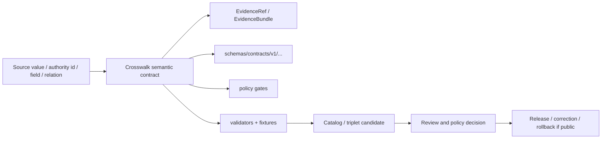

<!-- [KFM_META_BLOCK_V2]
doc_id: kfm://doc/contracts-crosswalks-readme
title: contracts/crosswalks/ — Crosswalk Semantic Contracts
type: readme
version: v0.1
status: draft
owners: OWNER_TBD — Contract steward · Crosswalk steward · Source steward · Domain stewards · Schema steward · Policy steward · Validation steward · Release steward · Docs steward
created: 2026-06-20
updated: 2026-06-20
policy_label: public; contracts; crosswalks; semantic-contracts; reconciliation; evidence-aware; anti-collapse
tags: [kfm, contracts, crosswalks, semantic-contracts, mapping, reconciliation, authority, source-role, evidence, policy, validation, release, governance]
related:
  - ../README.md
  - ./taxonomy/README.md
  - ../../docs/domains/flora/CROSSWALKS.md
  - ../../docs/architecture/contract-schema-policy-split.md
  - ../../docs/architecture/cross-domain/multi-domain-placement.md
  - ../../docs/architecture/domain-placement-law.md
  - ../../schemas/contracts/v1/
  - ../../policy/
  - ../../fixtures/
  - ../../tests/
  - ../../tools/validators/
  - ../../data/registry/sources/
  - ../../data/proofs/
  - ../../release/
notes:
  - "Initial README for the current contracts/crosswalks directory."
  - "Current-session search verified taxonomy as the only concrete child README under contracts/crosswalks."
  - "No paired schemas/contracts/v1/crosswalks schema home or validators were verified in this task."
  - "Crosswalk contracts define semantic meaning only; schemas, policy, validators, fixtures, source registries, proofs, release state, and public surfaces remain separate authority roots."
[/KFM_META_BLOCK_V2] -->

<a id="top"></a>

# Crosswalk Semantic Contracts

> Directory contract for KFM crosswalk semantic contracts. This folder defines what governed mappings mean: authority reconciliation, source-field mapping, vocabulary alignment, cross-lane relation mapping, and identity-preserving joins that must remain evidence-backed and policy-aware.

<p>
  
  
  
  
  
  
</p>

`contracts/crosswalks/`

## Quick jumps

[Status](#status) · [Scope](#scope) · [Path posture](#path-posture) · [Repo fit](#repo-fit) · [Accepted inputs](#accepted-inputs) · [Exclusions](#exclusions) · [Current directory snapshot](#current-directory-snapshot) · [Contract inventory](#contract-inventory) · [Crosswalk doctrine](#crosswalk-doctrine) · [Semantic contract rules](#semantic-contract-rules) · [Lifecycle and trust boundary](#lifecycle-and-trust-boundary) · [Validation](#validation) · [Evidence basis](#evidence-basis) · [Rollback](#rollback) · [Definition of done](#definition-of-done)

---

## Status

> [!IMPORTANT]
> **Status:** `draft` / directory README  
> **Owner:** `OWNER_TBD`  
> **Path:** `contracts/crosswalks/`  
> **Truth posture:** `CONFIRMED` current path, current update, root contract split, taxonomy child README, and Flora crosswalk doctrine. Paired schemas, validators, fixtures, policy behavior, source-registry behavior, release behavior, complete child inventory, and CI enforcement remain `NEEDS VERIFICATION`.

---

## Scope

`contracts/crosswalks/` is the semantic-contract parent folder for governed crosswalk families.

A crosswalk is a mapping claim. It says that one identifier, name, field, object, vocabulary term, authority record, or relation can be connected to another under stated evidence, provenance, source role, temporal context, sensitivity posture, policy gates, and release conditions.

This folder covers crosswalk contract families such as:

- taxonomy crosswalks;
- source-field to object-family crosswalks;
- authority identifier crosswalks;
- vocabulary/controlled-term crosswalks;
- cross-lane relation crosswalks;
- public-safe derived mapping contracts;
- compatibility notes where names, slugs, authorities, or homes conflict.

This folder is not a generic place for all mappings. A crosswalk belongs here only when its primary responsibility is semantic meaning for a governed mapping object or mapping family.

---

## Path posture

The current path is:

```text
contracts/crosswalks/
```

This path is a contracts-root topic segment for crosswalk semantic contracts. It is not a domain folder and must not become one.

| Path | Status | Meaning |
|---|---|---|
| `contracts/crosswalks/` | `CONFIRMED` current requested folder path | Parent directory for crosswalk semantic contracts. |
| `contracts/crosswalks/taxonomy/` | `CONFIRMED` child README verified | Taxonomy crosswalk semantic-contract directory. |
| `schemas/contracts/v1/crosswalks/` | `UNKNOWN / NEEDS VERIFICATION` | Candidate machine-shape home; not verified here. |
| `policy/crosswalks/` | `UNKNOWN / NEEDS VERIFICATION` | Candidate policy home; not verified here. |
| `tools/validators/crosswalks/` | `UNKNOWN / NEEDS VERIFICATION` | Candidate validator home; not verified here. |
| `fixtures/crosswalks/`, `tests/crosswalks/` | `UNKNOWN / NEEDS VERIFICATION` | Candidate enforceability homes; not verified here. |

---

## Repo fit

```text
contracts/
├── README.md
└── crosswalks/
    ├── README.md
    └── taxonomy/
        └── README.md
```

Adjacent responsibility roots:

| Root | Relationship to this folder |
|---|---|
| `../README.md` | Root contract guidance: semantic meaning only. |
| `./taxonomy/README.md` | Verified child README for taxonomy crosswalk semantics. |
| `../../docs/domains/flora/CROSSWALKS.md` | Strong current doctrine for crosswalk provenance, dimensions, source-role discipline, and fail-closed posture. |
| `../../schemas/contracts/v1/` | Machine schema root; paired crosswalk schemas remain `NEEDS VERIFICATION`. |
| `../../policy/` | Crosswalk admissibility, source-role, sensitivity, rights, and release policy. |
| `../../tools/validators/`, `../../fixtures/`, `../../tests/` | Enforcement and negative-state proof. |
| `../../data/registry/sources/` | SourceDescriptor/source-role inputs. |
| `../../data/proofs/` | EvidenceBundle/proof support. |
| `../../release/` | Public release, correction, supersession, rollback state. |

---

## Accepted inputs

| Belongs in this directory | Required posture |
|---|---|
| Crosswalk family README files | Must orient maintainers to a mapping family and its authority boundaries. |
| Object-level crosswalk semantic contracts | Must define mapping meaning, fields, invariants, evidence, and failure modes. |
| Authority reconciliation contract docs | Must preserve authority namespace, version, fetch time, and provenance. |
| Source-field mapping semantic docs | Must preserve raw source field and avoid source-role upgrades. |
| Vocabulary/controlled-term alignment docs | Must avoid collapsing distinct controlled vocabularies. |
| Cross-lane relation mapping docs | Must preserve each participating domain's ownership of atomic facts. |
| Verification/rollback notes | Must point to separate schema, policy, validator, fixture, proof, and release roots. |

---

## Exclusions

| Does not belong here | Correct home |
|---|---|
| JSON Schema | `../../schemas/contracts/v1/...`. |
| Policy rules | `../../policy/...`. |
| Validator code | `../../tools/validators/...`. |
| Fixtures and tests | `../../fixtures/...`, `../../tests/...`. |
| Source registries, authority registries, source descriptors | `../../data/registry/...` and source contract/docs. |
| RAW, WORK, QUARANTINE, PROCESSED, CATALOG, TRIPLET, PUBLISHED data | `../../data/...` lifecycle roots. |
| EvidenceBundle/proof content | `../../data/proofs/...` or accepted proof root. |
| Release manifests, correction notices, supersession notices, rollback cards | `../../release/`, `../correction/`, `../release/`. |
| Resolver/package implementation | `../../packages/...`. |
| Public API/UI/AI rendering | Governed app/API/UI/AI roots after validation and release. |
| Unverified live-source claims | SourceDescriptor + RunReceipt + rights/cadence review. |

---

## Current directory snapshot

> [!NOTE]
> This snapshot is based on current-session file inspection and repository search, not a full tree inventory.

| File or folder | Status | What it proves | What it does not prove |
|---|---|---|---|
| `contracts/crosswalks/README.md` | `CONFIRMED` | This parent README exists and states crosswalk contract boundaries. | Does not prove schemas, validators, fixtures, policy, or CI. |
| `contracts/crosswalks/taxonomy/README.md` | `CONFIRMED` | Taxonomy child README exists and states taxonomy crosswalk boundaries. | Does not prove object-level taxonomy schemas, validators, fixtures, or policy. |
| Other `contracts/crosswalks/*` entries | `UNKNOWN` | Not verified in this task. | Requires full inventory. |

---

## Contract inventory

| Crosswalk family | Current evidence | Status | Notes |
|---|---|---|---|
| `taxonomy` | Child README exists. Flora docs provide strong doctrine. | `CONFIRMED directory / NEEDS VERIFICATION implementation` | Schemas/validators/fixtures/policy not verified. |
| `source-field` | Flora docs describe source-field to object crosswalk dimension. | `PROPOSED / NEEDS VERIFICATION` | No parent-level object contract verified. |
| `authority-id` | Flora docs describe authority identifier crosswalks. | `PROPOSED / NEEDS VERIFICATION` | May belong under taxonomy or separate authority topic. |
| `vocabulary` | Cross-domain knowledge-character work indicates controlled vocabulary alignment need. | `PROPOSED / NEEDS VERIFICATION` | Not inventoried as a crosswalk child. |
| `cross-lane-relation` | Flora docs describe cross-lane relation crosswalk dimension. | `PROPOSED / NEEDS VERIFICATION` | Needs participating domain ownership rules. |
| `public-safe-derived` | KFM doctrine requires released, policy-safe public outputs. | `PROPOSED / NEEDS VERIFICATION` | Needs release and policy evidence. |

---

## Crosswalk doctrine

Crosswalks are governed mappings, not free joins.

Required posture:

- every consequential crosswalk row is a claim;
- source-native values must be preserved;
- source role must not be upgraded by a crosswalk;
- authority namespace and version must be visible where applicable;
- temporal context must be explicit where currency matters;
- EvidenceRef/EvidenceBundle support is required for consequential use;
- missing anchors, missing evidence, stale authorities, conflicts, rights gaps, or sensitivity gaps fail closed;
- crosswalks do not publish, release, authorize, validate, or prove themselves;
- public or AI-facing surfaces must caveat, cite, abstain, deny, redact, or generalize rather than overclaim.

---

## Semantic contract rules

Every crosswalk contract under this folder must state:

- source side and target side of the mapping;
- owning authority for each side;
- whether the mapping is exact, inferred, provisional, ambiguous, stale, conflicted, or denied;
- source-role constraints;
- evidence/provenance fields;
- temporal/currency fields;
- sensitivity and rights posture;
- policy gates;
- validator and fixture expectations;
- public exposure limits;
- correction/supersession/rollback behavior;
- examples of valid and invalid mappings.

---

## Lifecycle and trust boundary



Contracts describe meaning. They do not validate schemas, query authorities, perform live resolution, decide policy, emit proof, publish, or serve public clients.

---

## Validation

Before relying on this directory, verify:

- full `contracts/crosswalks/` inventory;
- child contract READMEs and object-level contracts;
- paired schemas and `$id` values;
- policy bundles for source role, rights, sensitivity, admissibility, and release;
- validators and fixtures covering valid, invalid, ambiguous, stale, conflicted, denied, and abstain cases;
- SourceDescriptor/source-role support;
- EvidenceRef/EvidenceBundle resolution for consequential mappings;
- authority registry placement and version pinning where applicable;
- public UI/API/AI caveat behavior;
- correction/supersession/rollback behavior for changed authorities or discovered bad mappings;
- no public path reads raw/internal/candidate crosswalk rows as truth.

---

## Evidence basis

| Source | Status | Supports | Limits |
|---|---|---|---|
| `contracts/crosswalks/README.md` before this edit | `CONFIRMED` | Target file existed but was blank. | No parent directory contract content before this edit. |
| `contracts/README.md` | `CONFIRMED` | Contracts define semantic meaning; schemas define shape; validation, JSON Schema, policy code, and source data do not belong in contracts. | Root README does not inventory crosswalk contracts. |
| `contracts/crosswalks/taxonomy/README.md` | `CONFIRMED` | Taxonomy child README exists and defines taxonomy crosswalk directory boundaries. | Does not prove object-level schemas, validators, fixtures, or policy. |
| `docs/domains/flora/CROSSWALKS.md` | `CONFIRMED doctrine / PROPOSED implementation` | Crosswalks are governed mappings requiring EvidenceBundle support, provenance, source-role discipline, sensitivity policy, and fail-closed behavior. | Flora-specific evidence; broader crosswalk implementation remains unverified. |
| `docs/architecture/contract-schema-policy-split.md` | `CONFIRMED` | Meaning, shape, admissibility, and enforceability are separate layers. | Does not verify crosswalk-specific implementation. |

---

## Rollback

Rollback is required if this README is used to claim schema completeness, validator coverage, source-registry maturity, source rights, live endpoint behavior, release readiness, public API/UI behavior, or full directory inventory that has not been verified.

Rollback target: prior blank file content SHA `8b137891791fe96927ad78e64b0aad7bded08bdc`.

---

## Definition of done

- [ ] Owners are confirmed and `OWNER_TBD` is replaced.
- [ ] Full directory inventory is generated.
- [ ] Child crosswalk families are listed with status and owners.
- [ ] Object-level crosswalk contracts are authored or explicitly marked absent.
- [ ] Paired schemas and `$id` values are verified.
- [ ] Validators and fixtures cover valid, invalid, stale, ambiguous, conflicted, denied, and review-required mappings.
- [ ] SourceDescriptor/source-role and authority registry dependencies are verified.
- [ ] EvidenceRef/EvidenceBundle requirements are enforceable where consequential.
- [ ] Policy gates for rights, sensitivity, source role, and public release are linked and tested.
- [ ] Release/correction/supersession/rollback behavior is documented for changed or bad mappings.
- [ ] Public UI/API/AI surfaces preserve caveats and do not treat crosswalk rows as sovereign truth.

---

## Status summary

`contracts/crosswalks/` is the semantic-contract parent for governed mapping families. It is not a schema home, policy home, validator package, fixture store, authority registry, source registry, resolver implementation, proof root, release authority, public API/UI surface, or permission to treat a mapping row as supported truth without evidence and policy gates.

<p align="right"><a href="#top">Back to top</a></p>
