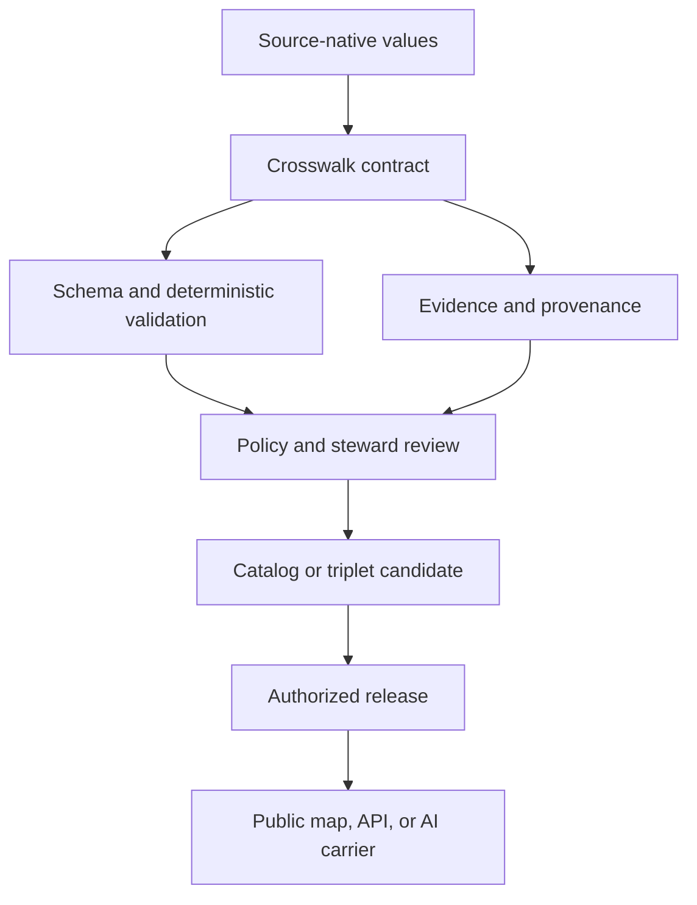

<!-- [KFM_META_BLOCK_V2]
doc_id: kfm://doc/contracts-crosswalks-readme
title: contracts/crosswalks/ — Crosswalk Semantic Contracts
type: readme
version: v0.2
status: draft
owners: OWNER_TBD — Contract steward · Crosswalk steward · Source steward · Domain stewards · Schema steward · Policy steward · Validation steward · Release steward · Docs steward
created: 2026-06-20
updated: 2026-09-08
policy_label: public; contracts; crosswalks; semantic-contracts; reconciliation; evidence-aware; anti-collapse
tags: [kfm, contracts, crosswalks, semantic-contracts, mapping, reconciliation, authority, source-role, evidence, policy, validation, release, governance]
related:
  - ../README.md
  - ./geography_crosswalk.md
  - ./taxonomy/README.md
  - ./taxonomy/taxonomic_concept_lineage.md
  - ../../docs/doctrine/directory-rules.md
  - ../../docs/adr/ADR-0029-adopt-directory-governance-standard-v2.md
  - ../../docs/domains/flora/CROSSWALKS.md
  - ../../docs/architecture/contract-schema-policy-split.md
  - ../../schemas/contracts/v1/crosswalks/geography_crosswalk.schema.json
  - ../../schemas/contracts/v1/crosswalks/taxonomy/taxonomic_concept_lineage.schema.json
  - ../../tools/validators/validate_geography_crosswalk.py
  - ../../tools/validators/validate_taxonomic_concept_lineage.py
  - ../../tests/validators/test_validate_geography_crosswalk.py
  - ../../tests/validators/test_validate_taxonomic_concept_lineage.py
  - ../../.github/workflows/geography-crosswalk.yml
  - ../../.github/workflows/taxonomic-concept-lineage.yml
  - ../../data/receipts/generated/genrec-pass20-geography-crosswalk-20260810.json
  - ../../data/receipts/generated/genrec-taxonomic-concept-lineage-20260805.json
notes:
  - "v0.2 reconciles this parent README with the complete current contracts/crosswalks tree on main@2bddc4b4e453a7396d654d5f988911e9ee3af1ef."
  - "The current semantic contracts are the fixture-only GeographyCrosswalk candidate and the proposed TaxonomicConceptLineagePacket profile."
  - "Paired schemas, validators, tests, path-scoped workflows, and authoring receipts are present; presence is not current execution, policy admission, review approval, release, or publication proof."
  - "Crosswalk contracts define semantic meaning only; schemas, policy, validators, fixtures, registries, proofs, release state, and public surfaces remain separate authority roots."
[/KFM_META_BLOCK_V2] -->

<a id="top"></a>

# Crosswalk Semantic Contracts

> Directory contract for KFM crosswalk semantics. This folder defines what governed mappings mean while preserving source-native identity, direction, version, evidence, uncertainty, and authority boundaries.

<p>
  
  
  
  
  
  
</p>

`contracts/crosswalks/`

## Quick jumps

[Status](#status) · [Scope](#scope) · [Directory Rules basis](#directory-rules-basis) · [Current inventory](#current-inventory) · [Responsibility split](#responsibility-split) · [Crosswalk doctrine](#crosswalk-doctrine) · [Contract requirements](#contract-requirements) · [Lifecycle and trust boundary](#lifecycle-and-trust-boundary) · [Validation](#validation) · [Evidence basis](#evidence-basis) · [Rollback](#rollback) · [Definition of done](#definition-of-done)

---

## Status

> [!IMPORTANT]
> **Status:** `draft` directory README  
> **Owner:** `OWNER_TBD`  
> **Repository snapshot:** `main@2bddc4b4e453a7396d654d5f988911e9ee3af1ef`  
> **Truth posture:** `CONFIRMED` for the current directory inventory and the paired repository paths listed below. The two executable profiles remain fixture-first, non-authoritative, no-network, and unreleased. Current exact-head execution, policy admission, evidence resolution, steward approval, release, deployment, and publication remain `NEEDS VERIFICATION`.

---

## Scope

`contracts/crosswalks/` owns semantic meaning for governed mappings. A crosswalk is a directional, versioned claim that one identifier, feature, name usage, concept, field, vocabulary term, authority record, or relation corresponds to another under stated evidence and limitations.

This directory currently covers:

- version-pinned geography mapping declarations;
- taxonomy name-usage and concept-lineage reconciliation;
- family-level guidance for future authority, vocabulary, source-field, and cross-lane mappings.

This folder is not a general join store. A document belongs here only when its primary responsibility is the meaning and invariants of a governed mapping object or family.

---

## Directory Rules basis

ADR-0029 adopts [`docs/doctrine/directory-rules.md`](../../docs/doctrine/directory-rules.md) as the single writable human-readable Directory Rules authority. Its mandatory authority split answers three different questions:

| Root | Question answered here |
|---|---|
| `contracts/` | What does the crosswalk object or interface mean? |
| `schemas/` | What machine shape is valid? |
| `policy/` | Under what conditions is use allowed, denied, held, restricted, or abstained? |

The existing `contracts/crosswalks/` path is therefore the correct semantic-contract family. Executable shape, validation, fixtures, workflows, authoring receipts, registries, and release decisions remain in their existing responsibility roots. This README creates no new root or parallel authority surface.

---

## Current inventory

The complete direct-child inventory at the pinned snapshot is:

```text
contracts/crosswalks/
├── README.md
├── geography_crosswalk.md
└── taxonomy/
    ├── README.md
    └── taxonomic_concept_lineage.md
```

| Contract surface | Repository status | Paired implementation evidence | Authority limit |
|---|---|---|---|
| [`geography_crosswalk.md`](./geography_crosswalk.md) | `CONFIRMED` proposed, inactive, fixture-only contract | Schema, 25-case `PASS`/`DENY` fixture matrix, validator, test module, path-scoped workflow, source map, and authoring receipt are present. | Does not compare boundaries, execute joins, resolve evidence, approve a review, or create release/publication authority. |
| [`taxonomy/README.md`](./taxonomy/README.md) | `CONFIRMED` taxonomy-family directory contract | Establishes family semantics and separation from authority registries, resolvers, schemas, policy, and release. | Its older internal inventory text has not yet been reconciled to the lineage object now present. |
| [`taxonomy/taxonomic_concept_lineage.md`](./taxonomy/taxonomic_concept_lineage.md) | `CONFIRMED` proposed, fixture-first contract | Draft 2020-12 schema, no-network validator, six-test module with embedded synthetic vectors, path-scoped workflow, authoring receipt, and downstream opaque reference are present. | Does not select a live taxonomy, prove occurrence, resolve external references, admit a source, or create taxonomic/release authority. |

`CONFIRMED` above means the repository objects exist at the pinned snapshot. It does not mean they have passed current hosted checks, received independent approval, or crossed a release gate.

---

## Responsibility split

| Responsibility | Geography profile | Taxonomic-lineage profile |
|---|---|---|
| Semantic contract | [`geography_crosswalk.md`](./geography_crosswalk.md) | [`taxonomic_concept_lineage.md`](./taxonomy/taxonomic_concept_lineage.md) |
| Machine schema | [`geography_crosswalk.schema.json`](../../schemas/contracts/v1/crosswalks/geography_crosswalk.schema.json) | [`taxonomic_concept_lineage.schema.json`](../../schemas/contracts/v1/crosswalks/taxonomy/taxonomic_concept_lineage.schema.json) |
| Synthetic examples | [`cases.json`](../../fixtures/contracts/v1/crosswalks/geography_crosswalk/cases.json) | Embedded compressed vectors in the test module |
| Validator | [`validate_geography_crosswalk.py`](../../tools/validators/validate_geography_crosswalk.py) | [`validate_taxonomic_concept_lineage.py`](../../tools/validators/validate_taxonomic_concept_lineage.py) |
| Executable conformance | [`test_validate_geography_crosswalk.py`](../../tests/validators/test_validate_geography_crosswalk.py) | [`test_validate_taxonomic_concept_lineage.py`](../../tests/validators/test_validate_taxonomic_concept_lineage.py) |
| Path-scoped CI | [`geography-crosswalk.yml`](../../.github/workflows/geography-crosswalk.yml) | [`taxonomic-concept-lineage.yml`](../../.github/workflows/taxonomic-concept-lineage.yml) |
| Authoring provenance | [`genrec-pass20-geography-crosswalk-20260810.json`](../../data/receipts/generated/genrec-pass20-geography-crosswalk-20260810.json) | [`genrec-taxonomic-concept-lineage-20260805.json`](../../data/receipts/generated/genrec-taxonomic-concept-lineage-20260805.json) |

No dedicated crosswalk policy bundle, accepted crosswalk registry, released crosswalk artifact, or public crosswalk API is established by this inventory.

### Accepted inputs

| Belongs here | Required posture |
|---|---|
| Crosswalk family READMEs | Orient maintainers to one mapping family and its authority boundaries. |
| Object-level semantic contracts | Define mapping direction, meaning, invariants, evidence, uncertainty, and failure modes. |
| Authority or identity reconciliation contracts | Preserve both namespaces, versions, source-native values, and provenance. |
| Vocabulary and source-field alignment contracts | Prevent semantic collapse or unsupported source-role upgrades. |
| Cross-lane relation contracts | Preserve each participating domain's ownership of atomic facts. |
| Verification and rollback guidance | Point to separate schema, policy, validator, fixture, receipt, registry, proof, and release roots. |

### Exclusions

| Does not belong here | Existing responsibility root |
|---|---|
| JSON Schema | `../../schemas/contracts/v1/...` |
| Policy rules | `../../policy/...` |
| Validator code | `../../tools/validators/...` |
| Fixtures and tests | `../../fixtures/...`, `../../tests/...` |
| Source, authority, or crosswalk registry instances | `../../data/registry/...` |
| RAW, WORK, QUARANTINE, PROCESSED, CATALOG/TRIPLET, or PUBLISHED data | `../../data/...` lifecycle roots |
| EvidenceBundle and proof instances | `../../data/proofs/...` or another accepted proof root |
| Release, correction, supersession, withdrawal, or rollback decisions | `../../release/...` and applicable semantic contracts |
| Resolver or package implementation | `../../packages/...` |
| Public API, UI, map, or AI rendering | Governed application/interface roots after validation and authorized release |

---

## Crosswalk doctrine

Crosswalks are governed mappings, not free joins.

- Every consequential mapping row is a claim.
- Preserve source-native identifiers, labels, names, versions, and roles.
- Make direction explicit; do not infer reverse equivalence.
- Pin the source and target versions or declare the unresolved temporal basis.
- Distinguish exact, partial, split, merge, provisional, ambiguous, stale, conflicted, unmapped, denied, and abstained states as the profile permits.
- Bind consequential use to resolvable EvidenceRef/EvidenceBundle support.
- Do not upgrade rights, sensitivity, source role, identity, or authority through a crosswalk.
- Missing anchors, stale authorities, conflicts, rights gaps, sensitivity gaps, and unsupported equivalence fail closed.
- Validation proves only the checks it executes; a contract, schema, fixture, workflow, or green check cannot self-authorize use or release.
- Maps and AI must cite, caveat, generalize, abstain, or deny rather than render a crosswalk row as sovereign truth.

---

## Contract requirements

Every crosswalk contract under this folder must state:

- source side, target side, and mapping direction;
- owning authority and version basis for each side;
- deterministic identity and canonicalization posture where applicable;
- allowed relation and finite outcome vocabulary;
- source-role constraints and anti-collapse rules;
- evidence, provenance, and receipt requirements;
- temporal validity and staleness behavior;
- rights, sensitivity, and disclosure posture;
- policy and review gates;
- schema, validator, fixture, test, and workflow expectations;
- public exposure limits;
- correction, supersession, withdrawal, and rollback behavior; and
- valid, invalid, ambiguous, and fail-closed examples.

---

## Lifecycle and trust boundary


```mermaid
flowchart TD
  A[Source-native values] --> B[Crosswalk contract]
  B --> C[Schema and deterministic validation]
  B --> D[Evidence and provenance]
  C --> E[Policy and steward review]
  D --> E
  E --> F[Catalog or triplet candidate]
  F --> G[Authorized release]
  G --> H[Public map, API, or AI carrier]
```

The lifecycle remains `RAW → WORK/QUARANTINE → PROCESSED → CATALOG/TRIPLET → PUBLISHED`. Promotion is a governed state transition, not a file move. Contracts describe meaning; they do not fetch sources, execute joins, resolve evidence, decide policy, promote, release, publish, or serve public clients.

---

## Validation

### Changed-area commands

```bash
python -m unittest -v tests.validators.test_validate_geography_crosswalk
python tools/validators/validate_geography_crosswalk.py --fixtures
python -m unittest -v tests.validators.test_validate_taxonomic_concept_lineage
```

For this README-only reconciliation, also run the repository-native metadata, Markdown-link, documentation-structure, and topology checks that select this path. Record exact base/head attribution and do not report inherited or unrun checks as passing.

### What validation may prove

- schema validity and closed-object constraints;
- deterministic identifier/hash behavior exercised by the validator;
- reviewed synthetic positive and negative outcomes;
- bounded, no-network execution where the tests assert it; and
- documentation/link conformance for this changed path.

### What validation does not prove

- correctness of a real-world geography or taxonomy mapping;
- external authority currency or availability;
- evidence resolution, rights clearance, sensitivity clearance, or policy admission;
- independent steward approval;
- registry acceptance, promotion, release, deployment, or publication; or
- public client admission.

---

## Evidence basis

| Source | Status at the pinned snapshot | Supports | Limit |
|---|---|---|---|
| [`contracts/crosswalks/`](./) direct-child listing | `CONFIRMED` | Complete parent and taxonomy-child inventory shown above. | Path presence is not semantic correctness or execution proof. |
| [`geography_crosswalk.md`](./geography_crosswalk.md) and paired paths | `CONFIRMED present` | Fixture-only mapping profile, 25-case fixture suite, validator, tests, workflow, and receipt. | Current exact-head results, review, evidence resolution, policy, and release remain unproved. |
| [`taxonomic_concept_lineage.md`](./taxonomy/taxonomic_concept_lineage.md) and paired paths | `CONFIRMED present` | Fixture-first lineage profile, schema, validator, six tests, workflow, receipt, and downstream opaque reference. | No live taxonomy, external resolution, taxonomic authority, or release authority. |
| [`contracts/README.md`](../README.md) | `CONFIRMED` | Contracts own semantic meaning rather than machine shape, policy, or instance data. | Does not grant completeness or acceptance to a crosswalk family. |
| [Directory Rules](../../docs/doctrine/directory-rules.md) and [ADR-0029](../../docs/adr/ADR-0029-adopt-directory-governance-standard-v2.md) | `CONFIRMED adopted repository authority` | Existing responsibility-root placement and the contracts/schema/policy split. | Directory placement does not grant truth, rights, admission, validation, or release. |
| [`docs/domains/flora/CROSSWALKS.md`](../../docs/domains/flora/CROSSWALKS.md) | `CONFIRMED doctrine` | Source-role preservation, authority/version visibility, evidence support, and fail-closed mapping posture. | Flora-specific guidance does not prove cross-domain implementation. |

---

## Rollback

Before merge, close the draft PR and delete only its task branch if the update is abandoned. After an authorized merge, revert the documentation commit. The pre-change README blob is `7dd131c6b6b5339eb6e433940d7ace169a350dbc`.

No schema, validator, fixture, workflow, registry, source, evidence, lifecycle, release, deployment, or publication state requires restoration because this change updates documentation only.

---

## Definition of done

- [x] Direct-child and taxonomy-child contract inventory is reconciled to the pinned repository snapshot.
- [x] Geography and taxonomic-lineage contracts are linked to their existing paired schema, validation, workflow, and receipt surfaces.
- [x] Directory Rules and the contracts/schema/policy authority split are explicit.
- [x] Presence, execution, review, and release claims remain separated.
- [ ] Owners are confirmed and `OWNER_TBD` is replaced through an authorized review.
- [ ] The taxonomy child README's older internal inventory is reconciled separately.
- [ ] Current exact-head changed-area and hosted validation are recorded.
- [ ] Dedicated policy and accepted registry surfaces are identified or their intentional absence is recorded.
- [ ] Consequential EvidenceRef/EvidenceBundle resolution and rights/sensitivity gates are enforceable.
- [ ] Independent review and any release/publication gates are satisfied separately.

---

## Status summary

`contracts/crosswalks/` is the semantic-contract home for governed mapping families. Its current repository-grounded inventory contains one fixture-only geography profile and one fixture-first taxonomic concept-lineage profile with paired validation surfaces. Neither profile is a live resolver, registry authority, evidence proof, policy decision, release approval, public API, or permission to treat a mapping as truth.

<p align="right"><a href="#top">Back to top</a></p>
