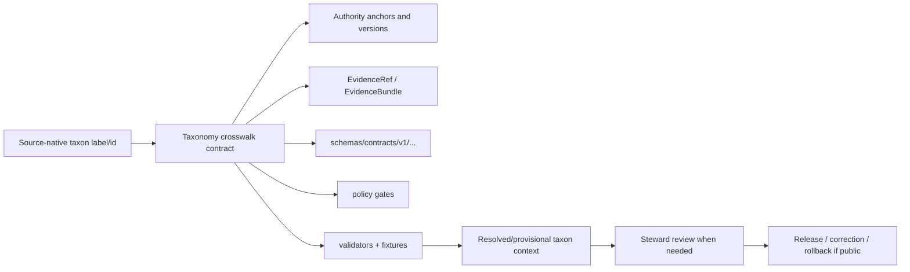

<!-- [KFM_META_BLOCK_V2]
doc_id: kfm://doc/contracts-crosswalks-taxonomy-readme
title: contracts/crosswalks/taxonomy/ — Taxonomy Crosswalk Semantic Contracts
type: readme
version: v0.1
status: draft
owners: OWNER_TBD — Contract steward · Taxonomy steward · Flora steward · Fauna steward · Schema steward · Policy steward · Validation steward · Docs steward
created: 2026-06-20
updated: 2026-06-20
policy_label: public; contracts; crosswalks; taxonomy; semantic-contracts; authority-reconciliation; evidence-aware
tags: [kfm, contracts, crosswalks, taxonomy, taxon, authority, flora, fauna, reconciliation, source-role, evidence, governance]
related:
  - ../../README.md
  - ../../../docs/domains/flora/CROSSWALKS.md
  - ../../../packages/domains/flora/taxonomy/README.md
  - ../../../packages/domains/flora/taxonomy_resolver/README.md
  - ../../../docs/architecture/cross-domain/multi-domain-placement.md
  - ../../../docs/architecture/domain-placement-law.md
  - ../../../docs/architecture/contract-schema-policy-split.md
  - ../../../schemas/contracts/v1/
  - ../../../policy/
  - ../../../fixtures/
  - ../../../tests/
  - ../../../tools/validators/
  - ../../../data/registry/sources/
  - ../../../data/proofs/
  - ../../../release/
notes:
  - "Initial README for the current contracts/crosswalks/taxonomy directory."
  - "Taxonomy crosswalk doctrine is currently best evidenced in Flora crosswalk and taxonomy package docs."
  - "No paired schemas/contracts/v1/crosswalks/taxonomy schema home or validator was verified in this task."
  - "This folder defines semantic contract boundaries only; schemas, policy, validators, fixtures, registries, proofs, release state, and package implementations remain separate authority roots."
[/KFM_META_BLOCK_V2] -->

<a id="top"></a>

# Taxonomy Crosswalk Semantic Contracts

> Directory contract for taxonomy crosswalk semantic contracts. This folder defines the meaning and governance boundaries for crosswalking taxon names, authority identifiers, provider IDs, synonyms, ranks, and accepted concepts into auditable KFM taxon identity claims.

<p>
  
  
  
  
  
  
</p>

`contracts/crosswalks/taxonomy/`

## Quick jumps

[Status](#status) · [Scope](#scope) · [Path posture](#path-posture) · [Repo fit](#repo-fit) · [Accepted inputs](#accepted-inputs) · [Exclusions](#exclusions) · [Current directory snapshot](#current-directory-snapshot) · [Contract inventory](#contract-inventory) · [Taxonomy crosswalk doctrine](#taxonomy-crosswalk-doctrine) · [Semantic contract rules](#semantic-contract-rules) · [Lifecycle and trust boundary](#lifecycle-and-trust-boundary) · [Validation](#validation) · [Evidence basis](#evidence-basis) · [Rollback](#rollback) · [Definition of done](#definition-of-done)

---

## Status

> [!IMPORTANT]
> **Status:** `draft` / directory README  
> **Owner:** `OWNER_TBD`  
> **Path:** `contracts/crosswalks/taxonomy/`  
> **Truth posture:** `CONFIRMED` current path, current update, root contract split, and Flora taxonomy/crosswalk doctrine. Paired schemas, validators, fixtures, registry files, policy behavior, CI behavior, full taxonomy-crosswalk inventory, and downstream usage remain `NEEDS VERIFICATION`.

---

## Scope

`contracts/crosswalks/taxonomy/` is the semantic contract directory for taxonomy crosswalks.

A taxonomy crosswalk is a governed mapping claim that relates a source-native taxon label or identifier to one or more authority records and, where support is sufficient, to a stable KFM taxon identity.

This directory is for meaning and invariants such as:

- what a taxonomy crosswalk row means;
- how source-native names and IDs remain preserved;
- how authority identifiers are represented and compared;
- how accepted names, synonyms, unresolved names, ambiguous matches, stale authorities, and conflicts are treated;
- how crosswalk provenance links to EvidenceBundle support;
- how source-role anti-collapse, rights, sensitivity, temporal context, and release state constrain use.

This directory is **not** a taxonomic authority registry, resolver implementation, schema home, policy home, fixture store, proof store, release root, public API, or UI surface.

---

## Path posture

The current path is:

```text
contracts/crosswalks/taxonomy/
```

This path is plausible as a semantic-contract topic folder under the `contracts/` responsibility root. Current evidence did not verify a paired schema home or a validator. The path should remain `draft` until adjacent schemas, fixtures, validators, and policy gates are confirmed or deliberately left as known gaps.

| Path | Status | Meaning |
|---|---|---|
| `contracts/crosswalks/taxonomy/` | `CONFIRMED` current requested folder path | Taxonomy crosswalk semantic-contract directory. |
| `schemas/contracts/v1/crosswalks/taxonomy/` | `UNKNOWN / NEEDS VERIFICATION` | Candidate machine-shape home; not verified here. |
| `policy/crosswalks/taxonomy/` | `UNKNOWN / NEEDS VERIFICATION` | Candidate policy home for crosswalk admissibility; not verified here. |
| `tools/validators/crosswalks/taxonomy/` | `UNKNOWN / NEEDS VERIFICATION` | Candidate validator home; not verified here. |
| `data/registry/flora/`, `data/registry/fauna/`, `data/registry/sources/` | `NEEDS VERIFICATION` | Candidate registry surfaces for authority/source metadata, not owned by this contract directory. |

---

## Repo fit

```text
contracts/
└── crosswalks/
    └── taxonomy/
        └── README.md
```

Adjacent responsibility roots:

| Root | Relationship to this folder |
|---|---|
| `../../README.md` | Root contract guidance: semantic meaning only. |
| `../../../docs/domains/flora/CROSSWALKS.md` | Strongest current doctrine for taxonomy crosswalk meaning, provenance, dimensions, and fail-closed posture. |
| `../../../packages/domains/flora/taxonomy/README.md` | Package/helper posture for Flora taxonomy resolution, not a contract authority. |
| `../../../packages/domains/flora/taxonomy_resolver/README.md` | Resolver package posture and failure behavior, not canonical semantics. |
| `../../../schemas/contracts/v1/` | Machine schema root; paired taxonomy crosswalk schema remains `NEEDS VERIFICATION`. |
| `../../../policy/` | Crosswalk admissibility, source-role, sensitivity, and release policy. |
| `../../../tools/validators/`, `../../../fixtures/`, `../../../tests/` | Enforcement and examples. |
| `../../../data/registry/sources/` | SourceDescriptor/source-role inputs. |
| `../../../data/proofs/` | EvidenceBundle/proof support. |
| `../../../release/` | Public release, correction, supersession, rollback state. |

---

## Accepted inputs

| Belongs in this directory | Required posture |
|---|---|
| Taxonomy crosswalk semantic contract docs | Must define meaning, invariants, source-role posture, provenance, and failure behavior. |
| Authority reconciliation contract docs | Must name authority IDs, versioning, fetch/receipt expectations, and tie-breaker posture. |
| Synonym/accepted-name mapping semantics | Must preserve raw source label and authority basis. |
| Cross-lane taxonomy relation semantics | Must identify participating domains and preserve ownership of atomic facts. |
| Evidence and validation checklists | Must point to schemas/policy/validators/fixtures/proofs without claiming they exist unless verified. |
| Compatibility and drift notes | Must surface conflicts among authority systems, stale crosswalks, and path placement issues. |
| Rollback notes | Must name prior content SHA or migration rollback target. |

---

## Exclusions

| Does not belong here | Correct home |
|---|---|
| JSON Schema | `../../../schemas/contracts/v1/...`. |
| Policy rules | `../../../policy/...`. |
| Validator code | `../../../tools/validators/...`. |
| Fixtures and tests | `../../../fixtures/...`, `../../../tests/...`. |
| Taxon authority registry data | `../../../data/registry/...` or accepted registry home. |
| Source descriptors/source roles | `../../../data/registry/sources/...` and source contracts. |
| Resolver/package implementation | `../../../packages/...`. |
| EvidenceBundle/proof content | `../../../data/proofs/...`. |
| Release manifests, correction, supersession, rollback | `../../../release/` and release/correction contracts. |
| Public API/UI rendering | Governed app/API/UI roots after validation and release. |
| Direct external-live authority claims | Source descriptors and RunReceipts after rights/cadence/version verification. |

---

## Current directory snapshot

> [!NOTE]
> This snapshot is based on current-session file inspection, not a complete repository inventory.

| File | Status | What it proves | What it does not prove |
|---|---|---|---|
| `contracts/crosswalks/taxonomy/README.md` | `CONFIRMED` | This directory README exists and states taxonomy crosswalk contract boundaries. | Does not prove object-level contract files, schemas, validators, fixtures, or policy are complete. |
| Other `contracts/crosswalks/taxonomy/*` files | `UNKNOWN` | Not inspected in this task. | Requires separate inventory. |

---

## Contract inventory

No concrete object-level taxonomy crosswalk contract files beyond this README were verified in this task.

| Contract family | Current evidence | Status | Notes |
|---|---|---|---|
| Taxon authority crosswalk | Flora crosswalk doctrine describes this dimension. | `CONFIRMED doctrine / PROPOSED implementation` | Object-level contract and schema not verified here. |
| Source-field to object-family crosswalk | Flora crosswalk doctrine describes this dimension. | `CONFIRMED doctrine / PROPOSED implementation` | Shape and validators remain unverified. |
| Cross-lane relation crosswalk | Flora crosswalk doctrine describes this dimension. | `CONFIRMED doctrine / PROPOSED implementation` | Participating domains must preserve ownership boundaries. |
| Synonym/accepted-name mapping | Flora taxonomy package docs describe expected resolver behavior. | `PROPOSED / NEEDS VERIFICATION` | Package README does not prove implementation. |
| Authority conflict / stale crosswalk handling | Flora docs describe expected failure modes. | `PROPOSED / NEEDS VERIFICATION` | Requires schemas, fixtures, validators, and review gates. |

---

## Taxonomy crosswalk doctrine

Taxonomy crosswalks are governed mappings, not free joins.

Required posture:

- preserve the source-native name string and source-native identifier;
- record authority namespace, identifier, version, fetch/retrieval time, and confidence where available;
- distinguish accepted name, synonym, misapplied name, unresolved name, ambiguous match, stale crosswalk, authority conflict, and rejected match;
- preserve source role and prevent unsupported source-role upgrades;
- require EvidenceRef/EvidenceBundle support for consequential crosswalk claims;
- fail closed when required anchors, evidence, source role, rights, sensitivity, or authority version are missing;
- never treat a name string alone as a resolved taxon;
- never treat a taxon resolution as occurrence evidence, specimen evidence, range proof, conservation status, or release permission.

---

## Semantic contract rules

Each taxonomy crosswalk contract in this directory must state:

- source label and raw name preservation rules;
- authority systems involved;
- identity basis and deterministic ID posture;
- accepted/synonym/unresolved/ambiguous/conflicted/rejected outcomes;
- evidence and source descriptor requirements;
- temporal context and authority versioning;
- source-role and rights posture;
- sensitivity and geoprivacy implications;
- policy gates and review obligations;
- release, correction, supersession, and rollback implications;
- examples of valid and invalid crosswalk rows;
- validation and fixture expectations.

---

## Lifecycle and trust boundary



Contracts describe meaning. They do not validate schemas, query authorities, perform live resolution, decide policy, emit proof, publish, or serve public clients.

---

## Validation

Before relying on this directory, verify:

- full `contracts/crosswalks/taxonomy/` inventory;
- object-level taxonomy crosswalk contract files;
- paired schemas and `$id` values;
- fixtures for accepted match, synonym match, ambiguous name, unresolved name, authority conflict, stale crosswalk, missing anchor, source-role insufficient, rights/sensitivity block, and review-required paths;
- validators with finite outcomes such as `ANSWER`, `ABSTAIN`, `DENY`, and `ERROR` where applicable;
- taxon authority registry placement and version pinning;
- SourceDescriptor/source-role support;
- EvidenceRef/EvidenceBundle resolution for consequential claims;
- policy gates for source role, rights, sensitivity, and public release;
- public UI/API/AI surfaces preserve caveats and do not treat crosswalks as sovereign truth;
- correction/supersession behavior for authority updates or discovered misidentifications.

---

## Evidence basis

| Source | Status | Supports | Limits |
|---|---|---|---|
| `contracts/crosswalks/taxonomy/README.md` before this edit | `CONFIRMED` | Target file existed but was blank. | No directory contract content before this edit. |
| `contracts/README.md` | `CONFIRMED` | Contracts define semantic meaning; schemas define shape; validation, JSON Schema, policy code, and source data do not belong in contracts. | Root README does not inventory taxonomy crosswalk contracts. |
| `docs/domains/flora/CROSSWALKS.md` | `CONFIRMED doctrine / PROPOSED implementation` | Crosswalks are governed mappings, not free joins; each row is a claim requiring evidence, provenance, source-role discipline, sensitivity policy, and fail-closed behavior. | Flora-specific doc; broader taxonomy crosswalk implementation remains unverified. |
| `packages/domains/flora/taxonomy/README.md` | `LINEAGE / PROPOSED implementation` | Describes desired taxonomy helper behavior and failure modes. | Package code/tests/runtime behavior were not inspected by that README. |
| `packages/domains/flora/taxonomy_resolver/README.md` | `LINEAGE / PROPOSED implementation` | Describes resolver input/output expectations and finite outcomes. | Does not prove implementation or schema maturity. |
| `KFM Repository Markdown Authoring Agent — Full Operating Prompt v2` | `CONFIRMED user-supplied authoring guidance` | Requires evidence grounding, truth labels, no-loss preservation, GitHub polish, verification, and rollback posture. | It is authoring guidance, not repo implementation proof. |

---

## Rollback

Rollback is required if this README is used to claim schema completeness, validator coverage, authority-registry maturity, source rights, live endpoint behavior, release readiness, or public API/UI behavior that has not been verified.

Rollback target: prior blank file content SHA `8b137891791fe96927ad78e64b0aad7bded08bdc`.

---

## Definition of done

- [ ] Owners are confirmed and `OWNER_TBD` is replaced.
- [ ] Full directory inventory is generated.
- [ ] Object-level taxonomy crosswalk contracts are authored or explicitly marked absent.
- [ ] Paired schemas and `$id` values are verified.
- [ ] Validators and fixtures cover accepted, synonym, ambiguous, unresolved, conflict, stale, denied, and review-required cases.
- [ ] Authority registry placement, versioning, and source rights are verified.
- [ ] EvidenceRef/EvidenceBundle requirements are enforced where consequential.
- [ ] Policy gates for sensitivity, rights, source role, and public release are linked and tested.
- [ ] Release/correction/supersession/rollback behavior is documented for authority updates and misidentifications.
- [ ] Domain docs link here without duplicating taxonomy-crosswalk doctrine.

---

## Status summary

`contracts/crosswalks/taxonomy/` is the semantic-contract directory for taxonomy crosswalk meaning. It is not a schema home, policy home, validator package, fixture store, authority registry, resolver implementation, proof root, release authority, public API/UI surface, or permission to treat a taxon name string as supported truth.

<p align="right"><a href="#top">Back to top</a></p>
