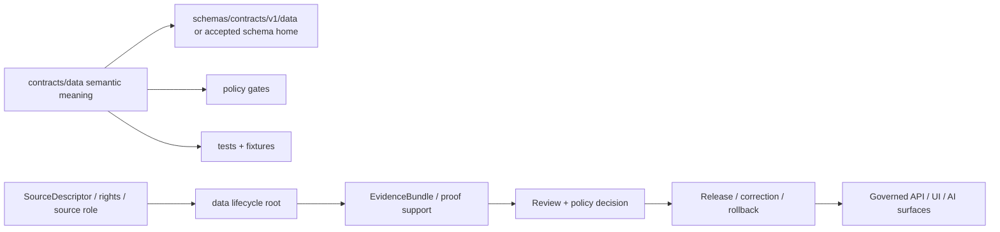

<!-- [KFM_META_BLOCK_V2]
doc_id: kfm://doc/contracts-data-readme
title: contracts/data/ — Data Semantic Contracts
type: readme
version: v0.2
status: draft
owners: OWNER_TBD — Contract steward · Data steward · Source steward · Evidence steward · Schema steward · Policy steward · Validation steward · Release steward · Docs steward
created: 2026-06-20
updated: 2026-06-20
policy_label: public; contracts; data; semantic-contracts; lifecycle-aware; evidence-aware
tags: [kfm, contracts, data, semantic-contracts, lifecycle, raw, work, quarantine, processed, catalog, triplet, published, evidence, governance]
related:
  - ../README.md
  - ../../docs/architecture/contract-schema-policy-split.md
  - ../../docs/architecture/domain-placement-law.md
  - ../../schemas/contracts/v1/
  - ../../policy/
  - ../../fixtures/
  - ../../tests/
  - ../../tools/validators/
  - ../../data/
  - ../../data/proofs/
  - ../../release/
notes:
  - "Expanded from a short stub into the data-family semantic-contract directory README."
  - "This directory defines semantic meanings for data-related contract objects only; it is not the actual data lifecycle root."
  - "Actual lifecycle data belongs under data/ with RAW -> WORK / QUARANTINE -> PROCESSED -> CATALOG / TRIPLET -> PUBLISHED boundaries."
  - "No paired schemas/contracts/v1/data schema home, validators, fixtures, or policy bundle were verified in this task."
[/KFM_META_BLOCK_V2] -->

<a id="top"></a>

# Data Semantic Contracts

> Directory contract for data-family semantic contracts. This folder defines the meaning of data-related governed objects and lifecycle references; it does not store datasets, source files, generated products, proofs, releases, schemas, validators, or policy rules.

<p>
  
  
  
  
  
  
</p>

`contracts/data/`

## Quick jumps

[Status](#status) · [Scope](#scope) · [Path posture](#path-posture) · [Repo fit](#repo-fit) · [Accepted inputs](#accepted-inputs) · [Exclusions](#exclusions) · [Current directory snapshot](#current-directory-snapshot) · [Contract inventory](#contract-inventory) · [Lifecycle boundary](#lifecycle-boundary) · [Semantic contract rules](#semantic-contract-rules) · [Lifecycle and trust boundary](#lifecycle-and-trust-boundary) · [Validation](#validation) · [Evidence basis](#evidence-basis) · [Rollback](#rollback) · [Definition of done](#definition-of-done)

---

## Status

> [!IMPORTANT]
> **Status:** `draft` / directory README  
> **Owner:** `OWNER_TBD`  
> **Path:** `contracts/data/`  
> **Truth posture:** `CONFIRMED` current path, current update, root contract split, and lifecycle doctrine. Paired schemas, validators, fixtures, policy behavior, source-registry behavior, data-object inventory, CI behavior, and runtime behavior remain `NEEDS VERIFICATION`.

---

## Scope

`contracts/data/` is the semantic-contract directory for data-related governed object families.

It may define meanings for objects such as dataset descriptors, dataset versions, data lifecycle references, derived-data manifests, data product candidates, data quality summaries, provenance links, and lifecycle-stage references when those concepts are not already owned by a more specific contract family.

It is **not** the actual data store.

Actual KFM data belongs under the `data/` responsibility root and must preserve the lifecycle boundary:

```text
RAW -> WORK / QUARANTINE -> PROCESSED -> CATALOG / TRIPLET -> PUBLISHED
```

This folder exists so maintainers can define what data contract objects mean without placing schemas, datasets, policies, validators, fixtures, proofs, or releases next to the prose contract.

---

## Path posture

The requested path is:

```text
contracts/data/
```

This path is appropriate only for semantic contract material. It must not be confused with:

```text
data/
```

| Path | Status | Meaning |
|---|---|---|
| `contracts/data/` | `CONFIRMED` current requested folder path | Semantic contracts for data-related object meanings. |
| `data/` | `CONFIRMED doctrine responsibility root` / concrete inventory `NEEDS VERIFICATION` | Actual lifecycle data root. |
| `schemas/contracts/v1/data/` | `UNKNOWN / NEEDS VERIFICATION` | Candidate machine-shape home for data contracts; not verified here. |
| `policy/data/` | `UNKNOWN / NEEDS VERIFICATION` | Candidate data-policy home; not verified here. |
| `tools/validators/data/` | `UNKNOWN / NEEDS VERIFICATION` | Candidate validator home; not verified here. |
| `fixtures/data/`, `tests/data/` | `UNKNOWN / NEEDS VERIFICATION` | Candidate enforceability homes; not verified here. |

---

## Repo fit

```text
contracts/
├── README.md
└── data/
    └── README.md
```

Adjacent responsibility roots:

| Root | Relationship to this folder |
|---|---|
| `../README.md` | Root contract guidance: semantic meaning only. |
| `../../docs/architecture/contract-schema-policy-split.md` | Governing split: contracts mean, schemas shape, policy decides, tests/fixtures enforce. |
| `../../docs/architecture/domain-placement-law.md` | Lifecycle/data root and responsibility-root placement doctrine. |
| `../../schemas/contracts/v1/` | Machine schema root; paired data schemas remain `NEEDS VERIFICATION`. |
| `../../policy/` | Admissibility, sensitivity, rights, source-role, and release decisions. |
| `../../tools/validators/`, `../../fixtures/`, `../../tests/` | Enforcement and examples. |
| `../../data/` | Actual lifecycle data root, not owned by this contract folder. |
| `../../data/proofs/` | EvidenceBundle/proof support for data claims. |
| `../../release/` | Public release, correction, supersession, rollback state. |

---

## Accepted inputs

| Belongs in this directory | Required posture |
|---|---|
| Data-family README files | Must orient maintainers to data contract meaning and boundaries. |
| Object-level semantic contracts for data references or data products | Must define what fields mean and how lifecycle/provenance/evidence gates apply. |
| Lifecycle-reference contract docs | Must distinguish raw, work, quarantine, processed, catalog, triplet, and published stages. |
| Dataset descriptor/version semantic docs | Must preserve source role, rights, provenance, temporal context, and evidence support. |
| Derived-data semantic docs | Must distinguish derived outputs from canonical/source truth. |
| Verification and rollback notes | Must point to schemas, policy, validators, fixtures, proofs, and release roots without claiming them unless verified. |

---

## Exclusions

| Does not belong here | Correct home |
|---|---|
| RAW source files | `../../data/raw/...`. |
| WORK/intermediate data | `../../data/work/...`. |
| Quarantined data | `../../data/quarantine/...`. |
| Processed derived data | `../../data/processed/...`. |
| Catalog records or matrices | `../../data/catalog/...` or accepted catalog root. |
| Triplets/graph records | `../../data/triplet/...` or accepted graph/triplet root. |
| Published data products | `../../data/published/...` and `../../release/...`. |
| EvidenceBundle/proof content | `../../data/proofs/...` or accepted proof root. |
| JSON Schema | `../../schemas/contracts/v1/...`. |
| Policy rules | `../../policy/...`. |
| Validator code | `../../tools/validators/...`. |
| Fixtures and tests | `../../fixtures/...`, `../../tests/...`. |
| Public API/UI/AI behavior | Governed app/API/UI/AI roots after validation and release. |
| Source registry records | `../../data/registry/sources/...` or accepted source registry home. |

---

## Current directory snapshot

> [!NOTE]
> This snapshot is based on current-session file inspection and repository search, not a complete tree inventory.

| File or folder | Status | What it proves | What it does not prove |
|---|---|---|---|
| `contracts/data/README.md` | `CONFIRMED` | This directory README exists and states data contract boundaries. | Does not prove data object contracts, schemas, validators, fixtures, or policy. |
| Other `contracts/data/*` files | `UNKNOWN` | Not inspected in this task. | Requires full inventory. |

---

## Contract inventory

No concrete object-level data contract files beyond this README were verified in this task.

| Contract family | Current evidence | Status | Notes |
|---|---|---|---|
| Dataset descriptor | `UNKNOWN` | `NEEDS VERIFICATION` | May be source/data/catalog-owned depending on object meaning. |
| Dataset version | `UNKNOWN` | `NEEDS VERIFICATION` | Must preserve source, temporal, hash, and provenance posture if authored. |
| Lifecycle reference | `PROPOSED` | `NEEDS VERIFICATION` | Must not replace actual lifecycle data roots. |
| Data product candidate | `PROPOSED` | `NEEDS VERIFICATION` | Must route through policy, review, release, and rollback gates. |
| Derived-data manifest | `PROPOSED` | `NEEDS VERIFICATION` | Must not claim derived layers are sovereign truth. |
| Data quality summary | `PROPOSED` | `NEEDS VERIFICATION` | Must distinguish validation result from policy approval or release state. |

---

## Lifecycle boundary

KFM data lifecycle stages are not interchangeable.

| Stage | Contract posture | Public posture |
|---|---|---|
| `RAW` | Source-admitted material before normalization. | Not public by default. |
| `WORK` | Intermediate working material. | Not public. |
| `QUARANTINE` | Held material due to rights, sensitivity, validation, source-role, or evidence problems. | Denied/restricted until resolved. |
| `PROCESSED` | Derived or normalized material after processing. | Not public by itself. |
| `CATALOG` | Catalog/index/metadata layer for discoverability and resolution. | Public only if released and policy-safe. |
| `TRIPLET` | Graph/triplet representation. | Derived view, not sovereign truth. |
| `PUBLISHED` | Released artifact or public-safe product. | Only after evidence, rights, sensitivity, validation, review, policy, and release gates. |

> [!CAUTION]
> A contract that describes data is not the data. A valid data contract does not make any dataset released, rights-cleared, evidence-backed, or safe for public use.

---

## Semantic contract rules

Every data contract under this folder must state:

- what object family or data reference it defines;
- which lifecycle stage(s) it can describe;
- required source-role and SourceDescriptor posture;
- EvidenceRef/EvidenceBundle requirements;
- temporal scope and retrieval/ingest/publication times where material;
- rights, sensitivity, and geoprivacy posture;
- validation and quality gates;
- public exposure limits;
- release, correction, supersession, and rollback behavior;
- examples of valid and invalid use;
- what belongs in schemas/policy/tests/data/release instead of the contract.

---

## Lifecycle and trust boundary



Contracts describe meaning. They do not validate schemas, store data, decide policy, create evidence, promote artifacts, publish outputs, or serve public clients.

---

## Validation

Before relying on this directory, verify:

- full `contracts/data/` inventory;
- object-level data contracts and owners;
- paired schemas and `$id` values;
- policy bundles for source role, rights, sensitivity, data lifecycle, admissibility, and release;
- validators and fixtures covering valid, invalid, quarantined, denied, abstain, stale, superseded, and rollback cases;
- SourceDescriptor/source-role support;
- EvidenceRef/EvidenceBundle resolution for consequential data claims;
- data lifecycle paths for any referenced artifact;
- public UI/API/AI caveat behavior;
- correction/supersession/rollback behavior for changed or invalid data products;
- no public path reads RAW, WORK, QUARANTINE, unpublished candidates, or internal stores as public truth.

---

## Evidence basis

| Source | Status | Supports | Limits |
|---|---|---|---|
| Prior `contracts/data/README.md` stub | `CONFIRMED` | Target file existed and identified `data` as a contract family. | Stub did not define scope, inputs, exclusions, evidence basis, or lifecycle boundary. |
| `contracts/README.md` | `CONFIRMED` | Contracts define semantic meaning; schemas define shape; executable validation, JSON Schema, policy code, and source data do not belong in contracts. | Root README does not inventory data contracts. |
| `docs/architecture/contract-schema-policy-split.md` | `CONFIRMED` | Meaning, shape, admissibility, and enforceability are separate layers. | Does not verify data-specific schemas, policy, or validators. |
| `docs/architecture/domain-placement-law.md` | `CONFIRMED derived doctrine` | Lifecycle invariant and responsibility-root/lane discipline; domains inherit the data lifecycle rather than redefining it. | Concrete implementation paths require repo verification. |
| `KFM Repository Markdown Authoring Agent — Full Operating Prompt v2` | `CONFIRMED user-supplied authoring guidance` | Requires evidence grounding, truth labels, no-loss preservation, GitHub polish, verification, and rollback posture. | It is authoring guidance, not repo implementation proof. |

---

## Rollback

Rollback is required if this README is used to claim schema completeness, validator coverage, source-registry maturity, source rights, release readiness, public API/UI behavior, actual data inventory, or implementation behavior that has not been verified.

Rollback target: prior stub content SHA `9d5d3426745b5ff580c8a8606a33de79aebdaff8`.

---

## Definition of done

- [ ] Owners are confirmed and `OWNER_TBD` is replaced.
- [ ] Full directory inventory is generated.
- [ ] Object-level data contracts are authored or explicitly marked absent.
- [ ] Paired schemas and `$id` values are verified.
- [ ] Validators and fixtures cover valid, invalid, quarantine, denied, abstain, stale, superseded, and rollback cases.
- [ ] SourceDescriptor/source-role and rights dependencies are verified.
- [ ] EvidenceRef/EvidenceBundle requirements are enforceable where consequential.
- [ ] Policy gates for rights, sensitivity, source role, lifecycle stage, and public release are linked and tested.
- [ ] Release/correction/supersession/rollback behavior is documented for changed or invalid data products.
- [ ] Public UI/API/AI surfaces preserve caveats and do not treat data contracts or derived rows as sovereign truth.

---

## Status summary

`contracts/data/` is a semantic-contract directory for data-related object meanings and lifecycle references. It is not the `data/` lifecycle root, not a schema home, not a policy home, not a validator package, not a fixture store, not a source registry, not a proof root, not a release authority, not a public API/UI surface, and not permission to treat a data reference as public truth.

<p align="right"><a href="#top">Back to top</a></p>
