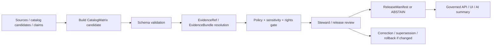

<!-- [KFM_META_BLOCK_V2]
doc_id: kfm://contract/data/catalog-matrix
title: contracts/data/catalog_matrix.md — CatalogMatrix Contract
type: contract
version: v0.2
status: draft
owners: OWNER_TBD — Contract steward · Data steward · Catalog steward · Evidence steward · Schema steward · Policy steward · Validation steward · Release steward · Docs steward
created: 2026-06-20
updated: 2026-06-20
policy_label: public; contracts; data; catalog-matrix; semantic-contract; evidence-aware; release-aware
tags: [kfm, contracts, data, catalog-matrix, catalog, matrix, evidence, source-role, lifecycle, release, validation, governance]
related:
  - ./README.md
  - ../common/spec_hash.md
  - ../../schemas/contracts/v1/data/catalog_matrix.schema.json
  - ../../fixtures/data/catalog_matrix/
  - ../../tools/validators/data/validate_catalog_matrix.py
  - ../../policy/data/
  - ../../docs/architecture/contract-schema-policy-split.md
  - ../../docs/architecture/domain-placement-law.md
  - ../../data/catalog/
  - ../../data/proofs/
  - ../../release/
notes:
  - "Expanded from a greenfield scaffold into the object-level CatalogMatrix semantic contract."
  - "Machine-checkable shape is in schemas/contracts/v1/data/catalog_matrix.schema.json, but that schema is explicitly a greenfield placeholder with only id required and additional properties allowed."
  - "The schema-declared validator path was not found in this session; validator behavior remains UNKNOWN / NEEDS VERIFICATION."
  - "CatalogMatrix is a catalog/evidence matrix descriptor, not a dataset payload, not proof closure by itself, not a release artifact, and not public truth by itself."
[/KFM_META_BLOCK_V2] -->

<a id="top"></a>

# CatalogMatrix Contract

> Semantic contract for `CatalogMatrix`, a governed matrix-like catalog descriptor that records how a set of catalog entries, claims, layers, sources, evidence bundles, or release candidates relate across source role, evidence support, lifecycle state, policy posture, review state, and release readiness.

<p>
  
  
  
  
  
  
</p>

`contracts/data/catalog_matrix.md`

## Quick jumps

[Status](#status) · [Meaning](#meaning) · [Repo fit](#repo-fit) · [Schema pairing](#schema-pairing) · [Accepted uses](#accepted-uses) · [Exclusions](#exclusions) · [Fields](#fields) · [Recommended semantic fields](#recommended-semantic-fields) · [Invariants](#invariants) · [Lifecycle](#lifecycle) · [Validation](#validation) · [No-loss preservation](#no-loss-preservation) · [Evidence basis](#evidence-basis) · [Rollback](#rollback) · [Definition of done](#definition-of-done)

---

## Status

> [!IMPORTANT]
> **Status:** `draft` / semantic contract  
> **Owner:** `OWNER_TBD`  
> **Contract path:** `contracts/data/catalog_matrix.md`  
> **Schema path:** `schemas/contracts/v1/data/catalog_matrix.schema.json`  
> **Truth posture:** `CONFIRMED` contract path, current update, parent data README, root authority split, lifecycle doctrine, and placeholder schema presence. Validator path was not found. Field completeness, fixtures, policy behavior, catalog implementation, release integration, public route/UI behavior, and tests remain `NEEDS VERIFICATION`.

---

## Meaning

`CatalogMatrix` is a semantic descriptor for a matrix of cataloged relationships.

It does **not** carry the full dataset. It records a reviewable structure that can answer questions such as:

- Which sources support which catalog entries?
- Which EvidenceBundles support which claims?
- Which entries are RAW-derived, WORK/QUARANTINE-held, PROCESSED, CATALOG-ready, TRIPLET-projected, or PUBLISHED?
- Which catalog entries are allowed, denied, restricted, or abstained by policy?
- Which entries need review, correction, supersession, rollback, or release action?
- Which public artifacts depend on which catalog/evidence/source relationships?

A `CatalogMatrix` is an inspectability aid. It is not sovereign truth, not a release decision, and not evidence by itself.

---

## Repo fit

```text
contracts/
└── data/
    ├── README.md
    └── catalog_matrix.md

schemas/
└── contracts/
    └── v1/
        └── data/
            └── catalog_matrix.schema.json
```

Adjacent responsibility roots:

| Root | Relationship to this contract |
|---|---|
| `./README.md` | Data-family contract directory boundary. |
| `../common/spec_hash.md` | Shared semantic contract for deterministic spec/content hash references. |
| `../../schemas/contracts/v1/data/catalog_matrix.schema.json` | Current placeholder schema for this semantic contract. |
| `../../fixtures/data/catalog_matrix/` | Schema-declared fixture root; existence/coverage remain `NEEDS VERIFICATION`. |
| `../../tools/validators/data/validate_catalog_matrix.py` | Schema-declared validator path; not found in this session. |
| `../../policy/data/` | Data policy home declared by schema; behavior remains `NEEDS VERIFICATION`. |
| `../../data/catalog/` | Candidate catalog data root; concrete inventory remains `NEEDS VERIFICATION`. |
| `../../data/proofs/` | EvidenceBundle/proof support for matrix cells and claims. |
| `../../release/` | Release state, corrections, supersession, rollback targets. |

---

## Schema pairing

The paired schema is:

```text
schemas/contracts/v1/data/catalog_matrix.schema.json
```

The schema defines machine shape. This Markdown contract defines meaning.

The current schema metadata identifies:

| Schema metadata | Value | Verification posture |
|---|---|---|
| `$id` | `https://schemas.kfm.local/contracts/v1/data/catalog_matrix.schema.json` | `CONFIRMED` from schema. |
| `contract_doc` | `contracts/data/catalog_matrix.md` | `CONFIRMED` from schema metadata. |
| `fixtures_root` | `fixtures/data/catalog_matrix/` | `NEEDS VERIFICATION` existence/coverage. |
| `validator` | `tools/validators/data/validate_catalog_matrix.py` | `UNKNOWN / NOT FOUND` in this session. |
| `policy` | `policy/data/` | `NEEDS VERIFICATION` existence/behavior. |
| `status` | `PROPOSED` | `CONFIRMED` from schema metadata. |

> [!CAUTION]
> The current schema is explicitly a greenfield placeholder. It only requires `id`, allows additional properties, and does not yet encode the full catalog-matrix semantics in this contract.

---

## Accepted uses

| Use | Allowed? | Rule |
|---|---:|---|
| Describing a catalog/evidence/source relationship matrix | Yes | Must identify matrix purpose, scope, rows, columns, and cell meaning. |
| Supporting release review or steward review | Yes | Must preserve evidence, policy, and review state without acting as approval. |
| Summarizing source coverage or evidence coverage | Yes | Must resolve source/evidence references where consequential. |
| Tracking lifecycle posture across entries | Yes | Must not collapse RAW, WORK, QUARANTINE, PROCESSED, CATALOG, TRIPLET, and PUBLISHED. |
| Serving public UI/API data directly | No | Public surfaces must use governed, released, policy-safe outputs. |
| Replacing EvidenceBundle/proofs | No | Matrix cells may reference evidence; they are not proof closure. |
| Acting as a ReleaseManifest or PolicyDecision | No | Release and policy objects remain separate. |
| Carrying full datasets or raw records | No | Actual data belongs under lifecycle roots. |

---

## Exclusions

| Does not belong in `CatalogMatrix` | Correct owner / surface |
|---|---|
| Full dataset rows or raw source payloads | `../../data/raw/`, `../../data/work/`, `../../data/processed/`, or accepted lifecycle root. |
| Full EvidenceBundle content | `../../data/proofs/` or accepted evidence/proof root. |
| JSON Schema shape | `../../schemas/contracts/v1/data/catalog_matrix.schema.json`. |
| Policy decisions | `../../policy/data/` or specific policy decision contracts. |
| Validator code | `../../tools/validators/data/`. |
| Fixtures/tests | `../../fixtures/data/catalog_matrix/`, `../../tests/`. |
| Release manifest, rollback card, correction notice, supersession notice | `../../release/`, `../correction/`, `../release/`. |
| Public API/UI/AI rendering | Governed application, API, UI, or AI runtime roots. |
| Graph/triplet projection as truth replacement | Triplet/graph projection roots after release and evidence gates. |

---

## Fields

The current placeholder schema only defines these machine fields:

| Field | Required by current schema | Semantic meaning | Verification posture |
|---|---:|---|---|
| `id` | Yes | Canonical identifier for the catalog matrix object. | `CONFIRMED` schema field; format not constrained by current schema. |
| `version` | No | Contract/object version for the matrix. | `CONFIRMED` schema field; semantics need stronger schema support. |
| `spec_hash` | No | Deterministic content/spec hash reference. | `CONFIRMED` schema field; current schema says string only and does not enforce `spec_hash` common pattern. |

---

## Recommended semantic fields

The data README and KFM lifecycle doctrine require more semantic structure than the current placeholder schema enforces.

These fields are `PROPOSED` for future schema/fixture/validator work unless already adopted elsewhere:

| Field | Semantic role | Why it matters |
|---|---|---|
| `matrix_id` or canonical `id` | Stable identifier. | Makes matrix auditable and linkable. |
| `matrix_type` | Coverage, evidence, source, policy, release, sensitivity, or lifecycle matrix. | Prevents ambiguous interpretation. |
| `scope` | Domain, layer, source family, release candidate, county/focus mode, or artifact scope. | Bounds claims and review. |
| `rows` | Row entities such as sources, claims, entries, artifacts, or layers. | Defines one matrix axis. |
| `columns` | Column entities such as evidence, policy states, lifecycle states, domains, or release gates. | Defines the second matrix axis. |
| `cells` | Matrix relationship assertions. | Each consequential cell should carry evidence/provenance/policy state. |
| `evidence_refs` | EvidenceBundle or EvidenceRef links. | Prevents matrix rows from becoming unsupported summary claims. |
| `source_refs` | SourceDescriptor or source identity references. | Preserves source role and rights posture. |
| `lifecycle_state` | RAW/WORK/QUARANTINE/PROCESSED/CATALOG/TRIPLET/PUBLISHED posture for entries where relevant. | Prevents public-path bypass. |
| `policy_state` | ALLOW/DENY/RESTRICT/ABSTAIN or review-needed state. | Separates admissibility from meaning. |
| `review_state` | Review readiness or steward status. | Supports release gates. |
| `release_ref` | ReleaseManifest or release candidate linkage. | Prevents matrix from acting as release itself. |
| `correction_refs` | Correction/supersession/rollback linkage. | Preserves auditability and reversibility. |
| `generated_receipt_ref` | AI-generated summary receipt where applicable. | Keeps AI interpretation evidence-subordinate. |

---

## Invariants

A `CatalogMatrix` must preserve these invariants:

- it describes relationships; it does not replace the related objects;
- every consequential cell must be supported by evidence, source metadata, or an explicit `ABSTAIN` / `NEEDS VERIFICATION` state;
- lifecycle states must not be collapsed;
- quarantine/denied/restricted entries must not be exposed as public-ready;
- policy state is not schema validity;
- release readiness is not release approval;
- derived summaries, graph projections, tiles, vector indexes, dashboards, or AI-generated interpretations must not be treated as source truth;
- public clients must consume governed, released, policy-safe outputs, not raw/internal matrix candidates;
- correction/supersession/rollback linkage must be preserved when matrix relationships change after publication.

---

## Lifecycle



Lifecycle notes:

- A matrix may be created during PROCESSED-building, catalog assembly, evidence review, release preparation, correction review, or audit.
- Schema validation proves only shape.
- Evidence resolution determines whether matrix claims are supported.
- Policy/review/release gates decide whether matrix-derived outputs may become public.
- Published matrix-derived outputs require correction/supersession/rollback posture.

---

## Validation

Before relying on this contract, verify:

- schema expanded beyond the current greenfield placeholder or intentionally accepted as placeholder;
- validator path exists and behavior is implemented;
- fixtures cover valid, invalid, denied, restricted, abstain, stale, superseded, corrected, and rollback cases;
- row/column/cell semantics are explicit and stable;
- cell-level evidence references resolve where consequential;
- SourceDescriptor/source-role support exists for source-linked rows;
- lifecycle state is validated and does not bypass the trust membrane;
- policy states are linked to policy decisions or review gates;
- release/correction/supersession/rollback references are validated where public outputs depend on the matrix;
- public UI/API/AI surfaces do not read matrix candidates as public truth.

---

## No-loss preservation

| Existing element | Disposition | Reason |
|---|---|---|
| Prior title/family/status scaffold | `KEEP + EXPAND` | Preserved data family and proposed scaffold posture. |
| Schema path | `KEEP + GROUND` | Current placeholder schema exists and is cited. |
| Meaning section | `KEEP + REPLACE WITH CONCRETE SEMANTICS` | The scaffold asked what meaning should be; this edit supplies lifecycle/evidence-grounded meaning. |
| Fields section | `KEEP + CLARIFY` | Current schema fields are documented, and recommended semantic fields are labeled `PROPOSED`. |
| Invariants | `KEEP + STRENGTHEN` | General invariant placeholders are replaced with matrix-specific trust invariants. |
| Lifecycle | `KEEP + CLARIFY` | Lifecycle now separates build, schema validation, evidence, policy, review, release, public output, and correction. |
| Open questions | `KEEP + MOVE INTO VALIDATION / DEFINITION OF DONE` | Verification gaps are now actionable. |

---

## Evidence basis

| Source | Status | Supports | Limits |
|---|---|---|---|
| Prior `contracts/data/catalog_matrix.md` scaffold | `CONFIRMED` | Target file existed as proposed greenfield scaffold with family and schema path. | It contained placeholders, not complete semantics. |
| `schemas/contracts/v1/data/catalog_matrix.schema.json` | `CONFIRMED placeholder` | Current schema exists; x-kfm metadata points to this contract, fixtures, validator, and policy; `id` is the only required field. | Schema explicitly says greenfield placeholder and does not enforce full catalog-matrix semantics. |
| `tools/validators/data/validate_catalog_matrix.py` | `UNKNOWN / NOT FOUND` | Schema-declared validator path was checked. | File was not found in this session; behavior is not implemented evidence. |
| `contracts/data/README.md` | `CONFIRMED` | Data contracts are semantic meaning only and must not be confused with the actual data lifecycle root. | Does not complete object-level schema or validator behavior. |
| `docs/architecture/contract-schema-policy-split.md` | `CONFIRMED` | Contracts define meaning; schemas define shape; policy decides admissibility; tests/fixtures prove enforceability. | Does not verify catalog-matrix-specific implementation. |
| `docs/architecture/domain-placement-law.md` | `CONFIRMED derived doctrine` | Lifecycle invariant and responsibility-root/lane discipline. | Concrete implementation paths require repo verification. |
| `KFM Repository Markdown Authoring Agent — Full Operating Prompt v2` | `CONFIRMED user-supplied authoring guidance` | Requires evidence grounding, truth labels, no-loss preservation, GitHub polish, verification, and rollback posture. | It is authoring guidance, not repo implementation proof. |

---

## Rollback

Rollback is required if this contract is used to claim schema completeness, validator coverage, policy enforcement, catalog implementation, release execution, public-route behavior, or implementation maturity not verified in this session.

Rollback target: prior scaffold content SHA `77fe279aa108254672b59789e49dbef510d5c5aa`.

---

## Definition of done

- [ ] Owners are confirmed and `OWNER_TBD` is replaced.
- [ ] Schema is expanded beyond greenfield placeholder or placeholder status is intentionally accepted.
- [ ] Validator path exists and behavior is implemented.
- [ ] Fixtures cover catalog matrix scenarios and invalid cases.
- [ ] Row, column, and cell semantics are defined and machine-validated.
- [ ] EvidenceRef/EvidenceBundle linkage is required where consequential.
- [ ] SourceDescriptor/source-role and rights dependencies are verified.
- [ ] PolicyDecision/review/release state linkage is defined and tested.
- [ ] Public-safe matrix-derived output behavior is verified.
- [ ] Tests fail on public use of RAW/WORK/QUARANTINE/unreleased matrix candidates.

---

## Status summary

`CatalogMatrix` is a semantic descriptor for catalog/evidence/source/policy/release relationship matrices. It is not a dataset payload, not proof closure, not policy approval, not release approval, not a public artifact by itself, not a graph projection as truth, and not permission to bypass lifecycle, evidence, policy, review, or release gates.

<p align="right"><a href="#top">Back to top</a></p>
