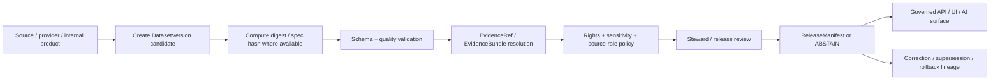

<!-- [KFM_META_BLOCK_V2]
doc_id: kfm://contract/data/dataset-version
title: contracts/data/dataset_version.md — DatasetVersion Contract
type: contract
version: v0.2
status: draft
owners: OWNER_TBD — Contract steward · Data steward · Source steward · Evidence steward · Schema steward · Policy steward · Validation steward · Release steward · Docs steward
created: 2026-06-20
updated: 2026-06-20
policy_label: public; contracts; data; dataset-version; semantic-contract; lifecycle-aware; provenance-aware
tags: [kfm, contracts, data, dataset-version, source, provenance, lifecycle, evidence, rights, sensitivity, release, correction, governance]
related:
  - ./README.md
  - ../common/spec_hash.md
  - ../common/temporal_window.md
  - ../../schemas/contracts/v1/data/dataset_version.schema.json
  - ../../fixtures/data/dataset_version/
  - ../../tools/validators/data/validate_dataset_version.py
  - ../../policy/data/
  - ../../docs/architecture/contract-schema-policy-split.md
  - ../../docs/architecture/domain-placement-law.md
  - ../../data/registry/sources/
  - ../../data/proofs/
  - ../../release/
notes:
  - "Expanded from a greenfield scaffold into the object-level DatasetVersion semantic contract."
  - "Machine-checkable shape is in schemas/contracts/v1/data/dataset_version.schema.json, but that schema is explicitly a greenfield placeholder with only id required and additional properties allowed."
  - "The schema-declared validator path was not found in this session; validator behavior remains UNKNOWN / NEEDS VERIFICATION."
  - "DatasetVersion is a version/provenance descriptor for a dataset representation, not the dataset payload, not proof closure by itself, not source rights approval, not policy approval, and not release approval."
[/KFM_META_BLOCK_V2] -->

<a id="top"></a>

# DatasetVersion Contract

> Semantic contract for `DatasetVersion`, the governed descriptor that identifies a specific version of a dataset representation, including its source/provenance posture, lifecycle state, integrity references, temporal context, rights/sensitivity posture, evidence support, and release/correction lineage.

<p>
  
  
  
  
  
  
</p>

`contracts/data/dataset_version.md`

## Quick jumps

[Status](#status) · [Meaning](#meaning) · [Repo fit](#repo-fit) · [Schema pairing](#schema-pairing) · [Accepted uses](#accepted-uses) · [Exclusions](#exclusions) · [Fields](#fields) · [Recommended semantic fields](#recommended-semantic-fields) · [Invariants](#invariants) · [Versioning semantics](#versioning-semantics) · [Lifecycle](#lifecycle) · [Validation](#validation) · [No-loss preservation](#no-loss-preservation) · [Evidence basis](#evidence-basis) · [Rollback](#rollback) · [Definition of done](#definition-of-done)

---

## Status

> [!IMPORTANT]
> **Status:** `draft` / semantic contract  
> **Owner:** `OWNER_TBD`  
> **Contract path:** `contracts/data/dataset_version.md`  
> **Schema path:** `schemas/contracts/v1/data/dataset_version.schema.json`  
> **Truth posture:** `CONFIRMED` contract path, current update, parent data README, root authority split, lifecycle doctrine, and placeholder schema presence. Validator path was not found. Field completeness, fixtures, policy behavior, source-registry behavior, data lifecycle integration, release integration, and tests remain `NEEDS VERIFICATION`.

---

## Meaning

`DatasetVersion` identifies one governed version of a dataset representation.

It answers questions such as:

- Which dataset version is being referenced?
- Which source, source role, authority, or provider context produced or supports it?
- Which representation or digest identifies the version?
- Which lifecycle stage does this version occupy?
- Which EvidenceBundle, SourceDescriptor, run receipt, validation report, policy decision, review state, release manifest, or correction/supersession record applies?
- Which rights, sensitivity, temporal, and public exposure constraints follow it?

A `DatasetVersion` is a version and provenance descriptor. It is not the dataset payload itself, not proof of correctness, not source-rights clearance, not policy approval, and not release approval.

---

## Repo fit

```text
contracts/
└── data/
    ├── README.md
    ├── catalog_matrix.md
    └── dataset_version.md

schemas/
└── contracts/
    └── v1/
        └── data/
            └── dataset_version.schema.json
```

Adjacent responsibility roots:

| Root | Relationship to this contract |
|---|---|
| `./README.md` | Data-family contract directory boundary. |
| `../common/spec_hash.md` | Shared semantic contract for deterministic hash references. |
| `../common/temporal_window.md` | Shared semantic contract for explicit time windows and time kinds. |
| `../../schemas/contracts/v1/data/dataset_version.schema.json` | Current placeholder schema for this semantic contract. |
| `../../fixtures/data/dataset_version/` | Schema-declared fixture root; existence/coverage remain `NEEDS VERIFICATION`. |
| `../../tools/validators/data/validate_dataset_version.py` | Schema-declared validator path; not found in this session. |
| `../../policy/data/` | Data policy home declared by schema; behavior remains `NEEDS VERIFICATION`. |
| `../../data/registry/sources/` | SourceDescriptor/source-role registry context. |
| `../../data/proofs/` | EvidenceBundle/proof support for version claims. |
| `../../release/` | Release state, corrections, supersession, rollback targets. |

---

## Schema pairing

The paired schema is:

```text
schemas/contracts/v1/data/dataset_version.schema.json
```

The schema defines machine shape. This Markdown contract defines meaning.

The current schema metadata identifies:

| Schema metadata | Value | Verification posture |
|---|---|---|
| `$id` | `https://schemas.kfm.local/contracts/v1/data/dataset_version.schema.json` | `CONFIRMED` from schema. |
| `contract_doc` | `contracts/data/dataset_version.md` | `CONFIRMED` from schema metadata. |
| `fixtures_root` | `fixtures/data/dataset_version/` | `NEEDS VERIFICATION` existence/coverage. |
| `validator` | `tools/validators/data/validate_dataset_version.py` | `UNKNOWN / NOT FOUND` in this session. |
| `policy` | `policy/data/` | `NEEDS VERIFICATION` existence/behavior. |
| `status` | `PROPOSED` | `CONFIRMED` from schema metadata. |

> [!CAUTION]
> The current schema is explicitly a greenfield placeholder. It only requires `id`, allows additional properties, and does not yet encode the full dataset-version semantics in this contract.

---

## Accepted uses

| Use | Allowed? | Rule |
|---|---:|---|
| Identifying a specific dataset representation/version | Yes | Must preserve stable ID, version, source/provenance, and digest where available. |
| Supporting lifecycle transitions | Yes | Must not collapse RAW, WORK, QUARANTINE, PROCESSED, CATALOG, TRIPLET, and PUBLISHED. |
| Linking to SourceDescriptor/source role | Yes | Must preserve source role and rights/sensitivity posture. |
| Linking to EvidenceBundle or validation output | Yes | Must not treat linkage as proof closure without resolution. |
| Referencing released public products | Conditional | Requires ReleaseManifest/review/policy support. |
| Serving as the dataset payload | No | Actual data belongs under data lifecycle roots. |
| Proving source rights or publication permission | No | Rights/policy/release decisions remain separate. |
| Replacing correction/supersession/rollback records | No | Version lineage needs correction/release surfaces. |

---

## Exclusions

| Does not belong in `DatasetVersion` | Correct owner / surface |
|---|---|
| Full dataset payload | `../../data/raw/`, `../../data/work/`, `../../data/processed/`, or accepted lifecycle root. |
| Full SourceDescriptor record | `../../data/registry/sources/` and source contracts. |
| Full EvidenceBundle content | `../../data/proofs/` or accepted evidence/proof root. |
| JSON Schema shape | `../../schemas/contracts/v1/data/dataset_version.schema.json`. |
| Policy decisions | `../../policy/data/` or specific policy decision contracts. |
| Validator code | `../../tools/validators/data/`. |
| Fixtures/tests | `../../fixtures/data/dataset_version/`, `../../tests/`. |
| Release manifest, rollback card, correction notice, supersession notice | `../../release/`, `../correction/`, `../release/`. |
| Public API/UI/AI rendering | Governed application, API, UI, or AI runtime roots. |
| Live external-source terms or endpoint status | Source activation records and current RunReceipt/source checks. |

---

## Fields

The current placeholder schema only defines these machine fields:

| Field | Required by current schema | Semantic meaning | Verification posture |
|---|---:|---|---|
| `id` | Yes | Canonical identifier for the dataset version object. | `CONFIRMED` schema field; format not constrained by current schema. |
| `version` | No | Contract/object version for the dataset version record. | `CONFIRMED` schema field; semantics need stronger schema support. |
| `spec_hash` | No | Deterministic content/spec hash reference. | `CONFIRMED` schema field; current schema says string only and does not enforce `spec_hash` common pattern. |

---

## Recommended semantic fields

The data README and KFM lifecycle doctrine require more semantic structure than the current placeholder schema enforces.

These fields are `PROPOSED` for future schema/fixture/validator work unless already adopted elsewhere:

| Field | Semantic role | Why it matters |
|---|---|---|
| `dataset_id` | Stable identity for the dataset family. | Separates dataset family from a particular version. |
| `dataset_version_id` or canonical `id` | Stable identity for this version. | Makes the version citeable and auditable. |
| `version_label` | Provider or KFM version string. | Supports human review and source comparison. |
| `content_hash` / `spec_hash` | Deterministic digest of versioned representation or spec. | Supports drift detection and rollback. |
| `source_ref` | SourceDescriptor or source identity reference. | Preserves source role, rights, and authority limits. |
| `retrieved_at` / `published_at` / `ingested_at` | Distinct temporal contexts. | Prevents time-kind collapse. |
| `lifecycle_state` | RAW/WORK/QUARANTINE/PROCESSED/CATALOG/TRIPLET/PUBLISHED. | Prevents public-path bypass. |
| `rights_state` | Rights/license/terms posture. | Prevents release without rights support. |
| `sensitivity_state` | Sensitivity/geoprivacy posture. | Prevents unsafe publication. |
| `evidence_refs` | EvidenceBundle or EvidenceRef links. | Supports cite-or-abstain. |
| `validation_refs` | Validation reports or run receipts. | Separates validation result from source truth. |
| `policy_decision_ref` | ALLOW/DENY/RESTRICT/ABSTAIN decision where applicable. | Keeps policy authority separate. |
| `release_ref` | ReleaseManifest/release candidate linkage. | Keeps release authority separate. |
| `supersedes` / `superseded_by` | Dataset version lineage. | Supports correction, rollback, and current/old comparisons. |
| `rollback_target` | Prior known-safe version or release target. | Supports reversibility. |

---

## Invariants

A `DatasetVersion` must preserve these invariants:

- it identifies a version; it does not contain the full dataset payload;
- dataset family identity and version identity must remain distinguishable;
- source role and rights posture must not be inferred from the dataset ID alone;
- lifecycle state must not be collapsed or bypassed;
- schema validity is not source truth;
- validation success is not policy approval;
- policy approval is not release approval;
- release approval is not evidence proof;
- public clients must consume governed, released, policy-safe outputs, not raw/internal dataset versions;
- correction, supersession, and rollback lineage must be preserved when a dataset version changes after publication.

---

## Versioning semantics

A dataset version may represent different versioning bases:

| Version basis | Meaning | Required caution |
|---|---|---|
| Provider release version | Source/provider-defined version. | Preserve provider metadata and retrieval context. |
| Retrieval snapshot | KFM captured a source at a point in time. | Include retrieval time and content digest. |
| Processing version | KFM transformed source data into a derived representation. | Preserve run receipt, pipeline version, and inputs. |
| Corrected version | Version produced due to defect, source update, rights change, or sensitivity change. | Link CorrectionNotice/SupersessionNotice. |
| Published version | Version released to public-safe surfaces. | Link ReleaseManifest and rollback target. |

---

## Lifecycle



Lifecycle notes:

- A dataset version may be created during source admission, retrieval, processing, cataloging, release preparation, correction, or audit.
- Schema validation proves only shape.
- Hashes support drift detection; they do not prove correctness or authority.
- Evidence/source linkage determines whether version claims are supported.
- Policy/review/release gates decide whether outputs derived from a dataset version may become public.
- Supersession/correction records are required when published dataset versions change materially.

---

## Validation

Before relying on this contract, verify:

- schema expanded beyond the current greenfield placeholder or intentionally accepted as placeholder;
- validator path exists and behavior is implemented;
- fixtures cover provider version, retrieval snapshot, processed derivative, corrected version, published version, denied/restricted version, stale version, and rollback cases;
- dataset family ID and dataset version ID semantics are stable;
- source references resolve to SourceDescriptor/source registry records;
- rights/license/terms posture is represented and policy-checkable;
- sensitivity/geoprivacy posture is represented and policy-checkable;
- time kinds are explicit for published/retrieved/ingested/effective/corrected/superseded dates where material;
- EvidenceRef/EvidenceBundle linkage is required where consequential;
- ReleaseManifest/correction/supersession/rollback references are validated where public outputs depend on the version;
- public UI/API/AI surfaces do not read raw/internal/unreleased dataset versions as public truth.

---

## No-loss preservation

| Existing element | Disposition | Reason |
|---|---|---|
| Prior title/family/status scaffold | `KEEP + EXPAND` | Preserved data family and proposed scaffold posture. |
| Schema path | `KEEP + GROUND` | Current placeholder schema exists and is cited. |
| Meaning section | `KEEP + REPLACE WITH CONCRETE SEMANTICS` | The scaffold asked what meaning should be; this edit supplies lifecycle/provenance-grounded meaning. |
| Fields section | `KEEP + CLARIFY` | Current schema fields are documented, and recommended semantic fields are labeled `PROPOSED`. |
| Invariants | `KEEP + STRENGTHEN` | General invariant placeholders are replaced with dataset-version trust invariants. |
| Lifecycle | `KEEP + CLARIFY` | Lifecycle now separates source, versioning, hashing, validation, evidence, policy, review, release, and lineage. |
| Open questions | `KEEP + MOVE INTO VALIDATION / DEFINITION OF DONE` | Verification gaps are now actionable. |

---

## Evidence basis

| Source | Status | Supports | Limits |
|---|---|---|---|
| Prior `contracts/data/dataset_version.md` scaffold | `CONFIRMED` | Target file existed as proposed greenfield scaffold with family and schema path. | It contained placeholders, not complete semantics. |
| `schemas/contracts/v1/data/dataset_version.schema.json` | `CONFIRMED placeholder` | Current schema exists; x-kfm metadata points to this contract, fixtures, validator, and policy; `id` is the only required field. | Schema explicitly says greenfield placeholder and does not enforce full dataset-version semantics. |
| `tools/validators/data/validate_dataset_version.py` | `UNKNOWN / NOT FOUND` | Schema-declared validator path was checked. | File was not found in this session; behavior is not implemented evidence. |
| `contracts/data/README.md` | `CONFIRMED` | Data contracts are semantic meaning only and must not be confused with the actual data lifecycle root. | Does not complete object-level schema or validator behavior. |
| `docs/architecture/contract-schema-policy-split.md` | `CONFIRMED` | Contracts define meaning; schemas define shape; policy decides admissibility; tests/fixtures prove enforceability. | Does not verify dataset-version-specific implementation. |
| `docs/architecture/domain-placement-law.md` | `CONFIRMED derived doctrine` | Lifecycle invariant and responsibility-root/lane discipline. | Concrete implementation paths require repo verification. |
| `KFM Repository Markdown Authoring Agent — Full Operating Prompt v2` | `CONFIRMED user-supplied authoring guidance` | Requires evidence grounding, truth labels, no-loss preservation, GitHub polish, verification, and rollback posture. | It is authoring guidance, not repo implementation proof. |

---

## Rollback

Rollback is required if this contract is used to claim schema completeness, validator coverage, policy enforcement, rights clearance, source-registry behavior, release execution, public-route behavior, or implementation maturity not verified in this session.

Rollback target: prior scaffold content SHA `84e7493f95f121867876218ddd693d976a1df86c`.

---

## Definition of done

- [ ] Owners are confirmed and `OWNER_TBD` is replaced.
- [ ] Schema is expanded beyond greenfield placeholder or placeholder status is intentionally accepted.
- [ ] Validator path exists and behavior is implemented.
- [ ] Fixtures cover provider, retrieval, processed, corrected, published, denied/restricted, stale, and rollback scenarios.
- [ ] Dataset family identity and version identity are stable and tested.
- [ ] SourceDescriptor/source-role and rights dependencies are verified.
- [ ] EvidenceRef/EvidenceBundle linkage is required where consequential.
- [ ] PolicyDecision/review/release state linkage is defined and tested.
- [ ] Correction/supersession/rollback behavior is documented for changed dataset versions.
- [ ] Tests fail on public use of RAW/WORK/QUARANTINE/unreleased dataset versions.

---

## Status summary

`DatasetVersion` is a semantic version/provenance descriptor for a dataset representation. It is not the dataset payload, not proof of correctness, not rights clearance, not policy approval, not release approval, not proof closure, and not permission to expose unreleased or sensitive data to public clients.

<p align="right"><a href="#top">Back to top</a></p>
