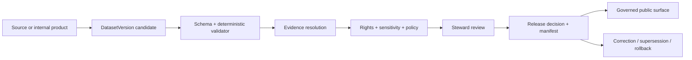

<!-- [KFM_META_BLOCK_V2]
doc_id: kfm://contract/data/dataset-version
title: contracts/data/dataset_version.md — DatasetVersion Contract
type: contract
version: v0.3
status: draft
owners: OWNER_TBD — Contract steward · Data steward · Source steward · Evidence steward · Schema steward · Policy steward · Validation steward · Release steward · Docs steward
created: 2026-06-20
updated: 2026-08-15
policy_label: public; contracts; data; dataset-version; semantic-contract; lifecycle-aware; provenance-aware
related:
  - ./README.md
  - ../common/spec_hash.md
  - ../common/temporal_window.md
  - ../../schemas/contracts/v1/data/dataset_version.schema.json
  - ../../fixtures/contracts/v1/data/dataset_version/
  - ../../tools/validators/data/validate_dataset_version.py
  - ../../tests/validators/data/test_validate_dataset_version.py
  - ../../.github/workflows/dataset-version.yml
  - ../../docs/intake/exploratory/dataset-version-source-reconciliation.md
  - ../../data/receipts/generated/genrec-dataset-version-20260815.json
  - ../../policy/data/
  - ../../data/registry/sources/
  - ../../data/proofs/
  - ../../release/
tags: [kfm, contracts, data, dataset-version, source, provenance, lifecycle, evidence, rights, sensitivity, release, correction, governance]
notes:
  - "v0.3 preserves the draft semantic identity while pairing it with a strict proposed v1 schema, fixture corpus, no-network validator, focused tests, workflow, source map, and generated authoring receipt."
  - "The profile validates shape, deterministic identity, time ordering, canonical references, and bounded lifecycle/lineage consistency only."
  - "A passing profile does not activate a source, resolve evidence, decide rights/sensitivity, authorize release, publish, or permit public use."
[/KFM_META_BLOCK_V2] -->

# DatasetVersion Contract

> Semantic contract for `DatasetVersion`, the governed descriptor for one version of a dataset representation.

## Status

| Field | Value |
|---|---|
| Semantic status | `draft` — unchanged |
| Schema | `schemas/contracts/v1/data/dataset_version.schema.json` — strict `PROPOSED` v1 shape |
| Fixtures | `fixtures/contracts/v1/data/dataset_version/` — synthetic valid/invalid cases |
| Validator | `tools/validators/data/validate_dataset_version.py` — deterministic, no-network |
| Tests | `tests/validators/data/test_validate_dataset_version.py` |
| Workflow | `.github/workflows/dataset-version.yml` |
| Truth posture | `CONFIRMED` paired implementation paths and local fixture behavior; `PROPOSED` object shape; policy, source activation, evidence resolution, release integration, and public use remain outside this profile |

## Meaning

`DatasetVersion` identifies one governed version of a dataset representation. It binds:

- dataset-family identity and version identity;
- representation basis: provider release, retrieval snapshot, processed derivative, corrected version, or published version;
- source and source-role references;
- content and specification digests;
- source-publication, retrieval, ingestion, and effective time;
- lifecycle stage;
- rights and sensitivity posture references;
- evidence, validation, run-receipt, and input-version references;
- supersession, correction, rollback, and release lineage.

It is **not** the dataset payload, SourceDescriptor, EvidenceBundle, PolicyDecision, ReviewRecord, ReleaseManifest, CorrectionNotice, or RollbackCard.

## Responsibility and placement

The existing object meaning remains under `contracts/data/`. The paired machine shape remains under `schemas/contracts/v1/data/`. Synthetic examples live under `fixtures/contracts/v1/data/`; enforcement lives under `tools/validators/data/`; tests live under `tests/validators/data/`; the dedicated CI entry point lives under `.github/workflows/`.

This follows accepted ADR-0029 and the adopted Directory Rules responsibility split. No new root or parallel schema, contract, policy, source, registry, proof, or release authority is introduced.

## Required v1 fields

| Field | Meaning |
|---|---|
| `object_type`, `schema_version` | Stable family and schema-version discriminators. |
| `id`, `identity_profile` | Deterministic KFM version identity. |
| `dataset_id`, `version_label` | Dataset-family identity and human/provider version label. |
| `representation_kind` | Version basis without collapsing provider, retrieval, derived, corrected, and published meanings. |
| `source_ref`, `source_role_ref` | Explicit source and role references; the ID alone never implies authority. |
| `content_digest`, `spec_hash` | SHA-256 integrity and specification references. |
| `temporal` | Distinct source-published, retrieval, ingestion, and effective time. |
| `lifecycle_stage` | `RAW`, `WORK`, `QUARANTINE`, `PROCESSED`, `CATALOG`, `TRIPLET`, or `PUBLISHED`. |
| `rights`, `sensitivity` | Finite posture plus external decision/transform references. |
| `provenance` | Evidence, validation, run-receipt, and input-version references. |
| `lineage` | Previous/superseding versions, correction references, and rollback target. |
| `release_ref` | External release reference when the version is published. |
| `governance` | Constant-false non-effects proving this record creates no authority. |

## Invariants

1. Dataset family identity and dataset-version identity remain distinct.
2. Deterministic identity is derived from version-defining fields, not display names.
3. Full dataset bytes never belong in this contract object.
4. Source role, rights, sensitivity, evidence, validation, policy, release, and public-use authority remain external.
5. RAW/WORK/QUARANTINE/PROCESSED versions cannot carry a release reference.
6. A published fixture must carry public-safe rights/sensitivity posture, evidence and validation references, and a release reference; these references are not resolved by this validator.
7. Processed derivatives carry run and input-version lineage.
8. Corrected versions carry prior-version and correction lineage.
9. Reference arrays are canonical, sorted, and unique.
10. Self-referential version lineage and placeholder digests fail closed.

## Finite validator outcomes

| Outcome | Meaning |
|---|---|
| `PASS` | Shape and bounded local semantics passed. No external authority is implied. |
| `FAIL` | Candidate was readable but violated schema or semantic rules. |
| `ERROR` | File, JSON, complexity, or schema evaluation failed; validity is not inferred. |

Reason codes are stable review surfaces. Current semantic codes include identity mismatch, placeholder digest, time ordering, noncanonical references, incomplete derivative/correction lineage, unsafe or unsupported published state, self-reference, and governance-boundary violation.

## Lifecycle and public boundary

```mermaid
flowchart LR
  SOURCE[Source or internal product] --> CANDIDATE[DatasetVersion candidate]
  CANDIDATE --> SHAPE[Schema + deterministic validator]
  SHAPE --> EVIDENCE[Evidence resolution]
  EVIDENCE --> POLICY[Rights + sensitivity + policy]
  POLICY --> REVIEW[Steward review]
  REVIEW --> RELEASE[Release decision + manifest]
  RELEASE --> PUBLIC[Governed public surface]
  RELEASE --> LINEAGE[Correction / supersession / rollback]
```

Only the `CANDIDATE -> SHAPE` portion is implemented by this profile. All later gates remain external and fail closed when absent.

## Validation and acceptance

The focused profile must prove:

- JSON Schema draft 2020-12 validity;
- three positive fixtures: retrieval snapshot, processed derivative, and public-safe published descriptor;
- one schema-negative and reviewed semantic-negative fixtures with exact reason codes;
- deterministic identity replay;
- duplicate-key, non-finite-number, input-size, and complexity failure handling;
- no network access;
- no echo of candidate values in CLI diagnostics;
- generated receipt integrity on the pushed exact head.

A green profile does not verify referenced objects, live source terms, actual dataset bytes, rights, sensitivity, policy, review, release, runtime, or publication.

## Rollback

Revert the implementation commit. The prior permissive schema blob was `b5118120fbfb858f5583ad32e5c4daa95791a0dc`; the prior semantic-contract blob was `06a0345b19f753632068978c61d5d0e50011305d`. Remove the added validator, fixtures, tests, workflow, source map, and receipt together so the object family does not retain half-wired enforcement.

## Definition of done

- [x] Existing semantic identity and draft status preserved.
- [x] Strict proposed v1 schema paired to the existing contract.
- [x] Synthetic positive and exact-negative fixtures added.
- [x] Deterministic no-network validator and focused tests added.
- [x] Source provenance and generated authoring receipt recorded.
- [ ] Owners and independent reviewers confirmed.
- [ ] Source registry and referenced-object resolution integrated.
- [ ] Rights, sensitivity, policy, review, promotion, release, correction, and rollback integrations proven end to end.
- [ ] Any public API/UI/AI consumer admitted through a separate governed change.

## Evidence basis

- `# Kansas Frontier Matrix Implementation Reference.pdf`, page 6: `DatasetVersion` is an observed core object needed to lock reproducibility and rollback.
- The same reference, page 9: consequential observations and release candidates should resolve to `SourceDescriptor`, `DatasetVersion`, and—when user-visible—`EvidenceBundle`.
- `kfm_encyclopedia.pdf`, page 14, Cross-Domain Capability Taxonomy: normalization emits `DatasetVersion`; temporal modeling also depends on it; deterministic hashing must not conflate run and content hashes.
- Current repository evidence at baseline `695c4e67063481236e627f8652faf17619260a5a`: the semantic contract existed, the paired schema required only `id` with open additional properties, the declared validator was absent, and no fixture-backed base-family consumer was found.

<a href="#top">Back to top</a>

