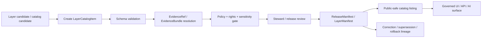

<!-- [KFM_META_BLOCK_V2]
doc_id: kfm://contract/data/layer-catalog-item
title: contracts/data/layer_catalog_item.md — LayerCatalogItem Contract
type: contract
version: v0.2
status: draft
owners: OWNER_TBD — Contract steward · Data steward · Catalog steward · Layer steward · UI steward · Evidence steward · Schema steward · Policy steward · Validation steward · Release steward · Docs steward
created: 2026-06-20
updated: 2026-06-20
policy_label: public; contracts; data; layer-catalog-item; semantic-contract; layer-catalog; release-aware; map-aware
tags: [kfm, contracts, data, layer-catalog-item, layer-catalog, maplibre, layer, catalog, evidence, policy, release, sensitivity, governance]
related:
  - ./README.md
  - ./catalog_matrix.md
  - ../common/spec_hash.md
  - ../common/temporal_window.md
  - ../../schemas/contracts/v1/data/layer_catalog_item.schema.json
  - ../../fixtures/data/layer_catalog_item/
  - ../../tools/validators/data/validate_layer_catalog_item.py
  - ../../policy/data/
  - ../../docs/architecture/ui/LAYERING.md
  - ../../docs/architecture/contract-schema-policy-split.md
  - ../../docs/architecture/domain-placement-law.md
  - ../../data/catalog/
  - ../../data/registry/layers/
  - ../../data/proofs/
  - ../../release/
notes:
  - "Expanded from a greenfield scaffold into the object-level LayerCatalogItem semantic contract."
  - "Machine-checkable shape is in schemas/contracts/v1/data/layer_catalog_item.schema.json, but that schema is explicitly a greenfield placeholder with only id required and additional properties allowed."
  - "CONFLICTED / NEEDS VERIFICATION: docs/architecture/ui/LAYERING.md names schemas/contracts/v1/layers/layer_catalog_item.schema.json as the proposed schema home, while the current scaffold/schema use schemas/contracts/v1/data/layer_catalog_item.schema.json."
  - "The schema-declared validator path was not found in this session; validator behavior remains UNKNOWN / NEEDS VERIFICATION."
  - "LayerCatalogItem is catalog/list metadata and trust-badge input for layers; it is not a layer payload, not a renderer command, not proof closure, not policy approval, and not release approval."
[/KFM_META_BLOCK_V2] -->

<a id="top"></a>

# LayerCatalogItem Contract

> Semantic contract for `LayerCatalogItem`, the list-level catalog entry that describes a map/layer item for catalog panels, comparison views, filters, evidence-aware layer pickers, and public-safe browsing surfaces without becoming the layer payload, renderer contract, release manifest, or source of truth.

<p>
  
  
  
  
  
  
</p>

`contracts/data/layer_catalog_item.md`

## Quick jumps

[Status](#status) · [Meaning](#meaning) · [Repo fit](#repo-fit) · [Schema pairing and conflict](#schema-pairing-and-conflict) · [Accepted uses](#accepted-uses) · [Exclusions](#exclusions) · [Fields](#fields) · [Recommended semantic fields](#recommended-semantic-fields) · [Invariants](#invariants) · [Layer trust semantics](#layer-trust-semantics) · [Lifecycle](#lifecycle) · [Validation](#validation) · [No-loss preservation](#no-loss-preservation) · [Evidence basis](#evidence-basis) · [Rollback](#rollback) · [Definition of done](#definition-of-done)

---

## Status

> [!IMPORTANT]
> **Status:** `draft` / semantic contract  
> **Owner:** `OWNER_TBD`  
> **Contract path:** `contracts/data/layer_catalog_item.md`  
> **Current schema path:** `schemas/contracts/v1/data/layer_catalog_item.schema.json`  
> **Placement conflict:** `docs/architecture/ui/LAYERING.md` names `schemas/contracts/v1/layers/layer_catalog_item.schema.json` as the proposed schema home.  
> **Truth posture:** `CONFIRMED` contract path, current update, parent data README, root authority split, lifecycle doctrine, UI layering doctrine, and placeholder schema presence. `CONFLICTED / NEEDS VERIFICATION` schema home. Validator path was not found. Field completeness, fixtures, policy behavior, layer-registry behavior, release integration, public route/UI behavior, and tests remain `NEEDS VERIFICATION`.

---

## Meaning

`LayerCatalogItem` is a catalog/list-level descriptor for a KFM layer.

It helps a governed catalog, map shell, comparison panel, export picker, or Focus Mode surface decide how to list a layer and what trust state must be visible before a user interacts with it.

A `LayerCatalogItem` may summarize:

- layer identity and title;
- domain or cross-domain scope;
- release state and current/stale/superseded status;
- source roles and evidence availability;
- policy/sensitivity/rights posture;
- freshness and temporal coverage;
- review/correction/rollback state;
- pointers to deeper layer contracts such as LayerManifest, LayerDescriptor, ReleaseManifest, EvidenceBundle, PolicyDecision, or RollbackCard.

It is not the layer payload, not the tile/asset manifest, not the renderer-facing descriptor, not proof closure, and not the release decision.

---

## Repo fit

```text
contracts/
└── data/
    ├── README.md
    ├── catalog_matrix.md
    ├── dataset_version.md
    └── layer_catalog_item.md

schemas/
└── contracts/
    └── v1/
        └── data/
            └── layer_catalog_item.schema.json   # current paired schema, placeholder
```

Adjacent responsibility roots:

| Root | Relationship to this contract |
|---|---|
| `./README.md` | Data-family contract directory boundary. |
| `./catalog_matrix.md` | Related catalog/evidence matrix semantic contract. |
| `../common/spec_hash.md` | Shared semantic contract for deterministic hash references. |
| `../common/temporal_window.md` | Shared semantic contract for explicit time windows and time kinds. |
| `../../schemas/contracts/v1/data/layer_catalog_item.schema.json` | Current placeholder schema paired to this contract. |
| `../../docs/architecture/ui/LAYERING.md` | Layering doctrine and conflicting proposed `schemas/contracts/v1/layers/` schema home. |
| `../../data/catalog/`, `../../data/registry/layers/` | Candidate catalog/layer registry roots; concrete inventory remains `NEEDS VERIFICATION`. |
| `../../data/proofs/` | EvidenceBundle/proof support for layer catalog claims. |
| `../../release/` | Release manifests, promotion decisions, rollback, corrections, supersession. |
| `../../policy/data/` | Data policy home declared by current schema; behavior remains `NEEDS VERIFICATION`. |

---

## Schema pairing and conflict

The current paired schema is:

```text
schemas/contracts/v1/data/layer_catalog_item.schema.json
```

The current schema defines machine shape. This Markdown contract defines meaning.

The current schema metadata identifies:

| Schema metadata | Value | Verification posture |
|---|---|---|
| `$id` | `https://schemas.kfm.local/contracts/v1/data/layer_catalog_item.schema.json` | `CONFIRMED` from schema. |
| `contract_doc` | `contracts/data/layer_catalog_item.md` | `CONFIRMED` from schema metadata. |
| `fixtures_root` | `fixtures/data/layer_catalog_item/` | `NEEDS VERIFICATION` existence/coverage. |
| `validator` | `tools/validators/data/validate_layer_catalog_item.py` | `UNKNOWN / NOT FOUND` in this session. |
| `policy` | `policy/data/` | `NEEDS VERIFICATION` existence/behavior. |
| `status` | `PROPOSED` | `CONFIRMED` from schema metadata. |

> [!CAUTION]
> The current schema is explicitly a greenfield placeholder. It only requires `id`, allows additional properties, and does not yet encode the full layer-catalog semantics in this contract.

> [!WARNING]
> **Schema-home conflict:** UI layering doctrine identifies `LayerCatalogItem` as a layer object family and names `schemas/contracts/v1/layers/layer_catalog_item.schema.json` as the proposed schema home. The current scaffold and schema use `schemas/contracts/v1/data/layer_catalog_item.schema.json`. This must be resolved by ADR, migration note, or explicit compatibility rule before implementation relies on either as canonical.

---

## Accepted uses

| Use | Allowed? | Rule |
|---|---:|---|
| Listing a governed layer in a catalog/picker | Yes | Must preserve release, policy, evidence, freshness, and sensitivity posture. |
| Driving trust badges or public-safe caveats | Conditional | Only from released, policy-safe, review-supported fields. |
| Linking to LayerManifest/LayerDescriptor/ReleaseManifest | Yes | Must not replace those deeper authority objects. |
| Supporting compare/export UI discovery | Conditional | Compare/export must respect rights, sensitivity, release, and evidence gates. |
| Serving as renderer-facing layer source/layer definition | No | LayerDescriptor/LayerManifest/adapter contracts own renderer-facing behavior. |
| Serving raw tile/vector/raster payloads | No | Published assets belong under released data/artifact roots. |
| Granting public release | No | ReleaseManifest/PromotionDecision remain separate. |
| Resolving evidence itself | No | EvidenceRef must resolve through governed evidence interfaces. |

---

## Exclusions

| Does not belong in `LayerCatalogItem` | Correct owner / surface |
|---|---|
| Full layer payload or tile data | `../../data/published/layers/`, `../../data/published/pmtiles/`, `../../data/published/geoparquet/`, or accepted release artifact root. |
| Renderer source/layer definition | LayerDescriptor / renderer adapter contract home. |
| Layer release payload | LayerManifest / ReleaseManifest homes. |
| Full EvidenceBundle content | `../../data/proofs/` or accepted evidence/proof root. |
| JSON Schema shape | `../../schemas/contracts/v1/data/` or resolved layer schema home. |
| Policy decisions | `../../policy/` and PolicyDecision contracts. |
| Validator code | `../../tools/validators/`. |
| Fixtures/tests | `../../fixtures/`, `../../tests/`. |
| Release manifest, rollback card, correction notice, supersession notice | `../../release/`, `../correction/`, `../release/`. |
| Public UI implementation | Governed UI/app roots. |
| AI-generated explanation | Governed AI runtime/receipt surfaces. |

---

## Fields

The current placeholder schema only defines these machine fields:

| Field | Required by current schema | Semantic meaning | Verification posture |
|---|---:|---|---|
| `id` | Yes | Canonical identifier for the layer catalog item. | `CONFIRMED` schema field; format not constrained by current schema. |
| `version` | No | Contract/object version for the layer catalog item. | `CONFIRMED` schema field; semantics need stronger schema support. |
| `spec_hash` | No | Deterministic content/spec hash reference. | `CONFIRMED` schema field; current schema says string only and does not enforce `spec_hash` common pattern. |

---

## Recommended semantic fields

The UI layering doctrine and data lifecycle doctrine require more semantic structure than the current placeholder schema enforces.

These fields are `PROPOSED` for future schema/fixture/validator work unless already adopted elsewhere:

| Field | Semantic role | Why it matters |
|---|---|---|
| `layer_catalog_item_id` or canonical `id` | Stable catalog item identity. | Makes catalog entries citeable and auditable. |
| `layer_id` | Stable layer family identity. | Separates catalog listing from layer payload/version. |
| `title` / `short_title` | Public-safe label. | Supports catalog display without exposing restricted details. |
| `description` / `public_summary` | Public-safe description. | Must be evidence-supported and caveated. |
| `domain_scope` | Domain or cross-domain lane. | Supports filters and ownership. |
| `layer_manifest_ref` | Link to released or candidate LayerManifest. | Keeps catalog metadata separate from layer payload/release truth. |
| `layer_descriptor_ref` | Link to renderer-facing descriptor. | Keeps UI list metadata separate from adapter contract. |
| `release_ref` | ReleaseManifest or release candidate. | Prevents catalog item from acting as release approval. |
| `evidence_refs` | EvidenceBundle/EvidenceRef pointers. | Supports cite-or-abstain. |
| `policy_state` | ALLOW/DENY/RESTRICT/ABSTAIN or review-required posture. | Prevents unsafe display/use. |
| `sensitivity_state` | Public, restricted, generalized, withheld, or redacted posture. | Protects sensitive locations and content. |
| `rights_state` | License/terms/public-use posture. | Prevents unauthorized publication/export. |
| `freshness_state` | Current, stale, degraded, superseded, or unknown. | Supports trust badges and review. |
| `temporal_window` | Coverage/validity/publication/correction time. | Keeps time kinds explicit. |
| `source_role_summary` | Summary of source roles supporting the layer. | Prevents source-role collapse. |
| `correction_refs` | Correction/supersession/rollback linkage. | Preserves auditability after changes. |

---

## Invariants

A `LayerCatalogItem` must preserve these invariants:

- it is list/catalog metadata, not the layer payload;
- it must not be sufficient to render a layer without a governed layer descriptor/manifest;
- public catalog display must not expose restricted details;
- public catalog display must not imply release when release is absent;
- trust badges must be based on evidence, policy, review, release, freshness, rights, sensitivity, and correction state where available;
- unresolved EvidenceRefs must produce ABSTAIN/DENY-style behavior, not silent omission;
- stale/degraded/superseded layers must remain visibly marked;
- public clients must consume governed, released, policy-safe outputs, not raw/internal layer catalog candidates;
- correction, supersession, and rollback linkage must be preserved when published catalog entries change.

---

## Layer trust semantics

A layer is a derived surface. It is downstream of source evidence, policy, review, and release.

`LayerCatalogItem` therefore must not pretend that the catalog listing is the truth system. It should expose enough trust state for users and clients to understand whether a layer is:

| State | Catalog behavior |
|---|---|
| `released` | May be listed publicly if policy, rights, sensitivity, and evidence allow. |
| `candidate` | Internal/steward-facing only unless a governed preview path exists. |
| `stale` | Mark visibly; route to evidence/review/correction path. |
| `degraded` | Mark visibly; explain degraded evidence/freshness where public-safe. |
| `restricted` | Hide, generalize, redact, or require staged access. |
| `denied` | Do not list publicly as usable. |
| `abstain` | Indicate insufficient support rather than fabricate readiness. |
| `superseded` | Link forward to successor and preserve audit state. |
| `withdrawn` | Preserve notice/lineage without normal public use. |

---

## Lifecycle



Lifecycle notes:

- A catalog item may be created during processed-data cataloging, layer assembly, release preparation, correction review, or public catalog refresh.
- Schema validation proves only shape.
- Evidence/source linkage determines whether catalog claims are supported.
- Policy/review/release gates decide whether the item may appear in public catalogs.
- Public UI/API/AI surfaces must not bypass release/evidence/policy to read catalog candidates directly.

---

## Validation

Before relying on this contract, verify:

- schema-home conflict between `schemas/contracts/v1/data/` and `schemas/contracts/v1/layers/` is resolved;
- schema expanded beyond the current greenfield placeholder or intentionally accepted as placeholder;
- validator path exists and behavior is implemented;
- fixtures cover released, candidate, stale, degraded, restricted, denied, abstain, superseded, withdrawn, and rollback cases;
- LayerManifest, LayerDescriptor, ReleaseManifest, EvidenceBundle, PolicyDecision, and RollbackCard references resolve where used;
- sensitivity and rights states are policy-checkable;
- public summary and title are safe for public display;
- stale/degraded/superseded/corrected states are visible in public-safe payloads;
- public UI/API/AI surfaces do not read unreleased catalog items as public truth.

---

## No-loss preservation

| Existing element | Disposition | Reason |
|---|---|---|
| Prior title/family/status scaffold | `KEEP + EXPAND` | Preserved data family and proposed scaffold posture. |
| Schema path | `KEEP + GROUND + SURFACE CONFLICT` | Current data schema exists, while UI layering doctrine proposes a layers schema home. |
| Meaning section | `KEEP + REPLACE WITH CONCRETE SEMANTICS` | The scaffold asked what meaning should be; this edit supplies layer-catalog trust semantics. |
| Fields section | `KEEP + CLARIFY` | Current schema fields are documented, and recommended semantic fields are labeled `PROPOSED`. |
| Invariants | `KEEP + STRENGTHEN` | General invariant placeholders are replaced with layer-catalog-specific trust invariants. |
| Lifecycle | `KEEP + CLARIFY` | Lifecycle now separates catalog item creation, schema validation, evidence, policy, review, release, public catalog, UI/API/AI, and lineage. |
| Open questions | `KEEP + MOVE INTO VALIDATION / DEFINITION OF DONE` | Verification gaps are now actionable. |

---

## Evidence basis

| Source | Status | Supports | Limits |
|---|---|---|---|
| Prior `contracts/data/layer_catalog_item.md` scaffold | `CONFIRMED` | Target file existed as proposed greenfield scaffold with family and schema path. | It contained placeholders, not complete semantics. |
| `schemas/contracts/v1/data/layer_catalog_item.schema.json` | `CONFIRMED placeholder` | Current schema exists; x-kfm metadata points to this contract, fixtures, validator, and policy; `id` is the only required field. | Schema explicitly says greenfield placeholder and conflicts with UI layering's proposed `schemas/contracts/v1/layers/` home. |
| `tools/validators/data/validate_layer_catalog_item.py` | `UNKNOWN / NOT FOUND` | Schema-declared validator path was checked. | File was not found in this session; behavior is not implemented evidence. |
| `docs/architecture/ui/LAYERING.md` | `CONFIRMED doctrine / PROPOSED implementation` | LayerCatalogItem is list-level layer metadata and trust-badge input; layer is a derived surface downstream of evidence, policy, review, and release. | Path/schema homes in that doc are partly proposed and conflict with current data schema path. |
| `contracts/data/README.md` | `CONFIRMED` | Data contracts are semantic meaning only and must not be confused with actual data lifecycle roots. | Does not complete layer-specific schema or validator behavior. |
| `docs/architecture/contract-schema-policy-split.md` | `CONFIRMED` | Contracts define meaning; schemas define shape; policy decides admissibility; tests/fixtures prove enforceability. | Does not verify layer-catalog-specific implementation. |
| `KFM Repository Markdown Authoring Agent — Full Operating Prompt v2` | `CONFIRMED user-supplied authoring guidance` | Requires evidence grounding, truth labels, no-loss preservation, GitHub polish, verification, and rollback posture. | It is authoring guidance, not repo implementation proof. |

---

## Rollback

Rollback is required if this contract is used to claim schema-home resolution, schema completeness, validator coverage, policy enforcement, release execution, public-route behavior, renderer behavior, or implementation maturity not verified in this session.

Rollback target: prior scaffold content SHA `af98fc3ed9a28e73be155cd2bd36ced8304dd698`.

---

## Definition of done

- [ ] Owners are confirmed and `OWNER_TBD` is replaced.
- [ ] Schema-home conflict is resolved by ADR, migration note, or explicit compatibility rule.
- [ ] Schema is expanded beyond greenfield placeholder or placeholder status is intentionally accepted.
- [ ] Validator path exists and behavior is implemented.
- [ ] Fixtures cover released, candidate, stale, degraded, restricted, denied, abstain, superseded, withdrawn, and rollback cases.
- [ ] LayerManifest, LayerDescriptor, ReleaseManifest, EvidenceBundle, PolicyDecision, and RollbackCard references are validated where used.
- [ ] Public-safe title, summary, trust badges, caveats, freshness, rights, sensitivity, and correction state are testable.
- [ ] Public UI/API/AI surfaces are verified to use released, governed catalog payloads only.
- [ ] Tests fail on public use of unreleased or restricted layer catalog candidates.

---

## Status summary

`LayerCatalogItem` is a semantic catalog/list descriptor for layer discovery and trust-badge surfaces. It is not the layer payload, not the renderer descriptor, not proof closure, not policy approval, not release approval, not a public artifact by itself, and not permission for public UI/API/AI surfaces to read unreleased catalog candidates as truth.

<p align="right"><a href="#top">Back to top</a></p>
