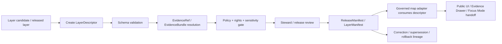

<!-- [KFM_META_BLOCK_V2]
doc_id: kfm://contract/data/layer-descriptor
title: contracts/data/layer_descriptor.md — LayerDescriptor Contract
type: contract
version: v0.2
status: draft
owners: OWNER_TBD — Contract steward · Data steward · Layer steward · UI steward · Evidence steward · Schema steward · Policy steward · Validation steward · Release steward · Docs steward
created: 2026-06-20
updated: 2026-06-20
policy_label: public; contracts; data; layer-descriptor; semantic-contract; renderer-boundary; release-aware; map-aware
tags: [kfm, contracts, data, layer-descriptor, layer, renderer-boundary, maplibre, catalog, evidence, policy, release, sensitivity, governance]
related:
  - ./README.md
  - ./layer_catalog_item.md
  - ./dataset_version.md
  - ./catalog_matrix.md
  - ../common/spec_hash.md
  - ../common/temporal_window.md
  - ../../schemas/contracts/v1/data/layer_descriptor.schema.json
  - ../../fixtures/data/layer_descriptor/
  - ../../tools/validators/data/validate_layer_descriptor.py
  - ../../policy/data/
  - ../../docs/architecture/ui/LAYERING.md
  - ../../docs/architecture/contract-schema-policy-split.md
  - ../../docs/architecture/domain-placement-law.md
  - ../../data/catalog/
  - ../../data/registry/layers/
  - ../../data/proofs/
  - ../../release/
notes:
  - "Expanded from a greenfield scaffold into the object-level LayerDescriptor semantic contract."
  - "Machine-checkable shape is in schemas/contracts/v1/data/layer_descriptor.schema.json, but that schema is explicitly a greenfield placeholder with only id required and additional properties allowed."
  - "CONFLICTED / NEEDS VERIFICATION: docs/architecture/ui/LAYERING.md names schemas/contracts/v1/layers/layer_descriptor.schema.json as the proposed schema home, while the current scaffold/schema use schemas/contracts/v1/data/layer_descriptor.schema.json."
  - "The schema-declared validator path was not found in this session; validator behavior remains UNKNOWN / NEEDS VERIFICATION."
  - "LayerDescriptor is a governed renderer-facing descriptor boundary; it is not raw data, not a layer payload, not a renderer implementation, not proof closure, not policy approval, and not release approval."
[/KFM_META_BLOCK_V2] -->

<a id="top"></a>

# LayerDescriptor Contract

> Semantic contract for `LayerDescriptor`, the governed renderer-facing descriptor that tells a map adapter how to reference a released or candidate layer while carrying the trust references needed to keep rendering downstream of evidence, policy, review, and release.

<p>
  
  
  
  
  
  
</p>

`contracts/data/layer_descriptor.md`

## Quick jumps

[Status](#status) · [Meaning](#meaning) · [Repo fit](#repo-fit) · [Schema pairing and conflict](#schema-pairing-and-conflict) · [Accepted uses](#accepted-uses) · [Exclusions](#exclusions) · [Fields](#fields) · [Recommended semantic fields](#recommended-semantic-fields) · [Invariants](#invariants) · [Renderer boundary](#renderer-boundary) · [Lifecycle](#lifecycle) · [Validation](#validation) · [No-loss preservation](#no-loss-preservation) · [Evidence basis](#evidence-basis) · [Rollback](#rollback) · [Definition of done](#definition-of-done)

---

## Status

> [!IMPORTANT]
> **Status:** `draft` / semantic contract  
> **Owner:** `OWNER_TBD`  
> **Contract path:** `contracts/data/layer_descriptor.md`  
> **Current schema path:** `schemas/contracts/v1/data/layer_descriptor.schema.json`  
> **Placement conflict:** `docs/architecture/ui/LAYERING.md` names `schemas/contracts/v1/layers/layer_descriptor.schema.json` as the proposed schema home.  
> **Truth posture:** `CONFIRMED` contract path, current update, parent data README, root authority split, lifecycle doctrine, UI layering doctrine, and placeholder schema presence. `CONFLICTED / NEEDS VERIFICATION` schema home. Validator path was not found. Field completeness, fixtures, policy behavior, layer-registry behavior, release integration, renderer behavior, public route/UI behavior, and tests remain `NEEDS VERIFICATION`.

---

## Meaning

`LayerDescriptor` is a governed boundary object between released layer governance and the map rendering adapter.

It describes how a map client or adapter may reference a layer source and style-facing layer configuration **after** the appropriate evidence, policy, sensitivity, rights, review, and release context has been attached.

A `LayerDescriptor` may summarize or point to:

- layer identity and renderer-safe source metadata;
- source/layer type for the adapter;
- LayerManifest, ReleaseManifest, StyleManifest, TileArtifactManifest, or related manifest references;
- EvidenceBundle/EvidenceRef support;
- policy, sensitivity, rights, freshness, review, and correction posture;
- safe interaction routes for feature selection, Evidence Drawer lookup, compare/export, and Focus Mode handoff.

It is not the layer payload, not a raw tile file, not a MapLibre style implementation, not an EvidenceBundle, not a policy decision, and not a release decision.

---

## Repo fit

```text
contracts/
└── data/
    ├── README.md
    ├── layer_catalog_item.md
    └── layer_descriptor.md

schemas/
└── contracts/
    └── v1/
        └── data/
            └── layer_descriptor.schema.json   # current paired schema, placeholder
```

Adjacent responsibility roots:

| Root | Relationship to this contract |
|---|---|
| `./README.md` | Data-family contract directory boundary. |
| `./layer_catalog_item.md` | Catalog/list metadata companion for discovery and trust badges. |
| `./dataset_version.md` | Version/provenance descriptor for dataset representations used by layers. |
| `./catalog_matrix.md` | Catalog/evidence/source/policy relationship matrix companion. |
| `../common/spec_hash.md` | Shared semantic contract for deterministic hash references. |
| `../common/temporal_window.md` | Shared semantic contract for explicit time windows and time kinds. |
| `../../schemas/contracts/v1/data/layer_descriptor.schema.json` | Current placeholder schema paired to this contract. |
| `../../docs/architecture/ui/LAYERING.md` | Layering doctrine and conflicting proposed `schemas/contracts/v1/layers/` schema home. |
| `../../data/catalog/`, `../../data/registry/layers/` | Candidate catalog/layer registry roots; concrete inventory remains `NEEDS VERIFICATION`. |
| `../../data/proofs/` | EvidenceBundle/proof support for descriptor claims and interactions. |
| `../../release/` | Release manifests, promotion decisions, rollback, corrections, supersession. |
| `../../policy/data/` | Data policy home declared by current schema; behavior remains `NEEDS VERIFICATION`. |

---

## Schema pairing and conflict

The current paired schema is:

```text
schemas/contracts/v1/data/layer_descriptor.schema.json
```

The current schema defines machine shape. This Markdown contract defines meaning.

The current schema metadata identifies:

| Schema metadata | Value | Verification posture |
|---|---|---|
| `$id` | `https://schemas.kfm.local/contracts/v1/data/layer_descriptor.schema.json` | `CONFIRMED` from schema. |
| `contract_doc` | `contracts/data/layer_descriptor.md` | `CONFIRMED` from schema metadata. |
| `fixtures_root` | `fixtures/data/layer_descriptor/` | `NEEDS VERIFICATION` existence/coverage. |
| `validator` | `tools/validators/data/validate_layer_descriptor.py` | `UNKNOWN / NOT FOUND` in this session. |
| `policy` | `policy/data/` | `NEEDS VERIFICATION` existence/behavior. |
| `status` | `PROPOSED` | `CONFIRMED` from schema metadata. |

> [!CAUTION]
> The current schema is explicitly a greenfield placeholder. It only requires `id`, allows additional properties, and does not yet encode the full layer-descriptor semantics in this contract.

> [!WARNING]
> **Schema-home conflict:** UI layering doctrine identifies `LayerDescriptor` as a layer object family and names `schemas/contracts/v1/layers/layer_descriptor.schema.json` as the proposed schema home. The current scaffold and schema use `schemas/contracts/v1/data/layer_descriptor.schema.json`. This must be resolved by ADR, migration note, or explicit compatibility rule before implementation relies on either as canonical.

---

## Accepted uses

| Use | Allowed? | Rule |
|---|---:|---|
| Supplying renderer-facing layer/source metadata to a map adapter | Conditional | Must be backed by released or explicitly governed preview/candidate posture. |
| Linking to LayerManifest, StyleManifest, TileArtifactManifest, or ReleaseManifest | Yes | Must not replace those deeper authority objects. |
| Carrying evidence, policy, sensitivity, rights, freshness, and release references to the point of use | Yes | Must keep renderer downstream of trust. |
| Supporting feature-click evidence lookup | Conditional | Must route through governed API/EvidenceBundle resolution, not direct internal stores. |
| Supporting compare/export layer selection | Conditional | Must respect policy, rights, sensitivity, release, and evidence gates. |
| Serving raw tile/vector/raster payloads | No | Published artifacts belong under released data/artifact roots. |
| Serving as full MapLibre style or UI implementation | No | UI/adapter/style roots own implementation. |
| Granting release or policy approval | No | ReleaseManifest/PolicyDecision remain separate. |

---

## Exclusions

| Does not belong in `LayerDescriptor` | Correct owner / surface |
|---|---|
| Full layer payload or tile data | `../../data/published/layers/`, `../../data/published/pmtiles/`, `../../data/published/geoparquet/`, or accepted release artifact root. |
| Full MapLibre style document | StyleManifest/style roots and UI adapter roots. |
| Layer release payload | LayerManifest / ReleaseManifest homes. |
| Full EvidenceBundle content | `../../data/proofs/` or accepted evidence/proof root. |
| JSON Schema shape | `../../schemas/contracts/v1/data/` or resolved layer schema home. |
| Policy decisions | `../../policy/` and PolicyDecision contracts. |
| Validator code | `../../tools/validators/`. |
| Fixtures/tests | `../../fixtures/`, `../../tests/`. |
| Release manifest, rollback card, correction notice, supersession notice | `../../release/`, `../correction/`, `../release/`. |
| Public UI implementation | Governed UI/app roots. |
| AI-generated explanation or runtime output | Governed AI runtime/receipt surfaces. |

---

## Fields

The current placeholder schema only defines these machine fields:

| Field | Required by current schema | Semantic meaning | Verification posture |
|---|---:|---|---|
| `id` | Yes | Canonical identifier for the layer descriptor. | `CONFIRMED` schema field; format not constrained by current schema. |
| `version` | No | Contract/object version for the layer descriptor. | `CONFIRMED` schema field; semantics need stronger schema support. |
| `spec_hash` | No | Deterministic content/spec hash reference. | `CONFIRMED` schema field; current schema says string only and does not enforce `spec_hash` common pattern. |

---

## Recommended semantic fields

The UI layering doctrine and KFM lifecycle doctrine require more semantic structure than the current placeholder schema enforces.

These fields are `PROPOSED` for future schema/fixture/validator work unless already adopted elsewhere:

| Field | Semantic role | Why it matters |
|---|---|---|
| `layer_descriptor_id` or canonical `id` | Stable descriptor identity. | Makes descriptor instances citeable and auditable. |
| `layer_id` | Stable layer family identity. | Separates descriptor from catalog item and payload. |
| `source_type` | Vector, raster, raster-dem, PMTiles, GeoParquet, MVT, COG, etc. | Helps adapter choose safe rendering path. |
| `source_ref` | Renderer-safe source reference or artifact manifest pointer. | Avoids direct canonical/internal store reads. |
| `layer_manifest_ref` | Link to layer manifest. | Keeps release/provenance separate from descriptor. |
| `style_manifest_ref` | Link to style/legend/symbol contract. | Keeps style authority separate. |
| `tile_artifact_manifest_ref` | Link to tile/raster/vector artifact digest manifest. | Supports integrity and release validation. |
| `release_ref` | ReleaseManifest or governed preview/candidate reference. | Prevents descriptor from acting as release approval. |
| `evidence_refs` | EvidenceBundle/EvidenceRef pointers. | Supports feature click and Evidence Drawer resolution. |
| `policy_state` | ALLOW/DENY/RESTRICT/ABSTAIN or review-required posture. | Prevents unsafe rendering/use. |
| `sensitivity_state` | Public, generalized, redacted, restricted, or withheld posture. | Protects sensitive locations/content. |
| `rights_state` | License/terms/export/use posture. | Prevents unauthorized display/export. |
| `freshness_state` | Current, stale, degraded, superseded, or unknown. | Supports visible trust state. |
| `interaction_routes` | Governed API routes for feature selection/evidence lookup. | Prevents direct internal store access. |
| `correction_refs` | Correction/supersession/rollback linkage. | Preserves auditability after changes. |

---

## Invariants

A `LayerDescriptor` must preserve these invariants:

- the renderer is downstream of trust, never upstream of it;
- it must not reference RAW, WORK, QUARANTINE, or unreleased internal stores as normal public sources;
- it is not sufficient to prove evidence, policy approval, or release approval;
- evidence references must resolve through governed interfaces, not UI-side shortcuts;
- policy, rights, sensitivity, freshness, release, and correction state must remain visible at the point of use where relevant;
- restricted or generalized layers must not expose hidden precision through source URLs, tiles, metadata, filters, bounds, or interaction payloads;
- stale/degraded/superseded layers must remain visibly marked;
- component/UI code should consume the descriptor through a governed adapter boundary rather than constructing source access from ad hoc fields;
- correction/supersession/rollback linkage must be preserved when published descriptor behavior changes.

---

## Renderer boundary

`LayerDescriptor` is the handoff contract to the renderer adapter.

It may tell the adapter what to render, but it must not let the renderer decide what is true.

| Boundary | Rule |
|---|---|
| Source access | Descriptor points to released/governed artifacts or governed preview candidates only. |
| Evidence lookup | Feature selection routes to governed API/EvidenceBundle resolution. |
| Policy | Descriptor exposes policy state and obligations; policy engine remains separate. |
| Sensitivity | Descriptor carries public-safe sensitivity posture and must not leak hidden precision. |
| Style | Descriptor links to style/legend manifests; style does not become source truth. |
| Release | Descriptor links release state; it does not authorize release. |
| AI | Descriptor may support AI context only through governed, receipt-backed, evidence-resolving paths. |

---

## Lifecycle



Lifecycle notes:

- A descriptor may be created during processed-data cataloging, layer assembly, release preparation, correction review, preview review, or public catalog refresh.
- Schema validation proves only shape.
- Evidence/source linkage determines whether descriptor claims and interactions are supported.
- Policy/review/release gates decide whether descriptor-backed rendering may become public.
- UI/API/AI surfaces must not bypass release/evidence/policy by reading descriptor candidates directly.

---

## Validation

Before relying on this contract, verify:

- schema-home conflict between `schemas/contracts/v1/data/` and `schemas/contracts/v1/layers/` is resolved;
- schema expanded beyond the current greenfield placeholder or intentionally accepted as placeholder;
- validator path exists and behavior is implemented;
- fixtures cover released, candidate, preview, stale, degraded, restricted, generalized, denied, abstain, superseded, withdrawn, and rollback cases;
- LayerManifest, StyleManifest, TileArtifactManifest, ReleaseManifest, EvidenceBundle, PolicyDecision, and RollbackCard references resolve where used;
- source references point only to governed/released/allowed artifacts for public use;
- sensitivity and rights states are policy-checkable;
- interaction routes use governed APIs, not direct internal stores;
- public UI/API/AI surfaces do not read unreleased descriptors as public truth.

---

## No-loss preservation

| Existing element | Disposition | Reason |
|---|---|---|
| Prior title/family/status scaffold | `KEEP + EXPAND` | Preserved data family and proposed scaffold posture. |
| Schema path | `KEEP + GROUND + SURFACE CONFLICT` | Current data schema exists, while UI layering doctrine proposes a layers schema home. |
| Meaning section | `KEEP + REPLACE WITH CONCRETE SEMANTICS` | The scaffold asked what meaning should be; this edit supplies renderer-boundary and trust semantics. |
| Fields section | `KEEP + CLARIFY` | Current schema fields are documented, and recommended semantic fields are labeled `PROPOSED`. |
| Invariants | `KEEP + STRENGTHEN` | General invariant placeholders are replaced with layer-descriptor-specific trust invariants. |
| Lifecycle | `KEEP + CLARIFY` | Lifecycle now separates descriptor creation, schema validation, evidence, policy, review, release, adapter consumption, UI/API/AI, and lineage. |
| Open questions | `KEEP + MOVE INTO VALIDATION / DEFINITION OF DONE` | Verification gaps are now actionable. |

---

## Evidence basis

| Source | Status | Supports | Limits |
|---|---|---|---|
| Prior `contracts/data/layer_descriptor.md` scaffold | `CONFIRMED` | Target file existed as proposed greenfield scaffold with family and schema path. | It contained placeholders, not complete semantics. |
| `schemas/contracts/v1/data/layer_descriptor.schema.json` | `CONFIRMED placeholder` | Current schema exists; x-kfm metadata points to this contract, fixtures, validator, and policy; `id` is the only required field. | Schema explicitly says greenfield placeholder and conflicts with UI layering's proposed `schemas/contracts/v1/layers/` home. |
| `tools/validators/data/validate_layer_descriptor.py` | `UNKNOWN / NOT FOUND` | Schema-declared validator path was checked. | File was not found in this session; behavior is not implemented evidence. |
| `docs/architecture/ui/LAYERING.md` | `CONFIRMED doctrine / PROPOSED implementation` | LayerDescriptor is renderer-facing source/layer descriptor bound to LayerManifest, StyleManifest, TileArtifactManifest, release, proof, and policy references; renderer is downstream of trust. | Path/schema homes in that doc are partly proposed and conflict with current data schema path. |
| `contracts/data/README.md` | `CONFIRMED` | Data contracts are semantic meaning only and must not be confused with actual data lifecycle roots. | Does not complete layer-specific schema or validator behavior. |
| `docs/architecture/contract-schema-policy-split.md` | `CONFIRMED` | Contracts define meaning; schemas define shape; policy decides admissibility; tests/fixtures prove enforceability. | Does not verify layer-descriptor-specific implementation. |
| `KFM Repository Markdown Authoring Agent — Full Operating Prompt v2` | `CONFIRMED user-supplied authoring guidance` | Requires evidence grounding, truth labels, no-loss preservation, GitHub polish, verification, and rollback posture. | It is authoring guidance, not repo implementation proof. |

---

## Rollback

Rollback is required if this contract is used to claim schema-home resolution, schema completeness, validator coverage, policy enforcement, release execution, public-route behavior, renderer behavior, or implementation maturity not verified in this session.

Rollback target: prior scaffold content SHA `4ccff86336dd2686316b7ab603720f933c7fccac`.

---

## Definition of done

- [ ] Owners are confirmed and `OWNER_TBD` is replaced.
- [ ] Schema-home conflict is resolved by ADR, migration note, or explicit compatibility rule.
- [ ] Schema is expanded beyond greenfield placeholder or placeholder status is intentionally accepted.
- [ ] Validator path exists and behavior is implemented.
- [ ] Fixtures cover released, candidate, preview, stale, degraded, restricted, generalized, denied, abstain, superseded, withdrawn, and rollback cases.
- [ ] LayerManifest, StyleManifest, TileArtifactManifest, ReleaseManifest, EvidenceBundle, PolicyDecision, and RollbackCard references are validated where used.
- [ ] Public-safe source access, title, summary, trust badges, caveats, freshness, rights, sensitivity, and correction state are testable.
- [ ] Public UI/API/AI surfaces are verified to use released, governed descriptors only.
- [ ] Tests fail on public use of unreleased, restricted, or internal-store layer descriptor candidates.

---

## Status summary

`LayerDescriptor` is a semantic renderer-boundary descriptor for governed layer rendering. It is not raw data, not the layer payload, not a full style, not proof closure, not policy approval, not release approval, not renderer implementation, and not permission for public UI/API/AI surfaces to read unreleased descriptors or internal stores as truth.

<p align="right"><a href="#top">Back to top</a></p>
