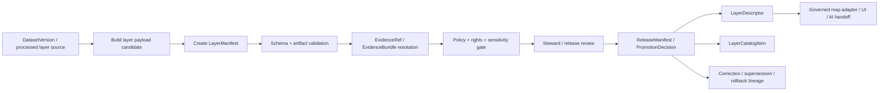

<!-- [KFM_META_BLOCK_V2]
doc_id: kfm://contract/data/layer-manifest
title: contracts/data/layer_manifest.md — LayerManifest Contract
type: contract
version: v0.2
status: draft
owners: OWNER_TBD — Contract steward · Data steward · Layer steward · UI steward · Evidence steward · Schema steward · Policy steward · Validation steward · Release steward · Docs steward
created: 2026-06-20
updated: 2026-06-20
policy_label: public; contracts; data; layer-manifest; semantic-contract; release-aware; map-aware; evidence-aware
tags: [kfm, contracts, data, layer-manifest, layer, release, maplibre, evidence, source-role, policy, sensitivity, rollback, governance]
related:
  - ./README.md
  - ./layer_catalog_item.md
  - ./layer_descriptor.md
  - ./dataset_version.md
  - ./catalog_matrix.md
  - ../common/spec_hash.md
  - ../common/temporal_window.md
  - ../../schemas/contracts/v1/data/layer_manifest.schema.json
  - ../../fixtures/data/layer_manifest/
  - ../../tools/validators/data/validate_layer_manifest.py
  - ../../policy/data/
  - ../../docs/architecture/ui/LAYERING.md
  - ../../docs/architecture/contract-schema-policy-split.md
  - ../../docs/architecture/domain-placement-law.md
  - ../../data/catalog/
  - ../../data/registry/layers/
  - ../../data/proofs/
  - ../../release/
notes:
  - "Expanded from a greenfield scaffold into the object-level LayerManifest semantic contract."
  - "Machine-checkable shape is in schemas/contracts/v1/data/layer_manifest.schema.json, but that schema is explicitly a greenfield placeholder with only id required and additional properties allowed."
  - "CONFLICTED / NEEDS VERIFICATION: docs/architecture/ui/LAYERING.md names schemas/contracts/v1/layers/layer_manifest.schema.json as the proposed schema home, while the current scaffold/schema use schemas/contracts/v1/data/layer_manifest.schema.json."
  - "The schema-declared validator path was not found in this session; validator behavior remains UNKNOWN / NEEDS VERIFICATION."
  - "LayerManifest is a governed layer-version manifest and trust-spine carrier; it is not raw data, not a renderer implementation, not proof closure, not policy approval, and not release approval by itself."
[/KFM_META_BLOCK_V2] -->

<a id="top"></a>

# LayerManifest Contract

> Semantic contract for `LayerManifest`, the governed manifest that describes a specific version of a map layer payload and binds it to source role, evidence, integrity, lifecycle, policy, review, release, freshness, sensitivity, rights, correction, supersession, and rollback context.

<p>
  
  
  
  
  
  
</p>

`contracts/data/layer_manifest.md`

## Quick jumps

[Status](#status) · [Meaning](#meaning) · [Repo fit](#repo-fit) · [Schema pairing and conflict](#schema-pairing-and-conflict) · [Accepted uses](#accepted-uses) · [Exclusions](#exclusions) · [Fields](#fields) · [Recommended semantic fields](#recommended-semantic-fields) · [Invariants](#invariants) · [Layer release semantics](#layer-release-semantics) · [Lifecycle](#lifecycle) · [Validation](#validation) · [No-loss preservation](#no-loss-preservation) · [Evidence basis](#evidence-basis) · [Rollback](#rollback) · [Definition of done](#definition-of-done)

---

## Status

> [!IMPORTANT]
> **Status:** `draft` / semantic contract  
> **Owner:** `OWNER_TBD`  
> **Contract path:** `contracts/data/layer_manifest.md`  
> **Current schema path:** `schemas/contracts/v1/data/layer_manifest.schema.json`  
> **Placement conflict:** `docs/architecture/ui/LAYERING.md` names `schemas/contracts/v1/layers/layer_manifest.schema.json` as the proposed schema home.  
> **Truth posture:** `CONFIRMED` contract path, current update, parent data README, root authority split, lifecycle doctrine, UI layering doctrine, and placeholder schema presence. `CONFLICTED / NEEDS VERIFICATION` schema home. Validator path was not found. Field completeness, fixtures, policy behavior, layer-registry behavior, release integration, public route/UI behavior, and tests remain `NEEDS VERIFICATION`.

---

## Meaning

`LayerManifest` is the governed manifest for a versioned layer payload.

It records the layer's identity, data/product lineage, evidence posture, integrity references, valid time, freshness state, source roles, rights, sensitivity, policy posture, review state, release relationship, and correction/rollback lineage.

A `LayerManifest` may answer:

- Which layer version exists?
- What data products or dataset versions produced it?
- Which source roles and EvidenceBundles support it?
- Which artifact digests or specs identify the released/candidate payload?
- What temporal coverage and freshness state apply?
- Is the layer candidate, released, stale, degraded, restricted, superseded, withdrawn, or rollback-ready?
- Which governed public surfaces may reference it, if any?

A `LayerManifest` is stronger than a catalog listing and deeper than a renderer-facing descriptor, but it is still not sovereign truth. It must remain evidence-backed, policy-aware, reviewable, and release-aware.

---

## Repo fit

```text
contracts/
└── data/
    ├── README.md
    ├── layer_catalog_item.md
    ├── layer_descriptor.md
    └── layer_manifest.md

schemas/
└── contracts/
    └── v1/
        └── data/
            └── layer_manifest.schema.json   # current paired schema, placeholder
```

Adjacent responsibility roots:

| Root | Relationship to this contract |
|---|---|
| `./README.md` | Data-family contract directory boundary. |
| `./layer_catalog_item.md` | Catalog/list metadata companion for discovery and trust badges. |
| `./layer_descriptor.md` | Renderer-boundary descriptor companion. |
| `./dataset_version.md` | Version/provenance descriptor for dataset representations used by layers. |
| `./catalog_matrix.md` | Catalog/evidence/source/policy relationship matrix companion. |
| `../common/spec_hash.md` | Shared semantic contract for deterministic hash references. |
| `../common/temporal_window.md` | Shared semantic contract for explicit time windows and time kinds. |
| `../../schemas/contracts/v1/data/layer_manifest.schema.json` | Current placeholder schema paired to this contract. |
| `../../docs/architecture/ui/LAYERING.md` | Layering doctrine and conflicting proposed `schemas/contracts/v1/layers/` schema home. |
| `../../data/catalog/`, `../../data/registry/layers/` | Candidate catalog/layer registry roots; concrete inventory remains `NEEDS VERIFICATION`. |
| `../../data/proofs/` | EvidenceBundle/proof support for layer claims and feature interactions. |
| `../../release/` | Release manifests, promotion decisions, rollback, corrections, supersession. |
| `../../policy/data/` | Data policy home declared by current schema; behavior remains `NEEDS VERIFICATION`. |

---

## Schema pairing and conflict

The current paired schema is:

```text
schemas/contracts/v1/data/layer_manifest.schema.json
```

The current schema defines machine shape. This Markdown contract defines meaning.

The current schema metadata identifies:

| Schema metadata | Value | Verification posture |
|---|---|---|
| `$id` | `https://schemas.kfm.local/contracts/v1/data/layer_manifest.schema.json` | `CONFIRMED` from schema. |
| `contract_doc` | `contracts/data/layer_manifest.md` | `CONFIRMED` from schema metadata. |
| `fixtures_root` | `fixtures/data/layer_manifest/` | `NEEDS VERIFICATION` existence/coverage. |
| `validator` | `tools/validators/data/validate_layer_manifest.py` | `UNKNOWN / NOT FOUND` in this session. |
| `policy` | `policy/data/` | `NEEDS VERIFICATION` existence/behavior. |
| `status` | `PROPOSED` | `CONFIRMED` from schema metadata. |

> [!CAUTION]
> The current schema is explicitly a greenfield placeholder. It only requires `id`, allows additional properties, and does not yet encode the full layer-manifest semantics in this contract.

> [!WARNING]
> **Schema-home conflict:** UI layering doctrine identifies `LayerManifest` as a layer object family and names `schemas/contracts/v1/layers/layer_manifest.schema.json` as the proposed schema home. The current scaffold and schema use `schemas/contracts/v1/data/layer_manifest.schema.json`. This must be resolved by ADR, migration note, or explicit compatibility rule before implementation relies on either as canonical.

---

## Accepted uses

| Use | Allowed? | Rule |
|---|---:|---|
| Describing a versioned layer payload or candidate | Yes | Must preserve identity, integrity, source, evidence, lifecycle, policy, and release posture. |
| Binding a layer to dataset versions and artifact manifests | Yes | Must keep payload/version/artifact identities separate. |
| Carrying release, freshness, rights, sensitivity, and correction context | Yes | Must expose state at the point of use where relevant. |
| Supporting renderer descriptors and catalog items | Yes | LayerDescriptor and LayerCatalogItem may point to it; they do not replace it. |
| Supporting evidence-aware feature interaction | Conditional | EvidenceRefs must resolve through governed APIs/EvidenceBundle paths. |
| Serving as the raw dataset or tile payload | No | Actual payloads belong under lifecycle/release artifact roots. |
| Granting release or policy approval | No | ReleaseManifest/PromotionDecision/PolicyDecision remain separate. |
| Serving as full renderer implementation | No | UI/adapter/style roots own implementation. |

---

## Exclusions

| Does not belong in `LayerManifest` | Correct owner / surface |
|---|---|
| Full tile/raster/vector payload | `../../data/published/layers/`, `../../data/published/pmtiles/`, `../../data/published/geoparquet/`, or accepted release artifact root. |
| Raw or work dataset payload | `../../data/raw/`, `../../data/work/`, `../../data/processed/`, or accepted lifecycle root. |
| Renderer-facing descriptor | `./layer_descriptor.md` or resolved layer-descriptor contract home. |
| Catalog/list metadata | `./layer_catalog_item.md`. |
| Full EvidenceBundle content | `../../data/proofs/` or accepted evidence/proof root. |
| JSON Schema shape | `../../schemas/contracts/v1/data/` or resolved layer schema home. |
| Policy decisions | `../../policy/` and PolicyDecision contracts. |
| Validator code | `../../tools/validators/`. |
| Fixtures/tests | `../../fixtures/`, `../../tests/`. |
| Release manifest, rollback card, correction notice, supersession notice | `../../release/`, `../correction/`, `../release/`. |
| Public UI implementation | Governed UI/app roots. |
| AI-generated explanation or runtime output | Governed AI runtime/receipt surfaces. |

---

## Fields

The current placeholder schema only defines these machine fields:

| Field | Required by current schema | Semantic meaning | Verification posture |
|---|---:|---|---|
| `id` | Yes | Canonical identifier for the layer manifest. | `CONFIRMED` schema field; format not constrained by current schema. |
| `version` | No | Contract/object version for the layer manifest. | `CONFIRMED` schema field; semantics need stronger schema support. |
| `spec_hash` | No | Deterministic content/spec hash reference. | `CONFIRMED` schema field; current schema says string only and does not enforce `spec_hash` common pattern. |

---

## Recommended semantic fields

The UI layering doctrine and KFM lifecycle doctrine require more semantic structure than the current placeholder schema enforces.

These fields are `PROPOSED` for future schema/fixture/validator work unless already adopted elsewhere:

| Field | Semantic role | Why it matters |
|---|---|---|
| `layer_manifest_id` or canonical `id` | Stable manifest identity. | Makes layer versions citeable and auditable. |
| `layer_id` | Stable layer family identity. | Separates layer family from layer version. |
| `layer_version` | Human/provider/KFM layer version label. | Supports comparison and supersession. |
| `dataset_version_refs` | Dataset versions used to build the layer. | Preserves lineage. |
| `artifact_refs` | Tile/raster/vector/geoparquet artifact manifest references. | Supports integrity and public asset resolution. |
| `content_hash` / `spec_hash` | Deterministic digest of manifest or artifact spec. | Supports drift detection and rollback. |
| `source_refs` | SourceDescriptor/source identity references. | Preserves source role and rights posture. |
| `evidence_refs` | EvidenceBundle/EvidenceRef pointers. | Supports cite-or-abstain and feature interaction. |
| `temporal_window` | Valid time, coverage time, publication time, or correction time. | Keeps time kinds explicit. |
| `freshness_state` | Current, stale, degraded, superseded, or unknown. | Supports trust badges and public caveats. |
| `policy_state` | ALLOW/DENY/RESTRICT/ABSTAIN or review-required posture. | Prevents unsafe rendering/use. |
| `rights_state` | License/terms/export/use posture. | Prevents unauthorized display/export. |
| `sensitivity_state` | Public, generalized, redacted, restricted, withheld. | Protects sensitive locations/content. |
| `review_state` | Steward/release review posture. | Separates review from release approval. |
| `release_ref` | ReleaseManifest/PromotionDecision linkage. | Keeps release authority separate. |
| `rollback_target` | Prior known-safe manifest or artifact version. | Supports reversibility. |
| `correction_refs` | Correction/supersession/withdrawal linkage. | Preserves auditability after changes. |

---

## Invariants

A `LayerManifest` must preserve these invariants:

- it describes a layer version/payload manifest; it does not contain the full payload;
- layer family identity and layer version identity must remain distinguishable;
- source role, evidence, rights, sensitivity, review, policy, and release posture must not be inferred from the layer ID alone;
- lifecycle states must not be collapsed;
- schema validity is not evidence proof;
- validation success is not policy approval;
- policy approval is not release approval;
- release approval is not EvidenceBundle proof;
- public clients must consume governed, released, policy-safe layer outputs, not candidate manifests;
- restricted/generalized layers must not expose withheld precision through bounds, feature IDs, metadata, style filters, or interaction payloads;
- correction/supersession/rollback linkage must be preserved when published layer manifests change.

---

## Layer release semantics

`LayerManifest` is the trust spine for a layer version, but it is not the release state by itself.

| Concern | LayerManifest role | Separate authority |
|---|---|---|
| Payload identity | References artifact/digest/spec identity. | Artifact manifest / data lifecycle root. |
| Evidence | References EvidenceBundle/EvidenceRef. | EvidenceBundle/proof root. |
| Policy | Carries policy state or policy decision ref. | PolicyDecision / policy bundles. |
| Review | Carries review state/ref. | ReviewRecord / release review. |
| Release | Carries release ref or candidate state. | ReleaseManifest / PromotionDecision. |
| Rendering | Supplies source/manifests to descriptors. | LayerDescriptor / UI adapter. |
| Public listing | Feeds catalog entry. | LayerCatalogItem / governed API. |
| Correction | Links correction/supersession/rollback refs. | CorrectionNotice / SupersessionNotice / RollbackCard. |

---

## Lifecycle



Lifecycle notes:

- A manifest may be created during processed-data layer assembly, release preparation, preview review, correction, or audit.
- Schema validation proves only shape.
- Artifact hashes support integrity and drift detection; they do not prove correctness or public safety.
- Evidence/source linkage determines whether manifest claims are supported.
- Policy/review/release gates decide whether manifest-backed rendering may become public.
- Published manifests require correction/supersession/rollback posture when materially changed.

---

## Validation

Before relying on this contract, verify:

- schema-home conflict between `schemas/contracts/v1/data/` and `schemas/contracts/v1/layers/` is resolved;
- schema expanded beyond the current greenfield placeholder or intentionally accepted as placeholder;
- validator path exists and behavior is implemented;
- fixtures cover candidate, preview, released, stale, degraded, restricted, generalized, denied, abstain, superseded, withdrawn, corrected, and rollback cases;
- DatasetVersion, artifact manifest, EvidenceBundle, PolicyDecision, ReleaseManifest, LayerDescriptor, LayerCatalogItem, and RollbackCard references resolve where used;
- source references point only to governed/released/allowed artifacts for public use;
- sensitivity and rights states are policy-checkable;
- artifact digests and spec hashes are validated where relevant;
- public UI/API/AI surfaces do not read unreleased manifests as public truth.

---

## No-loss preservation

| Existing element | Disposition | Reason |
|---|---|---|
| Prior title/family/status scaffold | `KEEP + EXPAND` | Preserved data family and proposed scaffold posture. |
| Schema path | `KEEP + GROUND + SURFACE CONFLICT` | Current data schema exists, while UI layering doctrine proposes a layers schema home. |
| Meaning section | `KEEP + REPLACE WITH CONCRETE SEMANTICS` | The scaffold asked what meaning should be; this edit supplies layer-manifest and release-trust semantics. |
| Fields section | `KEEP + CLARIFY` | Current schema fields are documented, and recommended semantic fields are labeled `PROPOSED`. |
| Invariants | `KEEP + STRENGTHEN` | General invariant placeholders are replaced with layer-manifest-specific trust invariants. |
| Lifecycle | `KEEP + CLARIFY` | Lifecycle now separates data source, layer build, manifest, validation, evidence, policy, review, release, descriptors/catalog, UI/API/AI, and lineage. |
| Open questions | `KEEP + MOVE INTO VALIDATION / DEFINITION OF DONE` | Verification gaps are now actionable. |

---

## Evidence basis

| Source | Status | Supports | Limits |
|---|---|---|---|
| Prior `contracts/data/layer_manifest.md` scaffold | `CONFIRMED` | Target file existed as proposed greenfield scaffold with family and schema path. | It contained placeholders, not complete semantics. |
| `schemas/contracts/v1/data/layer_manifest.schema.json` | `CONFIRMED placeholder` | Current schema exists; x-kfm metadata points to this contract, fixtures, validator, and policy; `id` is the only required field. | Schema explicitly says greenfield placeholder and conflicts with UI layering's proposed `schemas/contracts/v1/layers/` home. |
| `tools/validators/data/validate_layer_manifest.py` | `UNKNOWN / NOT FOUND` | Schema-declared validator path was checked. | File was not found in this session; behavior is not implemented evidence. |
| `docs/architecture/ui/LAYERING.md` | `CONFIRMED doctrine / PROPOSED implementation` | LayerManifest is a versioned layer payload with valid time, freshness, provenance, release state, integrity references, source roles, and trust bindings; layer rendering is downstream of trust. | Path/schema homes in that doc are partly proposed and conflict with current data schema path. |
| `contracts/data/README.md` | `CONFIRMED` | Data contracts are semantic meaning only and must not be confused with actual data lifecycle roots. | Does not complete layer-specific schema or validator behavior. |
| `docs/architecture/contract-schema-policy-split.md` | `CONFIRMED` | Contracts define meaning; schemas define shape; policy decides admissibility; tests/fixtures prove enforceability. | Does not verify layer-manifest-specific implementation. |
| `KFM Repository Markdown Authoring Agent — Full Operating Prompt v2` | `CONFIRMED user-supplied authoring guidance` | Requires evidence grounding, truth labels, no-loss preservation, GitHub polish, verification, and rollback posture. | It is authoring guidance, not repo implementation proof. |

---

## Rollback

Rollback is required if this contract is used to claim schema-home resolution, schema completeness, validator coverage, policy enforcement, release execution, public-route behavior, renderer behavior, or implementation maturity not verified in this session.

Rollback target: prior scaffold content SHA `9c5e27db7a0702ffbbe3585219acb193b39497f9`.

---

## Definition of done

- [ ] Owners are confirmed and `OWNER_TBD` is replaced.
- [ ] Schema-home conflict is resolved by ADR, migration note, or explicit compatibility rule.
- [ ] Schema is expanded beyond greenfield placeholder or placeholder status is intentionally accepted.
- [ ] Validator path exists and behavior is implemented.
- [ ] Fixtures cover candidate, preview, released, stale, degraded, restricted, generalized, denied, abstain, superseded, withdrawn, corrected, and rollback cases.
- [ ] DatasetVersion, artifact manifest, EvidenceBundle, PolicyDecision, ReleaseManifest, LayerDescriptor, LayerCatalogItem, and RollbackCard references are validated where used.
- [ ] Public-safe payload identity, trust badges, caveats, freshness, rights, sensitivity, evidence, and correction state are testable.
- [ ] Public UI/API/AI surfaces are verified to use released, governed manifests only.
- [ ] Tests fail on public use of unreleased, restricted, or internal-store layer manifest candidates.

---

## Status summary

`LayerManifest` is a semantic layer-version manifest and trust-spine carrier. It is not raw data, not the full layer payload, not a renderer descriptor, not proof closure, not policy approval, not release approval, not renderer implementation, and not permission for public UI/API/AI surfaces to read unreleased manifests as truth.

<p align="right"><a href="#top">Back to top</a></p>
