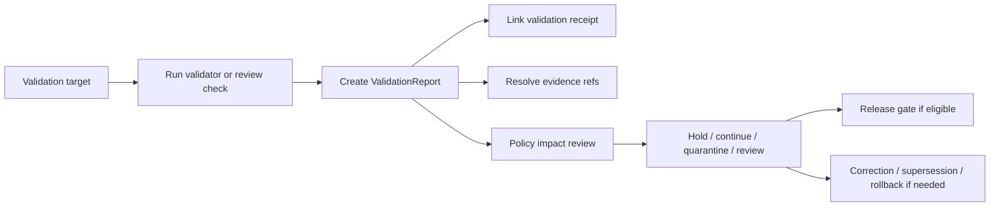

<!-- [KFM_META_BLOCK_V2]
doc_id: kfm://contract/data/validation-report
title: contracts/data/validation_report.md — ValidationReport Contract
type: contract
version: v0.2
status: draft
owners: OWNER_TBD — Contract steward · Data steward · Evidence steward · Validation steward · Schema steward · Policy steward · Release steward · Docs steward
created: 2026-06-20
updated: 2026-06-20
policy_label: public; contracts; data; validation-report; semantic-contract; validation; evidence-aware; release-aware
tags: [kfm, contracts, data, validation-report, validation, proof, evidence, policy, lifecycle, release, correction, governance]
related:
  - ./README.md
  - ./catalog_matrix.md
  - ./dataset_version.md
  - ../common/spec_hash.md
  - ../common/temporal_window.md
  - ../../schemas/contracts/v1/data/validation_report.schema.json
  - ../../fixtures/data/validation_report/
  - ../../tools/validators/data/validate_validation_report.py
  - ../../policy/data/
  - ../../docs/adr/ADR-0011-receipts-vs-proofs-vs-manifests-vs-catalog-separation.md
  - ../../docs/architecture/contract-schema-policy-split.md
  - ../../docs/architecture/domain-placement-law.md
  - ../../data/proofs/
  - ../../data/receipts/
  - ../../release/
notes:
  - "Expanded from a greenfield scaffold into the object-level ValidationReport semantic contract."
  - "Machine-checkable shape is in schemas/contracts/v1/data/validation_report.schema.json, but that schema is explicitly a greenfield placeholder with only id required and additional properties allowed."
  - "The schema-declared validator path was not found in this session; validator behavior remains UNKNOWN / NEEDS VERIFICATION."
  - "ValidationReport records validation findings and supports review/proof workflows; it is not proof closure by itself, not a process receipt, not a catalog record, not policy approval, and not release approval."
[/KFM_META_BLOCK_V2] -->

<a id="top"></a>

# ValidationReport Contract

> Semantic contract for `ValidationReport`, the governed validation-result object that records what was checked, against which rules or schemas, over which inputs, with what findings, evidence references, policy implications, review posture, and release/correction impact.

<p>
  
  
  
  
  
  
</p>

`contracts/data/validation_report.md`

## Quick jumps

[Status](#status) · [Meaning](#meaning) · [Repo fit](#repo-fit) · [Schema pairing](#schema-pairing) · [Accepted uses](#accepted-uses) · [Exclusions](#exclusions) · [Fields](#fields) · [Recommended semantic fields](#recommended-semantic-fields) · [Invariants](#invariants) · [Validation outcomes](#validation-outcomes) · [Lifecycle](#lifecycle) · [Validation](#validation) · [No-loss preservation](#no-loss-preservation) · [Evidence basis](#evidence-basis) · [Rollback](#rollback) · [Definition of done](#definition-of-done)

---

## Status

> [!IMPORTANT]
> **Status:** `draft` / semantic contract  
> **Owner:** `OWNER_TBD`  
> **Contract path:** `contracts/data/validation_report.md`  
> **Schema path:** `schemas/contracts/v1/data/validation_report.schema.json`  
> **Truth posture:** `CONFIRMED` contract path, current update, parent data README, root authority split, ADR-0011 separation doctrine, lifecycle doctrine, and placeholder schema presence. Validator path was not found. Field completeness, fixtures, policy behavior, proof placement, release integration, and tests remain `NEEDS VERIFICATION`.

---

## Meaning

`ValidationReport` records the outcome of one validation activity.

It answers questions such as:

- What object, dataset version, layer manifest, catalog matrix, source descriptor, proof pack, or release candidate was checked?
- Which schema, rule set, policy gate, quality threshold, sensitivity check, rights check, source-role check, or evidence-resolution check was applied?
- Which run, tool, validator version, input digest, and spec hash produced the report?
- Which checks passed, failed, warned, abstained, were skipped, or require human review?
- Which findings block release, require quarantine, require correction, or allow continuation to the next gate?

A `ValidationReport` is a validation result and review support object. It is not proof closure by itself, not a process receipt by itself, not a catalog record, not policy approval, and not release approval.

---

## Repo fit

```text
contracts/
└── data/
    ├── README.md
    ├── catalog_matrix.md
    ├── dataset_version.md
    └── validation_report.md

schemas/
└── contracts/
    └── v1/
        └── data/
            └── validation_report.schema.json
```

Adjacent responsibility roots:

| Root | Relationship to this contract |
|---|---|
| `./README.md` | Data-family contract directory boundary. |
| `./catalog_matrix.md` | Related matrix/closure object that may reference validation reports. |
| `./dataset_version.md` | Dataset version object that may be validated. |
| `../common/spec_hash.md` | Shared semantic contract for deterministic hash references. |
| `../common/temporal_window.md` | Shared semantic contract for explicit time windows and time kinds. |
| `../../schemas/contracts/v1/data/validation_report.schema.json` | Current placeholder schema paired to this contract. |
| `../../fixtures/data/validation_report/` | Schema-declared fixture root; existence/coverage remain `NEEDS VERIFICATION`. |
| `../../tools/validators/data/validate_validation_report.py` | Schema-declared validator path; not found in this session. |
| `../../policy/data/` | Data policy home declared by schema; behavior remains `NEEDS VERIFICATION`. |
| `../../data/proofs/` | Candidate proof-side support home for release-grade validation reports. |
| `../../data/receipts/` | Process-memory home for validation receipts, distinct from validation reports. |
| `../../release/` | Release decisions, rollback, correction, supersession. |

---

## Schema pairing

The paired schema is:

```text
schemas/contracts/v1/data/validation_report.schema.json
```

The schema defines machine shape. This Markdown contract defines meaning.

The current schema metadata identifies:

| Schema metadata | Value | Verification posture |
|---|---|---|
| `$id` | `https://schemas.kfm.local/contracts/v1/data/validation_report.schema.json` | `CONFIRMED` from schema. |
| `contract_doc` | `contracts/data/validation_report.md` | `CONFIRMED` from schema metadata. |
| `fixtures_root` | `fixtures/data/validation_report/` | `NEEDS VERIFICATION` existence/coverage. |
| `validator` | `tools/validators/data/validate_validation_report.py` | `UNKNOWN / NOT FOUND` in this session. |
| `policy` | `policy/data/` | `NEEDS VERIFICATION` existence/behavior. |
| `status` | `PROPOSED` | `CONFIRMED` from schema metadata. |

> [!CAUTION]
> The current schema is explicitly a greenfield placeholder. It only requires `id`, allows additional properties, and does not yet encode the full validation-report semantics in this contract.

---

## Accepted uses

| Use | Allowed? | Rule |
|---|---:|---|
| Recording validation results | Yes | Must identify target, validator/rule set, inputs, outcomes, and findings. |
| Supporting proof-side closure or review | Conditional | Must link evidence and policy context; report alone is not proof closure. |
| Blocking or routing a lifecycle transition | Yes | Must state blocking findings and next required action. |
| Feeding release review | Yes | Release decision remains separate. |
| Supporting correction/supersession | Yes | Must link changed findings and affected objects. |
| Acting as process receipt | No | ValidationReceipt/run receipt belongs under receipt/process-memory family. |
| Acting as EvidenceBundle | No | EvidenceBundle/proof support remains separate. |
| Acting as PolicyDecision | No | Policy authority remains separate. |
| Acting as ReleaseManifest | No | Release authority remains separate. |

---

## Exclusions

| Does not belong in `ValidationReport` | Correct owner / surface |
|---|---|
| Full dataset payload | `../../data/raw/`, `../../data/work/`, `../../data/processed/`, or accepted lifecycle root. |
| Full EvidenceBundle content | `../../data/proofs/` or accepted evidence/proof root. |
| Process receipt / execution log | `../../data/receipts/validation/` or accepted receipt root. |
| Catalog/discovery record | `../../data/catalog/`. |
| Release manifest or promotion decision | `../../release/`. |
| JSON Schema shape | `../../schemas/contracts/v1/data/validation_report.schema.json`. |
| Validator implementation | `../../tools/validators/data/`. |
| Policy decision | `../../policy/` and policy decision contracts. |
| Fixtures/tests | `../../fixtures/data/validation_report/`, `../../tests/`. |
| Public UI/API/AI explanation | Governed presentation/runtime roots after review and release. |

---

## Fields

The current placeholder schema only defines these machine fields:

| Field | Required by current schema | Semantic meaning | Verification posture |
|---|---:|---|---|
| `id` | Yes | Canonical identifier for the validation report. | `CONFIRMED` schema field; format not constrained by current schema. |
| `version` | No | Contract/object version for the validation report. | `CONFIRMED` schema field; semantics need stronger schema support. |
| `spec_hash` | No | Deterministic content/spec hash reference. | `CONFIRMED` schema field; current schema says string only and does not enforce `spec_hash` common pattern. |

---

## Recommended semantic fields

The data README, ADR-0011, and KFM lifecycle doctrine require more semantic structure than the current placeholder schema enforces.

These fields are `PROPOSED` for future schema/fixture/validator work unless already adopted elsewhere:

| Field | Semantic role | Why it matters |
|---|---|---|
| `validation_report_id` or canonical `id` | Stable report identity. | Makes validation findings citeable and auditable. |
| `target_ref` | Object or artifact being validated. | Anchors findings to a specific input. |
| `target_type` | DatasetVersion, LayerManifest, CatalogMatrix, source descriptor, release candidate, etc. | Prevents ambiguous findings. |
| `validator_ref` | Validator/rule set identity and version. | Supports reproducibility. |
| `spec_hash` / `rule_hash` | Deterministic hash for rule/schema/spec. | Detects validator drift. |
| `input_hashes` | Digests of validated inputs. | Supports audit reconstruction. |
| `run_receipt_ref` | Link to process receipt for the validation run. | Separates process memory from validation findings. |
| `evidence_refs` | EvidenceBundle/EvidenceRef support where relevant. | Keeps findings evidence-aware. |
| `findings` | Structured pass/warn/fail/abstain/error/review-needed items. | Enables finite downstream decisions. |
| `overall_outcome` | PASS, WARN, FAIL, ABSTAIN, ERROR, REVIEW_REQUIRED, or equivalent accepted enum. | Drives gates without hiding nuance. |
| `policy_implications` | Policy gate impact, not policy approval. | Separates validation from admissibility. |
| `lifecycle_effect` | Continue, hold, quarantine, reject, promote-candidate, release-blocked, etc. | Ties validation to lifecycle. |
| `review_state` | Steward review status. | Supports governance. |
| `release_ref` | Release candidate or manifest linkage if relevant. | Keeps release authority separate. |
| `correction_refs` | Correction/supersession/rollback linkage. | Preserves auditability after changed findings. |

---

## Invariants

A `ValidationReport` must preserve these invariants:

- it records validation findings; it does not make the target true;
- schema validation proves shape, not source truth;
- validation success is not policy approval;
- policy approval is not release approval;
- release approval is not proof closure;
- validation receipts and validation reports remain distinct;
- every consequential finding must identify the target, rule/spec, input version or digest, and outcome;
- missing evidence, missing source-role support, rights gaps, sensitivity gaps, or unresolved references should produce fail-closed outcomes where material;
- public-facing use requires governed release/review/policy context;
- changed validation findings after publication require correction, supersession, withdrawal, or rollback linkage where material.

---

## Validation outcomes

Suggested finite outcomes remain `PROPOSED` until schema/policy/validator acceptance:

| Outcome | Meaning | Typical next step |
|---|---|---|
| `PASS` | Required checks passed. | Continue to next gate; not release by itself. |
| `WARN` | Non-blocking issue or degraded confidence. | Review, caveat, or monitor. |
| `FAIL` | Blocking validation defect. | Hold, fix, reject, or quarantine. |
| `ABSTAIN` | Validator cannot support a claim due to insufficient evidence or missing dependency. | Resolve missing evidence/dependency or keep held. |
| `DENY` | Policy-significant validation failure or unsafe condition. | Do not promote/publicize under current posture. |
| `ERROR` | Tool/process failed. | Repair process and rerun; do not infer target validity. |
| `REVIEW_REQUIRED` | Human/steward review needed. | Route to review queue. |

---

## Lifecycle



Lifecycle notes:

- A report may be created during source admission, processing, cataloging, proof assembly, release review, correction, or audit.
- The report records the validation result; the receipt records the process event.
- A passing report may support a gate, but does not replace policy, proof, review, or release artifacts.
- Validation reports that affect public outputs need durable lineage to correction, supersession, withdrawal, or rollback records.

---

## Validation

Before relying on this contract, verify:

- schema expanded beyond the current greenfield placeholder or intentionally accepted as placeholder;
- validator path exists and behavior is implemented;
- fixtures cover PASS, WARN, FAIL, ABSTAIN, DENY, ERROR, REVIEW_REQUIRED, stale, superseded, corrected, and rollback cases;
- target references resolve and carry version/digest information;
- validator/rule/spec references are stable and hashable;
- validation receipts are linked separately from validation reports;
- EvidenceRef/EvidenceBundle linkage is required where consequential;
- policy implications do not masquerade as PolicyDecision;
- release linkage does not masquerade as ReleaseManifest or PromotionDecision;
- public-facing summaries preserve caveats and do not overstate validation as truth.

---

## No-loss preservation

| Existing element | Disposition | Reason |
|---|---|---|
| Prior title/family/status scaffold | `KEEP + EXPAND` | Preserved data family and proposed scaffold posture. |
| Schema path | `KEEP + GROUND` | Current placeholder schema exists and is cited. |
| Meaning section | `KEEP + REPLACE WITH CONCRETE SEMANTICS` | The scaffold asked what meaning should be; this edit supplies validation-report semantics. |
| Fields section | `KEEP + CLARIFY` | Current schema fields are documented, and recommended semantic fields are labeled `PROPOSED`. |
| Invariants | `KEEP + STRENGTHEN` | General invariant placeholders are replaced with validation/report/proof/release separation rules. |
| Lifecycle | `KEEP + CLARIFY` | Lifecycle now separates target, run, report, receipt, evidence, policy impact, gate decision, release, and correction. |
| Open questions | `KEEP + MOVE INTO VALIDATION / DEFINITION OF DONE` | Verification gaps are now actionable. |

---

## Evidence basis

| Source | Status | Supports | Limits |
|---|---|---|---|
| Prior `contracts/data/validation_report.md` scaffold | `CONFIRMED` | Target file existed as proposed greenfield scaffold with family and schema path. | It contained placeholders, not complete semantics. |
| `schemas/contracts/v1/data/validation_report.schema.json` | `CONFIRMED placeholder` | Current schema exists; x-kfm metadata points to this contract, fixtures, validator, and policy; `id` is the only required field. | Schema explicitly says greenfield placeholder and does not enforce full validation-report semantics. |
| `tools/validators/data/validate_validation_report.py` | `UNKNOWN / NOT FOUND` | Schema-declared validator path was checked. | File was not found in this session; behavior is not implementation evidence. |
| `docs/adr/ADR-0011-receipts-vs-proofs-vs-manifests-vs-catalog-separation.md` | `PROPOSED ADR / CONFIRMED text` | Separates receipts, proofs, catalogs, manifests, and publication; names validation reports as proof-side support objects in doctrine. | ADR is proposed and does not prove implementation. |
| `contracts/data/README.md` | `CONFIRMED` | Data contracts are semantic meaning only and must not be confused with actual data lifecycle roots. | Does not complete validation-specific schema or validator behavior. |
| `docs/architecture/contract-schema-policy-split.md` | `CONFIRMED` | Contracts define meaning; schemas define shape; policy decides admissibility; tests/fixtures prove enforceability. | Does not verify validation-report-specific implementation. |
| `KFM Repository Markdown Authoring Agent — Full Operating Prompt v2` | `CONFIRMED user-supplied authoring guidance` | Requires evidence grounding, truth labels, no-loss preservation, GitHub polish, verification, and rollback posture. | It is authoring guidance, not repo implementation proof. |

---

## Rollback

Rollback is required if this contract is used to claim schema completeness, validator coverage, policy enforcement, proof closure, release execution, public-route behavior, or implementation maturity not verified in this session.

Rollback target: prior scaffold content SHA `df0a87dff7748c26a2bdd8876274e760ede6fb59`.

---

## Definition of done

- [ ] Owners are confirmed and `OWNER_TBD` is replaced.
- [ ] Schema is expanded beyond greenfield placeholder or placeholder status is intentionally accepted.
- [ ] Validator path exists and behavior is implemented.
- [ ] Fixtures cover PASS, WARN, FAIL, ABSTAIN, DENY, ERROR, REVIEW_REQUIRED, corrected, superseded, and rollback cases.
- [ ] Target references, version IDs, and digests are validated where consequential.
- [ ] Rule/spec/validator identity and hashes are stable and tested.
- [ ] Validation receipts are linked separately from validation reports.
- [ ] EvidenceRef/EvidenceBundle requirements are enforceable where consequential.
- [ ] Policy and release linkages remain separate authority objects.
- [ ] Tests fail when validation is treated as proof closure, policy approval, release approval, or source truth by itself.

---

## Status summary

`ValidationReport` is a semantic validation-result object. It is not the target data, not a process receipt, not an EvidenceBundle, not proof closure, not a catalog record, not policy approval, not release approval, and not permission to present unsupported claims as true.

<p align="right"><a href="#top">Back to top</a></p>
