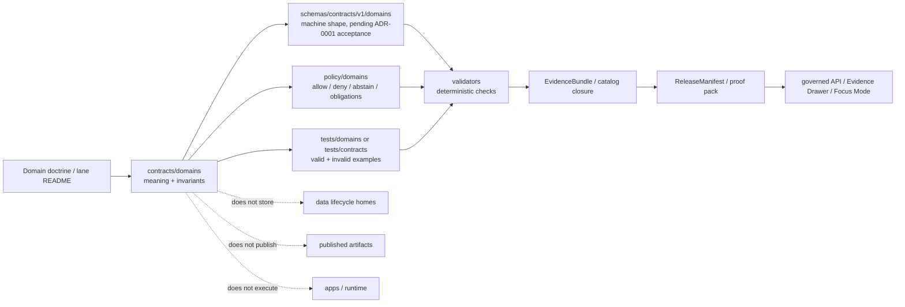

<!-- [KFM_META_BLOCK_V2]
doc_id: kfm://doc/TODO-contracts-domains-readme-uuid
title: contracts/domains
type: standard
version: v1
status: draft
owners: @bartytime4life
created: TODO-NEEDS-VERIFICATION
updated: 2026-05-06
policy_label: TODO-NEEDS-VERIFICATION
related: [../README.md, ../../README.md, ../../docs/domains/README.md, ../../docs/adr/ADR-0001-schema-home.md, ../../schemas/README.md, ../../policy/README.md, ../../tests/README.md, ../../data/registry/README.md]
tags: [kfm, contracts, domains, domain-contracts, evidence, governance, schemas, policy, source-roles]
notes: [doc_id, created date, policy_label, and lane-specific ownership need verification; owner is inherited from the adjacent contracts README and should be confirmed; this README defines the human-facing domain-contract lane and does not make contracts/domains a machine-schema authority; schema-home authority remains governed by ADR-0001 until accepted or superseded.]
[/KFM_META_BLOCK_V2] -->
<a id="top"></a>

# `contracts/domains/`

Human-facing domain contract lane for KFM domain-specific object meaning, evidence burdens, source-role limits, sensitivity posture, and compatibility rules.

<div align="left">


</div>

> [!IMPORTANT]
> **Status:** `draft`  
> **Owners:** `@bartytime4life` *(inherited from the adjacent `contracts/` README; lane-specific ownership remains `NEEDS VERIFICATION`)*  
> **Path:** `contracts/domains/README.md`  
> **Primary job:** route and define domain-specific contract meaning before schemas, validators, policies, runtime payloads, map layers, proof packs, or public claims rely on that meaning.  
> **Not this lane:** machine schemas, executable policy, data storage, source registries, receipts, proof packs, release manifests, runtime code, UI components, AI prompts, or generated artifacts.  
> **Evidence posture:** contract-lane doctrine and repo-adjacent docs are available; enforcement, CI, fixtures, workflow behavior, and downstream consumers remain `NEEDS VERIFICATION` unless proven from the active checkout.

## Quick jumps

| Start here | Build / review | Reference |
|---|---|---|
| [Scope](#scope) | [Quickstart](#quickstart) | [Domain contract registry](#domain-contract-registry) |
| [Repo fit](#repo-fit) | [Domain contract card](#domain-contract-card) | [Compatibility rules](#compatibility-rules) |
| [Inputs](#accepted-inputs) | [Validation gates](#validation-gates) | [FAQ](#faq) |
| [Exclusions](#exclusions) | [Definition of done](#definition-of-done) | [Appendix](#appendix) |

---

## Scope

`contracts/domains/` is the human-facing contract companion for KFM domain lanes.

A domain contract says what a domain object, claim, relation, assertion, observation, interpretation, model output, or public-facing payload **means** before a machine schema or runtime surface encodes it.

This directory should answer questions like:

- What domain-specific object families exist?
- Which source roles may support each object or claim type?
- What evidence burden applies before a claim becomes public or semi-public?
- What sensitivities, rights, precision limits, steward reviews, or policy checks are domain-specific?
- What compatibility rules apply when a domain object changes?
- Which schemas, validators, policies, fixtures, receipts, proofs, and UI payloads must move together?

### This lane owns

| Owns | Meaning |
|---|---|
| Domain contract cards | Human-readable definitions for lane-specific contract families. |
| Domain object semantics | Field intent, object boundaries, invariants, and compatibility notes. |
| Evidence burden notes | What must be cited, resolved, reviewed, or abstained from before downstream use. |
| Source-role limits | What a source can support, and what it must not be used to claim alone. |
| Sensitivity posture | Domain-specific fail-closed rules for public exposure. |
| Cross-lane contract routing | Where shared or overlapping domain objects should be linked, not duplicated. |

### This lane does not own

| Does not own | Proper home |
|---|---|
| Machine-checkable JSON Schema | `../../schemas/` or the accepted schema-home path. |
| Executable policy | `../../policy/` |
| Source descriptors / source registries | `../../data/registry/` or verified source-registry home. |
| Data lifecycle objects | `../../data/` lifecycle homes. |
| Receipts, proofs, release manifests, rollback cards | Receipt, proof, release, and correction homes. |
| Runtime code, API handlers, UI components | `../../apps/`, `../../packages/`, or verified runtime homes. |
| Exploratory domain ideas | `../../docs/` intake, archive, reports, or verified idea register. |

> [!CAUTION]
> Domain contracts describe meaning. They do not admit a source, validate an artifact, authorize release, decide policy, or publish a claim.

[Back to top](#top)

---

## Repo fit

| Surface | Role | Current reading |
|---|---|---|
| [`../README.md`](../README.md) | Parent contract lane. Defines object meaning, compatibility posture, and the contract/schema/policy split. | Upstream authority for this README’s contract-lane role. |
| [`../../docs/domains/README.md`](../../docs/domains/README.md) | Domain documentation lane. Explains domain scope, source burden, and release posture. | Companion documentation surface. |
| [`../../docs/adr/ADR-0001-schema-home.md`](../../docs/adr/ADR-0001-schema-home.md) | Proposed schema-home decision. | Treat `schemas/contracts/v1/` as proposed canonical machine-contract home until accepted or superseded. |
| [`../../schemas/README.md`](../../schemas/README.md) | Schema root. | Machine-checkable shape belongs here or in the accepted schema-home subtree. |
| [`../../policy/README.md`](../../policy/README.md) | Policy root. | `NEEDS VERIFICATION`; policy decides allow/deny/abstain/obligation behavior. |
| [`../../tests/README.md`](../../tests/README.md) | Test root. | `NEEDS VERIFICATION`; fixtures and contract drift tests should prove this lane’s semantics. |
| [`../../data/registry/README.md`](../../data/registry/README.md) | Source / layer / registry adjacency. | `NEEDS VERIFICATION`; source admission should not be duplicated in contracts. |

### Boundary rule

`contracts/domains/` is a **narrative contract surface**. It may link to domain machine schemas, but it must not become a second machine-schema root.

```text
contracts/domains/           -> human meaning, invariants, compatibility
schemas/contracts/v1/domains -> PROPOSED machine-checkable shape, subject to ADR-0001
policy/domains/              -> executable allow / deny / abstain / obligation logic
tests/domains/               -> fixtures, no-regression, fail-closed examples
data/registry/               -> source descriptors, source roles, activation state
```

[Back to top](#top)

---

## Accepted inputs

Use this directory for contract material that is **domain-specific** and **meaning-bearing**.

| Accepted input | Use it when | Minimum burden |
|---|---|---|
| Domain contract README | A lane needs human-readable contract rules before machine schemas or runtime consumers rely on it. | Scope, object families, source roles, sensitivity, schema links, validator links, policy adjacency, and definition of done. |
| Object family card | A domain object affects evidence, policy, release, runtime, or public UI behavior. | State meaning, lifecycle role, schema companion, fixture companion, validator burden, and compatibility posture. |
| Claim burden note | A domain claim type needs evidence, source-role, or sensitivity constraints. | Say what can support the claim, what cannot, and when to `ABSTAIN` or `DENY`. |
| Field semantics note | A field needs explanation beyond a schema type. | Explain field intent, accepted values, invalid interpretations, and downstream effects. |
| Cross-lane relation note | A domain object depends on another domain without becoming that domain. | Link the related lane and preserve authority boundaries. |
| Compatibility / migration note | A domain object changes meaning, shape, or path. | Identify breaking vs additive change, downstream consumers, migration, rollback, and correction impact. |

[Back to top](#top)

---

## Exclusions

| Excluded item | Put it here instead | Why |
|---|---|---|
| `.schema.json`, `.schema.yaml`, executable schema fragments | `../../schemas/` or accepted schema-home path | Machine shape needs one canonical home and validator coverage. |
| Rego / policy rules | `../../policy/` | Policy decisions must remain executable and testable. |
| Valid / invalid fixtures | `../../tests/` or verified fixture home | Fixtures prove behavior; contracts explain meaning. |
| SourceDescriptor instances | `../../data/registry/` or verified source registry | Source admission and source authority need registry discipline. |
| RAW / WORK / QUARANTINE / PROCESSED data | `../../data/` lifecycle homes | Contracts are not data storage. |
| Proof packs, receipts, release manifests | Verified receipt, proof, release, or correction homes | Emitted trust objects must remain auditable and separate. |
| Map style, tiles, PMTiles, COGs, scenes | Map delivery or published artifact homes | Derived layers are not contract truth. |
| Runtime prompts, direct model outputs, chain-of-thought | Governed AI / receipt surfaces only where policy allows | AI is interpretive and evidence-subordinate. |
| Exact sensitive locations | Restricted review / steward-controlled surfaces | Archaeology, rare species, cultural sites, critical infrastructure, DNA, and living-person contexts fail closed. |

> [!WARNING]
> Never copy a domain scaffold, report, or prior PDF into this directory as if it were current implementation proof. Prior plans are lineage until the active repository verifies them.

[Back to top](#top)

---

## Directory tree

`PROPOSED` target shape until the active checkout confirms child lanes:

```text
contracts/domains/
├── README.md
├── hydrology/
│   └── README.md
├── hazards/
│   └── README.md
├── soil/
│   └── README.md
├── agriculture/
│   └── README.md
├── atmosphere/
│   └── README.md
├── geology/
│   └── README.md
├── habitat/
│   └── README.md
├── flora/
│   └── README.md
├── fauna/
│   └── README.md
├── roads-rail-trade/
│   └── README.md
├── settlements-infrastructure/
│   └── README.md
├── archaeology/
│   └── README.md
└── people-genealogy-dna-land/
    └── README.md
```

### Naming rule

Use the repo’s verified lane names once the checkout is mounted. Until then:

- prefer Directory Rules responsibility-root discipline;
- avoid new root-level domain folders;
- avoid duplicate names for the same lane;
- do not mirror machine schema folders here unless the mirror strategy is explicit and reviewed;
- use hyphenated lane names when they are already established by adjacent repo docs or Directory Rules.

[Back to top](#top)

---

## Domain contract registry

This registry is an orientation map, not proof that child directories already exist.

| Domain contract lane | Candidate path | Contract burden | Public-risk posture |
|---|---|---|---|
| Hydrology | `contracts/domains/hydrology/` | Water observations, HUC identity, streamflow context, regulatory flood distinction, source freshness, crosswalk ambiguity. | Public-safe compared with other lanes, but source identity and regulatory-vs-observed distinctions must be explicit. |
| Hazards | `contracts/domains/hazards/` | Hazard event/context distinctions, warning/feed freshness, regulatory areas, modeled/observed/remote-sensing separation. | Must not become emergency alerting or life-safety instructions. |
| Soil | `contracts/domains/soil/` | Soil units, horizons, interpretations, static snapshots, moisture context, model-vs-observation distinction. | Avoid site-level certainty from derived surfaces alone. |
| Agriculture | `contracts/domains/agriculture/` | Crop, field, production, suitability, stress, irrigation, soil adjacency, source-rights burden. | Farm-sensitive and private/precision-sensitive outputs need policy review. |
| Atmosphere | `contracts/domains/atmosphere/` | Air quality, weather, climate, smoke, model fields, advisory context, freshness, knowledge character. | Operational context must not become life-safety or regulatory determination. |
| Geology | `contracts/domains/geology/` | Bedrock/surficial units, stratigraphy, wells/cores, resources, geophysics/geochemistry, interpretation status. | Resource/legal/physical geology claims must not collapse into one truth layer. |
| Habitat | `contracts/domains/habitat/` | Habitat class, patch, corridor, suitability, condition, land-cover context, model support. | Habitat model support is not occurrence truth. |
| Flora | `contracts/domains/flora/` | Taxa, specimens, observations, rare-plant controls, phenology, vegetation surfaces. | Exact rare-plant locations fail closed by default. |
| Fauna | `contracts/domains/fauna/` | Taxa, occurrence evidence, ranges, seasonal context, legal/conservation status, disease/mortality. | Sensitive species, nests, roosts, dens, hibernacula, or precise occurrences require geoprivacy. |
| Roads / Rail / Trade | `contracts/domains/roads-rail-trade/` | Road, rail, corridor, facility, route status, historic alignment, movement evidence. | Historic interpretation must not become surveyed/legal geometry without evidence. |
| Settlements / Infrastructure | `contracts/domains/settlements-infrastructure/` | Settlements, facilities, networks, service areas, operators, dependencies, condition observations. | Critical infrastructure and operational precision need fail-closed handling. |
| Archaeology | `contracts/domains/archaeology/` | Sites, features, survey evidence, remote-sensing candidates, collections, cultural review posture. | Exact archaeological locations are denied by default. |
| People / Genealogy / DNA / Land | `contracts/domains/people-genealogy-dna-land/` | Person assertions, relationship hypotheses, DNA restrictions, land ownership assertions, parcel/title/assessor distinctions. | Living-person and DNA-derived public output are restricted by default. |

[Back to top](#top)

---

## Domain contract card

Use this card when a lane adds or changes a contract family.

```markdown
## <DomainObjectName>

| Field | Value |
|---|---|
| Status | CONFIRMED concept / PROPOSED implementation / NEEDS VERIFICATION |
| Domain lane | contracts/domains/<lane>/ |
| Meaning | What this object means in KFM |
| Not this object | What this object must not be mistaken for |
| Lifecycle role | SOURCE EDGE / RAW / WORK / QUARANTINE / PROCESSED / CATALOG / TRIPLET / PUBLISHED |
| Evidence burden | Required EvidenceRef / EvidenceBundle / source-role support |
| Source-role limits | Which sources may support which claims |
| Sensitivity posture | Public, restricted, generalized, delayed, denied, or steward-reviewed |
| Schema companion | ../../schemas/contracts/v1/domains/<lane>/<object>.schema.json or NEEDS VERIFICATION |
| Policy adjacency | ../../policy/domains/<lane>/ or NEEDS VERIFICATION |
| Fixture burden | Valid and invalid examples required before downstream reliance |
| Validator burden | Deterministic validation or explicit ADR exception |
| Runtime/UI consumers | Evidence Drawer, Focus Mode, map layer, review console, export, or NONE |
| Compatibility | Additive / breaking / migration required |
| Rollback or correction | How an incorrect object instance is withdrawn, superseded, or corrected |
```

### Object-card rules

- State what the object **is not**.
- Keep source authority and source convenience separate.
- Name public-safety transforms where precision matters.
- Treat required field additions, field renames, and meaning changes as compatibility events.
- Link machine schemas only when the target exists or is labeled `PROPOSED` / `NEEDS VERIFICATION`.
- Do not let UI payload shape quietly redefine domain meaning.

[Back to top](#top)

---

## Contract flow



### Lifecycle placement

```text
SOURCE EDGE -> RAW -> WORK / QUARANTINE -> PROCESSED -> CATALOG / TRIPLET -> PUBLISHED
                 ^          ^                   ^                  ^              ^
                 |          |                   |                  |              |
contracts/domains explains meaning and burden; it does not store or promote lifecycle data.
```

[Back to top](#top)

---

## Source-role and sensitivity rules

Domain contracts should include source-role limits because most KFM errors become dangerous when a source is used for a claim it cannot support.

| Source role | Can support | Cannot support alone |
|---|---|---|
| Observation | A measured or observed condition at a scoped place, time, method, and source. | Legal status, causation, trend, title truth, or release rights. |
| Regulatory / administrative | Official boundary, program status, declaration, classification, or administrative context. | Physical observation unless the source also observes the event. |
| Documentary / archival | Historical assertion, map reference, deed, report, photograph, or narrative evidence. | Precision or present-day condition beyond source support. |
| Model / derivative | Suitability, interpolation, scenario, classification, prediction, index, or risk surface. | Direct observation or legal authority. |
| Remote-sensing candidate | Detection, anomaly, mask, spectral context, or image-derived lead. | Confirmed site, confirmed species occurrence, legal boundary, or field-verified condition. |
| Steward-reviewed | Controlled record with steward conditions. | Public release beyond steward-approved access posture. |
| Aggregated / community source | Discovery lead, context, or corroboration where terms allow. | Legal/conservation authority, exact sensitive geometry, or unrestricted public release. |

### Fail-closed sensitivity defaults

| Risk | Default outcome |
|---|---|
| Rights or source terms unclear | `DENY` public release or keep in `QUARANTINE`. |
| Evidence cannot resolve | `ABSTAIN` on consequential claims. |
| Living-person or DNA-derived output | `DENY` public release unless policy explicitly allows. |
| Exact archaeology, cultural, sacred, burial, or collection-sensitive location | `DENY` exact public geometry by default. |
| Exact rare species or sensitive occurrence location | Generalize, suppress, delay, or restrict. |
| Critical infrastructure precision | Generalize or restrict when exploitability risk is material. |
| Operational hazard or weather context | Mark contextual-only; do not provide emergency instructions. |

[Back to top](#top)

---

## Compatibility rules

| Change | Compatibility posture |
|---|---|
| Add optional explanatory text without changing field meaning | Usually docs-only. |
| Add optional field semantics to a future schema companion | Usually additive, but downstream validators may still need review. |
| Add required field | Breaking. |
| Remove a field | Breaking unless deprecated first and migration is proven. |
| Rename a field | Breaking. |
| Change field meaning without changing field name | Breaking and high-risk. |
| Reclassify source-role authority | Policy-impacting; review required. |
| Change public precision / sensitivity posture | Policy-impacting; review required. |
| Move machine schema home | ADR / migration required. |
| Add UI/runtime consumer | Runtime-proof required when public or steward-facing. |

### Compatibility rule of thumb

If a downstream contract, schema, fixture, validator, policy, EvidenceBundle, map layer, Focus answer, release manifest, correction notice, or published artifact would change behavior, treat the contract change as review-required.

[Back to top](#top)

---

## Quickstart

Use these commands only from a mounted repository checkout.

```bash
# Inspect the parent contract lane and this domain-contract lane.
git status --short
git branch --show-current
find contracts -maxdepth 3 -type f | sort
find contracts/domains -maxdepth 3 -type f | sort

# Inspect adjacent machine and governance surfaces.
find schemas/contracts -maxdepth 5 -type f 2>/dev/null | sort | sed -n '1,200p'
find policy -maxdepth 4 -type f 2>/dev/null | sort | sed -n '1,200p'
find tests -maxdepth 4 -type f 2>/dev/null | sort | sed -n '1,200p'

# Search for existing domain contract language before adding a new lane.
git grep -nE 'SourceDescriptor|EvidenceBundle|DecisionEnvelope|RuntimeResponseEnvelope|ReleaseManifest|CorrectionNotice|source role|sensitivity|geoprivacy|domain contract' -- \
  contracts docs schemas policy tests tools
```

### Adding a domain contract lane

```bash
# Non-destructive example after verifying the lane does not already exist.
mkdir -p contracts/domains/<lane>
touch contracts/domains/<lane>/README.md
```

Then add:

1. a lane impact block;
2. scope and exclusions;
3. object family cards;
4. source-role limits;
5. sensitivity posture;
6. schema/policy/test links, with `NEEDS VERIFICATION` where not yet landed;
7. definition of done;
8. open verification items.

[Back to top](#top)

---

## Validation gates

A domain contract is ready for downstream reliance only when meaning, machine shape, policy, fixtures, and review burden line up.

| Gate | Required question | Expected evidence |
|---|---|---|
| Contract meaning | Does the object’s meaning and non-meaning remain clear? | Object card in this lane. |
| Schema companion | Is machine shape defined in the accepted schema home? | Schema path or explicit ADR exception. |
| Valid fixture | Can a good example pass? | Valid fixture. |
| Invalid fixture | Can an unsafe or malformed example fail? | Invalid fixture. |
| Policy adjacency | Are sensitivity, rights, precision, source-role, and release constraints reviewed? | Policy link or policy review note. |
| Evidence closure | Can a consequential claim resolve to EvidenceBundle? | EvidenceRef / EvidenceBundle test or review path. |
| Runtime/UI proof | If public or steward-facing, does the envelope/layer/drawer/focus behavior stay bounded? | Runtime-proof or UI contract test. |
| Release/correction | Can publication, withdrawal, supersession, rollback, and correction be audited? | Release/correction link or proof-plan placeholder. |

### Negative tests to require early

| Risk | Negative test |
|---|---|
| Model-derived surface used as observation | Fails with `ABSTAIN` or `DENY`. |
| Regulatory area used as observed event | Fails source-role check. |
| Exact sensitive location published | Fails policy check. |
| EvidenceRef missing or unresolved | Runtime/promotion fails. |
| Field meaning changes without compatibility note | Contract review fails. |
| Domain contract adds schema-like file here | Schema-home check fails. |
| Public layer lacks release/evidence reference | Layer/release check fails. |

[Back to top](#top)

---

## Definition of done

### For this README

- [ ] Meta block placeholders are resolved or intentionally retained.
- [ ] Parent contract README still agrees with this lane’s role.
- [ ] ADR-0001 status is checked before schema-home wording is strengthened.
- [ ] Links to docs, schemas, policy, tests, and registry surfaces are verified.
- [ ] No child lane is described as implemented unless the active checkout proves it.
- [ ] Directory tree is corrected against the active branch.
- [ ] Open verification items are transferred into the repo’s verification backlog if one exists.

### For a new child lane

- [ ] Lane README exists and uses KFM Meta Block v2.
- [ ] Scope and exclusions are explicit.
- [ ] At least one object family card exists, or the README explains why no object family is active yet.
- [ ] Source-role limits are stated.
- [ ] Sensitivity and public-release posture are stated.
- [ ] Schema companion is linked or marked `NEEDS VERIFICATION`.
- [ ] Policy adjacency is linked or marked `NEEDS VERIFICATION`.
- [ ] Fixture and validator burden is named.
- [ ] Release, correction, and rollback posture is named.
- [ ] No exact sensitive public geometry, living-person/DNA output, or rights-uncertain claim is normalized.

### Do not merge until

- [ ] Schema-home authority is not made worse.
- [ ] No domain contract is duplicated across two homes without migration notes.
- [ ] No policy decision is embedded as prose-only contract language.
- [ ] No prior PDF/scaffold is treated as current implementation proof.
- [ ] Any public-facing claim has a path to EvidenceBundle, policy decision, release state, and correction lineage.

[Back to top](#top)

---

## FAQ

### Is `contracts/domains/` the machine schema home for domain contracts?

No. This directory is a human-facing contract lane. Machine-checkable domain schemas should live in the accepted schema home, currently proposed by ADR-0001 as `schemas/contracts/v1/`.

### Why not put everything under `docs/domains/`?

`docs/domains/` explains domain lane scope and operating posture. `contracts/domains/` defines contract meaning for domain objects that downstream schemas, policies, validators, runtime envelopes, and release surfaces may rely on.

### Can a domain contract include examples?

Yes, if examples are clearly illustrative or contract-oriented. Valid/invalid fixtures that drive validators belong in the test/fixture home, not here.

### Can a domain contract decide whether something is public?

No. It can state the domain-specific policy burden and required review, but executable allow/deny/abstain decisions belong to policy and release gates.

### What happens when two lanes define the same concept?

Do not duplicate it. Create a shared contract or explicitly link the owning lane, then document cross-lane usage and compatibility. If authority remains unclear, mark it `CONFLICTED` and open an ADR or verification backlog item.

### What if a domain report already proposed a full schema tree?

Treat the report as lineage until the active checkout confirms the path, schema-home authority, fixtures, validators, policies, and consumers. Useful lineage can become implementation through review; it does not become implementation through repetition.

[Back to top](#top)

---

## Appendix

<details>
<summary><strong>Status vocabulary</strong></summary>

| Label | Meaning in this README |
|---|---|
| `CONFIRMED` | Verified from active repo evidence, direct source content, or governing KFM doctrine available in the current work session. |
| `PROPOSED` | Recommended placement, object, lane, gate, or workflow that needs review before becoming implementation fact. |
| `UNKNOWN` | Not verified strongly enough to state. |
| `NEEDS VERIFICATION` | A concrete check must be performed against active repo, owner, policy, schema, test, workflow, runtime, or artifact evidence. |
| `CONFLICTED` | Two or more plausible authority homes or meanings exist and must not be silently normalized. |
| `DENY` | Do not publish or expose under current evidence/policy/sensitivity conditions. |
| `ABSTAIN` | Do not answer or claim because evidence support is insufficient. |
| `ERROR` | A process/tool/input validation failure occurred. |

</details>

<details>
<summary><strong>Review prompts for PR authors</strong></summary>

Answer these in the PR body when changing this directory:

1. What domain object meaning changed?
2. Which source roles can support the changed claim?
3. Which source roles cannot support it alone?
4. What sensitivity, rights, precision, or steward-review rule applies?
5. What schema, fixture, validator, and policy surfaces changed with it?
6. What public UI, map layer, Focus Mode, Evidence Drawer, release, or correction behavior depends on it?
7. What failure mode proves the change can fail closed?
8. What rollback or correction path exists?

</details>

<details>
<summary><strong>Anti-pattern watchlist</strong></summary>

- Creating `hydrology/`, `fauna/`, `archaeology/`, or other domain roots at repo top level.
- Treating `contracts/domains/` as a schema root.
- Copying prior PDFs into this lane as contract truth.
- Letting UI payloads define object meaning.
- Letting source aggregators decide legal, conservation, title, or release authority.
- Publishing exact sensitive locations by default.
- Collapsing model output and observation into one claim.
- Treating tiles, graphs, indexes, summaries, scenes, or AI answers as sovereign truth.
- Changing field meaning without compatibility notes and negative tests.
- Claiming CI, policy, runtime, or release enforcement without direct evidence.

</details>

[Back to top](#top)
