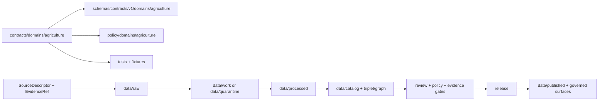

<!-- [KFM_META_BLOCK_V2]
doc_id: kfm://doc/contracts-domains-agriculture-readme
title: contracts/domains/agriculture/ — Agriculture Domain Semantic Contracts
type: readme
version: v0.3
status: draft
owners: OWNER_TBD — Agriculture steward · Contract steward · Schema steward · Policy steward · Data steward · Evidence steward · Validation steward · Docs steward
created: 2026-06-20
updated: 2026-06-20
policy_label: public; contracts; domains; agriculture; semantic-contracts
tags: [kfm, contracts, domains, agriculture, semantic-contracts, object-families, evidence, lifecycle, governance]
related:
  - ../../README.md
  - ../../../docs/domains/agriculture/OBJECTS.md
  - ../../../docs/domains/agriculture/OBJECT_FAMILIES.md
  - ../../../schemas/contracts/v1/domains/agriculture/
  - ../../../policy/domains/agriculture/
  - ../../../tests/domains/agriculture/
  - ../../../fixtures/domains/agriculture/
  - ../../../data/registry/sources/
  - ../../../data/proofs/
  - ../../../release/
  - ../../agriculture/README.md
notes:
  - "v0.3 applies the KFM Markdown Authoring Agent v2 standard: clearer scope, status, repo fit, inputs, exclusions, evidence basis, validation, and rollback."
  - "Contracts define semantic meaning only; schemas, policy, validators, fixtures, data, proofs, release, API, and UI remain separate authority roots."
  - "The older contracts/agriculture/ path remains a compatibility path until migration or ADR review resolves the relationship."
[/KFM_META_BLOCK_V2] -->

<a id="top"></a>

# Agriculture Domain Semantic Contracts

> Semantic-contract home for Agriculture object families. This directory defines object meaning and governance expectations; it does not define schema shape, policy behavior, data storage, proof objects, release artifacts, package code, API behavior, or UI behavior.

<p>
  
  
  
  
  
</p>

`contracts/domains/agriculture/`

## Quick jumps

[Status](#status) · [Scope](#scope) · [Repo fit](#repo-fit) · [Accepted inputs](#accepted-inputs) · [Exclusions](#exclusions) · [Object-family spine](#object-family-spine) · [Contract rules](#contract-rules) · [Lifecycle boundary](#lifecycle-boundary) · [Validation](#validation) · [Evidence basis](#evidence-basis) · [Rollback](#rollback) · [Definition of done](#definition-of-done)

---

## Status

> [!IMPORTANT]
> **Status:** `draft` / directory README  
> **Owner:** `OWNER_TBD`  
> **Path:** `contracts/domains/agriculture/`  
> **Truth posture:** `CONFIRMED` current path and current update. Agriculture docs name this path as a proposed Markdown contract home. Object-level contract coverage, schemas, validators, fixtures, tests, policy behavior, release behavior, API behavior, and UI behavior remain `NEEDS VERIFICATION` unless separately confirmed.

---

## Scope

Use this directory for Agriculture Markdown semantic contracts.

Each object-level contract should define:

- object meaning;
- Agriculture ownership boundary;
- identity-bearing fields;
- source and evidence expectations;
- lifecycle posture;
- review and release constraints;
- validation expectations;
- rollback expectations.

This directory is **not** the implementation authority for machine shape, executable checks, policy decisions, source records, lifecycle data, proofs, releases, APIs, or UI behavior.

---

## Repo fit

```text
contracts/
└── domains/
    └── agriculture/
        └── README.md
```

Adjacent roots:

| Root | Relationship |
|---|---|
| `../../README.md` | Root contract guidance. |
| `../../../docs/domains/agriculture/OBJECTS.md` | Agriculture object-family meanings and boundaries. |
| `../../../docs/domains/agriculture/OBJECT_FAMILIES.md` | Agriculture object-family register and proposed placement. |
| `../../../schemas/contracts/v1/domains/agriculture/` | Expected schema root. |
| `../../../policy/domains/agriculture/` | Expected policy root. |
| `../../../tests/domains/agriculture/`, `../../../fixtures/domains/agriculture/` | Expected enforceability roots. |
| `../../../data/registry/sources/` | SourceDescriptor/source-role authority. |
| `../../../data/proofs/` | EvidenceBundle/proof support. |
| `../../../release/` | Release, correction, supersession, and rollback authority. |
| `../../agriculture/README.md` | Compatibility path that still needs migration review. |

---

## Accepted inputs

| Belongs here | Required posture |
|---|---|
| Agriculture Markdown contracts | Define semantic meaning and governance expectations only. |
| Object-family contract READMEs | Link to schemas, policy, fixtures, tests, evidence, and release roots where relevant. |
| Compatibility notes | State relationship to `contracts/agriculture/` when both paths remain. |
| Verification checklists | Mark unverified implementation as `NEEDS VERIFICATION`. |
| Rollback notes | Name prior content SHA or migration target. |

---

## Exclusions

| Does not belong here | Correct home |
|---|---|
| JSON Schema | `../../../schemas/contracts/v1/domains/agriculture/` or accepted schema home. |
| Policy rules | `../../../policy/domains/agriculture/` or accepted policy home. |
| Validator code | `../../../tools/validators/` or accepted validator package. |
| Fixtures and tests | `../../../fixtures/`, `../../../tests/`. |
| Source registry records | `../../../data/registry/sources/`. |
| Data lifecycle artifacts | `../../../data/`. |
| Evidence/proof objects | `../../../data/proofs/`. |
| Release records | `../../../release/`. |
| API/UI implementation | Governed app/API/UI roots. |

---

## Object-family spine

Agriculture docs name these twelve object families:

| # | Object family | Contract status in this directory |
|---:|---|---|
| 1 | `CropObservation` | `NEEDS VERIFICATION` |
| 2 | `FieldCandidate` | `NEEDS VERIFICATION`; compatibility contract exists under `contracts/agriculture/FieldCandidate.md`. |
| 3 | `CropRotation` | `NEEDS VERIFICATION` |
| 4 | `YieldObservation` | `NEEDS VERIFICATION` |
| 5 | `IrrigationLink` | `NEEDS VERIFICATION` |
| 6 | `ConservationPractice` | `NEEDS VERIFICATION` |
| 7 | `SoilCropSuitability` | `NEEDS VERIFICATION` |
| 8 | `AgriculturalEconomyObservation` | `NEEDS VERIFICATION` |
| 9 | `SupplyChainNode` | `NEEDS VERIFICATION` |
| 10 | `DroughtStressIndicator` | `NEEDS VERIFICATION` |
| 11 | `PestStressIndicator` | `NEEDS VERIFICATION` |
| 12 | `AggregationReceipt` | `NEEDS VERIFICATION` |

Concrete object-level contracts under this directory remain `NEEDS VERIFICATION` unless separately confirmed.

---

## Contract rules

Agriculture contracts should preserve these boundaries:

- contracts define meaning, not machine shape;
- schemas define shape;
- policy roots decide admissibility;
- validators and fixtures prove enforceability;
- data roots hold lifecycle artifacts;
- evidence roots hold proof support;
- release roots hold release decisions;
- cited facts from other domains remain owned by those domains.

Agriculture contracts must not collapse:

- aggregate records into single-place facts;
- modeled products into observations;
- candidate records into confirmed features;
- cited Soil, Hydrology, Atmosphere/Air, Hazards, or Land-context facts into Agriculture-owned truth.

---

## Lifecycle boundary



Contracts describe meaning. They do not move data, validate schemas, make policy decisions, close evidence, publish artifacts, define routes, or render maps.

---

## Validation

Before relying on this directory, verify:

- full directory inventory;
- compatibility plan for `contracts/agriculture/`;
- object-level contract coverage for all twelve families;
- matching schemas and `$id` values;
- linked policy roots;
- linked validators and fixtures;
- linked evidence requirements;
- release and rollback posture for any released surface.

---

## Evidence basis

| Source | Status | Supports | Limits |
|---|---|---|---|
| Prior `contracts/domains/agriculture/README.md` | `CONFIRMED` | Target file existed as a compact boundary README before this update. | It needed stronger GitHub README structure and metadata. |
| `contracts/README.md` | `CONFIRMED` | Contracts define meaning and schemas define shape. | Does not inventory Agriculture contracts. |
| `docs/domains/agriculture/OBJECT_FAMILIES.md` | `CONFIRMED domain register / PROPOSED placement` | Names twelve object families and proposed contract/schema homes. | Concrete implementation remains verification-bound. |
| `docs/domains/agriculture/OBJECTS.md` | `CONFIRMED domain reference / PROPOSED realizations` | Describes object-family purpose and boundaries. | It is a reference document, not a contract or schema. |
| `contracts/agriculture/README.md` | `CONFIRMED compatibility path` | Shows older path exists and is marked conflicted against this path. | Does not settle migration. |
| Uploaded authoring prompt v2 | `CONFIRMED user-supplied guidance` | Requires evidence-grounded, visually polished, implementation-honest Markdown with verification and rollback posture. | It is authoring guidance, not repo implementation proof. |

---

## Rollback

Rollback is required if this README is used to claim implementation completeness that was not verified in this task.

Rollback target: prior compact README content SHA `43e96f46b865cbef3716b443b38ae699054412f6`.

---

## Definition of done

- [ ] Owners are confirmed and `OWNER_TBD` is replaced.
- [ ] Full directory inventory is generated.
- [ ] Compatibility relationship with `contracts/agriculture/` is resolved.
- [ ] All twelve Agriculture object-family contracts are authored or explicitly marked absent.
- [ ] Matching schemas and `$id` values are verified.
- [ ] Policy, validator, fixture, evidence, release, and rollback dependencies are linked.

---

## Status summary

`contracts/domains/agriculture/` is the Agriculture semantic-contract home. It is not a schema home, policy home, validator package, fixture store, source registry, data lifecycle root, proof root, release authority, API implementation, or UI implementation.

<p align="right"><a href="#top">Back to top</a></p>
