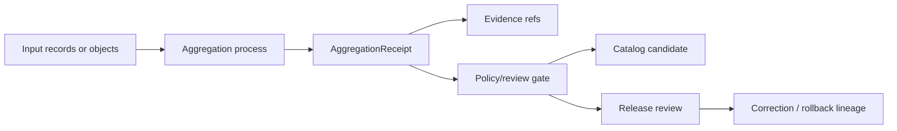

<!-- [KFM_META_BLOCK_V2]
doc_id: kfm://contract/domains/agriculture/aggregation-receipt
title: contracts/domains/agriculture/aggregation-receipt.md — AggregationReceipt Contract
type: contract
version: v0.2
status: draft
owners: OWNER_TBD — Agriculture steward · Contract steward · Receipt steward · Evidence steward · Schema steward · Policy steward · Validation steward · Release steward · Docs steward
created: 2026-06-20
updated: 2026-06-20
policy_label: public; contracts; domains; agriculture; aggregation-receipt; semantic-contract; receipt; evidence-aware
tags: [kfm, contracts, agriculture, aggregation-receipt, receipt, aggregation, evidence, lifecycle, release, rollback, governance]
related:
  - ./README.md
  - ../../../docs/domains/agriculture/CANONICAL_PATHS.md
  - ../../../docs/domains/agriculture/OBJECT_FAMILIES.md
  - ../../../docs/domains/agriculture/OBJECTS.md
  - ../../../docs/domains/agriculture/policy/README.md
  - ../../../docs/adr/ADR-0011-receipts-vs-proofs-vs-manifests-vs-catalog-separation.md
  - ../../../schemas/contracts/v1/domains/agriculture/aggregation_receipt.schema.json
  - ../../../policy/domains/agriculture/
  - ../../../fixtures/domains/agriculture/
  - ../../../tests/domains/agriculture/
  - ../../../data/receipts/
  - ../../../data/proofs/
  - ../../../release/
notes:
  - "Expanded from a scaffold sourced from docs/domains/agriculture/CANONICAL_PATHS.md."
  - "CONFLICTED / NEEDS VERIFICATION: requested file path uses aggregation-receipt.md, while the paired schema metadata points to contracts/domains/agriculture/aggregation_receipt.md."
  - "CONFLICTED / NEEDS VERIFICATION: Agriculture object-family docs say the receipt home is pending ADR-S-03 and may belong under an agriculture domain home or a receipt/runtime home."
  - "The paired schema is a PROPOSED scaffold with no required properties and additionalProperties enabled."
  - "No validator file was verified for this object in this task."
[/KFM_META_BLOCK_V2] -->

<a id="top"></a>

# AggregationReceipt Contract

> Semantic contract for `AggregationReceipt`, the Agriculture receipt object that records how Agriculture records were aggregated into a governed summary while preserving input lineage, threshold/profile context, method identity, evidence references, and release-review support.

<p>
  
  
  
  
  
  
</p>

`contracts/domains/agriculture/aggregation-receipt.md`

## Quick jumps

[Status](#status) · [Meaning](#meaning) · [Path posture](#path-posture) · [Repo fit](#repo-fit) · [Schema posture](#schema-posture) · [Accepted uses](#accepted-uses) · [Exclusions](#exclusions) · [Recommended fields](#recommended-fields) · [Invariants](#invariants) · [Lifecycle](#lifecycle) · [Validation](#validation) · [Evidence basis](#evidence-basis) · [Rollback](#rollback) · [Definition of done](#definition-of-done)

---

## Status

> [!IMPORTANT]
> **Status:** `draft` / semantic contract  
> **Owner:** `OWNER_TBD`  
> **Contract path:** `contracts/domains/agriculture/aggregation-receipt.md`  
> **Truth posture:** `CONFIRMED` target file path, source scaffold, Agriculture object-family entry, paired scaffold schema, and ADR-0011 separation doctrine. Canonical path, schema home, validator behavior, fixtures, policy behavior, release integration, and tests remain `NEEDS VERIFICATION`.

---

## Meaning

`AggregationReceipt` is a receipt for an Agriculture aggregation step.

It records that an aggregation was performed, identifies the method and threshold/profile context, records input digests or evidence references, and provides a reviewable trail for downstream catalog, proof, release, correction, or rollback work.

It does **not** prove that the resulting claim is true by itself. It also does not replace EvidenceBundle support, policy decisions, catalog records, release manifests, or rollback records.

In Agriculture docs, `AggregationReceipt` is named as `OF-AG-12`, a receipt object cited by Catalog and Release and connected to all prior Agriculture object families through input evidence references.

---

## Path posture

This file uses the user-requested path:

```text
contracts/domains/agriculture/aggregation-receipt.md
```

Current repository and doctrine evidence also show two competing references:

| Path or home | Status | Notes |
|---|---|---|
| `contracts/domains/agriculture/aggregation-receipt.md` | `CONFIRMED` current target path | Existing scaffold source named this hyphenated path. |
| `contracts/domains/agriculture/aggregation_receipt.md` | `PROPOSED / CONFLICTED` | Schema metadata points to this underscore path. File was not verified. |
| `contracts/runtime/aggregation_receipt.md` | `PROPOSED / CONFLICTED` | Agriculture object-family docs mention this as an ADR-S-03 option. |
| Receipt-family home | `NEEDS VERIFICATION` | Object-family docs say the receipt home is open pending ADR-S-03. |

This contract does not resolve the path conflict. It records the conflict and keeps the current file usable as a bounded semantic contract.

---

## Repo fit

```text
contracts/
└── domains/
    └── agriculture/
        ├── README.md
        └── aggregation-receipt.md
```

Adjacent roots:

| Root | Relationship |
|---|---|
| `./README.md` | Agriculture semantic-contract directory boundary. |
| `../../../docs/domains/agriculture/OBJECT_FAMILIES.md` | Agriculture object-family register and `OF-AG-12` receipt entry. |
| `../../../docs/domains/agriculture/CANONICAL_PATHS.md` | Source path-only crosswalk for this scaffold. |
| `../../../schemas/contracts/v1/domains/agriculture/aggregation_receipt.schema.json` | Paired scaffold schema using underscore naming. |
| `../../../policy/domains/agriculture/` | Policy root; behavior not verified here. |
| `../../../fixtures/domains/agriculture/`, `../../../tests/domains/agriculture/` | Expected enforceability roots; coverage not verified here. |
| `../../../data/receipts/` | Receipt instance family candidate per ADR-0011-style separation. |
| `../../../data/proofs/` | Evidence/proof support. |
| `../../../release/` | Release, correction, supersession, and rollback authority. |

---

## Schema posture

The paired schema found in this task is:

```text
schemas/contracts/v1/domains/agriculture/aggregation_receipt.schema.json
```

Current schema evidence:

| Schema fact | Status |
|---|---|
| Schema file exists | `CONFIRMED` |
| `$id` is `kfm://schemas/contracts/v1/domains/agriculture/aggregation_receipt.schema.json` | `CONFIRMED` |
| Schema title is `Aggregation Receipt` | `CONFIRMED` |
| Schema says it is a `PROPOSED scaffold` | `CONFIRMED` |
| `additionalProperties` is `true` | `CONFIRMED` |
| `properties` is empty | `CONFIRMED` |
| Schema metadata points to `contracts/domains/agriculture/aggregation_receipt.md` | `CONFIRMED / CONFLICTED with this file path` |
| Validator file | `UNKNOWN / NOT FOUND` |

---

## Accepted uses

| Use | Allowed? | Rule |
|---|---:|---|
| Recording that an Agriculture aggregation process ran | Yes | Must identify method, inputs, threshold/profile, and run identity where available. |
| Supporting catalog or release review | Yes | Must remain separate from proof and release decisions. |
| Linking to input evidence references | Yes | Must preserve source/evidence lineage. |
| Supporting correction, supersession, or rollback | Yes | Must link affected outputs and prior known-good state where applicable. |
| Acting as EvidenceBundle proof | No | EvidenceBundle/proof objects remain separate. |
| Acting as release approval | No | Release authority remains separate. |
| Carrying source rows or payload data | No | Payloads remain in lifecycle data roots. |
| Resolving the canonical receipt home | No | Requires ADR/migration decision. |

---

## Exclusions

| Does not belong in `AggregationReceipt` | Correct home |
|---|---|
| Full input records or source payloads | `../../../data/...` lifecycle roots. |
| EvidenceBundle/proof content | `../../../data/proofs/`. |
| Process logs unrelated to the receipt summary | Receipt/run logging root after accepted placement. |
| JSON Schema shape | `../../../schemas/contracts/v1/...`. |
| Policy decisions | `../../../policy/...`. |
| Validator code | `../../../tools/validators/...`. |
| Fixtures and tests | `../../../fixtures/...`, `../../../tests/...`. |
| ReleaseManifest, CorrectionNotice, SupersessionNotice, RollbackCard | `../../../release/` and related contract families. |

---

## Recommended fields

The current schema does not require these fields. They are `PROPOSED` semantic requirements for future schema/validator work:

| Field | Meaning |
|---|---|
| `receipt_id` | Stable identifier for the aggregation receipt. |
| `aggregation_method` | Method or recipe used to produce the aggregate. |
| `threshold_profile` | Profile or rule set used to decide whether aggregation is sufficient. |
| `input_refs` | Dataset, object, or layer references used as inputs. |
| `inputs_digest` | Deterministic digest of the input set. |
| `inputs_evidence_refs` | EvidenceRef/EvidenceBundle pointers supporting the inputs. |
| `run_id` | Run or process identifier. |
| `produced_output_refs` | Catalog, layer, claim, or release candidate outputs affected by the receipt. |
| `policy_state` | Policy posture or policy-decision reference. |
| `review_state` | Steward review status where material. |
| `release_ref` | Release candidate or ReleaseManifest linkage where applicable. |
| `rollback_target` | Prior known-good output or receipt state. |
| `correction_refs` | Correction or supersession records if the aggregation changes later. |

---

## Invariants

`AggregationReceipt` must preserve these invariants:

- a receipt records process memory; it is not proof by itself;
- aggregation does not erase input provenance;
- aggregation does not launder source sensitivity, rights, or evidence gaps;
- source rows and payloads stay in data lifecycle roots;
- proof support stays in EvidenceBundle/proof roots;
- release decisions stay in release roots;
- receipt, proof, catalog, and publication remain separate artifact families;
- path conflicts must be surfaced until ADR/migration review resolves them.

---

## Lifecycle



The receipt supports review. It does not replace evidence resolution, policy decision, release decision, or rollback records.

---

## Validation

Before relying on this contract, verify:

- canonical filename: hyphenated `aggregation-receipt.md` vs underscore `aggregation_receipt.md`;
- canonical receipt home: Agriculture domain path vs receipt/runtime path;
- paired schema fields and `$id` after path decision;
- validator implementation and fixtures;
- threshold/profile representation;
- input EvidenceRef/EvidenceBundle linkage;
- policy and review linkage;
- release/correction/rollback linkage;
- no downstream process treats the receipt as proof or release approval by itself.

---

## Evidence basis

| Source | Status | Supports | Limits |
|---|---|---|---|
| Prior `contracts/domains/agriculture/aggregation-receipt.md` scaffold | `CONFIRMED` | Target file existed and pointed to `CANONICAL_PATHS.md`. | Scaffold did not define authoritative content. |
| `docs/domains/agriculture/CANONICAL_PATHS.md` | `CONFIRMED path doctrine / PROPOSED realization` | Path-only crosswalk; warns path listing is not implementation proof. | Does not define object meaning, schema shape, policy, or release outcomes. |
| `docs/domains/agriculture/OBJECT_FAMILIES.md` | `CONFIRMED domain register / PROPOSED placement` | Names `OF-AG-12 · AggregationReceipt`; records home conflict and source/evidence role. | Placement and schema home remain pending ADR-S-03. |
| `schemas/contracts/v1/domains/agriculture/aggregation_receipt.schema.json` | `CONFIRMED scaffold` | Schema exists and points to underscore contract path. | Empty properties; no full semantic enforcement. |
| `docs/adr/ADR-0011-receipts-vs-proofs-vs-manifests-vs-catalog-separation.md` | `PROPOSED ADR / CONFIRMED text` | Separates receipt, proof, catalog, and publication families. | ADR is proposed and does not prove implementation. |
| Uploaded authoring prompt v2 | `CONFIRMED user-supplied guidance` | Requires evidence-grounded, visually polished, implementation-honest Markdown with verification and rollback posture. | Authoring guidance, not implementation proof. |

---

## Rollback

Rollback is required if this contract is used to claim canonical path resolution, schema completeness, validator coverage, policy enforcement, release approval, or implementation maturity not verified in this task.

Rollback target: prior scaffold content SHA `9371c6a9aca887f1b23377e05322d2ae50f81cf0`.

---

## Definition of done

- [ ] Owners are confirmed and `OWNER_TBD` is replaced.
- [ ] ADR/migration decision resolves receipt home and hyphen/underscore naming.
- [ ] Paired schema is updated to the accepted contract path.
- [ ] Schema fields are defined beyond scaffold status.
- [ ] Validator and fixtures are implemented and verified.
- [ ] Evidence, policy, review, release, correction, and rollback links are testable.
- [ ] Downstream docs link to the accepted canonical path only.

---

## Status summary

`AggregationReceipt` records the Agriculture aggregation process and its review support context. It is not raw data, not an EvidenceBundle, not proof closure, not catalog truth, not policy approval, and not release approval.

<p align="right"><a href="#top">Back to top</a></p>
