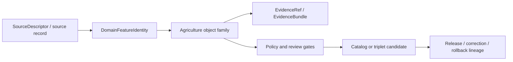

<!-- [KFM_META_BLOCK_V2]
doc_id: kfm://contract/domains/agriculture/domain-feature-identity
title: contracts/domains/agriculture/domain_feature_identity.md — DomainFeatureIdentity Contract
type: contract
version: v0.2
status: draft
owners: OWNER_TBD — Agriculture steward · Contract steward · Identity steward · Evidence steward · Schema steward · Policy steward · Validation steward · Docs steward
created: 2026-06-20
updated: 2026-06-20
policy_label: public; contracts; domains; agriculture; domain-feature-identity; semantic-contract
tags: [kfm, contracts, agriculture, identity, domain-feature, deterministic-id, source-role, temporal-scope, evidence, lifecycle, governance]
related:
  - ./README.md
  - ../../../docs/domains/agriculture/OBJECTS.md
  - ../../../docs/domains/agriculture/OBJECT_FAMILIES.md
  - ../../../schemas/contracts/v1/domains/agriculture/domain_feature_identity.schema.json
  - ../../../fixtures/domains/agriculture/domain_feature_identity/
  - ../../../tools/validators/domains/agriculture/validate_domain_feature_identity.py
  - ../../../policy/domains/agriculture/
  - ../../../data/registry/sources/
  - ../../../data/proofs/
  - ../../../release/
notes:
  - "Expanded from a greenfield scaffold into the object-level DomainFeatureIdentity semantic contract."
  - "The paired schema is a greenfield placeholder with only id required and additionalProperties enabled."
  - "The schema-declared validator path was not found in this task."
  - "Agriculture OBJECTS.md supplies a proposed deterministic identity basis; this contract labels implementation as NEEDS VERIFICATION until schemas, validators, fixtures, and id-derivation code are confirmed."
[/KFM_META_BLOCK_V2] -->

<a id="top"></a>

# DomainFeatureIdentity Contract

> Semantic contract for `DomainFeatureIdentity`, the Agriculture identity carrier that describes how an Agriculture domain feature is named, scoped, versioned, and tied to source, evidence, time, geometry, digest, and lifecycle context without becoming the observation, model, aggregate, proof, policy decision, or release artifact itself.

<p>
  
  
  
  
  
  
</p>

`contracts/domains/agriculture/domain_feature_identity.md`

## Quick jumps

[Status](#status) · [Meaning](#meaning) · [Repo fit](#repo-fit) · [Schema posture](#schema-posture) · [Accepted uses](#accepted-uses) · [Exclusions](#exclusions) · [Recommended fields](#recommended-fields) · [Invariants](#invariants) · [Identity recipe](#identity-recipe) · [Lifecycle](#lifecycle) · [Validation](#validation) · [Evidence basis](#evidence-basis) · [Rollback](#rollback) · [Definition of done](#definition-of-done)

---

## Status

> [!IMPORTANT]
> **Status:** `draft` / semantic contract  
> **Owner:** `OWNER_TBD`  
> **Contract path:** `contracts/domains/agriculture/domain_feature_identity.md`  
> **Schema path:** `schemas/contracts/v1/domains/agriculture/domain_feature_identity.schema.json`  
> **Truth posture:** `CONFIRMED` target path, current update, paired placeholder schema, Agriculture identity/digest doctrine, and Agriculture object-family docs. Validator behavior, fixtures, policy behavior, id-derivation implementation, package code, tests, release behavior, API behavior, and UI behavior remain `NEEDS VERIFICATION`.

---

## Meaning

`DomainFeatureIdentity` is a semantic identity carrier for Agriculture domain features.

It exists to answer:

- Which Agriculture object family does this feature belong to?
- Which source and source role contributed to this identity?
- What temporal and spatial/support scope is part of the identity?
- Which normalized payload digest or `spec_hash` pins the feature representation?
- Which evidence, lifecycle state, and release/correction context apply?

It is an identity-support contract. It is **not** an observation, model result, aggregate, receipt, EvidenceBundle, PolicyDecision, ReleaseManifest, or public-facing data product by itself.

---

## Repo fit

```text
contracts/
└── domains/
    └── agriculture/
        ├── README.md
        └── domain_feature_identity.md
```

Adjacent roots:

| Root | Relationship |
|---|---|
| `./README.md` | Agriculture semantic-contract directory boundary. |
| `../../../docs/domains/agriculture/OBJECTS.md` | Agriculture object-family meanings and proposed identity recipe. |
| `../../../docs/domains/agriculture/OBJECT_FAMILIES.md` | Object-family register and contract/schema placement posture. |
| `../../../schemas/contracts/v1/domains/agriculture/domain_feature_identity.schema.json` | Current placeholder schema. |
| `../../../policy/domains/agriculture/` | Policy root; behavior not verified here. |
| `../../../fixtures/domains/agriculture/domain_feature_identity/` | Fixture root from schema metadata; existence/coverage not verified. |
| `../../../tools/validators/domains/agriculture/validate_domain_feature_identity.py` | Validator path from schema metadata; not found in this task. |
| `../../../data/registry/sources/` | SourceDescriptor/source-role support. |
| `../../../data/proofs/` | EvidenceBundle/proof support. |
| `../../../release/` | Release, correction, supersession, and rollback authority. |

---

## Schema posture

The paired schema found in this task is:

```text
schemas/contracts/v1/domains/agriculture/domain_feature_identity.schema.json
```

Current schema evidence:

| Schema fact | Status |
|---|---|
| Schema file exists | `CONFIRMED` |
| `$id` is `https://schemas.kfm.local/contracts/v1/domains/agriculture/domain_feature_identity.schema.json` | `CONFIRMED` |
| Schema description says greenfield placeholder | `CONFIRMED` |
| Required fields | `id` only |
| `additionalProperties` | `true` |
| Schema metadata points to this contract | `CONFIRMED` |
| Validator path | `UNKNOWN / NOT FOUND` |

---

## Accepted uses

| Use | Allowed? | Rule |
|---|---:|---|
| Carrying stable Agriculture feature identity | Yes | Must include enough source, role, time, scope, and digest context to be auditable. |
| Linking an Agriculture object to evidence and source metadata | Yes | Must resolve through governed evidence/source records before consequential use. |
| Supporting deduplication or non-regression checks | Yes | Must be deterministic and version-aware. |
| Supporting correction/supersession/rollback lineage | Yes | Identity changes must be traceable. |
| Acting as the Agriculture observation/model/aggregate payload | No | Domain object contracts own payload meaning. |
| Acting as proof closure | No | EvidenceBundle/proof objects remain separate. |
| Acting as release approval | No | Release authority remains separate. |

---

## Exclusions

| Does not belong in `DomainFeatureIdentity` | Correct home |
|---|---|
| Full domain object payload | Object-family contract and data lifecycle roots. |
| Source registry record | `../../../data/registry/sources/`. |
| EvidenceBundle/proof content | `../../../data/proofs/`. |
| JSON Schema shape | `../../../schemas/contracts/v1/domains/agriculture/domain_feature_identity.schema.json`. |
| Validator code | `../../../tools/validators/...`. |
| Policy decisions | `../../../policy/...`. |
| Release, correction, supersession, rollback records | `../../../release/` and related contract families. |
| API/UI implementation | Governed app/API/UI roots. |

---

## Recommended fields

The current schema does not require these fields. They are `PROPOSED` semantic requirements for future schema/validator work:

| Field | Meaning |
|---|---|
| `id` | Canonical domain feature identity. |
| `object_family` | Agriculture object family, such as `CropObservation` or `SoilCropSuitability`. |
| `source_id` | SourceDescriptor/source identity that contributed the feature. |
| `source_role` | Role of the contributing source or record. |
| `object_role` | Observation, model, aggregate, candidate, receipt, or other accepted family role. |
| `support_geometry_ref` | Reference to the support geometry or spatial scope, not necessarily public geometry. |
| `temporal_scope` | Observed, valid, retrieval, release, or correction time context where material. |
| `normalized_digest` | JCS-canonicalized payload digest or equivalent deterministic representation. |
| `spec_hash` | KFM integrity pin for the contract/object representation. |
| `evidence_refs` | EvidenceRef/EvidenceBundle links. |
| `lifecycle_state` | RAW/WORK/QUARANTINE/PROCESSED/CATALOG/TRIPLET/PUBLISHED posture where used. |
| `release_ref` | Release/candidate linkage where applicable. |
| `correction_refs` | Correction or supersession lineage where applicable. |

---

## Invariants

`DomainFeatureIdentity` must preserve these invariants:

- identity is deterministic where practical;
- source role is part of identity context and must not be silently upgraded;
- temporal axes remain distinct where material;
- support geometry/scope must not be broadened without a new identity or lineage record;
- digest/spec-hash changes require reviewable lineage;
- identity does not prove the feature true;
- identity does not approve public release;
- cited facts from Soil, Hydrology, Atmosphere/Air, Hazards, Land, or other domains remain owned by those domains;
- unresolved evidence or source references keep consequential use in `NEEDS VERIFICATION` or fail-closed posture.

---

## Identity recipe

Agriculture `OBJECTS.md` proposes a deterministic basis:

```text
object_id = digest(
  source_id,
  object_role,
  temporal_scope,
  normalized_digest
)
```

This contract adopts that as `PROPOSED` semantic guidance until schema, validator, fixture, and id-derivation implementation are verified.

Temporal axes that should remain distinct where material include:

| Time axis | Meaning |
|---|---|
| `source_time` | When the source produced the record. |
| `observed_time` | When the phenomenon was observed. |
| `valid_time` | Period over which the value is asserted. |
| `retrieval_time` | When KFM fetched the source payload. |
| `release_time` | When a public-safe derivative was made available. |
| `correction_time` | When a correction was applied. |

---

## Lifecycle



The identity supports traceability. It does not replace object payload validation, evidence resolution, policy review, release review, or rollback records.

---

## Validation

Before relying on this contract, verify:

- schema fields are expanded beyond scaffold status;
- validator implementation exists and is wired to the accepted schema;
- fixtures cover stable identity, digest drift, source-role mismatch, temporal-axis mismatch, scope change, supersession, and rollback cases;
- object-family enum or registry is accepted;
- source-role vocabulary is accepted and enforced;
- temporal fields map to accepted KFM time-kind vocabulary;
- evidence references resolve where consequential;
- release/correction references are validated where used.

---

## Evidence basis

| Source | Status | Supports | Limits |
|---|---|---|---|
| Prior `contracts/domains/agriculture/domain_feature_identity.md` scaffold | `CONFIRMED` | Target file existed and named paired schema. | Scaffold did not define authoritative semantics. |
| `schemas/contracts/v1/domains/agriculture/domain_feature_identity.schema.json` | `CONFIRMED placeholder` | Schema exists; metadata points to this contract, fixtures, validator, and policy; only `id` is required. | Does not enforce full identity semantics. |
| `docs/domains/agriculture/OBJECTS.md` | `CONFIRMED domain reference / PROPOSED identity recipe` | Supplies object-family context, proposed identity digest basis, temporal axes, and digest discipline. | It is a reference document, not a contract/schema implementation. |
| `docs/domains/agriculture/OBJECT_FAMILIES.md` | `CONFIRMED domain register / PROPOSED placement` | Names Agriculture object families and placement posture. | Concrete contracts/schemas/tests remain verification-bound. |
| Uploaded authoring prompt v2 | `CONFIRMED user-supplied guidance` | Requires evidence-grounded, visually polished, implementation-honest Markdown with verification and rollback posture. | Authoring guidance, not implementation proof. |

---

## Rollback

Rollback is required if this contract is used to claim schema completeness, validator coverage, id-derivation implementation, policy enforcement, release behavior, API/UI behavior, or implementation maturity not verified in this task.

Rollback target: prior scaffold content SHA `a6e50f8c81e4a948671fd51d25ef668bb3f7c4c7`.

---

## Definition of done

- [ ] Owners are confirmed and `OWNER_TBD` is replaced.
- [ ] Schema fields are defined beyond placeholder status.
- [ ] Validator and fixtures are implemented and verified.
- [ ] Object-family and source-role vocabularies are accepted and linked.
- [ ] Deterministic id recipe is implemented and tested.
- [ ] Evidence, policy, lifecycle, release, correction, and rollback references are testable.
- [ ] Downstream docs link to this contract as the accepted identity boundary.

---

## Status summary

`DomainFeatureIdentity` is an Agriculture semantic identity carrier. It is not an observation, not a model output, not an aggregate payload, not proof closure, not policy approval, not release approval, and not an implementation claim by itself.

<p align="right"><a href="#top">Back to top</a></p>
