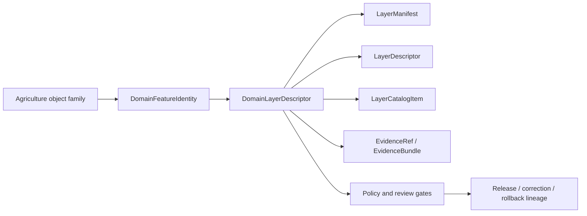

<!-- [KFM_META_BLOCK_V2]
doc_id: kfm://contract/domains/agriculture/domain-layer-descriptor
title: contracts/domains/agriculture/domain_layer_descriptor.md — DomainLayerDescriptor Contract
type: contract
version: v0.2
status: draft
owners: OWNER_TBD — Agriculture steward · Contract steward · Layer steward · UI steward · Evidence steward · Schema steward · Policy steward · Validation steward · Release steward · Docs steward
created: 2026-06-20
updated: 2026-06-20
policy_label: public; contracts; domains; agriculture; domain-layer-descriptor; semantic-contract; layer-boundary
tags: [kfm, contracts, agriculture, domain-layer-descriptor, layer, map, evidence, policy, release, lifecycle, governance]
related:
  - ./README.md
  - ./domain_feature_identity.md
  - ../../../contracts/data/layer_descriptor.md
  - ../../../contracts/data/layer_manifest.md
  - ../../../contracts/data/layer_catalog_item.md
  - ../../../docs/domains/agriculture/OBJECTS.md
  - ../../../docs/domains/agriculture/OBJECT_FAMILIES.md
  - ../../../docs/architecture/ui/LAYERING.md
  - ../../../schemas/contracts/v1/domains/agriculture/domain_layer_descriptor.schema.json
  - ../../../fixtures/domains/agriculture/domain_layer_descriptor/
  - ../../../tools/validators/domains/agriculture/validate_domain_layer_descriptor.py
  - ../../../policy/domains/agriculture/
  - ../../../data/registry/layers/
  - ../../../data/proofs/
  - ../../../release/
notes:
  - "Expanded from a greenfield scaffold into the object-level DomainLayerDescriptor semantic contract."
  - "The paired schema is a greenfield placeholder with only id required and additionalProperties enabled."
  - "The schema-declared validator path was not found in this task."
  - "This Agriculture contract is a domain-specific layer descriptor boundary and must not duplicate the generic LayerDescriptor, LayerManifest, or LayerCatalogItem contracts."
[/KFM_META_BLOCK_V2] -->

<a id="top"></a>

# DomainLayerDescriptor Contract

> Semantic contract for `DomainLayerDescriptor`, the Agriculture-domain descriptor that explains how an Agriculture layer is identified, constrained, and handed to the governed layer stack while preserving Agriculture object-family meaning, evidence, policy, lifecycle, release, and correction boundaries.

<p>
  
  
  
  
  
  
</p>

`contracts/domains/agriculture/domain_layer_descriptor.md`

## Quick jumps

[Status](#status) · [Meaning](#meaning) · [Repo fit](#repo-fit) · [Schema posture](#schema-posture) · [Accepted uses](#accepted-uses) · [Exclusions](#exclusions) · [Recommended fields](#recommended-fields) · [Invariants](#invariants) · [Layer boundary](#layer-boundary) · [Lifecycle](#lifecycle) · [Validation](#validation) · [Evidence basis](#evidence-basis) · [Rollback](#rollback) · [Definition of done](#definition-of-done)

---

## Status

> [!IMPORTANT]
> **Status:** `draft` / semantic contract  
> **Owner:** `OWNER_TBD`  
> **Contract path:** `contracts/domains/agriculture/domain_layer_descriptor.md`  
> **Schema path:** `schemas/contracts/v1/domains/agriculture/domain_layer_descriptor.schema.json`  
> **Truth posture:** `CONFIRMED` target path, current update, paired placeholder schema, Agriculture object-family docs, and UI layering doctrine. Validator behavior, fixtures, policy behavior, layer registry behavior, release integration, API behavior, UI behavior, and tests remain `NEEDS VERIFICATION`.

---

## Meaning

`DomainLayerDescriptor` is the Agriculture-specific layer descriptor boundary.

It describes how an Agriculture layer should carry Agriculture-domain meaning into the governed layer stack. It may bind a layer to Agriculture object families, source roles, support scope, temporal context, sensitivity posture, evidence references, release posture, and correction lineage.

It is narrower than the generic `LayerDescriptor` contract:

- `LayerDescriptor` defines the renderer-facing layer descriptor boundary.
- `LayerManifest` defines the layer-version payload and release trust spine.
- `LayerCatalogItem` defines catalog/list metadata and trust-badge inputs.
- `DomainLayerDescriptor` defines Agriculture-domain meaning and constraints that a layer descriptor must preserve.

It is not a layer payload, not a full renderer descriptor by itself, not a layer manifest, not a catalog item, not proof closure, not policy approval, and not release approval.

---

## Repo fit

```text
contracts/
└── domains/
    └── agriculture/
        ├── README.md
        ├── domain_feature_identity.md
        └── domain_layer_descriptor.md
```

Adjacent roots:

| Root | Relationship |
|---|---|
| `./README.md` | Agriculture semantic-contract directory boundary. |
| `./domain_feature_identity.md` | Agriculture feature identity support. |
| `../../../contracts/data/layer_descriptor.md` | Generic renderer-boundary layer descriptor contract. |
| `../../../contracts/data/layer_manifest.md` | Generic layer-version manifest contract. |
| `../../../contracts/data/layer_catalog_item.md` | Generic catalog/list layer item contract. |
| `../../../docs/architecture/ui/LAYERING.md` | Layering doctrine and layer lifecycle. |
| `../../../docs/domains/agriculture/OBJECTS.md` | Agriculture object-family meanings and identity discipline. |
| `../../../schemas/contracts/v1/domains/agriculture/domain_layer_descriptor.schema.json` | Current placeholder schema. |
| `../../../policy/domains/agriculture/` | Policy root; behavior not verified here. |
| `../../../data/registry/layers/` | Layer registry root; concrete entries not verified here. |
| `../../../data/proofs/` | EvidenceBundle/proof support. |
| `../../../release/` | Release, correction, supersession, and rollback authority. |

---

## Schema posture

The paired schema found in this task is:

```text
schemas/contracts/v1/domains/agriculture/domain_layer_descriptor.schema.json
```

Current schema evidence:

| Schema fact | Status |
|---|---|
| Schema file exists | `CONFIRMED` |
| `$id` is `https://schemas.kfm.local/contracts/v1/domains/agriculture/domain_layer_descriptor.schema.json` | `CONFIRMED` |
| Schema description says greenfield placeholder | `CONFIRMED` |
| Required fields | `id` only |
| `additionalProperties` | `true` |
| Schema metadata points to this contract | `CONFIRMED` |
| Validator path | `UNKNOWN / NOT FOUND` |

---

## Accepted uses

| Use | Allowed? | Rule |
|---|---:|---|
| Binding an Agriculture layer to Agriculture object-family meaning | Yes | Must identify the relevant object family or families. |
| Carrying Agriculture-specific source-role and evidence constraints into a layer descriptor | Yes | Must remain evidence-resolving and policy-aware. |
| Supporting catalog, map, compare, or Focus Mode layer selection | Conditional | Must rely on governed released or review-approved layer context. |
| Linking to generic LayerDescriptor/LayerManifest/LayerCatalogItem | Yes | Must not duplicate those object meanings. |
| Acting as the renderer descriptor by itself | No | Generic `LayerDescriptor` owns the renderer-facing contract. |
| Acting as the layer payload or manifest | No | Generic `LayerManifest` and artifact roots own payload/version manifest. |
| Acting as proof or release approval | No | Evidence and release authority remain separate. |

---

## Exclusions

| Does not belong in `DomainLayerDescriptor` | Correct home |
|---|---|
| Full layer payload | Data lifecycle or released artifact roots. |
| Generic renderer-facing descriptor meaning | `../../../contracts/data/layer_descriptor.md` or accepted layer descriptor home. |
| Layer-version manifest meaning | `../../../contracts/data/layer_manifest.md` or accepted layer manifest home. |
| Catalog/list layer metadata | `../../../contracts/data/layer_catalog_item.md`. |
| Full Agriculture object payload | Object-family contract and data lifecycle roots. |
| Source registry record | `../../../data/registry/sources/`. |
| EvidenceBundle/proof content | `../../../data/proofs/`. |
| JSON Schema shape | `../../../schemas/contracts/v1/domains/agriculture/domain_layer_descriptor.schema.json`. |
| Validator code | `../../../tools/validators/...`. |
| Policy decisions | `../../../policy/...`. |
| Release records | `../../../release/`. |

---

## Recommended fields

The current schema does not require these fields. They are `PROPOSED` semantic requirements for future schema/validator work:

| Field | Meaning |
|---|---|
| `id` | Canonical domain layer descriptor identity. |
| `domain` | Should be `agriculture` for this contract family. |
| `layer_id` | Stable layer family identifier. |
| `agriculture_object_families` | Agriculture object families represented by the layer. |
| `domain_feature_identity_refs` | Links to Agriculture feature identity records where applicable. |
| `layer_descriptor_ref` | Link to generic `LayerDescriptor`. |
| `layer_manifest_ref` | Link to generic `LayerManifest`. |
| `layer_catalog_item_ref` | Link to generic `LayerCatalogItem` where listed. |
| `source_role_summary` | Source-role posture represented by the layer. |
| `evidence_refs` | EvidenceRef/EvidenceBundle links. |
| `support_scope` | Spatial/support scope or generalized display scope. |
| `temporal_scope` | Time coverage or validity posture. |
| `sensitivity_state` | Sensitivity/generalization/review posture. |
| `policy_state` | Policy posture or policy-decision reference. |
| `release_ref` | Release or candidate release linkage. |
| `correction_refs` | Correction/supersession/rollback lineage where applicable. |
| `spec_hash` | Integrity pin for the descriptor representation. |

---

## Invariants

`DomainLayerDescriptor` must preserve these invariants:

- Agriculture layer meaning remains distinct from generic renderer descriptor meaning;
- layer display is downstream of evidence, policy, review, and release posture;
- source roles must stay visible and must not be silently upgraded;
- model outputs, aggregate outputs, and observations must remain distinguishable;
- cited Soil, Hydrology, Atmosphere/Air, Hazards, Land, or other-domain facts remain owned by those domains;
- unresolved EvidenceRefs keep consequential use in `NEEDS VERIFICATION` or fail-closed posture;
- domain layer descriptors must not bypass LayerManifest, LayerDescriptor, LayerCatalogItem, policy, evidence, or release boundaries;
- correction and rollback lineage must remain visible when layer meaning changes.

---

## Layer boundary

`DomainLayerDescriptor` is a domain meaning adapter.

| Boundary | Rule |
|---|---|
| Domain meaning | Agriculture object-family semantics live here. |
| Renderer handoff | Generic `LayerDescriptor` owns renderer-facing semantics. |
| Payload/version | Generic `LayerManifest` owns layer-version payload semantics. |
| Catalog listing | Generic `LayerCatalogItem` owns catalog/list semantics. |
| Evidence | EvidenceBundle/EvidenceRef remains separate. |
| Policy | PolicyDecision/policy roots remain separate. |
| Release | ReleaseManifest/PromotionDecision/rollback records remain separate. |

---

## Lifecycle



The domain descriptor supports the layer stack. It does not replace payload validation, evidence resolution, policy review, release review, or rollback records.

---

## Validation

Before relying on this contract, verify:

- schema fields are expanded beyond scaffold status;
- validator implementation exists and is wired to the accepted schema;
- fixtures cover stable domain layer identity, source-role mismatch, unsupported object family, unresolved evidence, scope mismatch, release mismatch, correction, and rollback cases;
- object-family vocabulary is accepted and linked;
- generic LayerDescriptor/LayerManifest/LayerCatalogItem references resolve where used;
- policy and sensitivity posture are represented and testable;
- release/correction references are validated where used.

---

## Evidence basis

| Source | Status | Supports | Limits |
|---|---|---|---|
| Prior `contracts/domains/agriculture/domain_layer_descriptor.md` scaffold | `CONFIRMED` | Target file existed and named paired schema. | Scaffold did not define authoritative semantics. |
| `schemas/contracts/v1/domains/agriculture/domain_layer_descriptor.schema.json` | `CONFIRMED placeholder` | Schema exists; metadata points to this contract, fixtures, validator, and policy; only `id` is required. | Does not enforce full layer semantics. |
| `docs/architecture/ui/LAYERING.md` | `CONFIRMED doctrine / PROPOSED implementation` | Defines layer as a derived surface, separates meaning/shape/policy/proof/release, and describes LayerDescriptor/LayerManifest/LayerCatalogItem roles. | Some schema homes remain proposed and need ADR/migration review. |
| `docs/domains/agriculture/OBJECTS.md` | `CONFIRMED domain reference / PROPOSED realizations` | Supplies Agriculture object-family context, identity/digest discipline, and source-role cautions. | It is a reference document, not a contract/schema implementation. |
| Uploaded authoring prompt v2 | `CONFIRMED user-supplied guidance` | Requires evidence-grounded, visually polished, implementation-honest Markdown with verification and rollback posture. | Authoring guidance, not implementation proof. |

---

## Rollback

Rollback is required if this contract is used to claim schema completeness, validator coverage, layer-registry behavior, policy enforcement, release behavior, API/UI behavior, or implementation maturity not verified in this task.

Rollback target: prior scaffold content SHA `d04553673f131c1ba0a2514a1eb79427cbab38b7`.

---

## Definition of done

- [ ] Owners are confirmed and `OWNER_TBD` is replaced.
- [ ] Schema fields are defined beyond placeholder status.
- [ ] Validator and fixtures are implemented and verified.
- [ ] Agriculture object-family vocabulary is accepted and linked.
- [ ] Generic LayerDescriptor, LayerManifest, and LayerCatalogItem references are validated.
- [ ] Evidence, policy, lifecycle, release, correction, and rollback references are testable.
- [ ] Downstream docs link to this contract as the accepted Agriculture layer meaning boundary.

---

## Status summary

`DomainLayerDescriptor` is the Agriculture domain meaning boundary for layers. It is not the layer payload, not the full renderer descriptor, not the layer manifest, not a catalog item, not proof closure, not policy approval, not release approval, and not an implementation claim by itself.

<p align="right"><a href="#top">Back to top</a></p>
