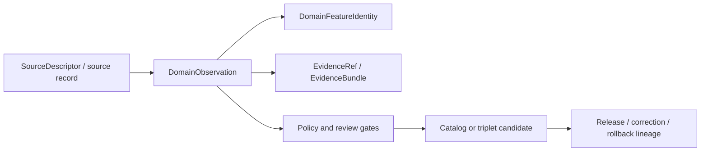

<!-- [KFM_META_BLOCK_V2]
doc_id: kfm://contract/domains/agriculture/domain-observation
title: contracts/domains/agriculture/domain_observation.md — DomainObservation Contract
type: contract
version: v0.2
status: draft
owners: OWNER_TBD — Agriculture steward · Contract steward · Observation steward · Evidence steward · Schema steward · Policy steward · Validation steward · Release steward · Docs steward
created: 2026-06-20
updated: 2026-06-20
policy_label: public; contracts; domains; agriculture; domain-observation; semantic-contract; source-role-aware
tags: [kfm, contracts, agriculture, domain-observation, observation, source-role, temporal-scope, evidence, lifecycle, governance]
related:
  - ./README.md
  - ./domain_feature_identity.md
  - ../../../docs/domains/agriculture/OBJECTS.md
  - ../../../docs/domains/agriculture/OBJECT_FAMILIES.md
  - ../../../schemas/contracts/v1/domains/agriculture/domain_observation.schema.json
  - ../../../fixtures/domains/agriculture/domain_observation/
  - ../../../tools/validators/domains/agriculture/validate_domain_observation.py
  - ../../../policy/domains/agriculture/
  - ../../../data/registry/sources/
  - ../../../data/proofs/
  - ../../../release/
notes:
  - "Expanded from a greenfield scaffold into the object-level DomainObservation semantic contract."
  - "The paired schema is a greenfield placeholder with only id required and additionalProperties enabled."
  - "The schema-declared validator path was not found in this task."
  - "Agriculture OBJECTS.md supplies observation families, source-role requirements, identity basis, time axes, and digest discipline; this contract labels implementation as NEEDS VERIFICATION until schemas, validators, fixtures, and id-derivation code are confirmed."
[/KFM_META_BLOCK_V2] -->

<a id="top"></a>

# DomainObservation Contract

> Semantic contract for `DomainObservation`, the Agriculture observation wrapper that records a crop, yield, practice, rotation, indicator, or related Agriculture observation with source role, support scope, time axes, evidence references, sensitivity/review posture, and lifecycle context intact.

<p>
  
  
  
  
  
  
</p>

`contracts/domains/agriculture/domain_observation.md`

## Quick jumps

[Status](#status) · [Meaning](#meaning) · [Repo fit](#repo-fit) · [Schema posture](#schema-posture) · [Accepted uses](#accepted-uses) · [Exclusions](#exclusions) · [Recommended fields](#recommended-fields) · [Invariants](#invariants) · [Observation families](#observation-families) · [Lifecycle](#lifecycle) · [Validation](#validation) · [Evidence basis](#evidence-basis) · [Rollback](#rollback) · [Definition of done](#definition-of-done)

---

## Status

> [!IMPORTANT]
> **Status:** `draft` / semantic contract  
> **Owner:** `OWNER_TBD`  
> **Contract path:** `contracts/domains/agriculture/domain_observation.md`  
> **Schema path:** `schemas/contracts/v1/domains/agriculture/domain_observation.schema.json`  
> **Truth posture:** `CONFIRMED` target path, current update, paired placeholder schema, Agriculture observation/object-family docs, and uploaded authoring guidance. Validator behavior, fixtures, policy behavior, id-derivation implementation, tests, release behavior, API behavior, and UI behavior remain `NEEDS VERIFICATION`.

---

## Meaning

`DomainObservation` is a semantic wrapper for Agriculture observation-like objects.

It exists to carry the common observation semantics that Agriculture object families share:

- source identity and source role;
- Agriculture object family;
- observed/valid/retrieval/release/correction time context;
- support geometry or support scope;
- normalized digest and `spec_hash` integrity pin;
- evidence references;
- lifecycle and review posture;
- policy and release context where applicable.

It is not a universal claim of truth. It is also not a schema, source record, EvidenceBundle, PolicyDecision, ReleaseManifest, map layer, public API payload, or UI component.

---

## Repo fit

```text
contracts/
└── domains/
    └── agriculture/
        ├── README.md
        ├── domain_feature_identity.md
        └── domain_observation.md
```

Adjacent roots:

| Root | Relationship |
|---|---|
| `./README.md` | Agriculture semantic-contract directory boundary. |
| `./domain_feature_identity.md` | Agriculture feature identity support. |
| `../../../docs/domains/agriculture/OBJECTS.md` | Agriculture observation families, source-role cautions, identity basis, temporal axes, and digest discipline. |
| `../../../docs/domains/agriculture/OBJECT_FAMILIES.md` | Object-family register and placement posture. |
| `../../../schemas/contracts/v1/domains/agriculture/domain_observation.schema.json` | Current placeholder schema. |
| `../../../policy/domains/agriculture/` | Policy root; behavior not verified here. |
| `../../../fixtures/domains/agriculture/domain_observation/` | Fixture root from schema metadata; existence/coverage not verified. |
| `../../../tools/validators/domains/agriculture/validate_domain_observation.py` | Validator path from schema metadata; not found in this task. |
| `../../../data/registry/sources/` | SourceDescriptor/source-role support. |
| `../../../data/proofs/` | EvidenceBundle/proof support. |
| `../../../release/` | Release, correction, supersession, and rollback authority. |

---

## Schema posture

The paired schema found in this task is:

```text
schemas/contracts/v1/domains/agriculture/domain_observation.schema.json
```

Current schema evidence:

| Schema fact | Status |
|---|---|
| Schema file exists | `CONFIRMED` |
| `$id` is `https://schemas.kfm.local/contracts/v1/domains/agriculture/domain_observation.schema.json` | `CONFIRMED` |
| Schema description says greenfield placeholder | `CONFIRMED` |
| Required fields | `id` only |
| `additionalProperties` | `true` |
| Schema metadata points to this contract | `CONFIRMED` |
| Validator path | `UNKNOWN / NOT FOUND` |

---

## Accepted uses

| Use | Allowed? | Rule |
|---|---:|---|
| Carrying common Agriculture observation semantics | Yes | Must preserve object family, source role, time, scope, digest, and evidence posture. |
| Supporting object-family-specific contracts | Yes | DomainObservation may supply shared meaning; object contracts still own their specific payload semantics. |
| Supporting validation, deduplication, or lineage checks | Yes | Must remain deterministic and version-aware. |
| Supporting review and release gates | Conditional | Must not replace PolicyDecision, EvidenceBundle, ReleaseManifest, or steward review. |
| Acting as proof closure | No | EvidenceBundle/proof objects remain separate. |
| Acting as policy approval or release approval | No | Policy and release authority remain separate. |
| Acting as UI/map layer descriptor | No | Layer contracts own layer meaning and rendering boundaries. |

---

## Exclusions

| Does not belong in `DomainObservation` | Correct home |
|---|---|
| Full domain-specific payload semantics | Specific object-family contracts such as `crop_observation.md` or `yield_observation.md`. |
| Source registry record | `../../../data/registry/sources/`. |
| EvidenceBundle/proof content | `../../../data/proofs/`. |
| JSON Schema shape | `../../../schemas/contracts/v1/domains/agriculture/domain_observation.schema.json`. |
| Validator code | `../../../tools/validators/...`. |
| Policy decisions | `../../../policy/...`. |
| Layer descriptor or layer manifest | Layer contracts and layer artifact roots. |
| Release, correction, supersession, rollback records | `../../../release/` and related contract families. |
| API/UI implementation | Governed app/API/UI roots. |

---

## Recommended fields

The current schema does not require these fields. They are `PROPOSED` semantic requirements for future schema/validator work:

| Field | Meaning |
|---|---|
| `id` | Canonical observation identity. |
| `object_family` | Agriculture object family represented by the observation. |
| `observation_kind` | Observation, observation candidate, derived observation, aggregate observation, or derived indicator. |
| `source_id` | SourceDescriptor/source identity. |
| `source_role` | Authority, observation, context, model, aggregate, or accepted source-role vocabulary value. |
| `domain_feature_identity_ref` | Link to `DomainFeatureIdentity` where used. |
| `support_geometry_ref` | Reference to spatial/support scope. |
| `temporal_scope` | Observed, valid, retrieval, release, or correction time context where material. |
| `normalized_digest` | Canonical digest of the observed representation. |
| `spec_hash` | KFM integrity pin for this observation representation. |
| `evidence_refs` | EvidenceRef/EvidenceBundle links. |
| `sensitivity_state` | Sensitivity/generalization/review posture. |
| `policy_state` | Policy posture or policy-decision reference. |
| `lifecycle_state` | RAW/WORK/QUARANTINE/PROCESSED/CATALOG/TRIPLET/PUBLISHED posture where used. |
| `release_ref` | Release or candidate release linkage where applicable. |
| `correction_refs` | Correction/supersession/rollback lineage where applicable. |

---

## Invariants

`DomainObservation` must preserve these invariants:

- source role must remain visible and must not be silently upgraded;
- observed, valid, retrieval, release, and correction time must remain distinct where material;
- support geometry or support scope must be explicit where material;
- modeled, aggregate, candidate, and observed records must remain distinguishable;
- a domain observation does not prove itself true;
- schema validity is not evidence proof;
- policy approval and release approval remain separate authority surfaces;
- cited Soil, Hydrology, Atmosphere/Air, Hazards, Land, or other-domain facts remain owned by those domains;
- unresolved evidence or source references keep consequential use in `NEEDS VERIFICATION` or fail-closed posture;
- correction and rollback lineage must remain visible when observation meaning changes.

---

## Observation families

Agriculture `OBJECTS.md` identifies several observation-like families that this shared contract may support:

| Family | Observation posture |
|---|---|
| `CropObservation` | Observation family for crop presence, stage, or condition. |
| `FieldCandidate` | Candidate observation; not a confirmed field feature by itself. |
| `CropRotation` | Derived observation from a multi-year crop sequence. |
| `YieldObservation` | Yield value over support scope and crop period. |
| `ConservationPractice` | Documented or modeled practice observation. |
| `AgriculturalEconomyObservation` | Aggregate economic observation. |
| `DroughtStressIndicator` | Derived indicator. |
| `PestStressIndicator` | Derived indicator. |

Other Agriculture object families may cite observations but are not necessarily observations themselves.

---

## Lifecycle



The observation supports traceability and review. It does not replace evidence resolution, policy review, release review, or rollback records.

---

## Validation

Before relying on this contract, verify:

- schema fields are expanded beyond scaffold status;
- validator implementation exists and is wired to the accepted schema;
- fixtures cover stable observation identity, source-role mismatch, unsupported object family, unresolved evidence, temporal-axis mismatch, scope mismatch, lifecycle transition, correction, and rollback cases;
- object-family enum or registry is accepted;
- source-role vocabulary is accepted and enforced;
- temporal fields map to accepted KFM time-kind vocabulary;
- evidence references resolve where consequential;
- policy/release/correction references are validated where used.

---

## Evidence basis

| Source | Status | Supports | Limits |
|---|---|---|---|
| Prior `contracts/domains/agriculture/domain_observation.md` scaffold | `CONFIRMED` | Target file existed and named paired schema. | Scaffold did not define authoritative semantics. |
| `schemas/contracts/v1/domains/agriculture/domain_observation.schema.json` | `CONFIRMED placeholder` | Schema exists; metadata points to this contract, fixtures, validator, and policy; only `id` is required. | Does not enforce full observation semantics. |
| `docs/domains/agriculture/OBJECTS.md` | `CONFIRMED domain reference / PROPOSED realizations` | Supplies Agriculture object-family catalog, source-role cautions, observation-family purposes, identity basis, temporal axes, and digest discipline. | It is a reference document, not a contract/schema implementation. |
| `docs/domains/agriculture/OBJECT_FAMILIES.md` | `CONFIRMED domain register / PROPOSED placement` | Names Agriculture object families and placement posture. | Concrete contracts/schemas/tests remain verification-bound. |
| Uploaded authoring prompt v2 | `CONFIRMED user-supplied guidance` | Requires evidence-grounded, visually polished, implementation-honest Markdown with verification and rollback posture. | Authoring guidance, not implementation proof. |

---

## Rollback

Rollback is required if this contract is used to claim schema completeness, validator coverage, id-derivation implementation, policy enforcement, release behavior, API/UI behavior, or implementation maturity not verified in this task.

Rollback target: prior scaffold content SHA `1a4777501dc58e80cf6ba7d13c7f1bae03adbf4c`.

---

## Definition of done

- [ ] Owners are confirmed and `OWNER_TBD` is replaced.
- [ ] Schema fields are defined beyond placeholder status.
- [ ] Validator and fixtures are implemented and verified.
- [ ] Object-family and source-role vocabularies are accepted and linked.
- [ ] Observation identity and temporal rules are implemented and tested.
- [ ] Evidence, policy, lifecycle, release, correction, and rollback references are testable.
- [ ] Downstream docs link to this contract as the accepted Agriculture observation boundary.

---

## Status summary

`DomainObservation` is an Agriculture semantic observation wrapper. It is not a schema, not source truth, not proof closure, not policy approval, not release approval, not a layer descriptor, and not an implementation claim by itself.

<p align="right"><a href="#top">Back to top</a></p>
