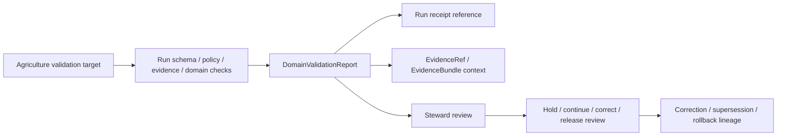

<!-- [KFM_META_BLOCK_V2]
doc_id: kfm://contract/domains/agriculture/domain-validation-report
title: contracts/domains/agriculture/domain_validation_report.md — DomainValidationReport Contract
type: contract
version: v0.2
status: draft
owners: OWNER_TBD — Agriculture steward · Contract steward · Validation steward · Evidence steward · Schema steward · Policy steward · Release steward · Docs steward
created: 2026-06-20
updated: 2026-06-20
policy_label: public; contracts; domains; agriculture; domain-validation-report; semantic-contract; validation; source-role-aware
tags: [kfm, contracts, agriculture, domain-validation-report, validation, evidence, policy, lifecycle, release, rollback, governance]
related:
  - ./README.md
  - ./domain_observation.md
  - ./domain_feature_identity.md
  - ./aggregation-receipt.md
  - ../../../contracts/data/validation_report.md
  - ../../../docs/domains/agriculture/OBJECTS.md
  - ../../../docs/domains/agriculture/OBJECT_FAMILIES.md
  - ../../../docs/adr/ADR-0011-receipts-vs-proofs-vs-manifests-vs-catalog-separation.md
  - ../../../schemas/contracts/v1/domains/agriculture/domain_validation_report.schema.json
  - ../../../fixtures/domains/agriculture/domain_validation_report/
  - ../../../tools/validators/domains/agriculture/validate_domain_validation_report.py
  - ../../../policy/domains/agriculture/
  - ../../../data/receipts/
  - ../../../data/proofs/
  - ../../../release/
notes:
  - "Expanded from a greenfield scaffold into the object-level DomainValidationReport semantic contract."
  - "The paired schema is a greenfield placeholder with only id required and additionalProperties enabled."
  - "The schema-declared validator path was not found in this task."
  - "This Agriculture contract is a domain-specific validation-report wrapper and must not duplicate the generic ValidationReport contract or collapse validation into proof, policy, catalog, or release authority."
[/KFM_META_BLOCK_V2] -->

<a id="top"></a>

# DomainValidationReport Contract

> Semantic contract for `DomainValidationReport`, the Agriculture-domain validation report that records whether an Agriculture object, layer, receipt, or release candidate satisfied Agriculture-specific source-role, identity, time, support-scope, evidence, sensitivity, and lifecycle checks.

<p>
  
  
  
  
  
  
</p>

`contracts/domains/agriculture/domain_validation_report.md`

## Quick jumps

[Status](#status) · [Meaning](#meaning) · [Repo fit](#repo-fit) · [Schema posture](#schema-posture) · [Accepted uses](#accepted-uses) · [Exclusions](#exclusions) · [Recommended fields](#recommended-fields) · [Invariants](#invariants) · [Agriculture validation checks](#agriculture-validation-checks) · [Lifecycle](#lifecycle) · [Validation](#validation) · [Evidence basis](#evidence-basis) · [Rollback](#rollback) · [Definition of done](#definition-of-done)

---

## Status

> [!IMPORTANT]
> **Status:** `draft` / semantic contract  
> **Owner:** `OWNER_TBD`  
> **Contract path:** `contracts/domains/agriculture/domain_validation_report.md`  
> **Schema path:** `schemas/contracts/v1/domains/agriculture/domain_validation_report.schema.json`  
> **Truth posture:** `CONFIRMED` target path, current update, paired placeholder schema, generic ValidationReport semantics, Agriculture object-family docs, ADR-0011 separation doctrine, and uploaded authoring guidance. Validator behavior, fixtures, policy behavior, proof integration, release integration, API behavior, UI behavior, and tests remain `NEEDS VERIFICATION`.

---

## Meaning

`DomainValidationReport` is the Agriculture-specific wrapper for validation findings.

It records the outcome of checks that are meaningful to Agriculture domain objects and layers, including:

- source-role discipline;
- object-family membership;
- deterministic identity inputs;
- time-axis separation;
- support scope and geometry posture;
- evidence reference resolution;
- policy/review implications;
- release/correction/rollback impact.

It is narrower than the generic `ValidationReport` contract. The generic contract defines validation-report meaning across KFM; this contract defines Agriculture-specific checks and review context.

It is not proof closure by itself, not a process receipt by itself, not a catalog record, not policy approval, not release approval, and not source truth.

---

## Repo fit

```text
contracts/
└── domains/
    └── agriculture/
        ├── README.md
        ├── domain_observation.md
        ├── domain_feature_identity.md
        ├── aggregation-receipt.md
        └── domain_validation_report.md
```

Adjacent roots:

| Root | Relationship |
|---|---|
| `./README.md` | Agriculture semantic-contract directory boundary. |
| `./domain_observation.md` | Observation wrapper that may be validation target. |
| `./domain_feature_identity.md` | Identity carrier that may be validation target. |
| `./aggregation-receipt.md` | Agriculture aggregation receipt that may be validation target or support. |
| `../../../contracts/data/validation_report.md` | Generic ValidationReport contract. |
| `../../../docs/domains/agriculture/OBJECTS.md` | Agriculture object-family meanings, source-role cautions, identity basis, time axes, and digest discipline. |
| `../../../docs/domains/agriculture/OBJECT_FAMILIES.md` | Object-family register and placement posture. |
| `../../../schemas/contracts/v1/domains/agriculture/domain_validation_report.schema.json` | Current placeholder schema. |
| `../../../policy/domains/agriculture/` | Policy root; behavior not verified here. |
| `../../../fixtures/domains/agriculture/domain_validation_report/` | Fixture root from schema metadata; existence/coverage not verified. |
| `../../../tools/validators/domains/agriculture/validate_domain_validation_report.py` | Validator path from schema metadata; not found in this task. |
| `../../../data/receipts/` | Process memory; distinct from validation report findings. |
| `../../../data/proofs/` | EvidenceBundle/proof support. |
| `../../../release/` | Release, correction, supersession, and rollback authority. |

---

## Schema posture

The paired schema found in this task is:

```text
schemas/contracts/v1/domains/agriculture/domain_validation_report.schema.json
```

Current schema evidence:

| Schema fact | Status |
|---|---|
| Schema file exists | `CONFIRMED` |
| `$id` is `https://schemas.kfm.local/contracts/v1/domains/agriculture/domain_validation_report.schema.json` | `CONFIRMED` |
| Schema description says greenfield placeholder | `CONFIRMED` |
| Required fields | `id` only |
| `additionalProperties` | `true` |
| Schema metadata points to this contract | `CONFIRMED` |
| Validator path | `UNKNOWN / NOT FOUND` |

---

## Accepted uses

| Use | Allowed? | Rule |
|---|---:|---|
| Recording Agriculture-specific validation findings | Yes | Must identify target, rule/check, inputs, outcome, and finding severity where available. |
| Supporting review of Agriculture object-family contracts | Yes | Must preserve object family, source role, time, scope, and evidence context. |
| Supporting proof or release review | Conditional | Must link proof/release context; report alone is not proof or release. |
| Supporting correction, supersession, or rollback | Yes | Must identify affected objects and changed findings. |
| Acting as process receipt | No | Run/process receipt belongs to receipt roots. |
| Acting as EvidenceBundle | No | EvidenceBundle/proof support remains separate. |
| Acting as PolicyDecision or ReleaseManifest | No | Policy and release authority remain separate. |
| Acting as source truth | No | Validation records findings; it does not make a target true. |

---

## Exclusions

| Does not belong in `DomainValidationReport` | Correct home |
|---|---|
| Full Agriculture object payload | Object-family contract and data lifecycle roots. |
| Full validation run log or process receipt | `../../../data/receipts/` or accepted receipt root. |
| EvidenceBundle/proof content | `../../../data/proofs/`. |
| JSON Schema shape | `../../../schemas/contracts/v1/domains/agriculture/domain_validation_report.schema.json`. |
| Validator code | `../../../tools/validators/...`. |
| Policy decision | `../../../policy/...`. |
| Release, correction, supersession, rollback records | `../../../release/` and related contract families. |
| API/UI implementation | Governed app/API/UI roots. |

---

## Recommended fields

The current schema does not require these fields. They are `PROPOSED` semantic requirements for future schema/validator work:

| Field | Meaning |
|---|---|
| `id` | Canonical domain validation report identity. |
| `target_ref` | Agriculture object, layer, receipt, or release candidate being checked. |
| `target_type` | Target type such as `DomainObservation`, `DomainFeatureIdentity`, `AggregationReceipt`, or `DomainLayerDescriptor`. |
| `object_family` | Agriculture object family involved where relevant. |
| `rule_set_ref` | Agriculture validator, schema, policy profile, or rule bundle used. |
| `validator_ref` | Validator identity and version. |
| `input_hashes` | Digests of validated target/input objects. |
| `spec_hash` | Integrity pin for the report itself. |
| `evidence_refs` | EvidenceRef/EvidenceBundle links involved in findings. |
| `findings` | Structured pass/warn/fail/abstain/error/review-needed findings. |
| `overall_outcome` | PASS, WARN, FAIL, ABSTAIN, ERROR, REVIEW_REQUIRED, or equivalent accepted enum. |
| `source_role_findings` | Findings about source-role mismatch or collapse risk. |
| `temporal_findings` | Findings about time-axis confusion or missing time context. |
| `scope_findings` | Findings about support geometry/scope mismatch. |
| `policy_implications` | Policy impact notes, not policy approval. |
| `review_state` | Steward review posture. |
| `release_ref` | Release candidate or ReleaseManifest linkage where applicable. |
| `correction_refs` | Correction/supersession/rollback linkage. |

---

## Invariants

`DomainValidationReport` must preserve these invariants:

- validation findings do not make the target true;
- schema validation proves shape, not source truth;
- validation success is not policy approval;
- policy approval is not release approval;
- release approval is not proof closure;
- validation reports remain distinct from process receipts;
- every consequential finding must identify target, rule/spec, input version or digest, and outcome;
- missing evidence, source-role gaps, rights gaps, sensitivity gaps, or unresolved references must remain visible;
- Agriculture model, aggregate, candidate, and observation records must remain distinguishable;
- cited facts from other domains remain owned by those domains;
- changed validation findings after release require correction, supersession, withdrawal, or rollback linkage where material.

---

## Agriculture validation checks

The following check families are `PROPOSED` until schema/validator implementation is verified:

| Check family | What it verifies |
|---|---|
| `object_family_check` | Target object belongs to an accepted Agriculture object family. |
| `source_role_check` | Source role is present and not silently upgraded. |
| `identity_check` | Deterministic identity inputs are present and stable. |
| `temporal_scope_check` | Required time axes are present and not collapsed. |
| `support_scope_check` | Support geometry/scope is explicit where material. |
| `evidence_resolution_check` | EvidenceRef/EvidenceBundle references resolve where consequential. |
| `policy_context_check` | Policy implications are recorded without becoming policy approval. |
| `release_context_check` | Release linkage is present where relevant without becoming release approval. |
| `correction_lineage_check` | Correction/supersession/rollback references are present where needed. |

---

## Lifecycle



The report supports review. It does not replace run receipts, evidence resolution, policy decisions, release decisions, or rollback records.

---

## Validation

Before relying on this contract, verify:

- schema fields are expanded beyond scaffold status;
- validator implementation exists and is wired to the accepted schema;
- fixtures cover PASS, WARN, FAIL, ABSTAIN, ERROR, REVIEW_REQUIRED, corrected, superseded, and rollback cases;
- Agriculture object-family enum or registry is accepted;
- source-role vocabulary is accepted and enforced;
- temporal fields map to accepted KFM time-kind vocabulary;
- evidence references resolve where consequential;
- policy/release/correction references are validated where used;
- process receipts remain separate from validation reports.

---

## Evidence basis

| Source | Status | Supports | Limits |
|---|---|---|---|
| Prior `contracts/domains/agriculture/domain_validation_report.md` scaffold | `CONFIRMED` | Target file existed and named paired schema. | Scaffold did not define authoritative semantics. |
| `schemas/contracts/v1/domains/agriculture/domain_validation_report.schema.json` | `CONFIRMED placeholder` | Schema exists; metadata points to this contract, fixtures, validator, and policy; only `id` is required. | Does not enforce full validation-report semantics. |
| `contracts/data/validation_report.md` | `CONFIRMED generic contract` | Defines validation-report meaning and separation from receipt, proof, policy, catalog, and release authority. | Generic contract does not encode Agriculture-specific checks. |
| `docs/domains/agriculture/OBJECTS.md` | `CONFIRMED domain reference / PROPOSED realizations` | Supplies Agriculture object-family catalog, source-role cautions, identity basis, temporal axes, and digest discipline. | It is a reference document, not a contract/schema implementation. |
| `docs/adr/ADR-0011-receipts-vs-proofs-vs-manifests-vs-catalog-separation.md` | `PROPOSED ADR / CONFIRMED text` | States inspectable-claim posture and separation of receipts, proofs, catalog, and publication families. | ADR is proposed and does not prove implementation. |
| Uploaded authoring prompt v2 | `CONFIRMED user-supplied guidance` | Requires evidence-grounded, visually polished, implementation-honest Markdown with verification and rollback posture. | Authoring guidance, not implementation proof. |

---

## Rollback

Rollback is required if this contract is used to claim schema completeness, validator coverage, policy enforcement, proof closure, release behavior, API/UI behavior, or implementation maturity not verified in this task.

Rollback target: prior scaffold content SHA `5b56a6c58846297c318b56d59af58f2ee00961fe`.

---

## Definition of done

- [ ] Owners are confirmed and `OWNER_TBD` is replaced.
- [ ] Schema fields are defined beyond placeholder status.
- [ ] Validator and fixtures are implemented and verified.
- [ ] Agriculture object-family and source-role vocabularies are accepted and linked.
- [ ] Validation outcomes are finite and policy-aware.
- [ ] Run receipts, EvidenceBundle/proof support, policy decisions, release decisions, and validation reports remain separate object families.
- [ ] Evidence, policy, lifecycle, release, correction, and rollback references are testable.
- [ ] Downstream docs link to this contract as the accepted Agriculture validation-report boundary.

---

## Status summary

`DomainValidationReport` is an Agriculture semantic validation-report wrapper. It is not a process receipt, not source truth, not proof closure, not policy approval, not release approval, and not an implementation claim by itself.

<p align="right"><a href="#top">Back to top</a></p>
