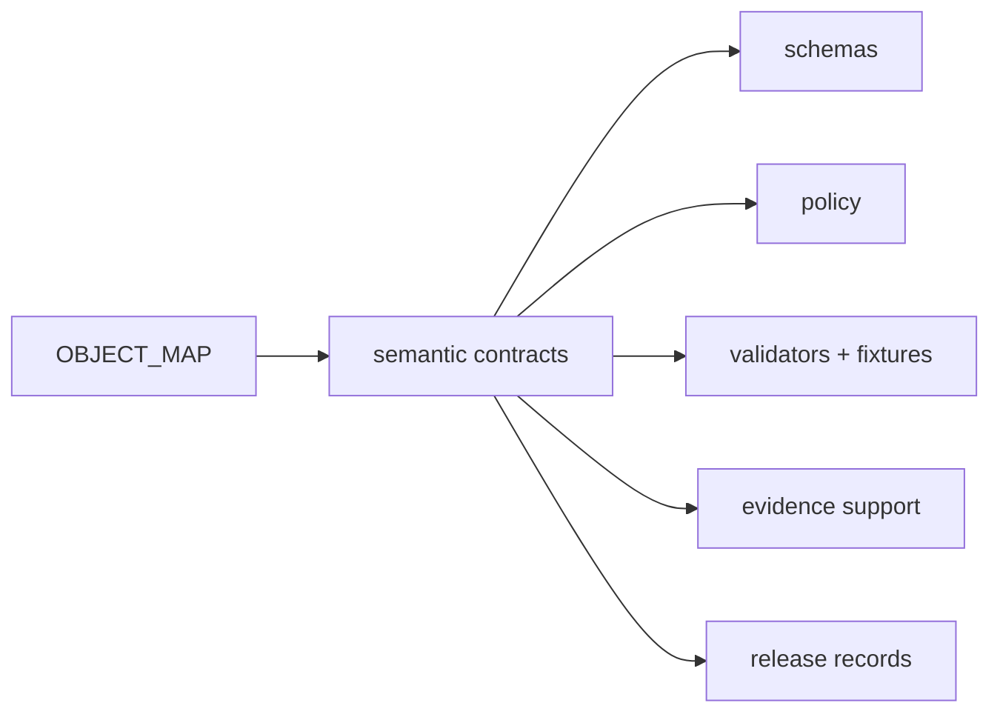

<!-- [KFM_META_BLOCK_V2]
doc_id: kfm://contract/domains/archaeology/object-map
title: contracts/domains/archaeology/OBJECT_MAP.md — Archaeology Object Map
type: contract-map
version: v0.2
status: draft
owners: OWNER_TBD — Archaeology steward · Contract steward · Schema steward · Policy steward · Evidence steward · Validation steward · Release steward · Docs steward
created: 2026-06-20
updated: 2026-06-20
policy_label: public; contracts; domains; archaeology; object-map; semantic-contracts
tags: [kfm, contracts, archaeology, object-map, schemas, policy, evidence, lifecycle, governance]
related:
  - ./README.md
  - ../../../docs/domains/archaeology/MISSING_OR_PLANNED_FILES.md
  - ../../../docs/domains/archaeology/CANONICAL_PATHS.md
  - ../../../docs/domains/archaeology/ARCHITECTURE.md
  - ../../../schemas/contracts/v1/domains/archaeology/
  - ../../../policy/sensitivity/archaeology/
  - ../../../tests/domains/archaeology/
  - ../../../fixtures/domains/archaeology/
  - ../../../data/proofs/
  - ../../../release/
notes:
  - "Expanded from a planned-file scaffold into a compact Archaeology object-family map."
  - "This map is navigation and verification support, not proof of implementation."
  - "Contracts define meaning; schemas define shape; policy, tests, fixtures, evidence, and release records remain separate roots."
[/KFM_META_BLOCK_V2] -->

# Archaeology Object Map

> Map of Archaeology and Cultural Heritage object families to expected contract and schema homes. This file is a governance aid, not implementation proof.

  
  
  
  
  

`contracts/domains/archaeology/OBJECT_MAP.md`

## Status

> [!IMPORTANT]
> **Status:** `draft` / object map  
> **Owner:** `OWNER_TBD`  
> **Truth posture:** `CONFIRMED` current path and current update. The archaeology planning ledger expected this file as an object-family map. Contract files, schemas, validators, fixtures, policy behavior, release behavior, API behavior, and UI behavior remain `NEEDS VERIFICATION` unless separately inspected.

## Scope

This file maps expected Archaeology object families to:

- semantic contract paths;
- schema paths;
- verification status;
- cross-cutting dependencies.

It does not define object fields, policy rules, validator behavior, fixture content, source records, data payloads, evidence bundles, release decisions, API payloads, or UI behavior.

## Map rules

- Contract files define meaning.
- Schema files define shape.
- Policy roots decide admissibility.
- Validators and fixtures prove enforceability.
- Evidence roots carry support.
- Release roots carry release/correction/rollback records.
- Candidate and confirmed object families must remain distinct.
- All rows remain `NEEDS VERIFICATION` until direct file inventory confirms them.

## Object family map

| Object family | Expected contract | Expected schema | Status |
|---|---|---|---|
| `ArchaeologicalSite` | `archaeological_site.md` | `archaeological_site.schema.json` | `NEEDS VERIFICATION` |
| `SiteComponent` | `site_component.md` | `site_component.schema.json` | `NEEDS VERIFICATION` |
| `CulturalTemporalPeriod` | `cultural_temporal_period.md` | `cultural_temporal_period.schema.json` | `NEEDS VERIFICATION` |
| `SurveyProject` | `survey_project.md` | `survey_project.schema.json` | `NEEDS VERIFICATION` |
| `SurveyTransect` | `survey_transect.md` | `survey_transect.schema.json` | `NEEDS VERIFICATION` |
| `ShovelTest` | `shovel_test.md` | `shovel_test.schema.json` | `NEEDS VERIFICATION` |
| `TestUnit` | `test_unit.md` | `test_unit.schema.json` | `NEEDS VERIFICATION` |
| `ExcavationUnit` | `excavation_unit.md` | `excavation_unit.schema.json` | `NEEDS VERIFICATION` |
| `ProvenienceContext` | `provenience_context.md` | `provenience_context.schema.json` | `NEEDS VERIFICATION` |
| `StratigraphicUnit` | `stratigraphic_unit.md` | `stratigraphic_unit.schema.json` | `NEEDS VERIFICATION` |
| `ArtifactRecord` | `artifact_record.md` | `artifact_record.schema.json` | `NEEDS VERIFICATION` |
| `Sample` | `sample.md` | `sample.schema.json` | `NEEDS VERIFICATION` |
| `CollectionRepositoryRecord` | `collection_repository_record.md` | `collection_repository_record.schema.json` | `NEEDS VERIFICATION` |
| `CandidateFeature` | `candidate_feature.md` | `candidate_feature.schema.json` | `NEEDS VERIFICATION` |
| `RemoteSensingAnomaly` | `remote_sensing_anomaly.md` | `remote_sensing_anomaly.schema.json` | `NEEDS VERIFICATION` |
| `LiDARCandidate` | `lidar_candidate.md` | `lidar_candidate.schema.json` | `NEEDS VERIFICATION` |
| `GeophysicsObservation` | `geophysics_observation.md` | `geophysics_observation.schema.json` | `NEEDS VERIFICATION` |
| `ThreeDDocumentation` | `three_d_documentation.md` | `three_d_documentation.schema.json` | `NEEDS VERIFICATION` |
| `CulturalReview` | `cultural_review.md` | `cultural_review.schema.json` | `NEEDS VERIFICATION` |
| `StewardReview` | `steward_review.md` | `steward_review.schema.json` | `NEEDS VERIFICATION` |
| `ChronologyAssertion` | `chronology_assertion.md` | `chronology_assertion.schema.json` | `NEEDS VERIFICATION` |
| `SensitivityTransform` | `sensitivity_transform.md` | `sensitivity_transform.schema.json` | `NEEDS VERIFICATION` |
| `PublicationTransformReceipt` | `publication_transform_receipt.md` | `publication_transform_receipt.schema.json` | `NEEDS VERIFICATION` |

## Lineage and naming reconciliation

Archaeology docs preserve overlapping object-family vocabularies. Some terms may map to the decomposed object families above rather than remain separate contracts.

| Corpus term | Likely mapping | Status |
|---|---|---|
| `Survey` | `SurveyProject` / `SurveyTransect` | `CONFLICTED / NEEDS VERIFICATION` |
| `Artifact` | `ArtifactRecord` | `CONFLICTED / NEEDS VERIFICATION` |
| `Feature` | `SiteComponent` / `CandidateFeature` | `CONFLICTED / NEEDS VERIFICATION` |
| `Context` | `ProvenienceContext` / `StratigraphicUnit` | `CONFLICTED / NEEDS VERIFICATION` |
| `CollectionAccession` | `CollectionRepositoryRecord` | `CONFLICTED / NEEDS VERIFICATION` |

## Cross-cutting dependencies

| Dependency | Expected owner | Archaeology use |
|---|---|---|
| `EvidenceBundle` | Proof/evidence family | Claim support. |
| `PolicyDecision` | Policy/governance family | Admissibility decision. |
| `ReviewRecord` | Governance/review family | Steward or cultural review record. |
| `MapReleaseManifest` | Release/layer family | Governed map release record. |
| `RollbackCard` | Release/rollback family | Rollback target. |
| `CorrectionNotice` | Correction/release family | Correction lineage. |

## Lifecycle boundary

The object map helps maintainers navigate expected objects. It does not replace object contracts, schemas, policy, evidence, validation, review, release, or rollback records.

## Validation

Before relying on this map, verify:

- full `contracts/domains/archaeology/` inventory;
- full `schemas/contracts/v1/domains/archaeology/` inventory;
- accepted object-family spine and casing;
- whether lineage terms remain separate contracts or map to decomposed contracts;
- policy and review gate locations;
- validator and fixture coverage;
- EvidenceBundle and SourceDescriptor requirements;
- release, correction, and rollback dependencies.

## Evidence basis

| Source | Status | Supports | Limits |
|---|---|---|---|
| Prior `contracts/domains/archaeology/OBJECT_MAP.md` scaffold | `CONFIRMED` | Target file existed as a planned-file scaffold. | Did not contain authoritative object map content. |
| `docs/domains/archaeology/MISSING_OR_PLANNED_FILES.md` | `CONFIRMED planning ledger` | Names this file as planned and lists expected object contracts, schemas, policies, tests, fixtures, and cross-cutting objects. | Planning ledger is not implementation proof. |
| `docs/domains/archaeology/CANONICAL_PATHS.md` | `CONFIRMED path doctrine / PROPOSED path realizations` | Reconciles archaeology contract/schema path form to `contracts/domains/archaeology/` and `schemas/contracts/v1/domains/archaeology/`. | Does not prove all paths exist. |
| `docs/domains/archaeology/ARCHITECTURE.md` | `CONFIRMED doctrine / PROPOSED implementation` | Supplies archaeology object-family lists and candidate/confirmed distinction. | Object-family realization remains open. |
| Uploaded authoring prompt v2 | `CONFIRMED user-supplied guidance` | Requires evidence-grounded, implementation-honest Markdown with verification and rollback posture. | Authoring guidance, not implementation proof. |

## Rollback

Rollback is required if this object map is used to claim object-level contract completeness, schema completeness, validator coverage, policy enforcement, release execution, API/UI behavior, or full directory inventory not verified in this task.

Rollback target: prior scaffold content SHA `70a7d756608b8f4663e1d7ccde37b64d5b16743b`.

## Definition of done

- [ ] Owners are confirmed and `OWNER_TBD` is replaced.
- [ ] Full contract inventory is generated.
- [ ] Full schema inventory is generated.
- [ ] Object-family naming and casing conflicts are resolved or explicitly preserved with ADR links.
- [ ] Every row links to an existing contract or is marked absent/planned.
- [ ] Every row links to an existing schema or is marked absent/planned.
- [ ] Policy/review gate references are verified.
- [ ] Validator and fixture coverage is verified.
- [ ] Cross-cutting object ownership is confirmed.

## Status summary

`OBJECT_MAP.md` is a navigation and governance map for Archaeology object families. It is not a schema index, not a policy file, not a validator inventory, not evidence proof, not review approval, not release approval, and not implementation proof.

<a href="#top">Back to top</a>

