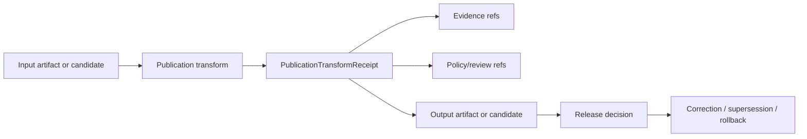

<!-- [KFM_META_BLOCK_V2]
doc_id: kfm://contract/domains/archaeology/publication-transform-receipt
title: contracts/domains/archaeology/PublicationTransformReceipt.md — PublicationTransformReceipt Contract
type: contract
version: v0.2
status: draft
owners: OWNER_TBD — Archaeology steward · Contract steward · Receipt steward · Evidence steward · Schema steward · Policy steward · Validation steward · Release steward · Docs steward
created: 2026-06-20
updated: 2026-06-20
policy_label: public; contracts; domains; archaeology; publication-transform-receipt; semantic-contract; receipt
related:
  - ./README.md
  - ./OBJECT_MAP.md
  - ./publication_transform_receipt.md
  - ../../../docs/domains/archaeology/CONTINUITY_INVENTORY.md
  - ../../../docs/domains/archaeology/MISSING_OR_PLANNED_FILES.md
  - ../../../docs/domains/archaeology/CANONICAL_PATHS.md
  - ../../../docs/adr/ADR-0011-receipts-vs-proofs-vs-manifests-vs-catalog-separation.md
  - ../../../schemas/contracts/v1/domains/archaeology/publication_transform_receipt.schema.json
  - ../../../policy/sensitivity/archaeology/
  - ../../../data/receipts/
  - ../../../data/proofs/
  - ../../../release/
tags: [kfm, contracts, archaeology, publication-transform-receipt, receipt, publication, transform, evidence, policy, release, rollback]
notes:
  - "Expanded from a continuity-inventory scaffold into a bounded semantic contract."
  - "CONFLICTED / NEEDS VERIFICATION: requested path is CamelCase PublicationTransformReceipt.md; the paired schema and newer planned-file scaffold use lowercase publication_transform_receipt.md."
  - "The paired schema is a PROPOSED scaffold with empty properties and additionalProperties enabled."
  - "No validator implementation was found in this task."
[/KFM_META_BLOCK_V2] -->

<a id="top"></a>

# PublicationTransformReceipt Contract

> Semantic contract for `PublicationTransformReceipt`, the Archaeology-domain receipt that records a publication-time transform, its inputs, review/policy context, output relationship, and rollback lineage. This contract records process memory and review support; it is not proof, catalog truth, policy approval, or release approval by itself.

<p>
  
  
  
  
  
  
</p>

`contracts/domains/archaeology/PublicationTransformReceipt.md`

## Quick jumps

[Status](#status) · [Meaning](#meaning) · [Path posture](#path-posture) · [Repo fit](#repo-fit) · [Schema posture](#schema-posture) · [Accepted uses](#accepted-uses) · [Exclusions](#exclusions) · [Recommended fields](#recommended-fields) · [Invariants](#invariants) · [Lifecycle](#lifecycle) · [Validation](#validation) · [Evidence basis](#evidence-basis) · [Rollback](#rollback) · [Definition of done](#definition-of-done)

---

## Status

> [!IMPORTANT]
> **Status:** `draft` / semantic contract  
> **Owner:** `OWNER_TBD`  
> **Contract path:** `contracts/domains/archaeology/PublicationTransformReceipt.md`  
> **Truth posture:** `CONFIRMED` target path, current update, source scaffold, lowercase sibling scaffold, paired scaffold schema, planned-file ledger, canonical-path guidance, and ADR-0011 receipt/proof/catalog/publication separation. Canonical casing, validator behavior, fixtures, policy behavior, release integration, API behavior, UI behavior, and tests remain `NEEDS VERIFICATION`.

---

## Meaning

`PublicationTransformReceipt` records a publication-time transformation for an Archaeology surface or artifact.

It may document:

- the input artifact, candidate, or layer reference;
- the transformation method or profile;
- the policy/review context that required or allowed the transform;
- the output artifact or release-candidate reference;
- the evidence and source references that must stay attached;
- the correction, supersession, and rollback lineage.

This is a receipt. It records that a governed transformation step occurred. It does not prove the underlying archaeological claim, does not approve release, and does not replace EvidenceBundle, PolicyDecision, ReviewRecord, MapReleaseManifest, CorrectionNotice, or RollbackCard.

---

## Path posture

The requested path is:

```text
contracts/domains/archaeology/PublicationTransformReceipt.md
```

Current repo evidence also includes a lowercase sibling scaffold and schema metadata pointing to the lowercase path:

```text
contracts/domains/archaeology/publication_transform_receipt.md
schemas/contracts/v1/domains/archaeology/publication_transform_receipt.schema.json
```

| Path | Status | Notes |
|---|---|---|
| `PublicationTransformReceipt.md` | `CONFIRMED` requested target | Existing scaffold sourced from `CONTINUITY_INVENTORY.md`. |
| `publication_transform_receipt.md` | `CONFIRMED` sibling scaffold | Existing scaffold sourced from `CANONICAL_PATHS.md`. |
| `publication_transform_receipt.schema.json` | `CONFIRMED scaffold` | Schema metadata points to lowercase contract path. |
| Canonical casing | `CONFLICTED / NEEDS VERIFICATION` | Requires ADR, migration note, or redirect rule. |

---

## Repo fit

```text
contracts/
└── domains/
    └── archaeology/
        ├── OBJECT_MAP.md
        ├── PublicationTransformReceipt.md
        └── publication_transform_receipt.md
```

Adjacent roots:

| Root | Relationship |
|---|---|
| `./README.md` | Archaeology semantic-contract directory boundary. |
| `./OBJECT_MAP.md` | Object-family map and cross-cutting dependency map. |
| `./publication_transform_receipt.md` | Lowercase sibling scaffold; canonical relationship unresolved. |
| `../../../schemas/contracts/v1/domains/archaeology/publication_transform_receipt.schema.json` | Current scaffold schema. |
| `../../../policy/sensitivity/archaeology/` | Policy/review gate home; behavior not verified here. |
| `../../../data/receipts/` | Receipt instance family candidate. |
| `../../../data/proofs/` | EvidenceBundle/proof support. |
| `../../../release/` | Release, correction, supersession, and rollback authority. |

---

## Schema posture

Current paired schema evidence:

| Schema fact | Status |
|---|---|
| Schema exists at `schemas/contracts/v1/domains/archaeology/publication_transform_receipt.schema.json` | `CONFIRMED` |
| Schema title is `Publication Transform Receipt` | `CONFIRMED` |
| Schema status is `PROPOSED` | `CONFIRMED` |
| Schema properties are empty | `CONFIRMED` |
| `additionalProperties` is `true` | `CONFIRMED` |
| Schema `contract_doc` points to lowercase `publication_transform_receipt.md` | `CONFIRMED / CONFLICTED with requested path` |
| Validator implementation | `UNKNOWN / NOT FOUND` |

---

## Accepted uses

| Use | Allowed? | Rule |
|---|---:|---|
| Recording a publication-time transformation | Yes | Must identify input, method/profile, output, and review/policy context where available. |
| Supporting release review | Yes | Must remain separate from ReleaseManifest and release decision records. |
| Linking input and output evidence context | Yes | Evidence support remains separate but must stay traceable. |
| Supporting correction, supersession, or rollback | Yes | Must preserve lineage and rollback target references where material. |
| Acting as EvidenceBundle proof | No | EvidenceBundle/proof objects remain separate. |
| Acting as PolicyDecision or ReviewRecord | No | Policy/review authority remains separate. |
| Acting as MapReleaseManifest or ReleaseManifest | No | Release authority remains separate. |
| Acting as the transformed artifact payload | No | Payloads remain in data/artifact lifecycle roots. |

---

## Exclusions

| Does not belong in this contract | Correct home |
|---|---|
| Full transformed data payload | Data lifecycle or released artifact roots. |
| EvidenceBundle/proof content | `../../../data/proofs/`. |
| Policy decisions | `../../../policy/...`. |
| Review records | Governance/review contracts and records. |
| Release manifests and rollback cards | `../../../release/`. |
| JSON Schema shape | `../../../schemas/contracts/v1/domains/archaeology/`. |
| Validator code | `../../../tools/validators/...`. |
| Fixture/test content | `../../../fixtures/...`, `../../../tests/...`. |
| API/UI implementation | Governed app/API/UI roots. |

---

## Recommended fields

The current schema does not require these fields. They are `PROPOSED` semantic requirements for future schema/validator work:

| Field | Meaning |
|---|---|
| `receipt_id` | Stable identifier for the transform receipt. |
| `input_ref` | Input artifact, feature, layer, catalog item, or candidate reference. |
| `input_digest` | Deterministic digest of the input representation. |
| `transform_profile` | Named transform profile or rule bundle. |
| `transform_method` | Method or process used. |
| `output_ref` | Output artifact or release-candidate reference. |
| `output_digest` | Deterministic digest of the output representation. |
| `evidence_refs` | EvidenceRef/EvidenceBundle links that remain attached. |
| `policy_decision_ref` | Policy-decision reference where applicable. |
| `review_record_ref` | Review record reference where applicable. |
| `release_ref` | Release candidate, MapReleaseManifest, or ReleaseManifest linkage where applicable. |
| `rollback_target` | Prior known-safe object or artifact reference. |
| `correction_refs` | Correction/supersession lineage where applicable. |
| `created_at` | Time the receipt was produced. |
| `spec_hash` | Integrity pin for the receipt representation. |

---

## Invariants

`PublicationTransformReceipt` must preserve these invariants:

- receipt is not proof;
- receipt is not policy approval;
- receipt is not release approval;
- transform inputs and outputs must remain traceable;
- evidence, policy, review, release, correction, and rollback objects remain separate families;
- schema validity does not prove transformation correctness;
- casing/path conflicts must remain visible until resolved;
- publication is a governed state transition, not a file move.

---

## Lifecycle



The receipt supports review and audit. It does not replace evidence resolution, policy decision, release decision, or rollback records.

---

## Validation

Before relying on this contract, verify:

- canonical casing and path: CamelCase vs lowercase;
- schema `contract_doc` target after path decision;
- schema fields beyond scaffold status;
- validator implementation and fixture coverage;
- accepted transform-profile vocabulary;
- input/output digest requirements;
- evidence, policy, review, release, correction, and rollback references;
- no downstream surface treats the receipt as proof, policy approval, or release approval by itself.

---

## Evidence basis

| Source | Status | Supports | Limits |
|---|---|---|---|
| Prior `PublicationTransformReceipt.md` scaffold | `CONFIRMED` | Requested target file existed and named `CONTINUITY_INVENTORY.md` as source. | Scaffold did not define authoritative semantics. |
| `publication_transform_receipt.md` scaffold | `CONFIRMED` | Lowercase sibling file exists and is sourced from `CANONICAL_PATHS.md`. | Does not resolve casing/canonical path. |
| `publication_transform_receipt.schema.json` | `CONFIRMED scaffold` | Schema exists, is `PROPOSED`, has empty properties, and points to lowercase contract path. | Does not enforce full receipt semantics. |
| `docs/domains/archaeology/MISSING_OR_PLANNED_FILES.md` | `CONFIRMED planning ledger` | Lists lowercase `publication_transform_receipt.md` and schema path as planned. | Planning ledger is not implementation proof. |
| `docs/domains/archaeology/CONTINUITY_INVENTORY.md` | `CONFIRMED lineage / continuity register` | Threads PublicationTransformReceipt through archaeology continuity responsibilities. | Does not prove implementation. |
| `docs/adr/ADR-0011-receipts-vs-proofs-vs-manifests-vs-catalog-separation.md` | `PROPOSED ADR / CONFIRMED text` | States receipt/proof/catalog/publication separation. | ADR does not prove validators or emitted artifacts exist. |
| Uploaded authoring prompt v2 | `CONFIRMED user-supplied guidance` | Requires evidence-grounded, implementation-honest Markdown with verification and rollback posture. | Authoring guidance, not implementation proof. |

---

## Rollback

Rollback is required if this contract is used to claim canonical path resolution, schema completeness, validator coverage, policy enforcement, review completion, release execution, API/UI behavior, or implementation maturity not verified in this task.

Rollback target: prior scaffold content SHA `9cb4906d391dc9bafd05eaf65ff01b1423ee96fb`.

---

## Definition of done

- [ ] Owners are confirmed and `OWNER_TBD` is replaced.
- [ ] Casing/path conflict is resolved or documented with an ADR/migration note.
- [ ] Schema `contract_doc` points to the accepted canonical file.
- [ ] Schema fields are defined beyond scaffold status.
- [ ] Validator and fixtures are implemented and verified.
- [ ] Transform-profile vocabulary is accepted.
- [ ] Evidence, policy, review, release, correction, and rollback links are testable.
- [ ] Downstream docs link to one accepted canonical path.

---

## Status summary

`PublicationTransformReceipt` is an Archaeology publication-transform receipt contract. It is not a transformed payload, not an EvidenceBundle, not proof closure, not policy approval, not review approval, not release approval, and not implementation proof by itself.

<p align="right"><a href="#top">Back to top</a></p>
