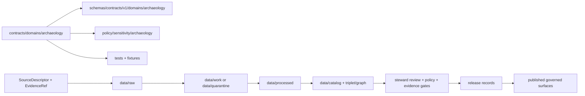

<!-- [KFM_META_BLOCK_V2]
doc_id: kfm://doc/contracts-domains-archaeology-readme
title: contracts/domains/archaeology/ — Archaeology Domain Semantic Contracts
type: readme
version: v0.2
status: draft
owners: OWNER_TBD — Archaeology steward · Contract steward · Evidence steward · Schema steward · Policy steward · Validation steward · Release steward · Docs steward
created: 2026-06-20
updated: 2026-06-20
policy_label: public; contracts; domains; archaeology; semantic-contracts; sensitive-lane
tags: [kfm, contracts, domains, archaeology, cultural-heritage, semantic-contracts, evidence, lifecycle, governance]
related:
  - ../../README.md
  - ../../../docs/domains/archaeology/CANONICAL_PATHS.md
  - ../../../docs/domains/archaeology/ARCHITECTURE.md
  - ../../../docs/domains/archaeology/DATA_LIFECYCLE.md
  - ../../../schemas/contracts/v1/domains/archaeology/
  - ../../../policy/sensitivity/archaeology/
  - ../../../tests/domains/archaeology/
  - ../../../fixtures/domains/archaeology/
  - ../../../data/registry/sources/
  - ../../../data/proofs/
  - ../../../release/
notes:
  - "Expanded from a greenfield scaffold into the Archaeology domain semantic-contract directory README."
  - "Contracts define semantic meaning only; schemas, policy, validators, fixtures, data, proofs, release, API, and UI remain separate authority roots."
  - "Archaeology canonical paths documentation reconciles this path to the Directory Rules §12 form."
  - "This README does not authorize publication or release."
[/KFM_META_BLOCK_V2] -->

<a id="top"></a>

# Archaeology Domain Semantic Contracts

> Semantic-contract home for Archaeology and Cultural Heritage object families. This directory defines object meaning and governance expectations; it does not define schema shape, policy behavior, source records, data storage, proof objects, release decisions, package code, API behavior, or UI behavior.

<p>
  
  
  
  
  
</p>

`contracts/domains/archaeology/`

## Quick jumps

[Status](#status) · [Scope](#scope) · [Path posture](#path-posture) · [Repo fit](#repo-fit) · [Accepted inputs](#accepted-inputs) · [Exclusions](#exclusions) · [Object-family spine](#object-family-spine) · [Contract rules](#contract-rules) · [Lifecycle boundary](#lifecycle-boundary) · [Validation](#validation) · [Evidence basis](#evidence-basis) · [Rollback](#rollback) · [Definition of done](#definition-of-done)

---

## Status

> [!IMPORTANT]
> **Status:** `draft` / directory README  
> **Owner:** `OWNER_TBD`  
> **Path:** `contracts/domains/archaeology/`  
> **Truth posture:** `CONFIRMED` current path and current update. Sibling archaeology docs reconcile this path to the Directory Rules §12 form. Object-level contract coverage, matching schemas, validators, fixtures, tests, policy behavior, release behavior, API behavior, and UI behavior remain `NEEDS VERIFICATION` unless separately confirmed.

> [!CAUTION]
> Archaeology is a sensitive lane. This README defines a contract-directory boundary only. It does not authorize publication, review approval, proof closure, policy approval, or release.

---

## Scope

Use this directory for Archaeology Markdown semantic contracts.

Each object-level contract should define:

- object meaning;
- Archaeology ownership boundary;
- candidate-versus-confirmed posture where relevant;
- identity-bearing fields;
- source and evidence expectations;
- cultural/steward review posture;
- lifecycle state and promotion constraints;
- validation expectations;
- release, correction, supersession, and rollback expectations.

This directory is **not** the implementation authority for machine shape, executable checks, policy decisions, source records, lifecycle data, proofs, releases, APIs, or UI behavior.

---

## Path posture

Archaeology path doctrine reconciles the contract home to:

```text
contracts/domains/archaeology/
```

Earlier shorthand forms such as `contracts/archaeology/` appear in lineage materials. Any future change to that relationship should be handled by ADR or migration note, not silent drift.

| Path | Status | Meaning |
|---|---|---|
| `contracts/domains/archaeology/` | `CONFIRMED` current path; reconciled by archaeology path docs | Intended Archaeology semantic-contract home. |
| `contracts/archaeology/` | `LINEAGE / CONFLICTED` unless separately governed | Older shorthand form from lineage materials. |
| `schemas/contracts/v1/domains/archaeology/` | `PROPOSED / NEEDS VERIFICATION` | Expected machine schema home. |
| `policy/sensitivity/archaeology/` | `PROPOSED / NEEDS VERIFICATION` | Expected sensitivity-policy home. |
| `tests/domains/archaeology/`, `fixtures/domains/archaeology/` | `PROPOSED / NEEDS VERIFICATION` | Expected enforceability/example homes. |

---

## Repo fit

```text
contracts/
└── domains/
    └── archaeology/
        └── README.md
```

Adjacent roots:

| Root | Relationship |
|---|---|
| `../../README.md` | Root contract guidance: contracts define meaning; schemas define shape. |
| `../../../docs/domains/archaeology/CANONICAL_PATHS.md` | Archaeology placement and path-conflict authority. |
| `../../../docs/domains/archaeology/ARCHITECTURE.md` | Archaeology domain architecture, mission, object-family vocabulary, and sensitive-lane posture. |
| `../../../docs/domains/archaeology/DATA_LIFECYCLE.md` | Archaeology lifecycle, review gates, and release/correction/rollback posture. |
| `../../../schemas/contracts/v1/domains/archaeology/` | Expected schema root. |
| `../../../policy/sensitivity/archaeology/` | Expected sensitivity-policy root. |
| `../../../tests/domains/archaeology/`, `../../../fixtures/domains/archaeology/` | Expected enforcement and fixture roots. |
| `../../../data/registry/sources/` | SourceDescriptor/source-role authority. |
| `../../../data/proofs/` | EvidenceBundle/proof support. |
| `../../../release/` | Release, correction, supersession, and rollback authority. |

---

## Accepted inputs

| Belongs here | Required posture |
|---|---|
| Archaeology Markdown semantic contracts | Define object meaning, identity, evidence, review, and lifecycle expectations only. |
| Object-family contract READMEs | Link to schemas, policy, fixtures, tests, evidence, cultural review, and release roots where relevant. |
| Compatibility notes | Surface path, casing, or object-family conflicts without silently normalizing them. |
| Verification checklists | Mark implementation state as `NEEDS VERIFICATION` unless directly checked. |
| Rollback notes | Name prior content SHA or migration rollback target. |

---

## Exclusions

| Does not belong here | Correct home |
|---|---|
| JSON Schema | `../../../schemas/contracts/v1/domains/archaeology/` or accepted schema home. |
| Sensitivity or review policy rules | `../../../policy/sensitivity/archaeology/` or accepted policy home. |
| Validator code | `../../../tools/validators/` or accepted validator package. |
| Fixtures and tests | `../../../fixtures/`, `../../../tests/`. |
| Source registry records | `../../../data/registry/sources/`. |
| Data lifecycle artifacts | `../../../data/`. |
| Evidence/proof objects | `../../../data/proofs/`. |
| Release records, correction notices, rollback cards | `../../../release/`. |
| API/UI implementation | Governed app/API/UI roots. |

---

## Object-family spine

Sibling archaeology docs preserve two overlapping archaeology object-family lists pending reconciliation. This README keeps both as corpus terms and marks canonical realization as `NEEDS VERIFICATION` until object-family contracts and schemas are inspected.

### Collapsed Archaeology / Cultural Heritage set

- `ArchaeologicalSite`
- `Survey`
- `Artifact`
- `Feature`
- `Context`
- `ExcavationUnit`
- `RemoteSensingAnomaly`
- `LiDARCandidate`
- `GeophysicsObservation`
- `ThreeDDocumentation`
- `CulturalReview`
- `StewardReview`
- `CollectionAccession`
- `ChronologyAssertion`
- `SensitivityTransform`

### Decomposed spine

- `ArchaeologicalSite`
- `SiteComponent`
- `CulturalTemporalPeriod`
- `SurveyProject`
- `SurveyTransect`
- `ShovelTest`
- `TestUnit`
- `ExcavationUnit`
- `ProvenienceContext`
- `StratigraphicUnit`
- `ArtifactRecord`
- `Sample`
- `CollectionRepositoryRecord`
- `CandidateFeature`
- `PublicationTransformReceipt`

Cross-cutting objects referenced by archaeology release doctrine include `RedactionReceipt`, `PolicyDecision`, and `MapReleaseManifest`; those are not owned solely by this contracts directory.

---

## Contract rules

Archaeology contracts should preserve these boundaries:

- contracts define meaning, not machine shape;
- schemas define shape;
- policy roots decide admissibility;
- validators and fixtures prove enforceability;
- data roots hold lifecycle artifacts;
- evidence roots hold proof support;
- release roots hold release decisions;
- review records remain distinct from release and proof records;
- candidate objects and confirmed objects remain distinct;
- cited facts from other domains remain owned by those domains.

Archaeology contracts must not collapse candidate records into confirmed records, contextual evidence into Archaeology-owned proof, validation success into release approval, or contract meaning into publication permission.

---

## Lifecycle boundary



Contracts describe meaning. They do not move data, validate schemas, make policy decisions, close evidence, perform review, publish artifacts, define routes, or render maps.

---

## Validation

Before relying on this directory, verify:

- full `contracts/domains/archaeology/` inventory;
- object-level contract coverage for the reconciled object-family spine;
- matching schemas and `$id` values;
- linked sensitivity-policy roots;
- linked validators and fixtures;
- linked EvidenceRef/EvidenceBundle requirements;
- cultural/steward review record expectations;
- release, correction, supersession, and rollback posture for any released surface;
- no document treats this contracts directory as publication permission or proof closure.

---

## Evidence basis

| Source | Status | Supports | Limits |
|---|---|---|---|
| Prior `contracts/domains/archaeology/README.md` scaffold | `CONFIRMED` | Target file existed as a greenfield scaffold. | It over-broadened what belonged in this contracts root. |
| `contracts/README.md` | `CONFIRMED` | Contracts define semantic meaning; schemas define shape; executable validation, JSON Schema, policy code, and source data do not belong in contracts. | Does not inventory Archaeology object-level contracts. |
| `docs/domains/archaeology/CANONICAL_PATHS.md` | `CONFIRMED path doctrine / PROPOSED path realizations` | Resolves `contracts/domains/archaeology/` vs `contracts/archaeology/` in favor of the Directory Rules §12 form; warns paths do not authorize release. | Does not prove every listed file exists. |
| `docs/domains/archaeology/ARCHITECTURE.md` | `CONFIRMED doctrine / PROPOSED implementation` | Defines sensitive-lane posture, owned object-family lists, candidate-vs-confirmed distinction, and cross-domain boundaries. | Does not prove implementation completeness. |
| `docs/domains/archaeology/DATA_LIFECYCLE.md` | `CONFIRMED doctrine / PROPOSED implementation` | Defines archaeology lifecycle, review gates, release posture, and separate responsibility roots. | Does not prove contract/schema/test coverage. |
| Uploaded authoring prompt v2 | `CONFIRMED user-supplied guidance` | Requires evidence-grounded, visually polished, implementation-honest Markdown with verification and rollback posture. | Authoring guidance, not implementation proof. |

---

## Rollback

Rollback is required if this README is used to claim object-level contract completeness, schema completeness, validator coverage, policy enforcement, review completion, release execution, API/UI behavior, or full directory inventory not verified in this task.

Rollback target: prior scaffold content SHA `0648dbf83686dfe27ce38209bb3ef29c78cf4d47`.

---

## Definition of done

- [ ] Owners are confirmed and `OWNER_TBD` is replaced.
- [ ] Full `contracts/domains/archaeology/` inventory is generated.
- [ ] Object-family naming and casing conflicts are resolved or explicitly preserved with ADR links.
- [ ] Object-level contracts are authored or explicitly marked absent.
- [ ] Matching schemas and `$id` values are verified.
- [ ] Sensitivity-policy, review, validator, fixture, evidence, release, and rollback dependencies are linked.
- [ ] Governed public surfaces are verified to use released, reviewed, policy-safe outputs only.

---

## Status summary

`contracts/domains/archaeology/` is the Archaeology semantic-contract home. It is not a schema home, policy home, validator package, fixture store, source registry, data lifecycle root, proof root, review authority, release authority, API implementation, UI implementation, or publication permission.

<p align="right"><a href="#top">Back to top</a></p>
