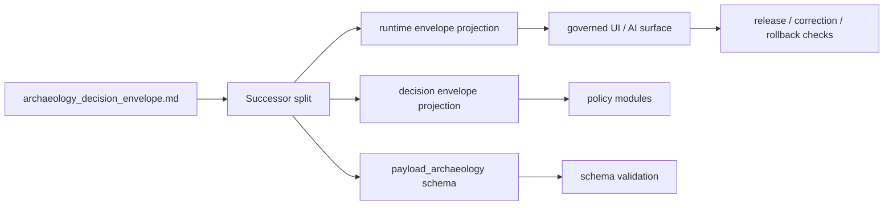

<!-- [KFM_META_BLOCK_V2]
doc_id: kfm://contract/domains/archaeology/archaeology-decision-envelope
title: contracts/domains/archaeology/archaeology_decision_envelope.md — ArchaeologyDecisionEnvelope Lineage Contract
type: contract
version: v0.2
status: draft-lineage
owners: OWNER_TBD — Archaeology steward · Contract steward · Runtime steward · Policy steward · Evidence steward · Schema steward · Validation steward · Release steward · Docs steward
created: 2026-06-20
updated: 2026-06-20
policy_label: public; contracts; domains; archaeology; decision-envelope; lineage; semantic-contract
tags: [kfm, contracts, archaeology, decision-envelope, runtime-envelope, policy, finite-outcome, evidence, lifecycle, governance]
related:
  - ./README.md
  - ./OBJECT_MAP.md
  - ./runtime_envelope_archaeology_projection.md
  - ./decision_envelope_archaeology_projection.md
  - ../../../docs/domains/archaeology/MISSING_OR_PLANNED_FILES.md
  - ../../../docs/domains/archaeology/CANONICAL_PATHS.md
  - ../../../docs/domains/archaeology/ARCHITECTURE.md
  - ../../../schemas/contracts/v1/domains/archaeology/archaeology_decision_envelope.schema.json
  - ../../../schemas/contracts/v1/domains/archaeology/payload_archaeology.schema.json
  - ../../../schemas/contracts/v1/runtime/
  - ../../../schemas/contracts/v1/governance/
  - ../../../policy/sensitivity/archaeology/
  - ../../../data/proofs/
  - ../../../release/
notes:
  - "Expanded from a planned-file scaffold into a lineage/compatibility semantic contract."
  - "The planning ledger says runtime_envelope_archaeology_projection.md renames the v1.0 archaeology_decision_envelope.md."
  - "The planning ledger says payload_archaeology.schema.json replaces the v1.0 archaeology_decision_envelope.schema.json row."
  - "The successor projection files and payload_archaeology.schema.json were not found in this task."
  - "The legacy paired schema still exists as a PROPOSED scaffold with empty properties and additionalProperties enabled."
[/KFM_META_BLOCK_V2] -->

<a id="top"></a>

# ArchaeologyDecisionEnvelope Lineage Contract

> Lineage and compatibility contract for the legacy `ArchaeologyDecisionEnvelope` name. This file preserves the old planned path while directing new work toward runtime-envelope and policy-decision projection contracts.

<p>
  
  
  
  
  
</p>

`contracts/domains/archaeology/archaeology_decision_envelope.md`

## Quick jumps

[Status](#status) · [Meaning](#meaning) · [Lineage posture](#lineage-posture) · [Repo fit](#repo-fit) · [Schema posture](#schema-posture) · [Accepted uses](#accepted-uses) · [Exclusions](#exclusions) · [Recommended successor split](#recommended-successor-split) · [Invariants](#invariants) · [Lifecycle](#lifecycle) · [Validation](#validation) · [Evidence basis](#evidence-basis) · [Rollback](#rollback) · [Definition of done](#definition-of-done)

---

## Status

> [!IMPORTANT]
> **Status:** `draft-lineage` / compatibility semantic contract  
> **Owner:** `OWNER_TBD`  
> **Current path:** `contracts/domains/archaeology/archaeology_decision_envelope.md`  
> **Truth posture:** `CONFIRMED` target path, scaffold source, paired legacy scaffold schema, and planning-ledger successor guidance. Successor contract files, successor payload schema, validators, fixtures, policy behavior, runtime behavior, API behavior, UI behavior, release behavior, and tests remain `NEEDS VERIFICATION`.

> [!NOTE]
> This document should not be treated as the preferred new envelope contract. It preserves lineage and transition guidance for an older planned name.

---

## Meaning

`ArchaeologyDecisionEnvelope` was a planned archaeology-specific envelope name for decision-like outputs.

Current planning evidence splits that older idea into two clearer surfaces:

1. **Runtime-response projection** — how cross-cutting runtime response envelopes behave for archaeology-facing responses.
2. **Decision-envelope projection** — how cross-cutting policy/governance decision envelopes are used by archaeology policy modules.

This legacy contract therefore exists to prevent silent drift. It records what the old name meant, where new work should move, and what must not be claimed until successors are created and verified.

---

## Lineage posture

| Item | Status | Notes |
|---|---|---|
| `archaeology_decision_envelope.md` | `CONFIRMED` current scaffold path | User-requested path and current target. |
| `runtime_envelope_archaeology_projection.md` | `PLANNED / NOT FOUND` | Planning ledger says it renames the v1.0 decision-envelope contract. |
| `decision_envelope_archaeology_projection.md` | `PLANNED / NOT FOUND` | Planning ledger names it as the archaeology policy-decision projection contract. |
| `archaeology_decision_envelope.schema.json` | `CONFIRMED legacy scaffold` | Exists as PROPOSED scaffold. |
| `payload_archaeology.schema.json` | `PLANNED / NOT FOUND` | Planning ledger says it replaces the v1.0 schema row. |

---

## Repo fit

```text
contracts/
└── domains/
    └── archaeology/
        ├── README.md
        ├── OBJECT_MAP.md
        └── archaeology_decision_envelope.md
```

Adjacent roots:

| Root | Relationship |
|---|---|
| `./README.md` | Archaeology semantic-contract directory boundary. |
| `./OBJECT_MAP.md` | Object map and cross-cutting dependency posture. |
| `./runtime_envelope_archaeology_projection.md` | Planned successor for runtime response projection; not found here. |
| `./decision_envelope_archaeology_projection.md` | Planned successor for policy decision projection; not found here. |
| `../../../schemas/contracts/v1/domains/archaeology/archaeology_decision_envelope.schema.json` | Legacy scaffold schema. |
| `../../../schemas/contracts/v1/domains/archaeology/payload_archaeology.schema.json` | Planned successor payload schema; not found here. |
| `../../../schemas/contracts/v1/runtime/` | Expected cross-cutting runtime-envelope schema family. |
| `../../../schemas/contracts/v1/governance/` | Expected cross-cutting governance decision schema family. |
| `../../../policy/sensitivity/archaeology/` | Archaeology policy root; behavior not verified here. |
| `../../../data/proofs/` | EvidenceBundle/proof support. |
| `../../../release/` | Release/correction/rollback authority. |

---

## Schema posture

The legacy paired schema found in this task is:

```text
schemas/contracts/v1/domains/archaeology/archaeology_decision_envelope.schema.json
```

Current schema evidence:

| Schema fact | Status |
|---|---|
| Legacy schema file exists | `CONFIRMED` |
| Schema title is `Archaeology Decision Envelope` | `CONFIRMED` |
| Schema status is `PROPOSED` | `CONFIRMED` |
| Schema properties are empty | `CONFIRMED` |
| `additionalProperties` is `true` | `CONFIRMED` |
| Schema `contract_doc` points to this contract | `CONFIRMED` |
| Validator implementation | `UNKNOWN / NOT FOUND` |
| Successor `payload_archaeology.schema.json` | `PLANNED / NOT FOUND` |

---

## Accepted uses

| Use | Allowed? | Rule |
|---|---:|---|
| Preserving lineage for the legacy envelope name | Yes | Keep uncertainty visible. |
| Explaining successor split | Yes | Point to runtime-response and policy-decision projection contracts. |
| Supporting migration planning | Yes | Must name affected schemas, contracts, validators, fixtures, and references. |
| Acting as the canonical new runtime response contract | No | Use successor runtime projection after it exists. |
| Acting as the canonical policy decision contract | No | Use successor decision projection after it exists. |
| Acting as schema, policy, proof, release, or UI implementation | No | Those authority roots remain separate. |

---

## Exclusions

| Does not belong in this contract | Correct home |
|---|---|
| Runtime response envelope shape | `../../../schemas/contracts/v1/runtime/` and successor projection contract. |
| Governance decision-envelope shape | `../../../schemas/contracts/v1/governance/` and successor projection contract. |
| Archaeology payload schema | `../../../schemas/contracts/v1/domains/archaeology/payload_archaeology.schema.json` after creation. |
| Policy rules | `../../../policy/sensitivity/archaeology/` or accepted policy home. |
| EvidenceBundle/proof content | `../../../data/proofs/`. |
| Release decisions | `../../../release/`. |
| API/UI behavior | Governed API/UI roots. |

---

## Recommended successor split

This contract should eventually be superseded by:

| Successor | Purpose | Status |
|---|---|---|
| `runtime_envelope_archaeology_projection.md` | Defines archaeology-specific projection of cross-cutting runtime response envelopes and finite outcomes. | `PLANNED / NEEDS VERIFICATION` |
| `decision_envelope_archaeology_projection.md` | Defines archaeology-specific use of cross-cutting policy/governance decision envelopes. | `PLANNED / NEEDS VERIFICATION` |
| `payload_archaeology.schema.json` | Defines archaeology-specific payload variant for cross-cutting envelopes. | `PLANNED / NEEDS VERIFICATION` |

Until those files exist and are verified, this file remains a lineage contract, not the preferred authority.

---

## Invariants

This compatibility contract must preserve these invariants:

- do not collapse runtime response envelopes and policy decision envelopes;
- do not treat AI or runtime output as evidence proof;
- do not treat policy outcome as release approval;
- do not treat schema validity as proof of truth;
- keep EvidenceBundle, policy, review, release, correction, and rollback references separate;
- keep legacy naming visible until migration is complete;
- public-facing outputs must remain downstream of governed release and policy-safe surfaces.

---

## Lifecycle



The old name is a migration waypoint. It does not replace the successor contracts, schemas, policy modules, evidence, release, or UI surfaces.

---

## Validation

Before relying on this contract, verify:

- whether this file should remain, redirect, or be retired;
- whether successor projection contracts exist;
- whether `payload_archaeology.schema.json` exists;
- whether legacy schema should be deprecated or retained as compatibility;
- validator and fixture coverage for old and new names;
- policy modules that refer to the old name;
- UI/API references that refer to the old name;
- release/correction references that depend on envelope semantics.

---

## Evidence basis

| Source | Status | Supports | Limits |
|---|---|---|---|
| Prior `archaeology_decision_envelope.md` scaffold | `CONFIRMED` | Target file existed and was sourced from the planned-files ledger. | Scaffold did not define authoritative semantics. |
| `archaeology_decision_envelope.schema.json` | `CONFIRMED legacy scaffold` | Schema exists, is `PROPOSED`, has empty properties, and points to this contract. | Does not enforce envelope semantics. |
| `MISSING_OR_PLANNED_FILES.md` | `CONFIRMED planning ledger` | States successor contracts and says the v1.0 name/schema row were renamed/replaced. | Planning ledger is not implementation proof. |
| Uploaded authoring prompt v2 | `CONFIRMED user-supplied guidance` | Requires evidence-grounded, implementation-honest Markdown with verification and rollback posture. | Authoring guidance, not implementation proof. |

---

## Rollback

Rollback is required if this contract is used to claim successor implementation, schema completeness, validator coverage, policy enforcement, API/UI behavior, release behavior, or migration completion not verified in this task.

Rollback target: prior scaffold content SHA `5db60177166015b3069138e9a3dd499e75963b15`.

---

## Definition of done

- [ ] Owners are confirmed and `OWNER_TBD` is replaced.
- [ ] Successor projection contracts are created or explicitly deferred.
- [ ] Successor payload schema is created or explicitly deferred.
- [ ] Legacy schema status is resolved as retained, deprecated, or removed by ADR/migration note.
- [ ] Validators and fixtures are updated for the accepted naming. 
- [ ] All policy, API, UI, docs, and release references are updated or redirected.
- [ ] This lineage contract is either superseded with links or retained as a compatibility note.

---

## Status summary

`archaeology_decision_envelope.md` is a lineage/compatibility contract for an older planned name. It is not the preferred new runtime envelope contract, not the preferred policy decision contract, not proof closure, not policy approval, not release approval, and not implementation proof by itself.

<p align="right"><a href="#top">Back to top</a></p>
