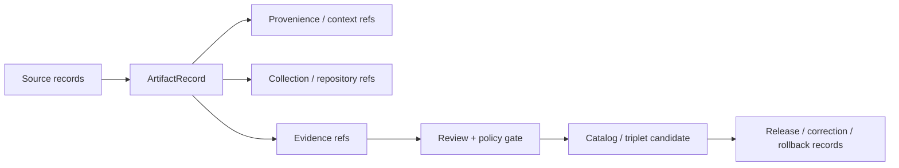

<!-- [KFM_META_BLOCK_V2]
doc_id: kfm://contract/domains/archaeology/artifact-record
title: contracts/domains/archaeology/artifact_record.md — ArtifactRecord Contract
type: contract
version: v0.2
status: draft
owners: OWNER_TBD — Archaeology steward · Contract steward · Evidence steward · Collection steward · Schema steward · Policy steward · Review steward · Validation steward · Release steward · Docs steward
created: 2026-06-20
updated: 2026-06-20
policy_label: public; contracts; domains; archaeology; artifact-record; semantic-contract
tags: [kfm, contracts, archaeology, artifact-record, artifact, collection, provenience, evidence, review, policy, lifecycle, governance]
related:
  - ./README.md
  - ./OBJECT_MAP.md
  - ./archaeological_site.md
  - ./provenience_context.md
  - ./stratigraphic_unit.md
  - ./collection_repository_record.md
  - ./sample.md
  - ../../../docs/domains/archaeology/MISSING_OR_PLANNED_FILES.md
  - ../../../docs/domains/archaeology/CANONICAL_PATHS.md
  - ../../../docs/domains/archaeology/ARCHITECTURE.md
  - ../../../docs/domains/archaeology/DATA_LIFECYCLE.md
  - ../../../schemas/contracts/v1/domains/archaeology/artifact_record.schema.json
  - ../../../policy/sensitivity/archaeology/
  - ../../../data/proofs/
  - ../../../release/
notes:
  - "Expanded from a planned-file scaffold into the object-level ArtifactRecord semantic contract."
  - "The paired schema is a PROPOSED scaffold with empty properties and additionalProperties enabled."
  - "No validator implementation was found in this task."
  - "OBJECT_MAP.md marks ArtifactRecord as NEEDS VERIFICATION and treats Artifact as a conflicted lineage term that may map to ArtifactRecord."
[/KFM_META_BLOCK_V2] -->

<a id="top"></a>

# ArtifactRecord Contract

> Semantic contract for `ArtifactRecord`, the Archaeology-domain object representing a documented artifact record with provenience/context linkage, source-role posture, evidence support, collection/repository relationship, review state, policy posture, lifecycle state, and correction/release boundaries preserved.

<p>
  
  
  
  
  
  
</p>

`contracts/domains/archaeology/artifact_record.md`

## Quick jumps

[Status](#status) · [Meaning](#meaning) · [Naming posture](#naming-posture) · [Repo fit](#repo-fit) · [Schema posture](#schema-posture) · [Accepted uses](#accepted-uses) · [Exclusions](#exclusions) · [Recommended fields](#recommended-fields) · [Invariants](#invariants) · [Lifecycle](#lifecycle) · [Validation](#validation) · [Evidence basis](#evidence-basis) · [Rollback](#rollback) · [Definition of done](#definition-of-done)

---

## Status

> [!IMPORTANT]
> **Status:** `draft` / semantic contract  
> **Owner:** `OWNER_TBD`  
> **Contract path:** `contracts/domains/archaeology/artifact_record.md`  
> **Schema path:** `schemas/contracts/v1/domains/archaeology/artifact_record.schema.json`  
> **Truth posture:** `CONFIRMED` target path, current update, paired scaffold schema, object-map entry, architecture doctrine, and uploaded authoring guidance. Validator behavior, fixtures, policy behavior, source registry behavior, evidence-bundle implementation, collection/repository integration, review workflow, release workflow, API behavior, and UI behavior remain `NEEDS VERIFICATION`.

> [!CAUTION]
> This contract defines object meaning only. It does not authorize publication, review approval, policy approval, proof closure, release, public rendering, or access to restricted artifact/context details.

---

## Meaning

`ArtifactRecord` is the Archaeology-domain object for a documented artifact record.

It represents a record about an artifact-like item or assemblage reference within KFM with:

- source and source-role context;
- provenience/context linkage;
- associated site, component, unit, or sample context where applicable;
- collection or repository relationship where applicable;
- evidence support;
- review posture;
- lifecycle state;
- policy posture;
- release/correction/rollback boundaries.

It is not a raw catalog row, not a collection repository record by itself, not a sample by itself, not an ArchaeologicalSite, not proof closure, not policy approval, not review approval, and not release approval.

---

## Naming posture

The Archaeology corpus preserves overlapping terms. `OBJECT_MAP.md` maps the planned object family as `ArtifactRecord`, while the broader corpus term `Artifact` is a `CONFLICTED / NEEDS VERIFICATION` lineage term that may map to `ArtifactRecord` after steward review.

| Term | Status | Rule |
|---|---|---|
| `ArtifactRecord` | `CONFIRMED` in current object map as planned contract family | Use for this contract. |
| `Artifact` | `CONFLICTED / NEEDS VERIFICATION` lineage term | Do not silently treat it as a separate canonical contract without ADR or steward decision. |

---

## Repo fit

```text
contracts/
└── domains/
    └── archaeology/
        ├── README.md
        ├── OBJECT_MAP.md
        └── artifact_record.md
```

Adjacent roots:

| Root | Relationship |
|---|---|
| `./README.md` | Archaeology semantic-contract directory boundary. |
| `./OBJECT_MAP.md` | Maps `ArtifactRecord` to this contract and the expected schema. |
| `./archaeological_site.md` | Site identity context; not equivalent to artifact record. |
| `./provenience_context.md` | Context/provenience relationship. |
| `./stratigraphic_unit.md` | Stratigraphic relationship where applicable. |
| `./collection_repository_record.md` | Collection/repository relationship; not the same object. |
| `./sample.md` | Sample relationship where applicable. |
| `../../../schemas/contracts/v1/domains/archaeology/artifact_record.schema.json` | Current scaffold schema. |
| `../../../policy/sensitivity/archaeology/` | Policy gate home; behavior not verified here. |
| `../../../data/proofs/` | EvidenceBundle/proof support. |
| `../../../release/` | Release, correction, supersession, and rollback authority. |

---

## Schema posture

The paired schema found in this task is:

```text
schemas/contracts/v1/domains/archaeology/artifact_record.schema.json
```

Current schema evidence:

| Schema fact | Status |
|---|---|
| Schema file exists | `CONFIRMED` |
| Schema title is `Artifact Record` | `CONFIRMED` |
| Schema status is `PROPOSED` | `CONFIRMED` |
| Schema properties are empty | `CONFIRMED` |
| `additionalProperties` is `true` | `CONFIRMED` |
| Schema `contract_doc` points to this contract | `CONFIRMED` |
| Validator implementation | `UNKNOWN / NOT FOUND` |

---

## Accepted uses

| Use | Allowed? | Rule |
|---|---:|---|
| Defining artifact-record meaning | Yes | Must preserve source, context, evidence, review, and lifecycle posture. |
| Linking an artifact record to site, component, provenience, unit, sample, or collection context | Yes | Relationships must remain traceable and bounded. |
| Supporting catalog or release review | Conditional | Requires separate evidence, policy, review, and release records. |
| Supporting correction or rollback lineage | Yes | Must preserve prior state and reason for change where material. |
| Treating artifact presence as site confirmation | No | Site identity must follow its own evidence and review pathway. |
| Treating a collection/repository record as the artifact record itself | No | CollectionRepositoryRecord remains a distinct object family. |
| Using schema validity as proof of truth | No | Schema shape is not evidence proof. |
| Treating this contract as release approval | No | Release authority remains separate. |

---

## Exclusions

| Does not belong in this contract | Correct home |
|---|---|
| Machine field shape | `../../../schemas/contracts/v1/domains/archaeology/artifact_record.schema.json`. |
| Validator implementation | `../../../tools/validators/...`. |
| Fixtures and tests | `../../../fixtures/...`, `../../../tests/...`. |
| Source registry records | `../../../data/registry/sources/`. |
| EvidenceBundle/proof content | `../../../data/proofs/`. |
| Policy decisions | `../../../policy/...`. |
| Review records | Governance/review contracts and records. |
| Collection repository authority record | `collection_repository_record.md` and collection/repository data roots. |
| Release manifests, correction notices, rollback cards | `../../../release/`. |
| Public layer or UI implementation | Governed app/API/UI/layer roots. |

---

## Recommended fields

The current schema does not require these fields. They are `PROPOSED` semantic requirements for future schema/validator work:

| Field | Meaning |
|---|---|
| `artifact_record_id` | Stable artifact-record identity. |
| `source_refs` | SourceDescriptor/source record references. |
| `source_roles` | Roles of sources supporting the artifact record. |
| `evidence_refs` | EvidenceRef/EvidenceBundle references. |
| `review_refs` | Review records where applicable. |
| `policy_state` | Policy posture or policy-decision reference. |
| `site_ref` | ArchaeologicalSite reference where applicable. |
| `component_ref` | SiteComponent reference where applicable. |
| `provenience_context_ref` | ProvenienceContext reference. |
| `stratigraphic_unit_ref` | StratigraphicUnit reference where applicable. |
| `excavation_or_test_ref` | ExcavationUnit, TestUnit, ShovelTest, SurveyProject, or SurveyTransect reference where applicable. |
| `sample_ref` | Sample reference where applicable. |
| `collection_repository_ref` | CollectionRepositoryRecord reference where applicable. |
| `classification_summary` | Bounded classification/description summary. |
| `temporal_scope` | Observed, collected, cataloged, accessioned, or reviewed time context where material. |
| `lifecycle_state` | RAW/WORK/QUARANTINE/PROCESSED/CATALOG/TRIPLET/PUBLISHED posture where used. |
| `release_refs` | Release/candidate linkage where applicable. |
| `correction_refs` | Correction/supersession/rollback lineage. |
| `spec_hash` | Integrity pin for the representation. |

---

## Invariants

`ArtifactRecord` must preserve these invariants:

- artifact records do not independently confirm site identity;
- collection/repository records remain distinct from artifact records;
- context and provenience relationships must remain traceable;
- source role must remain visible;
- schema validity is not proof;
- evidence, policy, review, release, correction, and rollback objects remain separate families;
- public-facing use must be downstream of governed release artifacts;
- sensitive or rights-uncertain content remains constrained until policy and review allow a specific downstream use;
- publication is a governed state transition, not a file move.

---

## Lifecycle



The contract defines the meaning of an artifact record. It does not replace source registration, evidence resolution, review, policy, validation, release, or rollback systems.

---

## Validation

Before relying on this contract, verify:

- schema fields beyond scaffold status;
- validator implementation and fixture coverage;
- canonical identity and source-role vocabulary;
- relationship rules for site/component/context/unit/sample/collection references;
- EvidenceRef/EvidenceBundle requirements;
- review-record requirements;
- policy-gate requirements;
- release, correction, supersession, and rollback linkage;
- no downstream surface treats this contract as release permission or proof closure.

---

## Evidence basis

| Source | Status | Supports | Limits |
|---|---|---|---|
| Prior `artifact_record.md` scaffold | `CONFIRMED` | Target file existed and was sourced from the planned-files ledger. | Scaffold did not define authoritative semantics. |
| `artifact_record.schema.json` | `CONFIRMED scaffold` | Schema exists, is `PROPOSED`, has empty properties, and points to this contract. | Does not enforce full artifact-record semantics. |
| `OBJECT_MAP.md` | `CONFIRMED current map` | Maps `ArtifactRecord` to `artifact_record.md` and `artifact_record.schema.json`; identifies `Artifact` as a conflicted lineage term. | Map marks status `NEEDS VERIFICATION`. |
| `ARCHITECTURE.md` | `CONFIRMED doctrine / PROPOSED implementation` | Names artifact-related object families, candidate-vs-confirmed distinction, cross-domain boundaries, and sensitive-lane posture. | Does not prove schema/validator/test coverage. |
| Uploaded authoring prompt v2 | `CONFIRMED user-supplied guidance` | Requires evidence-grounded, implementation-honest Markdown with verification and rollback posture. | Authoring guidance, not implementation proof. |

---

## Rollback

Rollback is required if this contract is used to claim schema completeness, validator coverage, policy enforcement, review completion, release execution, API/UI behavior, or implementation maturity not verified in this task.

Rollback target: prior scaffold content SHA `8e0fa7ee145d23fb96d190477054e71434acdf7e`.

---

## Definition of done

- [ ] Owners are confirmed and `OWNER_TBD` is replaced.
- [ ] Schema fields are defined beyond scaffold status.
- [ ] Validator and fixtures are implemented and verified.
- [ ] Artifact-vs-artifact-record naming is resolved or documented with ADR/steward decision.
- [ ] Relationship rules for site, context, sample, unit, and collection references are tested.
- [ ] Evidence, policy, review, release, correction, and rollback references are testable.
- [ ] Cross-domain support boundaries are documented and tested.
- [ ] Downstream docs link to this contract as the accepted ArtifactRecord meaning boundary.

---

## Status summary

`ArtifactRecord` is the semantic contract for documented artifact records in the Archaeology domain. It is not a raw source row, not a CollectionRepositoryRecord, not a Sample, not an ArchaeologicalSite, not an EvidenceBundle, not policy approval, not review approval, not release approval, and not implementation proof by itself.

<p align="right"><a href="#top">Back to top</a></p>
