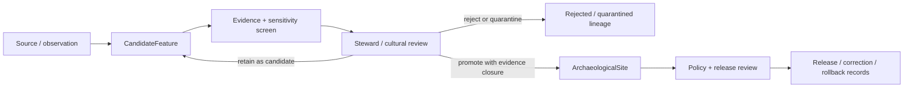

<!-- [KFM_META_BLOCK_V2]
doc_id: kfm://contract/domains/archaeology/candidate-feature
title: contracts/domains/archaeology/candidate_feature.md — CandidateFeature Contract
type: contract
version: v0.2
status: draft
owners: OWNER_TBD — Archaeology steward · Contract steward · Evidence steward · Schema steward · Policy steward · Review steward · Validation steward · Release steward · Docs steward
created: 2026-06-20
updated: 2026-06-20
policy_label: public; contracts; domains; archaeology; candidate-feature; semantic-contract; sensitive-lane
tags: [kfm, contracts, archaeology, candidate-feature, candidate, evidence, review, policy, sensitivity, lifecycle, governance]
related:
  - ./README.md
  - ./OBJECT_MAP.md
  - ./archaeological_site.md
  - ./remote_sensing_anomaly.md
  - ./lidar_candidate.md
  - ./geophysics_observation.md
  - ./steward_review.md
  - ./cultural_review.md
  - ./publication_transform_receipt.md
  - ../../../docs/domains/archaeology/MISSING_OR_PLANNED_FILES.md
  - ../../../docs/domains/archaeology/CANONICAL_PATHS.md
  - ../../../docs/domains/archaeology/ARCHITECTURE.md
  - ../../../docs/domains/archaeology/DATA_LIFECYCLE.md
  - ../../../schemas/contracts/v1/domains/archaeology/candidate_feature.schema.json
  - ../../../policy/sensitivity/archaeology/
  - ../../../data/proofs/
  - ../../../release/
notes:
  - "Expanded from a planned-file scaffold into the object-level CandidateFeature semantic contract."
  - "The paired schema is currently a PROPOSED scaffold with empty properties and additionalProperties enabled."
  - "This contract preserves the candidate-vs-confirmed boundary and does not authorize public release or exact-location disclosure."
  - "CandidateFeature is a review candidate, not a confirmed ArchaeologicalSite."
[/KFM_META_BLOCK_V2] -->

<a id="top"></a>

# CandidateFeature Contract

> Semantic contract for `CandidateFeature`, the Archaeology-domain object representing a possible archaeology-relevant feature that still requires evidence review, sensitivity review, and governed promotion before it can become or support a confirmed `ArchaeologicalSite`.

<p>
  
  
  
  
  
  
</p>

`contracts/domains/archaeology/candidate_feature.md`

## Quick jumps

[Status](#status) · [Meaning](#meaning) · [Repo fit](#repo-fit) · [Schema posture](#schema-posture) · [Accepted uses](#accepted-uses) · [Exclusions](#exclusions) · [Recommended fields](#recommended-fields) · [Invariants](#invariants) · [Lifecycle](#lifecycle) · [Validation](#validation) · [Evidence basis](#evidence-basis) · [Rollback](#rollback) · [Definition of done](#definition-of-done)

---

## Status

> [!IMPORTANT]
> **Status:** `draft` / semantic contract  
> **Owner:** `OWNER_TBD`  
> **Contract path:** `contracts/domains/archaeology/candidate_feature.md`  
> **Schema path:** `schemas/contracts/v1/domains/archaeology/candidate_feature.schema.json`  
> **Truth posture:** `CONFIRMED` target path, current update, paired scaffold schema, object-map entry, archaeology contract-directory README, archaeology canonical-paths doctrine, and uploaded authoring guidance. Validator behavior, fixtures, policy behavior, source registry behavior, evidence-bundle implementation, review workflow, release workflow, API behavior, and UI behavior remain `NEEDS VERIFICATION`.

> [!CAUTION]
> This contract defines object meaning only. It does **not** authorize publication, review approval, policy approval, proof closure, exact-location exposure, public map rendering, access to restricted site details, or promotion to `ArchaeologicalSite`.

---

## Meaning

`CandidateFeature` is the Archaeology-domain object for a possible archaeology-relevant feature, anomaly, structure, trace, cluster, context, or observation that may warrant review but has **not** been confirmed as an archaeological site.

A candidate feature may originate from:

- field notes or survey observations;
- historical-map comparison;
- remote-sensing interpretation;
- LiDAR-derived terrain patterning;
- geophysics observations;
- archival or report references;
- cross-domain spatial context;
- steward-submitted review leads;
- analytic screening outputs.

It represents a bounded candidate claim with source, evidence, uncertainty, sensitivity, review, and lifecycle posture preserved.

It is not:

- a confirmed `ArchaeologicalSite`;
- a release decision;
- a public map layer;
- a raw source row;
- an EvidenceBundle;
- a PolicyDecision;
- a ReviewRecord;
- proof that cultural material exists;
- permission to disclose exact location.

---

## Repo fit

```text
contracts/
└── domains/
    └── archaeology/
        ├── README.md
        ├── OBJECT_MAP.md
        ├── archaeological_site.md
        └── candidate_feature.md
```

Adjacent roots:

| Root | Relationship |
|---|---|
| `./README.md` | Archaeology semantic-contract directory boundary. |
| `./OBJECT_MAP.md` | Maps `CandidateFeature` to this contract and the expected schema. |
| `./archaeological_site.md` | Confirmed/reviewed site identity; not equivalent to this contract. |
| `./remote_sensing_anomaly.md` | More specific remote-sensing object that may feed candidate creation. |
| `./lidar_candidate.md` | More specific LiDAR-derived candidate family. |
| `./geophysics_observation.md` | Observation family that may support or contradict a candidate. |
| `./steward_review.md`, `./cultural_review.md` | Review objects required before consequential promotion or exposure. |
| `../../../schemas/contracts/v1/domains/archaeology/candidate_feature.schema.json` | Current scaffold schema. |
| `../../../policy/sensitivity/archaeology/` | Policy gate home; behavior not verified here. |
| `../../../data/proofs/` | EvidenceBundle/proof support. |
| `../../../release/` | Release, correction, supersession, and rollback authority. |

---

## Schema posture

The paired schema found for this contract is:

```text
schemas/contracts/v1/domains/archaeology/candidate_feature.schema.json
```

Current schema evidence:

| Schema fact | Status |
|---|---|
| Schema file exists | `CONFIRMED` |
| Schema title is `Candidate Feature` | `CONFIRMED` |
| Schema status is `PROPOSED` | `CONFIRMED` |
| Schema properties are empty | `CONFIRMED` |
| `additionalProperties` is `true` | `CONFIRMED` |
| Schema `contract_doc` points to this contract | `CONFIRMED` |
| Validator implementation | `UNKNOWN / NOT FOUND IN THIS TASK` |

This contract therefore defines semantic expectations for future schema and validator work. It does not claim that machine validation currently enforces those expectations.

---

## Accepted uses

| Use | Allowed? | Rule |
|---|---:|---|
| Defining the meaning of an archaeology candidate | Yes | Must preserve candidate, uncertainty, source-role, evidence, review, and lifecycle posture. |
| Recording a potential feature for steward review | Conditional | Requires source/evidence references and sensitivity posture. |
| Linking a candidate to remote-sensing, LiDAR, geophysics, field, archival, or map-derived observations | Yes | Supporting objects must remain distinct and traceable. |
| Supporting review queue prioritization | Conditional | Must not become automated confirmation or release. |
| Supporting candidate-to-site promotion | Conditional | Requires governed review, evidence closure, and policy checks. |
| Treating a candidate as a confirmed site | No | Promotion is a governed state transition, not a naming change. |
| Publishing exact candidate location to normal public clients | No | Sensitive archaeology location posture fails closed unless a governed, reviewed, public-safe transform allows exposure. |
| Using schema validity as proof of truth | No | Schema shape is not evidence proof. |
| Treating this contract as release approval | No | Release authority remains separate. |

---

## Exclusions

| Does not belong in this contract | Correct home |
|---|---|
| Machine field shape | `../../../schemas/contracts/v1/domains/archaeology/candidate_feature.schema.json`. |
| Validator implementation | `../../../tools/validators/...`. |
| Fixtures and tests | `../../../fixtures/...`, `../../../tests/...`. |
| Source registry records | `../../../data/registry/sources/`. |
| Raw observations or source extracts | `../../../data/raw/` or `../../../data/work/`, subject to lifecycle rules. |
| EvidenceBundle/proof content | `../../../data/proofs/`. |
| Sensitivity, access, or release policy | `../../../policy/...`. |
| Steward/cultural review records | Governance/review contract and record homes. |
| Release manifests, correction notices, rollback cards | `../../../release/`. |
| Public layer or UI implementation | Governed app/API/UI/layer roots. |

---

## Recommended fields

The current schema does not require these fields. They are `PROPOSED` semantic requirements for future schema/validator work:

| Field | Meaning |
|---|---|
| `candidate_feature_id` | Stable deterministic or steward-assigned candidate identity. |
| `candidate_type` | Candidate class such as surface feature, subsurface feature, structure, artifact scatter, earthwork, landscape trace, anomaly, or context lead. |
| `origin_method` | How the candidate was identified: survey, archival, map comparison, remote sensing, LiDAR, geophysics, report extraction, cross-domain analysis, steward submission, or other reviewed source. |
| `source_refs` | SourceDescriptor/source record references. |
| `source_roles` | Source roles supporting, contextualizing, or contesting the candidate. |
| `evidence_refs` | EvidenceRef/EvidenceBundle references where available. |
| `observation_refs` | RemoteSensingAnomaly, LiDARCandidate, GeophysicsObservation, field observation, or archival observation references. |
| `candidate_geometry_ref` | Internal geometry/support-scope reference, with public-safe generalization required before public exposure. |
| `spatial_precision_class` | Precision bucket or generalization class; exact coordinate handling must be policy-gated. |
| `temporal_scope` | Valid/observed/source/retrieval/review time context where material. |
| `confidence_statement` | Bounded confidence or uncertainty note; must not be treated as confirmation. |
| `review_state` | Intake, needs review, under review, rejected, retained, promoted, superseded, or quarantined candidate state. |
| `review_refs` | StewardReview, CulturalReview, or other review record references. |
| `policy_state` | Policy posture or policy-decision reference. |
| `sensitivity_class` | Sensitivity/public-safety classification, including exact-location restrictions. |
| `site_lineage_refs` | References to any promoted ArchaeologicalSite or rejected/superseded candidate lineage. |
| `lifecycle_state` | RAW/WORK/QUARANTINE/PROCESSED/CATALOG/TRIPLET/PUBLISHED posture where used. |
| `release_refs` | Release/candidate linkage where applicable. |
| `correction_refs` | Correction/supersession/rollback lineage. |
| `spec_hash` | Integrity pin for the representation. |

---

## Invariants

`CandidateFeature` must preserve these invariants:

- a candidate is not a confirmed site;
- a candidate confidence score or analyst note is not proof;
- candidate-to-site promotion requires governed review, evidence closure, and policy checks;
- exact or sensitive location exposure fails closed unless policy and review authorize a specific public-safe transform;
- supporting observations remain distinct from the candidate object;
- supporting context from other domains can inform but cannot independently confirm archaeology truth;
- schema validity is not evidence proof;
- evidence, policy, review, release, correction, and rollback objects remain separate families;
- public-facing use must be downstream of governed release artifacts and public-safe transforms;
- publication is a governed state transition, not a file move.

---

## Lifecycle



The contract defines the meaning of a candidate object. It does not replace source intake, evidence resolution, sensitivity review, cultural review, schema validation, policy enforcement, release approval, correction, or rollback systems.

---

## Validation

Before relying on this contract, verify:

- schema fields beyond scaffold status;
- validator implementation and fixture coverage;
- canonical candidate identity rules;
- candidate type vocabulary and source-role vocabulary;
- EvidenceRef/EvidenceBundle requirements;
- spatial precision and public-safe transform rules;
- exact-location DENY/generalization behavior;
- review-record requirements;
- candidate-to-site promotion rules;
- policy-gate requirements;
- release, correction, supersession, and rollback linkage;
- no downstream surface treats this contract as release permission or public disclosure permission.

---

## Evidence basis

| Source | Status | Supports | Limits |
|---|---|---|---|
| Prior `candidate_feature.md` scaffold | `CONFIRMED` | Target file existed and was sourced from the planned-files ledger. | Scaffold did not define authoritative semantics. |
| `candidate_feature.schema.json` | `CONFIRMED scaffold` | Schema exists, is `PROPOSED`, has empty properties, and points to this contract. | Does not enforce full candidate semantics. |
| `OBJECT_MAP.md` | `CONFIRMED current map` | Maps `CandidateFeature` to `candidate_feature.md` and `candidate_feature.schema.json`; preserves candidate/confirmed distinction. | Map marks rows `NEEDS VERIFICATION`. |
| `README.md` in this directory | `CONFIRMED current boundary` | States this directory defines semantic meaning only and preserves candidate-versus-confirmed boundaries. | Does not prove schema, validator, policy, or release behavior. |
| `CANONICAL_PATHS.md` | `CONFIRMED path doctrine / PROPOSED path realizations` | Reconciles archaeology contract/schema path form to `contracts/domains/archaeology/` and `schemas/contracts/v1/domains/archaeology/`; marks sensitive-lane posture. | Does not authorize release or prove all paths exist. |
| Uploaded authoring prompt v2 | `CONFIRMED user-supplied guidance` | Requires evidence-grounded, implementation-honest Markdown with verification and rollback posture. | Authoring guidance, not implementation proof. |

---

## Rollback

Rollback is required if this contract is used to claim schema completeness, validator coverage, policy enforcement, review completion, release execution, API/UI behavior, public disclosure permission, exact-location authorization, or implementation maturity not verified in this task.

Rollback target: prior scaffold blob SHA `ad91f1da2594d4963aa5638d10078bec89987e48`.

---

## Definition of done

- [ ] Owners are confirmed and `OWNER_TBD` is replaced.
- [ ] Candidate type vocabulary is reviewed by the Archaeology steward.
- [ ] Candidate-to-site promotion rule is accepted and linked.
- [ ] Paired JSON Schema is expanded from scaffold status.
- [ ] Valid and invalid fixtures cover candidate, rejected, quarantined, retained, promoted, and superseded states.
- [ ] Validator enforces required evidence, source-role, precision, sensitivity, and review fields.
- [ ] Exact-location public exposure is tested as `DENY` unless a public-safe transform and release record are present.
- [ ] EvidenceBundle, PolicyDecision, ReviewRecord, PublicationTransformReceipt, ReleaseManifest, CorrectionNotice, and RollbackCard references are validated where required.
- [ ] API/UI surfaces prove they cannot treat candidate objects as confirmed sites.
- [ ] Release and rollback dry-runs prove this contract cannot bypass publication gates.

## Status summary

`CandidateFeature` is a sensitive Archaeology candidate object. It can help route possible features into review, evidence closure, and policy checks, but it is not a confirmed site, not a public layer, not proof, not review approval, not policy approval, and not release approval.

<p align="right"><a href="#top">Back to top</a></p>
