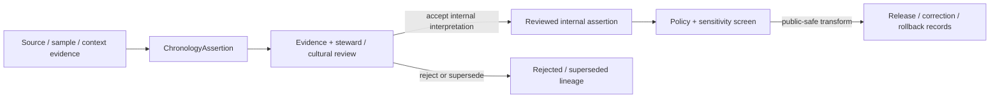

<!-- [KFM_META_BLOCK_V2]
doc_id: kfm://contract/domains/archaeology/chronology-assertion
title: contracts/domains/archaeology/chronology_assertion.md — ChronologyAssertion Contract
type: contract
version: v0.2
status: draft
owners: OWNER_TBD — Archaeology steward · Contract steward · Evidence steward · Schema steward · Policy steward · Review steward · Validation steward · Release steward · Docs steward
created: 2026-06-20
updated: 2026-06-20
policy_label: public; contracts; domains; archaeology; chronology-assertion; semantic-contract; sensitive-lane
tags: [kfm, contracts, archaeology, chronology, temporal, evidence, review, policy, sensitivity, lifecycle, governance]
related:
  - ./README.md
  - ./OBJECT_MAP.md
  - ./archaeological_site.md
  - ./candidate_feature.md
  - ./provenience_context.md
  - ./stratigraphic_unit.md
  - ./artifact_record.md
  - ./sample.md
  - ./cultural_temporal_period.md
  - ./steward_review.md
  - ./cultural_review.md
  - ../../../docs/domains/archaeology/MISSING_OR_PLANNED_FILES.md
  - ../../../docs/domains/archaeology/CANONICAL_PATHS.md
  - ../../../docs/domains/archaeology/ARCHITECTURE.md
  - ../../../docs/domains/archaeology/DATA_LIFECYCLE.md
  - ../../../schemas/contracts/v1/domains/archaeology/chronology_assertion.schema.json
  - ../../../policy/sensitivity/archaeology/
  - ../../../data/proofs/
  - ../../../release/
notes:
  - "Expanded from a planned-file scaffold into the object-level ChronologyAssertion semantic contract."
  - "The paired schema is currently a PROPOSED scaffold with empty properties and additionalProperties enabled."
  - "ChronologyAssertion is an evidence-bound temporal interpretation, not source truth, release approval, or site confirmation by itself."
  - "Temporal claims involving sensitive archaeology remain policy-gated and public-safe before exposure."
[/KFM_META_BLOCK_V2] -->

<a id="top"></a>

# ChronologyAssertion Contract

> Semantic contract for `ChronologyAssertion`, the Archaeology-domain object representing an evidence-bound claim about the time, sequence, age range, cultural period, or temporal relationship of an archaeology object, context, sample, site, component, or candidate.

<p>
  
  
  
  
  
  
</p>

`contracts/domains/archaeology/chronology_assertion.md`

## Quick jumps

[Status](#status) · [Meaning](#meaning) · [Repo fit](#repo-fit) · [Schema posture](#schema-posture) · [Accepted uses](#accepted-uses) · [Exclusions](#exclusions) · [Recommended fields](#recommended-fields) · [Invariants](#invariants) · [Lifecycle](#lifecycle) · [Validation](#validation) · [Evidence basis](#evidence-basis) · [Rollback](#rollback) · [Definition of done](#definition-of-done)

---

## Status

> [!IMPORTANT]
> **Status:** `draft` / semantic contract  
> **Owner:** `OWNER_TBD`  
> **Contract path:** `contracts/domains/archaeology/chronology_assertion.md`  
> **Schema path:** `schemas/contracts/v1/domains/archaeology/chronology_assertion.schema.json`  
> **Truth posture:** `CONFIRMED` target path, current update, paired scaffold schema, object-map entry, archaeology contract-directory README, archaeology canonical-paths doctrine, and uploaded authoring guidance. Validator behavior, fixtures, policy behavior, source registry behavior, evidence-bundle implementation, review workflow, release workflow, API behavior, and UI behavior remain `NEEDS VERIFICATION`.

> [!CAUTION]
> This contract defines object meaning only. It does **not** authorize publication, review approval, policy approval, proof closure, public rendering, exact-location exposure, or temporal certainty beyond the cited evidence.

---

## Meaning

`ChronologyAssertion` is the Archaeology-domain object for a time-related interpretive claim. It records that a supported object, context, sample, component, candidate, site, artifact, or cultural interpretation is believed to belong to a time range, period, sequence, phase, or temporal relationship.

A chronology assertion may address:

- estimated age or date range;
- relative sequence between contexts or components;
- association with a cultural or temporal period;
- stratigraphic ordering;
- sample-derived dating interpretation;
- diagnostic-artifact or typological dating;
- archival or report-based temporal statements;
- uncertainty, calibration, contradiction, or supersession of prior time claims.

It represents an evidence-bound temporal interpretation. It is not:

- a raw lab result;
- an uncited historical fact;
- a confirmed site identity;
- a source record;
- an EvidenceBundle;
- a PolicyDecision;
- a ReviewRecord;
- a public release artifact;
- a guarantee that the asserted date is final or uncontested.

---

## Repo fit

```text
contracts/
└── domains/
    └── archaeology/
        ├── README.md
        ├── OBJECT_MAP.md
        ├── archaeological_site.md
        ├── candidate_feature.md
        └── chronology_assertion.md
```

Adjacent roots and object families:

| Root or object | Relationship |
|---|---|
| `./README.md` | Archaeology semantic-contract directory boundary. |
| `./OBJECT_MAP.md` | Maps `ChronologyAssertion` to this contract and the expected schema. |
| `./archaeological_site.md` | Site identity that may cite chronology assertions; not replaced by them. |
| `./candidate_feature.md` | Candidate object that may carry tentative temporal interpretation. |
| `./provenience_context.md` | Context object whose temporal relation may be asserted. |
| `./stratigraphic_unit.md` | Stratigraphic object that may support relative chronology. |
| `./artifact_record.md`, `./sample.md` | Object families that may support or be the subject of a chronology assertion. |
| `./cultural_temporal_period.md` | Expected period vocabulary or period object; existence/status requires verification. |
| `../../../schemas/contracts/v1/domains/archaeology/chronology_assertion.schema.json` | Current scaffold schema. |
| `../../../policy/sensitivity/archaeology/` | Policy gate home; behavior not verified here. |
| `../../../data/proofs/` | EvidenceBundle/proof support. |
| `../../../release/` | Release, correction, supersession, and rollback authority. |

---

## Schema posture

The paired schema found for this contract is:

```text
schemas/contracts/v1/domains/archaeology/chronology_assertion.schema.json
```

Current schema evidence:

| Schema fact | Status |
|---|---|
| Schema file exists | `CONFIRMED` |
| Schema title is `Chronology Assertion` | `CONFIRMED` |
| Schema status is `PROPOSED` | `CONFIRMED` |
| Schema properties are empty | `CONFIRMED` |
| `additionalProperties` is `true` | `CONFIRMED` |
| Schema `contract_doc` points to this contract | `CONFIRMED` |
| Validator implementation | `UNKNOWN / NOT FOUND IN THIS TASK` |

This contract therefore defines semantic expectations for future schema and validator work. It does not claim that machine validation currently enforces those expectations.

---

## Accepted uses

| Use | Allowed? | Rule |
|---|---:|---|
| Defining the meaning of a temporal claim | Yes | Must preserve evidence, uncertainty, method, review, and lifecycle posture. |
| Linking a site, component, context, artifact, sample, or candidate to a temporal range | Conditional | Requires subject reference and evidence support. |
| Representing relative order or sequence | Yes | Must identify the relation and supporting basis. |
| Representing a cultural-period association | Conditional | Requires period vocabulary/source and review posture. |
| Supporting site interpretation | Conditional | Must not become standalone site confirmation. |
| Supporting public summaries or map labels | Conditional | Requires policy, review, public-safe transform, and release records. |
| Treating an assertion as final truth | No | Chronology can be revised, contradicted, superseded, or narrowed. |
| Publishing sensitive temporal-location combinations without review | No | Archaeology chronology can increase looting or cultural-risk exposure when combined with precise location or site type. |
| Using schema validity as proof of truth | No | Schema shape is not evidence proof. |
| Treating this contract as release approval | No | Release authority remains separate. |

---

## Exclusions

| Does not belong in this contract | Correct home |
|---|---|
| Machine field shape | `../../../schemas/contracts/v1/domains/archaeology/chronology_assertion.schema.json`. |
| Validator implementation | `../../../tools/validators/...`. |
| Fixtures and tests | `../../../fixtures/...`, `../../../tests/...`. |
| Source registry records | `../../../data/registry/sources/`. |
| Raw lab reports, source extracts, or measurements | `../../../data/raw/`, `../../../data/work/`, or relevant source/evidence roots subject to lifecycle rules. |
| EvidenceBundle/proof content | `../../../data/proofs/`. |
| Sensitivity, access, or release policy | `../../../policy/...`. |
| Steward/cultural review records | Governance/review contract and record homes. |
| Release manifests, correction notices, rollback cards | `../../../release/`. |
| Public layer or UI implementation | Governed app/API/UI/layer roots. |

---

## Recommended fields

The current schema does not require these fields. They are `PROPOSED` semantic requirements for future schema/validator work:

| Field | Meaning |
|---|---|
| `chronology_assertion_id` | Stable deterministic or steward-assigned chronology assertion identity. |
| `subject_ref` | Object the assertion is about: site, component, context, stratigraphic unit, artifact, sample, candidate, or other governed object. |
| `assertion_type` | Temporal range, relative sequence, cultural-period association, phase assignment, terminus, sample-derived interpretation, or supersession. |
| `temporal_expression` | Human-readable bounded temporal statement, labeled as interpretation. |
| `temporal_range` | Structured earliest/latest or relative range where appropriate. |
| `temporal_system` | Calendar, relative sequence, cultural-period vocabulary, stratigraphic framework, or other temporal reference system. |
| `basis_type` | Stratigraphy, sample dating, typology, archival source, report interpretation, cross-domain evidence, steward knowledge, or mixed basis. |
| `method_refs` | Method, lab, report, source, or analytical workflow references where applicable. |
| `source_refs` | SourceDescriptor/source record references. |
| `source_roles` | Source roles supporting, contextualizing, or contesting the assertion. |
| `evidence_refs` | EvidenceRef/EvidenceBundle references. |
| `confidence_statement` | Bounded confidence, uncertainty, or limitation statement. |
| `uncertainty_class` | Precision or uncertainty bucket suitable for review and public-safe presentation. |
| `contradiction_refs` | Competing or contradictory chronology assertions, if known. |
| `review_state` | Intake, needs review, under review, accepted for internal use, rejected, superseded, or release-candidate state. |
| `review_refs` | StewardReview, CulturalReview, or other review record references. |
| `policy_state` | Policy posture or policy-decision reference. |
| `sensitivity_class` | Sensitivity/public-safety classification, especially where time + place + site type creates risk. |
| `release_refs` | Release/candidate linkage where applicable. |
| `correction_refs` | Correction/supersession/rollback lineage. |
| `spec_hash` | Integrity pin for the representation. |

---

## Invariants

`ChronologyAssertion` must preserve these invariants:

- a temporal assertion is an interpretation, not source truth by itself;
- evidence, method, uncertainty, and review posture must remain visible;
- a chronology assertion does not confirm an archaeological site by itself;
- contradictory or superseded assertions must remain traceable rather than silently overwritten;
- temporal precision must not be upgraded beyond support;
- time kinds must not collapse where material: observed, source, retrieval, review, release, and correction time remain distinct from asserted valid time;
- sensitive time-place-site combinations fail closed unless policy and review authorize a public-safe transform;
- schema validity is not evidence proof;
- evidence, policy, review, release, correction, and rollback objects remain separate families;
- public-facing use must be downstream of governed release artifacts and public-safe transforms;
- publication is a governed state transition, not a file move.

---

## Lifecycle



The contract defines the meaning of a chronology assertion. It does not replace source intake, evidence resolution, review, schema validation, policy enforcement, release approval, correction, or rollback systems.

---

## Validation

Before relying on this contract, verify:

- schema fields beyond scaffold status;
- validator implementation and fixture coverage;
- canonical chronology identity rules;
- accepted temporal vocabulary and cultural-period vocabulary;
- EvidenceRef/EvidenceBundle requirements;
- support for relative, absolute, uncertain, contradictory, and superseded assertions;
- separation of asserted valid time from source/retrieval/review/release/correction time;
- steward/cultural review requirements;
- sensitivity handling for time-place-site-type combinations;
- policy-gate requirements;
- release, correction, supersession, and rollback linkage;
- no downstream surface treats this contract as release permission, final truth, or site confirmation.

---

## Evidence basis

| Source | Status | Supports | Limits |
|---|---|---|---|
| Prior `chronology_assertion.md` scaffold | `CONFIRMED` | Target file existed and was sourced from the planned-files ledger. | Scaffold did not define authoritative semantics. |
| `chronology_assertion.schema.json` | `CONFIRMED scaffold` | Schema exists, is `PROPOSED`, has empty properties, and points to this contract. | Does not enforce full chronology semantics. |
| `OBJECT_MAP.md` | `CONFIRMED current map` | Maps `ChronologyAssertion` to `chronology_assertion.md` and `chronology_assertion.schema.json`. | Map marks rows `NEEDS VERIFICATION`. |
| `README.md` in this directory | `CONFIRMED current boundary` | States this directory defines semantic meaning only and preserves contracts/schemas/policy separation. | Does not prove schema, validator, policy, or release behavior. |
| `CANONICAL_PATHS.md` | `CONFIRMED path doctrine / PROPOSED path realizations` | Reconciles archaeology contract/schema path form to `contracts/domains/archaeology/` and `schemas/contracts/v1/domains/archaeology/`; marks sensitive-lane posture. | Does not authorize release or prove all paths exist. |
| Uploaded authoring prompt v2 | `CONFIRMED user-supplied guidance` | Requires evidence-grounded, implementation-honest Markdown with verification and rollback posture. | Authoring guidance, not implementation proof. |

---

## Rollback

Rollback is required if this contract is used to claim schema completeness, validator coverage, policy enforcement, review completion, release execution, API/UI behavior, temporal certainty, site confirmation, public disclosure permission, exact-location authorization, or implementation maturity not verified in this task.

Rollback target: prior scaffold blob SHA `3813c12998c8e1ceb708c97cef9a72a004de1861`.

---

## Definition of done

- [ ] Owners are confirmed and `OWNER_TBD` is replaced.
- [ ] Chronology assertion vocabulary is reviewed by the Archaeology steward.
- [ ] Paired JSON Schema is expanded from scaffold status.
- [ ] Valid and invalid fixtures cover absolute, relative, cultural-period, uncertain, contradictory, rejected, superseded, and release-candidate states.
- [ ] Validator enforces required subject, source, evidence, method/basis, uncertainty, review, sensitivity, and policy fields.
- [ ] Fixtures avoid sensitive exact-location disclosure and culturally restricted detail.
- [ ] Temporal-kind separation is tested.
- [ ] EvidenceBundle, PolicyDecision, ReviewRecord, PublicationTransformReceipt, ReleaseManifest, CorrectionNotice, and RollbackCard references are validated where required.
- [ ] API/UI surfaces prove they cannot treat chronology assertions as final truth or site confirmation.
- [ ] Release and rollback dry-runs prove this contract cannot bypass publication gates.

## Status summary

`ChronologyAssertion` is a sensitive Archaeology temporal-interpretation object. It can support review, cataloging, and public-safe explanation when evidence and policy allow, but it is not source truth, not site confirmation, not proof closure, not review approval, not policy approval, and not release approval.

<p align="right"><a href="#top">Back to top</a></p>
