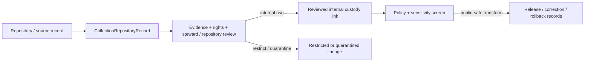

<!-- [KFM_META_BLOCK_V2]
doc_id: kfm://contract/domains/archaeology/collection-repository-record
title: contracts/domains/archaeology/collection_repository_record.md — CollectionRepositoryRecord Contract
type: contract
version: v0.2
status: draft
owners: OWNER_TBD — Archaeology steward · Contract steward · Evidence steward · Schema steward · Policy steward · Review steward · Validation steward · Release steward · Docs steward
created: 2026-06-20
updated: 2026-06-20
policy_label: public; contracts; domains; archaeology; collection-repository-record; semantic-contract; sensitive-lane
tags: [kfm, contracts, archaeology, collection, repository, accession, curation, evidence, review, policy, sensitivity, lifecycle, governance]
related:
  - ./README.md
  - ./OBJECT_MAP.md
  - ./archaeological_site.md
  - ./artifact_record.md
  - ./sample.md
  - ./provenience_context.md
  - ./chronology_assertion.md
  - ./steward_review.md
  - ./cultural_review.md
  - ../../../docs/domains/archaeology/MISSING_OR_PLANNED_FILES.md
  - ../../../docs/domains/archaeology/CANONICAL_PATHS.md
  - ../../../docs/domains/archaeology/ARCHITECTURE.md
  - ../../../docs/domains/archaeology/DATA_LIFECYCLE.md
  - ../../../schemas/contracts/v1/domains/archaeology/collection_repository_record.schema.json
  - ../../../policy/sensitivity/archaeology/
  - ../../../data/proofs/
  - ../../../release/
notes:
  - "Expanded from a planned-file scaffold into the object-level CollectionRepositoryRecord semantic contract."
  - "The paired schema is currently a PROPOSED scaffold with empty properties and additionalProperties enabled."
  - "OBJECT_MAP.md maps the older corpus term CollectionAccession to CollectionRepositoryRecord as CONFLICTED / NEEDS VERIFICATION."
  - "This contract defines collection/repository linkage meaning; it does not authorize disclosure of sensitive holdings, repository security details, exact provenience, or restricted accession information."
[/KFM_META_BLOCK_V2] -->

<a id="top"></a>

# CollectionRepositoryRecord Contract

> Semantic contract for `CollectionRepositoryRecord`, the Archaeology-domain object representing a governed link between archaeology materials, records, samples, artifacts, documentation, or accessions and the repository or custody context responsible for holding, curating, describing, restricting, or making them available.

<p>
  
  
  
  
  
  
</p>

`contracts/domains/archaeology/collection_repository_record.md`

## Quick jumps

[Status](#status) · [Meaning](#meaning) · [Repo fit](#repo-fit) · [Naming boundary](#naming-boundary) · [Schema posture](#schema-posture) · [Accepted uses](#accepted-uses) · [Exclusions](#exclusions) · [Recommended fields](#recommended-fields) · [Invariants](#invariants) · [Lifecycle](#lifecycle) · [Validation](#validation) · [Evidence basis](#evidence-basis) · [Rollback](#rollback) · [Definition of done](#definition-of-done)

---

## Status

> [!IMPORTANT]
> **Status:** `draft` / semantic contract  
> **Owner:** `OWNER_TBD`  
> **Contract path:** `contracts/domains/archaeology/collection_repository_record.md`  
> **Schema path:** `schemas/contracts/v1/domains/archaeology/collection_repository_record.schema.json`  
> **Truth posture:** `CONFIRMED` target path, current update, paired scaffold schema, object-map entry, archaeology contract-directory README, archaeology canonical-paths doctrine, and uploaded authoring guidance. Validator behavior, fixtures, policy behavior, source registry behavior, evidence-bundle implementation, review workflow, release workflow, API behavior, UI behavior, and repository-institution source authority remain `NEEDS VERIFICATION`.

> [!CAUTION]
> This contract defines object meaning only. It does **not** authorize publication, review approval, policy approval, proof closure, repository-security disclosure, exact provenience disclosure, restricted holdings disclosure, public rendering, or access to controlled collection details.

---

## Meaning

`CollectionRepositoryRecord` is the Archaeology-domain object for a governed custody, curation, repository, or collection-linkage claim.

It records that one or more archaeology objects, samples, artifacts, documentation units, reports, accessions, catalog entries, or derived records are associated with a repository or collection context, while preserving:

- source and source-role context;
- custody or repository claim support;
- collection/accession identifiers where allowed;
- rights and access constraints;
- sensitivity posture;
- review state;
- lifecycle state;
- correction, supersession, and rollback lineage.

It is not:

- an artifact record by itself;
- a sample record by itself;
- a raw accession export;
- a public holdings inventory;
- a proof that all linked items are complete, accessible, or public;
- an EvidenceBundle;
- a PolicyDecision;
- a ReviewRecord;
- a ReleaseManifest;
- permission to reveal repository security detail, restricted accession identifiers, exact provenience, culturally restricted holdings, or looting-risk information.

---

## Repo fit

```text
contracts/
└── domains/
    └── archaeology/
        ├── README.md
        ├── OBJECT_MAP.md
        ├── artifact_record.md
        ├── sample.md
        └── collection_repository_record.md
```

Adjacent roots and object families:

| Root or object | Relationship |
|---|---|
| `./README.md` | Archaeology semantic-contract directory boundary. |
| `./OBJECT_MAP.md` | Maps `CollectionRepositoryRecord` to this contract and the expected schema. |
| `./artifact_record.md` | Artifact object that may cite collection/repository custody. |
| `./sample.md` | Sample object that may cite repository or curation custody. |
| `./provenience_context.md` | Context object whose sensitive detail must not be exposed through collection linkage. |
| `./archaeological_site.md` | Site identity that may relate to collections through governed evidence and review. |
| `./chronology_assertion.md` | Temporal interpretation that may cite samples or collections as supporting evidence. |
| `./steward_review.md`, `./cultural_review.md` | Review objects required before consequential exposure or access-state changes. |
| `../../../schemas/contracts/v1/domains/archaeology/collection_repository_record.schema.json` | Current scaffold schema. |
| `../../../policy/sensitivity/archaeology/` | Policy gate home; behavior not verified here. |
| `../../../data/proofs/` | EvidenceBundle/proof support. |
| `../../../release/` | Release, correction, supersession, and rollback authority. |

---

## Naming boundary

`OBJECT_MAP.md` records a naming reconciliation issue: the corpus term `CollectionAccession` likely maps to `CollectionRepositoryRecord`, but that mapping remains `CONFLICTED / NEEDS VERIFICATION`.

This contract therefore uses the decomposed object-family name `CollectionRepositoryRecord` and treats `CollectionAccession` as lineage vocabulary unless an accepted ADR, object-map update, or schema revision makes it a separate object family.

| Term | Treatment in this contract |
|---|---|
| `CollectionRepositoryRecord` | Current contract object name. |
| `CollectionAccession` | `LINEAGE / CONFLICTED` term; may be a field, subtype, or separate future object after review. |
| `Repository` | Institution, collection home, archive, lab, curation facility, steward-controlled repository, or source-designated custody context. |
| `Accession identifier` | Potentially sensitive identifier; must be rights- and policy-gated before exposure. |

---

## Schema posture

The paired schema found for this contract is:

```text
schemas/contracts/v1/domains/archaeology/collection_repository_record.schema.json
```

Current schema evidence:

| Schema fact | Status |
|---|---|
| Schema file exists | `CONFIRMED` |
| Schema title is `Collection Repository Record` | `CONFIRMED` |
| Schema status is `PROPOSED` | `CONFIRMED` |
| Schema properties are empty | `CONFIRMED` |
| `additionalProperties` is `true` | `CONFIRMED` |
| Schema `contract_doc` points to this contract | `CONFIRMED` |
| Validator implementation | `UNKNOWN / NOT FOUND IN THIS TASK` |

This contract therefore defines semantic expectations for future schema and validator work. It does not claim that machine validation currently enforces those expectations.

---

## Accepted uses

| Use | Allowed? | Rule |
|---|---:|---|
| Defining the meaning of a collection/repository linkage object | Yes | Must preserve custody, rights, evidence, sensitivity, review, and lifecycle posture. |
| Linking artifacts, samples, records, reports, accessions, or documentation to a repository context | Conditional | Requires source/evidence references and access/sensitivity posture. |
| Supporting internal curation, provenance, or audit review | Yes | Must keep restricted identifiers and locations controlled. |
| Supporting public collection summaries | Conditional | Requires policy, review, public-safe transform, and release records. |
| Treating repository association as proof of archaeological interpretation | No | Custody is not interpretation proof by itself. |
| Treating accession or catalog identifiers as automatically public | No | Identifiers may expose sensitive collection, site, owner, or security context. |
| Publishing exact provenience through collection linkage | No | Exact provenience remains policy-gated and fail-closed. |
| Using schema validity as proof of truth | No | Schema shape is not evidence proof. |
| Treating this contract as release approval | No | Release authority remains separate. |

---

## Exclusions

| Does not belong in this contract | Correct home |
|---|---|
| Machine field shape | `../../../schemas/contracts/v1/domains/archaeology/collection_repository_record.schema.json`. |
| Validator implementation | `../../../tools/validators/...`. |
| Fixtures and tests | `../../../fixtures/...`, `../../../tests/...`. |
| Source registry records | `../../../data/registry/sources/`. |
| Raw accession exports, repository spreadsheets, or restricted catalog dumps | `../../../data/raw/`, `../../../data/work/`, or `../../../data/quarantine/`, subject to lifecycle and sensitivity rules. |
| Artifact, sample, context, or site record content | Respective archaeology object contracts and lifecycle data roots. |
| EvidenceBundle/proof content | `../../../data/proofs/`. |
| Sensitivity, access, or release policy | `../../../policy/...`. |
| Steward/cultural review records | Governance/review contract and record homes. |
| Release manifests, correction notices, rollback cards | `../../../release/`. |
| Public layer or UI implementation | Governed app/API/UI/layer roots. |

---

## Recommended fields

The current schema does not require these fields. They are `PROPOSED` semantic requirements for future schema/validator work:

| Field | Meaning |
|---|---|
| `collection_repository_record_id` | Stable deterministic or steward-assigned custody/collection-linkage identity. |
| `repository_ref` | Governed reference to the holding repository, archive, curation facility, lab, steward repository, or source-designated custody context. |
| `repository_role` | Holding institution, originating repository, temporary custodian, reporting repository, lab, archive, steward repository, or other reviewed role. |
| `linked_object_refs` | ArtifactRecord, Sample, ProvenienceContext, ArchaeologicalSite, report, accession, or documentation references. |
| `accession_or_catalog_refs` | Accession, catalog, lot, box, shelf, specimen, sample, or collection references where allowed. |
| `identifier_visibility` | Public, generalized, internal, restricted, redacted, or denied visibility posture for identifiers. |
| `custody_status` | Held, transferred, loaned, missing, returned, repatriated, deaccessioned, unknown, or needs review. |
| `rights_state` | Rights, ownership, custody, cultural restriction, access, or terms-of-use posture. |
| `access_conditions` | Who may inspect, cite, export, or publish linked details. |
| `source_refs` | SourceDescriptor/source record references. |
| `source_roles` | Source roles supporting, contextualizing, or contesting the custody/repository claim. |
| `evidence_refs` | EvidenceRef/EvidenceBundle references. |
| `review_state` | Intake, needs review, under review, accepted for internal use, rejected, superseded, or release-candidate state. |
| `review_refs` | StewardReview, CulturalReview, repository review, or other review record references. |
| `policy_state` | Policy posture or policy-decision reference. |
| `sensitivity_class` | Sensitivity/public-safety classification, especially for restricted holdings, exact provenience, sacred/burial contexts, or collection security. |
| `release_refs` | Release/candidate linkage where applicable. |
| `correction_refs` | Correction/supersession/rollback lineage. |
| `spec_hash` | Integrity pin for the representation. |

---

## Invariants

`CollectionRepositoryRecord` must preserve these invariants:

- collection/repository linkage is not archaeological interpretation proof by itself;
- custody, repository, and accession claims must remain source- and evidence-bound;
- older `CollectionAccession` vocabulary remains lineage/conflicted until explicitly resolved;
- exact provenience, restricted identifiers, repository-security details, and culturally sensitive holdings fail closed unless policy and review authorize a public-safe transform;
- rights, access, custody, review, and release posture must remain inspectable;
- repository association must not bypass EvidenceBundle, PolicyDecision, ReviewRecord, or ReleaseManifest requirements;
- schema validity is not evidence proof;
- evidence, policy, review, release, correction, and rollback objects remain separate families;
- public-facing use must be downstream of governed release artifacts and public-safe transforms;
- publication is a governed state transition, not a file move.

---

## Lifecycle



The contract defines the meaning of a collection/repository linkage object. It does not replace source intake, evidence resolution, rights review, repository review, steward review, schema validation, policy enforcement, release approval, correction, or rollback systems.

---

## Validation

Before relying on this contract, verify:

- schema fields beyond scaffold status;
- validator implementation and fixture coverage;
- canonical collection/repository identity rules;
- whether `CollectionAccession` remains a field/subtype or becomes a separate contract;
- repository identifier and accession visibility rules;
- EvidenceRef/EvidenceBundle requirements;
- rights, custody, access, and review-record requirements;
- sensitivity handling for restricted holdings, exact provenience, culturally restricted collections, and collection-security details;
- policy-gate requirements;
- release, correction, supersession, and rollback linkage;
- no downstream surface treats this contract as public disclosure permission, final custody proof, or interpretation proof.

---

## Evidence basis

| Source | Status | Supports | Limits |
|---|---|---|---|
| Prior `collection_repository_record.md` scaffold | `CONFIRMED` | Target file existed and was sourced from the planned-files ledger. | Scaffold did not define authoritative semantics. |
| `collection_repository_record.schema.json` | `CONFIRMED scaffold` | Schema exists, is `PROPOSED`, has empty properties, and points to this contract. | Does not enforce full collection/repository semantics. |
| `OBJECT_MAP.md` | `CONFIRMED current map` | Maps `CollectionRepositoryRecord` to `collection_repository_record.md` and `collection_repository_record.schema.json`; records `CollectionAccession` as conflicted lineage vocabulary. | Map marks rows `NEEDS VERIFICATION`. |
| `README.md` in this directory | `CONFIRMED current boundary` | States this directory defines semantic meaning only and preserves contracts/schemas/policy separation. | Does not prove schema, validator, policy, or release behavior. |
| `CANONICAL_PATHS.md` | `CONFIRMED path doctrine / PROPOSED path realizations` | Reconciles archaeology contract/schema path form to `contracts/domains/archaeology/` and `schemas/contracts/v1/domains/archaeology/`; marks sensitive-lane posture. | Does not authorize release or prove all paths exist. |
| Uploaded authoring prompt v2 | `CONFIRMED user-supplied guidance` | Requires evidence-grounded, implementation-honest Markdown with verification and rollback posture. | Authoring guidance, not implementation proof. |

---

## Rollback

Rollback is required if this contract is used to claim schema completeness, validator coverage, policy enforcement, review completion, release execution, API/UI behavior, repository-source authority, custody certainty, public disclosure permission, exact-provenience authorization, restricted identifier release, or implementation maturity not verified in this task.

Rollback target: prior scaffold blob SHA `da66beac79dd0f8f87d730d147cab13b3e3626f8`.

---

## Definition of done

- [ ] Owners are confirmed and `OWNER_TBD` is replaced.
- [ ] Collection/repository vocabulary is reviewed by the Archaeology steward and any repository/custody steward.
- [ ] `CollectionAccession` naming conflict is resolved or explicitly retained as lineage/conflicted vocabulary.
- [ ] Paired JSON Schema is expanded from scaffold status.
- [ ] Valid and invalid fixtures cover public, internal, restricted, redacted, transferred, loaned, returned, repatriated, missing, superseded, and release-candidate states.
- [ ] Validator enforces required repository, linked-object, source, evidence, rights, access, review, sensitivity, and policy fields.
- [ ] Fixtures avoid sensitive exact-provenience disclosure, repository-security detail, restricted accession identifiers, and culturally restricted detail.
- [ ] EvidenceBundle, PolicyDecision, ReviewRecord, PublicationTransformReceipt, ReleaseManifest, CorrectionNotice, and RollbackCard references are validated where required.
- [ ] API/UI surfaces prove they cannot treat collection linkage as public disclosure permission or interpretation proof.
- [ ] Release and rollback dry-runs prove this contract cannot bypass publication gates.

## Status summary

`CollectionRepositoryRecord` is a sensitive Archaeology collection/custody-linkage object. It can support internal curation, evidence review, cataloging, and public-safe explanation when evidence, rights, review, and policy allow, but it is not artifact truth, not source truth, not interpretation proof, not review approval, not policy approval, and not release approval.

<p align="right"><a href="#top">Back to top</a></p>
