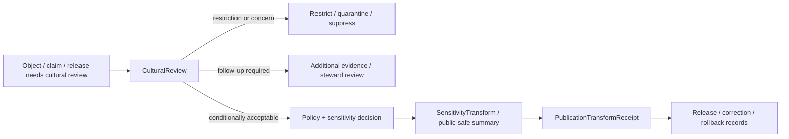

<!-- [KFM_META_BLOCK_V2]
doc_id: kfm://contract/domains/archaeology/cultural-review
title: contracts/domains/archaeology/cultural_review.md — CulturalReview Contract
type: contract
version: v0.2
status: draft
owners: OWNER_TBD — Archaeology steward · Cultural review steward · Contract steward · Evidence steward · Schema steward · Policy steward · Validation steward · Release steward · Docs steward
created: 2026-06-20
updated: 2026-06-20
policy_label: public; contracts; domains; archaeology; cultural-review; semantic-contract; sensitive-lane
tags: [kfm, contracts, archaeology, cultural-review, review, sovereignty, sensitivity, evidence, policy, lifecycle, governance]
related:
  - ./README.md
  - ./OBJECT_MAP.md
  - ./archaeological_site.md
  - ./candidate_feature.md
  - ./steward_review.md
  - ./sensitivity_transform.md
  - ./publication_transform_receipt.md
  - ./collection_repository_record.md
  - ./provenience_context.md
  - ./chronology_assertion.md
  - ../../../docs/domains/archaeology/MISSING_OR_PLANNED_FILES.md
  - ../../../docs/domains/archaeology/CANONICAL_PATHS.md
  - ../../../docs/domains/archaeology/ARCHITECTURE.md
  - ../../../docs/domains/archaeology/DATA_LIFECYCLE.md
  - ../../../schemas/contracts/v1/domains/archaeology/cultural_review.schema.json
  - ../../../policy/sensitivity/archaeology/
  - ../../../data/proofs/
  - ../../../release/
notes:
  - "Expanded from a planned-file scaffold into the object-level CulturalReview semantic contract."
  - "The paired schema is currently a PROPOSED scaffold with empty properties and additionalProperties enabled."
  - "CulturalReview records a governed review posture; it is not legal advice, automatic consent, release approval, or publication permission."
  - "Review participant identity, culturally sensitive detail, sacred/burial context, sovereignty-related information, and exact location must remain policy-gated and fail closed."
[/KFM_META_BLOCK_V2] -->

<a id="top"></a>

# CulturalReview Contract

> Semantic contract for `CulturalReview`, the Archaeology-domain object representing a governed review record for culturally sensitive, sovereignty-related, community-held, sacred, burial, collection, access, publication, or interpretive concerns attached to an archaeology object or claim.

<p>
  
  
  
  
  
  
</p>

`contracts/domains/archaeology/cultural_review.md`

## Quick jumps

[Status](#status) · [Meaning](#meaning) · [Repo fit](#repo-fit) · [Cultural boundary](#cultural-boundary) · [Schema posture](#schema-posture) · [Accepted uses](#accepted-uses) · [Exclusions](#exclusions) · [Recommended fields](#recommended-fields) · [Invariants](#invariants) · [Lifecycle](#lifecycle) · [Validation](#validation) · [Evidence basis](#evidence-basis) · [Rollback](#rollback) · [Definition of done](#definition-of-done)

---

## Status

> [!IMPORTANT]
> **Status:** `draft` / semantic contract  
> **Owner:** `OWNER_TBD`  
> **Contract path:** `contracts/domains/archaeology/cultural_review.md`  
> **Schema path:** `schemas/contracts/v1/domains/archaeology/cultural_review.schema.json`  
> **Truth posture:** `CONFIRMED` target path, current update, paired scaffold schema, object-map entry, archaeology contract-directory README, archaeology canonical-paths doctrine, and uploaded authoring guidance. Validator behavior, fixtures, policy behavior, source registry behavior, evidence-bundle implementation, review workflow, release workflow, API behavior, UI behavior, and any real-world consultation or consent workflow remain `NEEDS VERIFICATION`.

> [!CAUTION]
> This contract defines object meaning only. It does **not** authorize publication, review approval, cultural consent, legal compliance, policy approval, proof closure, exact-location exposure, sacred/burial disclosure, controlled participant disclosure, or release of restricted cultural knowledge.

---

## Meaning

`CulturalReview` is the Archaeology-domain object for a culturally significant review posture. It records review state, concerns, restrictions, recommendations, abstentions, objections, approvals, conditions, or required follow-up related to an archaeology object or claim where cultural sensitivity, sovereignty, community-held knowledge, sacred places, burial contexts, repatriation, collection access, narrative framing, or publication exposure may matter.

A cultural review may apply to:

- `ArchaeologicalSite` records;
- `CandidateFeature` objects;
- `ProvenienceContext` or `StratigraphicUnit` objects;
- `ArtifactRecord`, `Sample`, or `CollectionRepositoryRecord` objects;
- `ChronologyAssertion` or interpretation claims;
- proposed map labels, summaries, stories, releases, or public-safe transforms;
- correction, takedown, suppression, or rollback requests.

It represents a governed review record. It is not:

- a substitute for evidence;
- a substitute for policy enforcement;
- a substitute for legal advice or legal compliance;
- automatic consent from any person, community, tribe, nation, repository, steward, or authority;
- a public release artifact;
- a direct publication permit;
- a source record;
- an EvidenceBundle;
- a PolicyDecision;
- a ReleaseManifest;
- permission to disclose restricted cultural knowledge, living-person detail, sacred/burial context, exact location, or sensitive collection detail.

---

## Repo fit

```text
contracts/
└── domains/
    └── archaeology/
        ├── README.md
        ├── OBJECT_MAP.md
        ├── cultural_review.md
        └── steward_review.md
```

Adjacent roots and object families:

| Root or object | Relationship |
|---|---|
| `./README.md` | Archaeology semantic-contract directory boundary. |
| `./OBJECT_MAP.md` | Maps `CulturalReview` to this contract and the expected schema. |
| `./steward_review.md` | Adjacent review family for steward/domain review; currently still scaffold in this task. |
| `./sensitivity_transform.md` | Expected transform family that may be required after review. |
| `./publication_transform_receipt.md` | Expected receipt family for public-safe transform lineage. |
| `./archaeological_site.md` | Site identity that may require cultural review before promotion or release. |
| `./candidate_feature.md` | Candidate object that may require cultural review before confirmation or exposure. |
| `./collection_repository_record.md` | Collection/custody linkage that may require cultural review before access or summary. |
| `../../../schemas/contracts/v1/domains/archaeology/cultural_review.schema.json` | Current scaffold schema. |
| `../../../policy/sensitivity/archaeology/` | Policy gate home; behavior not verified here. |
| `../../../data/proofs/` | EvidenceBundle/proof support. |
| `../../../release/` | Release, correction, supersession, and rollback authority. |

---

## Cultural boundary

`CulturalReview` must preserve the difference between a review record and the sensitive cultural knowledge, identity, context, or decision process that may inform it.

| Boundary | Rule |
|---|---|
| Review record vs. sensitive knowledge | The record may summarize governed outcomes without exposing restricted details. |
| Review state vs. consent | A review state is not automatic consent unless a governed consent/authorization object explicitly says so. |
| Review recommendation vs. policy decision | A recommendation informs policy; it does not replace `PolicyDecision`. |
| Review concern vs. evidence proof | A concern can gate release or trigger review, but it is not an archaeological evidence proof by itself. |
| Public summary vs. internal record | Public summaries must be reviewed, transformed, and released separately. |
| Participant identity vs. role | Public surfaces should prefer role/category where participant identity is not cleared for disclosure. |

---

## Schema posture

The paired schema found for this contract is:

```text
schemas/contracts/v1/domains/archaeology/cultural_review.schema.json
```

Current schema evidence:

| Schema fact | Status |
|---|---|
| Schema file exists | `CONFIRMED` |
| Schema title is `Cultural Review` | `CONFIRMED` |
| Schema status is `PROPOSED` | `CONFIRMED` |
| Schema properties are empty | `CONFIRMED` |
| `additionalProperties` is `true` | `CONFIRMED` |
| Schema `contract_doc` points to this contract | `CONFIRMED` |
| Validator implementation | `UNKNOWN / NOT FOUND IN THIS TASK` |

This contract therefore defines semantic expectations for future schema and validator work. It does not claim that machine validation currently enforces those expectations.

---

## Accepted uses

| Use | Allowed? | Rule |
|---|---:|---|
| Defining the meaning of a cultural review object | Yes | Must preserve review state, sensitivity, source/evidence links, policy links, and lifecycle posture. |
| Recording internal cultural review status | Conditional | Must use controlled identifiers and avoid exposing restricted details. |
| Recording review recommendations, restrictions, abstentions, objections, or required follow-up | Conditional | Must distinguish recommendation from policy decision and release approval. |
| Supporting sensitivity transforms or release review | Conditional | Requires policy checks and release/receipt linkage before public use. |
| Supporting correction, takedown, suppression, or rollback review | Yes | Must preserve correction and rollback lineage. |
| Treating cultural review as archaeological proof | No | Review state is not evidence proof by itself. |
| Treating cultural review as legal compliance or consent | No | Legal/consent/authorization requirements need separate governed evidence and review. |
| Publishing sensitive details from the review record | No | Restricted knowledge, exact locations, participant identities, and sacred/burial detail fail closed. |
| Using schema validity as proof of truth | No | Schema shape is not evidence proof. |
| Treating this contract as release approval | No | Release authority remains separate. |

---

## Exclusions

| Does not belong in this contract | Correct home |
|---|---|
| Machine field shape | `../../../schemas/contracts/v1/domains/archaeology/cultural_review.schema.json`. |
| Validator implementation | `../../../tools/validators/...`. |
| Fixtures and tests | `../../../fixtures/...`, `../../../tests/...`. |
| Raw consultation notes, sensitive cultural knowledge, or controlled participant details | `../../../data/quarantine/` or another governed restricted root after policy review. |
| Source registry records | `../../../data/registry/sources/`. |
| EvidenceBundle/proof content | `../../../data/proofs/`. |
| Policy decisions, access rules, or release rules | `../../../policy/...`. |
| Consent/authorization records if modeled separately | Governance/policy/legal/authorization contract homes after review. |
| Release manifests, correction notices, rollback cards | `../../../release/`. |
| Public layer, UI, or AI response behavior | Governed app/API/UI/layer roots. |

---

## Recommended fields

The current schema does not require these fields. They are `PROPOSED` semantic requirements for future schema/validator work:

| Field | Meaning |
|---|---|
| `cultural_review_id` | Stable deterministic or steward-assigned cultural review identity. |
| `subject_refs` | Objects, claims, releases, transforms, or corrections under review. |
| `review_scope` | Site, candidate, collection, artifact, sample, context, interpretation, map release, public summary, correction, rollback, or other reviewed scope. |
| `review_role` | Internal steward, cultural reviewer, repository reviewer, community reviewer, tribal/nation reviewer, domain reviewer, or other approved role. |
| `review_participant_refs` | Controlled references to reviewers or review bodies where disclosure is allowed. |
| `participant_visibility` | Public, role-only, internal, restricted, redacted, or denied visibility posture. |
| `review_state` | Requested, pending, in review, abstain, concern raised, conditionally acceptable, restricted, denied, accepted for internal use, release-candidate, superseded, or withdrawn. |
| `review_outcome` | Structured outcome summary suitable for policy and release workflows. |
| `restriction_summary` | Public-safe or internal-only summary of restrictions. |
| `sensitive_detail_refs` | Controlled references to restricted detail, not inline exposure. |
| `required_actions` | Follow-up review, redaction, generalization, suppression, consultation, correction, rollback, or release-blocking actions. |
| `policy_refs` | PolicyDecision or policy rule references. |
| `source_refs` | SourceDescriptor/source record references. |
| `evidence_refs` | EvidenceRef/EvidenceBundle references. |
| `review_refs` | Related CulturalReview, StewardReview, repository review, or correction review references. |
| `sensitivity_class` | Sensitivity/public-safety classification. |
| `release_refs` | Release/candidate linkage where applicable. |
| `correction_refs` | Correction/supersession/rollback lineage. |
| `valid_time` | Time range the review outcome applies to, if bounded. |
| `review_time` | Time the review was performed or recorded. |
| `spec_hash` | Integrity pin for the representation. |

---

## Invariants

`CulturalReview` must preserve these invariants:

- cultural review is a governed review record, not evidence proof by itself;
- review state must not be converted into consent, legal compliance, or release approval without separate governed support;
- sensitive cultural knowledge should be referenced or summarized safely, not exposed inline by default;
- participant identity, tribal/nation/community identity, sacred/burial detail, exact location, and collection-security information fail closed unless release is explicitly authorized;
- review recommendations inform but do not replace policy decisions;
- review outcomes must remain linked to evidence, policy, release, correction, and rollback lineage where consequential;
- schema validity is not evidence proof;
- evidence, policy, review, release, correction, and rollback objects remain separate families;
- public-facing use must be downstream of governed release artifacts and public-safe transforms;
- publication is a governed state transition, not a file move.

---

## Lifecycle



The contract defines the meaning of a cultural review record. It does not replace source intake, evidence resolution, policy enforcement, consent/authorization review, schema validation, release approval, correction, takedown, suppression, or rollback systems.

---

## Validation

Before relying on this contract, verify:

- schema fields beyond scaffold status;
- validator implementation and fixture coverage;
- canonical cultural review identity rules;
- accepted review-state vocabulary;
- participant identity and role-visibility rules;
- EvidenceRef/EvidenceBundle requirements;
- PolicyDecision linkage requirements;
- consent/authorization modeling boundary, if any;
- sensitivity handling for sacred/burial contexts, sovereignty-related information, restricted cultural knowledge, participant identity, collection security, exact location, and public summaries;
- transform receipt requirements for any public-safe output;
- release, correction, suppression, takedown, supersession, and rollback linkage;
- no downstream surface treats this contract as public disclosure permission, legal compliance, consent, final proof, or release approval.

---

## Evidence basis

| Source | Status | Supports | Limits |
|---|---|---|---|
| Prior `cultural_review.md` scaffold | `CONFIRMED` | Target file existed and was sourced from the planned-files ledger. | Scaffold did not define authoritative semantics. |
| `cultural_review.schema.json` | `CONFIRMED scaffold` | Schema exists, is `PROPOSED`, has empty properties, and points to this contract. | Does not enforce full cultural-review semantics. |
| `OBJECT_MAP.md` | `CONFIRMED current map` | Maps `CulturalReview` to `cultural_review.md` and `cultural_review.schema.json`. | Map marks rows `NEEDS VERIFICATION`. |
| `README.md` in this directory | `CONFIRMED current boundary` | States this directory defines semantic meaning only and preserves contracts/schemas/policy separation. | Does not prove schema, validator, policy, or release behavior. |
| `CANONICAL_PATHS.md` | `CONFIRMED path doctrine / PROPOSED path realizations` | Reconciles archaeology contract/schema path form to `contracts/domains/archaeology/` and `schemas/contracts/v1/domains/archaeology/`; marks sensitive-lane posture. | Does not authorize release or prove all paths exist. |
| Uploaded authoring prompt v2 | `CONFIRMED user-supplied guidance` | Requires evidence-grounded, implementation-honest Markdown with verification and rollback posture. | Authoring guidance, not implementation proof. |

---

## Rollback

Rollback is required if this contract is used to claim schema completeness, validator coverage, policy enforcement, review completion, release execution, API/UI behavior, consent/authorization, legal compliance, cultural approval, public disclosure permission, exact-location authorization, sacred/burial disclosure, restricted knowledge exposure, or implementation maturity not verified in this task.

Rollback target: prior scaffold blob SHA `3f1b20d7cb05fee8ac756caa62e6cbe167338806`.

---

## Definition of done

- [ ] Owners are confirmed and `OWNER_TBD` is replaced.
- [ ] Cultural review vocabulary is reviewed by the Archaeology steward and cultural-review steward.
- [ ] Boundary between `CulturalReview`, `StewardReview`, `PolicyDecision`, and any consent/authorization object is accepted.
- [ ] Paired JSON Schema is expanded from scaffold status.
- [ ] Valid and invalid fixtures cover pending, concern-raised, conditionally acceptable, restricted, denied, abstain, superseded, correction, suppression, rollback, and release-candidate states.
- [ ] Validator enforces subject, review scope, participant visibility, source/evidence, policy, sensitivity, review-state, and release/correction linkage fields.
- [ ] Fixtures avoid sensitive exact-location disclosure, sacred/burial detail, controlled participant identities, restricted cultural knowledge, and collection-security detail.
- [ ] EvidenceBundle, PolicyDecision, ReviewRecord, SensitivityTransform, PublicationTransformReceipt, ReleaseManifest, CorrectionNotice, and RollbackCard references are validated where required.
- [ ] API/UI surfaces prove they cannot treat cultural review as consent, legal compliance, final proof, or release approval.
- [ ] Release and rollback dry-runs prove this contract cannot bypass publication gates.

## Status summary

`CulturalReview` is a sensitive Archaeology review object. It can help govern culturally significant review, restriction, transformation, correction, and release decisions when evidence and policy allow, but it is not evidence proof, not consent, not legal compliance, not cultural approval by itself, not policy approval, and not release approval.

<p align="right"><a href="#top">Back to top</a></p>
