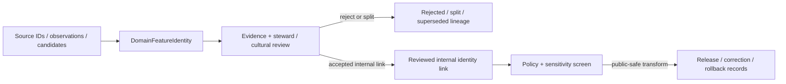

<!-- [KFM_META_BLOCK_V2]
doc_id: kfm://contract/domains/archaeology/domain-feature-identity
title: contracts/domains/archaeology/domain_feature_identity.md — DomainFeatureIdentity Contract
type: contract
version: v0.2
status: draft
owners: OWNER_TBD — Archaeology steward · Identity steward · Contract steward · Evidence steward · Schema steward · Policy steward · Validation steward · Release steward · Docs steward
created: 2026-06-20
updated: 2026-06-20
policy_label: public; contracts; domains; archaeology; domain-feature-identity; semantic-contract; identity; sensitive-lane
tags: [kfm, contracts, archaeology, identity, feature, candidate, entity-resolution, evidence, review, policy, sensitivity, lifecycle, governance]
related:
  - ./README.md
  - ./OBJECT_MAP.md
  - ./archaeological_site.md
  - ./site_component.md
  - ./candidate_feature.md
  - ./remote_sensing_anomaly.md
  - ./lidar_candidate.md
  - ./geophysics_observation.md
  - ./provenience_context.md
  - ./sensitivity_transform.md
  - ./publication_transform_receipt.md
  - ../../../docs/domains/archaeology/MISSING_OR_PLANNED_FILES.md
  - ../../../docs/domains/archaeology/CANONICAL_PATHS.md
  - ../../../docs/domains/archaeology/ARCHITECTURE.md
  - ../../../docs/domains/archaeology/DATA_LIFECYCLE.md
  - ../../../schemas/contracts/v1/domains/archaeology/domain_feature_identity.schema.json
  - ../../../policy/sensitivity/archaeology/
  - ../../../data/proofs/
  - ../../../release/
notes:
  - "Expanded from a greenfield contract scaffold into the object-level DomainFeatureIdentity semantic contract."
  - "The paired schema is a PROPOSED greenfield stub with minimal fields: id, version, and spec_hash."
  - "Repository search found this contract, its schema, and SKELETON_MAP.md; no current OBJECT_MAP.md row was found for DomainFeatureIdentity in this task."
  - "DomainFeatureIdentity is an identity/crosswalk object, not site confirmation, public geometry, policy approval, or release approval."
[/KFM_META_BLOCK_V2] -->

<a id="top"></a>

# DomainFeatureIdentity Contract

> Semantic contract for `DomainFeatureIdentity`, the Archaeology-domain identity object used to keep feature-like archaeology entities, candidates, observations, aliases, source identifiers, and identity-resolution decisions traceable without collapsing them into confirmed sites or public geometry.

<p>
  
  
  
  
  
  
</p>

`contracts/domains/archaeology/domain_feature_identity.md`

## Quick jumps

[Status](#status) · [Meaning](#meaning) · [Repo fit](#repo-fit) · [Identity boundary](#identity-boundary) · [Schema posture](#schema-posture) · [Accepted uses](#accepted-uses) · [Exclusions](#exclusions) · [Recommended fields](#recommended-fields) · [Invariants](#invariants) · [Lifecycle](#lifecycle) · [Validation](#validation) · [Evidence basis](#evidence-basis) · [Rollback](#rollback) · [Definition of done](#definition-of-done)

---

## Status

> [!IMPORTANT]
> **Status:** `draft` / semantic contract  
> **Owner:** `OWNER_TBD`  
> **Contract path:** `contracts/domains/archaeology/domain_feature_identity.md`  
> **Schema path:** `schemas/contracts/v1/domains/archaeology/domain_feature_identity.schema.json`  
> **Truth posture:** `CONFIRMED` target path, current update, paired greenfield schema stub, schema fields, Directory Rules placement basis, greenfield skeleton-map lineage, and uploaded authoring guidance. Object-map registration, validator implementation, fixtures, policy behavior, source registry behavior, evidence-bundle implementation, review workflow, release workflow, API behavior, and UI behavior remain `NEEDS VERIFICATION`.

> [!CAUTION]
> This contract defines object meaning only. It does **not** authorize publication, site confirmation, identity merge approval, policy approval, proof closure, exact-location exposure, public rendering, or release of sensitive archaeology identifiers.

---

## Meaning

`DomainFeatureIdentity` is the Archaeology-domain object for stable identity and crosswalk management around feature-like archaeology entities.

It may connect or distinguish:

- `CandidateFeature` objects;
- `SiteComponent` objects;
- `ArchaeologicalSite` references;
- `RemoteSensingAnomaly`, `LiDARCandidate`, and `GeophysicsObservation` observations;
- source-system identifiers, aliases, labels, or local working IDs;
- split, merge, same-as, possible-same-as, duplicate, rejected, superseded, or unresolved identity states.

It exists to preserve identity discipline while evidence, review, sensitivity, and publication status evolve.

It is not:

- a confirmed archaeological site;
- a public feature layer;
- a geometry object;
- an EvidenceBundle;
- a PolicyDecision;
- a ReviewRecord;
- a ReleaseManifest;
- proof that two records are the same entity;
- permission to disclose source identifiers, precise locations, sensitive aliases, or restricted feature relationships.

---

## Repo fit

```text
contracts/
└── domains/
    └── archaeology/
        ├── README.md
        ├── domain_feature_identity.md
        ├── candidate_feature.md
        ├── site_component.md
        └── archaeological_site.md
```

Adjacent roots and object families:

| Root or object | Relationship |
|---|---|
| `./README.md` | Archaeology semantic-contract directory boundary. |
| `./OBJECT_MAP.md` | Expected object-family registry; no `DomainFeatureIdentity` row was found in this task. |
| `./candidate_feature.md` | Candidate object that may receive or cite feature identity. |
| `./site_component.md` | Component object that may be identity-linked to observations or candidate features. |
| `./archaeological_site.md` | Confirmed/reviewed site identity; not created by this object alone. |
| `./remote_sensing_anomaly.md`, `./lidar_candidate.md`, `./geophysics_observation.md` | Observation/candidate objects that may feed identity resolution. |
| `./sensitivity_transform.md` | Expected transform family for public-safe identity exposure. |
| `./publication_transform_receipt.md` | Expected receipt family for public-safe transform lineage. |
| `../../../schemas/contracts/v1/domains/archaeology/domain_feature_identity.schema.json` | Current greenfield schema stub. |
| `../../../policy/sensitivity/archaeology/` | Policy gate home; behavior not verified here. |
| `../../../data/proofs/` | EvidenceBundle/proof support. |
| `../../../release/` | Release, correction, supersession, and rollback authority. |

---

## Identity boundary

`DomainFeatureIdentity` must preserve the difference between identity management and archaeology truth.

| Boundary | Rule |
|---|---|
| Identity record vs. confirmation | Identity linkage does not confirm that an archaeological site exists. |
| Same-as vs. possible-same-as | Probable, possible, contested, and rejected relationships must not collapse into one state. |
| Internal identifier vs. public identifier | Internal IDs, source IDs, aliases, and sensitive labels are not automatically public. |
| Identity merge vs. release | Merge, split, or supersession may update internal lineage but does not publish anything. |
| Identity confidence vs. evidence proof | Confidence supports review; it does not replace EvidenceBundle resolution. |
| Identity graph vs. canonical truth | Graph projections and aliases are downstream carriers, not sovereign truth. |

---

## Schema posture

The paired schema found for this contract is:

```text
schemas/contracts/v1/domains/archaeology/domain_feature_identity.schema.json
```

Current schema evidence:

| Schema fact | Status |
|---|---|
| Schema file exists | `CONFIRMED` |
| Schema title is `domain_feature_identity` | `CONFIRMED` |
| Schema description calls it a greenfield placeholder/stub | `CONFIRMED` |
| Schema status is `PROPOSED` | `CONFIRMED` |
| Schema has `spec_hash` | `CONFIRMED` |
| Schema has `id` | `CONFIRMED` |
| Schema has `version` | `CONFIRMED` |
| Schema requires `id` | `CONFIRMED` |
| `additionalProperties` is `true` | `CONFIRMED` |
| Schema `contract_doc` points to this contract | `CONFIRMED` |
| Schema names an expected validator path | `CONFIRMED` |
| Validator implementation | `UNKNOWN / NOT FOUND IN THIS TASK` |

This contract therefore expands semantic expectations around the existing greenfield stub. It does not claim that machine validation currently enforces these semantics.

---

## Accepted uses

| Use | Allowed? | Rule |
|---|---:|---|
| Defining a stable identity/crosswalk object for archaeology features | Yes | Must preserve source, evidence, review, sensitivity, lifecycle, and correction lineage. |
| Linking candidates, observations, site components, and source IDs | Conditional | Must distinguish asserted, possible, contested, rejected, and superseded identity relations. |
| Supporting merge/split/supersession review | Conditional | Requires evidence and review linkage; does not authorize public release. |
| Supporting internal deduplication or identity-resolution queues | Yes | Must remain internal unless policy/release authorizes public-safe output. |
| Supporting public-safe labels or generalized identity surfaces | Conditional | Requires policy, review, transform receipt, and release record. |
| Treating identity linkage as site confirmation | No | Confirmation requires separate governed review and evidence closure. |
| Publishing sensitive source IDs, aliases, or feature relationships by default | No | Sensitive identifiers fail closed. |
| Using schema validity as proof of identity truth | No | Schema shape is not evidence proof. |
| Treating this contract as release approval | No | Release authority remains separate. |

---

## Exclusions

| Does not belong in this contract | Correct home |
|---|---|
| Machine field shape | `../../../schemas/contracts/v1/domains/archaeology/domain_feature_identity.schema.json`. |
| Validator implementation | `../../../tools/validators/...`. |
| Fixtures and tests | `../../../fixtures/...`, `../../../tests/...`. |
| Raw source IDs, source extracts, or sensitive identity exports | `../../../data/raw/`, `../../../data/work/`, or `../../../data/quarantine/`, subject to lifecycle and sensitivity rules. |
| EvidenceBundle/proof content | `../../../data/proofs/`. |
| Sensitivity, access, merge, or release policy | `../../../policy/...`. |
| Steward/cultural review records | Governance/review contract and record homes. |
| Release manifests, correction notices, rollback cards | `../../../release/`. |
| Public layer or UI implementation | Governed app/API/UI/layer roots. |

---

## Recommended fields

The current schema only requires `id` and defines `version` and `spec_hash`. The remaining fields are `PROPOSED` semantic requirements for future schema/validator work:

| Field | Meaning |
|---|---|
| `id` | Canonical identifier required by the current schema. |
| `version` | Contract or object version currently present in the schema. |
| `spec_hash` | Deterministic content hash currently present in the schema. |
| `domain_feature_identity_id` | Stable deterministic or steward-assigned identity record ID, if distinct from `id`. |
| `identity_subject_refs` | CandidateFeature, SiteComponent, ArchaeologicalSite, observation, source record, or related object references. |
| `identity_relation_type` | Same-as, possible-same-as, duplicate-of, split-from, merged-into, supersedes, rejected-match, alias-of, or unresolved. |
| `identity_scope` | Domain-local, source-local, cross-source, candidate-local, component-local, site-lineage, or release-safe identity scope. |
| `source_identifier_refs` | Source-system IDs, report IDs, collection IDs, aliases, or local working IDs where allowed. |
| `identifier_visibility` | Public, generalized, internal, restricted, redacted, or denied visibility posture. |
| `identity_basis` | Spatial proximity, source crosswalk, observation lineage, steward assertion, artifact/sample linkage, chronology, collection link, or mixed basis. |
| `confidence_statement` | Bounded confidence or uncertainty note. |
| `contradiction_refs` | Competing identity assertions, rejected links, or unresolved conflicts. |
| `source_refs` | SourceDescriptor/source record references. |
| `source_roles` | Source roles supporting, contextualizing, or contesting the identity claim. |
| `evidence_refs` | EvidenceRef/EvidenceBundle references. |
| `review_state` | Intake, needs review, under review, accepted internal link, rejected, split, merged, superseded, quarantined, or release-candidate state. |
| `review_refs` | StewardReview, CulturalReview, or other review record references. |
| `policy_state` | Policy posture or policy-decision reference. |
| `sensitivity_class` | Sensitivity/public-safety classification, especially for source IDs, aliases, exact locations, and culturally sensitive relations. |
| `lineage_refs` | Prior, successor, merge, split, supersession, or rollback identity records. |
| `release_refs` | Release/candidate linkage where applicable. |
| `correction_refs` | Correction/supersession/rollback lineage. |

---

## Invariants

`DomainFeatureIdentity` must preserve these invariants:

- identity linkage is not site confirmation;
- identity confidence is not evidence proof;
- possible, contested, rejected, merged, split, and superseded relationships must remain distinguishable;
- source IDs, aliases, local IDs, and sensitive feature relationships fail closed unless policy and review authorize a public-safe transform;
- identity objects must not bypass CandidateFeature, ArchaeologicalSite, EvidenceBundle, PolicyDecision, ReviewRecord, or ReleaseManifest requirements;
- graph projections, aliases, clusters, and summaries remain downstream carriers, not sovereign truth;
- schema validity is not evidence proof;
- evidence, policy, review, release, correction, and rollback objects remain separate families;
- public-facing use must be downstream of governed release artifacts and public-safe transforms;
- publication is a governed state transition, not a file move.

---

## Lifecycle



The contract defines the meaning of an identity/crosswalk object. It does not replace source intake, evidence resolution, identity review, schema validation, policy enforcement, release approval, correction, or rollback systems.

---

## Validation

Before relying on this contract, verify:

- object-map registration or an explicit reason for leaving it outside `OBJECT_MAP.md`;
- schema fields beyond the current greenfield stub;
- validator implementation and fixture coverage;
- canonical identity generation and deterministic ID rules;
- merge, split, same-as, possible-same-as, rejected, and supersession vocabulary;
- EvidenceRef/EvidenceBundle requirements;
- source-ID and alias visibility rules;
- sensitivity handling for exact location, source identifiers, culturally sensitive aliases, and restricted relationships;
- steward/cultural review requirements;
- policy-gate requirements;
- release, correction, supersession, and rollback linkage;
- no downstream surface treats this contract as public disclosure permission, final identity proof, or site confirmation.

---

## Evidence basis

| Source | Status | Supports | Limits |
|---|---|---|---|
| Prior `domain_feature_identity.md` scaffold | `CONFIRMED` | Target file existed as a greenfield scaffold with semantic headings. | Scaffold did not define authoritative semantics. |
| `domain_feature_identity.schema.json` | `CONFIRMED greenfield stub` | Schema exists, is `PROPOSED`, requires `id`, defines `version` and `spec_hash`, points to this contract, and names expected fixture/validator/policy homes. | Does not enforce full identity semantics. |
| `SKELETON_MAP.md` | `CONFIRMED lineage` | Describes the greenfield skeleton as an expansive scaffold and confirms the split between contracts, schemas, policy, data, release, runtime, and public surfaces. | Skeleton map is orientation/lineage, not proof that validators or workflows exist. |
| `OBJECT_MAP.md` search result | `NEEDS VERIFICATION` | Current repo search for `domain_feature_identity` did not return an object-map row. | Absence from search is not a formal registry decision. |
| Directory Rules | `CONFIRMED placement doctrine` | Confirms `contracts/` defines meaning, `schemas/` defines shape, domain names live as segments inside responsibility roots, and publication remains governed. | Directory Rules do not decide whether this object should exist. |
| Uploaded authoring prompt v2 | `CONFIRMED user-supplied guidance` | Requires evidence-grounded, implementation-honest Markdown with verification and rollback posture. | Authoring guidance, not implementation proof. |

---

## Rollback

Rollback is required if this contract is used to claim schema completeness, validator coverage, object-map registration, policy enforcement, review completion, release execution, API/UI behavior, identity certainty, site confirmation, public disclosure permission, exact-location authorization, sensitive identifier release, or implementation maturity not verified in this task.

Rollback target: prior scaffold blob SHA `d728c987eb55ea6717e957c5eac29f80eb58b151`.

---

## Definition of done

- [ ] Owners are confirmed and `OWNER_TBD` is replaced.
- [ ] Object-map registration is added or a documented exception is accepted.
- [ ] Domain feature identity vocabulary is reviewed by the Archaeology steward and identity steward.
- [ ] Boundary between `DomainFeatureIdentity`, `CandidateFeature`, `SiteComponent`, and `ArchaeologicalSite` is accepted.
- [ ] Paired JSON Schema is expanded from greenfield stub status.
- [ ] Valid and invalid fixtures cover same-as, possible-same-as, duplicate, split, merge, rejected, superseded, quarantined, restricted, and release-candidate states.
- [ ] Validator enforces required subject, relation, source, evidence, review, sensitivity, policy, lineage, and visibility fields.
- [ ] Fixtures avoid sensitive exact-location disclosure, restricted source identifiers, culturally sensitive aliases, and looting-risk relationships.
- [ ] EvidenceBundle, PolicyDecision, ReviewRecord, SensitivityTransform, PublicationTransformReceipt, ReleaseManifest, CorrectionNotice, and RollbackCard references are validated where required.
- [ ] API/UI surfaces prove they cannot treat identity linkage as site confirmation or public disclosure permission.
- [ ] Release and rollback dry-runs prove this contract cannot bypass publication gates.

## Status summary

`DomainFeatureIdentity` is a sensitive Archaeology identity/crosswalk object. It can support source reconciliation, candidate tracking, component linkage, review queues, and public-safe identity summaries when evidence, review, policy, and release allow, but it is not evidence proof, not site confirmation, not policy approval, and not release approval.

<p align="right"><a href="#top">Back to top</a></p>
