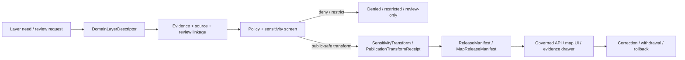

<!-- [KFM_META_BLOCK_V2]
doc_id: kfm://contract/domains/archaeology/domain-layer-descriptor
title: contracts/domains/archaeology/domain_layer_descriptor.md — DomainLayerDescriptor Contract
type: contract
version: v0.2
status: draft
owners: OWNER_TBD — Archaeology steward · Map/UI steward · Contract steward · Evidence steward · Schema steward · Policy steward · Validation steward · Release steward · Docs steward
created: 2026-06-20
updated: 2026-06-20
policy_label: public; contracts; domains; archaeology; domain-layer-descriptor; semantic-contract; map-ui; sensitive-lane
tags: [kfm, contracts, archaeology, layer, descriptor, map-ui, evidence, release, policy, sensitivity, lifecycle, governance]
related:
  - ./README.md
  - ./OBJECT_MAP.md
  - ./archaeological_site.md
  - ./candidate_feature.md
  - ./domain_feature_identity.md
  - ./sensitivity_transform.md
  - ./publication_transform_receipt.md
  - ./cultural_review.md
  - ./steward_review.md
  - ../../../docs/domains/archaeology/MAP_UI_CONTRACTS.md
  - ../../../docs/domains/archaeology/MISSING_OR_PLANNED_FILES.md
  - ../../../docs/domains/archaeology/CANONICAL_PATHS.md
  - ../../../docs/domains/archaeology/ARCHITECTURE.md
  - ../../../docs/domains/archaeology/DATA_LIFECYCLE.md
  - ../../../schemas/contracts/v1/domains/archaeology/domain_layer_descriptor.schema.json
  - ../../../policy/sensitivity/archaeology/
  - ../../../data/proofs/
  - ../../../release/
notes:
  - "Expanded from a greenfield contract scaffold into the object-level DomainLayerDescriptor semantic contract."
  - "The paired schema is a PROPOSED greenfield stub with minimal fields: id, version, and spec_hash."
  - "Repository search found this contract, its schema, SKELETON_MAP.md, and map/UI planning docs; no current OBJECT_MAP.md row was found for DomainLayerDescriptor in this task."
  - "DomainLayerDescriptor describes governed layer meaning and obligations; it is not a tile, renderer adapter, release manifest, policy decision, or publication approval."
[/KFM_META_BLOCK_V2] -->

<a id="top"></a>

# DomainLayerDescriptor Contract

> Semantic contract for `DomainLayerDescriptor`, the Archaeology-domain object that describes the governed meaning, evidence posture, sensitivity posture, release dependency, and public-safe obligations of an archaeology map/UI layer before it can be consumed by a map shell, catalog, evidence drawer, export, or Focus Mode surface.

<p>
  
  
  
  
  
  
</p>

`contracts/domains/archaeology/domain_layer_descriptor.md`

## Quick jumps

[Status](#status) · [Meaning](#meaning) · [Repo fit](#repo-fit) · [Layer boundary](#layer-boundary) · [Schema posture](#schema-posture) · [Accepted uses](#accepted-uses) · [Exclusions](#exclusions) · [Recommended fields](#recommended-fields) · [Invariants](#invariants) · [Lifecycle](#lifecycle) · [Validation](#validation) · [Evidence basis](#evidence-basis) · [Rollback](#rollback) · [Definition of done](#definition-of-done)

---

## Status

> [!IMPORTANT]
> **Status:** `draft` / semantic contract  
> **Owner:** `OWNER_TBD`  
> **Contract path:** `contracts/domains/archaeology/domain_layer_descriptor.md`  
> **Schema path:** `schemas/contracts/v1/domains/archaeology/domain_layer_descriptor.schema.json`  
> **Truth posture:** `CONFIRMED` target path, current update, paired greenfield schema stub, schema fields, map/UI planning references, greenfield skeleton-map lineage, and uploaded authoring guidance. Object-map registration, validator implementation, fixtures, policy behavior, release-manifest behavior, tile generation, API behavior, UI behavior, and runtime renderer behavior remain `NEEDS VERIFICATION`.

> [!CAUTION]
> This contract defines object meaning only. It does **not** authorize publication, map rendering, tile generation, policy approval, release approval, exact-location exposure, public browsing, export, or Focus Mode use.

---

## Meaning

`DomainLayerDescriptor` is the Archaeology-domain object for describing a governed layer candidate or released layer projection in terms that are inspectable before use.

It may describe:

- what archaeology object family or projection the layer represents;
- what evidence and release records support the layer;
- what sensitivity, rights, sovereignty, cultural-review, and public-safety obligations apply;
- what geometry precision or generalization posture is permitted;
- what public labels, legends, filters, time controls, and evidence-drawer links are allowed;
- what finite UI outcomes must occur when evidence, review, policy, or release support is missing.

It exists so an archaeology layer is never just a style or tile endpoint. The layer must carry its claim boundary, evidence boundary, policy boundary, review boundary, release boundary, and rollback boundary.

It is not:

- a MapLibre style file;
- a PMTiles, vector-tile, raster-tile, GeoJSON, GeoParquet, or database table;
- a `LayerManifest`, `LayerCatalogItem`, or `MapReleaseManifest` by itself;
- an EvidenceBundle;
- a PolicyDecision;
- a ReviewRecord;
- a ReleaseManifest;
- a runtime API response;
- permission to expose exact archaeological locations or sensitive identities.

---

## Repo fit

```text
contracts/
└── domains/
    └── archaeology/
        ├── README.md
        ├── domain_layer_descriptor.md
        ├── domain_feature_identity.md
        ├── candidate_feature.md
        └── archaeological_site.md
```

Adjacent roots and object families:

| Root or object | Relationship |
|---|---|
| `./README.md` | Archaeology semantic-contract directory boundary. |
| `./OBJECT_MAP.md` | Expected object-family registry; no `DomainLayerDescriptor` row was found in this task. |
| `./domain_feature_identity.md` | Identity/crosswalk object that may inform layer feature identity. |
| `./candidate_feature.md` | Candidate object that must not become public layer content without review and release. |
| `./archaeological_site.md` | Confirmed/reviewed site identity; exact geometry remains sensitive. |
| `./sensitivity_transform.md` | Expected transform family for public-safe layer exposure. |
| `./publication_transform_receipt.md` | Expected receipt family for public-safe transform lineage. |
| `./cultural_review.md`, `./steward_review.md` | Review objects required before sensitive archaeology exposure. |
| `../../../docs/domains/archaeology/MAP_UI_CONTRACTS.md` | Domain map/UI planning doc that references `LayerDescriptor`, `LayerManifest`, and related UI contracts. |
| `../../../schemas/contracts/v1/domains/archaeology/domain_layer_descriptor.schema.json` | Current greenfield schema stub. |
| `../../../policy/sensitivity/archaeology/` | Policy gate home; behavior not verified here. |
| `../../../data/proofs/` | EvidenceBundle/proof support. |
| `../../../release/` | Release, correction, supersession, and rollback authority. |

---

## Layer boundary

`DomainLayerDescriptor` must preserve the difference between layer description and layer publication.

| Boundary | Rule |
|---|---|
| Layer descriptor vs. layer artifact | This object describes meaning and obligations; it is not a tile, style, dataset, or file export. |
| Layer descriptor vs. release manifest | It may cite release records; it does not approve release. |
| Layer descriptor vs. policy decision | It carries policy posture and requirements; it does not replace policy enforcement. |
| Layer descriptor vs. EvidenceBundle | It points to evidence support; it is not evidence proof. |
| Layer descriptor vs. renderer | MapLibre or any UI renderer is downstream of this contract and cannot become truth. |
| Internal layer vs. public layer | Public surfaces require governed release, transform receipts, policy checks, and safe precision. |

---

## Schema posture

The paired schema found for this contract is:

```text
schemas/contracts/v1/domains/archaeology/domain_layer_descriptor.schema.json
```

Current schema evidence:

| Schema fact | Status |
|---|---|
| Schema file exists | `CONFIRMED` |
| Schema title is `domain_layer_descriptor` | `CONFIRMED` |
| Schema description calls it a greenfield placeholder/stub | `CONFIRMED` |
| Schema status is `PROPOSED` | `CONFIRMED` |
| Schema has `spec_hash` | `CONFIRMED` |
| Schema has `id` | `CONFIRMED` |
| Schema has `version` | `CONFIRMED` |
| Schema requires `id` | `CONFIRMED` |
| `additionalProperties` is `true` | `CONFIRMED` |
| Schema `contract_doc` points to this contract | `CONFIRMED` |
| Schema names an expected validator path | `CONFIRMED` |
| Validator implementation | `UNKNOWN / NOT FOUND IN THIS TASK` |

This contract therefore expands semantic expectations around the existing greenfield stub. It does not claim that machine validation currently enforces these semantics.

---

## Accepted uses

| Use | Allowed? | Rule |
|---|---:|---|
| Defining the meaning of an archaeology layer descriptor | Yes | Must preserve evidence, policy, review, sensitivity, release, and rollback posture. |
| Describing an internal review layer | Conditional | Must not be exposed to public clients without governed release. |
| Describing a public-safe released layer | Conditional | Requires release records, public-safe transform, policy support, and evidence linkage. |
| Supporting catalog, evidence drawer, legend, filter, and Focus Mode layer metadata | Conditional | Must use governed API/released payloads and finite outcomes. |
| Carrying geometry precision rules | Yes | Must fail closed for exact or sensitive archaeology exposure. |
| Treating a descriptor as a tile or style artifact | No | Renderable artifacts live elsewhere and remain downstream. |
| Treating a descriptor as release approval | No | Release authority remains separate. |
| Treating a descriptor as evidence proof | No | EvidenceBundle/proof objects remain separate. |
| Publishing exact site/candidate locations by default | No | Archaeology public layers require generalization, suppression, or denial unless policy and review allow exposure. |
| Using schema validity as proof of layer safety | No | Schema shape is not evidence, policy, review, or release proof. |

---

## Exclusions

| Does not belong in this contract | Correct home |
|---|---|
| Machine field shape | `../../../schemas/contracts/v1/domains/archaeology/domain_layer_descriptor.schema.json`. |
| Validator implementation | `../../../tools/validators/...`. |
| Fixtures and tests | `../../../fixtures/...`, `../../../tests/...`. |
| Raw, work, quarantine, processed, catalog, tile, or published layer data | `../../../data/...` lifecycle roots, subject to phase and policy rules. |
| MapLibre style JSON, renderer adapter code, UI components, or route handlers | App/package/runtime roots. |
| EvidenceBundle/proof content | `../../../data/proofs/`. |
| Policy decisions, access rules, or sensitivity rules | `../../../policy/...`. |
| Steward/cultural review records | Governance/review contract and record homes. |
| Release manifests, correction notices, rollback cards | `../../../release/`. |
| Public layer rendering or Focus Mode runtime responses | Governed app/API/UI/layer roots. |

---

## Recommended fields

The current schema only requires `id` and defines `version` and `spec_hash`. The remaining fields are `PROPOSED` semantic requirements for future schema/validator work:

| Field | Meaning |
|---|---|
| `id` | Canonical identifier required by the current schema. |
| `version` | Contract or object version currently present in the schema. |
| `spec_hash` | Deterministic content hash currently present in the schema. |
| `domain_layer_descriptor_id` | Stable deterministic or steward-assigned layer descriptor ID, if distinct from `id`. |
| `layer_key` | Stable layer key used by catalog/API/UI after governance approval. |
| `layer_title` | Human-readable layer title suitable for reviewed display. |
| `layer_purpose` | What the layer communicates and what it must not be used to infer. |
| `domain_object_refs` | Contract/object families represented by the layer, such as CandidateFeature, ArchaeologicalSite, or SensitivityTransform. |
| `source_refs` | SourceDescriptor/source record references. |
| `evidence_refs` | EvidenceRef/EvidenceBundle references required for claims made by the layer. |
| `release_refs` | ReleaseManifest, MapReleaseManifest, or release-candidate references. |
| `transform_refs` | SensitivityTransform, PublicationTransformReceipt, RedactionReceipt, or generalization receipt references. |
| `policy_refs` | PolicyDecision or policy rule references. |
| `review_refs` | StewardReview, CulturalReview, or other review record references. |
| `geometry_policy` | Exact, generalized, suppressed, centroided, binned, county/region, or denied geometry posture. |
| `minimum_public_precision` | Lowest public-safe precision allowed for this layer. |
| `sensitivity_class` | Sensitivity/public-safety classification. |
| `rights_state` | Rights, terms, cultural restrictions, or access posture. |
| `visibility_state` | Internal, review-only, release-candidate, public-safe, restricted, suppressed, withdrawn, or denied. |
| `ui_obligations` | Required labels, warnings, citation chips, evidence drawer links, abstain/deny behavior, or export limits. |
| `time_behavior` | Whether layer supports observed/source/valid/review/release/correction time controls. |
| `correction_refs` | Correction/supersession/rollback lineage. |

---

## Invariants

`DomainLayerDescriptor` must preserve these invariants:

- a layer descriptor is not a layer artifact, tile endpoint, UI component, policy decision, evidence proof, or release approval;
- public-facing layer use must be downstream of governed APIs and released artifacts;
- exact archaeological geometry and sensitive location-derived information fail closed unless policy, review, and release authorize a public-safe transform;
- every claim-bearing layer must preserve evidence and citation obligations;
- every sensitive layer must preserve review, policy, transform, and rollback obligations;
- layer labels, legends, filters, screenshots, summaries, and AI explanations are downstream carriers, not sovereign truth;
- schema validity is not evidence, policy, review, or release proof;
- evidence, policy, review, release, correction, and rollback objects remain separate families;
- publication is a governed state transition, not a file move.

---

## Lifecycle



The contract defines the meaning of a layer descriptor. It does not replace evidence resolution, schema validation, policy enforcement, review, transform receipts, release approval, map rendering, correction, or rollback systems.

---

## Validation

Before relying on this contract, verify:

- object-map registration or an explicit reason for leaving it outside `OBJECT_MAP.md`;
- schema fields beyond the current greenfield stub;
- validator implementation and fixture coverage;
- canonical layer key and deterministic ID rules;
- geometry precision and public-safe transform vocabulary;
- EvidenceRef/EvidenceBundle requirements;
- ReviewRecord, CulturalReview, StewardReview, PolicyDecision, SensitivityTransform, PublicationTransformReceipt, ReleaseManifest, MapReleaseManifest, CorrectionNotice, and RollbackCard linkage;
- UI obligation vocabulary for legends, warnings, citation chips, evidence drawers, exports, Focus Mode, and finite outcomes;
- no downstream surface treats this contract as public disclosure permission, release approval, tile safety proof, or renderer authorization.

---

## Evidence basis

| Source | Status | Supports | Limits |
|---|---|---|---|
| Prior `domain_layer_descriptor.md` scaffold | `CONFIRMED` | Target file existed as a greenfield scaffold with semantic headings. | Scaffold did not define authoritative semantics. |
| `domain_layer_descriptor.schema.json` | `CONFIRMED greenfield stub` | Schema exists, is `PROPOSED`, requires `id`, defines `version` and `spec_hash`, points to this contract, and names expected fixture/validator/policy homes. | Does not enforce full layer-descriptor semantics. |
| `docs/domains/archaeology/MAP_UI_CONTRACTS.md` | `CONFIRMED planning/doctrine doc` | Defines archaeology map/UI contract scope and references `LayerDescriptor`, `LayerManifest`, `LayerCatalogItem`, `MapReleaseManifest`, Evidence Drawer, Focus Mode, and governed API/public-surface boundaries. | It is draft/planning; route names, DTO fields, and implementation surfaces remain partly proposed/needs verification. |
| `SKELETON_MAP.md` | `CONFIRMED lineage` | Describes the greenfield skeleton as expansive and confirms separation between contracts, schemas, policy, lifecycle data, release, runtime, and public surfaces. | Skeleton map is orientation/lineage, not proof that validators or workflows exist. |
| `OBJECT_MAP.md` search result | `NEEDS VERIFICATION` | Current repo search for `domain_layer_descriptor` did not return an object-map row. | Absence from search is not a formal registry decision. |
| Uploaded authoring prompt v2 | `CONFIRMED user-supplied guidance` | Requires evidence-grounded, implementation-honest Markdown with verification and rollback posture. | Authoring guidance, not implementation proof. |

---

## Rollback

Rollback is required if this contract is used to claim schema completeness, validator coverage, object-map registration, policy enforcement, review completion, release execution, tile generation, API/UI behavior, renderer authorization, public disclosure permission, exact-location authorization, sensitive-layer safety, or implementation maturity not verified in this task.

Rollback target: prior scaffold blob SHA `50a7adb30f452d1b44d82bcd902d31dbe45ca770`.

---

## Definition of done

- [ ] Owners are confirmed and `OWNER_TBD` is replaced.
- [ ] Object-map registration is added or a documented exception is accepted.
- [ ] Layer descriptor vocabulary is reviewed by the Archaeology steward and Map/UI steward.
- [ ] Boundary between `DomainLayerDescriptor`, `LayerDescriptor`, `LayerManifest`, `LayerCatalogItem`, `MapReleaseManifest`, and release artifacts is accepted.
- [ ] Paired JSON Schema is expanded from greenfield stub status.
- [ ] Valid and invalid fixtures cover internal, review-only, restricted, suppressed, public-safe, denied, withdrawn, corrected, and rollback states.
- [ ] Validator enforces required layer key, represented object family, evidence, review, policy, transform, release, geometry, visibility, UI obligation, and rollback fields.
- [ ] Fixtures avoid sensitive exact-location disclosure, restricted identifiers, culturally sensitive details, and looting-risk layer relationships.
- [ ] EvidenceBundle, PolicyDecision, ReviewRecord, SensitivityTransform, PublicationTransformReceipt, ReleaseManifest, MapReleaseManifest, CorrectionNotice, and RollbackCard references are validated where required.
- [ ] API/UI surfaces prove they cannot treat a descriptor as release approval, tile safety proof, or public disclosure permission.
- [ ] Release and rollback dry-runs prove this contract cannot bypass publication gates.

## Status summary

`DomainLayerDescriptor` is a sensitive Archaeology map/UI layer-description object. It can support governed catalogs, evidence drawers, layer legends, exports, and Focus Mode when evidence, review, policy, transform, and release allow, but it is not a tile, not a renderer adapter, not evidence proof, not policy approval, and not release approval.

<p align="right"><a href="#top">Back to top</a></p>
