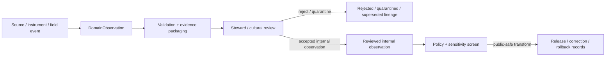

<!-- [KFM_META_BLOCK_V2]
doc_id: kfm://contract/domains/archaeology/domain-observation
title: contracts/domains/archaeology/domain_observation.md — DomainObservation Contract
type: contract
version: v0.2
status: draft
owners: OWNER_TBD — Archaeology steward · Observation steward · Contract steward · Evidence steward · Schema steward · Policy steward · Validation steward · Release steward · Docs steward
created: 2026-06-20
updated: 2026-06-20
policy_label: public; contracts; domains; archaeology; domain-observation; semantic-contract; observation; sensitive-lane
tags: [kfm, contracts, archaeology, observation, evidence, source, review, policy, sensitivity, lifecycle, governance]
related:
  - ./README.md
  - ./OBJECT_MAP.md
  - ./archaeological_site.md
  - ./candidate_feature.md
  - ./site_component.md
  - ./remote_sensing_anomaly.md
  - ./lidar_candidate.md
  - ./geophysics_observation.md
  - ./three_d_documentation.md
  - ./domain_feature_identity.md
  - ./provenience_context.md
  - ./chronology_assertion.md
  - ./cultural_review.md
  - ./steward_review.md
  - ./sensitivity_transform.md
  - ./publication_transform_receipt.md
  - ../../../docs/domains/archaeology/MISSING_OR_PLANNED_FILES.md
  - ../../../docs/domains/archaeology/CANONICAL_PATHS.md
  - ../../../docs/domains/archaeology/ARCHITECTURE.md
  - ../../../docs/domains/archaeology/DATA_LIFECYCLE.md
  - ../../../schemas/contracts/v1/domains/archaeology/domain_observation.schema.json
  - ../../../policy/sensitivity/archaeology/
  - ../../../data/proofs/
  - ../../../release/
notes:
  - "Expanded from a greenfield contract scaffold into the object-level DomainObservation semantic contract."
  - "The paired schema is a PROPOSED greenfield stub with minimal fields: id, version, and spec_hash."
  - "Repository search found this contract, its schema, and SKELETON_MAP.md; no current OBJECT_MAP.md row was found for DomainObservation in this task."
  - "DomainObservation is an observation-envelope object, not evidence proof, site confirmation, review approval, policy approval, or release approval."
[/KFM_META_BLOCK_V2] -->

<a id="top"></a>

# DomainObservation Contract

> Semantic contract for `DomainObservation`, the Archaeology-domain observation-envelope object used to describe a bounded observation, measurement, note, signal, survey observation, or documentation event without converting it into evidence proof, site confirmation, public geometry, or release approval.

<p>
  
  
  
  
  
  
</p>

`contracts/domains/archaeology/domain_observation.md`

## Quick jumps

[Status](#status) · [Meaning](#meaning) · [Repo fit](#repo-fit) · [Observation boundary](#observation-boundary) · [Schema posture](#schema-posture) · [Accepted uses](#accepted-uses) · [Exclusions](#exclusions) · [Recommended fields](#recommended-fields) · [Invariants](#invariants) · [Lifecycle](#lifecycle) · [Validation](#validation) · [Evidence basis](#evidence-basis) · [Rollback](#rollback) · [Definition of done](#definition-of-done)

---

## Status

> [!IMPORTANT]
> **Status:** `draft` / semantic contract  
> **Owner:** `OWNER_TBD`  
> **Contract path:** `contracts/domains/archaeology/domain_observation.md`  
> **Schema path:** `schemas/contracts/v1/domains/archaeology/domain_observation.schema.json`  
> **Truth posture:** `CONFIRMED` target path, current update, paired greenfield schema stub, schema fields, greenfield skeleton-map lineage, and uploaded authoring guidance. Object-map registration, validator implementation, fixtures, policy behavior, source registry behavior, evidence-bundle implementation, review workflow, release workflow, API behavior, UI behavior, and runtime behavior remain `NEEDS VERIFICATION`.

> [!CAUTION]
> This contract defines object meaning only. It does **not** authorize publication, site confirmation, candidate confirmation, policy approval, proof closure, precise-location exposure, public rendering, or release of sensitive archaeology observations.

---

## Meaning

`DomainObservation` is the Archaeology-domain object for a bounded observation event or observation record. It captures what was observed, by what method, from what source or workflow, at what time, with what spatial and sensitivity posture, and with what evidence or review requirements.

A domain observation may describe:

- survey observations;
- field notes or recording observations;
- remote-sensing observations;
- LiDAR-derived observations;
- geophysics observations;
- 3D documentation observations;
- sample or artifact observation events;
- archival/report-derived observation statements;
- observation-level statements that may support `CandidateFeature`, `SiteComponent`, `ArchaeologicalSite`, `ChronologyAssertion`, or `DomainFeatureIdentity` review.

It exists to preserve observation meaning before interpretation, confirmation, aggregation, transformation, or release.

It is not:

- a confirmed archaeological site;
- a confirmed candidate feature;
- a public map layer;
- a raw source dump;
- an EvidenceBundle;
- a PolicyDecision;
- a ReviewRecord;
- a ReleaseManifest;
- proof that a feature, component, site, or chronology exists;
- permission to disclose sensitive observation detail, source identifiers, or restricted cultural information.

---

## Repo fit

```text
contracts/
└── domains/
    └── archaeology/
        ├── README.md
        ├── domain_observation.md
        ├── remote_sensing_anomaly.md
        ├── lidar_candidate.md
        └── geophysics_observation.md
```

Adjacent roots and object families:

| Root or object | Relationship |
|---|---|
| `./README.md` | Archaeology semantic-contract directory boundary. |
| `./OBJECT_MAP.md` | Expected object-family registry; no `DomainObservation` row was found in this task. |
| `./candidate_feature.md` | Candidate object that observations may support, contest, or route into review. |
| `./site_component.md` | Component object that may be supported by reviewed observations. |
| `./archaeological_site.md` | Confirmed/reviewed site identity; not created by observation alone. |
| `./remote_sensing_anomaly.md`, `./lidar_candidate.md`, `./geophysics_observation.md` | Specialized observation/candidate families that may be subtypes or siblings; mapping needs review. |
| `./three_d_documentation.md` | Documentation object that may produce or cite observations. |
| `./domain_feature_identity.md` | Identity/crosswalk object that may reconcile observation subjects. |
| `./provenience_context.md`, `./chronology_assertion.md` | Context and time-interpretation objects that may cite observations. |
| `./cultural_review.md`, `./steward_review.md` | Review objects required before consequential interpretation or exposure. |
| `../../../schemas/contracts/v1/domains/archaeology/domain_observation.schema.json` | Current greenfield schema stub. |
| `../../../policy/sensitivity/archaeology/` | Policy gate home; behavior not verified here. |
| `../../../data/proofs/` | EvidenceBundle/proof support. |
| `../../../release/` | Release, correction, supersession, and rollback authority. |

---

## Observation boundary

`DomainObservation` must preserve the difference between observing, interpreting, proving, and publishing.

| Boundary | Rule |
|---|---|
| Observation vs. source | An observation may summarize or reference a source, but raw source material remains in lifecycle data roots. |
| Observation vs. interpretation | An observation can support interpretation; it is not interpretation proof by itself. |
| Observation vs. candidate | Observations may route to `CandidateFeature`, but do not confirm a candidate alone. |
| Observation vs. confirmed site | Observations may support site review, but do not create `ArchaeologicalSite` identity. |
| Observation vs. EvidenceBundle | Observations may be bundled as evidence; they are not the bundle or proof closure. |
| Observation vs. public release | Public use requires review, policy, transform, release, and rollback support. |

---

## Schema posture

The paired schema found for this contract is:

```text
schemas/contracts/v1/domains/archaeology/domain_observation.schema.json
```

Current schema evidence:

| Schema fact | Status |
|---|---|
| Schema file exists | `CONFIRMED` |
| Schema title is `domain_observation` | `CONFIRMED` |
| Schema description calls it a greenfield placeholder/stub | `CONFIRMED` |
| Schema status is `PROPOSED` | `CONFIRMED` |
| Schema has `spec_hash` | `CONFIRMED` |
| Schema has `id` | `CONFIRMED` |
| Schema has `version` | `CONFIRMED` |
| Schema requires `id` | `CONFIRMED` |
| `additionalProperties` is `true` | `CONFIRMED` |
| Schema `contract_doc` points to this contract | `CONFIRMED` |
| Schema names an expected validator path | `CONFIRMED` |
| Validator implementation | `UNKNOWN / NOT FOUND IN THIS TASK` |

This contract therefore expands semantic expectations around the existing greenfield stub. It does not claim that machine validation currently enforces these semantics.

---

## Accepted uses

| Use | Allowed? | Rule |
|---|---:|---|
| Defining the meaning of an archaeology observation envelope | Yes | Must preserve method, source, evidence, spatial, temporal, sensitivity, review, and lifecycle posture. |
| Capturing internal observation records | Conditional | Raw or sensitive details must remain lifecycle- and policy-gated. |
| Linking observations to candidates, components, sites, identities, or chronology assertions | Conditional | Must preserve uncertainty and must not imply confirmation. |
| Supporting evidence-bundle assembly | Conditional | EvidenceBundle resolution remains separate. |
| Supporting review queues or contradiction analysis | Yes | Must preserve review state and contested/superseded lineage. |
| Supporting public-safe summaries | Conditional | Requires policy, review, transform receipt, release record, and safe precision. |
| Treating an observation as proof by itself | No | Proof closure requires evidence resolution and review. |
| Treating an observation as site confirmation | No | Site confirmation is a governed review transition. |
| Publishing precise observation locations by default | No | Sensitive observation locations fail closed. |
| Using schema validity as proof of observation truth | No | Schema shape is not evidence proof. |

---

## Exclusions

| Does not belong in this contract | Correct home |
|---|---|
| Machine field shape | `../../../schemas/contracts/v1/domains/archaeology/domain_observation.schema.json`. |
| Validator implementation | `../../../tools/validators/...`. |
| Fixtures and tests | `../../../fixtures/...`, `../../../tests/...`. |
| Raw source extracts, instrument files, field forms, photos, imagery, scans, or bulk observations | `../../../data/raw/`, `../../../data/work/`, or `../../../data/quarantine/`, subject to lifecycle and sensitivity rules. |
| EvidenceBundle/proof content | `../../../data/proofs/`. |
| Sensitivity, access, admissibility, or release policy | `../../../policy/...`. |
| Steward/cultural review records | Governance/review contract and record homes. |
| Release manifests, correction notices, rollback cards | `../../../release/`. |
| Public layer, UI, API, renderer, or Focus Mode implementation | Governed app/API/UI/layer roots. |

---

## Recommended fields

The current schema only requires `id` and defines `version` and `spec_hash`. The remaining fields are `PROPOSED` semantic requirements for future schema/validator work:

| Field | Meaning |
|---|---|
| `id` | Canonical identifier required by the current schema. |
| `version` | Contract or object version currently present in the schema. |
| `spec_hash` | Deterministic content hash currently present in the schema. |
| `domain_observation_id` | Stable deterministic or steward-assigned observation identity, if distinct from `id`. |
| `observation_type` | Field, survey, remote-sensing, LiDAR, geophysics, 3D documentation, sample, artifact, archival/report, or other reviewed observation type. |
| `subject_refs` | CandidateFeature, SiteComponent, ArchaeologicalSite, ProvenienceContext, ArtifactRecord, Sample, DomainFeatureIdentity, or other governed object references. |
| `method_refs` | Instrument, workflow, source method, survey method, documentation method, or analytical method references. |
| `source_refs` | SourceDescriptor/source record references. |
| `source_roles` | Source roles supporting, contextualizing, or contesting the observation. |
| `evidence_refs` | EvidenceRef/EvidenceBundle references when available. |
| `observation_statement` | Bounded statement of what was observed, with uncertainty and limits. |
| `observation_geometry_ref` | Internal geometry/support-scope reference; public-safe generalization required before exposure. |
| `spatial_precision_class` | Exact, generalized, suppressed, centroided, binned, county/region, or denied precision posture. |
| `observed_time` | Time of observation, if known. |
| `source_time` | Time represented by the source, if different from observation time. |
| `retrieval_time` | Time the source/record was retrieved or ingested, where relevant. |
| `confidence_statement` | Bounded confidence, uncertainty, or limitation statement. |
| `contradiction_refs` | Observations or claims that contest this observation. |
| `review_state` | Intake, needs review, under review, accepted internal observation, rejected, superseded, quarantined, release-candidate, or withdrawn. |
| `review_refs` | StewardReview, CulturalReview, repository review, or other review record references. |
| `policy_state` | Policy posture or policy-decision reference. |
| `sensitivity_class` | Sensitivity/public-safety classification. |
| `lineage_refs` | Prior, successor, supersession, merge, split, or rollback observation records. |
| `release_refs` | Release/candidate linkage where applicable. |
| `correction_refs` | Correction/supersession/rollback lineage. |

---

## Invariants

`DomainObservation` must preserve these invariants:

- observation is not proof by itself;
- observation is not site confirmation by itself;
- observation does not bypass candidate, site, evidence, review, policy, transform, release, correction, or rollback gates;
- raw source material and observation-derived summaries must remain separated;
- method, source, time, uncertainty, sensitivity, and review posture must remain inspectable;
- sensitive observation geometry and sensitive observation relationships fail closed unless policy, review, and release authorize a public-safe transform;
- contradiction, rejection, supersession, and correction lineage must remain traceable;
- schema validity is not evidence proof;
- evidence, policy, review, release, correction, and rollback objects remain separate families;
- public-facing use must be downstream of governed release artifacts and public-safe transforms;
- publication is a governed state transition, not a file move.

---

## Lifecycle



The contract defines the meaning of an observation object. It does not replace source intake, evidence resolution, schema validation, policy enforcement, review, transform receipts, release approval, correction, or rollback systems.

---

## Validation

Before relying on this contract, verify:

- object-map registration or an explicit reason for leaving it outside `OBJECT_MAP.md`;
- schema fields beyond the current greenfield stub;
- validator implementation and fixture coverage;
- canonical observation ID and deterministic identity rules;
- observation type vocabulary and relationship to specialized observation contracts;
- EvidenceRef/EvidenceBundle requirements;
- source-role, method, time-kind, and geometry-precision requirements;
- sensitivity handling for restricted observation detail and restricted source identifiers;
- steward/cultural review requirements;
- policy-gate requirements;
- release, correction, supersession, withdrawal, and rollback linkage;
- no downstream surface treats this contract as public disclosure permission, final proof, or site confirmation.

---

## Evidence basis

| Source | Status | Supports | Limits |
|---|---|---|---|
| Prior `domain_observation.md` scaffold | `CONFIRMED` | Target file existed as a greenfield scaffold with semantic headings. | Scaffold did not define authoritative semantics. |
| `domain_observation.schema.json` | `CONFIRMED greenfield stub` | Schema exists, is `PROPOSED`, requires `id`, defines `version` and `spec_hash`, points to this contract, and names expected fixture/validator/policy homes. | Does not enforce full observation semantics. |
| `OBJECT_MAP.md` | `CONFIRMED current map / NEEDS REGISTRATION REVIEW` | Current map includes specialized observation-adjacent object families such as `RemoteSensingAnomaly`, `LiDARCandidate`, `GeophysicsObservation`, and `ThreeDDocumentation`. | It does not show a `DomainObservation` row in the fetched map range. |
| `SKELETON_MAP.md` | `CONFIRMED lineage` | Describes the greenfield skeleton as expansive and preserves separation between contracts, schemas, policy, lifecycle data, release, runtime, and public surfaces. | Skeleton map is orientation/lineage, not proof that validators or workflows exist. |
| `OBJECT_MAP.md` search result | `NEEDS VERIFICATION` | Current repo search for `domain_observation` did not return an object-map row. | Absence from search is not a formal registry decision. |
| Uploaded authoring prompt v2 | `CONFIRMED user-supplied guidance` | Requires evidence-grounded, implementation-honest Markdown with verification and rollback posture. | Authoring guidance, not implementation proof. |

---

## Rollback

Rollback is required if this contract is used to claim schema completeness, validator coverage, object-map registration, policy enforcement, review completion, release execution, API/UI behavior, observation truth, site confirmation, public disclosure permission, sensitive observation release, or implementation maturity not verified in this task.

Rollback target: prior scaffold blob SHA `d4faf63ca28d709f1862248a0c4be9e2fc452405`.

---

## Definition of done

- [ ] Owners are confirmed and `OWNER_TBD` is replaced.
- [ ] Object-map registration is added or a documented exception is accepted.
- [ ] Observation vocabulary is reviewed by the Archaeology steward and observation steward.
- [ ] Boundary between `DomainObservation`, `RemoteSensingAnomaly`, `LiDARCandidate`, `GeophysicsObservation`, `ThreeDDocumentation`, `CandidateFeature`, and `ArchaeologicalSite` is accepted.
- [ ] Paired JSON Schema is expanded from greenfield stub status.
- [ ] Valid and invalid fixtures cover field, remote-sensing, LiDAR, geophysics, 3D documentation, sample, artifact, archival/report, rejected, superseded, quarantined, restricted, and release-candidate states.
- [ ] Validator enforces required observation type, subject, method, source, evidence, time-kind, geometry, review, sensitivity, policy, lineage, and visibility fields.
- [ ] Fixtures avoid restricted source identifiers, sensitive cultural detail, and unsafe observation relationships.
- [ ] EvidenceBundle, PolicyDecision, ReviewRecord, SensitivityTransform, PublicationTransformReceipt, ReleaseManifest, CorrectionNotice, and RollbackCard references are validated where required.
- [ ] API/UI surfaces prove they cannot treat an observation as proof, site confirmation, or public disclosure permission.
- [ ] Release and rollback dry-runs prove this contract cannot bypass publication gates.

## Status summary

`DomainObservation` is a sensitive Archaeology observation-envelope object. It can support evidence packaging, candidate review, identity reconciliation, chronology, map/UI summaries, and public-safe explanation when evidence, review, policy, transform, and release allow, but it is not proof, not site confirmation, not policy approval, and not release approval.

<p align="right"><a href="#top">Back to top</a></p>
