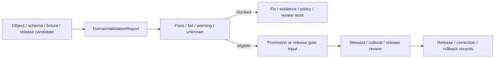

<!-- [KFM_META_BLOCK_V2]
doc_id: kfm://contract/domains/archaeology/domain-validation-report
title: contracts/domains/archaeology/domain_validation_report.md — DomainValidationReport Contract
type: contract
version: v0.2
status: draft
owners: OWNER_TBD — Archaeology steward · Validation steward · Contract steward · Evidence steward · Schema steward · Policy steward · Release steward · Docs steward
created: 2026-06-20
updated: 2026-06-20
policy_label: public; contracts; domains; archaeology; domain-validation-report; semantic-contract; validation; sensitive-lane
tags: [kfm, contracts, archaeology, validation, report, evidence, schema, policy, review, lifecycle, governance]
related:
  - ./README.md
  - ./OBJECT_MAP.md
  - ./domain_observation.md
  - ./domain_layer_descriptor.md
  - ./domain_feature_identity.md
  - ./candidate_feature.md
  - ./archaeological_site.md
  - ./cultural_review.md
  - ./steward_review.md
  - ./sensitivity_transform.md
  - ./publication_transform_receipt.md
  - ../../../docs/domains/archaeology/MISSING_OR_PLANNED_FILES.md
  - ../../../docs/domains/archaeology/CANONICAL_PATHS.md
  - ../../../docs/domains/archaeology/ARCHITECTURE.md
  - ../../../docs/domains/archaeology/DATA_LIFECYCLE.md
  - ../../../schemas/contracts/v1/domains/archaeology/domain_validation_report.schema.json
  - ../../../policy/sensitivity/archaeology/
  - ../../../data/proofs/
  - ../../../release/
notes:
  - "Expanded from a greenfield contract scaffold into the object-level DomainValidationReport semantic contract."
  - "The paired schema is a PROPOSED greenfield stub with minimal fields: id, version, and spec_hash."
  - "Repository search found this contract, its schema, and SKELETON_MAP.md; no current OBJECT_MAP.md row was found for DomainValidationReport in this task."
  - "The schema names an expected validator path, but that validator file was not found in this task."
  - "DomainValidationReport records validation results and gaps; it is not evidence proof, policy approval, review approval, or release approval."
[/KFM_META_BLOCK_V2] -->

<a id="top"></a>

# DomainValidationReport Contract

> Semantic contract for `DomainValidationReport`, the Archaeology-domain validation-report object used to record what was checked, what passed, what failed, what remains unverified, and what follow-up is required before archaeology objects, transforms, layers, or release candidates are treated as safe to promote.

<p>
  
  
  
  
  
  
</p>

`contracts/domains/archaeology/domain_validation_report.md`

## Quick jumps

[Status](#status) · [Meaning](#meaning) · [Repo fit](#repo-fit) · [Validation boundary](#validation-boundary) · [Schema posture](#schema-posture) · [Accepted uses](#accepted-uses) · [Exclusions](#exclusions) · [Recommended fields](#recommended-fields) · [Invariants](#invariants) · [Lifecycle](#lifecycle) · [Validation of this contract](#validation-of-this-contract) · [Evidence basis](#evidence-basis) · [Rollback](#rollback) · [Definition of done](#definition-of-done)

---

## Status

> [!IMPORTANT]
> **Status:** `draft` / semantic contract  
> **Owner:** `OWNER_TBD`  
> **Contract path:** `contracts/domains/archaeology/domain_validation_report.md`  
> **Schema path:** `schemas/contracts/v1/domains/archaeology/domain_validation_report.schema.json`  
> **Truth posture:** `CONFIRMED` target path, current update, paired greenfield schema stub, schema fields, greenfield skeleton-map lineage, and uploaded authoring guidance. Object-map registration, validator implementation, fixtures, policy behavior, source registry behavior, evidence-bundle implementation, review workflow, release workflow, API behavior, UI behavior, and runtime behavior remain `NEEDS VERIFICATION`.

> [!CAUTION]
> This contract defines object meaning only. It does **not** authorize publication, validation completion, policy approval, review approval, proof closure, public rendering, or release of sensitive archaeology records.

---

## Meaning

`DomainValidationReport` is the Archaeology-domain object for recording validation results. It captures the scope of a validation run, the objects or artifacts checked, the rules or validators used, the outcome, the issues found, the evidence or receipts referenced, and the follow-up required before a domain object, layer, transform, or release candidate can move forward.

A domain validation report may describe checks against:

- archaeology contract objects;
- archaeology JSON Schemas;
- fixtures and test cases;
- source, evidence, review, policy, and release references;
- lifecycle-state requirements;
- sensitivity and public-safe transform requirements;
- cross-object linkage requirements;
- correction, supersession, and rollback requirements.

It is a validation record. It is not:

- the validator code itself;
- a test runner log by itself;
- an EvidenceBundle;
- a PolicyDecision;
- a ReviewRecord;
- a ReleaseManifest;
- proof that a claim is true;
- proof that public release is safe;
- permission to bypass unresolved validation failures or unknowns.

---

## Repo fit

```text
contracts/
└── domains/
    └── archaeology/
        ├── README.md
        ├── domain_validation_report.md
        ├── domain_observation.md
        ├── domain_layer_descriptor.md
        └── domain_feature_identity.md
```

Adjacent roots and object families:

| Root or object | Relationship |
|---|---|
| `./README.md` | Archaeology semantic-contract directory boundary. |
| `./OBJECT_MAP.md` | Expected object-family registry; no `DomainValidationReport` row was found in this task. |
| `./domain_observation.md` | Observation object that may produce validation findings. |
| `./domain_layer_descriptor.md` | Layer-description object that may require validation before release. |
| `./domain_feature_identity.md` | Identity/crosswalk object that may require validation before merge, split, or release. |
| `./candidate_feature.md`, `./archaeological_site.md` | Candidate/site objects that validation may check but never confirm by itself. |
| `./cultural_review.md`, `./steward_review.md` | Review objects that validation may require or reference. |
| `./sensitivity_transform.md`, `./publication_transform_receipt.md` | Transform and receipt families that validation may require before public-safe output. |
| `../../../schemas/contracts/v1/domains/archaeology/domain_validation_report.schema.json` | Current greenfield schema stub. |
| `../../../policy/sensitivity/archaeology/` | Policy gate home; behavior not verified here. |
| `../../../data/proofs/` | EvidenceBundle/proof support. |
| `../../../release/` | Release, correction, supersession, and rollback authority. |

---

## Validation boundary

`DomainValidationReport` must preserve the difference between checking, proving, reviewing, and releasing.

| Boundary | Rule |
|---|---|
| Validation report vs. validator | The report records results; validator code lives in tools or package homes. |
| Validation report vs. evidence proof | A passing check does not replace EvidenceBundle resolution. |
| Validation report vs. review | Validation can require review; it does not approve review. |
| Validation report vs. policy | Validation can require policy decisions; it does not make those decisions. |
| Validation report vs. release | Validation can gate release; it does not publish or authorize release. |
| Validation report vs. runtime behavior | Runtime/API/UI behavior remains unverified unless directly tested and cited. |

---

## Schema posture

The paired schema found for this contract is:

```text
schemas/contracts/v1/domains/archaeology/domain_validation_report.schema.json
```

Current schema evidence:

| Schema fact | Status |
|---|---|
| Schema file exists | `CONFIRMED` |
| Schema title is `domain_validation_report` | `CONFIRMED` |
| Schema description calls it a greenfield placeholder/stub | `CONFIRMED` |
| Schema status is `PROPOSED` | `CONFIRMED` |
| Schema has `spec_hash` | `CONFIRMED` |
| Schema has `id` | `CONFIRMED` |
| Schema has `version` | `CONFIRMED` |
| Schema requires `id` | `CONFIRMED` |
| `additionalProperties` is `true` | `CONFIRMED` |
| Schema `contract_doc` points to this contract | `CONFIRMED` |
| Schema names an expected validator path | `CONFIRMED` |
| Validator implementation at named path | `UNKNOWN / NOT FOUND IN THIS TASK` |

This contract therefore expands semantic expectations around the existing greenfield stub. It does not claim that machine validation currently enforces these semantics.

---

## Accepted uses

| Use | Allowed? | Rule |
|---|---:|---|
| Defining the meaning of an archaeology validation report | Yes | Must preserve scope, rule set, inputs, outputs, status, issue lineage, and follow-up obligations. |
| Recording schema, contract, fixture, reference, or lifecycle validation results | Yes | Must distinguish pass, fail, warning, skipped, unknown, and not-run states. |
| Supporting promotion, review, or release gates | Conditional | May inform gates but does not approve them. |
| Recording validation gaps and blockers | Yes | Must keep unresolved items visible and actionable. |
| Supporting correction or rollback review | Yes | Must preserve report lineage and affected object references. |
| Treating validation pass as evidence proof | No | Evidence proof remains a separate object family. |
| Treating validation pass as policy or review approval | No | Policy and review objects remain separate. |
| Treating validation pass as release approval | No | Release authority remains separate. |
| Hiding skipped or unknown checks | No | Unknown and skipped checks must remain inspectable. |
| Using schema validity as proof of report truth | No | Schema shape is not evidence or execution proof. |

---

## Exclusions

| Does not belong in this contract | Correct home |
|---|---|
| Machine field shape | `../../../schemas/contracts/v1/domains/archaeology/domain_validation_report.schema.json`. |
| Validator implementation | `../../../tools/validators/...` or another accepted implementation root. |
| Raw test-run logs or generated artifacts | Lifecycle, artifact, or CI/report roots after placement review. |
| Fixtures and tests | `../../../fixtures/...`, `../../../tests/...`. |
| EvidenceBundle/proof content | `../../../data/proofs/`. |
| Policy decisions or access rules | `../../../policy/...`. |
| Steward/cultural review records | Governance/review contract and record homes. |
| Release manifests, correction notices, rollback cards | `../../../release/`. |
| API, UI, renderer, or Focus Mode implementation | Governed app/API/UI/layer roots. |

---

## Recommended fields

The current schema only requires `id` and defines `version` and `spec_hash`. The remaining fields are `PROPOSED` semantic requirements for future schema/validator work:

| Field | Meaning |
|---|---|
| `id` | Canonical identifier required by the current schema. |
| `version` | Contract or object version currently present in the schema. |
| `spec_hash` | Deterministic content hash currently present in the schema. |
| `domain_validation_report_id` | Stable deterministic or steward-assigned validation report identity, if distinct from `id`. |
| `validation_scope` | Object, contract, schema, fixture, source, evidence, review, policy, transform, release, or rollback scope checked. |
| `subject_refs` | Objects, schemas, fixtures, manifests, receipts, or candidate releases being checked. |
| `validator_refs` | Validator scripts, rule packs, schema versions, or test suites used. |
| `run_refs` | CI run, local run, validation receipt, or command invocation reference where available. |
| `outcome` | Pass, fail, warning, skipped, unknown, not-run, blocked, or mixed. |
| `issue_summary` | Compact summary of findings. |
| `issues` | Structured findings with severity, affected path/object, rule, message, and remediation. |
| `blocked_by` | Missing evidence, missing schema, missing validator, missing policy, missing review, missing release, or missing fixture blockers. |
| `evidence_refs` | EvidenceRef/EvidenceBundle references used or required by the validation. |
| `policy_refs` | PolicyDecision or policy rule references used or required. |
| `review_refs` | StewardReview, CulturalReview, or other review references used or required. |
| `release_refs` | ReleaseManifest, MapReleaseManifest, or release-candidate references. |
| `sensitivity_class` | Sensitivity/public-safety classification for the report and its subjects. |
| `created_at` | Report creation time. |
| `validated_at` | Validation run time. |
| `valid_until` | Optional freshness horizon before revalidation is required. |
| `lineage_refs` | Prior reports, superseded reports, correction reports, or rollback reports. |
| `correction_refs` | Correction/supersession/rollback lineage. |

---

## Invariants

`DomainValidationReport` must preserve these invariants:

- validation reporting is not evidence proof by itself;
- validation reporting is not policy approval, review approval, or release approval;
- pass, fail, warning, skipped, unknown, blocked, and not-run states must remain distinguishable;
- missing evidence, missing validator, missing policy, missing review, and missing release support must not be hidden;
- validation scope and subject references must remain inspectable;
- report lineage, corrections, supersessions, and rollback links must remain traceable;
- sensitive subject details must remain policy-gated and public-safe;
- schema validity is not execution proof;
- evidence, policy, review, validation, release, correction, and rollback objects remain separate families;
- public-facing use must be downstream of governed release artifacts and public-safe transforms;
- publication is a governed state transition, not a file move.

---

## Lifecycle



The contract defines the meaning of a validation report. It does not replace validator code, test execution, evidence resolution, policy enforcement, review approval, release approval, correction, or rollback systems.

---

## Validation of this contract

Before relying on this contract, verify:

- object-map registration or an explicit reason for leaving it outside `OBJECT_MAP.md`;
- schema fields beyond the current greenfield stub;
- validator implementation and fixture coverage;
- report outcome vocabulary;
- severity and remediation vocabulary;
- EvidenceRef/EvidenceBundle requirements;
- PolicyDecision, ReviewRecord, SensitivityTransform, PublicationTransformReceipt, ReleaseManifest, CorrectionNotice, and RollbackCard linkage;
- retention and freshness rules for validation reports;
- allowed public summary fields for validation status;
- no downstream surface treats this contract as evidence proof, policy approval, review approval, or release approval.

---

## Evidence basis

| Source | Status | Supports | Limits |
|---|---|---|---|
| Prior `domain_validation_report.md` scaffold | `CONFIRMED` | Target file existed as a greenfield scaffold with semantic headings. | Scaffold did not define authoritative semantics. |
| `domain_validation_report.schema.json` | `CONFIRMED greenfield stub` | Schema exists, is `PROPOSED`, requires `id`, defines `version` and `spec_hash`, points to this contract, and names expected fixture/validator/policy homes. | Does not enforce full validation-report semantics. |
| Expected validator path from schema | `NOT FOUND IN THIS TASK` | Confirms the schema names an intended validator path. | Does not prove validator implementation exists. |
| `OBJECT_MAP.md` | `CONFIRMED current map / NEEDS REGISTRATION REVIEW` | Shows current archaeology object-family map and cross-cutting dependencies. | It does not show a `DomainValidationReport` row in the fetched map range. |
| `SKELETON_MAP.md` | `CONFIRMED lineage` | Describes the greenfield skeleton as expansive and preserves separation between contracts, schemas, policy, lifecycle data, release, runtime, and public surfaces. | Skeleton map is orientation/lineage, not proof that validators or workflows exist. |
| `OBJECT_MAP.md` search result | `NEEDS VERIFICATION` | Current repo search for `domain_validation_report` did not return an object-map row. | Absence from search is not a formal registry decision. |
| Uploaded authoring prompt v2 | `CONFIRMED user-supplied guidance` | Requires evidence-grounded, implementation-honest Markdown with verification and rollback posture. | Authoring guidance, not implementation proof. |

---

## Rollback

Rollback is required if this contract is used to claim schema completeness, validator coverage, object-map registration, policy enforcement, review completion, release execution, API/UI behavior, validation execution, report authority, public disclosure permission, or implementation maturity not verified in this task.

Rollback target: prior scaffold blob SHA `5946f85eb9a28837ba24fb171c06b2349dc254b9`.

---

## Definition of done

- [ ] Owners are confirmed and `OWNER_TBD` is replaced.
- [ ] Object-map registration is added or a documented exception is accepted.
- [ ] Validation report vocabulary is reviewed by the Archaeology steward and validation steward.
- [ ] Boundary between `DomainValidationReport`, validator logs, EvidenceBundle, PolicyDecision, ReviewRecord, and ReleaseManifest is accepted.
- [ ] Paired JSON Schema is expanded from greenfield stub status.
- [ ] Valid and invalid fixtures cover pass, fail, warning, skipped, unknown, not-run, blocked, corrected, superseded, release-candidate, and rollback states.
- [ ] Validator implementation exists or the schema reference is corrected.
- [ ] Validator enforces required scope, subject, validator, run, outcome, issue, evidence, policy, review, sensitivity, release, and lineage fields.
- [ ] Fixtures avoid embedding sensitive subject details where references or redacted summaries are safer.
- [ ] EvidenceBundle, PolicyDecision, ReviewRecord, SensitivityTransform, PublicationTransformReceipt, ReleaseManifest, CorrectionNotice, and RollbackCard references are validated where required.
- [ ] API/UI surfaces prove they cannot treat a validation report as proof, policy approval, review approval, or release approval.
- [ ] Release and rollback dry-runs prove this contract cannot bypass publication gates.

## Status summary

`DomainValidationReport` is a sensitive Archaeology validation-report object. It can support review queues, promotion checks, release gates, corrections, and rollback decisions when tied to real validators, fixtures, evidence, policy, and review records, but it is not proof, not policy approval, not review approval, and not release approval.

<p align="right"><a href="#top">Back to top</a></p>
