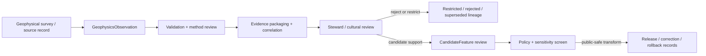

<!-- [KFM_META_BLOCK_V2]
doc_id: kfm://contract/domains/archaeology/geophysics-observation
title: contracts/domains/archaeology/geophysics_observation.md — GeophysicsObservation Contract
type: contract
version: v0.2
status: draft
owners: OWNER_TBD — Archaeology steward · Geophysics steward · Contract steward · Evidence steward · Schema steward · Policy steward · Review steward · Validation steward · Release steward · Docs steward
created: 2026-06-20
updated: 2026-06-20
policy_label: public; contracts; domains; archaeology; geophysics-observation; semantic-contract; observation; sensitive-lane
tags: [kfm, contracts, archaeology, geophysics, observation, remote-sensing, candidate-feature, evidence, review, policy, sensitivity, lifecycle, governance]
related:
  - ./README.md
  - ./OBJECT_MAP.md
  - ./domain_observation.md
  - ./remote_sensing_anomaly.md
  - ./lidar_candidate.md
  - ./candidate_feature.md
  - ./site_component.md
  - ./archaeological_site.md
  - ./survey_project.md
  - ./survey_transect.md
  - ./provenience_context.md
  - ./stratigraphic_unit.md
  - ./cultural_review.md
  - ./steward_review.md
  - ./sensitivity_transform.md
  - ./publication_transform_receipt.md
  - ../../../docs/domains/archaeology/MISSING_OR_PLANNED_FILES.md
  - ../../../docs/domains/archaeology/CANONICAL_PATHS.md
  - ../../../docs/domains/archaeology/ARCHITECTURE.md
  - ../../../docs/domains/archaeology/DATA_LIFECYCLE.md
  - ../../../schemas/contracts/v1/domains/archaeology/geophysics_observation.schema.json
  - ../../../policy/sensitivity/archaeology/
  - ../../../data/proofs/
  - ../../../release/
notes:
  - "Expanded from a planned-file scaffold into the object-level GeophysicsObservation semantic contract."
  - "The paired schema is currently a PROPOSED scaffold with empty properties and additionalProperties enabled."
  - "OBJECT_MAP.md maps GeophysicsObservation to geophysics_observation.md and geophysics_observation.schema.json as NEEDS VERIFICATION."
  - "This contract defines geophysics-observation meaning; it does not authorize publication, candidate confirmation, site confirmation, policy approval, review approval, or release approval."
[/KFM_META_BLOCK_V2] -->

<a id="top"></a>

# GeophysicsObservation Contract

> Semantic contract for `GeophysicsObservation`, the Archaeology-domain object representing a governed geophysical observation, survey response, anomaly reading, or instrument-derived signal used to support review of candidate features, site components, survey interpretation, and evidence packaging without converting the signal into proof or public release by itself.

<p>
  
  
  
  
  
  
</p>

`contracts/domains/archaeology/geophysics_observation.md`

## Quick jumps

[Status](#status) · [Meaning](#meaning) · [Repo fit](#repo-fit) · [Observation boundary](#observation-boundary) · [Schema posture](#schema-posture) · [Accepted uses](#accepted-uses) · [Exclusions](#exclusions) · [Recommended fields](#recommended-fields) · [Invariants](#invariants) · [Lifecycle](#lifecycle) · [Validation](#validation) · [Evidence basis](#evidence-basis) · [Rollback](#rollback) · [Definition of done](#definition-of-done)

---

## Status

> [!IMPORTANT]
> **Status:** `draft` / semantic contract  
> **Owner:** `OWNER_TBD`  
> **Contract path:** `contracts/domains/archaeology/geophysics_observation.md`  
> **Schema path:** `schemas/contracts/v1/domains/archaeology/geophysics_observation.schema.json`  
> **Truth posture:** `CONFIRMED` target path, current update, paired scaffold schema, object-map row, and uploaded authoring guidance. Validator behavior, fixtures, policy behavior, source registry behavior, evidence-bundle implementation, review workflow, release workflow, API behavior, UI behavior, and runtime behavior remain `NEEDS VERIFICATION`.

> [!CAUTION]
> This contract defines object meaning only. It does **not** authorize publication, candidate confirmation, site confirmation, fieldwork approval, policy approval, review approval, proof closure, public geometry, or release of sensitive geophysical survey results.

---

## Meaning

`GeophysicsObservation` is the Archaeology-domain object for a bounded geophysical observation or survey response. It records the semantic boundary of a geophysical signal, reading, interpreted anomaly candidate, or instrument-derived observation before the observation is promoted into a candidate feature, site component, interpretation, layer, or public-safe summary.

A geophysics observation may support:

- non-invasive survey review;
- candidate-feature identification;
- comparison with remote-sensing, LiDAR, field, or excavation observations;
- survey transect or project documentation;
- internal evidence packaging;
- steward, cultural, policy, validation, correction, and rollback workflows.

It is not:

- a confirmed archaeological site;
- a confirmed candidate feature;
- a raw instrument file;
- a public map layer;
- an EvidenceBundle;
- a PolicyDecision;
- a ReviewRecord;
- a ReleaseManifest;
- proof that a subsurface feature exists;
- permission to disclose precise survey locations, sensitive survey patterns, or restricted interpretation detail.

---

## Repo fit

```text
contracts/
└── domains/
    └── archaeology/
        ├── README.md
        ├── geophysics_observation.md
        ├── domain_observation.md
        ├── remote_sensing_anomaly.md
        └── lidar_candidate.md
```

Adjacent roots and object families:

| Root or object | Relationship |
|---|---|
| `./README.md` | Archaeology semantic-contract directory boundary. |
| `./OBJECT_MAP.md` | Maps `GeophysicsObservation` to this contract and its expected schema. |
| `./domain_observation.md` | Generic observation envelope that may frame this specialized observation family. |
| `./remote_sensing_anomaly.md`, `./lidar_candidate.md` | Adjacent non-invasive observation/candidate families. |
| `./candidate_feature.md` | Candidate object that a reviewed geophysics observation may support, contest, or route into review. |
| `./site_component.md`, `./archaeological_site.md` | Higher-order archaeological entities that may cite reviewed geophysical evidence. |
| `./survey_project.md`, `./survey_transect.md` | Project and survey path context that may govern observation scope. |
| `./provenience_context.md`, `./stratigraphic_unit.md` | Context objects that may be related after review or excavation correlation. |
| `./cultural_review.md`, `./steward_review.md` | Review objects required before consequential interpretation or exposure. |
| `../../../schemas/contracts/v1/domains/archaeology/geophysics_observation.schema.json` | Current scaffold schema. |
| `../../../policy/sensitivity/archaeology/` | Policy gate home; behavior not verified here. |
| `../../../data/proofs/` | EvidenceBundle/proof support. |
| `../../../release/` | Release, correction, supersession, and rollback authority. |

---

## Observation boundary

`GeophysicsObservation` must preserve the difference between signal, interpretation, candidate, proof, and publication.

| Boundary | Rule |
|---|---|
| Observation vs. raw instrument data | This object can summarize or reference a geophysical response; raw files remain in lifecycle data roots. |
| Observation vs. interpretation | A signal may suggest an interpretation; it is not interpretation proof by itself. |
| Observation vs. candidate feature | A reviewed observation may support `CandidateFeature`; it does not confirm one alone. |
| Observation vs. site component | Correlation with other evidence is required before treating the observation as a site component. |
| Observation vs. EvidenceBundle | Observations may be bundled as evidence; they are not the bundle or proof closure. |
| Observation vs. public release | Public use requires review, policy, transform, release, and rollback support. |

---

## Schema posture

The paired schema found for this contract is:

```text
schemas/contracts/v1/domains/archaeology/geophysics_observation.schema.json
```

Current schema evidence:

| Schema fact | Status |
|---|---|
| Schema file exists | `CONFIRMED` |
| Schema title is `Geophysics Observation` | `CONFIRMED` |
| Schema status is `PROPOSED` | `CONFIRMED` |
| Schema properties are empty | `CONFIRMED` |
| `additionalProperties` is `true` | `CONFIRMED` |
| Schema `source_doc` points to the planned-files ledger | `CONFIRMED` |
| Schema `contract_doc` points to this contract | `CONFIRMED` |
| Validator implementation | `UNKNOWN / NOT FOUND IN THIS TASK` |

This contract therefore defines semantic expectations for future schema and validator work. It does not claim that machine validation currently enforces those expectations.

---

## Accepted uses

| Use | Allowed? | Rule |
|---|---:|---|
| Defining the meaning of a geophysics observation object | Yes | Must preserve method, source, survey, evidence, sensitivity, review, and lifecycle posture. |
| Linking geophysics observations to candidates or site components | Conditional | Must preserve uncertainty, method limits, correlation evidence, review state, and sensitivity controls. |
| Supporting non-invasive survey review | Yes | Must not imply public release or final interpretation. |
| Supporting public-safe summaries | Conditional | Requires policy, review, transform receipt, release record, and safe precision. |
| Treating a geophysics observation as candidate confirmation | No | Confirmation requires governed evidence and review. |
| Treating a geophysical response as site proof | No | EvidenceBundle and review remain separate. |
| Publishing sensitive survey detail by default | No | Sensitive survey details fail closed unless approved through governed release. |
| Using schema validity as proof of truth | No | Schema shape is not evidence proof. |
| Treating this contract as release approval | No | Release authority remains separate. |

---

## Exclusions

| Does not belong in this contract | Correct home |
|---|---|
| Machine field shape | `../../../schemas/contracts/v1/domains/archaeology/geophysics_observation.schema.json`. |
| Validator implementation | `../../../tools/validators/...`. |
| Fixtures and tests | `../../../fixtures/...`, `../../../tests/...`. |
| Raw instrument readings, grids, profiles, project files, or bulk geophysical survey exports | `../../../data/raw/`, `../../../data/work/`, or `../../../data/quarantine/`, subject to lifecycle and sensitivity rules. |
| EvidenceBundle/proof content | `../../../data/proofs/`. |
| Sensitivity, access, admissibility, or release policy | `../../../policy/...`. |
| Steward/cultural review records | Governance/review contract and record homes. |
| Release manifests, correction notices, rollback cards | `../../../release/`. |
| Public layer, UI, API, renderer, or Focus Mode implementation | Governed app/API/UI/layer roots. |

---

## Recommended fields

The current schema does not require these fields. They are `PROPOSED` semantic requirements for future schema/validator work:

| Field | Meaning |
|---|---|
| `geophysics_observation_id` | Stable deterministic or steward-assigned geophysics observation identity. |
| `observation_type` | Magnetometry, ground-penetrating radar, resistivity, conductivity, gradiometry, electromagnetic, or other reviewed method category. |
| `project_ref` | SurveyProject, survey campaign, permit, source, or project-scope reference where modeled. |
| `survey_transect_refs` | SurveyTransect or grid references associated with the observation. |
| `candidate_feature_refs` | CandidateFeature references supported, contested, or created from the observation. |
| `site_component_refs` | SiteComponent references only after review and evidence correlation. |
| `instrument_ref` | Instrument, sensor, platform, configuration, or method reference. |
| `processing_refs` | Processing workflow, filter, interpretation, or transformation references. |
| `observation_statement` | Bounded statement of what the geophysical response indicates, with uncertainty and limits. |
| `observation_geometry_ref` | Internal geometry/support-scope reference; public-safe generalization required before exposure. |
| `spatial_precision_class` | Exact, generalized, suppressed, centroided, binned, county/region, or denied precision posture. |
| `observed_time` | Time of observation or survey collection. |
| `source_time` | Time represented by the source or report, if different from observation time. |
| `source_refs` | SourceDescriptor/source record references. |
| `source_roles` | Source roles supporting, contextualizing, or contesting the observation. |
| `evidence_refs` | EvidenceRef/EvidenceBundle references. |
| `confidence_statement` | Bounded confidence, uncertainty, or limitation statement. |
| `contradiction_refs` | Observations or claims that contest this observation. |
| `review_state` | Intake, needs review, under review, accepted internal observation, rejected, superseded, quarantined, release-candidate, or withdrawn. |
| `review_refs` | StewardReview, CulturalReview, or other review record references. |
| `policy_state` | Policy posture or policy-decision reference. |
| `sensitivity_class` | Sensitivity/public-safety classification. |
| `lineage_refs` | Prior, successor, supersession, split, merge, or rollback observation records. |
| `release_refs` | Release/candidate linkage where applicable. |
| `correction_refs` | Correction/supersession/rollback lineage. |
| `spec_hash` | Integrity pin for the representation. |

---

## Invariants

`GeophysicsObservation` must preserve these invariants:

- geophysics observations are not proof by themselves;
- geophysics observations are not candidate or site confirmation by themselves;
- signal, method, processing, interpretation, candidate, evidence, review, policy, release, correction, and rollback objects must remain distinct;
- raw instrument data and contract-level summaries must remain separated;
- method, source, survey scope, uncertainty, sensitivity, review posture, and lifecycle state must remain inspectable;
- sensitive survey detail fails closed unless policy, review, and release authorize a public-safe transform;
- contradiction, rejection, supersession, and correction lineage must remain traceable;
- schema validity is not evidence proof;
- public-facing use must be downstream of governed release artifacts and public-safe transforms;
- publication is a governed state transition, not a file move.

---

## Lifecycle



The contract defines the meaning of a geophysics-observation object. It does not replace source intake, fieldwork authorization, evidence resolution, schema validation, policy enforcement, review, transform receipts, release approval, correction, or rollback systems.

---

## Validation

Before relying on this contract, verify:

- schema fields beyond scaffold status;
- validator implementation and fixture coverage;
- canonical geophysics-observation ID and deterministic identity rules;
- boundary between GeophysicsObservation, DomainObservation, RemoteSensingAnomaly, LiDARCandidate, CandidateFeature, and SiteComponent;
- geophysical method vocabulary and processing lineage requirements;
- EvidenceRef/EvidenceBundle requirements;
- source-role, time-kind, survey-scope, geometry, and confidence requirements;
- sensitivity handling for restricted survey and interpretation detail;
- steward/cultural review requirements;
- policy-gate requirements;
- release, correction, supersession, withdrawal, and rollback linkage;
- no downstream surface treats this contract as public disclosure permission, final proof, or site confirmation.

---

## Evidence basis

| Source | Status | Supports | Limits |
|---|---|---|---|
| Prior `geophysics_observation.md` scaffold | `CONFIRMED` | Target file existed as a planned-file scaffold. | Scaffold did not define authoritative semantics. |
| `geophysics_observation.schema.json` | `CONFIRMED scaffold` | Schema exists, is `PROPOSED`, has empty properties, allows additional properties, and points to this contract. | Does not enforce full geophysics-observation semantics. |
| `OBJECT_MAP.md` | `CONFIRMED current map` | Maps `GeophysicsObservation` to `geophysics_observation.md` and `geophysics_observation.schema.json` with status `NEEDS VERIFICATION`. | Does not prove validator, fixture, policy, or release behavior. |
| Uploaded authoring prompt v2 | `CONFIRMED user-supplied guidance` | Requires evidence-grounded, implementation-honest Markdown with verification and rollback posture. | Authoring guidance, not implementation proof. |

---

## Rollback

Rollback is required if this contract is used to claim schema completeness, validator coverage, policy enforcement, review completion, release execution, API/UI behavior, fieldwork authorization, evidence proof, candidate confirmation, site confirmation, public disclosure permission, or implementation maturity not verified in this task.

Rollback target: prior scaffold blob SHA `f55f586364f4655f478135c2dba95b9e7789704f`.

---

## Definition of done

- [ ] Owners are confirmed and `OWNER_TBD` is replaced.
- [ ] Geophysics-observation vocabulary is reviewed by the Archaeology steward and geophysics steward.
- [ ] Boundary between `GeophysicsObservation`, `DomainObservation`, `RemoteSensingAnomaly`, `LiDARCandidate`, `CandidateFeature`, and `SiteComponent` is accepted.
- [ ] Paired JSON Schema is expanded from scaffold status.
- [ ] Valid and invalid fixtures cover internal, restricted, rejected, superseded, corrected, release-candidate, and rollback states.
- [ ] Validator enforces required project, method, instrument, processing, source, evidence, observation, confidence, review, sensitivity, policy, lineage, and visibility fields.
- [ ] Fixtures avoid unsafe survey or interpretation detail where references or redacted summaries are safer.
- [ ] EvidenceBundle, PolicyDecision, ReviewRecord, SensitivityTransform, PublicationTransformReceipt, ReleaseManifest, CorrectionNotice, and RollbackCard references are validated where required.
- [ ] API/UI surfaces prove they cannot treat a geophysics observation as proof, candidate confirmation, site confirmation, or public disclosure permission.
- [ ] Release and rollback dry-runs prove this contract cannot bypass publication gates.

## Status summary

`GeophysicsObservation` is a sensitive Archaeology observation object. It can support non-invasive survey review, candidate-feature evaluation, evidence packaging, correction, and public-safe explanation when evidence, review, policy, transform, and release allow, but it is not proof, not candidate confirmation, not site confirmation, not policy approval, and not release approval.

<p align="right"><a href="#top">Back to top</a></p>
