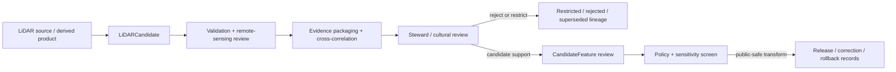

<!-- [KFM_META_BLOCK_V2]
doc_id: kfm://contract/domains/archaeology/lidar-candidate
title: contracts/domains/archaeology/lidar_candidate.md — LiDARCandidate Contract
type: contract
version: v0.2
status: draft
owners: OWNER_TBD — Archaeology steward · Remote sensing steward · Contract steward · Evidence steward · Schema steward · Policy steward · Review steward · Validation steward · Release steward · Docs steward
created: 2026-06-20
updated: 2026-06-20
policy_label: public; contracts; domains; archaeology; lidar-candidate; semantic-contract; remote-sensing; sensitive-lane
tags: [kfm, contracts, archaeology, lidar, remote-sensing, candidate-feature, evidence, review, policy, sensitivity, lifecycle, governance]
related:
  - ./README.md
  - ./OBJECT_MAP.md
  - ./domain_observation.md
  - ./remote_sensing_anomaly.md
  - ./geophysics_observation.md
  - ./candidate_feature.md
  - ./site_component.md
  - ./archaeological_site.md
  - ./survey_project.md
  - ./survey_transect.md
  - ./domain_feature_identity.md
  - ./cultural_review.md
  - ./steward_review.md
  - ./sensitivity_transform.md
  - ./publication_transform_receipt.md
  - ../../../docs/domains/archaeology/MISSING_OR_PLANNED_FILES.md
  - ../../../docs/domains/archaeology/CANONICAL_PATHS.md
  - ../../../docs/domains/archaeology/ARCHITECTURE.md
  - ../../../docs/domains/archaeology/DATA_LIFECYCLE.md
  - ../../../schemas/contracts/v1/domains/archaeology/lidar_candidate.schema.json
  - ../../../policy/sensitivity/archaeology/
  - ../../../data/proofs/
  - ../../../release/
notes:
  - "Expanded from a planned-file scaffold into the object-level LiDARCandidate semantic contract."
  - "The paired schema is currently a PROPOSED scaffold with empty properties and additionalProperties enabled."
  - "OBJECT_MAP.md maps LiDARCandidate to lidar_candidate.md and lidar_candidate.schema.json as NEEDS VERIFICATION."
  - "This contract defines LiDAR-candidate meaning; it does not authorize publication, candidate confirmation, site confirmation, policy approval, review approval, or release approval."
[/KFM_META_BLOCK_V2] -->

<a id="top"></a>

# LiDARCandidate Contract

> Semantic contract for `LiDARCandidate`, the Archaeology-domain object representing a governed LiDAR-derived candidate signal, landform indication, terrain feature hypothesis, or remote-sensing candidate used to support review without converting the candidate into proof, site confirmation, public geometry, or release approval by itself.

<p>
  
  
  
  
  
  
</p>

`contracts/domains/archaeology/lidar_candidate.md`

## Quick jumps

[Status](#status) · [Meaning](#meaning) · [Repo fit](#repo-fit) · [Candidate boundary](#candidate-boundary) · [Schema posture](#schema-posture) · [Accepted uses](#accepted-uses) · [Exclusions](#exclusions) · [Recommended fields](#recommended-fields) · [Invariants](#invariants) · [Lifecycle](#lifecycle) · [Validation](#validation) · [Evidence basis](#evidence-basis) · [Rollback](#rollback) · [Definition of done](#definition-of-done)

---

## Status

> [!IMPORTANT]
> **Status:** `draft` / semantic contract  
> **Owner:** `OWNER_TBD`  
> **Contract path:** `contracts/domains/archaeology/lidar_candidate.md`  
> **Schema path:** `schemas/contracts/v1/domains/archaeology/lidar_candidate.schema.json`  
> **Truth posture:** `CONFIRMED` target path, current update, paired scaffold schema, object-map row, and uploaded authoring guidance. Validator behavior, fixtures, policy behavior, source registry behavior, evidence-bundle implementation, review workflow, release workflow, API behavior, UI behavior, and runtime behavior remain `NEEDS VERIFICATION`.

> [!CAUTION]
> This contract defines object meaning only. It does **not** authorize publication, candidate confirmation, site confirmation, fieldwork approval, policy approval, review approval, proof closure, public geometry, or release of sensitive remote-sensing results.

---

## Meaning

`LiDARCandidate` is the Archaeology-domain object for a bounded LiDAR-derived candidate. It records the semantic boundary of a terrain signal, landform indication, elevation-derived pattern, or remote-sensing candidate before that candidate is promoted into `CandidateFeature`, `SiteComponent`, `ArchaeologicalSite`, a map layer, or a public-safe summary.

A LiDAR candidate may support:

- remote-sensing triage;
- candidate-feature review;
- comparison with field, geophysical, archival, or other remote-sensing observations;
- survey planning or review queues;
- internal evidence packaging;
- steward, cultural, policy, validation, correction, and rollback workflows.

It is not:

- a confirmed archaeological site;
- a confirmed candidate feature;
- a raw point cloud, DEM, DSM, tile, or raster;
- a public map layer;
- an EvidenceBundle;
- a PolicyDecision;
- a ReviewRecord;
- a ReleaseManifest;
- proof that a cultural feature exists;
- permission to disclose precise candidate geometry, sensitive interpretation detail, or restricted review context.

---

## Repo fit

```text
contracts/
└── domains/
    └── archaeology/
        ├── README.md
        ├── lidar_candidate.md
        ├── remote_sensing_anomaly.md
        ├── domain_observation.md
        └── candidate_feature.md
```

Adjacent roots and object families:

| Root or object | Relationship |
|---|---|
| `./README.md` | Archaeology semantic-contract directory boundary. |
| `./OBJECT_MAP.md` | Maps `LiDARCandidate` to this contract and its expected schema. |
| `./domain_observation.md` | Generic observation envelope that may frame this specialized candidate family. |
| `./remote_sensing_anomaly.md` | Adjacent remote-sensing anomaly family; boundary requires steward review. |
| `./geophysics_observation.md` | Adjacent non-invasive observation family for cross-corroboration. |
| `./candidate_feature.md` | Candidate object that a reviewed LiDAR candidate may support, contest, or route into review. |
| `./site_component.md`, `./archaeological_site.md` | Higher-order archaeological entities that may cite reviewed evidence. |
| `./survey_project.md`, `./survey_transect.md` | Project and survey context that may govern follow-up review. |
| `./domain_feature_identity.md` | Identity/crosswalk object that may reconcile LiDAR candidates with other feature-like records. |
| `./cultural_review.md`, `./steward_review.md` | Review objects required before consequential interpretation or exposure. |
| `../../../schemas/contracts/v1/domains/archaeology/lidar_candidate.schema.json` | Current scaffold schema. |
| `../../../policy/sensitivity/archaeology/` | Policy gate home; behavior not verified here. |
| `../../../data/proofs/` | EvidenceBundle/proof support. |
| `../../../release/` | Release, correction, supersession, and rollback authority. |

---

## Candidate boundary

`LiDARCandidate` must preserve the difference between signal, candidate, interpretation, proof, and publication.

| Boundary | Rule |
|---|---|
| Candidate vs. raw LiDAR data | This object can summarize or reference a LiDAR-derived signal; raw point clouds, rasters, and tiles remain in lifecycle data roots. |
| Candidate vs. remote-sensing anomaly | A LiDAR candidate may be a specialized anomaly or sibling family; the mapping remains subject to steward review. |
| Candidate vs. candidate feature | A reviewed LiDAR candidate may support `CandidateFeature`; it does not confirm one alone. |
| Candidate vs. site component | Correlation with other evidence is required before treating the candidate as a site component. |
| Candidate vs. EvidenceBundle | Candidates may be bundled as evidence; they are not the bundle or proof closure. |
| Candidate vs. public release | Public use requires review, policy, transform, release, and rollback support. |

---

## Schema posture

The paired schema found for this contract is:

```text
schemas/contracts/v1/domains/archaeology/lidar_candidate.schema.json
```

Current schema evidence:

| Schema fact | Status |
|---|---|
| Schema file exists | `CONFIRMED` |
| Schema title is `Lidar Candidate` | `CONFIRMED` |
| Schema status is `PROPOSED` | `CONFIRMED` |
| Schema properties are empty | `CONFIRMED` |
| `additionalProperties` is `true` | `CONFIRMED` |
| Schema `source_doc` points to the planned-files ledger | `CONFIRMED` |
| Schema `contract_doc` points to this contract | `CONFIRMED` |
| Validator implementation | `UNKNOWN / NOT FOUND IN THIS TASK` |

This contract therefore defines semantic expectations for future schema and validator work. It does not claim that machine validation currently enforces those expectations.

---

## Accepted uses

| Use | Allowed? | Rule |
|---|---:|---|
| Defining the meaning of a LiDAR-derived candidate object | Yes | Must preserve source, processing, terrain signal, evidence, sensitivity, review, and lifecycle posture. |
| Linking LiDAR candidates to candidate features or site components | Conditional | Must preserve uncertainty, method limits, correlation evidence, review state, and sensitivity controls. |
| Supporting remote-sensing review queues | Yes | Must not imply public release or final interpretation. |
| Supporting public-safe summaries | Conditional | Requires policy, review, transform receipt, release record, and safe precision. |
| Treating a LiDAR candidate as candidate confirmation | No | Confirmation requires governed evidence and review. |
| Treating a terrain signal as site proof | No | EvidenceBundle and review remain separate. |
| Publishing sensitive candidate detail by default | No | Sensitive details fail closed unless approved through governed release. |
| Using schema validity as proof of truth | No | Schema shape is not evidence proof. |
| Treating this contract as release approval | No | Release authority remains separate. |

---

## Exclusions

| Does not belong in this contract | Correct home |
|---|---|
| Machine field shape | `../../../schemas/contracts/v1/domains/archaeology/lidar_candidate.schema.json`. |
| Validator implementation | `../../../tools/validators/...`. |
| Fixtures and tests | `../../../fixtures/...`, `../../../tests/...`. |
| Raw point clouds, DEM/DSM rasters, tiles, hillshades, derivatives, or bulk remote-sensing exports | `../../../data/raw/`, `../../../data/work/`, or `../../../data/quarantine/`, subject to lifecycle and sensitivity rules. |
| EvidenceBundle/proof content | `../../../data/proofs/`. |
| Sensitivity, access, admissibility, or release policy | `../../../policy/...`. |
| Steward/cultural review records | Governance/review contract and record homes. |
| Release manifests, correction notices, rollback cards | `../../../release/`. |
| Public layer, UI, API, renderer, or Focus Mode implementation | Governed app/API/UI/layer roots. |

---

## Recommended fields

The current schema does not require these fields. They are `PROPOSED` semantic requirements for future schema/validator work:

| Field | Meaning |
|---|---|
| `lidar_candidate_id` | Stable deterministic or steward-assigned LiDAR candidate identity. |
| `candidate_type` | Terrain signal, mound-like form, enclosure-like form, linear feature, depression, platform, anomaly, or other reviewed candidate type. |
| `source_refs` | SourceDescriptor/source record references for LiDAR or derived products. |
| `source_roles` | Source roles supporting, contextualizing, or contesting the candidate. |
| `processing_refs` | Processing workflow, derivative, visualization, model, or transform references. |
| `candidate_geometry_ref` | Internal geometry/support-scope reference; public-safe generalization required before exposure. |
| `spatial_precision_class` | Exact, generalized, suppressed, centroided, binned, county/region, or denied precision posture. |
| `candidate_statement` | Bounded statement of what the LiDAR-derived signal may indicate, with uncertainty and limits. |
| `domain_observation_refs` | DomainObservation references when candidate evidence is packaged through a generic observation envelope. |
| `remote_sensing_anomaly_refs` | RemoteSensingAnomaly references where this candidate is part of a broader anomaly workflow. |
| `candidate_feature_refs` | CandidateFeature references supported, contested, or created from the candidate. |
| `site_component_refs` | SiteComponent references only after review and evidence correlation. |
| `survey_refs` | SurveyProject or SurveyTransect references for review or follow-up. |
| `evidence_refs` | EvidenceRef/EvidenceBundle references. |
| `confidence_statement` | Bounded confidence, uncertainty, or limitation statement. |
| `contradiction_refs` | Observations or claims that contest this candidate. |
| `review_state` | Intake, needs review, under review, accepted internal candidate, rejected, superseded, quarantined, release-candidate, or withdrawn. |
| `review_refs` | StewardReview, CulturalReview, or other review record references. |
| `policy_state` | Policy posture or policy-decision reference. |
| `sensitivity_class` | Sensitivity/public-safety classification. |
| `lineage_refs` | Prior, successor, supersession, split, merge, or rollback candidate records. |
| `release_refs` | Release/candidate linkage where applicable. |
| `correction_refs` | Correction/supersession/rollback lineage. |
| `spec_hash` | Integrity pin for the representation. |

---

## Invariants

`LiDARCandidate` must preserve these invariants:

- LiDAR candidates are not proof by themselves;
- LiDAR candidates are not candidate-feature or site confirmation by themselves;
- source data, processing, candidate signal, interpretation, candidate feature, evidence, review, policy, release, correction, and rollback objects must remain distinct;
- raw remote-sensing data and contract-level summaries must remain separated;
- source, processing, terrain signal, uncertainty, sensitivity, review posture, and lifecycle state must remain inspectable;
- sensitive candidate detail fails closed unless policy, review, and release authorize a public-safe transform;
- contradiction, rejection, supersession, and correction lineage must remain traceable;
- schema validity is not evidence proof;
- public-facing use must be downstream of governed release artifacts and public-safe transforms;
- publication is a governed state transition, not a file move.

---

## Lifecycle



The contract defines the meaning of a LiDAR-candidate object. It does not replace source intake, remote-sensing processing, evidence resolution, schema validation, policy enforcement, review, transform receipts, release approval, correction, or rollback systems.

---

## Validation

Before relying on this contract, verify:

- schema fields beyond scaffold status;
- validator implementation and fixture coverage;
- canonical LiDAR-candidate ID and deterministic identity rules;
- boundary between LiDARCandidate, RemoteSensingAnomaly, DomainObservation, CandidateFeature, and SiteComponent;
- remote-sensing source, processing, derivative, and confidence vocabulary;
- EvidenceRef/EvidenceBundle requirements;
- source-role, time-kind, geometry, and confidence requirements;
- sensitivity handling for restricted candidate and interpretation detail;
- steward/cultural review requirements;
- policy-gate requirements;
- release, correction, supersession, withdrawal, and rollback linkage;
- no downstream surface treats this contract as public disclosure permission, final proof, candidate confirmation, or site confirmation.

---

## Evidence basis

| Source | Status | Supports | Limits |
|---|---|---|---|
| Prior `lidar_candidate.md` scaffold | `CONFIRMED` | Target file existed as a planned-file scaffold. | Scaffold did not define authoritative semantics. |
| `lidar_candidate.schema.json` | `CONFIRMED scaffold` | Schema exists, is `PROPOSED`, has empty properties, allows additional properties, and points to this contract. | Does not enforce full LiDAR-candidate semantics. |
| `OBJECT_MAP.md` | `CONFIRMED current map` | Maps `LiDARCandidate` to `lidar_candidate.md` and `lidar_candidate.schema.json` with status `NEEDS VERIFICATION`. | Does not prove validator, fixture, policy, or release behavior. |
| Uploaded authoring prompt v2 | `CONFIRMED user-supplied guidance` | Requires evidence-grounded, implementation-honest Markdown with verification and rollback posture. | Authoring guidance, not implementation proof. |

---

## Rollback

Rollback is required if this contract is used to claim schema completeness, validator coverage, policy enforcement, review completion, release execution, API/UI behavior, evidence proof, candidate confirmation, site confirmation, public disclosure permission, or implementation maturity not verified in this task.

Rollback target: prior scaffold blob SHA `5a834ffbc65d6ee6ac795a9f3e36dc52db6abdcf`.

---

## Definition of done

- [ ] Owners are confirmed and `OWNER_TBD` is replaced.
- [ ] LiDAR-candidate vocabulary is reviewed by the Archaeology steward and remote sensing steward.
- [ ] Boundary between `LiDARCandidate`, `RemoteSensingAnomaly`, `DomainObservation`, `CandidateFeature`, and `SiteComponent` is accepted.
- [ ] Paired JSON Schema is expanded from scaffold status.
- [ ] Valid and invalid fixtures cover internal, restricted, rejected, superseded, corrected, release-candidate, and rollback states.
- [ ] Validator enforces required source, processing, candidate, evidence, observation, confidence, review, sensitivity, policy, lineage, and visibility fields.
- [ ] Fixtures avoid unsafe candidate or interpretation detail where references or redacted summaries are safer.
- [ ] EvidenceBundle, PolicyDecision, ReviewRecord, SensitivityTransform, PublicationTransformReceipt, ReleaseManifest, CorrectionNotice, and RollbackCard references are validated where required.
- [ ] API/UI surfaces prove they cannot treat a LiDAR candidate as proof, candidate confirmation, site confirmation, or public disclosure permission.
- [ ] Release and rollback dry-runs prove this contract cannot bypass publication gates.

## Status summary

`LiDARCandidate` is a sensitive Archaeology remote-sensing candidate object. It can support terrain-signal review, candidate-feature evaluation, evidence packaging, correction, and public-safe explanation when evidence, review, policy, transform, and release allow, but it is not proof, not candidate confirmation, not site confirmation, not policy approval, and not release approval.

<p align="right"><a href="#top">Back to top</a></p>
