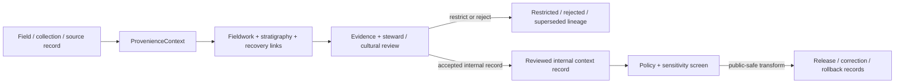

<!-- [KFM_META_BLOCK_V2]
doc_id: kfm://contract/domains/archaeology/provenience-context
title: contracts/domains/archaeology/provenience_context.md — ProvenienceContext Contract
type: contract
version: v0.2
status: draft
owners: OWNER_TBD — Archaeology steward · Fieldwork steward · Collections steward · Contract steward · Evidence steward · Schema steward · Policy steward · Review steward · Validation steward · Release steward · Docs steward
created: 2026-06-20
updated: 2026-06-20
policy_label: public; contracts; domains; archaeology; provenience-context; semantic-contract; fieldwork; collections; sensitive-lane
tags: [kfm, contracts, archaeology, provenience, context, fieldwork, collections, stratigraphy, evidence, review, policy, sensitivity, lifecycle, governance]
related:
  - ./README.md
  - ./OBJECT_MAP.md
  - ./archaeological_site.md
  - ./site_component.md
  - ./survey_project.md
  - ./survey_transect.md
  - ./excavation_unit.md
  - ./test_unit.md
  - ./shovel_test.md
  - ./stratigraphic_unit.md
  - ./artifact_record.md
  - ./sample.md
  - ./collection_repository_record.md
  - ./chronology_assertion.md
  - ./domain_observation.md
  - ./cultural_review.md
  - ./steward_review.md
  - ./sensitivity_transform.md
  - ./publication_transform_receipt.md
  - ../../../docs/domains/archaeology/MISSING_OR_PLANNED_FILES.md
  - ../../../docs/domains/archaeology/CANONICAL_PATHS.md
  - ../../../docs/domains/archaeology/ARCHITECTURE.md
  - ../../../docs/domains/archaeology/DATA_LIFECYCLE.md
  - ../../../schemas/contracts/v1/domains/archaeology/provenience_context.schema.json
  - ../../../policy/sensitivity/archaeology/
  - ../../../data/proofs/
  - ../../../release/
notes:
  - "Expanded from a planned-file scaffold into the object-level ProvenienceContext semantic contract."
  - "The paired schema is currently a PROPOSED scaffold with empty properties and additionalProperties enabled."
  - "OBJECT_MAP.md maps ProvenienceContext to provenience_context.md and provenience_context.schema.json as NEEDS VERIFICATION."
  - "This contract defines context meaning; it does not authorize publication, proof closure, review approval, policy approval, or release approval."
[/KFM_META_BLOCK_V2] -->

<a id="top"></a>

# ProvenienceContext Contract

> Semantic contract for `ProvenienceContext`, the Archaeology-domain object representing the governed context of origin, recovery, association, or observation for artifacts, samples, stratigraphic records, fieldwork units, survey records, and related claims without converting that context into proof, site confirmation, or release approval by itself.

<p>
  
  
  
  
  
  
</p>

`contracts/domains/archaeology/provenience_context.md`

## Quick jumps

[Status](#status) · [Meaning](#meaning) · [Repo fit](#repo-fit) · [Context boundary](#context-boundary) · [Schema posture](#schema-posture) · [Accepted uses](#accepted-uses) · [Exclusions](#exclusions) · [Recommended fields](#recommended-fields) · [Invariants](#invariants) · [Lifecycle](#lifecycle) · [Validation](#validation) · [Evidence basis](#evidence-basis) · [Rollback](#rollback) · [Definition of done](#definition-of-done)

---

## Status

> [!IMPORTANT]
> **Status:** `draft` / semantic contract  
> **Owner:** `OWNER_TBD`  
> **Contract path:** `contracts/domains/archaeology/provenience_context.md`  
> **Schema path:** `schemas/contracts/v1/domains/archaeology/provenience_context.schema.json`  
> **Truth posture:** `CONFIRMED` target path, current update, paired scaffold schema, object-map row, and uploaded authoring guidance. Validator behavior, fixtures, policy behavior, source registry behavior, evidence-bundle implementation, review workflow, release workflow, API behavior, UI behavior, and runtime behavior remain `NEEDS VERIFICATION`.

> [!CAUTION]
> This contract defines object meaning only. It does **not** authorize publication, recovery proof, site confirmation, review approval, policy approval, proof closure, or release of controlled archaeology context records.

---

## Meaning

`ProvenienceContext` is the Archaeology-domain object for recording the governed context in which an archaeological object, sample, observation, or claim was found, collected, observed, documented, associated, or interpreted.

A provenience context may support:

- artifact and sample recovery lineage;
- fieldwork-unit, survey, or collection linkage;
- stratigraphic and spatial relationship review;
- chronology or interpretation review;
- collections and repository reconciliation;
- evidence packaging, correction, supersession, and rollback workflows.

It is not:

- a raw field notebook;
- a raw excavation record;
- an artifact or sample record;
- a stratigraphic unit by itself;
- an excavation unit by itself;
- a confirmed archaeological site;
- an EvidenceBundle;
- a PolicyDecision;
- a ReviewRecord;
- a ReleaseManifest;
- proof that an association, recovery, or interpretation is true without evidence and review support.

---

## Repo fit

```text
contracts/
└── domains/
    └── archaeology/
        ├── README.md
        ├── provenience_context.md
        ├── stratigraphic_unit.md
        ├── excavation_unit.md
        └── artifact_record.md
```

Adjacent roots and object families:

| Root or object | Relationship |
|---|---|
| `./README.md` | Archaeology semantic-contract directory boundary. |
| `./OBJECT_MAP.md` | Maps `ProvenienceContext` to this contract and its expected schema. |
| `./excavation_unit.md`, `./test_unit.md`, `./shovel_test.md` | Fieldwork unit families that may generate or reference provenience contexts. |
| `./stratigraphic_unit.md` | Stratigraphic object that may structure or constrain context meaning. |
| `./artifact_record.md`, `./sample.md` | Recovery objects that may cite provenience context. |
| `./collection_repository_record.md` | Repository/collections object that may preserve custody or accession linkage. |
| `./chronology_assertion.md` | Temporal assertion object that may depend on context and sample relationships. |
| `./domain_observation.md` | Observation object that may cite or create context records. |
| `./site_component.md`, `./archaeological_site.md` | Higher-order archaeological entities that may cite reviewed context evidence. |
| `./cultural_review.md`, `./steward_review.md` | Review objects required before consequential interpretation or exposure. |
| `../../../schemas/contracts/v1/domains/archaeology/provenience_context.schema.json` | Current scaffold schema. |
| `../../../policy/sensitivity/archaeology/` | Policy gate home; behavior not verified here. |
| `../../../data/proofs/` | EvidenceBundle/proof support. |
| `../../../release/` | Release, correction, supersession, and rollback authority. |

---

## Context boundary

`ProvenienceContext` must preserve the difference between context, recovery, interpretation, proof, and publication.

| Boundary | Rule |
|---|---|
| Context vs. raw field record | This object can summarize or reference context; raw records remain in lifecycle data roots. |
| Context vs. excavation unit | A context may occur within or across a unit; the unit object carries fieldwork-unit identity. |
| Context vs. stratigraphy | A context may be structured by stratigraphy; `StratigraphicUnit` carries stratigraphic-unit meaning. |
| Context vs. artifact/sample | Artifacts and samples remain separate object families with their own evidence and custody lineage. |
| Context vs. interpretation | Context can support interpretation; it is not interpretation proof by itself. |
| Context vs. public release | Public use requires review, policy, transform, release, and rollback support. |

---

## Schema posture

The paired schema found for this contract is:

```text
schemas/contracts/v1/domains/archaeology/provenience_context.schema.json
```

Current schema evidence:

| Schema fact | Status |
|---|---|
| Schema file exists | `CONFIRMED` |
| Schema title is `Provenience Context` | `CONFIRMED` |
| Schema status is `PROPOSED` | `CONFIRMED` |
| Schema properties are empty | `CONFIRMED` |
| `additionalProperties` is `true` | `CONFIRMED` |
| Schema `source_doc` points to the planned-files ledger | `CONFIRMED` |
| Schema `contract_doc` points to this contract | `CONFIRMED` |
| Validator implementation | `UNKNOWN / NOT FOUND IN THIS TASK` |

This contract therefore defines semantic expectations for future schema and validator work. It does not claim that machine validation currently enforces those expectations.

---

## Accepted uses

| Use | Allowed? | Rule |
|---|---:|---|
| Defining the meaning of a provenience context object | Yes | Must preserve source, fieldwork, recovery, stratigraphy, evidence, review, sensitivity, and lifecycle posture. |
| Linking artifacts, samples, observations, and stratigraphy | Conditional | Must preserve uncertainty, custody/recovery lineage, review state, and policy controls. |
| Supporting internal cataloging, evidence review, or collections reconciliation | Yes | Must not imply public release or final interpretation. |
| Supporting public-safe summaries | Conditional | Requires policy, review, transform receipt, release record, and safe precision. |
| Treating provenience context as recovery proof by itself | No | Proof requires evidence resolution and review. |
| Treating context association as interpretation proof | No | EvidenceBundle and review remain separate. |
| Publishing controlled context detail by default | No | Controlled details fail closed unless approved through governed release. |
| Using schema validity as proof of truth | No | Schema shape is not evidence proof. |
| Treating this contract as release approval | No | Release authority remains separate. |

---

## Exclusions

| Does not belong in this contract | Correct home |
|---|---|
| Machine field shape | `../../../schemas/contracts/v1/domains/archaeology/provenience_context.schema.json`. |
| Validator implementation | `../../../tools/validators/...`. |
| Fixtures and tests | `../../../fixtures/...`, `../../../tests/...`. |
| Raw field forms, notebooks, photographs, instrument files, catalog exports, or bulk context records | `../../../data/raw/`, `../../../data/work/`, or `../../../data/quarantine/`, subject to lifecycle and sensitivity rules. |
| EvidenceBundle/proof content | `../../../data/proofs/`. |
| Sensitivity, access, admissibility, or release policy | `../../../policy/...`. |
| Steward/cultural review records | Governance/review contract and record homes. |
| Release manifests, correction notices, rollback cards | `../../../release/`. |
| Public layer, UI, API, renderer, or Focus Mode implementation | Governed app/API/UI/layer roots. |

---

## Recommended fields

The current schema does not require these fields. They are `PROPOSED` semantic requirements for future schema/validator work:

| Field | Meaning |
|---|---|
| `provenience_context_id` | Stable deterministic or steward-assigned context identity. |
| `context_type` | Field, excavation, test, survey, stratigraphic, collection, repository, sample, artifact, archival/report, or other reviewed context type. |
| `context_label` | Field label, catalog label, lot/context number, unit-context label, or repository context label. |
| `project_ref` | SurveyProject, excavation project, permit, source, or project-scope reference where modeled. |
| `site_ref` | ArchaeologicalSite or CandidateFeature reference, when allowed and reviewed. |
| `fieldwork_refs` | ExcavationUnit, TestUnit, ShovelTest, SurveyProject, or SurveyTransect references. |
| `stratigraphic_refs` | StratigraphicUnit references structuring the context. |
| `artifact_refs` | ArtifactRecord references associated with the context. |
| `sample_refs` | Sample references associated with the context. |
| `observation_refs` | DomainObservation or specialized observation references. |
| `collection_refs` | CollectionRepositoryRecord or custody/accession references. |
| `context_geometry_ref` | Internal geometry/support-scope reference; public-safe generalization required before exposure. |
| `spatial_precision_class` | Exact, generalized, suppressed, centroided, binned, county/region, or denied precision posture. |
| `temporal_context_refs` | CulturalTemporalPeriod, ChronologyAssertion, or date/sample references. |
| `source_refs` | SourceDescriptor/source record references. |
| `source_roles` | Source roles supporting, contextualizing, or contesting the context. |
| `evidence_refs` | EvidenceRef/EvidenceBundle references. |
| `confidence_statement` | Bounded confidence, uncertainty, or limitation statement. |
| `contradiction_refs` | Observations, contexts, or claims that contest this context. |
| `review_state` | Intake, needs review, under review, accepted internal record, rejected, superseded, quarantined, release-candidate, or withdrawn. |
| `review_refs` | StewardReview, CulturalReview, repository review, or other review record references. |
| `policy_state` | Policy posture or policy-decision reference. |
| `sensitivity_class` | Sensitivity/public-safety classification. |
| `lineage_refs` | Prior, successor, supersession, split, merge, or rollback context records. |
| `release_refs` | Release/candidate linkage where applicable. |
| `correction_refs` | Correction/supersession/rollback lineage. |
| `spec_hash` | Integrity pin for the representation. |

---

## Invariants

`ProvenienceContext` must preserve these invariants:

- provenience contexts are not proof by themselves;
- provenience contexts are not site confirmation by themselves;
- context identity must remain distinct from fieldwork unit, stratigraphic unit, artifact, sample, evidence, review, policy, release, correction, and rollback objects;
- raw field/collection records and contract-level summaries must remain separated;
- source, recovery, association, uncertainty, sensitivity, review posture, and lifecycle state must remain inspectable;
- controlled context detail fails closed unless policy, review, and release authorize a public-safe transform;
- contradiction, rejection, supersession, and correction lineage must remain traceable;
- schema validity is not evidence proof;
- public-facing use must be downstream of governed release artifacts and public-safe transforms;
- publication is a governed state transition, not a file move.

---

## Lifecycle



The contract defines the meaning of a provenience-context object. It does not replace source intake, fieldwork authorization, evidence resolution, schema validation, policy enforcement, review, transform receipts, release approval, correction, or rollback systems.

---

## Validation

Before relying on this contract, verify:

- schema fields beyond scaffold status;
- validator implementation and fixture coverage;
- canonical provenience-context ID and deterministic identity rules;
- boundary between ProvenienceContext, StratigraphicUnit, ExcavationUnit, TestUnit, ShovelTest, ArtifactRecord, and Sample;
- fieldwork, collection, repository, and custody linkage requirements;
- EvidenceRef/EvidenceBundle requirements;
- source-role, time-kind, geometry, context, recovery, and association requirements;
- sensitivity handling for controlled context and collection detail;
- steward/cultural review requirements;
- policy-gate requirements;
- release, correction, supersession, withdrawal, and rollback linkage;
- no downstream surface treats this contract as public disclosure permission, final proof, recovery proof, or site confirmation.

---

## Evidence basis

| Source | Status | Supports | Limits |
|---|---|---|---|
| Prior `provenience_context.md` scaffold | `CONFIRMED` | Target file existed as a planned-file scaffold. | Scaffold did not define authoritative semantics. |
| `provenience_context.schema.json` | `CONFIRMED scaffold` | Schema exists, is `PROPOSED`, has empty properties, allows additional properties, and points to this contract. | Does not enforce full provenience-context semantics. |
| `OBJECT_MAP.md` | `CONFIRMED current map` | Maps `ProvenienceContext` to `provenience_context.md` and `provenience_context.schema.json` with status `NEEDS VERIFICATION`. | Does not prove validator, fixture, policy, or release behavior. |
| Uploaded authoring prompt v2 | `CONFIRMED user-supplied guidance` | Requires evidence-grounded, implementation-honest Markdown with verification and rollback posture. | Authoring guidance, not implementation proof. |

---

## Rollback

Rollback is required if this contract is used to claim schema completeness, validator coverage, policy enforcement, review completion, release execution, API/UI behavior, fieldwork authorization, custody proof, evidence proof, recovery proof, site confirmation, public disclosure permission, or implementation maturity not verified in this task.

Rollback target: prior scaffold blob SHA `763b19e4bb361f777e45cfd8b7c6a64c7d3827d2`.

---

## Definition of done

- [ ] Owners are confirmed and `OWNER_TBD` is replaced.
- [ ] Provenience-context vocabulary is reviewed by the Archaeology steward, fieldwork steward, and collections steward.
- [ ] Boundary between `ProvenienceContext`, `StratigraphicUnit`, `ExcavationUnit`, `TestUnit`, `ShovelTest`, `ArtifactRecord`, and `Sample` is accepted.
- [ ] Paired JSON Schema is expanded from scaffold status.
- [ ] Valid and invalid fixtures cover internal, restricted, rejected, superseded, corrected, release-candidate, and rollback states.
- [ ] Validator enforces required project, unit, context, source, evidence, stratigraphy, recovery, custody, review, sensitivity, policy, lineage, and visibility fields.
- [ ] Fixtures avoid unsafe context, association, or collection detail where references or redacted summaries are safer.
- [ ] EvidenceBundle, PolicyDecision, ReviewRecord, SensitivityTransform, PublicationTransformReceipt, ReleaseManifest, CorrectionNotice, and RollbackCard references are validated where required.
- [ ] API/UI surfaces prove they cannot treat a provenience context as proof, recovery proof, site confirmation, or public disclosure permission.
- [ ] Release and rollback dry-runs prove this contract cannot bypass publication gates.

## Status summary

`ProvenienceContext` is a sensitive Archaeology context object. It can support fieldwork, stratigraphy, recovery, collections, evidence packaging, review, correction, and public-safe explanation when evidence, review, policy, transform, and release allow, but it is not proof, not recovery proof, not site confirmation, not policy approval, and not release approval.

<p align="right"><a href="#top">Back to top</a></p>
