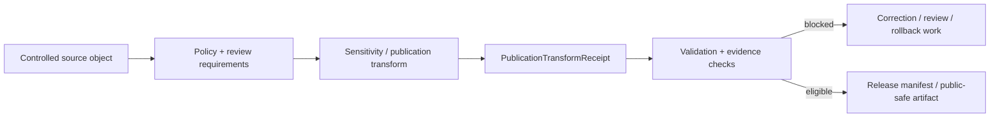

<!-- [KFM_META_BLOCK_V2]
doc_id: kfm://contract/domains/archaeology/publication-transform-receipt
title: contracts/domains/archaeology/publication_transform_receipt.md — PublicationTransformReceipt Contract
type: contract
version: v0.2
status: draft
owners: OWNER_TBD — Archaeology steward · Release steward · Policy steward · Review steward · Evidence steward · Contract steward · Schema steward · Validation steward · Docs steward
created: 2026-06-20
updated: 2026-06-20
policy_label: public; contracts; domains; archaeology; publication-transform-receipt; semantic-contract; release; receipt; sensitive-lane
tags: [kfm, contracts, archaeology, publication, transform, receipt, release, policy, review, sensitivity, evidence, correction, rollback, governance]
related:
  - ./README.md
  - ./OBJECT_MAP.md
  - ./sensitivity_transform.md
  - ./cultural_review.md
  - ./steward_review.md
  - ./domain_validation_report.md
  - ./domain_layer_descriptor.md
  - ./domain_observation.md
  - ./candidate_feature.md
  - ./archaeological_site.md
  - ./site_component.md
  - ./provenience_context.md
  - ./geophysics_observation.md
  - ./lidar_candidate.md
  - ./remote_sensing_anomaly.md
  - ../../../docs/domains/archaeology/CANONICAL_PATHS.md
  - ../../../docs/domains/archaeology/MISSING_OR_PLANNED_FILES.md
  - ../../../docs/domains/archaeology/ARCHITECTURE.md
  - ../../../docs/domains/archaeology/DATA_LIFECYCLE.md
  - ../../../schemas/contracts/v1/domains/archaeology/publication_transform_receipt.schema.json
  - ../../../policy/sensitivity/archaeology/
  - ../../../data/proofs/
  - ../../../release/
notes:
  - "Expanded from a planned-file scaffold into the object-level PublicationTransformReceipt semantic contract."
  - "The paired schema is currently a PROPOSED scaffold with empty properties and additionalProperties enabled."
  - "OBJECT_MAP.md maps PublicationTransformReceipt to publication_transform_receipt.md and publication_transform_receipt.schema.json as NEEDS VERIFICATION."
  - "Scaffold source and schema source differ: the Markdown scaffold cites CANONICAL_PATHS.md while the schema cites MISSING_OR_PLANNED_FILES.md. This remains NEEDS VERIFICATION."
  - "This contract defines receipt meaning; it does not authorize release, policy approval, review approval, evidence proof, or public publication by itself."
[/KFM_META_BLOCK_V2] -->

<a id="top"></a>

# PublicationTransformReceipt Contract

> Semantic contract for `PublicationTransformReceipt`, the Archaeology-domain receipt object that records how an internal or controlled archaeology object was transformed into a public-safe or release-candidate representation. It proves that a transform was recorded; it does not prove that the underlying claim is true, that policy approved the output, or that release has occurred.

<p>
  
  
  
  
  
  
</p>

`contracts/domains/archaeology/publication_transform_receipt.md`

## Quick jumps

[Status](#status) · [Meaning](#meaning) · [Repo fit](#repo-fit) · [Receipt boundary](#receipt-boundary) · [Schema posture](#schema-posture) · [Accepted uses](#accepted-uses) · [Exclusions](#exclusions) · [Recommended fields](#recommended-fields) · [Invariants](#invariants) · [Lifecycle](#lifecycle) · [Validation](#validation) · [Evidence basis](#evidence-basis) · [Rollback](#rollback) · [Definition of done](#definition-of-done)

---

## Status

> [!IMPORTANT]
> **Status:** `draft` / semantic contract  
> **Owner:** `OWNER_TBD`  
> **Contract path:** `contracts/domains/archaeology/publication_transform_receipt.md`  
> **Schema path:** `schemas/contracts/v1/domains/archaeology/publication_transform_receipt.schema.json`  
> **Truth posture:** `CONFIRMED` target path, current update, paired scaffold schema, object-map row, and uploaded authoring guidance. Transform implementation, validator behavior, fixtures, policy behavior, evidence-bundle implementation, review workflow, release workflow, API behavior, UI behavior, and runtime behavior remain `NEEDS VERIFICATION`.

> [!CAUTION]
> This contract defines receipt meaning only. It does **not** authorize publication, release, policy approval, review approval, proof closure, public geometry, or public exposure of controlled archaeology records.

---

## Meaning

`PublicationTransformReceipt` is the Archaeology-domain receipt object for recording a transformation from an internal, controlled, or review-stage archaeology object into a public-safe, semi-public, or release-candidate representation.

A publication transform receipt may record:

- the source object or artifact transformed;
- the transform applied;
- the reason the transform was required;
- the output representation created;
- policy, review, validation, and release references;
- integrity hashes or lineage pointers;
- correction, supersession, withdrawal, and rollback links.

It is not:

- the transform code itself;
- a PolicyDecision;
- a ReviewRecord;
- an EvidenceBundle;
- a ReleaseManifest;
- a MapReleaseManifest;
- a public layer descriptor;
- proof that the source claim is true;
- proof that release has been approved;
- permission to expose controlled details outside a governed release path.

---

## Repo fit

```text
contracts/
└── domains/
    └── archaeology/
        ├── README.md
        ├── publication_transform_receipt.md
        ├── sensitivity_transform.md
        ├── cultural_review.md
        └── steward_review.md
```

Adjacent roots and object families:

| Root or object | Relationship |
|---|---|
| `./README.md` | Archaeology semantic-contract directory boundary. |
| `./OBJECT_MAP.md` | Maps `PublicationTransformReceipt` to this contract and its expected schema. |
| `./sensitivity_transform.md` | Transform-policy object that may define or require the transform recorded by this receipt. |
| `./cultural_review.md`, `./steward_review.md` | Review objects that may be required before a transform can support publication. |
| `./domain_validation_report.md` | Validation-report object that may record whether receipt requirements were checked. |
| `./domain_layer_descriptor.md` | Layer descriptor that may reference receipt-backed public-safe outputs. |
| `./domain_observation.md`, `./candidate_feature.md`, `./archaeological_site.md`, `./site_component.md` | Example source-object families that may require transformation before public use. |
| `../../../schemas/contracts/v1/domains/archaeology/publication_transform_receipt.schema.json` | Current scaffold schema. |
| `../../../policy/sensitivity/archaeology/` | Policy gate home; behavior not verified here. |
| `../../../data/proofs/` | EvidenceBundle/proof support. |
| `../../../release/` | Release, correction, supersession, and rollback authority. |

---

## Receipt boundary

`PublicationTransformReceipt` must preserve the difference between transform record, transform execution, policy decision, review decision, evidence proof, and release.

| Boundary | Rule |
|---|---|
| Receipt vs. transform code | The receipt records a transform event or result; executable transform logic lives elsewhere. |
| Receipt vs. policy | The receipt may reference policy; it does not make policy decisions. |
| Receipt vs. review | The receipt may reference review records; it does not approve review. |
| Receipt vs. evidence | The receipt can reference EvidenceBundle support; it does not prove the claim itself. |
| Receipt vs. release | The receipt can support a release gate; it does not publish or approve release. |
| Receipt vs. public output | The receipt describes how output was made; the released artifact remains separate. |

---

## Schema posture

The paired schema found for this contract is:

```text
schemas/contracts/v1/domains/archaeology/publication_transform_receipt.schema.json
```

Current schema evidence:

| Schema fact | Status |
|---|---|
| Schema file exists | `CONFIRMED` |
| Schema title is `Publication Transform Receipt` | `CONFIRMED` |
| Schema status is `PROPOSED` | `CONFIRMED` |
| Schema properties are empty | `CONFIRMED` |
| `additionalProperties` is `true` | `CONFIRMED` |
| Schema `source_doc` points to `docs/domains/archaeology/MISSING_OR_PLANNED_FILES.md` | `CONFIRMED` |
| Schema `contract_doc` points to this contract | `CONFIRMED` |
| Prior Markdown scaffold source points to `docs/domains/archaeology/CANONICAL_PATHS.md` | `CONFIRMED` |
| Source-ledger mismatch between scaffold and schema | `CONFLICTED / NEEDS VERIFICATION` |
| Validator implementation | `UNKNOWN / NOT FOUND IN THIS TASK` |

This contract defines semantic expectations for future schema and validator work. It does not claim that machine validation currently enforces those expectations.

---

## Accepted uses

| Use | Allowed? | Rule |
|---|---:|---|
| Defining the meaning of a publication transform receipt | Yes | Must preserve source, transform, output, policy, review, evidence, validation, release, and rollback posture. |
| Recording that a public-safe representation was produced | Yes | Must identify source, output, transform class, reason, and lineage. |
| Supporting release gates | Conditional | May inform release gates but cannot approve release. |
| Supporting correction, supersession, or rollback | Yes | Must preserve prior receipt and output lineage. |
| Treating the receipt as a PolicyDecision | No | Policy authority remains separate. |
| Treating the receipt as review approval | No | Review authority remains separate. |
| Treating the receipt as EvidenceBundle proof | No | Evidence proof remains separate. |
| Treating the receipt as publication approval | No | Release authority remains separate. |
| Using schema validity as proof of safe publication | No | Schema shape is not policy, review, evidence, or release proof. |

---

## Exclusions

| Does not belong in this contract | Correct home |
|---|---|
| Machine field shape | `../../../schemas/contracts/v1/domains/archaeology/publication_transform_receipt.schema.json`. |
| Transform implementation | Package/tool roots after placement review. |
| Fixtures and tests | `../../../fixtures/...`, `../../../tests/...`. |
| Raw, work, quarantine, processed, or released data payloads | Lifecycle data and release roots. |
| EvidenceBundle/proof content | `../../../data/proofs/`. |
| Sensitivity, access, admissibility, or release policy | `../../../policy/...`. |
| Steward/cultural review records | Governance/review contract and record homes. |
| Release manifests, correction notices, rollback cards | `../../../release/`. |
| Public layer, UI, API, renderer, or Focus Mode implementation | Governed app/API/UI/layer roots. |

---

## Recommended fields

The current schema does not require these fields. They are `PROPOSED` semantic requirements for future schema/validator work:

| Field | Meaning |
|---|---|
| `publication_transform_receipt_id` | Stable deterministic or steward-assigned receipt identity. |
| `source_object_refs` | Internal objects, records, layers, or artifacts transformed. |
| `source_object_family` | Contract family or object type of the transformed input. |
| `source_lifecycle_state` | RAW, WORK, QUARANTINE, PROCESSED, CATALOG/TRIPLET, release-candidate, or other reviewed state. |
| `transform_type` | Redaction, generalization, suppression, aggregation, masking, delay, summary, public-safe layer, or other reviewed transform class. |
| `transform_reason` | Why the transform was required. |
| `transform_policy_refs` | SensitivityTransform, PolicyDecision, policy rule, or policy receipt references. |
| `review_refs` | StewardReview, CulturalReview, or release review references. |
| `validation_refs` | DomainValidationReport, validator run, test, or fixture references. |
| `evidence_refs` | EvidenceRef/EvidenceBundle references for the source claim or output statement. |
| `input_hashes` | Integrity hashes for source object representations where allowed. |
| `output_refs` | Produced public-safe object, layer, summary, tile, manifest, or release-candidate reference. |
| `output_hashes` | Integrity hashes for transformed outputs. |
| `visibility_class` | Internal, restricted, public-safe, release-candidate, released, withdrawn, or superseded. |
| `residual_risk_statement` | Bounded statement of any remaining publication risk or uncertainty. |
| `created_at` | Receipt creation time. |
| `transform_run_ref` | Tool, workflow, or run receipt reference, if available. |
| `release_refs` | ReleaseManifest, MapReleaseManifest, or release-candidate linkage. |
| `lineage_refs` | Prior, successor, supersession, correction, or rollback receipt records. |
| `correction_refs` | CorrectionNotice or correction receipt references. |
| `rollback_refs` | RollbackCard or rollback target references. |
| `spec_hash` | Integrity pin for the receipt representation. |

---

## Invariants

`PublicationTransformReceipt` must preserve these invariants:

- receipt records are not release approval by themselves;
- receipt records are not policy approval by themselves;
- receipt records are not review approval by themselves;
- receipt records are not evidence proof by themselves;
- transform code, transformed output, policy decision, review record, release manifest, correction notice, and rollback target must remain separate object families;
- source object, output object, transform reason, policy references, review references, validation references, and release references must remain inspectable;
- unresolved policy, review, evidence, validation, or release gaps must remain visible;
- schema validity is not proof of safe publication;
- public-facing use must be downstream of governed release artifacts and public-safe transforms;
- publication is a governed state transition, not a file move.

---

## Lifecycle



The contract defines the meaning of a publication-transform receipt. It does not replace transform execution, evidence resolution, schema validation, policy enforcement, review approval, release approval, correction, or rollback systems.

---

## Validation

Before relying on this contract, verify:

- schema fields beyond scaffold status;
- validator implementation and fixture coverage;
- canonical receipt ID and deterministic identity rules;
- source-object and output-object reference rules;
- transform vocabulary and policy-linkage requirements;
- EvidenceRef/EvidenceBundle requirements;
- review, validation, release, correction, and rollback references;
- source-ledger mismatch between scaffold and schema;
- public-safe output integrity and residual-risk vocabulary;
- no downstream surface treats this receipt as proof, policy approval, review approval, or release approval.

---

## Evidence basis

| Source | Status | Supports | Limits |
|---|---|---|---|
| Prior `publication_transform_receipt.md` scaffold | `CONFIRMED` | Target file existed as a planned-file scaffold and cited `CANONICAL_PATHS.md`. | Scaffold did not define authoritative semantics. |
| `publication_transform_receipt.schema.json` | `CONFIRMED scaffold` | Schema exists, is `PROPOSED`, has empty properties, allows additional properties, points to this contract, and cites `MISSING_OR_PLANNED_FILES.md`. | Does not enforce full receipt semantics. |
| `OBJECT_MAP.md` | `CONFIRMED current map` | Maps `PublicationTransformReceipt` to `publication_transform_receipt.md` and `publication_transform_receipt.schema.json` with status `NEEDS VERIFICATION`. | Does not prove validator, fixture, policy, review, transform, or release behavior. |
| Uploaded authoring prompt v2 | `CONFIRMED user-supplied guidance` | Requires evidence-grounded, implementation-honest Markdown with verification and rollback posture. | Authoring guidance, not implementation proof. |

---

## Rollback

Rollback is required if this contract is used to claim schema completeness, validator coverage, transform execution, policy enforcement, review completion, release execution, API/UI behavior, evidence proof, publication permission, or implementation maturity not verified in this task.

Rollback target: prior scaffold blob SHA `36578c7faf061f41280dcb0be1ddfcd45f4b7042`.

---

## Definition of done

- [ ] Owners are confirmed and `OWNER_TBD` is replaced.
- [ ] Source-ledger mismatch between Markdown scaffold and schema source doc is resolved or documented.
- [ ] Publication-transform receipt vocabulary is reviewed by the Archaeology steward, policy steward, review steward, and release steward.
- [ ] Boundary between `PublicationTransformReceipt`, `SensitivityTransform`, `PolicyDecision`, `ReviewRecord`, `EvidenceBundle`, `ReleaseManifest`, `CorrectionNotice`, and `RollbackCard` is accepted.
- [ ] Paired JSON Schema is expanded from scaffold status.
- [ ] Valid and invalid fixtures cover created, blocked, corrected, superseded, release-candidate, released, withdrawn, and rollback states.
- [ ] Validator enforces source object, output object, transform, policy, review, evidence, validation, release, correction, rollback, and integrity fields.
- [ ] Fixtures avoid embedding controlled archaeology details where references or public-safe summaries are safer.
- [ ] API/UI surfaces prove they cannot treat this receipt as proof, policy approval, review approval, or release approval.
- [ ] Release and rollback dry-runs prove this contract cannot bypass publication gates.

## Status summary

`PublicationTransformReceipt` is a sensitive Archaeology receipt object. It can support public-safe transform auditability, release gates, correction, and rollback when tied to evidence, policy, review, validation, transform, and release records, but it is not proof, not policy approval, not review approval, and not release approval.

<p align="right"><a href="#top">Back to top</a></p>
