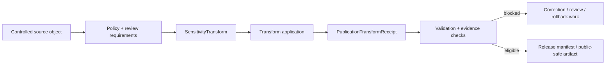

<!-- [KFM_META_BLOCK_V2]
doc_id: kfm://contract/domains/archaeology/sensitivity-transform
title: contracts/domains/archaeology/sensitivity_transform.md — SensitivityTransform Contract
type: contract
version: v0.2
status: draft
owners: OWNER_TBD — Archaeology steward · Policy steward · Review steward · Release steward · Evidence steward · Contract steward · Schema steward · Validation steward · Docs steward
created: 2026-06-20
updated: 2026-06-20
policy_label: public; contracts; domains; archaeology; sensitivity-transform; semantic-contract; policy; transform; release-gate; sensitive-lane
tags: [kfm, contracts, archaeology, sensitivity, transform, policy, review, release, evidence, publication, correction, rollback, governance]
related:
  - ./README.md
  - ./OBJECT_MAP.md
  - ./publication_transform_receipt.md
  - ./cultural_review.md
  - ./steward_review.md
  - ./domain_validation_report.md
  - ./domain_layer_descriptor.md
  - ./domain_observation.md
  - ./candidate_feature.md
  - ./archaeological_site.md
  - ./site_component.md
  - ./provenience_context.md
  - ./remote_sensing_anomaly.md
  - ./lidar_candidate.md
  - ./geophysics_observation.md
  - ../../../docs/domains/archaeology/MISSING_OR_PLANNED_FILES.md
  - ../../../docs/domains/archaeology/CANONICAL_PATHS.md
  - ../../../docs/domains/archaeology/ARCHITECTURE.md
  - ../../../docs/domains/archaeology/DATA_LIFECYCLE.md
  - ../../../schemas/contracts/v1/domains/archaeology/sensitivity_transform.schema.json
  - ../../../policy/sensitivity/archaeology/
  - ../../../data/proofs/
  - ../../../release/
notes:
  - "Expanded from a planned-file scaffold into the object-level SensitivityTransform semantic contract."
  - "The paired schema is currently a PROPOSED scaffold with empty properties and additionalProperties enabled."
  - "OBJECT_MAP.md maps SensitivityTransform to sensitivity_transform.md and sensitivity_transform.schema.json as NEEDS VERIFICATION."
  - "This contract defines transform meaning; it does not authorize release, policy approval, review approval, evidence proof, or public publication by itself."
[/KFM_META_BLOCK_V2] -->

<a id="top"></a>

# SensitivityTransform Contract

> Semantic contract for `SensitivityTransform`, the Archaeology-domain object describing a governed transformation used to make controlled archaeology material safer for review, sharing, publication-candidate workflows, or public-safe release. It defines transform meaning; it does not approve policy, review, evidence, or release by itself.

<p>
  
  
  
  
  
  
</p>

`contracts/domains/archaeology/sensitivity_transform.md`

## Quick jumps

[Status](#status) · [Meaning](#meaning) · [Repo fit](#repo-fit) · [Transform boundary](#transform-boundary) · [Schema posture](#schema-posture) · [Accepted uses](#accepted-uses) · [Exclusions](#exclusions) · [Recommended fields](#recommended-fields) · [Invariants](#invariants) · [Lifecycle](#lifecycle) · [Validation](#validation) · [Evidence basis](#evidence-basis) · [Rollback](#rollback) · [Definition of done](#definition-of-done)

---

## Status

> [!IMPORTANT]
> **Status:** `draft` / semantic contract  
> **Owner:** `OWNER_TBD`  
> **Contract path:** `contracts/domains/archaeology/sensitivity_transform.md`  
> **Schema path:** `schemas/contracts/v1/domains/archaeology/sensitivity_transform.schema.json`  
> **Truth posture:** `CONFIRMED` target path, current update, paired scaffold schema, object-map row, and uploaded authoring guidance. Transform implementation, validator behavior, fixtures, policy behavior, evidence-bundle implementation, review workflow, release workflow, API behavior, UI behavior, and runtime behavior remain `NEEDS VERIFICATION`.

> [!CAUTION]
> This contract defines transform meaning only. It does **not** authorize publication, release, policy approval, review approval, proof closure, public geometry, or public exposure of controlled archaeology records.

---

## Meaning

`SensitivityTransform` is the Archaeology-domain object for describing a governed transformation applied to controlled archaeology material before it can be used in broader sharing, map layers, summaries, publication-candidate artifacts, or public-safe release.

A sensitivity transform may describe:

- redaction;
- suppression;
- generalization;
- aggregation;
- masking;
- delayed visibility;
- summary-only representation;
- public-safe layer derivation;
- denial or abstention from publication when no safe transform is available.

It is not:

- the transform executable itself;
- a PublicationTransformReceipt;
- a PolicyDecision;
- a ReviewRecord;
- an EvidenceBundle;
- a ReleaseManifest;
- a public layer descriptor;
- proof that a source claim is true;
- proof that release has been approved;
- permission to expose controlled details outside a governed release path.

---

## Repo fit

```text
contracts/
└── domains/
    └── archaeology/
        ├── README.md
        ├── sensitivity_transform.md
        ├── publication_transform_receipt.md
        ├── cultural_review.md
        └── steward_review.md
```

Adjacent roots and object families:

| Root or object | Relationship |
|---|---|
| `./README.md` | Archaeology semantic-contract directory boundary. |
| `./OBJECT_MAP.md` | Maps `SensitivityTransform` to this contract and its expected schema. |
| `./publication_transform_receipt.md` | Receipt object that records a transform event or output. |
| `./cultural_review.md`, `./steward_review.md` | Review objects that may be required before transform use. |
| `./domain_validation_report.md` | Validation-report object that may record whether transform requirements were checked. |
| `./domain_layer_descriptor.md` | Layer descriptor that may reference public-safe transformed outputs. |
| `./domain_observation.md`, `./candidate_feature.md`, `./archaeological_site.md`, `./site_component.md` | Example source-object families that may require transformation before broader use. |
| `./provenience_context.md`, `./remote_sensing_anomaly.md`, `./lidar_candidate.md`, `./geophysics_observation.md` | Controlled-detail object families that may require careful transform rules. |
| `../../../schemas/contracts/v1/domains/archaeology/sensitivity_transform.schema.json` | Current scaffold schema. |
| `../../../policy/sensitivity/archaeology/` | Policy gate home; behavior not verified here. |
| `../../../data/proofs/` | EvidenceBundle/proof support. |
| `../../../release/` | Release, correction, supersession, and rollback authority. |

---

## Transform boundary

`SensitivityTransform` must preserve the difference between transform rule, transform execution, receipt, policy decision, review decision, evidence proof, and release.

| Boundary | Rule |
|---|---|
| Transform vs. executable code | This object defines transform meaning and admissible intent; executable implementation lives elsewhere. |
| Transform vs. receipt | The transform defines the rule or class; `PublicationTransformReceipt` records a specific application or output. |
| Transform vs. policy | The transform may reference policy; it does not make a policy decision by itself. |
| Transform vs. review | The transform may require review; it does not approve review. |
| Transform vs. evidence | The transform may preserve evidence linkage; it does not prove the claim. |
| Transform vs. release | The transform may support release gates; it does not publish or approve release. |

---

## Schema posture

The paired schema found for this contract is:

```text
schemas/contracts/v1/domains/archaeology/sensitivity_transform.schema.json
```

Current schema evidence:

| Schema fact | Status |
|---|---|
| Schema file exists | `CONFIRMED` |
| Schema title is `Sensitivity Transform` | `CONFIRMED` |
| Schema status is `PROPOSED` | `CONFIRMED` |
| Schema properties are empty | `CONFIRMED` |
| `additionalProperties` is `true` | `CONFIRMED` |
| Schema `source_doc` points to the planned-files ledger | `CONFIRMED` |
| Schema `contract_doc` points to this contract | `CONFIRMED` |
| Validator implementation | `UNKNOWN / NOT FOUND IN THIS TASK` |

This contract defines semantic expectations for future schema and validator work. It does not claim that machine validation currently enforces those expectations.

---

## Accepted uses

| Use | Allowed? | Rule |
|---|---:|---|
| Defining the meaning of an archaeology sensitivity transform | Yes | Must preserve source, transform, policy, review, evidence, validation, release, and rollback posture. |
| Describing redaction, generalization, masking, aggregation, suppression, or summary-only behavior | Yes | Must identify purpose, source class, output class, limits, and residual risk. |
| Supporting release gates | Conditional | May inform gates but cannot approve release. |
| Supporting receipt generation | Yes | Receipts remain separate and must record specific application details. |
| Treating the transform as a PolicyDecision | No | Policy authority remains separate. |
| Treating the transform as review approval | No | Review authority remains separate. |
| Treating the transform as EvidenceBundle proof | No | Evidence proof remains separate. |
| Treating the transform as publication approval | No | Release authority remains separate. |
| Using schema validity as proof of safe publication | No | Schema shape is not policy, review, evidence, or release proof. |

---

## Exclusions

| Does not belong in this contract | Correct home |
|---|---|
| Machine field shape | `../../../schemas/contracts/v1/domains/archaeology/sensitivity_transform.schema.json`. |
| Transform implementation | Package/tool roots after placement review. |
| Specific transform execution receipt | `./publication_transform_receipt.md`. |
| Fixtures and tests | `../../../fixtures/...`, `../../../tests/...`. |
| Raw, work, quarantine, processed, or released data payloads | Lifecycle data and release roots. |
| EvidenceBundle/proof content | `../../../data/proofs/`. |
| Sensitivity, access, admissibility, or release policy | `../../../policy/...`. |
| Steward/cultural review records | Governance/review contract and record homes. |
| Release manifests, correction notices, rollback cards | `../../../release/`. |
| Public layer, UI, API, renderer, or Focus Mode implementation | Governed app/API/UI/layer roots. |

---

## Recommended fields

The current schema does not require these fields. They are `PROPOSED` semantic requirements for future schema/validator work:

| Field | Meaning |
|---|---|
| `sensitivity_transform_id` | Stable deterministic or steward-assigned transform identity. |
| `transform_type` | Redaction, suppression, generalization, aggregation, masking, delay, summary-only, public-safe layer, denial, abstention, or other reviewed transform class. |
| `applies_to_object_families` | Source object families for which the transform may apply. |
| `source_lifecycle_states` | RAW, WORK, QUARANTINE, PROCESSED, CATALOG/TRIPLET, release-candidate, or other reviewed lifecycle states. |
| `trigger_conditions` | Conditions that require or recommend the transform. |
| `policy_refs` | PolicyDecision, policy rule, sensitivity rule, or policy registry references. |
| `review_refs` | StewardReview, CulturalReview, release review, or other required review references. |
| `input_visibility_class` | Internal, restricted, controlled, review-stage, release-candidate, or other input posture. |
| `output_visibility_class` | Internal, restricted, public-safe, release-candidate, released, withdrawn, or superseded posture. |
| `output_precision_rule` | How spatial, temporal, identity, source, or contextual precision is reduced or preserved. |
| `evidence_preservation_rule` | How EvidenceRef/EvidenceBundle links remain inspectable without exposing controlled details. |
| `citation_rule` | Citation behavior required for transformed outputs. |
| `residual_risk_statement` | Bounded statement of any remaining publication risk or uncertainty. |
| `denial_rule` | When the transform must fail closed instead of creating a public-safe output. |
| `receipt_required` | Whether a `PublicationTransformReceipt` is required after application. |
| `validation_refs` | DomainValidationReport, validator run, test, or fixture references. |
| `release_refs` | ReleaseManifest, MapReleaseManifest, or release-candidate linkage. |
| `lineage_refs` | Prior, successor, supersession, correction, or rollback transform records. |
| `correction_refs` | CorrectionNotice or correction receipt references. |
| `rollback_refs` | RollbackCard or rollback target references. |
| `spec_hash` | Integrity pin for the transform representation. |

---

## Invariants

`SensitivityTransform` must preserve these invariants:

- transform definitions are not release approval by themselves;
- transform definitions are not policy approval by themselves;
- transform definitions are not review approval by themselves;
- transform definitions are not evidence proof by themselves;
- transform definition, executable implementation, transform receipt, policy decision, review record, release manifest, correction notice, and rollback target must remain separate object families;
- source object, output posture, transform reason, policy references, review references, validation references, and release references must remain inspectable;
- unresolved policy, review, evidence, validation, or release gaps must remain visible;
- when no safe output can be produced, the transform must preserve denial or abstention rather than inventing a publishable summary;
- schema validity is not proof of safe publication;
- public-facing use must be downstream of governed release artifacts and public-safe transforms;
- publication is a governed state transition, not a file move.

---

## Lifecycle



The contract defines the meaning of a sensitivity-transform object. It does not replace transform execution, evidence resolution, schema validation, policy enforcement, review approval, release approval, correction, or rollback systems.

---

## Validation

Before relying on this contract, verify:

- schema fields beyond scaffold status;
- validator implementation and fixture coverage;
- canonical transform ID and deterministic identity rules;
- source-object and output-posture reference rules;
- transform vocabulary and policy-linkage requirements;
- EvidenceRef/EvidenceBundle requirements;
- review, validation, release, correction, and rollback references;
- residual-risk and denial/abstention vocabulary;
- public-safe output integrity requirements;
- no downstream surface treats this transform as proof, policy approval, review approval, or release approval.

---

## Evidence basis

| Source | Status | Supports | Limits |
|---|---|---|---|
| Prior `sensitivity_transform.md` scaffold | `CONFIRMED` | Target file existed as a planned-file scaffold and cited `MISSING_OR_PLANNED_FILES.md`. | Scaffold did not define authoritative semantics. |
| `sensitivity_transform.schema.json` | `CONFIRMED scaffold` | Schema exists, is `PROPOSED`, has empty properties, allows additional properties, and points to this contract. | Does not enforce full transform semantics. |
| `OBJECT_MAP.md` | `CONFIRMED current map` | Maps `SensitivityTransform` to `sensitivity_transform.md` and `sensitivity_transform.schema.json` with status `NEEDS VERIFICATION`. | Does not prove validator, fixture, policy, review, transform, or release behavior. |
| Uploaded authoring prompt v2 | `CONFIRMED user-supplied guidance` | Requires evidence-grounded, implementation-honest Markdown with verification and rollback posture. | Authoring guidance, not implementation proof. |

---

## Rollback

Rollback is required if this contract is used to claim schema completeness, validator coverage, transform execution, policy enforcement, review completion, release execution, API/UI behavior, evidence proof, publication permission, or implementation maturity not verified in this task.

Rollback target: prior scaffold blob SHA `f7db7626a8e233e99845f2cfcfd91311ce5c102f`.

---

## Definition of done

- [ ] Owners are confirmed and `OWNER_TBD` is replaced.
- [ ] Sensitivity-transform vocabulary is reviewed by the Archaeology steward, policy steward, review steward, and release steward.
- [ ] Boundary between `SensitivityTransform`, `PublicationTransformReceipt`, `PolicyDecision`, `ReviewRecord`, `EvidenceBundle`, `ReleaseManifest`, `CorrectionNotice`, and `RollbackCard` is accepted.
- [ ] Paired JSON Schema is expanded from scaffold status.
- [ ] Valid and invalid fixtures cover allowed, denied, abstained, blocked, corrected, superseded, release-candidate, released, withdrawn, and rollback states.
- [ ] Validator enforces source object, transform, output posture, policy, review, evidence, validation, release, correction, rollback, and integrity fields.
- [ ] Fixtures avoid embedding controlled archaeology details where references or public-safe summaries are safer.
- [ ] API/UI surfaces prove they cannot treat this transform as proof, policy approval, review approval, or release approval.
- [ ] Release and rollback dry-runs prove this contract cannot bypass publication gates.

## Status summary

`SensitivityTransform` is a sensitive Archaeology policy-transform object. It can describe how controlled archaeology material may be redacted, generalized, suppressed, aggregated, masked, delayed, summarized, or denied for safer downstream use, but it is not proof, not policy approval, not review approval, and not release approval.

<p align="right"><a href="#top">Back to top</a></p>
