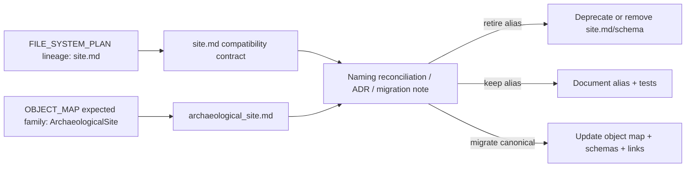

<!-- [KFM_META_BLOCK_V2]
doc_id: kfm://contract/domains/archaeology/site-compatibility
title: contracts/domains/archaeology/site.md — Site Compatibility Contract
type: contract
version: v0.2
status: draft
owners: OWNER_TBD — Archaeology steward · Contract steward · Schema steward · Evidence steward · Policy steward · Review steward · Release steward · Docs steward
created: 2026-06-20
updated: 2026-06-20
policy_label: public; contracts; domains; archaeology; site; compatibility; semantic-contract; sensitive-lane
tags: [kfm, contracts, archaeology, site, archaeological-site, compatibility, lineage, evidence, review, policy, sensitivity, lifecycle, governance]
related:
  - ./README.md
  - ./OBJECT_MAP.md
  - ./archaeological_site.md
  - ./site_component.md
  - ./candidate_feature.md
  - ./provenience_context.md
  - ./domain_feature_identity.md
  - ./domain_observation.md
  - ./cultural_review.md
  - ./steward_review.md
  - ./sensitivity_transform.md
  - ./publication_transform_receipt.md
  - ../../../docs/domains/archaeology/FILE_SYSTEM_PLAN.md
  - ../../../docs/domains/archaeology/MISSING_OR_PLANNED_FILES.md
  - ../../../docs/domains/archaeology/CANONICAL_PATHS.md
  - ../../../docs/domains/archaeology/ARCHITECTURE.md
  - ../../../docs/domains/archaeology/DATA_LIFECYCLE.md
  - ../../../schemas/contracts/v1/domains/archaeology/site.schema.json
  - ../../../schemas/contracts/v1/domains/archaeology/archaeological_site.schema.json
  - ../../../policy/sensitivity/archaeology/
  - ../../../data/proofs/
  - ../../../release/
notes:
  - "Expanded from a planned-file scaffold into a compatibility/lineage contract for the short Site name."
  - "The paired site.schema.json file is currently a PROPOSED scaffold with empty properties and additionalProperties enabled."
  - "OBJECT_MAP.md does not list Site as the canonical object family; it maps ArchaeologicalSite to archaeological_site.md and archaeological_site.schema.json."
  - "This contract preserves the Site vs ArchaeologicalSite naming conflict as CONFLICTED / NEEDS VERIFICATION instead of creating parallel authority."
  - "This contract does not authorize publication, site confirmation, policy approval, review approval, evidence proof, or release approval."
[/KFM_META_BLOCK_V2] -->

<a id="top"></a>

# Site Compatibility Contract

> Compatibility and lineage contract for `Site`, the short-name archaeology site scaffold. Current object-map evidence treats `ArchaeologicalSite` / `archaeological_site.md` as the expected object family, so this file must not become a parallel canonical site contract without steward review, schema reconciliation, and an ADR or migration note.

<p>
  
  
  
  
  
  
</p>

`contracts/domains/archaeology/site.md`

## Quick jumps

[Status](#status) · [Meaning](#meaning) · [Repo fit](#repo-fit) · [Naming boundary](#naming-boundary) · [Schema posture](#schema-posture) · [Accepted uses](#accepted-uses) · [Exclusions](#exclusions) · [Recommended resolution](#recommended-resolution) · [Invariants](#invariants) · [Lifecycle](#lifecycle) · [Validation](#validation) · [Evidence basis](#evidence-basis) · [Rollback](#rollback) · [Definition of done](#definition-of-done)

---

## Status

> [!IMPORTANT]
> **Status:** `draft` / compatibility contract  
> **Owner:** `OWNER_TBD`  
> **Contract path:** `contracts/domains/archaeology/site.md`  
> **Paired scaffold schema:** `schemas/contracts/v1/domains/archaeology/site.schema.json`  
> **Expected canonical site contract in current object map:** `contracts/domains/archaeology/archaeological_site.md`  
> **Truth posture:** `CONFIRMED` target path, paired `site.schema.json` scaffold, `archaeological_site.md`, `archaeological_site.schema.json`, object-map row for `ArchaeologicalSite`, and uploaded authoring guidance. Canonical naming resolution, schema migration, validator behavior, fixtures, policy behavior, review workflow, release workflow, API behavior, UI behavior, and runtime behavior remain `NEEDS VERIFICATION`.

> [!CAUTION]
> This file is a compatibility/lineage contract. It must not be used to bypass `ArchaeologicalSite`, create a second site authority, confirm a site, expose controlled site detail, approve review, approve policy, or approve release.

---

## Meaning

`Site` is a short-name archaeology scaffold that appears in the repository as a planned or expected path from `FILE_SYSTEM_PLAN.md` lineage. In the currently inspected object map, the expected object family is instead named `ArchaeologicalSite`, with the expected contract `archaeological_site.md` and schema `archaeological_site.schema.json`.

Therefore, this file serves as a **compatibility and reconciliation contract** until maintainers decide whether to:

- retire `site.md` and `site.schema.json`;
- keep `site.md` as an alias or navigation bridge;
- migrate `site.md` into `archaeological_site.md`;
- preserve both names with clearly separated meanings; or
- document the divergence in an ADR or migration note.

It is not:

- the current object-map canonical site contract;
- a confirmed archaeological site object by itself;
- a raw source row;
- a candidate feature;
- a site component;
- an EvidenceBundle;
- a PolicyDecision;
- a ReviewRecord;
- a ReleaseManifest;
- proof that a site exists;
- permission to expose controlled site details.

---

## Repo fit

```text
contracts/
└── domains/
    └── archaeology/
        ├── README.md
        ├── OBJECT_MAP.md
        ├── site.md                  # compatibility / lineage path
        └── archaeological_site.md   # current object-map expected site contract
```

Adjacent roots and object families:

| Root or object | Relationship |
|---|---|
| `./OBJECT_MAP.md` | Lists `ArchaeologicalSite`, not `Site`, as the expected object family. |
| `./archaeological_site.md` | Current expected site contract from the object map. |
| `./site_component.md` | Component/part relationship to a reviewed site identity. |
| `./candidate_feature.md` | Candidate object boundary; not equivalent to a reviewed site identity. |
| `./provenience_context.md` | Context/provenience relationship. |
| `./domain_feature_identity.md` | Potential identity/crosswalk home for alias reconciliation. |
| `../../../schemas/contracts/v1/domains/archaeology/site.schema.json` | Short-name scaffold schema; not listed in the current object map. |
| `../../../schemas/contracts/v1/domains/archaeology/archaeological_site.schema.json` | Expected site schema from the current object map. |
| `../../../policy/sensitivity/archaeology/` | Policy gate home; behavior not verified here. |
| `../../../data/proofs/` | EvidenceBundle/proof support. |
| `../../../release/` | Release, correction, supersession, and rollback authority. |

---

## Naming boundary

`site.md` must preserve the difference between a compatibility scaffold and the current expected object family.

| Boundary | Rule |
|---|---|
| `Site` vs. `ArchaeologicalSite` | `ArchaeologicalSite` is the object-map expected family; `Site` remains `CONFLICTED / NEEDS VERIFICATION`. |
| Short name vs. canonical contract | Do not treat short-name convenience as canonical authority without an accepted decision. |
| Compatibility doc vs. object contract | This file may explain or bridge naming; it does not supersede `archaeological_site.md`. |
| Schema scaffold vs. enforcement | `site.schema.json` exists but is empty and permissive; it does not enforce site semantics. |
| Site identity vs. candidate feature | Candidate-to-site promotion remains governed and review-bound. |
| Site record vs. public release | Public use requires evidence, policy, review, transform, release, correction, and rollback support. |

---

## Schema posture

The paired short-name schema found for this file is:

```text
schemas/contracts/v1/domains/archaeology/site.schema.json
```

Current short-name schema evidence:

| Schema fact | Status |
|---|---|
| Schema file exists | `CONFIRMED` |
| Schema title is `Site` | `CONFIRMED` |
| Schema status is `PROPOSED` | `CONFIRMED` |
| Schema properties are empty | `CONFIRMED` |
| `additionalProperties` is `true` | `CONFIRMED` |
| Schema `source_doc` points to `docs/domains/archaeology/FILE_SYSTEM_PLAN.md` | `CONFIRMED` |
| Schema `contract_doc` points to this contract | `CONFIRMED` |
| Object map lists `Site` as expected object family | `NOT FOUND IN INSPECTED OBJECT MAP` |
| Validator implementation | `UNKNOWN / NOT FOUND IN THIS TASK` |

Current canonical-site evidence from the object map:

| Canonical-site fact | Status |
|---|---|
| `OBJECT_MAP.md` lists `ArchaeologicalSite` | `CONFIRMED` |
| Expected contract is `archaeological_site.md` | `CONFIRMED` |
| Expected schema is `archaeological_site.schema.json` | `CONFIRMED` |
| Object-map status is `NEEDS VERIFICATION` | `CONFIRMED` |
| `archaeological_site.schema.json` exists as a scaffold | `CONFIRMED` |

This contract does not claim that either site schema currently enforces complete site semantics.

---

## Accepted uses

| Use | Allowed? | Rule |
|---|---:|---|
| Preserving lineage for the short `Site` path | Yes | Must label the current naming conflict. |
| Helping maintainers reconcile `Site` and `ArchaeologicalSite` | Yes | Must point to object-map evidence and avoid parallel authority. |
| Linking from old docs or plans to the current site contract | Conditional | Links should identify `archaeological_site.md` as the expected object contract. |
| Defining an independent canonical site object | No | Requires steward decision, schema reconciliation, and migration/ADR support. |
| Treating `site.schema.json` as full enforcement | No | It is a permissive scaffold. |
| Treating this file as site confirmation | No | Evidence and review remain separate. |
| Treating this file as release approval | No | Release authority remains separate. |

---

## Exclusions

| Does not belong in this contract | Correct home |
|---|---|
| Canonical reviewed site semantics, unless maintainers deliberately move them here | `./archaeological_site.md`. |
| Machine field shape | `../../../schemas/contracts/v1/domains/archaeology/site.schema.json` and/or `../../../schemas/contracts/v1/domains/archaeology/archaeological_site.schema.json` after reconciliation. |
| Validator implementation | `../../../tools/validators/...`. |
| Fixtures and tests | `../../../fixtures/...`, `../../../tests/...`. |
| Source records, field records, or candidate data | Lifecycle data roots. |
| EvidenceBundle/proof content | `../../../data/proofs/`. |
| Sensitivity, access, admissibility, or release policy | `../../../policy/...`. |
| Review records | Governance/review contract and record homes. |
| Release manifests, correction notices, rollback cards | `../../../release/`. |
| Public layer, UI, API, renderer, or Focus Mode implementation | Governed app/API/UI/layer roots. |

---

## Recommended resolution

This contract recommends a small, reversible reconciliation path:

1. Treat `archaeological_site.md` as the current expected object contract because `OBJECT_MAP.md` maps `ArchaeologicalSite` to that path.
2. Keep `site.md` as a compatibility/lineage document until all references are audited.
3. Decide whether `site.schema.json` should be removed, redirected, deprecated, or migrated into `archaeological_site.schema.json`.
4. Add an ADR or migration note if both names remain.
5. Add tests or repository checks that prevent two site-contract authorities from drifting apart.

---

## Invariants

`Site` compatibility handling must preserve these invariants:

- do not create two competing canonical site contracts;
- do not treat `Site` as canonical while `OBJECT_MAP.md` expects `ArchaeologicalSite` unless an accepted decision changes that mapping;
- do not treat a permissive scaffold schema as enforcement;
- candidate features are not reviewed site identities by default;
- evidence, policy, review, release, correction, and rollback objects remain separate families;
- controlled site details fail closed unless policy, review, and release authorize a public-safe transform;
- public-facing use must be downstream of governed release artifacts and public-safe transforms;
- publication is a governed state transition, not a file move.

---

## Lifecycle



This lifecycle concerns contract-name reconciliation only. It does not replace source intake, evidence resolution, schema validation, policy enforcement, review, release approval, correction, or rollback systems.

---

## Validation

Before relying on this file, verify:

- all inbound references to `site.md` and `site.schema.json`;
- all inbound references to `archaeological_site.md` and `archaeological_site.schema.json`;
- whether maintainers want `Site` as an alias, deprecated path, or separate object meaning;
- whether schema validators or fixtures reference `site.schema.json`;
- whether public or API contracts reference `Site` or `ArchaeologicalSite`;
- whether `OBJECT_MAP.md` should gain an alias row or migration note;
- whether an ADR is required before changing canonical site naming;
- no downstream surface treats this compatibility path as proof, site confirmation, policy approval, review approval, or release approval.

---

## Evidence basis

| Source | Status | Supports | Limits |
|---|---|---|---|
| Prior `site.md` scaffold | `CONFIRMED` | Target file existed as a planned-file scaffold and cited `FILE_SYSTEM_PLAN.md`. | Scaffold did not define authoritative semantics. |
| `site.schema.json` | `CONFIRMED scaffold` | Schema exists, is `PROPOSED`, has empty properties, allows additional properties, and points to this contract. | Does not enforce full site semantics and is not listed in inspected `OBJECT_MAP.md`. |
| `OBJECT_MAP.md` | `CONFIRMED current map` | Maps `ArchaeologicalSite` to `archaeological_site.md` and `archaeological_site.schema.json`; does not list `Site`. | Does not by itself decide whether `site.md` should be retained as alias, deprecated, or migrated. |
| `archaeological_site.md` | `CONFIRMED current contract` | Defines the expected `ArchaeologicalSite` contract currently aligned with the object map. | Still draft and schema-backed by scaffold only. |
| `archaeological_site.schema.json` | `CONFIRMED scaffold` | Expected current site schema exists as scaffold. | Does not enforce complete site semantics. |
| `FILE_SYSTEM_PLAN.md` | `CONFIRMED lineage / placement plan` | Supports why a `site.md` scaffold may have existed from file-system planning lineage. | Placement plan is not implementation proof or release authority. |
| Uploaded authoring prompt v2 | `CONFIRMED user-supplied guidance` | Requires evidence-grounded, implementation-honest Markdown with verification and rollback posture. | Authoring guidance, not implementation proof. |

---

## Rollback

Rollback is required if this file is used to create parallel site authority, override `archaeological_site.md` without a governed decision, imply validator coverage, claim site confirmation, claim public disclosure permission, or claim implementation maturity not verified in this task.

Rollback target: prior scaffold blob SHA `5f2e5ae321950a826a30e3087b2e20d8cb83b6d7`.

---

## Definition of done

- [ ] Owners are confirmed and `OWNER_TBD` is replaced.
- [ ] Maintainers decide whether `Site` is alias, deprecated name, migration target, or separate object family.
- [ ] `OBJECT_MAP.md` is updated or annotated to reflect that decision.
- [ ] `site.schema.json` is retired, redirected, migrated, or explicitly justified.
- [ ] `archaeological_site.md` and `site.md` cannot drift into competing authority.
- [ ] Fixtures and tests cover the chosen naming resolution.
- [ ] API/UI surfaces prove they cannot treat `site.md` as proof, site confirmation, policy approval, review approval, or release approval.
- [ ] Release and rollback dry-runs prove the compatibility path cannot bypass publication gates.

## Status summary

`site.md` is a compatibility and lineage contract for a short-name site scaffold. The current inspected object map expects `ArchaeologicalSite` at `archaeological_site.md`; therefore `site.md` should preserve the naming conflict, guide reconciliation, and avoid becoming a second canonical site authority.

<p align="right"><a href="#top">Back to top</a></p>
