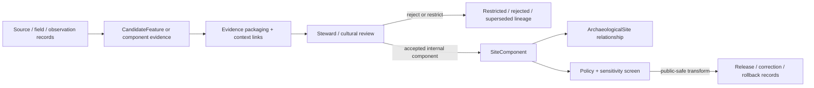

<!-- [KFM_META_BLOCK_V2]
doc_id: kfm://contract/domains/archaeology/site-component
title: contracts/domains/archaeology/site_component.md — SiteComponent Contract
type: contract
version: v0.2
status: draft
owners: OWNER_TBD — Archaeology steward · Fieldwork steward · Contract steward · Evidence steward · Schema steward · Policy steward · Review steward · Validation steward · Release steward · Docs steward
created: 2026-06-20
updated: 2026-06-20
policy_label: public; contracts; domains; archaeology; site-component; semantic-contract; feature; sensitive-lane
tags: [kfm, contracts, archaeology, site-component, feature, site, context, evidence, review, policy, sensitivity, lifecycle, governance]
related:
  - ./README.md
  - ./OBJECT_MAP.md
  - ./archaeological_site.md
  - ./site.md
  - ./candidate_feature.md
  - ./domain_feature_identity.md
  - ./provenience_context.md
  - ./stratigraphic_unit.md
  - ./survey_project.md
  - ./survey_transect.md
  - ./excavation_unit.md
  - ./test_unit.md
  - ./shovel_test.md
  - ./artifact_record.md
  - ./sample.md
  - ./chronology_assertion.md
  - ./domain_observation.md
  - ./cultural_review.md
  - ./steward_review.md
  - ./sensitivity_transform.md
  - ./publication_transform_receipt.md
  - ../../../docs/domains/archaeology/MISSING_OR_PLANNED_FILES.md
  - ../../../docs/domains/archaeology/CANONICAL_PATHS.md
  - ../../../docs/domains/archaeology/ARCHITECTURE.md
  - ../../../docs/domains/archaeology/DATA_LIFECYCLE.md
  - ../../../schemas/contracts/v1/domains/archaeology/site_component.schema.json
  - ../../../policy/sensitivity/archaeology/
  - ../../../data/proofs/
  - ../../../release/
notes:
  - "Expanded from a planned-file scaffold into the object-level SiteComponent semantic contract."
  - "The paired schema is currently a PROPOSED scaffold with empty properties and additionalProperties enabled."
  - "OBJECT_MAP.md maps SiteComponent to site_component.md and site_component.schema.json as NEEDS VERIFICATION."
  - "OBJECT_MAP.md also notes the corpus term Feature may map to SiteComponent / CandidateFeature as CONFLICTED / NEEDS VERIFICATION."
  - "This contract defines site-component meaning; it does not authorize publication, site confirmation, policy approval, review approval, evidence proof, or release approval."
[/KFM_META_BLOCK_V2] -->

<a id="top"></a>

# SiteComponent Contract

> Semantic contract for `SiteComponent`, the Archaeology-domain object representing a reviewed part, component, feature-like element, activity area, structural element, deposit grouping, or interpretive sub-unit associated with an `ArchaeologicalSite`. It records component meaning without converting a candidate, observation, or field note into proof, site confirmation, public geometry, or release approval by itself.

<p>
  
  
  
  
  
  
</p>

`contracts/domains/archaeology/site_component.md`

## Quick jumps

[Status](#status) · [Meaning](#meaning) · [Repo fit](#repo-fit) · [Component boundary](#component-boundary) · [Schema posture](#schema-posture) · [Accepted uses](#accepted-uses) · [Exclusions](#exclusions) · [Recommended fields](#recommended-fields) · [Invariants](#invariants) · [Lifecycle](#lifecycle) · [Validation](#validation) · [Evidence basis](#evidence-basis) · [Rollback](#rollback) · [Definition of done](#definition-of-done)

---

## Status

> [!IMPORTANT]
> **Status:** `draft` / semantic contract  
> **Owner:** `OWNER_TBD`  
> **Contract path:** `contracts/domains/archaeology/site_component.md`  
> **Schema path:** `schemas/contracts/v1/domains/archaeology/site_component.schema.json`  
> **Truth posture:** `CONFIRMED` target path, current update, paired scaffold schema, object-map row, feature-term reconciliation note, and uploaded authoring guidance. Validator behavior, fixtures, policy behavior, source registry behavior, evidence-bundle implementation, review workflow, release workflow, API behavior, UI behavior, and runtime behavior remain `NEEDS VERIFICATION`.

> [!CAUTION]
> This contract defines object meaning only. It does **not** authorize publication, candidate promotion, site confirmation, component confirmation, review approval, policy approval, proof closure, public geometry, or release of controlled archaeology component records.

---

## Meaning

`SiteComponent` is the Archaeology-domain object for a reviewed component or sub-unit associated with an `ArchaeologicalSite`.

A site component may represent or organize:

- a reviewed archaeological feature-like element;
- an activity area or deposit grouping;
- a structural, stratigraphic, cultural, or temporal component;
- a fieldwork-linked component derived from survey, excavation, test, or shovel-test records;
- a component supported or contested by artifacts, samples, contexts, chronology, remote sensing, LiDAR, geophysics, or domain observations;
- review, evidence packaging, correction, supersession, and rollback workflows.

It is not:

- a raw feature note;
- a raw field record;
- a candidate feature by default;
- a full archaeological site;
- a provenience context by itself;
- an artifact or sample record;
- an EvidenceBundle;
- a PolicyDecision;
- a ReviewRecord;
- a ReleaseManifest;
- proof that a component, association, date, activity, or interpretation is true without evidence and review support.

---

## Repo fit

```text
contracts/
└── domains/
    └── archaeology/
        ├── README.md
        ├── archaeological_site.md
        ├── site_component.md
        ├── candidate_feature.md
        └── provenience_context.md
```

Adjacent roots and object families:

| Root or object | Relationship |
|---|---|
| `./README.md` | Archaeology semantic-contract directory boundary. |
| `./OBJECT_MAP.md` | Maps `SiteComponent` to this contract and its expected schema. |
| `./archaeological_site.md` | Reviewed site identity that may contain or reference components. |
| `./site.md` | Short-name compatibility/lineage path; not the current object-map site authority. |
| `./candidate_feature.md` | Candidate object boundary; not equivalent to a reviewed component. |
| `./domain_feature_identity.md` | Potential identity/crosswalk object for feature/component reconciliation. |
| `./provenience_context.md`, `./stratigraphic_unit.md` | Context and stratigraphic relationships that may support component interpretation. |
| `./survey_project.md`, `./survey_transect.md`, `./excavation_unit.md`, `./test_unit.md`, `./shovel_test.md` | Fieldwork contexts that may produce or support component evidence. |
| `./artifact_record.md`, `./sample.md`, `./chronology_assertion.md` | Recovery and chronology families that may support or constrain component interpretation. |
| `./domain_observation.md` | Observation envelope that may cite component-supporting records. |
| `./cultural_review.md`, `./steward_review.md` | Review objects required before consequential interpretation or exposure. |
| `../../../schemas/contracts/v1/domains/archaeology/site_component.schema.json` | Current scaffold schema. |
| `../../../policy/sensitivity/archaeology/` | Policy gate home; behavior not verified here. |
| `../../../data/proofs/` | EvidenceBundle/proof support. |
| `../../../release/` | Release, correction, supersession, and rollback authority. |

---

## Component boundary

`SiteComponent` must preserve the difference between component, site, candidate, observation, context, interpretation, proof, and publication.

| Boundary | Rule |
|---|---|
| Component vs. site | A component belongs to or relates to a reviewed site identity; it is not the full site by itself. |
| Component vs. candidate feature | A candidate may support a component after review; candidate status is not component confirmation. |
| Component vs. corpus term `Feature` | The object map says `Feature` may map to `SiteComponent` / `CandidateFeature` and remains `CONFLICTED / NEEDS VERIFICATION`. |
| Component vs. field record | This object may summarize or reference field records; raw records remain in lifecycle data roots. |
| Component vs. context/stratigraphy | Contexts and stratigraphic units may support component meaning; they keep separate identity. |
| Component vs. public release | Public use requires evidence, review, policy, transform, release, correction, and rollback support. |

---

## Schema posture

The paired schema found for this contract is:

```text
schemas/contracts/v1/domains/archaeology/site_component.schema.json
```

Current schema evidence:

| Schema fact | Status |
|---|---|
| Schema file exists | `CONFIRMED` |
| Schema title is `Site Component` | `CONFIRMED` |
| Schema status is `PROPOSED` | `CONFIRMED` |
| Schema properties are empty | `CONFIRMED` |
| `additionalProperties` is `true` | `CONFIRMED` |
| Schema `source_doc` points to the planned-files ledger | `CONFIRMED` |
| Schema `contract_doc` points to this contract | `CONFIRMED` |
| Validator implementation | `UNKNOWN / NOT FOUND IN THIS TASK` |

This contract therefore defines semantic expectations for future schema and validator work. It does not claim that machine validation currently enforces those expectations.

---

## Accepted uses

| Use | Allowed? | Rule |
|---|---:|---|
| Defining the meaning of a site-component object | Yes | Must preserve site relationship, source, context, evidence, review, sensitivity, and lifecycle posture. |
| Linking components to sites, contexts, stratigraphy, artifacts, samples, chronology, or observations | Conditional | Must preserve uncertainty, review state, source roles, and policy controls. |
| Supporting component review, cataloging, correction, or rollback | Yes | Must not imply public release or final interpretation. |
| Supporting public-safe summaries | Conditional | Requires policy, review, transform receipt, release record, and safe precision. |
| Treating a candidate feature as a reviewed component by default | No | Promotion requires governed evidence and review. |
| Treating a component as full site confirmation | No | Site identity remains separate. |
| Publishing controlled component detail by default | No | Controlled details fail closed unless approved through governed release. |
| Using schema validity as proof of truth | No | Schema shape is not evidence proof. |
| Treating this contract as release approval | No | Release authority remains separate. |

---

## Exclusions

| Does not belong in this contract | Correct home |
|---|---|
| Machine field shape | `../../../schemas/contracts/v1/domains/archaeology/site_component.schema.json`. |
| Validator implementation | `../../../tools/validators/...`. |
| Fixtures and tests | `../../../fixtures/...`, `../../../tests/...`. |
| Raw field forms, notebooks, photographs, instrument files, catalog exports, or bulk component records | `../../../data/raw/`, `../../../data/work/`, or `../../../data/quarantine/`, subject to lifecycle and sensitivity rules. |
| EvidenceBundle/proof content | `../../../data/proofs/`. |
| Sensitivity, access, admissibility, or release policy | `../../../policy/...`. |
| Steward/cultural review records | Governance/review contract and record homes. |
| Release manifests, correction notices, rollback cards | `../../../release/`. |
| Public layer, UI, API, renderer, or Focus Mode implementation | Governed app/API/UI/layer roots. |

---

## Recommended fields

The current schema does not require these fields. They are `PROPOSED` semantic requirements for future schema/validator work:

| Field | Meaning |
|---|---|
| `site_component_id` | Stable deterministic or steward-assigned component identity. |
| `site_ref` | ArchaeologicalSite reference when the component is associated with a reviewed site. |
| `component_type` | Feature-like element, activity area, deposit grouping, structure, stratigraphic component, cultural component, temporal component, or other reviewed type. |
| `component_label` | Field label, component name, feature label, context label, or repository label. |
| `candidate_feature_refs` | CandidateFeature references that supported, contested, or preceded the component. |
| `fieldwork_refs` | SurveyProject, SurveyTransect, ExcavationUnit, TestUnit, ShovelTest, or other fieldwork references. |
| `provenience_context_refs` | ProvenienceContext references that support the component. |
| `stratigraphic_refs` | StratigraphicUnit references that structure the component. |
| `artifact_refs` | ArtifactRecord references associated with the component. |
| `sample_refs` | Sample references associated with the component. |
| `chronology_refs` | CulturalTemporalPeriod or ChronologyAssertion references. |
| `observation_refs` | DomainObservation or specialized observation references. |
| `feature_identity_refs` | DomainFeatureIdentity or crosswalk references where terminology is reconciled. |
| `component_geometry_ref` | Internal geometry/support-scope reference; public-safe generalization required before exposure. |
| `spatial_precision_class` | Exact, generalized, suppressed, centroided, binned, county/region, or denied precision posture. |
| `source_refs` | SourceDescriptor/source record references. |
| `source_roles` | Source roles supporting, contextualizing, or contesting the component. |
| `evidence_refs` | EvidenceRef/EvidenceBundle references. |
| `confidence_statement` | Bounded confidence, uncertainty, or limitation statement. |
| `contradiction_refs` | Observations, contexts, candidates, or claims that contest this component. |
| `review_state` | Intake, needs review, under review, accepted internal component, rejected, superseded, quarantined, release-candidate, or withdrawn. |
| `review_refs` | StewardReview, CulturalReview, project review, or other review record references. |
| `policy_state` | Policy posture or policy-decision reference. |
| `sensitivity_class` | Sensitivity/public-safety classification. |
| `lineage_refs` | Prior, successor, supersession, split, merge, alias, or rollback records. |
| `release_refs` | Release/candidate linkage where applicable. |
| `correction_refs` | Correction/supersession/rollback lineage. |
| `spec_hash` | Integrity pin for the representation. |

---

## Invariants

`SiteComponent` must preserve these invariants:

- site components are not proof by themselves;
- site components are not full site confirmation by themselves;
- candidate features are not reviewed components by default;
- component identity must remain distinct from site identity, candidate identity, context, stratigraphy, artifacts, samples, evidence, review, policy, release, correction, and rollback objects;
- raw field/collection records and contract-level summaries must remain separated;
- source, context, method, recovery, chronology, uncertainty, sensitivity, review posture, and lifecycle state must remain inspectable;
- controlled component detail fails closed unless policy, review, and release authorize a public-safe transform;
- contradiction, rejection, supersession, merge/split, and correction lineage must remain traceable;
- schema validity is not evidence proof;
- public-facing use must be downstream of governed release artifacts and public-safe transforms;
- publication is a governed state transition, not a file move.

---

## Lifecycle



The contract defines the meaning of a site-component object. It does not replace source intake, fieldwork authorization, evidence resolution, schema validation, policy enforcement, review, transform receipts, release approval, correction, or rollback systems.

---

## Validation

Before relying on this contract, verify:

- schema fields beyond scaffold status;
- validator implementation and fixture coverage;
- canonical site-component ID and deterministic identity rules;
- boundary between SiteComponent, ArchaeologicalSite, Site, CandidateFeature, ProvenienceContext, StratigraphicUnit, ArtifactRecord, and Sample;
- how the corpus term `Feature` maps to SiteComponent vs CandidateFeature;
- component-type vocabulary and merge/split rules;
- fieldwork, recovery, collection, chronology, and custody linkage requirements;
- EvidenceRef/EvidenceBundle requirements;
- source-role, time-kind, geometry, context, and association requirements;
- sensitivity handling for controlled component and context detail;
- steward/cultural review requirements;
- policy-gate requirements;
- release, correction, supersession, withdrawal, and rollback linkage;
- no downstream surface treats this contract as public disclosure permission, final proof, component confirmation, or site confirmation.

---

## Evidence basis

| Source | Status | Supports | Limits |
|---|---|---|---|
| Prior `site_component.md` scaffold | `CONFIRMED` | Target file existed as a planned-file scaffold. | Scaffold did not define authoritative semantics. |
| `site_component.schema.json` | `CONFIRMED scaffold` | Schema exists, is `PROPOSED`, has empty properties, allows additional properties, and points to this contract. | Does not enforce full site-component semantics. |
| `OBJECT_MAP.md` | `CONFIRMED current map` | Maps `SiteComponent` to `site_component.md` and `site_component.schema.json` with status `NEEDS VERIFICATION`; notes `Feature` may map to `SiteComponent` / `CandidateFeature` as conflicted. | Does not prove validator, fixture, policy, review, or release behavior. |
| Uploaded authoring prompt v2 | `CONFIRMED user-supplied guidance` | Requires evidence-grounded, implementation-honest Markdown with verification and rollback posture. | Authoring guidance, not implementation proof. |

---

## Rollback

Rollback is required if this contract is used to claim schema completeness, validator coverage, policy enforcement, review completion, release execution, API/UI behavior, fieldwork authorization, custody proof, evidence proof, component confirmation, site confirmation, public disclosure permission, or implementation maturity not verified in this task.

Rollback target: prior scaffold blob SHA `224eb2daa4b4f7861c62c05dfc3356963c5b7f71`.

---

## Definition of done

- [ ] Owners are confirmed and `OWNER_TBD` is replaced.
- [ ] Site-component vocabulary is reviewed by the Archaeology steward and fieldwork steward.
- [ ] Boundary between `SiteComponent`, `ArchaeologicalSite`, `Site`, `CandidateFeature`, `ProvenienceContext`, `StratigraphicUnit`, `ArtifactRecord`, and `Sample` is accepted.
- [ ] The corpus term `Feature` is reconciled against `SiteComponent` and `CandidateFeature`.
- [ ] Paired JSON Schema is expanded from scaffold status.
- [ ] Valid and invalid fixtures cover internal, restricted, rejected, superseded, merged, split, corrected, release-candidate, and rollback states.
- [ ] Validator enforces required site, component, candidate, context, source, evidence, stratigraphy, recovery, chronology, review, sensitivity, policy, lineage, and visibility fields.
- [ ] Fixtures avoid unsafe component, context, or collection detail where references or redacted summaries are safer.
- [ ] EvidenceBundle, PolicyDecision, ReviewRecord, SensitivityTransform, PublicationTransformReceipt, ReleaseManifest, CorrectionNotice, and RollbackCard references are validated where required.
- [ ] API/UI surfaces prove they cannot treat a site component as proof, component confirmation, site confirmation, or public disclosure permission.
- [ ] Release and rollback dry-runs prove this contract cannot bypass publication gates.

## Status summary

`SiteComponent` is a sensitive Archaeology component object. It can support reviewed sub-site/component meaning, candidate-feature reconciliation, context linkage, evidence packaging, correction, and public-safe explanation when evidence, review, policy, transform, and release allow, but it is not proof, not a raw feature note, not a full site identity, not policy approval, and not release approval.

<p align="right"><a href="#top">Back to top</a></p>
