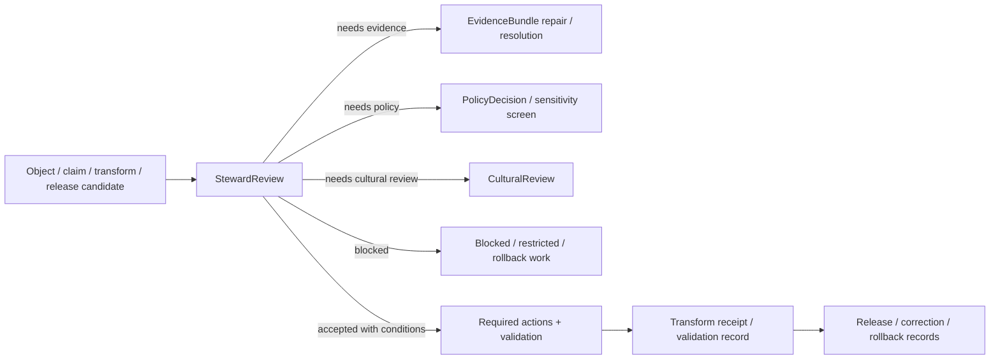

<!-- [KFM_META_BLOCK_V2]
doc_id: kfm://contract/domains/archaeology/steward-review
title: contracts/domains/archaeology/steward_review.md — StewardReview Contract
type: contract
version: v0.2
status: draft
owners: OWNER_TBD — Archaeology steward · Domain steward · Review steward · Contract steward · Evidence steward · Schema steward · Policy steward · Validation steward · Release steward · Docs steward
created: 2026-06-20
updated: 2026-06-21
policy_label: public; contracts; domains; archaeology; steward-review; semantic-contract; review; governance; sensitive-lane
tags: [kfm, contracts, archaeology, steward-review, review, governance, evidence, policy, sensitivity, release, correction, rollback, lifecycle]
related:
  - ./README.md
  - ./OBJECT_MAP.md
  - ./cultural_review.md
  - ./archaeological_site.md
  - ./site_component.md
  - ./site.md
  - ./candidate_feature.md
  - ./domain_feature_identity.md
  - ./domain_observation.md
  - ./domain_validation_report.md
  - ./sensitivity_transform.md
  - ./publication_transform_receipt.md
  - ./collection_repository_record.md
  - ./provenience_context.md
  - ./stratigraphic_unit.md
  - ./artifact_record.md
  - ./sample.md
  - ./chronology_assertion.md
  - ../../../docs/domains/archaeology/MISSING_OR_PLANNED_FILES.md
  - ../../../docs/domains/archaeology/CANONICAL_PATHS.md
  - ../../../docs/domains/archaeology/ARCHITECTURE.md
  - ../../../docs/domains/archaeology/DATA_LIFECYCLE.md
  - ../../../schemas/contracts/v1/domains/archaeology/steward_review.schema.json
  - ../../../policy/sensitivity/archaeology/
  - ../../../data/proofs/
  - ../../../release/
notes:
  - "Expanded from a planned-file scaffold into the object-level StewardReview semantic contract."
  - "The paired schema is currently a PROPOSED scaffold with empty properties and additionalProperties enabled."
  - "OBJECT_MAP.md maps StewardReview to steward_review.md and steward_review.schema.json as NEEDS VERIFICATION."
  - "This contract defines steward-review meaning; it does not authorize publication, policy approval, evidence proof, cultural consent, legal compliance, or release approval by itself."
[/KFM_META_BLOCK_V2] -->

<a id="top"></a>

# StewardReview Contract

> Semantic contract for `StewardReview`, the Archaeology-domain object representing a governed steward, domain, repository, data-quality, source-integrity, or release-readiness review record attached to an archaeology object, claim, transform, correction, or release candidate. It records review posture without becoming evidence proof, policy approval, cultural review, or release approval by itself.

<p>
  
  
  
  
  
  
</p>

`contracts/domains/archaeology/steward_review.md`

## Quick jumps

[Status](#status) · [Meaning](#meaning) · [Repo fit](#repo-fit) · [Review boundary](#review-boundary) · [Schema posture](#schema-posture) · [Accepted uses](#accepted-uses) · [Exclusions](#exclusions) · [Recommended fields](#recommended-fields) · [Invariants](#invariants) · [Lifecycle](#lifecycle) · [Validation](#validation) · [Evidence basis](#evidence-basis) · [Rollback](#rollback) · [Definition of done](#definition-of-done)

---

## Status

> [!IMPORTANT]
> **Status:** `draft` / semantic contract  
> **Owner:** `OWNER_TBD`  
> **Contract path:** `contracts/domains/archaeology/steward_review.md`  
> **Schema path:** `schemas/contracts/v1/domains/archaeology/steward_review.schema.json`  
> **Truth posture:** `CONFIRMED` target path, current update, paired scaffold schema, object-map row, adjacent `CulturalReview` pattern, and uploaded authoring guidance. Validator behavior, fixtures, policy behavior, source registry behavior, evidence-bundle implementation, review workflow, release workflow, API behavior, UI behavior, and runtime behavior remain `NEEDS VERIFICATION`.

> [!CAUTION]
> This contract defines object meaning only. It does **not** authorize publication, policy approval, cultural review, legal compliance, proof closure, exact-detail exposure, public rendering, or release of controlled archaeology records.

---

## Meaning

`StewardReview` is the Archaeology-domain object for a governed review posture recorded by a project, domain, repository, data, evidence, policy, validation, or release steward. It captures whether an archaeology object, claim, transform, correction, or release candidate has been checked, blocked, conditioned, accepted for internal use, superseded, withdrawn, or routed for additional work.

A steward review may apply to:

- `ArchaeologicalSite`, `SiteComponent`, `Site`, or `CandidateFeature` records;
- `DomainObservation`, `RemoteSensingAnomaly`, `LiDARCandidate`, or `GeophysicsObservation` records;
- `SurveyProject`, `SurveyTransect`, `ShovelTest`, `TestUnit`, or `ExcavationUnit` records;
- `ProvenienceContext`, `StratigraphicUnit`, `ArtifactRecord`, `Sample`, or `CollectionRepositoryRecord` records;
- `ChronologyAssertion` or interpretation claims;
- `SensitivityTransform` or `PublicationTransformReceipt` records;
- validation reports, corrections, takedowns, supersessions, rollback cards, or release candidates.

It represents a governed review record. It is not:

- a substitute for evidence;
- a substitute for policy enforcement;
- a cultural review record by default;
- legal advice or legal compliance;
- automatic consent, authorization, or release permission;
- a public release artifact;
- a source record;
- an EvidenceBundle;
- a PolicyDecision;
- a ReleaseManifest;
- permission to disclose controlled site, context, collection, participant, or interpretive detail.

---

## Repo fit

```text
contracts/
└── domains/
    └── archaeology/
        ├── README.md
        ├── OBJECT_MAP.md
        ├── cultural_review.md
        └── steward_review.md
```

Adjacent roots and object families:

| Root or object | Relationship |
|---|---|
| `./README.md` | Archaeology semantic-contract directory boundary. |
| `./OBJECT_MAP.md` | Maps `StewardReview` to this contract and the expected schema. |
| `./cultural_review.md` | Adjacent review family for culturally significant review posture; not interchangeable by default. |
| `./domain_validation_report.md` | Validation-report object that may be reviewed or referenced by steward review. |
| `./sensitivity_transform.md` | Transform object that may be required by steward review. |
| `./publication_transform_receipt.md` | Receipt object that may record transform application after review. |
| `./archaeological_site.md`, `./site_component.md`, `./candidate_feature.md` | Core object families that may require steward review before promotion or exposure. |
| `./collection_repository_record.md`, `./artifact_record.md`, `./sample.md` | Collection and recovery families that may require custody, access, or release review. |
| `./provenience_context.md`, `./stratigraphic_unit.md`, `./chronology_assertion.md` | Context, stratigraphy, and chronology families that may require review before consequential interpretation. |
| `../../../schemas/contracts/v1/domains/archaeology/steward_review.schema.json` | Current scaffold schema. |
| `../../../policy/sensitivity/archaeology/` | Policy gate home; behavior not verified here. |
| `../../../data/proofs/` | EvidenceBundle/proof support. |
| `../../../release/` | Release, correction, supersession, and rollback authority. |

---

## Review boundary

`StewardReview` must preserve the difference between review posture, evidence proof, policy decision, cultural review, and release.

| Boundary | Rule |
|---|---|
| Steward review vs. evidence proof | A review can require, accept, question, or route evidence; it is not the EvidenceBundle or proof closure. |
| Steward review vs. policy decision | A steward review can recommend policy treatment; it does not replace `PolicyDecision`. |
| Steward review vs. cultural review | A steward review is not a `CulturalReview` unless the reviewed workflow explicitly models that relationship. |
| Steward review vs. validator result | A validator can inform review; review state remains a governed record with owner and rationale. |
| Steward review vs. release approval | A review may support release readiness; release authority remains separate. |
| Public summary vs. internal review | Public summaries must be transformed, policy-checked, and released separately. |

---

## Schema posture

The paired schema found for this contract is:

```text
schemas/contracts/v1/domains/archaeology/steward_review.schema.json
```

Current schema evidence:

| Schema fact | Status |
|---|---|
| Schema file exists | `CONFIRMED` |
| Schema title is `Steward Review` | `CONFIRMED` |
| Schema status is `PROPOSED` | `CONFIRMED` |
| Schema properties are empty | `CONFIRMED` |
| `additionalProperties` is `true` | `CONFIRMED` |
| Schema `source_doc` points to the planned-files ledger | `CONFIRMED` |
| Schema `contract_doc` points to this contract | `CONFIRMED` |
| Validator implementation | `UNKNOWN / NOT FOUND IN THIS TASK` |

This contract therefore defines semantic expectations for future schema and validator work. It does not claim that machine validation currently enforces those expectations.

---

## Accepted uses

| Use | Allowed? | Rule |
|---|---:|---|
| Defining the meaning of a steward-review object | Yes | Must preserve subject, reviewer role, review state, rationale, evidence, policy, validation, and lifecycle posture. |
| Recording internal domain, data-quality, source-integrity, or release-readiness review | Conditional | Must avoid exposing controlled details and must not imply release by itself. |
| Recording recommended actions, blockers, conditions, abstentions, or follow-up | Yes | Must distinguish recommendation from policy decision and release approval. |
| Supporting sensitivity transforms, correction, or release review | Conditional | Requires policy checks, evidence support, transform receipts, and release linkage where applicable. |
| Treating steward review as archaeological proof | No | Review state is not evidence proof by itself. |
| Treating steward review as cultural review by default | No | CulturalReview remains separate unless explicitly linked. |
| Treating steward review as legal compliance or consent | No | Legal/consent/authorization requirements need separate governed evidence and review. |
| Publishing controlled review details by default | No | Controlled details fail closed unless approved through governed release. |
| Using schema validity as proof of truth | No | Schema shape is not evidence proof. |
| Treating this contract as release approval | No | Release authority remains separate. |

---

## Exclusions

| Does not belong in this contract | Correct home |
|---|---|
| Machine field shape | `../../../schemas/contracts/v1/domains/archaeology/steward_review.schema.json`. |
| Validator implementation | `../../../tools/validators/...`. |
| Fixtures and tests | `../../../fixtures/...`, `../../../tests/...`. |
| Raw review notes, controlled reviewer identity, or sensitive rationale details | `../../../data/quarantine/` or another governed restricted root after policy review. |
| Source registry records | `../../../data/registry/sources/`. |
| EvidenceBundle/proof content | `../../../data/proofs/`. |
| Cultural review records | `./cultural_review.md` or its governed record home. |
| Policy decisions, access rules, or release rules | `../../../policy/...`. |
| Release manifests, correction notices, rollback cards | `../../../release/`. |
| Public layer, UI, AI response, or API behavior | Governed app/API/UI/layer roots. |

---

## Recommended fields

The current schema does not require these fields. They are `PROPOSED` semantic requirements for future schema/validator work:

| Field | Meaning |
|---|---|
| `steward_review_id` | Stable deterministic or steward-assigned steward-review identity. |
| `subject_refs` | Objects, claims, validation reports, transforms, corrections, or release candidates under review. |
| `review_scope` | Object, claim, source, evidence, validation, transform, correction, rollback, release candidate, or other reviewed scope. |
| `review_role` | Domain steward, data steward, source steward, evidence steward, collection steward, release steward, policy steward, validation steward, or other approved role. |
| `reviewer_refs` | Controlled references to reviewers or review bodies where disclosure is allowed. |
| `reviewer_visibility` | Public, role-only, internal, restricted, redacted, or denied visibility posture. |
| `review_state` | Requested, pending, in review, blocked, conditionally acceptable, accepted for internal use, needs evidence, needs policy, needs cultural review, release-candidate, denied, superseded, withdrawn, or abstain. |
| `review_outcome` | Structured outcome summary suitable for policy, validation, correction, or release workflows. |
| `rationale_summary` | Public-safe or internal-only summary of review rationale. |
| `sensitive_detail_refs` | Controlled references to restricted rationale or details, not inline exposure. |
| `required_actions` | Evidence repair, source-role repair, validation repair, review escalation, cultural review, transform, correction, rollback, or release-blocking actions. |
| `policy_refs` | PolicyDecision or policy rule references. |
| `source_refs` | SourceDescriptor/source record references. |
| `evidence_refs` | EvidenceRef/EvidenceBundle references. |
| `validation_refs` | DomainValidationReport, validator run, test, or fixture references. |
| `related_review_refs` | Related StewardReview, CulturalReview, repository review, or correction review references. |
| `sensitivity_class` | Sensitivity/public-safety classification. |
| `release_refs` | ReleaseManifest, MapReleaseManifest, or release-candidate linkage where applicable. |
| `correction_refs` | CorrectionNotice or correction receipt references. |
| `rollback_refs` | RollbackCard or rollback target references. |
| `lineage_refs` | Prior, successor, supersession, withdrawal, or migration review records. |
| `spec_hash` | Integrity pin for the review representation. |

---

## Invariants

`StewardReview` must preserve these invariants:

- steward review records are not evidence proof by themselves;
- steward review records are not policy approval by themselves;
- steward review records are not cultural review by default;
- steward review records are not release approval by themselves;
- review state, review rationale, evidence, policy, validation, cultural review, release, correction, and rollback objects must remain separate families;
- controlled rationale, reviewer identity, cultural context, site detail, collection detail, and source weakness details must be protected according to policy;
- unresolved evidence, policy, validation, review, or release gaps must remain visible;
- when review is blocked or abstained, downstream claims must not be promoted as approved;
- schema validity is not evidence proof or review approval;
- public-facing use must be downstream of governed release artifacts and public-safe transforms;
- publication is a governed state transition, not a file move.

---

## Lifecycle



The contract defines the meaning of a steward-review object. It does not replace evidence resolution, schema validation, policy enforcement, cultural review, transform receipts, release approval, correction, or rollback systems.

---

## Validation

Before relying on this contract, verify:

- schema fields beyond scaffold status;
- validator implementation and fixture coverage;
- canonical steward-review ID and deterministic identity rules;
- subject reference rules for objects, claims, transforms, corrections, and release candidates;
- reviewer-role and reviewer-visibility vocabulary;
- review-state and review-outcome vocabulary;
- EvidenceRef/EvidenceBundle requirements;
- policy-decision linkage requirements;
- CulturalReview linkage and escalation rules;
- source-role, validation-report, correction, rollback, and release references;
- sensitivity handling for controlled rationale, reviewer identity, and subject details;
- no downstream surface treats this contract as proof, policy approval, cultural approval, release approval, or public disclosure permission.

---

## Evidence basis

| Source | Status | Supports | Limits |
|---|---|---|---|
| Prior `steward_review.md` scaffold | `CONFIRMED` | Target file existed as a planned-file scaffold and cited `MISSING_OR_PLANNED_FILES.md`. | Scaffold did not define authoritative semantics. |
| `steward_review.schema.json` | `CONFIRMED scaffold` | Schema exists, is `PROPOSED`, has empty properties, allows additional properties, and points to this contract. | Does not enforce full steward-review semantics. |
| `OBJECT_MAP.md` | `CONFIRMED current map` | Maps `StewardReview` to `steward_review.md` and `steward_review.schema.json` with status `NEEDS VERIFICATION`; identifies ReviewRecord as a cross-cutting dependency. | Does not prove validator, fixture, policy, review, or release behavior. |
| `cultural_review.md` | `CONFIRMED adjacent contract` | Provides adjacent review-family pattern and confirms CulturalReview is separate from StewardReview. | Does not define StewardReview semantics. |
| Uploaded authoring prompt v2 | `CONFIRMED user-supplied guidance` | Requires evidence-grounded, implementation-honest Markdown with verification and rollback posture. | Authoring guidance, not implementation proof. |

---

## Rollback

Rollback is required if this contract is used to claim schema completeness, validator coverage, policy enforcement, cultural review completion, review workflow execution, release execution, API/UI behavior, evidence proof, legal compliance, consent, publication permission, or implementation maturity not verified in this task.

Rollback target: prior scaffold blob SHA `b54cf94c145caf7181acf98303832510f92dc8ea`.

---

## Definition of done

- [ ] Owners are confirmed and `OWNER_TBD` is replaced.
- [ ] Steward-review vocabulary is reviewed by the Archaeology steward, review steward, policy steward, evidence steward, validation steward, and release steward.
- [ ] Boundary between `StewardReview`, `CulturalReview`, `ReviewRecord`, `PolicyDecision`, `EvidenceBundle`, `DomainValidationReport`, `ReleaseManifest`, `CorrectionNotice`, and `RollbackCard` is accepted.
- [ ] Paired JSON Schema is expanded from scaffold status.
- [ ] Valid and invalid fixtures cover requested, pending, blocked, conditionally accepted, accepted internal, needs evidence, needs policy, needs cultural review, release-candidate, denied, superseded, withdrawn, abstained, corrected, and rollback states.
- [ ] Validator enforces subject, reviewer role, reviewer visibility, review state, required actions, evidence, policy, validation, review escalation, release, correction, rollback, and integrity fields.
- [ ] Fixtures avoid unsafe review rationale, controlled site detail, reviewer identity, or cultural context where references or redacted summaries are safer.
- [ ] API/UI surfaces prove they cannot treat steward review as proof, policy approval, cultural approval, release approval, or public disclosure permission.
- [ ] Release and rollback dry-runs prove this contract cannot bypass publication gates.

## Status summary

`StewardReview` is a sensitive Archaeology review object. It can support evidence repair, validation repair, source-role repair, cultural-review escalation, policy routing, correction, rollback, and release-readiness checks when linked to governed records, but it is not proof, not policy approval, not cultural review by default, and not release approval.

<p align="right"><a href="#top">Back to top</a></p>
