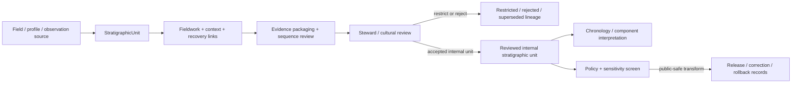

<!-- [KFM_META_BLOCK_V2]
doc_id: kfm://contract/domains/archaeology/stratigraphic-unit
title: contracts/domains/archaeology/stratigraphic_unit.md — StratigraphicUnit Contract
type: contract
version: v0.2
status: draft
owners: OWNER_TBD — Archaeology steward · Fieldwork steward · Stratigraphy steward · Contract steward · Evidence steward · Schema steward · Policy steward · Review steward · Validation steward · Release steward · Docs steward
created: 2026-06-20
updated: 2026-06-21
policy_label: public; contracts; domains; archaeology; stratigraphic-unit; semantic-contract; fieldwork; context; sensitive-lane
tags: [kfm, contracts, archaeology, stratigraphy, stratigraphic-unit, context, excavation, fieldwork, provenience, evidence, review, policy, sensitivity, lifecycle, governance]
related:
  - ./README.md
  - ./OBJECT_MAP.md
  - ./provenience_context.md
  - ./excavation_unit.md
  - ./test_unit.md
  - ./shovel_test.md
  - ./survey_project.md
  - ./survey_transect.md
  - ./site_component.md
  - ./archaeological_site.md
  - ./site.md
  - ./candidate_feature.md
  - ./artifact_record.md
  - ./sample.md
  - ./chronology_assertion.md
  - ./cultural_temporal_period.md
  - ./domain_observation.md
  - ./domain_validation_report.md
  - ./cultural_review.md
  - ./steward_review.md
  - ./sensitivity_transform.md
  - ./publication_transform_receipt.md
  - ../../../docs/domains/archaeology/MISSING_OR_PLANNED_FILES.md
  - ../../../docs/domains/archaeology/CANONICAL_PATHS.md
  - ../../../docs/domains/archaeology/ARCHITECTURE.md
  - ../../../docs/domains/archaeology/DATA_LIFECYCLE.md
  - ../../../schemas/contracts/v1/domains/archaeology/stratigraphic_unit.schema.json
  - ../../../policy/sensitivity/archaeology/
  - ../../../data/proofs/
  - ../../../release/
notes:
  - "Expanded from a planned-file scaffold into the object-level StratigraphicUnit semantic contract."
  - "The paired schema is currently a PROPOSED scaffold with empty properties and additionalProperties enabled."
  - "OBJECT_MAP.md maps StratigraphicUnit to stratigraphic_unit.md and stratigraphic_unit.schema.json as NEEDS VERIFICATION."
  - "OBJECT_MAP.md notes that the corpus term Context may map to ProvenienceContext / StratigraphicUnit as CONFLICTED / NEEDS VERIFICATION."
  - "This contract defines stratigraphic-unit meaning; it does not authorize publication, association proof, chronology proof, policy approval, review approval, or release approval."
[/KFM_META_BLOCK_V2] -->

<a id="top"></a>

# StratigraphicUnit Contract

> Semantic contract for `StratigraphicUnit`, the Archaeology-domain object representing a governed depositional, stratigraphic, layer, level, horizon, context-like, or field-defined unit used to organize archaeological observations, contexts, artifacts, samples, chronology, and interpretation without becoming proof, chronology confirmation, public geometry, or release approval by itself.

<p>
  
  
  
  
  
  
</p>

`contracts/domains/archaeology/stratigraphic_unit.md`

## Quick jumps

[Status](#status) · [Meaning](#meaning) · [Repo fit](#repo-fit) · [Stratigraphy boundary](#stratigraphy-boundary) · [Schema posture](#schema-posture) · [Accepted uses](#accepted-uses) · [Exclusions](#exclusions) · [Recommended fields](#recommended-fields) · [Invariants](#invariants) · [Lifecycle](#lifecycle) · [Validation](#validation) · [Evidence basis](#evidence-basis) · [Rollback](#rollback) · [Definition of done](#definition-of-done)

---

## Status

> [!IMPORTANT]
> **Status:** `draft` / semantic contract  
> **Owner:** `OWNER_TBD`  
> **Contract path:** `contracts/domains/archaeology/stratigraphic_unit.md`  
> **Schema path:** `schemas/contracts/v1/domains/archaeology/stratigraphic_unit.schema.json`  
> **Truth posture:** `CONFIRMED` target path, current update, paired scaffold schema, object-map row, context-term reconciliation note, and uploaded authoring guidance. Validator behavior, fixtures, policy behavior, source registry behavior, evidence-bundle implementation, review workflow, release workflow, API behavior, UI behavior, and runtime behavior remain `NEEDS VERIFICATION`.

> [!CAUTION]
> This contract defines object meaning only. It does **not** authorize excavation, publication, association proof, chronology proof, review approval, policy approval, proof closure, public geometry, or release of controlled archaeology stratigraphic/context records.

---

## Meaning

`StratigraphicUnit` is the Archaeology-domain object for recording a bounded stratigraphic, depositional, layer, level, horizon, soil/deposit, context-like, or field-defined unit used to structure archaeological evidence and interpretation.

A stratigraphic unit may support:

- fieldwork recording and excavation/test-unit organization;
- relationship modeling between deposits, features, contexts, artifacts, and samples;
- observed stratigraphic sequence, superposition, interface, intrusion, fill, cut, or association notes;
- chronology and cultural-temporal review;
- candidate-feature, site-component, or site interpretation;
- evidence packaging, correction, supersession, and rollback workflows.

It is not:

- a raw field form;
- an excavation unit by itself;
- a test unit or shovel test by itself;
- a provenience context by itself;
- an artifact or sample record;
- a confirmed site component;
- a chronology assertion by itself;
- an EvidenceBundle;
- a PolicyDecision;
- a ReviewRecord;
- a ReleaseManifest;
- proof that an association, deposit, date, context, component, or interpretation is true without evidence and review support.

---

## Repo fit

```text
contracts/
└── domains/
    └── archaeology/
        ├── README.md
        ├── stratigraphic_unit.md
        ├── provenience_context.md
        ├── excavation_unit.md
        └── chronology_assertion.md
```

Adjacent roots and object families:

| Root or object | Relationship |
|---|---|
| `./README.md` | Archaeology semantic-contract directory boundary. |
| `./OBJECT_MAP.md` | Maps `StratigraphicUnit` to this contract and its expected schema. |
| `./provenience_context.md` | Adjacent context object; overlaps the corpus term `Context` but remains separate. |
| `./excavation_unit.md`, `./test_unit.md`, `./shovel_test.md` | Fieldwork-unit families that may define or observe stratigraphic units. |
| `./survey_project.md`, `./survey_transect.md` | Survey context that may frame stratigraphic observations where applicable. |
| `./site_component.md`, `./archaeological_site.md`, `./site.md` | Site/component families that may cite reviewed stratigraphic evidence. |
| `./candidate_feature.md` | Candidate object that may be supported or contested by stratigraphic observations. |
| `./artifact_record.md`, `./sample.md` | Recovery object families that may reference stratigraphic unit and provenience context. |
| `./chronology_assertion.md`, `./cultural_temporal_period.md` | Time/period interpretation families that may use stratigraphic evidence after review. |
| `./domain_observation.md`, `./domain_validation_report.md` | Observation and validation object families that may frame or check stratigraphic records. |
| `./cultural_review.md`, `./steward_review.md` | Review objects required before consequential interpretation or exposure. |
| `../../../schemas/contracts/v1/domains/archaeology/stratigraphic_unit.schema.json` | Current scaffold schema. |
| `../../../policy/sensitivity/archaeology/` | Policy gate home; behavior not verified here. |
| `../../../data/proofs/` | EvidenceBundle/proof support. |
| `../../../release/` | Release, correction, supersession, and rollback authority. |

---

## Stratigraphy boundary

`StratigraphicUnit` must preserve the difference between field unit, stratigraphic unit, provenience context, recovery record, chronology claim, interpretation, proof, and publication.

| Boundary | Rule |
|---|---|
| Stratigraphic unit vs. field unit | Excavation/test/shovel-test units may observe or contain stratigraphic units; they are not the same object. |
| Stratigraphic unit vs. provenience context | Provenience context may link recovered materials to stratigraphic units; context identity remains separate. |
| Stratigraphic unit vs. artifact/sample | Artifact and sample records may reference the unit; recovery/custody remains separate. |
| Stratigraphic unit vs. chronology assertion | Stratigraphy can support chronology; it does not establish chronology alone. |
| Stratigraphic unit vs. corpus term `Context` | The object map says `Context` may map to `ProvenienceContext` / `StratigraphicUnit` and remains `CONFLICTED / NEEDS VERIFICATION`. |
| Stratigraphic unit vs. public release | Public use requires review, policy, transform, release, correction, and rollback support. |

---

## Schema posture

The paired schema found for this contract is:

```text
schemas/contracts/v1/domains/archaeology/stratigraphic_unit.schema.json
```

Current schema evidence:

| Schema fact | Status |
|---|---|
| Schema file exists | `CONFIRMED` |
| Schema title is `Stratigraphic Unit` | `CONFIRMED` |
| Schema status is `PROPOSED` | `CONFIRMED` |
| Schema properties are empty | `CONFIRMED` |
| `additionalProperties` is `true` | `CONFIRMED` |
| Schema `source_doc` points to the planned-files ledger | `CONFIRMED` |
| Schema `contract_doc` points to this contract | `CONFIRMED` |
| Validator implementation | `UNKNOWN / NOT FOUND IN THIS TASK` |

This contract therefore defines semantic expectations for future schema and validator work. It does not claim that machine validation currently enforces those expectations.

---

## Accepted uses

| Use | Allowed? | Rule |
|---|---:|---|
| Defining the meaning of a stratigraphic-unit object | Yes | Must preserve fieldwork, context, source, evidence, review, sensitivity, and lifecycle posture. |
| Linking units to provenience contexts, artifacts, samples, chronology, components, or observations | Conditional | Must preserve uncertainty, association limits, review state, source roles, and policy controls. |
| Supporting stratigraphic review, cataloging, correction, or rollback | Yes | Must not imply public release or final interpretation. |
| Supporting chronology or component interpretation | Conditional | Requires evidence, review, and bounded confidence. |
| Supporting public-safe summaries | Conditional | Requires policy, review, transform receipt, release record, and safe precision. |
| Treating a stratigraphic unit as chronology proof by itself | No | Chronology claims require separate governed support. |
| Treating a stratigraphic unit as association proof by itself | No | Association proof requires evidence resolution and review. |
| Publishing controlled stratigraphic/context detail by default | No | Controlled details fail closed unless approved through governed release. |
| Using schema validity as proof of truth | No | Schema shape is not evidence proof. |
| Treating this contract as release approval | No | Release authority remains separate. |

---

## Exclusions

| Does not belong in this contract | Correct home |
|---|---|
| Machine field shape | `../../../schemas/contracts/v1/domains/archaeology/stratigraphic_unit.schema.json`. |
| Validator implementation | `../../../tools/validators/...`. |
| Fixtures and tests | `../../../fixtures/...`, `../../../tests/...`. |
| Raw field forms, notebooks, photographs, section drawings, profile logs, instrument files, or bulk stratigraphic records | `../../../data/raw/`, `../../../data/work/`, or `../../../data/quarantine/`, subject to lifecycle and sensitivity rules. |
| EvidenceBundle/proof content | `../../../data/proofs/`. |
| Sensitivity, access, admissibility, or release policy | `../../../policy/...`. |
| Steward/cultural review records | Governance/review contract and record homes. |
| Release manifests, correction notices, rollback cards | `../../../release/`. |
| Public layer, UI, API, renderer, or Focus Mode implementation | Governed app/API/UI/layer roots. |

---

## Recommended fields

The current schema does not require these fields. They are `PROPOSED` semantic requirements for future schema/validator work:

| Field | Meaning |
|---|---|
| `stratigraphic_unit_id` | Stable deterministic or steward-assigned stratigraphic-unit identity. |
| `unit_label` | Field label, context label, level/horizon label, layer number, deposit label, or repository label. |
| `unit_type` | Layer, level, horizon, deposit, fill, cut, interface, lens, stratum, soil/deposit unit, or other reviewed type. |
| `fieldwork_refs` | ExcavationUnit, TestUnit, ShovelTest, SurveyProject, SurveyTransect, or other fieldwork references. |
| `provenience_context_refs` | ProvenienceContext references that link materials or observations to the unit. |
| `site_ref` | ArchaeologicalSite reference when associated with a reviewed site. |
| `site_component_refs` | SiteComponent references supported, constrained, or contested by the unit. |
| `candidate_feature_refs` | CandidateFeature references that supported, contested, or preceded unit interpretation. |
| `artifact_refs` | ArtifactRecord references associated with the unit. |
| `sample_refs` | Sample references associated with the unit. |
| `chronology_refs` | ChronologyAssertion or CulturalTemporalPeriod references supported or constrained by the unit. |
| `observation_refs` | DomainObservation or specialized observation references. |
| `unit_geometry_ref` | Internal geometry/support-scope reference; public-safe generalization required before exposure. |
| `spatial_precision_class` | Exact, generalized, suppressed, centroided, binned, county/region, or denied precision posture. |
| `sequence_relation_refs` | Above/below/cuts/fills/overlies/underlies/abuts/equivalent-to/uncertain relation references. |
| `description_summary` | Bounded field/deposit description appropriate for the visibility class. |
| `interpretation_statement` | Bounded interpretation with uncertainty and evidence limits. |
| `source_refs` | SourceDescriptor/source record references. |
| `source_roles` | Source roles supporting, contextualizing, or contesting the unit. |
| `evidence_refs` | EvidenceRef/EvidenceBundle references. |
| `confidence_statement` | Bounded confidence, uncertainty, or limitation statement. |
| `contradiction_refs` | Observations, contexts, candidates, or claims that contest this unit. |
| `review_state` | Intake, needs review, under review, accepted internal unit, rejected, superseded, quarantined, release-candidate, or withdrawn. |
| `review_refs` | StewardReview, CulturalReview, project review, or other review record references. |
| `policy_state` | Policy posture or policy-decision reference. |
| `sensitivity_class` | Sensitivity/public-safety classification. |
| `lineage_refs` | Prior, successor, supersession, split, merge, equivalence, or rollback records. |
| `release_refs` | Release/candidate linkage where applicable. |
| `correction_refs` | Correction/supersession/rollback lineage. |
| `spec_hash` | Integrity pin for the representation. |

---

## Invariants

`StratigraphicUnit` must preserve these invariants:

- stratigraphic-unit records are not evidence proof by themselves;
- stratigraphic-unit records are not chronology proof by themselves;
- stratigraphic-unit records are not association proof by themselves;
- stratigraphic identity must remain distinct from fieldwork units, provenience contexts, artifacts, samples, chronology assertions, site components, evidence, review, policy, release, correction, and rollback objects;
- raw field/collection records and contract-level summaries must remain separated;
- source, fieldwork method, sequence relations, recovery links, context, uncertainty, sensitivity, review posture, and lifecycle state must remain inspectable;
- controlled stratigraphic/context detail fails closed unless policy, review, and release authorize a public-safe transform;
- contradiction, rejection, supersession, equivalence, merge/split, and correction lineage must remain traceable;
- schema validity is not evidence proof;
- public-facing use must be downstream of governed release artifacts and public-safe transforms;
- publication is a governed state transition, not a file move.

---

## Lifecycle



The contract defines the meaning of a stratigraphic-unit object. It does not replace source intake, fieldwork authorization, evidence resolution, schema validation, policy enforcement, review, chronology modeling, transform receipts, release approval, correction, or rollback systems.

---

## Validation

Before relying on this contract, verify:

- schema fields beyond scaffold status;
- validator implementation and fixture coverage;
- canonical stratigraphic-unit ID and deterministic identity rules;
- boundary between StratigraphicUnit, ProvenienceContext, ExcavationUnit, TestUnit, ShovelTest, ArtifactRecord, Sample, ChronologyAssertion, SiteComponent, and ArchaeologicalSite;
- how the corpus term `Context` maps to ProvenienceContext vs StratigraphicUnit;
- stratigraphic-unit vocabulary and sequence-relation vocabulary;
- split, merge, equivalence, supersession, and contradiction rules;
- fieldwork, recovery, collection, chronology, and custody linkage requirements;
- EvidenceRef/EvidenceBundle requirements;
- source-role, time-kind, geometry, context, recovery, and association requirements;
- sensitivity handling for controlled stratigraphic, context, fieldwork, and collection detail;
- steward/cultural review requirements;
- policy-gate requirements;
- release, correction, supersession, withdrawal, and rollback linkage;
- no downstream surface treats this contract as public disclosure permission, final proof, association proof, chronology proof, or site confirmation.

---

## Evidence basis

| Source | Status | Supports | Limits |
|---|---|---|---|
| Prior `stratigraphic_unit.md` scaffold | `CONFIRMED` | Target file existed as a planned-file scaffold. | Scaffold did not define authoritative semantics. |
| `stratigraphic_unit.schema.json` | `CONFIRMED scaffold` | Schema exists, is `PROPOSED`, has empty properties, allows additional properties, and points to this contract. | Does not enforce full stratigraphic-unit semantics. |
| `OBJECT_MAP.md` | `CONFIRMED current map` | Maps `StratigraphicUnit` to `stratigraphic_unit.md` and `stratigraphic_unit.schema.json` with status `NEEDS VERIFICATION`; notes `Context` may map to `ProvenienceContext` / `StratigraphicUnit` as conflicted. | Does not prove validator, fixture, policy, review, or release behavior. |
| Uploaded authoring prompt v2 | `CONFIRMED user-supplied guidance` | Requires evidence-grounded, implementation-honest Markdown with verification and rollback posture. | Authoring guidance, not implementation proof. |

---

## Rollback

Rollback is required if this contract is used to claim schema completeness, validator coverage, policy enforcement, review completion, release execution, API/UI behavior, fieldwork authorization, custody proof, evidence proof, association proof, chronology proof, site confirmation, public disclosure permission, or implementation maturity not verified in this task.

Rollback target: prior scaffold blob SHA `1921eca9fe215b1ab9e15d6fbc18270f1f56d000`.

---

## Definition of done

- [ ] Owners are confirmed and `OWNER_TBD` is replaced.
- [ ] Stratigraphic-unit vocabulary is reviewed by the Archaeology steward, fieldwork steward, and stratigraphy steward.
- [ ] Boundary between `StratigraphicUnit`, `ProvenienceContext`, `ExcavationUnit`, `TestUnit`, `ShovelTest`, `ArtifactRecord`, `Sample`, `ChronologyAssertion`, `SiteComponent`, and `ArchaeologicalSite` is accepted.
- [ ] The corpus term `Context` is reconciled against `ProvenienceContext` and `StratigraphicUnit`.
- [ ] Paired JSON Schema is expanded from scaffold status.
- [ ] Valid and invalid fixtures cover internal, restricted, rejected, superseded, equivalent, merged, split, corrected, release-candidate, and rollback states.
- [ ] Validator enforces required fieldwork, stratigraphy, context, source, evidence, sequence, recovery, chronology, review, sensitivity, policy, lineage, and visibility fields.
- [ ] Fixtures avoid unsafe stratigraphic, context, fieldwork, or collection detail where references or redacted summaries are safer.
- [ ] EvidenceBundle, PolicyDecision, ReviewRecord, SensitivityTransform, PublicationTransformReceipt, ReleaseManifest, CorrectionNotice, and RollbackCard references are validated where required.
- [ ] API/UI surfaces prove they cannot treat a stratigraphic unit as proof, association proof, chronology proof, site confirmation, or public disclosure permission.
- [ ] Release and rollback dry-runs prove this contract cannot bypass publication gates.

## Status summary

`StratigraphicUnit` is a sensitive Archaeology fieldwork/context object. It can support stratigraphic sequencing, provenience context, recovery lineage, chronology review, component interpretation, evidence packaging, correction, and public-safe explanation when evidence, review, policy, transform, and release allow, but it is not proof, not association proof, not chronology proof, not site confirmation, not policy approval, and not release approval.

<p align="right"><a href="#top">Back to top</a></p>
