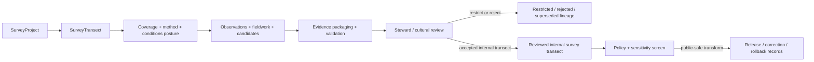

<!-- [KFM_META_BLOCK_V2]
doc_id: kfm://contract/domains/archaeology/survey-transect
title: contracts/domains/archaeology/survey_transect.md — SurveyTransect Contract
type: contract
version: v0.2
status: draft
owners: OWNER_TBD — Archaeology steward · Fieldwork steward · Survey steward · Contract steward · Evidence steward · Schema steward · Policy steward · Review steward · Validation steward · Release steward · Docs steward
created: 2026-06-20
updated: 2026-06-21
policy_label: public; contracts; domains; archaeology; survey-transect; semantic-contract; fieldwork; survey; sensitive-lane
tags: [kfm, contracts, archaeology, survey-transect, survey, fieldwork, coverage, route, observation, evidence, review, policy, sensitivity, lifecycle, governance]
related:
  - ./README.md
  - ./OBJECT_MAP.md
  - ./survey_project.md
  - ./shovel_test.md
  - ./test_unit.md
  - ./excavation_unit.md
  - ./domain_observation.md
  - ./candidate_feature.md
  - ./remote_sensing_anomaly.md
  - ./lidar_candidate.md
  - ./geophysics_observation.md
  - ./archaeological_site.md
  - ./site.md
  - ./site_component.md
  - ./provenience_context.md
  - ./stratigraphic_unit.md
  - ./artifact_record.md
  - ./sample.md
  - ./chronology_assertion.md
  - ./cultural_review.md
  - ./steward_review.md
  - ./sensitivity_transform.md
  - ./publication_transform_receipt.md
  - ../../../docs/domains/archaeology/MISSING_OR_PLANNED_FILES.md
  - ../../../docs/domains/archaeology/CANONICAL_PATHS.md
  - ../../../docs/domains/archaeology/ARCHITECTURE.md
  - ../../../docs/domains/archaeology/DATA_LIFECYCLE.md
  - ../../../schemas/contracts/v1/domains/archaeology/survey_transect.schema.json
  - ../../../policy/sensitivity/archaeology/
  - ../../../data/proofs/
  - ../../../release/
notes:
  - "Expanded from a planned-file scaffold into the object-level SurveyTransect semantic contract."
  - "The paired schema is currently a PROPOSED scaffold with empty properties and additionalProperties enabled."
  - "OBJECT_MAP.md maps SurveyTransect to survey_transect.md and survey_transect.schema.json as NEEDS VERIFICATION."
  - "OBJECT_MAP.md notes that the corpus term Survey may map to SurveyProject / SurveyTransect as CONFLICTED / NEEDS VERIFICATION."
  - "This contract defines survey-transect meaning; it does not authorize fieldwork, survey sufficiency, site confirmation, evidence proof, policy approval, review approval, publication, or release approval."
[/KFM_META_BLOCK_V2] -->

<a id="top"></a>

# SurveyTransect Contract

> Semantic contract for `SurveyTransect`, the Archaeology-domain object representing a governed transect, route, coverage line, survey segment, sweep, grid leg, or bounded coverage unit within a `SurveyProject`. It records survey-coverage meaning without becoming project scope, observation proof, site confirmation, public geometry, or release approval by itself.

<p>
  
  
  
  
  
  
</p>

`contracts/domains/archaeology/survey_transect.md`

## Quick jumps

[Status](#status) · [Meaning](#meaning) · [Repo fit](#repo-fit) · [Transect boundary](#transect-boundary) · [Schema posture](#schema-posture) · [Accepted uses](#accepted-uses) · [Exclusions](#exclusions) · [Recommended fields](#recommended-fields) · [Invariants](#invariants) · [Lifecycle](#lifecycle) · [Validation](#validation) · [Evidence basis](#evidence-basis) · [Rollback](#rollback) · [Definition of done](#definition-of-done)

---

## Status

> [!IMPORTANT]
> **Status:** `draft` / semantic contract  
> **Owner:** `OWNER_TBD`  
> **Contract path:** `contracts/domains/archaeology/survey_transect.md`  
> **Schema path:** `schemas/contracts/v1/domains/archaeology/survey_transect.schema.json`  
> **Truth posture:** `CONFIRMED` target path, current update, paired scaffold schema, object-map row, `Survey` term reconciliation note, adjacent expanded `SurveyProject` contract, and uploaded authoring guidance. Validator behavior, fixtures, policy behavior, source registry behavior, evidence-bundle implementation, review workflow, release workflow, API behavior, UI behavior, and runtime behavior remain `NEEDS VERIFICATION`.

> [!CAUTION]
> This contract defines object meaning only. It does **not** authorize fieldwork, publication, survey sufficiency, site confirmation, review approval, policy approval, proof closure, public geometry, or release of controlled archaeology survey-coverage records.

---

## Meaning

`SurveyTransect` is the Archaeology-domain object for recording a bounded survey transect, route, line, grid leg, sweep, pedestrian-survey segment, remote/field coverage segment, or other project-scoped survey-coverage unit.

A survey transect may organize or describe:

- a survey path, segment, line, grid leg, sweep, or coverage unit;
- relationship to a `SurveyProject` and its methods;
- coverage intent, conditions, spacing, visibility, and limitations;
- observations, shovel tests, candidate features, remote-sensing anomalies, LiDAR candidates, geophysics observations, or other records associated with that coverage unit;
- evidence, review, sensitivity, correction, transform, release, and rollback relationships.

It is not:

- a raw field track or instrument log;
- the whole survey project;
- a shovel-test record;
- a test or excavation unit;
- a domain observation by itself;
- a candidate feature;
- an archaeological site;
- a site component;
- an EvidenceBundle;
- a PolicyDecision;
- a ReviewRecord;
- a ReleaseManifest;
- proof that survey coverage was complete or that any site, component, association, or interpretation is true without evidence and review support.

---

## Repo fit

```text
contracts/
└── domains/
    └── archaeology/
        ├── README.md
        ├── survey_project.md
        ├── survey_transect.md
        ├── shovel_test.md
        └── domain_observation.md
```

Adjacent roots and object families:

| Root or object | Relationship |
|---|---|
| `./README.md` | Archaeology semantic-contract directory boundary. |
| `./OBJECT_MAP.md` | Maps `SurveyTransect` to this contract and its expected schema. |
| `./survey_project.md` | Project-scope object that may organize many transects. |
| `./shovel_test.md`, `./test_unit.md`, `./excavation_unit.md` | Fieldwork-unit records that may be associated with transect coverage. |
| `./domain_observation.md` | Observation envelope that may cite the transect or be made along it. |
| `./candidate_feature.md`, `./remote_sensing_anomaly.md`, `./lidar_candidate.md`, `./geophysics_observation.md` | Candidate or observation families that may arise from survey coverage. |
| `./archaeological_site.md`, `./site.md`, `./site_component.md` | Site/component families that may be supported, contested, or discovered through transect records. |
| `./provenience_context.md`, `./stratigraphic_unit.md`, `./artifact_record.md`, `./sample.md` | Context, recovery, and analytical families that may connect to transect-associated records. |
| `./cultural_review.md`, `./steward_review.md` | Review objects required before consequential interpretation or exposure. |
| `../../../schemas/contracts/v1/domains/archaeology/survey_transect.schema.json` | Current scaffold schema. |
| `../../../policy/sensitivity/archaeology/` | Policy gate home; behavior not verified here. |
| `../../../data/proofs/` | EvidenceBundle/proof support. |
| `../../../release/` | Release, correction, supersession, and rollback authority. |

---

## Transect boundary

`SurveyTransect` must preserve the difference between project scope, transect coverage, raw tracks, fieldwork records, observations, interpretation, proof, and publication.

| Boundary | Rule |
|---|---|
| Transect vs. survey project | A transect belongs to or references a project scope; it is not the whole project. |
| Transect vs. raw track/instrument log | A transect may reference raw tracks or logs; raw data remains in lifecycle data roots. |
| Transect vs. observation | Observations may occur along a transect; observation identity and evidence support remain separate. |
| Transect vs. field unit | Shovel tests, test units, and excavation units may be associated with transects but remain separate objects. |
| Transect vs. site confirmation | Transect association does not confirm a site, component, or candidate by itself. |
| Transect vs. corpus term `Survey` | The object map says `Survey` may map to `SurveyProject` / `SurveyTransect` and remains `CONFLICTED / NEEDS VERIFICATION`. |
| Transect vs. public release | Public use requires evidence, review, policy, transform, release, correction, and rollback support. |

---

## Schema posture

The paired schema found for this contract is:

```text
schemas/contracts/v1/domains/archaeology/survey_transect.schema.json
```

Current schema evidence:

| Schema fact | Status |
|---|---|
| Schema file exists | `CONFIRMED` |
| Schema title is `Survey Transect` | `CONFIRMED` |
| Schema status is `PROPOSED` | `CONFIRMED` |
| Schema properties are empty | `CONFIRMED` |
| `additionalProperties` is `true` | `CONFIRMED` |
| Schema `source_doc` points to the planned-files ledger | `CONFIRMED` |
| Schema `contract_doc` points to this contract | `CONFIRMED` |
| Validator implementation | `UNKNOWN / NOT FOUND IN THIS TASK` |

This contract therefore defines semantic expectations for future schema and validator work. It does not claim that machine validation currently enforces those expectations.

---

## Accepted uses

| Use | Allowed? | Rule |
|---|---:|---|
| Defining the meaning of a survey-transect object | Yes | Must preserve project, coverage, method, source, evidence, review, sensitivity, and lifecycle posture. |
| Organizing observations, shovel tests, candidate features, or fieldwork records along coverage units | Conditional | Must preserve uncertainty, source roles, review state, and policy controls. |
| Supporting survey coverage review, cataloging, correction, or rollback | Yes | Must not imply public release or final interpretation. |
| Supporting site/component or candidate interpretation | Conditional | Requires evidence, review, and bounded confidence. |
| Supporting public-safe summaries | Conditional | Requires policy, review, transform receipt, release record, and safe precision. |
| Treating transect coverage as survey completeness proof by itself | No | Coverage/sufficiency claims require evidence and validation. |
| Treating transect association as site confirmation by itself | No | Site identity and component meaning require separate governed support. |
| Publishing controlled transect geometry or detail by default | No | Controlled details fail closed unless approved through governed release. |
| Using schema validity as proof of truth | No | Schema shape is not evidence proof. |
| Treating this contract as release approval | No | Release authority remains separate. |

---

## Exclusions

| Does not belong in this contract | Correct home |
|---|---|
| Machine field shape | `../../../schemas/contracts/v1/domains/archaeology/survey_transect.schema.json`. |
| Validator implementation | `../../../tools/validators/...`. |
| Fixtures and tests | `../../../fixtures/...`, `../../../tests/...`. |
| Raw tracks, GPS logs, field forms, notebooks, photographs, instrument files, GIS exports, or bulk transect records | `../../../data/raw/`, `../../../data/work/`, or `../../../data/quarantine/`, subject to lifecycle and sensitivity rules. |
| EvidenceBundle/proof content | `../../../data/proofs/`. |
| Sensitivity, access, admissibility, or release policy | `../../../policy/...`. |
| Steward/cultural review records | Governance/review contract and record homes. |
| Release manifests, correction notices, rollback cards | `../../../release/`. |
| Public layer, UI, API, renderer, or Focus Mode implementation | Governed app/API/UI/layer roots. |

---

## Recommended fields

The current schema does not require these fields. They are `PROPOSED` semantic requirements for future schema/validator work:

| Field | Meaning |
|---|---|
| `survey_transect_id` | Stable deterministic or steward-assigned survey-transect identity. |
| `survey_project_ref` | SurveyProject reference for project-scope linkage. |
| `transect_label` | Transect number, route name, grid line, sweep label, field label, source label, or repository label. |
| `transect_type` | Pedestrian transect, route, grid leg, sweep, interval, remote-sensing segment, geophysics line, or other reviewed transect type. |
| `transect_scope_summary` | Bounded summary of transect purpose and coverage role appropriate for visibility class. |
| `transect_time_span` | Time span or date posture for transect activity, with uncertainty where needed. |
| `transect_geometry_ref` | Internal geometry/support-scope reference; public-safe generalization required before exposure. |
| `spatial_precision_class` | Exact, generalized, suppressed, centroided, binned, county/region, or denied precision posture. |
| `method_summary` | Public-safe or internal method summary. |
| `coverage_statement` | Bounded coverage statement that does not overclaim completeness. |
| `conditions_summary` | Ground visibility, access, disturbance, vegetation, weather, sensor/field conditions, or limitation summary where modeled. |
| `observation_refs` | DomainObservation or specialized observation references associated with the transect. |
| `fieldwork_refs` | ShovelTest, TestUnit, ExcavationUnit, or other fieldwork-unit references. |
| `candidate_refs` | CandidateFeature, RemoteSensingAnomaly, LiDARCandidate, or GeophysicsObservation references. |
| `site_refs` | ArchaeologicalSite or SiteComponent references only after reviewed linkage. |
| `context_refs` | ProvenienceContext or StratigraphicUnit references where relevant. |
| `artifact_refs` | ArtifactRecord or CollectionRepositoryRecord references where relevant. |
| `sample_refs` | Sample references where relevant. |
| `chronology_refs` | ChronologyAssertion or CulturalTemporalPeriod references. |
| `source_refs` | SourceDescriptor/source record references. |
| `source_roles` | Source roles supporting, contextualizing, or contesting the transect record. |
| `evidence_refs` | EvidenceRef/EvidenceBundle references. |
| `confidence_statement` | Bounded confidence, uncertainty, or limitation statement. |
| `contradiction_refs` | Observations, reports, candidates, or claims that contest the transect record or coverage. |
| `review_state` | Intake, needs review, under review, accepted internal transect, rejected, superseded, quarantined, release-candidate, or withdrawn. |
| `review_refs` | StewardReview, CulturalReview, project review, or other review record references. |
| `policy_state` | Policy posture or policy-decision reference. |
| `sensitivity_class` | Sensitivity/public-safety classification. |
| `lineage_refs` | Prior, successor, supersession, split, merge, equivalence, or rollback records. |
| `release_refs` | Release/candidate linkage where applicable. |
| `correction_refs` | Correction/supersession/rollback lineage. |
| `spec_hash` | Integrity pin for the representation. |

---

## Invariants

`SurveyTransect` must preserve these invariants:

- survey-transect records are not evidence proof by themselves;
- survey-transect records are not survey-completeness proof by themselves;
- survey-transect records are not site confirmation by themselves;
- survey-transect identity must remain distinct from project scope, fieldwork units, observations, candidates, sites, components, contexts, artifacts, samples, evidence, review, policy, release, correction, and rollback objects;
- raw track/source records and contract-level transect summaries must remain separated;
- source, fieldwork method, coverage statement, conditions, uncertainty, sensitivity, review posture, and lifecycle state must remain inspectable;
- controlled transect geometry, route, fieldwork, context, and collection detail fails closed unless policy, review, and release authorize a public-safe transform;
- contradiction, rejection, supersession, equivalence, merge/split, and correction lineage must remain traceable;
- schema validity is not evidence proof;
- public-facing use must be downstream of governed release artifacts and public-safe transforms;
- publication is a governed state transition, not a file move.

---

## Lifecycle



The contract defines the meaning of a survey-transect object. It does not replace project scoping, source intake, fieldwork authorization, evidence resolution, schema validation, policy enforcement, review, transform receipts, release approval, correction, or rollback systems.

---

## Validation

Before relying on this contract, verify:

- schema fields beyond scaffold status;
- validator implementation and fixture coverage;
- canonical survey-transect ID and deterministic identity rules;
- boundary between SurveyTransect, SurveyProject, ShovelTest, TestUnit, ExcavationUnit, DomainObservation, CandidateFeature, SiteComponent, and ArchaeologicalSite;
- how the corpus term `Survey` maps to SurveyProject vs SurveyTransect;
- transect-type, method, conditions, and coverage-statement vocabulary;
- split, merge, equivalence, supersession, and contradiction rules;
- fieldwork, observation, recovery, collection, chronology, and custody linkage requirements;
- EvidenceRef/EvidenceBundle requirements;
- source-role, time-kind, geometry, context, recovery, and association requirements;
- sensitivity handling for controlled transect geometry, survey area, fieldwork, context, and collection detail;
- steward/cultural review requirements;
- policy-gate requirements;
- release, correction, supersession, withdrawal, and rollback linkage;
- no downstream surface treats this contract as public disclosure permission, final proof, survey-completeness proof, or site confirmation.

---

## Evidence basis

| Source | Status | Supports | Limits |
|---|---|---|---|
| Prior `survey_transect.md` scaffold | `CONFIRMED` | Target file existed as a planned-file scaffold. | Scaffold did not define authoritative semantics. |
| `survey_transect.schema.json` | `CONFIRMED scaffold` | Schema exists, is `PROPOSED`, has empty properties, allows additional properties, and points to this contract. | Does not enforce full survey-transect semantics. |
| `OBJECT_MAP.md` | `CONFIRMED current map` | Maps `SurveyTransect` to `survey_transect.md` and `survey_transect.schema.json` with status `NEEDS VERIFICATION`; notes `Survey` may map to `SurveyProject` / `SurveyTransect` as conflicted. | Does not prove validator, fixture, policy, review, or release behavior. |
| `survey_project.md` | `CONFIRMED adjacent contract` | Provides adjacent project-scope boundary and distinguishes SurveyProject from SurveyTransect. | Does not define SurveyTransect schema enforcement. |
| Uploaded authoring prompt v2 | `CONFIRMED user-supplied guidance` | Requires evidence-grounded, implementation-honest Markdown with verification and rollback posture. | Authoring guidance, not implementation proof. |

---

## Rollback

Rollback is required if this contract is used to claim schema completeness, validator coverage, policy enforcement, review completion, release execution, API/UI behavior, fieldwork authorization, custody proof, evidence proof, survey-completeness proof, site confirmation, public disclosure permission, or implementation maturity not verified in this task.

Rollback target: prior scaffold blob SHA `a2dcb4e240cf5f92a8e33b2aaad88a31d2013c68`.

---

## Definition of done

- [ ] Owners are confirmed and `OWNER_TBD` is replaced.
- [ ] Survey-transect vocabulary is reviewed by the Archaeology steward, fieldwork steward, and survey steward.
- [ ] Boundary between `SurveyTransect`, `SurveyProject`, `ShovelTest`, `TestUnit`, `ExcavationUnit`, `DomainObservation`, `CandidateFeature`, `SiteComponent`, and `ArchaeologicalSite` is accepted.
- [ ] The corpus term `Survey` is reconciled against `SurveyProject` and `SurveyTransect`.
- [ ] Paired JSON Schema is expanded from scaffold status.
- [ ] Valid and invalid fixtures cover internal, restricted, rejected, superseded, equivalent, merged, split, corrected, release-candidate, and rollback states.
- [ ] Validator enforces required project, transect, fieldwork, source, evidence, coverage, conditions, observation, review, sensitivity, policy, lineage, and visibility fields.
- [ ] Fixtures avoid unsafe transect geometry, route, fieldwork, context, or collection detail where references or redacted summaries are safer.
- [ ] EvidenceBundle, PolicyDecision, ReviewRecord, SensitivityTransform, PublicationTransformReceipt, ReleaseManifest, CorrectionNotice, and RollbackCard references are validated where required.
- [ ] API/UI surfaces prove they cannot treat a survey transect as proof, survey-completeness proof, site confirmation, or public disclosure permission.
- [ ] Release and rollback dry-runs prove this contract cannot bypass publication gates.

## Status summary

`SurveyTransect` is a sensitive Archaeology coverage-unit object. It can organize transect methods, route/coverage posture, observations, fieldwork links, candidate features, evidence packaging, review, correction, and public-safe explanation when evidence, review, policy, transform, and release allow, but it is not proof, not survey-completeness proof, not site confirmation, not policy approval, and not release approval.

<p align="right"><a href="#top">Back to top</a></p>
