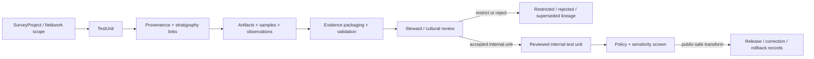

<!-- [KFM_META_BLOCK_V2]
doc_id: kfm://contract/domains/archaeology/test-unit
title: contracts/domains/archaeology/test_unit.md — TestUnit Contract
type: contract
version: v0.2
status: draft
owners: OWNER_TBD — Archaeology steward · Fieldwork steward · Contract steward · Evidence steward · Schema steward · Policy steward · Review steward · Validation steward · Release steward · Docs steward
created: 2026-06-20
updated: 2026-06-21
policy_label: public; contracts; domains; archaeology; test-unit; semantic-contract; fieldwork; sensitive-lane
tags: [kfm, contracts, archaeology, test-unit, fieldwork, excavation, survey, provenience, stratigraphy, artifact, sample, evidence, review, policy, sensitivity, lifecycle, governance]
related:
  - ./README.md
  - ./OBJECT_MAP.md
  - ./survey_project.md
  - ./survey_transect.md
  - ./shovel_test.md
  - ./excavation_unit.md
  - ./provenience_context.md
  - ./stratigraphic_unit.md
  - ./artifact_record.md
  - ./sample.md
  - ./domain_observation.md
  - ./candidate_feature.md
  - ./archaeological_site.md
  - ./site.md
  - ./site_component.md
  - ./chronology_assertion.md
  - ./cultural_temporal_period.md
  - ./cultural_review.md
  - ./steward_review.md
  - ./sensitivity_transform.md
  - ./publication_transform_receipt.md
  - ../../../docs/domains/archaeology/MISSING_OR_PLANNED_FILES.md
  - ../../../docs/domains/archaeology/CANONICAL_PATHS.md
  - ../../../docs/domains/archaeology/ARCHITECTURE.md
  - ../../../docs/domains/archaeology/DATA_LIFECYCLE.md
  - ../../../schemas/contracts/v1/domains/archaeology/test_unit.schema.json
  - ../../../policy/sensitivity/archaeology/
  - ../../../data/proofs/
  - ../../../release/
notes:
  - "Expanded from a planned-file scaffold into the object-level TestUnit semantic contract."
  - "The paired schema is currently a PROPOSED scaffold with empty properties and additionalProperties enabled."
  - "OBJECT_MAP.md maps TestUnit to test_unit.md and test_unit.schema.json as NEEDS VERIFICATION."
  - "This contract defines test-unit meaning; it does not authorize fieldwork, excavation approval, site confirmation, evidence proof, policy approval, review approval, publication, or release approval."
[/KFM_META_BLOCK_V2] -->

<a id="top"></a>

# TestUnit Contract

> Semantic contract for `TestUnit`, the Archaeology-domain object representing a governed test unit, small controlled excavation unit, evaluative unit, limited testing square, trench segment, or comparable fieldwork unit used to organize observations, provenience, stratigraphy, artifacts, samples, evidence, review, and release posture without becoming proof, site confirmation, public geometry, or release approval by itself.

<p>
  
  
  
  
  
  
</p>

`contracts/domains/archaeology/test_unit.md`

## Quick jumps

[Status](#status) · [Meaning](#meaning) · [Repo fit](#repo-fit) · [Fieldwork boundary](#fieldwork-boundary) · [Schema posture](#schema-posture) · [Accepted uses](#accepted-uses) · [Exclusions](#exclusions) · [Recommended fields](#recommended-fields) · [Invariants](#invariants) · [Lifecycle](#lifecycle) · [Validation](#validation) · [Evidence basis](#evidence-basis) · [Rollback](#rollback) · [Definition of done](#definition-of-done)

---

## Status

> [!IMPORTANT]
> **Status:** `draft` / semantic contract  
> **Owner:** `OWNER_TBD`  
> **Contract path:** `contracts/domains/archaeology/test_unit.md`  
> **Schema path:** `schemas/contracts/v1/domains/archaeology/test_unit.schema.json`  
> **Truth posture:** `CONFIRMED` target path, current update, paired scaffold schema, object-map row, adjacent expanded `ExcavationUnit` and `ShovelTest` contracts, and uploaded authoring guidance. Validator behavior, fixtures, policy behavior, source registry behavior, evidence-bundle implementation, review workflow, release workflow, API behavior, UI behavior, and runtime behavior remain `NEEDS VERIFICATION`.

> [!CAUTION]
> This contract defines object meaning only. It does **not** authorize fieldwork, excavation, publication, site confirmation, review approval, policy approval, proof closure, public geometry, or release of controlled archaeology test-unit records.

---

## Meaning

`TestUnit` is the Archaeology-domain object for recording a bounded test unit or comparable evaluative fieldwork unit. It sits between small survey tests and broader excavation units where a project needs controlled testing, limited excavation, stratigraphic recording, artifact/sample recovery, or evaluative evidence without asserting a full excavation-unit scope.

A test unit may support:

- survey or testing strategy documentation;
- controlled fieldwork-unit context;
- provenience and stratigraphic linkage;
- artifact or sample recovery lineage;
- domain observations, candidate-feature review, site-component review, or site evaluation;
- chronology and cultural-temporal review;
- evidence packaging, correction, supersession, and rollback workflows.

It is not:

- a raw field form;
- a whole survey project;
- a survey transect;
- a shovel test by default;
- a full excavation unit by default;
- a provenience context by itself;
- a stratigraphic unit by itself;
- an artifact or sample record;
- a confirmed archaeological site;
- a site component by itself;
- a chronology assertion by itself;
- an EvidenceBundle;
- a PolicyDecision;
- a ReviewRecord;
- a ReleaseManifest;
- proof that a site, component, association, date, recovery, or interpretation is true without evidence and review support.

---

## Repo fit

```text
contracts/
└── domains/
    └── archaeology/
        ├── README.md
        ├── test_unit.md
        ├── excavation_unit.md
        ├── shovel_test.md
        └── provenience_context.md
```

Adjacent roots and object families:

| Root or object | Relationship |
|---|---|
| `./README.md` | Archaeology semantic-contract directory boundary. |
| `./OBJECT_MAP.md` | Maps `TestUnit` to this contract and its expected schema. |
| `./survey_project.md`, `./survey_transect.md` | Survey/project context that may organize or lead to test units. |
| `./shovel_test.md` | Smaller survey/fieldwork test family; not a test unit by default. |
| `./excavation_unit.md` | Larger or differently scoped controlled excavation family; not identical to test unit. |
| `./provenience_context.md`, `./stratigraphic_unit.md` | Context and stratigraphic relationships that may support test-unit interpretation. |
| `./artifact_record.md`, `./sample.md` | Recovery object families that may reference the test unit and context. |
| `./domain_observation.md`, `./candidate_feature.md` | Observation and candidate families that may be supported or contested by test-unit records. |
| `./archaeological_site.md`, `./site.md`, `./site_component.md` | Site/component families that may cite reviewed test-unit evidence. |
| `./chronology_assertion.md`, `./cultural_temporal_period.md` | Time/period interpretation families that may use test-unit evidence after review. |
| `./cultural_review.md`, `./steward_review.md` | Review objects required before consequential interpretation or exposure. |
| `../../../schemas/contracts/v1/domains/archaeology/test_unit.schema.json` | Current scaffold schema. |
| `../../../policy/sensitivity/archaeology/` | Policy gate home; behavior not verified here. |
| `../../../data/proofs/` | EvidenceBundle/proof support. |
| `../../../release/` | Release, correction, supersession, and rollback authority. |

---

## Fieldwork boundary

`TestUnit` must preserve the difference between project scope, fieldwork unit, shovel test, excavation unit, provenience, stratigraphy, recovery record, interpretation, proof, and publication.

| Boundary | Rule |
|---|---|
| Test unit vs. survey project/transect | A test unit may be organized by survey scope or transect coverage; it is not the survey scope itself. |
| Test unit vs. shovel test | A shovel test may be smaller or survey-oriented; a test unit has its own governed identity and review posture. |
| Test unit vs. excavation unit | A test unit can be controlled fieldwork without becoming a full excavation unit unless reviewed and modeled that way. |
| Test unit vs. provenience context | Test units may contain or reference contexts; context identity remains separate. |
| Test unit vs. stratigraphic unit | Stratigraphic units may be observed inside test units; stratigraphy remains a separate object family. |
| Test unit vs. artifact/sample | Recovery records may cite the unit; artifact/sample identity and custody remain separate. |
| Test unit vs. public release | Public use requires evidence, review, policy, transform, release, correction, and rollback support. |

---

## Schema posture

The paired schema found for this contract is:

```text
schemas/contracts/v1/domains/archaeology/test_unit.schema.json
```

Current schema evidence:

| Schema fact | Status |
|---|---|
| Schema file exists | `CONFIRMED` |
| Schema title is `Test Unit` | `CONFIRMED` |
| Schema status is `PROPOSED` | `CONFIRMED` |
| Schema properties are empty | `CONFIRMED` |
| `additionalProperties` is `true` | `CONFIRMED` |
| Schema `source_doc` points to the planned-files ledger | `CONFIRMED` |
| Schema `contract_doc` points to this contract | `CONFIRMED` |
| Validator implementation | `UNKNOWN / NOT FOUND IN THIS TASK` |

This contract therefore defines semantic expectations for future schema and validator work. It does not claim that machine validation currently enforces those expectations.

---

## Accepted uses

| Use | Allowed? | Rule |
|---|---:|---|
| Defining the meaning of a test-unit object | Yes | Must preserve project, fieldwork, context, source, evidence, review, sensitivity, and lifecycle posture. |
| Linking test units to contexts, stratigraphy, artifacts, samples, chronology, components, or observations | Conditional | Must preserve uncertainty, association limits, review state, source roles, and policy controls. |
| Supporting fieldwork review, testing review, cataloging, correction, or rollback | Yes | Must not imply public release or final interpretation. |
| Supporting site/component or candidate interpretation | Conditional | Requires evidence, review, and bounded confidence. |
| Supporting public-safe summaries | Conditional | Requires policy, review, transform receipt, release record, and safe precision. |
| Treating a test unit as recovery proof by itself | No | Recovery claims require evidence resolution and review. |
| Treating a test unit as site confirmation by itself | No | Site identity and component meaning require separate governed support. |
| Publishing controlled test-unit geometry or context detail by default | No | Controlled details fail closed unless approved through governed release. |
| Using schema validity as proof of truth | No | Schema shape is not evidence proof. |
| Treating this contract as release approval | No | Release authority remains separate. |

---

## Exclusions

| Does not belong in this contract | Correct home |
|---|---|
| Machine field shape | `../../../schemas/contracts/v1/domains/archaeology/test_unit.schema.json`. |
| Validator implementation | `../../../tools/validators/...`. |
| Fixtures and tests | `../../../fixtures/...`, `../../../tests/...`. |
| Raw field forms, notebooks, photographs, profile drawings, instrument files, GIS exports, or bulk test-unit records | `../../../data/raw/`, `../../../data/work/`, or `../../../data/quarantine/`, subject to lifecycle and sensitivity rules. |
| EvidenceBundle/proof content | `../../../data/proofs/`. |
| Sensitivity, access, admissibility, or release policy | `../../../policy/...`. |
| Steward/cultural review records | Governance/review contract and record homes. |
| Release manifests, correction notices, rollback cards | `../../../release/`. |
| Public layer, UI, API, renderer, or Focus Mode implementation | Governed app/API/UI/layer roots. |

---

## Recommended fields

The current schema does not require these fields. They are `PROPOSED` semantic requirements for future schema/validator work:

| Field | Meaning |
|---|---|
| `test_unit_id` | Stable deterministic or steward-assigned test-unit identity. |
| `project_ref` | SurveyProject, fieldwork project, permit, source, or project-scope reference where modeled. |
| `survey_transect_ref` | SurveyTransect reference when the test unit belongs to transect or coverage sampling. |
| `unit_label` | Field unit label, test-unit number, grid/square label, trench segment label, source label, or repository label. |
| `unit_type` | Test unit, evaluative unit, testing square, trench segment, controlled test, mitigation test, or other reviewed type. |
| `fieldwork_method` | Method statement or controlled vocabulary for how the test unit was recorded. |
| `unit_geometry_ref` | Internal geometry/support-scope reference; public-safe generalization required before exposure. |
| `spatial_precision_class` | Exact, generalized, suppressed, centroided, binned, county/region, or denied precision posture. |
| `depth_or_level_summary` | Bounded depth, level, or interval summary appropriate for the visibility class. |
| `provenience_context_refs` | ProvenienceContext references created or used by the test unit. |
| `stratigraphic_refs` | StratigraphicUnit references observed or recorded in the test unit. |
| `artifact_refs` | ArtifactRecord references associated with the test unit. |
| `sample_refs` | Sample references associated with the test unit. |
| `chronology_refs` | ChronologyAssertion or CulturalTemporalPeriod references supported or constrained by test-unit evidence. |
| `observation_refs` | DomainObservation or specialized observation references. |
| `candidate_feature_refs` | CandidateFeature references supported, contested, or created from the unit. |
| `site_component_refs` | SiteComponent references only after review and evidence correlation. |
| `site_refs` | ArchaeologicalSite references only after reviewed linkage. |
| `source_refs` | SourceDescriptor/source record references. |
| `source_roles` | Source roles supporting, contextualizing, or contesting the unit. |
| `evidence_refs` | EvidenceRef/EvidenceBundle references. |
| `confidence_statement` | Bounded confidence, uncertainty, or limitation statement. |
| `contradiction_refs` | Observations, contexts, candidates, or claims that contest this unit. |
| `review_state` | Intake, needs review, under review, accepted internal unit, rejected, superseded, quarantined, release-candidate, or withdrawn. |
| `review_refs` | StewardReview, CulturalReview, project review, or other review record references. |
| `policy_state` | Policy posture or policy-decision reference. |
| `sensitivity_class` | Sensitivity/public-safety classification. |
| `lineage_refs` | Prior, successor, supersession, split, merge, equivalence, or rollback records. |
| `release_refs` | Release/candidate linkage where applicable. |
| `correction_refs` | Correction/supersession/rollback lineage. |
| `spec_hash` | Integrity pin for the representation. |

---

## Invariants

`TestUnit` must preserve these invariants:

- test-unit records are not evidence proof by themselves;
- test-unit records are not recovery proof by themselves;
- test-unit records are not site confirmation by themselves;
- test-unit identity must remain distinct from survey project, survey transect, shovel test, excavation unit, provenience context, stratigraphic unit, artifacts, samples, evidence, review, policy, release, correction, and rollback objects;
- raw field/collection records and contract-level summaries must remain separated;
- source, fieldwork method, geometry/support scope, context, recovery links, uncertainty, sensitivity, review posture, and lifecycle state must remain inspectable;
- controlled test-unit geometry, context, recovery, and collection detail fails closed unless policy, review, and release authorize a public-safe transform;
- contradiction, rejection, supersession, equivalence, merge/split, and correction lineage must remain traceable;
- schema validity is not evidence proof;
- public-facing use must be downstream of governed release artifacts and public-safe transforms;
- publication is a governed state transition, not a file move.

---

## Lifecycle



The contract defines the meaning of a test-unit object. It does not replace project scoping, fieldwork authorization, source intake, evidence resolution, schema validation, policy enforcement, review, transform receipts, release approval, correction, or rollback systems.

---

## Validation

Before relying on this contract, verify:

- schema fields beyond scaffold status;
- validator implementation and fixture coverage;
- canonical test-unit ID and deterministic identity rules;
- boundary between TestUnit, ShovelTest, ExcavationUnit, SurveyProject, SurveyTransect, ProvenienceContext, StratigraphicUnit, ArtifactRecord, Sample, CandidateFeature, SiteComponent, and ArchaeologicalSite;
- test-unit type, fieldwork method, level/depth, and recovery vocabulary;
- split, merge, equivalence, supersession, and contradiction rules;
- fieldwork, recovery, collection, chronology, and custody linkage requirements;
- EvidenceRef/EvidenceBundle requirements;
- source-role, time-kind, geometry, context, recovery, and association requirements;
- sensitivity handling for controlled test-unit geometry, fieldwork, provenience, stratigraphy, and collection detail;
- steward/cultural review requirements;
- policy-gate requirements;
- release, correction, supersession, withdrawal, and rollback linkage;
- no downstream surface treats this contract as public disclosure permission, final proof, recovery proof, or site confirmation.

---

## Evidence basis

| Source | Status | Supports | Limits |
|---|---|---|---|
| Prior `test_unit.md` scaffold | `CONFIRMED` | Target file existed as a planned-file scaffold. | Scaffold did not define authoritative semantics. |
| `test_unit.schema.json` | `CONFIRMED scaffold` | Schema exists, is `PROPOSED`, has empty properties, allows additional properties, and points to this contract. | Does not enforce full test-unit semantics. |
| `OBJECT_MAP.md` | `CONFIRMED current map` | Maps `TestUnit` to `test_unit.md` and `test_unit.schema.json` with status `NEEDS VERIFICATION`; identifies cross-cutting evidence, policy, review, release, rollback, and correction dependencies. | Does not prove validator, fixture, policy, review, or release behavior. |
| `excavation_unit.md` | `CONFIRMED adjacent contract` | Provides adjacent controlled fieldwork-unit pattern and distinguishes larger excavation-unit scope. | Does not define TestUnit schema enforcement. |
| `shovel_test.md` | `CONFIRMED adjacent contract` | Provides adjacent smaller/survey-oriented test family and distinguishes ShovelTest from TestUnit. | Does not define TestUnit schema enforcement. |
| Uploaded authoring prompt v2 | `CONFIRMED user-supplied guidance` | Requires evidence-grounded, implementation-honest Markdown with verification and rollback posture. | Authoring guidance, not implementation proof. |

---

## Rollback

Rollback is required if this contract is used to claim schema completeness, validator coverage, policy enforcement, review completion, release execution, API/UI behavior, fieldwork authorization, custody proof, evidence proof, recovery proof, site confirmation, public disclosure permission, or implementation maturity not verified in this task.

Rollback target: prior scaffold blob SHA `ea3becd868079d2543e540565b1acc382a6bd2d3`.

---

## Definition of done

- [ ] Owners are confirmed and `OWNER_TBD` is replaced.
- [ ] Test-unit vocabulary is reviewed by the Archaeology steward and fieldwork steward.
- [ ] Boundary between `TestUnit`, `ShovelTest`, `ExcavationUnit`, `SurveyProject`, `SurveyTransect`, `ProvenienceContext`, `StratigraphicUnit`, `ArtifactRecord`, `Sample`, `CandidateFeature`, `SiteComponent`, and `ArchaeologicalSite` is accepted.
- [ ] Paired JSON Schema is expanded from scaffold status.
- [ ] Valid and invalid fixtures cover internal, restricted, rejected, superseded, equivalent, merged, split, corrected, release-candidate, and rollback states.
- [ ] Validator enforces required project, fieldwork, context, source, evidence, stratigraphy, recovery, review, sensitivity, policy, lineage, and visibility fields.
- [ ] Fixtures avoid unsafe test-unit geometry, fieldwork, provenience, stratigraphy, or collection detail where references or redacted summaries are safer.
- [ ] EvidenceBundle, PolicyDecision, ReviewRecord, SensitivityTransform, PublicationTransformReceipt, ReleaseManifest, CorrectionNotice, and RollbackCard references are validated where required.
- [ ] API/UI surfaces prove they cannot treat a test unit as proof, recovery proof, site confirmation, or public disclosure permission.
- [ ] Release and rollback dry-runs prove this contract cannot bypass publication gates.

## Status summary

`TestUnit` is a sensitive Archaeology fieldwork object. It can support controlled testing, provenience context, stratigraphic recording, recovery lineage, candidate/site review, evidence packaging, correction, and public-safe explanation when evidence, review, policy, transform, and release allow, but it is not proof, not recovery proof, not site confirmation, not policy approval, and not release approval.

<p align="right"><a href="#top">Back to top</a></p>
