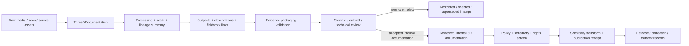

<!-- [KFM_META_BLOCK_V2]
doc_id: kfm://contract/domains/archaeology/three-d-documentation
title: contracts/domains/archaeology/three_d_documentation.md — ThreeDDocumentation Contract
type: contract
version: v0.3.0
status: proposed-inactive; fixture-only; no-network; non-authoritative
owners: OWNER_TBD — Archaeology steward · Documentation steward · 3D/photogrammetry steward · Contract steward · Evidence steward · Schema steward · Policy steward · Review steward · Validation steward · Release steward · Docs steward
created: 2026-06-20
updated: 2026-08-11
owning_root: contracts/
policy_label: public; contracts; domains; archaeology; three-d-documentation; semantic-contract; documentation; media; sensitive-lane
responsibility: Define Archaeology-domain 3D documentation meaning and one inactive fixture profile for acquisition, processing, scale, georeference, interpretation, representation, asset-lineage, and governance paradata without creating asset, evidence, policy, review, release, or publication authority.
truth_posture: "CONFIRMED semantic owner, closed fixture profile, local validator, synthetic fixture outcomes, and source-card traceability; PROPOSED inactive machine contract; UNKNOWN real asset and reference validity; NEEDS VERIFICATION archaeology, cultural, evidence, policy, review, release, and hosted-CI acceptance"
tags: [kfm, contracts, archaeology, three-d, 3d-documentation, photogrammetry, scan, model, media, evidence, review, policy, sensitivity, lifecycle, governance]
related:
  - ./README.md
  - ./OBJECT_MAP.md
  - ./domain_observation.md
  - ./remote_sensing_anomaly.md
  - ./lidar_candidate.md
  - ./geophysics_observation.md
  - ./candidate_feature.md
  - ./archaeological_site.md
  - ./site.md
  - ./site_component.md
  - ./survey_project.md
  - ./survey_transect.md
  - ./excavation_unit.md
  - ./test_unit.md
  - ./shovel_test.md
  - ./provenience_context.md
  - ./stratigraphic_unit.md
  - ./artifact_record.md
  - ./sample.md
  - ./collection_repository_record.md
  - ./cultural_review.md
  - ./steward_review.md
  - ./sensitivity_transform.md
  - ./publication_transform_receipt.md
  - ../../../docs/domains/archaeology/MISSING_OR_PLANNED_FILES.md
  - ../../../docs/domains/archaeology/CANONICAL_PATHS.md
  - ../../../docs/domains/archaeology/ARCHITECTURE.md
  - ../../../docs/domains/archaeology/DATA_LIFECYCLE.md
  - ../../../schemas/contracts/v1/domains/archaeology/three_d_documentation.schema.json
  - ../../../fixtures/contracts/v1/domains/archaeology/three_d_documentation/cases.json
  - ../../../tools/validators/domains/archaeology/validate_three_d_documentation.py
  - ../../../tests/validators/domains/archaeology/test_validate_three_d_documentation.py
  - ../../../docs/intake/exploratory/pass-18-three-d-documentation-paradata-source-map.md
  - ../../../policy/sensitivity/archaeology/
  - ../../../data/proofs/
  - ../../../release/
notes:
  - "Expanded from a planned-file scaffold into the object-level ThreeDDocumentation semantic contract."
  - "The paired schema now defines one closed PROPOSED_INACTIVE fixture profile for acquisition, processing, scale, georeference, interpretation, asset-lineage, and governance paradata."
  - "OBJECT_MAP.md maps ThreeDDocumentation to three_d_documentation.md and three_d_documentation.schema.json as NEEDS VERIFICATION."
  - "This contract defines 3D-documentation meaning; it does not authorize public model release, site confirmation, media publication, evidence proof, policy approval, review approval, or release approval."
[/KFM_META_BLOCK_V2] -->

<a id="top"></a>

# ThreeDDocumentation Contract

> Semantic contract for `ThreeDDocumentation`, the Archaeology-domain object representing governed 3D documentation such as photogrammetry sets, scan captures, derived meshes, point-cloud documentation, model records, scene documentation, or 3D evidence carriers. It records documentation meaning and lineage without making source media, models, geometry, site confirmation, public release, or proof authoritative by itself.

<p>
  
  
  
  
  
  
</p>

`contracts/domains/archaeology/three_d_documentation.md`

## Quick jumps

[Status](#status) · [Meaning](#meaning) · [Repo fit](#repo-fit) · [Documentation boundary](#documentation-boundary) · [Schema posture](#schema-posture) · [Accepted uses](#accepted-uses) · [Exclusions](#exclusions) · [Recommended fields](#recommended-fields) · [Invariants](#invariants) · [Lifecycle](#lifecycle) · [Validation](#validation) · [Evidence basis](#evidence-basis) · [Rollback](#rollback) · [Definition of done](#definition-of-done)

---

## Status

> [!IMPORTANT]
> **Status:** `proposed-inactive` / fixture-only semantic contract profile
> **Owner:** `OWNER_TBD`  
> **Contract path:** `contracts/domains/archaeology/three_d_documentation.md`  
> **Schema path:** `schemas/contracts/v1/domains/archaeology/three_d_documentation.schema.json`  
> **Truth posture:** `CONFIRMED` target path, closed schema shape, deterministic local validator, synthetic fixture outcomes, source-card traceability, and current repository placement. Actual assets, source rights, evidence resolution, interpretation, policy, review, release, API/UI behavior, asset-pipeline behavior, hosted CI, and runtime behavior remain `NEEDS VERIFICATION`.

> [!CAUTION]
> This contract defines object meaning only. It does **not** authorize public model release, source-media publication, site confirmation, fieldwork approval, review approval, policy approval, proof closure, public geometry, or release of controlled archaeology documentation records.

---

## Meaning

`ThreeDDocumentation` is the Archaeology-domain object for recording a governed 3D documentation record or documentation package. It may describe a capture event, source-media bundle, photogrammetry project, scan capture, point-cloud record, mesh/model derivative, measured documentation scene, or controlled visualization carrier used to support internal review, evidence packaging, correction, and public-safe release decisions.

A 3D documentation record may support:

- documentation of artifacts, samples, contexts, stratigraphy, field units, site components, or sites;
- photogrammetry, laser scanning, structured-light scanning, LiDAR-derived documentation, depth capture, or modeled scene lineage;
- source-media, processing, calibration, scale, accuracy, and derivative lineage tracking;
- review of condition, context, association, recovery, interpretation, or correction claims;
- public-safe model, snapshot, tile, image, or generalized scene publication when policy, review, transform, and release allow;
- internal evidence packaging, validation, correction, supersession, and rollback workflows.

It is not:

- a raw image, video, scan, point cloud, mesh, model, texture, tile, or scene file by itself;
- a public 3D model by default;
- a confirmed archaeological site;
- a confirmed site component;
- an artifact or sample record by itself;
- a provenience context or stratigraphic unit by itself;
- an EvidenceBundle;
- a PolicyDecision;
- a ReviewRecord;
- a ReleaseManifest;
- proof that an association, condition, interpretation, date, recovery, or site identity is true without evidence and review support;
- permission to disclose controlled media, geometry, scale, context, collection, custody, or interpretation detail.

---

## Repo fit

```text
contracts/
└── domains/
    └── archaeology/
        ├── README.md
        ├── three_d_documentation.md
        ├── remote_sensing_anomaly.md
        ├── lidar_candidate.md
        └── geophysics_observation.md
```

Adjacent roots and object families:

| Root or object | Relationship |
|---|---|
| `./README.md` | Archaeology semantic-contract directory boundary. |
| `./OBJECT_MAP.md` | Maps `ThreeDDocumentation` to this contract and its expected schema. |
| `./domain_observation.md` | Observation envelope that may cite 3D documentation support. |
| `./remote_sensing_anomaly.md`, `./lidar_candidate.md`, `./geophysics_observation.md` | Adjacent sensing/documentation families that may support or be compared with 3D documentation. |
| `./candidate_feature.md`, `./site_component.md`, `./archaeological_site.md`, `./site.md` | Candidate/site/component families that may cite reviewed 3D documentation. |
| `./survey_project.md`, `./survey_transect.md`, `./excavation_unit.md`, `./test_unit.md`, `./shovel_test.md` | Fieldwork contexts that may produce or use 3D documentation. |
| `./provenience_context.md`, `./stratigraphic_unit.md`, `./artifact_record.md`, `./sample.md`, `./collection_repository_record.md` | Context, recovery, collection, and analytical families that may be documented in 3D. |
| `./cultural_review.md`, `./steward_review.md` | Review objects required before consequential interpretation or exposure. |
| `./sensitivity_transform.md`, `./publication_transform_receipt.md` | Transform and receipt objects required before public-safe derivatives can be treated as released. |
| `../../../schemas/contracts/v1/domains/archaeology/three_d_documentation.schema.json` | Closed, fixture-only candidate shape; not an accepted production schema or authority record. |
| `../../../policy/sensitivity/archaeology/` | Policy gate home; behavior not verified here. |
| `../../../data/proofs/` | EvidenceBundle/proof support. |
| `../../../release/` | Release, correction, supersession, and rollback authority. |

---

## Documentation boundary

`ThreeDDocumentation` must preserve the difference between documentation record, source media, derived model, evidence proof, site/object claim, review, policy, and release.

| Boundary | Rule |
|---|---|
| Documentation record vs. source asset | The contract can describe and reference source assets; raw media and derivative files remain in lifecycle-controlled data/artifact roots. |
| Documentation record vs. derived model | A mesh, point cloud, image set, texture, scene, or tile is a carrier, not sovereign truth. |
| Documentation record vs. observation | 3D documentation may support observations; observation identity and claim support remain separate. |
| Documentation record vs. site/object confirmation | Documentation may support review but does not confirm a site, component, artifact, sample, context, or interpretation by itself. |
| Documentation record vs. EvidenceBundle | EvidenceBundle/proof support remains separate and must resolve before consequential claims. |
| Documentation record vs. public release | Public use requires policy, review, transform receipt, release record, correction path, and rollback path. |

---

## Schema posture

The paired schema found for this contract is:

```text
schemas/contracts/v1/domains/archaeology/three_d_documentation.schema.json
```

Current schema evidence:

| Schema fact | Status |
|---|---|
| Schema file exists | `CONFIRMED` |
| Schema title is `ThreeDDocumentation` | `CONFIRMED` |
| Schema status is `PROPOSED_INACTIVE` | `CONFIRMED` |
| Root and nested objects are closed | `CONFIRMED` |
| Acquisition, processing, scale, georeference, interpretation, asset, and governance paradata are shaped | `CONFIRMED` |
| Synthetic `PASS`, `ABSTAIN`, `DENY`, and `ERROR` fixtures exist | `CONFIRMED` |
| Deterministic fixture validator and focused tests exist | `CONFIRMED` |
| Real asset, reference, evidence, policy, review, release, or runtime validation | `NEEDS VERIFICATION / NOT PERFORMED` |

The machine profile enforces only bounded declaration coherence over synthetic references. A local `PASS` does not authenticate a referenced object, establish an interpretation, or authorize release.

---

## Accepted uses

| Use | Allowed? | Rule |
|---|---:|---|
| Defining the meaning of a 3D documentation object | Yes | Must preserve source, method, asset lineage, evidence, review, sensitivity, and lifecycle posture. |
| Linking documentation to objects, contexts, fieldwork, artifacts, samples, or observations | Conditional | Must preserve uncertainty, association limits, review state, source roles, and policy controls. |
| Supporting internal documentation review, validation, correction, or rollback | Yes | Must not imply public release or final interpretation. |
| Supporting public-safe derivatives | Conditional | Requires policy, review, transform receipt, release record, safe precision, and rollback target. |
| Treating 3D assets as proof by themselves | No | Assets and derived models are evidence carriers, not proof closure. |
| Treating 3D documentation as site or object confirmation by itself | No | Site/object identity and interpretation require separate governed support. |
| Publishing controlled 3D media, geometry, or model detail by default | No | Controlled details fail closed unless approved through governed release. |
| Using schema validity as proof of truth | No | Schema shape is not evidence proof. |
| Treating this contract as release approval | No | Release authority remains separate. |

---

## Exclusions

| Does not belong in this contract | Correct home |
|---|---|
| Machine field shape | `../../../schemas/contracts/v1/domains/archaeology/three_d_documentation.schema.json`. |
| Validator implementation | `../../../tools/validators/...`. |
| Fixtures and tests | `../../../fixtures/...`, `../../../tests/...`. |
| Raw photos, videos, scan files, point clouds, meshes, textures, tiles, scene exports, calibration files, or processing workspaces | Lifecycle-controlled data/artifact roots, subject to policy and sensitivity review. |
| EvidenceBundle/proof content | `../../../data/proofs/`. |
| Sensitivity, access, admissibility, or release policy | `../../../policy/...`. |
| Steward/cultural review records | Governance/review contract and record homes. |
| Release manifests, correction notices, rollback cards | `../../../release/`. |
| Public layer, UI, API, renderer, Focus Mode, tile, scene, or model viewer implementation | Governed app/API/UI/layer roots. |

---

## Recommended fields

The fixture profile implements a bounded subset of these fields. The wider vocabulary remains `PROPOSED` pending steward review:

| Field | Meaning |
|---|---|
| `three_d_documentation_id` | Stable deterministic or steward-assigned 3D documentation identity. |
| `documentation_label` | Project label, model label, scan label, photogrammetry set label, source label, or repository label. |
| `documentation_type` | Photogrammetry, laser scan, structured-light scan, LiDAR-derived model, depth capture, mesh, point cloud, measured drawing support, scene package, or other reviewed type. |
| `subject_refs` | ArchaeologicalSite, SiteComponent, ArtifactRecord, Sample, ProvenienceContext, StratigraphicUnit, fieldwork unit, or other documented subject references. |
| `fieldwork_refs` | SurveyProject, SurveyTransect, ExcavationUnit, TestUnit, ShovelTest, or other fieldwork references. |
| `source_asset_refs` | Controlled references to raw media, scan, point cloud, mesh, texture, calibration, or processing assets. |
| `derived_asset_refs` | Controlled references to derivative models, scenes, tiles, snapshots, or public-safe assets. |
| `capture_method` | Method summary or controlled vocabulary for capture technique. |
| `processing_summary` | Public-safe or internal summary of alignment, reconstruction, cleanup, scaling, meshing, texturing, or derivative processing. |
| `scale_accuracy_statement` | Bounded statement on scale, measurement reliability, precision, or limitations. |
| `spatial_precision_class` | Exact, generalized, suppressed, centroided, binned, county/region, object-only, or denied precision posture. |
| `visibility_class` | Public, public-safe derivative, internal, restricted, quarantined, redacted, or denied posture. |
| `rights_refs` | Rights, license, donor, repository, or source-use references where required. |
| `source_refs` | SourceDescriptor/source record references. |
| `source_roles` | Source roles supporting, contextualizing, or contesting the documentation record. |
| `evidence_refs` | EvidenceRef/EvidenceBundle references. |
| `observation_refs` | DomainObservation or specialized observation references supported by the documentation. |
| `candidate_refs` | CandidateFeature, RemoteSensingAnomaly, LiDARCandidate, or GeophysicsObservation references where applicable. |
| `confidence_statement` | Bounded confidence, uncertainty, or limitation statement. |
| `contradiction_refs` | Observations, assets, processing runs, or claims that contest this documentation record. |
| `review_state` | Intake, needs review, under review, accepted internal documentation, rejected, superseded, quarantined, release-candidate, or withdrawn. |
| `review_refs` | StewardReview, CulturalReview, technical review, rights review, or other review record references. |
| `policy_state` | Policy posture or policy-decision reference. |
| `sensitivity_class` | Sensitivity/public-safety classification. |
| `transform_refs` | SensitivityTransform or PublicationTransformReceipt references where derivatives are prepared for release. |
| `lineage_refs` | Prior, successor, supersession, split, merge, equivalence, processing run, or rollback records. |
| `release_refs` | Release/candidate linkage where applicable. |
| `correction_refs` | Correction/supersession/rollback lineage. |
| `spec_hash` | Integrity pin for the representation. |

---

## Invariants

`ThreeDDocumentation` must preserve these invariants:

- 3D documentation records are not evidence proof by themselves;
- 3D documentation records are not site, component, object, condition, or interpretation confirmation by themselves;
- source media, derived models, tiles, scenes, and screenshots are downstream carriers, not sovereign truth;
- documentation identity must remain distinct from source assets, derived assets, observations, fieldwork units, sites, components, artifacts, samples, contexts, evidence, review, policy, release, correction, and rollback objects;
- raw media/scan assets and contract-level documentation summaries must remain separated;
- source, rights, capture method, processing lineage, scale/accuracy statement, uncertainty, sensitivity, review posture, and lifecycle state must remain inspectable;
- controlled 3D media, model detail, geometry, context, collection, and custody detail fails closed unless policy, review, and release authorize a public-safe transform;
- contradiction, rejection, supersession, equivalence, processing lineage, and correction lineage must remain traceable;
- schema validity is not evidence proof;
- public-facing use must be downstream of governed release artifacts and public-safe transforms;
- publication is a governed state transition, not a file move.

---

## Lifecycle


```mermaid
flowchart LR
  SRC[Raw media / scan / source assets] --> DOC[ThreeDDocumentation]
  DOC --> PROCESS[Processing + scale + lineage summary]
  PROCESS --> LINKS[Subjects + observations + fieldwork links]
  LINKS --> EVID[Evidence packaging + validation]
  EVID --> REVIEW[Steward / cultural / technical review]
  REVIEW -->|restrict or reject| CONTROL[Restricted / rejected / superseded lineage]
  REVIEW -->|accepted internal documentation| INTERNAL[Reviewed internal 3D documentation]
  INTERNAL --> POLICY[Policy + sensitivity + rights screen]
  POLICY --> TRANSFORM[Sensitivity transform + publication receipt]
  TRANSFORM --> RELEASE[Release / correction / rollback records]
```

The contract defines the meaning of a 3D-documentation object. It does not replace asset storage, source intake, capture authorization, rights review, evidence resolution, schema validation, policy enforcement, cultural/steward review, transform receipts, release approval, correction, or rollback systems.

---

## Validation

The packet can be replayed locally without network access:

```bash
python -m unittest tests.validators.domains.archaeology.test_validate_three_d_documentation -v
python tools/validators/domains/archaeology/validate_three_d_documentation.py --fixtures
```

The exact 21-case matrix covers two coherent declarations, incomplete and error states, asset-role collapse, processing-lineage gaps, interpretation and 2.5D disclosure, scale/georeference closure, public-safe assets, sensitivity, governance/release closure, deterministic identity, canonical references, and fixed-false authority claims.

Before relying on this contract beyond the fixture profile, verify:

- production vocabulary and migration from the fixture profile;
- hosted CI and human review of validator/fixture coverage;
- canonical 3D-documentation ID and deterministic identity rules;
- boundary between ThreeDDocumentation, DomainObservation, RemoteSensingAnomaly, LiDARCandidate, GeophysicsObservation, CandidateFeature, SiteComponent, ArchaeologicalSite, ArtifactRecord, Sample, ProvenienceContext, and StratigraphicUnit;
- source-asset vs derived-asset vs public-safe-derivative rules;
- capture-method, processing, scale/accuracy, visibility, and rights vocabulary;
- split, merge, equivalence, supersession, processing lineage, and contradiction rules;
- EvidenceRef/EvidenceBundle requirements;
- source-role, time-kind, rights, geometry, context, recovery, collection, and association requirements;
- sensitivity handling for controlled media, models, geometry, context, collection, custody, and interpretation detail;
- steward/cultural/technical review requirements;
- policy-gate and rights-gate requirements;
- transform, release, correction, supersession, withdrawal, and rollback linkage;
- no downstream surface treats this contract as public disclosure permission, final proof, object confirmation, site confirmation, or public model release.

---

## Evidence basis

| Source | Status | Supports | Limits |
|---|---|---|---|
| Prior `three_d_documentation.md` scaffold | `CONFIRMED` | Target file existed as a planned-file scaffold. | Scaffold did not define authoritative semantics. |
| Pass 18 card `KFM-P18-INV-410` and `Archaeological 3D GIS.pdf` | `CONFIRMED source support` | Acquisition methods, processing choices, scaling, georeferencing, and interpretive steps are reviewable paradata rather than hidden model state. | Source support is not KFM implementation or archaeological authority. |
| `three_d_documentation.schema.json` | `CONFIRMED candidate implementation` | Closed fixture shape exists for the bounded paradata subset. | Does not validate assets, external references, truth, policy, review, or release. |
| `OBJECT_MAP.md` | `CONFIRMED current map` | Maps `ThreeDDocumentation` to `three_d_documentation.md` and `three_d_documentation.schema.json` with status `NEEDS VERIFICATION`; identifies cross-cutting evidence, policy, review, release, rollback, and correction dependencies. | Does not prove validator, fixture, policy, review, asset-pipeline, or release behavior. |
| `remote_sensing_anomaly.md` | `CONFIRMED adjacent contract` | Provides adjacent sensing-object pattern and confirms remote-sensing/asset carriers do not become proof or release authority by themselves. | Does not define ThreeDDocumentation schema enforcement. |
| Uploaded authoring prompt v2 | `CONFIRMED user-supplied guidance` | Requires evidence-grounded, implementation-honest Markdown with verification and rollback posture. | Authoring guidance, not implementation proof. |

---

## Rollback

Rollback is required if this contract is used to claim schema completeness, validator coverage, asset-pipeline behavior, policy enforcement, review completion, release execution, API/UI behavior, capture authorization, rights clearance, custody proof, evidence proof, object confirmation, site confirmation, public model release, public disclosure permission, or implementation maturity not verified in this task.

Rollback is one feature-commit revert. No asset, source, evidence, policy, review, release, correction, rollback, deployment, or public state requires operational restoration.

---

## Definition of done

- [ ] Owners are confirmed and `OWNER_TBD` is replaced.
- [ ] 3D-documentation vocabulary is reviewed by the Archaeology steward, documentation steward, 3D/photogrammetry steward, evidence steward, policy steward, and release steward.
- [ ] Boundary between `ThreeDDocumentation`, `DomainObservation`, `RemoteSensingAnomaly`, `LiDARCandidate`, `GeophysicsObservation`, `CandidateFeature`, `SiteComponent`, `ArchaeologicalSite`, `ArtifactRecord`, `Sample`, `ProvenienceContext`, and `StratigraphicUnit` is accepted.
- [ ] Source-asset, derived-asset, internal documentation, public-safe derivative, and release-asset states are modeled without collapsing lifecycle boundaries.
- [x] Paired JSON Schema is expanded from scaffold status as a closed, inactive fixture profile.
- [x] Synthetic valid and invalid fixtures cover the bounded acquisition, processing, spatial-reference, interpretation, asset-lineage, public-candidate, and authority boundaries.
- [x] Deterministic validator enforces the bounded paradata profile without network or asset access.
- [ ] Fixtures avoid unsafe media, model, geometry, context, collection, custody, or interpretation detail where references or redacted summaries are safer.
- [ ] EvidenceBundle, PolicyDecision, ReviewRecord, SensitivityTransform, PublicationTransformReceipt, ReleaseManifest, CorrectionNotice, and RollbackCard references are validated where required.
- [ ] API/UI surfaces prove they cannot treat 3D documentation as proof, object confirmation, site confirmation, or public model release permission.
- [ ] Release and rollback dry-runs prove this contract cannot bypass publication gates.

## Status summary

`ThreeDDocumentation` is a sensitive Archaeology documentation object. It can support capture lineage, processing lineage, review, validation, evidence packaging, correction, public-safe derivatives, and release readiness when evidence, rights, review, policy, transform, and release allow, but it is not proof, not object confirmation, not site confirmation, not policy approval, and not release approval.

<p align="right"><a href="#top">Back to top</a></p>
