<!-- [KFM_META_BLOCK_V2]
doc_id: kfm://contract/domains/atmosphere/aod-raster
title: contracts/domains/atmosphere/AODRaster.md — AODRaster Contract
type: contract
version: v0.2
status: draft
owners: OWNER_TBD — Atmosphere steward · Remote-sensing steward · Contract steward · Evidence steward · Schema steward · Policy steward · Validation steward · Release steward · Docs steward
created: 2026-06-21
updated: 2026-06-21
policy_label: public; contracts; domains; atmosphere; aod-raster; semantic-contract; remote-sensing-mask; sensitive-lane
tags: [kfm, contracts, atmosphere, air, AODRaster, aerosol-optical-depth, remote-sensing, raster, smoke, PM2.5, evidence, policy, validation, lifecycle, governance]
related:
  - ../../../docs/domains/atmosphere/README.md
  - ../../../docs/domains/atmosphere/CANONICAL_PATHS.md
  - ../../../docs/domains/atmosphere/OBJECT_FAMILY_MAP.md
  - ../../../docs/domains/atmosphere/POLICY.md
  - ../../../docs/domains/atmosphere/SENSITIVITY.md
  - ../../../docs/domains/atmosphere/SOURCE_FAMILIES.md
  - ../../../docs/domains/atmosphere/SOURCES.md
  - ../../../docs/domains/atmosphere/PIPELINE.md
  - ../../../docs/domains/atmosphere/API_CONTRACTS.md
  - ./SmokeContext.md
  - ./AirObservation.md
  - ./PM25Observation.md
  - ./ForecastContext.md
  - ./WindField.md
  - ./AdvisoryContext.md
  - ../../../schemas/contracts/v1/domains/atmosphere/AODRaster.schema.json
  - ../../../policy/domains/atmosphere/
  - ../../../data/proofs/
  - ../../../release/
notes:
  - "Expanded from a planned-file scaffold into the object-level AODRaster semantic contract."
  - "The paired schema is currently a PROPOSED scaffold with empty properties and additionalProperties enabled."
  - "docs/domains/atmosphere/OBJECT_FAMILY_MAP.md maps AODRaster to the REMOTE_SENSING_MASK knowledge character."
  - "Atmosphere policy doctrine explicitly denies presenting AODRaster / REMOTE_SENSING_MASK as PM2.5 measurement."
  - "This contract defines AOD-raster meaning; it does not authorize PM2.5 inference, ground-observation claims, policy approval, evidence proof, public release, or operational health/safety guidance."
[/KFM_META_BLOCK_V2] -->

<a id="top"></a>

# AODRaster Contract

> Semantic contract for `AODRaster`, the Atmosphere/Air-domain object representing an aerosol optical depth raster or comparable remotely sensed aerosol-opacity field. It records remote-sensing mask/proxy meaning and lineage without turning the raster into a PM2.5 measurement, ground observation, forecast, advisory, public health instruction, or release approval by itself.

<p>
  
  
  
  
  
  
</p>

`contracts/domains/atmosphere/AODRaster.md`

## Quick jumps

[Status](#status) · [Meaning](#meaning) · [Repo fit](#repo-fit) · [Raster boundary](#raster-boundary) · [Schema posture](#schema-posture) · [Accepted uses](#accepted-uses) · [Exclusions](#exclusions) · [Recommended fields](#recommended-fields) · [Invariants](#invariants) · [Lifecycle](#lifecycle) · [Validation](#validation) · [Evidence basis](#evidence-basis) · [Rollback](#rollback) · [Definition of done](#definition-of-done)

---

## Status

> [!IMPORTANT]
> **Status:** `draft` / semantic contract  
> **Owner:** `OWNER_TBD`  
> **Contract path:** `contracts/domains/atmosphere/AODRaster.md`  
> **Schema path:** `schemas/contracts/v1/domains/atmosphere/AODRaster.schema.json`  
> **Truth posture:** `CONFIRMED` target path, current update, paired scaffold schema, canonical-path lane, object-family map entry, atmosphere policy anti-collapse rule, adjacent `SmokeContext` scaffold, and uploaded authoring guidance. Validator behavior, fixtures, enforceable policy bundles, source registry behavior, evidence-bundle implementation, release workflow, API behavior, UI behavior, raster pipeline behavior, and runtime behavior remain `NEEDS VERIFICATION`.

> [!CAUTION]
> This contract defines object meaning only. It does **not** authorize publication, PM2.5 inference, ground-observation claims, smoke-impact claims, health/safety guidance, policy approval, proof closure, public tiles, or release of controlled Atmosphere/Air products.

---

## Meaning

`AODRaster` is the Atmosphere/Air-domain object for an aerosol optical depth raster or comparable remotely sensed aerosol-opacity grid admitted into KFM as a `REMOTE_SENSING_MASK` knowledge character.

An AOD raster may support:

- remote-sensing context for smoke or aerosol analysis;
- comparison against `SmokeContext`, air-quality observations, weather context, model fields, or advisory context;
- map-safe visualization when policy, evidence, source-role, validation, and release gates allow;
- evidence packaging for claims about remote-sensing mask presence, spatial extent, retrieval time, product lineage, or raster quality;
- correction, supersession, reprocessing, and rollback workflows.

It is not:

- a PM2.5 measurement;
- an AQI report;
- a ground sensor observation;
- a regulatory archive measurement by default;
- a forecast field by default;
- an advisory or health/safety instruction;
- proof of smoke exposure, health effect, visibility impact, or ground-level concentration;
- a public tile, map layer, or published raster by default;
- an EvidenceBundle;
- a PolicyDecision;
- a ReleaseManifest;
- permission to disclose controlled cross-lane joins, stale products, unclear-rights products, or unsupported concentration claims.

---

## Repo fit

```text
contracts/
└── domains/
    └── atmosphere/
        ├── AODRaster.md
        ├── SmokeContext.md
        ├── AirObservation.md
        └── ForecastContext.md
```

Adjacent roots and object families:

| Root or object | Relationship |
|---|---|
| `../../../docs/domains/atmosphere/CANONICAL_PATHS.md` | Confirms the responsibility-root lane pattern for Atmosphere contracts and schemas. |
| `../../../docs/domains/atmosphere/OBJECT_FAMILY_MAP.md` | Maps `AODRaster` into the remote-sensing/smoke group and binds it to `REMOTE_SENSING_MASK`. |
| `../../../docs/domains/atmosphere/POLICY.md` | States the anti-collapse policy that AOD is not PM2.5. |
| `./SmokeContext.md` | Adjacent smoke-context object; source role determines whether smoke is remote-sensing mask or model field. |
| `./AirObservation.md`, `./PM25Observation.md` | Observation/concentration object families that AOD must not impersonate. |
| `./ForecastContext.md`, `./WindField.md` | Model/context families that must not collapse into observations. |
| `./AdvisoryContext.md` | Advisory family; AOD does not produce life-safety instruction. |
| `../../../schemas/contracts/v1/domains/atmosphere/AODRaster.schema.json` | Current scaffold schema. |
| `../../../policy/domains/atmosphere/` | Proposed enforceable policy bundle home; behavior not verified here. |
| `../../../data/proofs/` | EvidenceBundle/proof support. |
| `../../../release/` | Release, correction, supersession, and rollback authority. |

---

## Raster boundary

`AODRaster` must preserve the difference between remote-sensing proxy, observation, model field, concentration, public report, evidence proof, and release.

| Boundary | Rule |
|---|---|
| AOD raster vs. PM2.5 | AOD is a remote-sensing mask/proxy and must not be presented as PM2.5 concentration. |
| AOD raster vs. AQI | AOD is not an AQI report and must not be converted into AQI without a separately governed method, evidence, policy, and review. |
| AOD raster vs. ground observation | A raster is not a ground sensor reading or regulatory archive measurement. |
| AOD raster vs. forecast/model field | AOD is not a model field unless a source explicitly admits it under a modeled role; source role is mandatory. |
| AOD raster vs. SmokeContext | AOD may inform smoke context; it does not replace the smoke-context object or hazards-lane event/impact objects. |
| AOD raster vs. public map layer | Public display requires policy, validation, transform, release, correction path, and rollback target. |

---

## Schema posture

The paired schema found for this contract is:

```text
schemas/contracts/v1/domains/atmosphere/AODRaster.schema.json
```

Current schema evidence:

| Schema fact | Status |
|---|---|
| Schema file exists | `CONFIRMED` |
| Schema title is `Aodraster` | `CONFIRMED` |
| Schema status is `PROPOSED` | `CONFIRMED` |
| Schema properties are empty | `CONFIRMED` |
| `additionalProperties` is `true` | `CONFIRMED` |
| Schema `source_doc` points to `docs/domains/atmosphere/CANONICAL_PATHS.md` | `CONFIRMED` |
| Schema `contract_doc` points to this contract | `CONFIRMED` |
| Title casing aligned with object name `AODRaster` | `NEEDS VERIFICATION` |
| Validator implementation | `UNKNOWN / NOT FOUND IN THIS TASK` |

This contract therefore defines semantic expectations for future schema, fixture, policy, and validator work. It does not claim that machine validation currently enforces those expectations.

---

## Accepted uses

| Use | Allowed? | Rule |
|---|---:|---|
| Defining the meaning of an AOD raster object | Yes | Must preserve source role, remote-sensing character, raster lineage, evidence, policy, freshness, and release posture. |
| Linking AOD to SmokeContext, AirObservation, weather, model fields, or advisories | Conditional | Must preserve knowledge character and avoid unsupported PM2.5/AQI/health claims. |
| Supporting public-safe raster visualization | Conditional | Requires rights, freshness, validation, policy, transform receipt, release record, and rollback target. |
| Supporting evidence-packaged remote-sensing mask claims | Conditional | Requires EvidenceRef/EvidenceBundle support and clear claim scope. |
| Treating AODRaster as PM2.5 measurement | No | Atmosphere policy denies AOD-as-PM2.5 collapse. |
| Treating AODRaster as ground observation | No | AODRaster is `REMOTE_SENSING_MASK`, not `OBSERVED_SENSOR`. |
| Treating AODRaster as advisory or life-safety instruction | No | Advisory and health/safety outputs require authoritative source referral and separate policy. |
| Publishing stale or rights-unclear AOD products | No | Fail closed through freshness/rights/policy gates. |
| Using schema validity as proof of truth | No | Schema shape is not evidence proof. |
| Treating this contract as release approval | No | Release authority remains separate. |

---

## Exclusions

| Does not belong in this contract | Correct home |
|---|---|
| Machine field shape | `../../../schemas/contracts/v1/domains/atmosphere/AODRaster.schema.json`. |
| Validator implementation | `../../../tools/validators/...`. |
| Fixtures and tests | `../../../fixtures/domains/atmosphere/`, `../../../tests/domains/atmosphere/`, or policy test homes after verification. |
| Raw satellite products, rasters, tiles, source downloads, QA bands, or processing workspaces | `../../../data/raw/atmosphere/`, `../../../data/work/atmosphere/`, or `../../../data/quarantine/atmosphere/`, subject to lifecycle, rights, and validation rules. |
| EvidenceBundle/proof content | `../../../data/proofs/`. |
| Source registry records | `../../../data/registry/sources/atmosphere/`. |
| Sensitivity, rights, admissibility, or release policy | `../../../policy/domains/atmosphere/` and `../../../policy/sensitivity/` after verification. |
| Release manifests, correction notices, rollback cards | `../../../release/`. |
| Public layer, UI, API, renderer, Focus Mode, tile-service, or map implementation | Governed app/API/UI/layer roots. |

---

## Recommended fields

The current schema does not require these fields. They are `PROPOSED` semantic requirements for future schema/validator work:

| Field | Meaning |
|---|---|
| `aod_raster_id` | Stable deterministic or steward-assigned AOD raster identity. |
| `source_id` | Source descriptor or source family reference. |
| `source_role` | Required role/knowledge character; expected default is `REMOTE_SENSING_MASK`. |
| `product_name` | Source product or collection name. |
| `platform_sensor` | Satellite/platform/sensor or source system label where allowed. |
| `raster_asset_ref` | Controlled reference to raster asset, tile set, array, COG, NetCDF, Zarr, or equivalent. |
| `qa_asset_refs` | Quality-assurance bands, masks, confidence layers, or source QA references. |
| `spatial_coverage_ref` | Internal geometry/coverage reference; public-safe generalization required before exposure where applicable. |
| `spatial_resolution` | Nominal grid/pixel resolution, with units. |
| `temporal_scope` | Source, observed, valid, retrieval, release, and correction time fields where material. |
| `aod_value_semantics` | Definition of value scale, units/dimensionless status, fill values, and missing-data meaning. |
| `quality_flags` | Source QA state, cloud/snow/glint/missing-data flags, confidence, or validity masks. |
| `freshness_state` | Fresh, stale, historical, superseded, corrected, or unknown. |
| `rights_refs` | Rights, license, terms, or use-permission references. |
| `source_refs` | SourceDescriptor/source record references. |
| `source_roles` | Source roles supporting, contextualizing, or contesting the object. |
| `evidence_refs` | EvidenceRef/EvidenceBundle references. |
| `related_smoke_refs` | SmokeContext references where linked after review. |
| `related_air_observation_refs` | AirObservation/PM2.5/Ozone references only as comparison, not collapse. |
| `model_context_refs` | ForecastContext/WindField references where comparison is governed. |
| `confidence_statement` | Bounded confidence, uncertainty, quality, or limitation statement. |
| `contradiction_refs` | Observations, model fields, source products, or claims that contest interpretation. |
| `policy_state` | Policy posture or policy-decision reference. |
| `sensitivity_class` | Sensitivity/public-safety classification. |
| `review_refs` | Steward, source, policy, scientific, or release review references. |
| `transform_refs` | SensitivityTransform or PublicationTransformReceipt references for public-safe derivatives. |
| `lineage_refs` | Prior, successor, supersession, reprocessing, correction, or rollback records. |
| `release_refs` | Release/candidate linkage where applicable. |
| `correction_refs` | Correction/supersession/rollback lineage. |
| `spec_hash` | Integrity pin for the representation. |

---

## Invariants

`AODRaster` must preserve these invariants:

- AODRaster records are not PM2.5 measurements;
- AODRaster records are not AQI reports;
- AODRaster records are not ground observations;
- AODRaster records are not evidence proof by themselves;
- remote-sensing rasters, masks, tiles, summaries, and screenshots are downstream carriers, not sovereign truth;
- source role / knowledge character must remain explicit;
- AOD identity must remain distinct from source assets, SmokeContext, AirObservation, PM2.5 Observation, ForecastContext, AdvisoryContext, evidence, policy, release, correction, and rollback objects;
- raw raster/source products and contract-level summaries must remain separated;
- rights, freshness, QA, source role, time fields, uncertainty, sensitivity, review posture, and lifecycle state must remain inspectable;
- stale, rights-unclear, QA-failed, or role-ambiguous products fail closed;
- contradiction, rejection, supersession, reprocessing, and correction lineage must remain traceable;
- schema validity is not evidence proof;
- public-facing use must be downstream of governed release artifacts and public-safe transforms;
- publication is a governed state transition, not a file move.

---

## Lifecycle

```mermaid
flowchart LR
  SRC[Source raster / satellite product] --> RAW[RAW atmosphere asset]
  RAW -->|rights + source role + checksum| WORK[WORK normalization]
  WORK -->|schema + QA + policy gates| PROC[PROCESSED AODRaster]
  PROC --> EVID[EvidenceBundle / claim support]
  EVID --> REVIEW[Steward / scientific / policy review]
  REVIEW -->|deny / stale / unclear rights| HOLD[QUARANTINE / HOLD]
  REVIEW -->|accepted internal| INTERNAL[Internal AODRaster record]
  INTERNAL --> POLICY[Policy + sensitivity + freshness screen]
  POLICY -->|public-safe transform| RELEASE[Release / correction / rollback records]
```



The contract defines the meaning of an AOD-raster object. It does not replace asset storage, source intake, source-role assignment, rights review, QA, evidence resolution, schema validation, policy enforcement, transform receipts, release approval, correction, or rollback systems.

---

## Validation

Before relying on this contract, verify:

- schema fields beyond scaffold status;
- validator implementation and fixture coverage;
- canonical AODRaster ID and deterministic identity rules;
- title/case consistency between `AODRaster`, schema title `Aodraster`, and any API/object registry;
- source role / knowledge-character enforcement;
- `AOD is not PM2.5` negative tests;
- freshness gate behavior for source products;
- rights gate behavior for source products;
- QA/mask/fill-value handling;
- source, observed, valid, retrieval, release, and correction time separation;
- boundary between AODRaster, SmokeContext, AirObservation, PM2.5 Observation, ForecastContext, WindField, and AdvisoryContext;
- cross-lane handling for smoke/fire/hazards joins;
- transform, release, correction, supersession, withdrawal, and rollback linkage;
- no downstream surface treats this contract as PM2.5 proof, public health instruction, model field, ground observation, or release approval.

---

## Evidence basis

| Source | Status | Supports | Limits |
|---|---|---|---|
| Prior `AODRaster.md` scaffold | `CONFIRMED` | Target file existed as a planned-file scaffold and cited `docs/domains/atmosphere/CANONICAL_PATHS.md`. | Scaffold did not define authoritative semantics. |
| `AODRaster.schema.json` | `CONFIRMED scaffold` | Schema exists, is `PROPOSED`, has empty properties, allows additional properties, and points to this contract. | Does not enforce full AODRaster semantics. |
| `docs/domains/atmosphere/CANONICAL_PATHS.md` | `CONFIRMED repo evidence` | Confirms `contracts/domains/atmosphere/` and `schemas/contracts/v1/domains/atmosphere/` as the proposed responsibility-root lanes and uses `atmosphere/` as the canonical segment pending ADR posture. | Does not prove validator, fixture, policy, release, or runtime behavior. |
| `docs/domains/atmosphere/OBJECT_FAMILY_MAP.md` | `CONFIRMED repo evidence` | Lists `AODRaster`, places it in remote-sensing/smoke, maps it to `REMOTE_SENSING_MASK`, and states `AODRaster` purpose as aerosol optical depth raster. | Some path realization notes in the doc are historical/proposed and must be checked against current repo files. |
| `docs/domains/atmosphere/POLICY.md` | `CONFIRMED repo evidence` | States deny-by-default/fail-closed doctrine and the anti-collapse rule that AOD is not PM2.5. | Enforceable bundle/test behavior remains unverified in this task. |
| `SmokeContext.md` scaffold | `CONFIRMED adjacent scaffold` | Confirms adjacent smoke-context contract path exists as scaffold. | Does not define AODRaster enforcement. |
| Uploaded authoring prompt v2 | `CONFIRMED user-supplied guidance` | Requires evidence-grounded, implementation-honest Markdown with verification and rollback posture. | Authoring guidance, not implementation proof. |

---

## Rollback

Rollback is required if this contract is used to claim schema completeness, validator coverage, source-rights clearance, source-role enforcement, policy enforcement, freshness enforcement, release execution, API/UI behavior, raster-pipeline behavior, EvidenceBundle proof, PM2.5 inference, public health guidance, public tile release, public disclosure permission, or implementation maturity not verified in this task.

Rollback target: prior scaffold blob SHA `05a9740def35b13115b853493c07b16bf36d47f3`.

---

## Definition of done

- [ ] Owners are confirmed and `OWNER_TBD` is replaced.
- [ ] AODRaster vocabulary is reviewed by the Atmosphere steward, remote-sensing steward, evidence steward, policy steward, and release steward.
- [ ] Boundary between `AODRaster`, `SmokeContext`, `AirObservation`, `PM2.5 Observation`, `ForecastContext`, `WindField`, and `AdvisoryContext` is accepted.
- [ ] Paired JSON Schema is expanded from scaffold status.
- [ ] Schema title/casing is reconciled with `AODRaster` object-family name.
- [ ] Valid and invalid fixtures cover fresh, stale, rights-unclear, QA-failed, corrected, superseded, quarantined, release-candidate, public-safe derivative, and rollback states.
- [ ] Validator enforces source role, knowledge character, time fields, raster asset references, QA flags, rights refs, evidence refs, policy state, release refs, correction refs, and rollback refs.
- [ ] Negative tests deny AODRaster as PM2.5 measurement, AQI report, ground observation, advisory instruction, or proof by itself.
- [ ] EvidenceBundle, PolicyDecision, ReviewRecord, PublicationTransformReceipt, ReleaseManifest, CorrectionNotice, and RollbackCard references are validated where required.
- [ ] API/UI surfaces prove they cannot treat AODRaster as PM2.5 proof, health guidance, ground observation, or release approval.
- [ ] Release and rollback dry-runs prove this contract cannot bypass publication gates.

## Status summary

`AODRaster` is an Atmosphere/Air remote-sensing-mask object. It can support aerosol/smoke context, raster lineage, QA-aware comparison, evidence packaging, correction, and public-safe visualization when rights, source role, evidence, validation, policy, transform, and release allow, but it is not PM2.5, not AQI, not a ground observation, not health/safety guidance, not evidence proof, and not release approval.

<p align="right"><a href="#top">Back to top</a></p>
