<!-- [KFM_META_BLOCK_V2]
doc_id: kfm://contract/domains/atmosphere/advisory-context
title: contracts/domains/atmosphere/AdvisoryContext.md — AdvisoryContext Contract
type: contract
version: v0.2
status: draft
owners: OWNER_TBD — Atmosphere steward · Advisory/source steward · Contract steward · Evidence steward · Schema steward · Policy steward · Validation steward · Release steward · Docs steward
created: 2026-06-21
updated: 2026-06-21
policy_label: public; contracts; domains; atmosphere; advisory-context; semantic-contract; alert-and-advisory-context; sensitive-lane
tags: [kfm, contracts, atmosphere, air, AdvisoryContext, advisory, alert, referral, source, evidence, policy, validation, release, lifecycle, governance]
related:
  - ../../../docs/domains/atmosphere/README.md
  - ../../../docs/domains/atmosphere/CANONICAL_PATHS.md
  - ../../../docs/domains/atmosphere/OBJECT_FAMILY_MAP.md
  - ../../../docs/domains/atmosphere/POLICY.md
  - ../../../docs/domains/atmosphere/SENSITIVITY.md
  - ../../../docs/domains/atmosphere/SOURCE_FAMILIES.md
  - ../../../docs/domains/atmosphere/SOURCES.md
  - ../../../docs/domains/atmosphere/PIPELINE.md
  - ../../../docs/domains/atmosphere/API_CONTRACTS.md
  - ./ForecastContext.md
  - ./SmokeContext.md
  - ./AODRaster.md
  - ./AirObservation.md
  - ./PM25Observation.md
  - ./OzoneObservation.md
  - ./WeatherObservation.md
  - ./WindField.md
  - ../../../schemas/contracts/v1/domains/atmosphere/AdvisoryContext.schema.json
  - ../../../policy/domains/atmosphere/
  - ../../../data/proofs/
  - ../../../release/
notes:
  - "Expanded from a planned-file scaffold into the object-level AdvisoryContext semantic contract."
  - "The paired schema is currently a PROPOSED scaffold with empty properties and additionalProperties enabled."
  - "docs/domains/atmosphere/OBJECT_FAMILY_MAP.md maps Advisory Context to ALERT_AND_ADVISORY_CONTEXT."
  - "Atmosphere policy doctrine explicitly denies life-safety instructional output from Advisory Context and requires redirect to the authoritative source."
  - "This contract defines advisory-context meaning; it does not authorize emergency guidance, health/safety instruction, source substitution, policy approval, evidence proof, public release, or release approval."
[/KFM_META_BLOCK_V2] -->

<a id="top"></a>

# AdvisoryContext Contract

> Semantic contract for `AdvisoryContext`, the Atmosphere/Air-domain object representing a governed referral to an authoritative advisory, alert, bulletin, watch, warning, forecast office statement, agency notice, or public-information advisory context. It records advisory-reference meaning and lineage without turning KFM into the authoritative advisory source or producing life-safety instructions by itself.

<p>
  
  
  
  
  
  
</p>

`contracts/domains/atmosphere/AdvisoryContext.md`

## Quick jumps

[Status](#status) · [Meaning](#meaning) · [Repo fit](#repo-fit) · [Advisory boundary](#advisory-boundary) · [Schema posture](#schema-posture) · [Accepted uses](#accepted-uses) · [Exclusions](#exclusions) · [Recommended fields](#recommended-fields) · [Invariants](#invariants) · [Lifecycle](#lifecycle) · [Validation](#validation) · [Evidence basis](#evidence-basis) · [Rollback](#rollback) · [Definition of done](#definition-of-done)

---

## Status

> [!IMPORTANT]
> **Status:** `draft` / semantic contract  
> **Owner:** `OWNER_TBD`  
> **Contract path:** `contracts/domains/atmosphere/AdvisoryContext.md`  
> **Schema path:** `schemas/contracts/v1/domains/atmosphere/AdvisoryContext.schema.json`  
> **Truth posture:** `CONFIRMED` target path, current update, paired scaffold schema, canonical-path lane, object-family map entry, atmosphere policy anti-collapse rule, adjacent `ForecastContext` scaffold, and uploaded authoring guidance. Validator behavior, fixtures, enforceable policy bundles, source registry behavior, evidence-bundle implementation, release workflow, API behavior, UI behavior, advisory-source pipeline behavior, and runtime behavior remain `NEEDS VERIFICATION`.

> [!CAUTION]
> This contract defines object meaning only. It does **not** authorize emergency response guidance, health/safety instruction, official warning issuance, forecast substitution, source substitution, policy approval, proof closure, public alerting, or release of controlled Atmosphere/Air advisory products.

---

## Meaning

`AdvisoryContext` is the Atmosphere/Air-domain object for representing a governed reference to advisory material from an authoritative or source-declared advisory provider. Its knowledge character is `ALERT_AND_ADVISORY_CONTEXT`: a contextual referral, not a life-safety directive generated by KFM.

An advisory context may support:

- referral to an authoritative advisory, alert, watch, warning, bulletin, statement, notice, or public-information product;
- contextual linking to `ForecastContext`, `SmokeContext`, `AODRaster`, `AirObservation`, weather observations, or other Atmosphere objects;
- evidence packaging for claims about advisory existence, source, scope, valid time, retrieval time, release status, or correction lineage;
- public-safe display of advisory metadata when rights, source-role, freshness, policy, validation, and release gates allow;
- correction, supersession, expiration, withdrawal, and rollback workflows.

It is not:

- an emergency instruction;
- a life-safety directive;
- an official alert generated by KFM;
- a substitute for the authoritative advisory source;
- a forecast field;
- an observation;
- a concentration measurement;
- a health diagnosis, medical advice, evacuation order, shelter instruction, or operational directive;
- proof that a hazard, exposure, concentration, or impact occurred;
- an EvidenceBundle;
- a PolicyDecision;
- a ReleaseManifest;
- permission to publish stale, rights-unclear, unsupported, or transformed advisory content as authoritative.

---

## Repo fit

```text
contracts/
└── domains/
    └── atmosphere/
        ├── AdvisoryContext.md
        ├── ForecastContext.md
        ├── SmokeContext.md
        └── AODRaster.md
```

Adjacent roots and object families:

| Root or object | Relationship |
|---|---|
| `../../../docs/domains/atmosphere/CANONICAL_PATHS.md` | Confirms the responsibility-root lane pattern for Atmosphere contracts and schemas. |
| `../../../docs/domains/atmosphere/OBJECT_FAMILY_MAP.md` | Lists `Advisory Context` as an owned Atmosphere object with `ALERT_AND_ADVISORY_CONTEXT` character. |
| `../../../docs/domains/atmosphere/POLICY.md` | States the anti-collapse policy that Advisory Context must not become life-safety instruction. |
| `./ForecastContext.md` | Adjacent model/context object; forecast context does not become advisory instruction by default. |
| `./SmokeContext.md`, `./AODRaster.md` | Smoke/remote-sensing context that may be related to advisories without substituting for them. |
| `./AirObservation.md`, `./PM25Observation.md`, `./OzoneObservation.md` | Observation/concentration object families that advisories may reference but must not impersonate. |
| `./WeatherObservation.md`, `./WindField.md` | Weather context that may support advisory understanding while preserving observation/model boundaries. |
| `../../../schemas/contracts/v1/domains/atmosphere/AdvisoryContext.schema.json` | Current scaffold schema. |
| `../../../policy/domains/atmosphere/` | Proposed enforceable policy bundle home; behavior not verified here. |
| `../../../data/proofs/` | EvidenceBundle/proof support. |
| `../../../release/` | Release, correction, supersession, and rollback authority. |

---

## Advisory boundary

`AdvisoryContext` must preserve the difference between advisory referral, official source, forecast/model field, observation, evidence proof, health/safety instruction, and release.

| Boundary | Rule |
|---|---|
| Advisory context vs. life-safety instruction | KFM may refer users to the authoritative source; it must not generate emergency instructions from this object. |
| Advisory context vs. official advisory source | KFM records a governed reference and lineage; it is not the issuing authority. |
| Advisory context vs. forecast/model field | A forecast can support context; it is not an advisory unless source-role and object family make that explicit. |
| Advisory context vs. observation | Advisory context is not a sensor reading, concentration, AQI report, or regulatory archive measurement. |
| Advisory context vs. hazard/event object | Atmosphere advisory context must not replace hazards-lane event, impact, incident, or emergency-management objects. |
| Advisory context vs. public release | Public display requires source rights, freshness, policy, validation, release record, correction path, and rollback target. |

---

## Schema posture

The paired schema found for this contract is:

```text
schemas/contracts/v1/domains/atmosphere/AdvisoryContext.schema.json
```

Current schema evidence:

| Schema fact | Status |
|---|---|
| Schema file exists | `CONFIRMED` |
| Schema title is `Advisorycontext` | `CONFIRMED` |
| Schema status is `PROPOSED` | `CONFIRMED` |
| Schema properties are empty | `CONFIRMED` |
| `additionalProperties` is `true` | `CONFIRMED` |
| Schema `source_doc` points to `docs/domains/atmosphere/CANONICAL_PATHS.md` | `CONFIRMED` |
| Schema `contract_doc` points to this contract | `CONFIRMED` |
| Title casing aligned with object name `AdvisoryContext` | `NEEDS VERIFICATION` |
| Validator implementation | `UNKNOWN / NOT FOUND IN THIS TASK` |

This contract therefore defines semantic expectations for future schema, fixture, policy, and validator work. It does not claim that machine validation currently enforces those expectations.

---

## Accepted uses

| Use | Allowed? | Rule |
|---|---:|---|
| Defining the meaning of an advisory-context object | Yes | Must preserve source role, advisory character, source lineage, freshness, evidence, policy, and release posture. |
| Linking advisory context to forecasts, smoke, AOD, observations, weather, or advisories | Conditional | Must preserve knowledge character and avoid unsupported emergency, medical, exposure, or action claims. |
| Supporting public-safe referral metadata | Conditional | Requires source rights, freshness, validation, policy, release record, correction path, and rollback target. |
| Supporting evidence-packaged advisory-existence claims | Conditional | Requires EvidenceRef/EvidenceBundle support and clear claim scope. |
| Treating AdvisoryContext as life-safety instruction | No | Atmosphere policy denies advisory-as-life-safety collapse and requires redirect to authoritative source. |
| Treating AdvisoryContext as forecast, observation, AQI, or concentration | No | Advisory context is a separate knowledge character. |
| Treating AdvisoryContext as official issuance by KFM | No | KFM is not the issuing authority unless a separate governance process proves otherwise. |
| Publishing stale or rights-unclear advisory content | No | Fail closed through freshness/rights/policy gates. |
| Using schema validity as proof of truth | No | Schema shape is not evidence proof. |
| Treating this contract as release approval | No | Release authority remains separate. |

---

## Exclusions

| Does not belong in this contract | Correct home |
|---|---|
| Machine field shape | `../../../schemas/contracts/v1/domains/atmosphere/AdvisoryContext.schema.json`. |
| Validator implementation | `../../../tools/validators/...`. |
| Fixtures and tests | `../../../fixtures/domains/atmosphere/`, `../../../tests/domains/atmosphere/`, or policy test homes after verification. |
| Raw advisory feeds, CAP/XML/JSON products, bulletin text, source downloads, screenshots, or processing workspaces | `../../../data/raw/atmosphere/`, `../../../data/work/atmosphere/`, or `../../../data/quarantine/atmosphere/`, subject to lifecycle, rights, freshness, and validation rules. |
| EvidenceBundle/proof content | `../../../data/proofs/`. |
| Source registry records | `../../../data/registry/sources/atmosphere/`. |
| Sensitivity, rights, admissibility, or release policy | `../../../policy/domains/atmosphere/` and `../../../policy/sensitivity/` after verification. |
| Release manifests, correction notices, rollback cards | `../../../release/`. |
| Emergency management runbooks, public alert systems, operational directives, or live notification services | Governed hazards/emergency/operations roots after explicit policy and authority review. |
| Public layer, UI, API, renderer, Focus Mode, notification, tile-service, or map implementation | Governed app/API/UI/layer roots. |

---

## Recommended fields

The current schema does not require these fields. They are `PROPOSED` semantic requirements for future schema/validator work:

| Field | Meaning |
|---|---|
| `advisory_context_id` | Stable deterministic or steward-assigned advisory-context identity. |
| `source_id` | Source descriptor or source family reference. |
| `source_role` | Required role/knowledge character; expected default is `ALERT_AND_ADVISORY_CONTEXT`. |
| `issuing_authority_ref` | Source-declared issuing agency, office, publisher, or authority reference. |
| `advisory_type` | Advisory, alert, watch, warning, bulletin, notice, statement, public-information product, or other reviewed type. |
| `advisory_title` | Source-provided or normalized public-safe title. |
| `advisory_url_ref` | Controlled reference to authoritative source URL or source record. |
| `source_asset_refs` | Controlled references to raw advisory feed/product assets. |
| `scope_ref` | Spatial/topic scope reference; public-safe generalization required where appropriate. |
| `temporal_scope` | Source, observed/event, valid/effective, retrieval, release, expiration, correction, and withdrawal times where material. |
| `freshness_state` | Fresh, stale, expired, superseded, corrected, withdrawn, historical, or unknown. |
| `status_state` | Active, updated, expired, cancelled, superseded, withdrawn, test, historical, or unknown. |
| `referral_text` | Public-safe referral wording that directs users to the authoritative source. |
| `action_text_policy` | Explicit marker that KFM must not generate emergency/medical/action instructions from this object. |
| `rights_refs` | Rights, license, terms, or use-permission references. |
| `source_refs` | SourceDescriptor/source record references. |
| `source_roles` | Source roles supporting, contextualizing, or contesting the advisory record. |
| `evidence_refs` | EvidenceRef/EvidenceBundle references. |
| `related_forecast_refs` | ForecastContext references where advisory context is linked to modeled context. |
| `related_observation_refs` | AirObservation, PM2.5, Ozone, WeatherObservation, WindField, or other observation references only as context. |
| `related_smoke_refs` | SmokeContext or AODRaster references where source-supported. |
| `hazards_refs` | Hazards-lane event/impact references when cross-lane linkage is separately governed. |
| `confidence_statement` | Bounded confidence, uncertainty, source limitation, or caveat statement. |
| `contradiction_refs` | Sources, corrections, advisories, or claims that contest this advisory context. |
| `policy_state` | Policy posture or policy-decision reference. |
| `sensitivity_class` | Sensitivity/public-safety classification. |
| `review_refs` | Steward, source, policy, scientific, rights, or release review references. |
| `transform_refs` | SensitivityTransform or PublicationTransformReceipt references for public-safe derivatives. |
| `lineage_refs` | Prior, successor, supersession, correction, cancellation, withdrawal, or rollback records. |
| `release_refs` | Release/candidate linkage where applicable. |
| `correction_refs` | Correction/supersession/rollback lineage. |
| `spec_hash` | Integrity pin for the representation. |

---

## Invariants

`AdvisoryContext` must preserve these invariants:

- AdvisoryContext records are not life-safety instructions;
- AdvisoryContext records are not emergency directives;
- AdvisoryContext records are not official KFM-issued alerts;
- AdvisoryContext records are not forecasts, observations, AQI reports, or concentration measurements;
- AdvisoryContext records are not evidence proof by themselves;
- advisory feeds, summaries, map labels, notifications, screenshots, and generated text are downstream carriers, not sovereign truth;
- source role / knowledge character must remain explicit;
- advisory identity must remain distinct from source assets, ForecastContext, SmokeContext, AODRaster, AirObservation, PM2.5 Observation, Ozone Observation, hazards-lane objects, evidence, policy, release, correction, and rollback objects;
- raw advisory/source products and contract-level summaries must remain separated;
- rights, freshness, source authority, source role, time fields, uncertainty, sensitivity, review posture, and lifecycle state must remain inspectable;
- stale, rights-unclear, source-ambiguous, test-only, withdrawn, or role-ambiguous advisory content fails closed;
- contradiction, cancellation, supersession, withdrawal, correction, and rollback lineage must remain traceable;
- schema validity is not evidence proof;
- public-facing use must be downstream of governed release artifacts and public-safe transforms;
- publication is a governed state transition, not a file move.

---

## Lifecycle

```mermaid
flowchart LR
  SRC[Authoritative advisory source] --> RAW[RAW advisory product]
  RAW -->|rights + source role + checksum| WORK[WORK normalization]
  WORK -->|schema + freshness + policy gates| PROC[PROCESSED AdvisoryContext]
  PROC --> EVID[EvidenceBundle / advisory-existence claim support]
  EVID --> REVIEW[Steward / source / policy review]
  REVIEW -->|stale / unclear rights / unsafe instruction| HOLD[QUARANTINE / HOLD]
  REVIEW -->|accepted referral context| INTERNAL[Internal AdvisoryContext record]
  INTERNAL --> POLICY[Policy + sensitivity + freshness screen]
  POLICY -->|public-safe referral| RELEASE[Release / correction / rollback records]
```



The contract defines the meaning of an advisory-context object. It does not replace source intake, source-role assignment, rights review, freshness review, evidence resolution, schema validation, policy enforcement, transform receipts, release approval, emergency authority, correction, or rollback systems.

---

## Validation

Before relying on this contract, verify:

- schema fields beyond scaffold status;
- validator implementation and fixture coverage;
- canonical AdvisoryContext ID and deterministic identity rules;
- title/case consistency between `AdvisoryContext`, schema title `Advisorycontext`, and any API/object registry;
- source role / knowledge-character enforcement;
- `Advisory is not life-safety` negative tests;
- freshness, expiration, cancellation, withdrawal, correction, and supersession handling;
- rights gate behavior for advisory source products;
- source, valid/effective, retrieval, release, expiration, withdrawal, and correction time separation;
- boundary between AdvisoryContext, ForecastContext, SmokeContext, AODRaster, AirObservation, PM2.5 Observation, Ozone Observation, WindField, and hazards-lane objects;
- cross-lane handling for emergency/hazards joins;
- transform, release, correction, supersession, withdrawal, and rollback linkage;
- no downstream surface treats this contract as life-safety instruction, emergency directive, official KFM alert, forecast, observation, concentration, or release approval.

---

## Evidence basis

| Source | Status | Supports | Limits |
|---|---|---|---|
| Prior `AdvisoryContext.md` scaffold | `CONFIRMED` | Target file existed as a planned-file scaffold and cited `docs/domains/atmosphere/CANONICAL_PATHS.md`. | Scaffold did not define authoritative semantics. |
| `AdvisoryContext.schema.json` | `CONFIRMED scaffold` | Schema exists, is `PROPOSED`, has empty properties, allows additional properties, and points to this contract. | Does not enforce full AdvisoryContext semantics. |
| `docs/domains/atmosphere/OBJECT_FAMILY_MAP.md` | `CONFIRMED repo evidence` | Lists `Advisory Context`, places it in model/advisory context, maps it to `ALERT_AND_ADVISORY_CONTEXT`, and states referral-only meaning. | Per-object binding is noted as inferred pending ADR in the map itself. |
| `docs/domains/atmosphere/POLICY.md` | `CONFIRMED repo evidence` | States deny-by-default/fail-closed doctrine and the anti-collapse rule that Advisory Context is not life-safety instruction. | Enforceable bundle/test behavior remains unverified in this task. |
| `ForecastContext.md` scaffold | `CONFIRMED adjacent scaffold` | Confirms adjacent model-context contract path exists as scaffold. | Does not define AdvisoryContext enforcement. |
| Uploaded authoring prompt v2 | `CONFIRMED user-supplied guidance` | Requires evidence-grounded, implementation-honest Markdown with verification and rollback posture. | Authoring guidance, not implementation proof. |

---

## Rollback

Rollback is required if this contract is used to claim schema completeness, validator coverage, source-rights clearance, source-role enforcement, policy enforcement, freshness enforcement, release execution, API/UI behavior, advisory-source pipeline behavior, EvidenceBundle proof, public emergency guidance, life-safety instruction, official alert issuance, public notification authority, public disclosure permission, or implementation maturity not verified in this task.

Rollback target: prior scaffold blob SHA `e6e6bc6db1e2c77b52e7ba27cfe67a2db7ebd8e4`.

---

## Definition of done

- [ ] Owners are confirmed and `OWNER_TBD` is replaced.
- [ ] AdvisoryContext vocabulary is reviewed by the Atmosphere steward, advisory/source steward, evidence steward, policy steward, and release steward.
- [ ] Boundary between `AdvisoryContext`, `ForecastContext`, `SmokeContext`, `AODRaster`, `AirObservation`, `PM2.5 Observation`, `Ozone Observation`, `WindField`, and hazards-lane objects is accepted.
- [ ] Paired JSON Schema is expanded from scaffold status.
- [ ] Schema title/casing is reconciled with `AdvisoryContext` object-family name.
- [ ] Valid and invalid fixtures cover fresh, stale, expired, cancelled, withdrawn, rights-unclear, source-ambiguous, corrected, superseded, quarantined, release-candidate, public-safe referral, and rollback states.
- [ ] Validator enforces source role, knowledge character, time fields, authoritative source refs, status/freshness, rights refs, evidence refs, policy state, release refs, correction refs, and rollback refs.
- [ ] Negative tests deny AdvisoryContext as life-safety instruction, emergency directive, official KFM alert, observation, forecast field, concentration, AQI report, or proof by itself.
- [ ] EvidenceBundle, PolicyDecision, ReviewRecord, PublicationTransformReceipt, ReleaseManifest, CorrectionNotice, and RollbackCard references are validated where required.
- [ ] API/UI surfaces prove they cannot treat AdvisoryContext as emergency guidance, official alert issuance, observation, forecast, concentration, or release approval.
- [ ] Release and rollback dry-runs prove this contract cannot bypass publication gates.

## Status summary

`AdvisoryContext` is an Atmosphere/Air referral-context object. It can support advisory existence, source lineage, freshness, correction lineage, evidence packaging, public-safe referral, and release readiness when rights, source role, evidence, validation, policy, transform, and release allow, but it is not emergency guidance, not life-safety instruction, not an official KFM alert, not an observation, not a forecast, not evidence proof, and not release approval.

<p align="right"><a href="#top">Back to top</a></p>
