<!-- [KFM_META_BLOCK_V2]
doc_id: kfm://contract/domains/atmosphere/air-observation
title: contracts/domains/atmosphere/AirObservation.md — AirObservation Contract
type: contract
version: v0.2
status: draft
owners: OWNER_TBD — Atmosphere steward · Air-quality steward · Sensor steward · Contract steward · Evidence steward · Schema steward · Policy steward · Validation steward · Release steward · Docs steward
created: 2026-06-21
updated: 2026-06-21
policy_label: public; contracts; domains; atmosphere; air-observation; semantic-contract; observed-sensor; sensitive-lane
tags: [kfm, contracts, atmosphere, air, AirObservation, observed-sensor, air-quality, station, low-cost-sensor, evidence, policy, validation, release, lifecycle, governance]
related:
  - ../../../docs/domains/atmosphere/README.md
  - ../../../docs/domains/atmosphere/CANONICAL_PATHS.md
  - ../../../docs/domains/atmosphere/OBJECT_FAMILY_MAP.md
  - ../../../docs/domains/atmosphere/POLICY.md
  - ../../../docs/domains/atmosphere/SENSITIVITY.md
  - ../../../docs/domains/atmosphere/SOURCE_FAMILIES.md
  - ../../../docs/domains/atmosphere/SOURCES.md
  - ../../../docs/domains/atmosphere/PIPELINE.md
  - ../../../docs/domains/atmosphere/API_CONTRACTS.md
  - ./AirStation.md
  - ./PM25Observation.md
  - ./OzoneObservation.md
  - ./AODRaster.md
  - ./SmokeContext.md
  - ./ForecastContext.md
  - ./AdvisoryContext.md
  - ../../../schemas/contracts/v1/domains/atmosphere/AirObservation.schema.json
  - ../../../policy/domains/atmosphere/
  - ../../../data/proofs/
  - ../../../release/
notes:
  - "Expanded from a planned-file scaffold into the object-level AirObservation semantic contract."
  - "The paired schema is currently a PROPOSED scaffold with empty properties and additionalProperties enabled."
  - "docs/domains/atmosphere/OBJECT_FAMILY_MAP.md maps AirObservation to OBSERVED_SENSOR and states it is a general air-quality observation tied to an AirStation."
  - "Atmosphere policy doctrine requires source role / knowledge-character tagging and low-cost-sensor caveats where applicable."
  - "This contract defines air-observation meaning; it does not authorize AQI/concentration collapse, low-cost sensor overclaiming, model-as-observation, policy approval, evidence proof, public release, or health/safety guidance."
[/KFM_META_BLOCK_V2] -->

<a id="top"></a>

# AirObservation Contract

> Semantic contract for `AirObservation`, the Atmosphere/Air-domain object representing a governed general air-quality observation tied to an `AirStation` or comparable station/network context. It records observed-sensor meaning and lineage without turning every value into PM2.5, ozone, AQI, model output, advisory guidance, evidence proof, or release approval by itself.

<p>
  
  
  
  
  
  
</p>

`contracts/domains/atmosphere/AirObservation.md`

## Quick jumps

[Status](#status) · [Meaning](#meaning) · [Repo fit](#repo-fit) · [Observation boundary](#observation-boundary) · [Schema posture](#schema-posture) · [Accepted uses](#accepted-uses) · [Exclusions](#exclusions) · [Recommended fields](#recommended-fields) · [Invariants](#invariants) · [Lifecycle](#lifecycle) · [Validation](#validation) · [Evidence basis](#evidence-basis) · [Rollback](#rollback) · [Definition of done](#definition-of-done)

---

## Status

> [!IMPORTANT]
> **Status:** `draft` / semantic contract  
> **Owner:** `OWNER_TBD`  
> **Contract path:** `contracts/domains/atmosphere/AirObservation.md`  
> **Schema path:** `schemas/contracts/v1/domains/atmosphere/AirObservation.schema.json`  
> **Truth posture:** `CONFIRMED` target path, current update, paired scaffold schema, canonical-path lane, object-family map entry, air-quality purpose row, atmosphere policy anti-collapse/caveat rows, adjacent `AirStation` scaffold, and uploaded authoring guidance. Validator behavior, fixtures, enforceable policy bundles, source registry behavior, evidence-bundle implementation, release workflow, API behavior, UI behavior, air-quality pipeline behavior, and runtime behavior remain `NEEDS VERIFICATION`.

> [!CAUTION]
> This contract defines object meaning only. It does **not** authorize publication, low-cost-sensor overclaiming, AQI/concentration substitution, PM2.5 or ozone specialization, model-as-observation collapse, health/safety guidance, policy approval, proof closure, or release of controlled Atmosphere/Air products.

---

## Meaning

`AirObservation` is the Atmosphere/Air-domain object for a governed general air-quality observation. It is normally tied to an `AirStation` or station/network context and carries an observed-sensor posture unless admitted under a more specific or caveated source role.

An air observation may support:

- general air-quality observation records;
- station/network observation lineage;
- comparison with PM2.5, ozone, smoke, AOD, weather, model, or advisory context;
- low-cost sensor records when caveats, correction, confidence, and limitation fields are present;
- evidence packaging for claims about an observed air-quality value, source, observed time, retrieval time, source role, units, QA, or correction lineage;
- public-safe display when source role, rights, freshness, validation, policy, and release gates allow.

It is not:

- a PM2.5 observation unless represented by the dedicated PM2.5 object or role;
- an ozone observation unless represented by the dedicated ozone object or role;
- an AQI report;
- a regulatory archive measurement by default;
- a low-cost sensor record without caveats when that role applies;
- a model field;
- an AOD raster or smoke mask;
- an advisory or health/safety instruction;
- proof of exposure, health effect, regulatory exceedance, or impact by itself;
- an EvidenceBundle;
- a PolicyDecision;
- a ReleaseManifest;
- permission to disclose stale, rights-unclear, source-role-unclear, station-location-sensitive, or unsupported health/action claims.

---

## Repo fit

```text
contracts/
└── domains/
    └── atmosphere/
        ├── AirObservation.md
        ├── AirStation.md
        ├── PM25Observation.md
        └── OzoneObservation.md
```

Adjacent roots and object families:

| Root or object | Relationship |
|---|---|
| `../../../docs/domains/atmosphere/CANONICAL_PATHS.md` | Confirms the responsibility-root lane pattern for Atmosphere contracts and schemas. |
| `../../../docs/domains/atmosphere/OBJECT_FAMILY_MAP.md` | Lists `AirObservation` as an owned air-quality object with `OBSERVED_SENSOR` character. |
| `../../../docs/domains/atmosphere/POLICY.md` | States source-role, low-cost caveat, AQI/concentration, model/observation, and freshness policy doctrine. |
| `./AirStation.md` | Station/network site context that air observations attach to. |
| `./PM25Observation.md`, `./OzoneObservation.md` | Specialized concentration observation families that must remain distinct from general AirObservation. |
| `./AODRaster.md`, `./SmokeContext.md` | Remote-sensing/smoke context that may be compared but must not replace ground observation semantics. |
| `./ForecastContext.md` | Model/context object; model fields must not be presented as observations. |
| `./AdvisoryContext.md` | Advisory/referral context; air observations do not generate life-safety instructions. |
| `../../../schemas/contracts/v1/domains/atmosphere/AirObservation.schema.json` | Current scaffold schema. |
| `../../../policy/domains/atmosphere/` | Proposed enforceable policy bundle home; behavior not verified here. |
| `../../../data/proofs/` | EvidenceBundle/proof support. |
| `../../../release/` | Release, correction, supersession, and rollback authority. |

---

## Observation boundary

`AirObservation` must preserve the difference between general observed sensor value, specialized concentration object, public AQI report, station metadata, model field, remote-sensing mask, advisory context, evidence proof, and release.

| Boundary | Rule |
|---|---|
| AirObservation vs. AirStation | Observations attach to station/network context; exact station siting may require generalization before public release. |
| AirObservation vs. PM2.5/Ozone | Dedicated pollutant-specific objects handle pollutant-specific semantics, units, AQI boundaries, and regulatory/archive roles. |
| AirObservation vs. AQI | AQI is a public index/report posture, not a raw concentration or generic observation. |
| AirObservation vs. low-cost sensor | Low-cost sensor observations require caveat, correction, confidence, limitation, and source-role controls before public use. |
| AirObservation vs. model field | Modeled values belong to model/context families and must not be presented as observed sensor readings. |
| AirObservation vs. remote-sensing mask | AOD/smoke masks are proxies/context, not ground sensor observations. |
| AirObservation vs. advisory/health guidance | Observations may inform context; they do not create emergency, medical, or life-safety instructions. |
| AirObservation vs. public release | Public display requires source rights, freshness, validation, policy, release record, correction path, and rollback target. |

---

## Schema posture

The paired schema found for this contract is:

```text
schemas/contracts/v1/domains/atmosphere/AirObservation.schema.json
```

Current schema evidence:

| Schema fact | Status |
|---|---|
| Schema file exists | `CONFIRMED` |
| Schema title is `Airobservation` | `CONFIRMED` |
| Schema status is `PROPOSED` | `CONFIRMED` |
| Schema properties are empty | `CONFIRMED` |
| `additionalProperties` is `true` | `CONFIRMED` |
| Schema `source_doc` points to `docs/domains/atmosphere/CANONICAL_PATHS.md` | `CONFIRMED` |
| Schema `contract_doc` points to this contract | `CONFIRMED` |
| Title casing aligned with object name `AirObservation` | `NEEDS VERIFICATION` |
| Validator implementation | `UNKNOWN / NOT FOUND IN THIS TASK` |

This contract therefore defines semantic expectations for future schema, fixture, policy, and validator work. It does not claim that machine validation currently enforces those expectations.

---

## Accepted uses

| Use | Allowed? | Rule |
|---|---:|---|
| Defining the meaning of a general air-quality observation object | Yes | Must preserve station, source role, observed-sensor character, units, QA, evidence, policy, freshness, and release posture. |
| Linking AirObservation to AirStation | Yes | Exact siting remains station/network context and may require public generalization. |
| Linking AirObservation to PM2.5/Ozone records | Conditional | Must preserve specialized semantics and avoid AQI/concentration collapse. |
| Using low-cost sensor values | Conditional | Requires source role, caveat, correction/confidence/limitation fields, policy state, and review/release controls. |
| Comparing observations with AOD, smoke, forecast, wind, or advisory context | Conditional | Must preserve knowledge character and avoid model/proxy/advisory collapse. |
| Supporting evidence-packaged observation claims | Conditional | Requires EvidenceRef/EvidenceBundle support and clear claim scope. |
| Supporting public-safe display | Conditional | Requires source rights, freshness, validation, policy, release record, correction path, and rollback target. |
| Treating AirObservation as AQI report | No | AQI/report posture is separate. |
| Treating AirObservation as a model field or remote-sensing proxy | No | Model/proxy families remain distinct. |
| Treating AirObservation as health/safety instruction | No | Advisory and health/safety outputs require authoritative source referral and separate policy. |
| Using schema validity as proof of truth | No | Schema shape is not evidence proof. |
| Treating this contract as release approval | No | Release authority remains separate. |

---

## Exclusions

| Does not belong in this contract | Correct home |
|---|---|
| Machine field shape | `../../../schemas/contracts/v1/domains/atmosphere/AirObservation.schema.json`. |
| Validator implementation | `../../../tools/validators/...`. |
| Fixtures and tests | `../../../fixtures/domains/atmosphere/`, `../../../tests/domains/atmosphere/`, or policy test homes after verification. |
| Raw sensor feeds, station payloads, source downloads, QA payloads, logs, or processing workspaces | `../../../data/raw/atmosphere/`, `../../../data/work/atmosphere/`, or `../../../data/quarantine/atmosphere/`, subject to lifecycle, rights, freshness, and validation rules. |
| EvidenceBundle/proof content | `../../../data/proofs/`. |
| Source registry records | `../../../data/registry/sources/atmosphere/`. |
| Station/network metadata | `./AirStation.md` and its paired schema, with siting sensitivity controls. |
| PM2.5 or ozone specialization | `./PM25Observation.md`, `./OzoneObservation.md`, and paired schemas. |
| AQI/report semantics | Dedicated report/source-role handling after schema/policy verification. |
| Sensitivity, rights, admissibility, or release policy | `../../../policy/domains/atmosphere/` and `../../../policy/sensitivity/` after verification. |
| Release manifests, correction notices, rollback cards | `../../../release/`. |
| Public layer, UI, API, renderer, Focus Mode, notification, tile-service, or map implementation | Governed app/API/UI/layer roots. |

---

## Recommended fields

The current schema does not require these fields. They are `PROPOSED` semantic requirements for future schema/validator work:

| Field | Meaning |
|---|---|
| `air_observation_id` | Stable deterministic or steward-assigned air-observation identity. |
| `source_id` | Source descriptor or source family reference. |
| `source_role` | Required role/knowledge character; expected default is `OBSERVED_SENSOR`, with role-specific alternatives such as `LOW_COST_SENSOR` when applicable. |
| `air_station_ref` | AirStation or station/network context reference. |
| `parameter_name` | Observed air-quality parameter name when not represented by a more specific object. |
| `parameter_code` | Source or normalized parameter code. |
| `observed_value` | Numeric, categorical, or structured observed value, subject to units and QA. |
| `unit` | Canonical unit or source unit with normalization state. |
| `unit_normalization_state` | Native, normalized, converted, rejected, unknown, or needs verification. |
| `qa_state` | Source QA state, validation state, confidence, uncertainty, or limitation marker. |
| `low_cost_sensor_caveat` | Required caveat/limitation field when `source_role` is `LOW_COST_SENSOR`. |
| `correction_or_calibration_refs` | Calibration, correction, QA, or adjustment references where applicable. |
| `temporal_scope` | Source, observed, valid, retrieval, release, and correction time fields where material. |
| `freshness_state` | Fresh, stale, historical, superseded, corrected, or unknown. |
| `spatial_context_ref` | Station/site context reference; direct coordinates should remain governed by station policy. |
| `rights_refs` | Rights, license, terms, or use-permission references. |
| `source_refs` | SourceDescriptor/source record references. |
| `source_roles` | Source roles supporting, contextualizing, or contesting the observation. |
| `evidence_refs` | EvidenceRef/EvidenceBundle references. |
| `related_pm25_refs` | PM25Observation references where linked after review. |
| `related_ozone_refs` | OzoneObservation references where linked after review. |
| `related_smoke_refs` | SmokeContext or AODRaster references where comparison is governed. |
| `model_context_refs` | ForecastContext/WindField references where comparison is governed. |
| `confidence_statement` | Bounded confidence, uncertainty, quality, or limitation statement. |
| `contradiction_refs` | Observations, source products, QA runs, or claims that contest this observation. |
| `policy_state` | Policy posture or policy-decision reference. |
| `sensitivity_class` | Sensitivity/public-safety classification. |
| `review_refs` | Steward, source, policy, scientific, or release review references. |
| `transform_refs` | SensitivityTransform or PublicationTransformReceipt references for public-safe derivatives. |
| `lineage_refs` | Prior, successor, supersession, correction, reprocessing, calibration, or rollback records. |
| `release_refs` | Release/candidate linkage where applicable. |
| `correction_refs` | Correction/supersession/rollback lineage. |
| `spec_hash` | Integrity pin for the representation. |

---

## Invariants

`AirObservation` must preserve these invariants:

- AirObservation records are observed-sensor objects unless an explicit source role says otherwise;
- AirObservation records are not AQI reports;
- AirObservation records are not model fields;
- AirObservation records are not remote-sensing masks;
- AirObservation records are not evidence proof by themselves;
- low-cost sensor observations require caveat/confidence/limitation controls before public release;
- source role / knowledge character must remain explicit;
- AirObservation identity must remain distinct from AirStation, PM2.5 Observation, Ozone Observation, AODRaster, SmokeContext, ForecastContext, AdvisoryContext, evidence, policy, release, correction, and rollback objects;
- raw source/sensor payloads and contract-level summaries must remain separated;
- rights, freshness, QA, source role, unit normalization, time fields, uncertainty, sensitivity, review posture, and lifecycle state must remain inspectable;
- stale, rights-unclear, QA-failed, role-ambiguous, or caveat-missing products fail closed or restrict public release;
- contradiction, rejection, supersession, calibration, reprocessing, and correction lineage must remain traceable;
- schema validity is not evidence proof;
- public-facing use must be downstream of governed release artifacts and public-safe transforms;
- publication is a governed state transition, not a file move.

---

## Lifecycle

```mermaid
flowchart LR
  SRC[Sensor/source payload] --> RAW[RAW atmosphere source capture]
  RAW -->|rights + source role + checksum| WORK[WORK normalization]
  WORK -->|schema + QA + unit + policy gates| PROC[PROCESSED AirObservation]
  PROC --> EVID[EvidenceBundle / observation claim support]
  EVID --> REVIEW[Steward / scientific / policy review]
  REVIEW -->|stale / unclear rights / caveat missing| HOLD[QUARANTINE / HOLD]
  REVIEW -->|accepted internal| INTERNAL[Internal AirObservation record]
  INTERNAL --> POLICY[Policy + sensitivity + freshness screen]
  POLICY -->|public-safe transform| RELEASE[Release / correction / rollback records]
```



The contract defines the meaning of an air-observation object. It does not replace station governance, source intake, source-role assignment, rights review, unit normalization, QA, evidence resolution, schema validation, policy enforcement, transform receipts, release approval, correction, or rollback systems.

---

## Validation

Before relying on this contract, verify:

- schema fields beyond scaffold status;
- validator implementation and fixture coverage;
- canonical AirObservation ID and deterministic identity rules;
- title/case consistency between `AirObservation`, schema title `Airobservation`, and any API/object registry;
- source role / knowledge-character enforcement;
- low-cost sensor caveat negative tests;
- AQI-as-concentration and model-as-observation negative tests where AirObservation interacts with report/model families;
- station-reference and station-siting sensitivity handling;
- rights gate behavior for source products;
- freshness gate behavior for source products;
- QA, unit, missing-value, calibration, and correction handling;
- source, observed, valid, retrieval, release, and correction time separation;
- boundary between AirObservation, AirStation, PM2.5 Observation, Ozone Observation, AODRaster, SmokeContext, ForecastContext, WindField, and AdvisoryContext;
- transform, release, correction, supersession, withdrawal, and rollback linkage;
- no downstream surface treats this contract as AQI, model field, PM2.5 specialization, ozone specialization, health/safety instruction, or release approval.

---

## Evidence basis

| Source | Status | Supports | Limits |
|---|---|---|---|
| Prior `AirObservation.md` scaffold | `CONFIRMED` | Target file existed as a planned-file scaffold and cited `docs/domains/atmosphere/CANONICAL_PATHS.md`. | Scaffold did not define authoritative semantics. |
| `AirObservation.schema.json` | `CONFIRMED scaffold` | Schema exists, is `PROPOSED`, has empty properties, allows additional properties, and points to this contract. | Does not enforce full AirObservation semantics. |
| `docs/domains/atmosphere/OBJECT_FAMILY_MAP.md` | `CONFIRMED repo evidence` | Lists `AirObservation` as owned by Atmosphere/Air with `OBSERVED_SENSOR` character and states it is a general air-quality observation tied to an AirStation. | Per-object binding is noted as inferred pending ADR in the map itself. |
| `docs/domains/atmosphere/POLICY.md` | `CONFIRMED repo evidence` | States source-role required, low-cost-sensor caveats, AQI/concentration denial, model/observation denial, and freshness-gate doctrine. | Enforceable bundle/test behavior remains unverified in this task. |
| `AirStation.md` scaffold | `CONFIRMED adjacent scaffold` | Confirms adjacent station-context contract path exists as scaffold. | Does not define AirObservation enforcement. |
| `PM25Observation.md` search result | `CONFIRMED adjacent path` | Confirms the PM2.5 specialization path exists in repo search results. | Search result alone does not prove expanded semantic content. |
| Uploaded authoring prompt v2 | `CONFIRMED user-supplied guidance` | Requires evidence-grounded, implementation-honest Markdown with verification and rollback posture. | Authoring guidance, not implementation proof. |

---

## Rollback

Rollback is required if this contract is used to claim schema completeness, validator coverage, source-rights clearance, source-role enforcement, policy enforcement, low-cost caveat enforcement, freshness enforcement, release execution, API/UI behavior, air-quality pipeline behavior, EvidenceBundle proof, AQI/concentration substitution, public health guidance, public disclosure permission, or implementation maturity not verified in this task.

Rollback target: prior scaffold blob SHA `71de9b98540d8779f061df14a810efd9589ae923`.

---

## Definition of done

- [ ] Owners are confirmed and `OWNER_TBD` is replaced.
- [ ] AirObservation vocabulary is reviewed by the Atmosphere steward, air-quality steward, sensor steward, evidence steward, policy steward, and release steward.
- [ ] Boundary between `AirObservation`, `AirStation`, `PM2.5 Observation`, `Ozone Observation`, `AODRaster`, `SmokeContext`, `ForecastContext`, `WindField`, and `AdvisoryContext` is accepted.
- [ ] Paired JSON Schema is expanded from scaffold status.
- [ ] Schema title/casing is reconciled with `AirObservation` object-family name.
- [ ] Valid and invalid fixtures cover reference-grade, low-cost, fresh, stale, rights-unclear, QA-failed, unit-invalid, caveat-missing, corrected, superseded, quarantined, release-candidate, public-safe derivative, and rollback states.
- [ ] Validator enforces source role, knowledge character, station refs, time fields, units, QA flags, low-cost caveats, rights refs, evidence refs, policy state, release refs, correction refs, and rollback refs.
- [ ] Negative tests deny AirObservation as AQI report, model field, remote-sensing proxy, advisory instruction, PM2.5 specialization, ozone specialization, or proof by itself.
- [ ] EvidenceBundle, PolicyDecision, ReviewRecord, PublicationTransformReceipt, ReleaseManifest, CorrectionNotice, and RollbackCard references are validated where required.
- [ ] API/UI surfaces prove they cannot treat AirObservation as AQI, model field, health guidance, unsupported concentration claim, or release approval.
- [ ] Release and rollback dry-runs prove this contract cannot bypass publication gates.

## Status summary

`AirObservation` is an Atmosphere/Air observed-sensor object for general air-quality observations tied to station/network context. It can support source-role-aware observation lineage, QA-aware comparison, low-cost-sensor caveated use, evidence packaging, correction, and public-safe display when rights, source role, evidence, validation, policy, transform, and release allow, but it is not AQI, not a model field, not a remote-sensing proxy, not health/safety guidance, not evidence proof, and not release approval.

<p align="right"><a href="#top">Back to top</a></p>
